# 모듈 1 - 데이터 엔지니어링 워크로드용 컴퓨팅 및 스토리지 옵션 살펴보기

이 모듈에서는 데이터 레이크의 구조를 지정하는 방법과 탐색, 스트리밍 및 일괄 처리 워크로드용 파일을 최적화하는 방법을 살펴봅니다. 구체적으로는 일괄 처리 및 스트림 처리를 통해 파일을 변환하는 과정에서 데이터 레이크를 데이터 구체화 수준으로 구성하는 방법을 알아봅니다. 또한 CSV, JSON, Parquet 파일 등의 데이터 집합에서 인덱스를 만든 다음, 쿼리 및 워크로드 가속화에 해당 인덱스를 사용하는 방법도 알아봅니다.

이 모듈을 완료하면 다음 작업을 수행할 수 있습니다.

- 단일 파이프라인을 사용하여 스트리밍과 일괄 처리를 함께 수행
- 데이터 레이크를 파일 변환 수준으로 구성
- 쿼리 및 워크로드 가속화를 위해 데이터 레이크 스토리지 인덱싱

## 랩 세부 정보

- [모듈 1 - 데이터 엔지니어링 워크로드용 컴퓨팅 및 스토리지 옵션 살펴보기](#module-1---explore-compute-and-storage-options-for-data-engineering-workloads)
  - [랩 세부 정보](#lab-details)
  - [랩 1 - Delta Lake 아키텍처](#lab-1---delta-lake-architecture)
    - [실습 랩 시작 전 준비 사항](#before-the-hands-on-lab)
      - [작업 1: Azure Databricks 작업 영역 만들기 및 구성](#task-1-create-and-configure-the-azure-databricks-workspace)
    - [연습 1: 랩 Notebook 완료](#exercise-1-complete-the-lab-notebook)
      - [작업 1: Databricks 보관 파일 복제](#task-1-clone-the-databricks-archive)
      - [작업 2: 다음 Notebook 완료](#task-2-complete-the-following-notebook)
  - [랩 2 - Synapse Analytics에서 Apache Spark 사용](#lab-2---working-with-apache-spark-in-synapse-analytics)
    - [실습 랩 시작 전 준비 사항](#before-the-hands-on-lab-1)
      - [작업 1: Azure Synapse Analytics 작업 영역 만들기 및 구성](#task-1-create-and-configure-the-azure-synapse-analytics-workspace)
      - [작업 2: 이 랩용 추가 리소스 만들기 및 구성](#task-2-create-and-configure-additional-resources-for-this-lab)
    - [연습 1: Spark를 사용하여 데이터 로드](#exercise-1-load-and-data-with-spark)
      - [작업 1: Hyperspace를 사용하여 데이터 레이크 스토리지 인덱싱](#task-1-index-the-data-lake-storage-with-hyperspace)
      - [작업 2: MSSparkUtil 라이브러리를 사용하여 데이터 레이크 스토리지 살펴보기](#task-2-explore-the-data-lake-storage-with-the-mssparkutil-library)
    - [리소스](#resources)

## 랩 1 - Delta Lake 아키텍처

이 랩에서는 Azure Databricks 작업 영역을 사용해 보고, Delta Lake를 사용하여 일괄 작업을 통해 구조적 스트리밍을 수행합니다. 이 랩의 연습은 Databricks Notebook 내에서 완료해야 합니다. 시작하려면 Azure Databricks 작업 영역에 대한 액세스 권한이 있어야 합니다. 사용 가능한 작업 영역이 없으면 아래 지침을 따르세요. 아니면 페이지 아래쪽으로 건너뛰어 [Databricks 보관 복제](#clone-the-databricks-archive)를 수행할 수 있습니다.

### 실습 랩 시작 전 준비 사항

> **참고:** `Before the hands-on lab` 단계는 호스트형 랩 환경이 **아닌** 자체 Azure 구독을 사용하는 경우에만 완료하세요. 호스트형 랩 환경을 사용하는 경우에는 연습 1부터 바로 진행하면 됩니다.

이 랩의 연습을 진행하기 전에 사용 가능한 클러스터가 있는 Azure Databricks 작업 영역에 액세스할 수 있는지 확인하세요. 작업 영역을 구성하려면 아래 작업을 수행합니다.

#### 작업 1: Azure Databricks 작업 영역 만들기 및 구성

**호스트형 랩 환경을 사용하지 않는 경우**에는 [랩 01 설정 지침](https://github.com/solliancenet/microsoft-data-engineering-ilt-deploy/blob/main/setup/01/lab-01-setup.md)에 따라 작업 영역을 수동으로 만들고 구성합니다.

### 연습 1: 랩 Notebook 완료

#### 작업 1: Databricks 보관 파일 복제

1. 현재 Azure Databricks 작업 영역이 열려 있지 않은 경우 Azure Portal에서 배포된 Azure Databricks 작업 영역으로 이동하고 **작업 영역 시작**을 선택합니다.
1. 왼쪽 창에서 **작업 영역** > **사용자**를 선택하고, 사용자 이름(집 모양 아이콘이 있는 항목)을 선택합니다.
1. 표시되는 창에서 이름 옆에 있는 화살표를 선택한 다음, **가져오기**를 선택합니다.

  

1. **Notebook 가져오기** 대화 상자에서 URL을 선택하고, 다음 URL에 붙여넣습니다.

 ```
  https://github.com/solliancenet/microsoft-learning-paths-databricks-notebooks/blob/master/data-engineering/DBC/11-Delta-Lake-Architecture.dbc?raw=true
 ```

1. **가져오기**를 선택합니다.
1. 표시되는 **11-Delta-Lake-Architecture** 폴더를 선택합니다.

#### 작업 2: 다음 Notebook 완료

**1-Delta-Architecture** Notebook을 엽니다. 지침에 따라 내부에서 셀을 실행하기 전에 클러스터를 Notebook에 연결했는지 확인합니다.

Notebook에서는 단일 파이프라인으로 스트리밍 및 일괄 처리를 결합하는 방법을 살펴봅니다.

> Notebook이 완료되면 이 화면으로 돌아와서 다음 랩을 계속 진행하세요.

## 랩 2 - Synapse Analytics에서 Apache Spark 사용

이 랩에서는 Azure Synapse Analytics에서 Apache Spark를 사용하는 환경을 살펴봅니다. 구체적으로는 연결된 서비스를 사용하여 Azure Data Explorer 작업 영역에 Azure Synapse Analytics 작업 영역을 연결한 다음, Spark Notebook을 사용하여 작업 영역의 데이터베이스 중 하나에서 데이터를 로드하는 방법을 알아봅니다. 그리고 Hyperspace, MSSparkUtil 등의 라이브러리를 사용하여 Spark Notebooks에서 데이터 레이크 스토리지 계정 사용 환경을 최적화하는 방법도 알아봅니다. 데이터 보강 프로세스에서는 Data Explorer 및 데이터 레이크 스토리지뿐 아니라 SQL 풀의 기록 데이터도 사용합니다. 그리고 마지막으로는 보강된 데이터를 데이터 레이크에 다시 게시하여 SQL 기본 제공 풀과 Power BI에서 사용하는 방법을 알아봅니다.

이 랩을 완료하면 Azure Synapse Analytics 작업 영역에서 Spark를 사용하는 엔드투엔드 데이터 보강 프로세스의 주요 단계를 파악할 수 있습니다.

### 실습 랩 시작 전 준비 사항

> **참고:** `Before the hands-on lab` 단계는 호스트형 랩 환경이 **아닌**자체 Azure 구독을 사용하는 경우에만 완료하세요. 호스트형 랩 환경을 사용하는 경우에는 연습 1부터 바로 진행하면 됩니다.

이 랩의 연습을 진행하기 전에 Azure Synapse Analytics 작업 영역을 올바르게 구성했는지 확인하세요. 작업 영역을 구성하려면 아래 작업을 수행합니다.

#### 작업 1: Azure Synapse Analytics 작업 영역 만들기 및 구성

>**참고**
>
>이 리포지토리에서 제공되는 다른 랩 중 하나를 실행하면서 Synapse Analytics 작업 영역을 이미 만들고 구성했다면 이 작업을 다시 수행하면 안 되며, 다음 작업으로 넘어가면 됩니다. 모든 랩에서는 같은 Synapse Analytics 작업 영역을 사용하므로 작업 영역은 한 번만 만들면 됩니다.

**호스트형 랩 환경을 사용하지 않는 경우**에는 [Azure Synapse Analytics 작업 영역 배포](https://github.com/solliancenet/microsoft-data-engineering-ilt-deploy/blob/main/setup/01/asa-workspace-deploy.md)의 지침에 따라 작업 영역을 만들고 구성합니다.

#### 작업 2: 이 랩용 추가 리소스 만들기 및 구성

**호스트형 랩 환경을 사용하지 않는 경우**에는 [랩 02용 리소스 배포](https://github.com/solliancenet/microsoft-data-engineering-ilt-deploy/blob/main/setup/01/lab-02-deploy.md)의 지침에 따라 이 랩용 추가 리소스를 배포합니다. 배포가 완료되면 이 랩의 연습을 진행할 수 있습니다.

### 연습 1: Spark를 사용하여 데이터 로드

#### 작업 1: Hyperspace를 사용하여 데이터 레이크 스토리지 인덱싱

Azure Data Lake Gen 2에서 데이터를 로드할 때 리소스를 가장 많이 사용하는 작업 중 하나는 데이터 검색입니다. Apache Spark 사용자는 [Hyperspace](https://github.com/microsoft/hyperspace)의 기능을 사용해 CSV, JSON, Parquet 파일 등의 데이터 세트에서 인덱스를 만든 다음 발생 가능한 쿼리 및 워크로드 가속화에 해당 인덱스를 사용할 수 있습니다.

Hyperspace를 사용하면 보관된 데이터 파일에서 스캔한 레코드의 인덱스를 만들 수 있습니다. 인덱스를 만들고 나면 인덱스에 해당하는 항목이 Hyperspace 메타데이터에 추가됩니다. 그러면 나중에 Apache Spark의 최적화 프로그램이 쿼리를 처리할 때 이 메타데이터를 사용하여 적절한 인덱스를 찾고 사용하게 됩니다. 기본 데이터가 변경되면 기존 인덱스를 새로 고쳐 변경 내용을 캡처할 수 있습니다.

또한 Hyperspace를 사용하는 경우 쿼리를 실행하기 전에 원래 계획과 업데이트된 인덱스 종속 계획을 비교할 수 있습니다.

1. Synapse Studio(<https://web.azuresynapse.net/>)를 엽니다.

2. **개발** 허브를 선택합니다.

    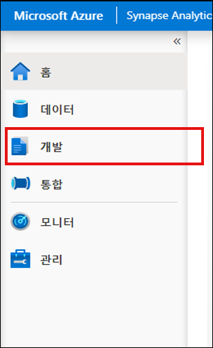

3. **+**, **Notebook**을 차례로 선택하여 새 Synapse Notebook을 만듭니다.

    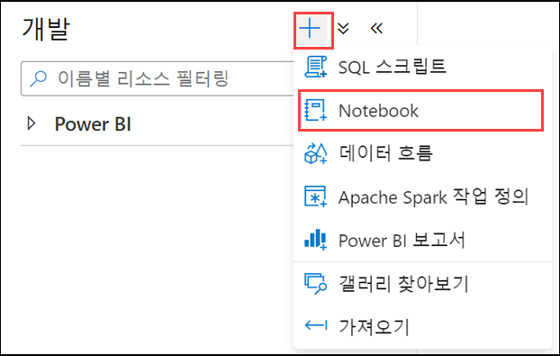

4. Notebook 이름으로 **Hyperspace**를 입력하고 **(1)** 위쪽의 **속성** 단추 **(2)** 를 선택하여 속성 창을 숨깁니다.

    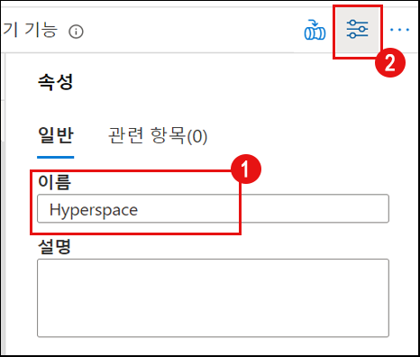

5. Notebook을 Spark 클러스터에 연결하고 언어가 **PySpark(Python)** 로 설정되어 있는지 확인합니다.

    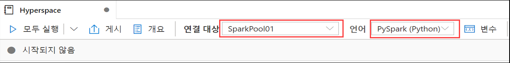

6. Notebook의 새 셀에 다음 코드를 추가합니다.

    ```python
    from hyperspace import *  
    from com.microsoft.hyperspace import *
    from com.microsoft.hyperspace.index import *

    # Spark에서 표준 SortMergeJoin을 사용하도록 BroadcastHashJoin을 사용하지 않도록 설정합니다. 현재 Hyperspace 인덱스는 쿼리를 빠르게 실행하기 위해 SortMergeJoin을 활용합니다.
    spark.conf.set("spark.sql.autoBroadcastJoinThreshold", -1)

    # 아래 값을 Synapse 작업 영역용 기본 ADSL Gen2 계정의 이름으로 바꿉니다.
    datalake = 'REPLACE_WITH_YOUR_DATALAKE_NAME'

    dfSales = spark.read.parquet("abfss://wwi-02@" + datalake + ".dfs.core.windows.net/sale-small/Year=2019/Quarter=Q4/Month=12/*/*.parquet")
    dfSales.show(10)

    dfCustomers = spark.read.load("abfss://wwi-02@" + datalake + ".dfs.core.windows.net/data-generators/generator-customer-clean.csv", format="csv", header=True)
    dfCustomers.show(10)

    # Hyperspace 인스턴스를 만듭니다.
    hyperspace = Hyperspace(spark)
    ```

    `REPLACE_WITH_YOUR_DATALAKE_NAME` 값은 Synapse 작업 영역용 기본 ADSL Gen2 계정의 이름으로 바꿉니다. 이렇게 하려면 다음 단계를 수행합니다.

    1. **데이터** 허브로 이동합니다.

        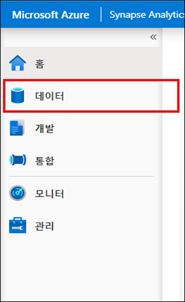

    2. **연결됨** 탭 **(1)** 을 선택하고 Azure Data Lake Storage Gen2 그룹을 확장한 다음 작업 영역 이름 옆의 기본 ADLS Gen2 이름 **(2)** 을 적어 둡니다.

        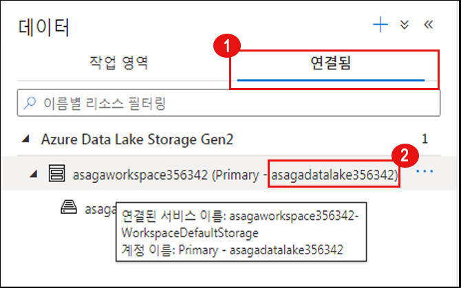

7. 새 셀을 실행합니다. 그러면 데이터 레이크의 데이터가 포함된 데이터 프레임 2개가 로드되고 Hyperspace가 초기화됩니다.

    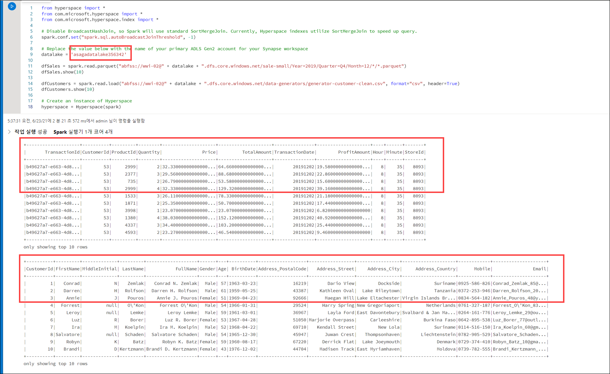

    > **참고**: 셀 왼쪽의 실행 단추를 선택하거나 `Shift+Enter`를 눌러 셀을 실행한 후 해당 셀 아래에 새 셀을 만들 수 있습니다.
    >
    > Notebook에서 셀을 처음 실행하면 새 Synapse 클러스터를 시작해야 하므로 셀을 실행하는 데 몇 분 정도 걸립니다. 그 이후에 각 셀을 실행할 때는 속도가 훨씬 빨라집니다.

8. 다음 코드를 사용하여 Notebook에 새 코드 셀을 추가합니다.

    ```python
    #인덱스 만들기: 각 인덱스에는 이름, 인덱싱된 열 집합 및 포함된 열 집합이 들어 있습니다.
    indexConfigSales = IndexConfig("indexSALES", ["CustomerId"], ["TotalAmount"])
    indexConfigCustomers = IndexConfig("indexCUSTOMERS", ["CustomerId"], ["FullName"])

    hyperspace.createIndex(dfSales, indexConfigSales)			# only create index once
    hyperspace.createIndex(dfCustomers, indexConfigCustomers)	# 인덱스는 한 번만 만들면 됩니다.
    hyperspace.indexes().show()
    ```

9. 새 셀을 실행합니다. 그러면 인덱스 2개가 작성되고 인덱스의 구조가 표시됩니다.

    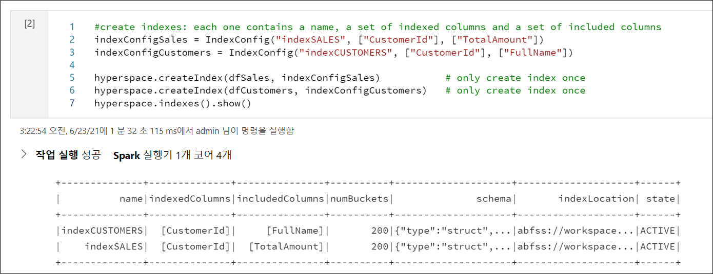

10. 다음 코드를 사용하여 Notebook에 새 코드 셀을 하나 더 추가합니다.

    ```python
    df1 = dfSales.filter("""CustomerId = 200""").select("""TotalAmount""")
    df1.show()
    df1.explain(True)
    ```

11. 새 셀을 실행합니다. 출력에는 실제 실행 계획이 인덱스를 고려하지 않는다는 내용이 표시됩니다(원래 데이터 파일에서 파일 검사를 수행함).

    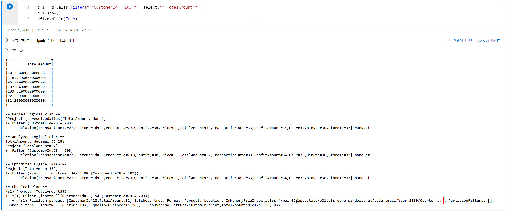

12. 이제 다음 코드를 사용하여 Notebook에 새 셀을 하나 더 추가합니다(Spark 엔진에서 Hyperspace 최적화를 사용하도록 설정하기 위해 시작 부분에 추가 줄이 사용됨).

    ```python
    # Hyperspace 사용 - Hyperspace 최적화 규칙이 Spark 최적화 프로그램에 표시됩니다. 이러한 규칙은 기존 Hyperspace 인덱스를 사용해 사용자 쿼리를 최적화합니다.
    Hyperspace.enable(spark)
    df1 = dfSales.filter("""CustomerId = 200""").select("""TotalAmount""")
    df1.show()
    df1.explain(True)
    ```

13. 새 셀을 실행합니다. 출력에는 이제 실제 실행 계획이 원래 데이터 파일 대신 인덱스를 사용한다는 내용이 표시됩니다.

    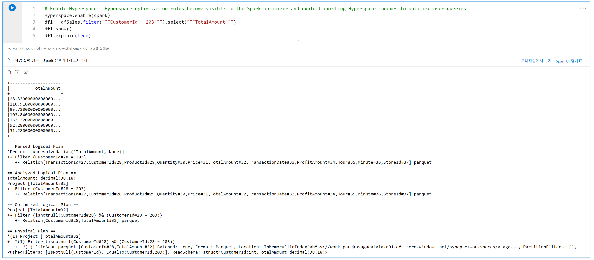

14. Hyperspace에서 제공하는 Explain API를 사용하면 인덱스를 사용하지 않는 경우와 사용하는 경우의 실행 계획을 비교할 수 있습니다. 다음 코드를 사용하여 새 셀을 추가합니다.

    ```python
    df1 = dfSales.filter("""CustomerId = 200""").select("""TotalAmount""")

    spark.conf.set("spark.hyperspace.explain.displayMode", "html")
    hyperspace.explain(df1, True, displayHTML)
    ```

15. 새 셀을 실행합니다. 출력에는 `Plan with indexes`과 `Plan without indexes`을 비교한 내용이 표시됩니다. 인덱스 파일이 사용된 첫 번째 경우와 원래 데이터 파일이 사용된 두 번째 경우를 비교하여 살펴봅니다.

    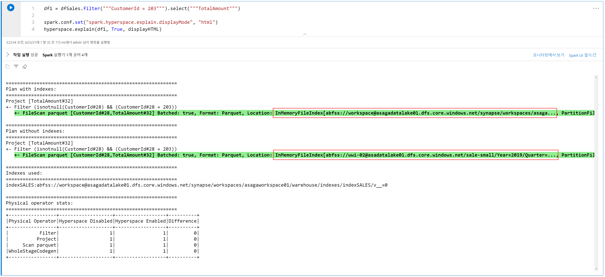

16. 이제 조인 작업이 포함된 더 복잡한 사례를 살펴보겠습니다. 다음 코드를 사용하여 새 셀을 추가합니다.

    ```python
    eqJoin = dfSales.join(dfCustomers, dfSales.CustomerId == dfCustomers.CustomerId).select(dfSales.TotalAmount, dfCustomers.FullName)

    hyperspace.explain(eqJoin, True, displayHTML)
    ```

17. 새 셀을 실행합니다. 이번에도 출력에는 `Plan with indexes` 과 `Plan without indexes` 을 비교한 내용이 표시됩니다. 앞에서와 마찬가지로 첫 번째 경우에는 인덱스가 사용되었고 두 번째 경우에는 원래 데이터 파일이 사용되었습니다.

    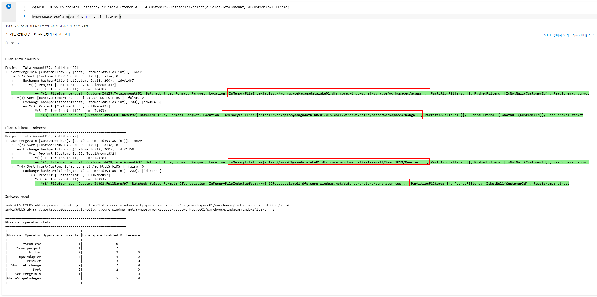

    Hyperspace를 비활성화하고 인덱스를 정리하려는 경우 다음 코드를 실행하면 됩니다.

    ```python
    # Hyperspace 사용 안 함 - 쿼리 최적화 중에 Hyperspace 규칙이 더 이상 적용되지 않습니다. Hyperspace를 사용하지 않도록 설정하도 작성된 인덱스는 그대로 유지되므로 아무런 영향이 없습니다.
    Hyperspace.disable(spark)

    hyperspace.deleteIndex("indexSALES")
    hyperspace.vacuumIndex("indexSALES")
    hyperspace.deleteIndex("indexCUSTOMERS")
    hyperspace.vacuumIndex("indexCUSTOMERS")
    ```

#### 작업 2: MSSparkUtil 라이브러리를 사용하여 데이터 레이크 스토리지 살펴보기

Microsoft Spark Utilities(MSSparkUtils)는 일반적인 작업을 쉽게 수행하기 위해 사용할 수 있는 기본 제공 패키지입니다. MSSparkUtils를 활용하면 파일 시스템과 비밀을 사용하고 환경 변수를 가져올 수 있습니다.

1. 이전 작업에서 사용한 것과 같은 Notebook을 계속 사용하여 다음 코드를 입력해 새 셀을 추가합니다.

    ```python
    from notebookutils import mssparkutils

    #
    # Microsoft Spark Utilities
    #
    # https://docs.microsoft.com/ko-kr/azure/synapse-analytics/spark/microsoft-spark-utilities?pivots=programming-language-python
    #

    # Azure 스토리지 액세스 정보
    blob_account_name = datalake
    blob_container_name = 'wwi-02'
    blob_relative_path = '/'
    linkedServiceName = datalake
    blob_sas_token = mssparkutils.credentials.getConnectionStringOrCreds(linkedServiceName)

    # Spark가 원격으로 Blob에서 액세스 가능하도록 허용
    spark.conf.set('fs.azure.sas.%s.%s.blob.core.windows.net' % (blob_container_name, blob_account_name), blob_sas_token)

    files = mssparkutils.fs.ls('/')
    for file in files:
        print(file.name, file.isDir, file.isFile, file.path, file.size)

    mssparkutils.fs.mkdirs('/SomeNewFolder')

    files = mssparkutils.fs.ls('/')
    for file in files:
        print(file.name, file.isDir, file.isFile, file.path, file.size)
    ```

2. 새 셀을 실행하여 `mssparkutils`를 통해 파일 시스템을 사용하는 방법을 살펴봅니다.

### 리소스

이 랩에서 다룬 토픽에 대해 자세히 알아보려면 다음 리소스를 참조하세요.

- [Azure Synapse Analytics의 Apache Spark](https://docs.microsoft.com/azure/synapse-analytics/spark/apache-spark-overview)
- [Azure Synapse용 Azure Data Explorer 데이터 커넥터 발표](https://techcommunity.microsoft.com/t5/azure-data-explorer/announcing-azure-data-explorer-data-connector-for-azure-synapse/ba-p/1743868)
- [Azure Synapse Analytics용 Apache Spark를 사용하여 Azure Data Explorer에 연결](https://docs.microsoft.com/azure/synapse-analytics/quickstart-connect-azure-data-explorer)
- [Azure Synapse Analytics 공유 메타데이터](https://docs.microsoft.com/azure/synapse-analytics/metadata/overview)
- [Microsoft Spark Utilities 소개](https://docs.microsoft.com/azure/synapse-analytics/spark/microsoft-spark-utilities?pivots=programming-language-python)
- [Hyperspace - Apache Spark™ 및 빅 데이터 워크로드용 인덱스 기반 쿼리 가속화 기능을 제공하는 오픈 소스 인덱싱 하위 시스템](https://github.com/microsoft/hyperspace)
