# 모듈 2 - 서비스 제공 레이어 디자인 및 구현

이 모듈에서는 최신 데이터 웨어하우스에서 데이터 저장소를 디자인 및 구현하여 분석 워크로드를 최적화하는 방법을 배웁니다. 구체적으로는 팩트 데이터와 차원 데이터를 저장할 다차원 스키마를 디자인하는 방법을 알아봅니다. 그런 후에는 Azure Data Factory에서 데이터를 증분 방식으로 로드하여 느린 변경 차원에 데이터를 입력하는 방법도 알아봅니다.

이 모듈을 완료하면 다음 작업을 수행할 수 있습니다.

- 분석 워크로드용 별모양 스키마 디자인(OLAP)
- Azure Data Factory 및 매핑 데이터 흐름을 사용해 느린 변경 차원에 데이터 입력

## 랩 세부 정보

- [모듈 2 - 서비스 제공 레이어 디자인 및 구현](#module-2---design-and-implement-the-serving-layer)
  - [랩 세부 정보](#lab-details)
    - [랩 설정 및 필수 구성 요소](#lab-setup-and-pre-requisites)
  - [연습 0: 전용 SQL 풀 시작](#exercise-0-start-the-dedicated-sql-pool)
  - [연습 1: 별모양 스키마 구현](#exercise-1-implementing-a-star-schema)
    - [작업 1: SQL 데이터베이스에서 별모양 스키마 만들기](#task-1-create-star-schema-in-sql-database)
  - [연습 2: 눈송이 스키마 구현](#exercise-2-implementing-a-snowflake-schema)
    - [작업 1: SQL 데이터베이스에서 제품 눈송이 스키마 만들기](#task-1-create-product-snowflake-schema-in-sql-database)
    - [작업 2: SQL 데이터베이스에서 재판매인 눈송이 스키마 만들기](#task-2-create-reseller-snowflake-schema-in-sql-database)
  - [연습 3: 시간 차원 테이블 구현](#exercise-3-implementing-a-time-dimension-table)
    - [작업 1: 시간 차원 테이블 만들기](#task-1-create-time-dimension-table)
    - [작업 2: 시간 차원 테이블에 데이터 입력](#task-2-populate-the-time-dimension-table)
    - [작업 3: 다른 테이블에 데이터 로드](#task-3-load-data-into-other-tables)
    - [작업 4: 데이터 쿼리](#task-4-query-data)
  - [연습 4: Synapse Analytics에서 별모양 스키마 구현](#exercise-4-implementing-a-star-schema-in-synapse-analytics)
    - [작업 1: Synapse 전용 SQL에서 별모양 스키마 만들기](#task-1-create-star-schema-in-synapse-dedicated-sql)
    - [작업 2: Synapse 테이블에 데이터 로드](#task-2-load-data-into-synapse-tables)
    - [작업 3: Synapse에서 데이터 쿼리](#task-3-query-data-from-synapse)
  - [연습 5: 매핑 데이터 흐름을 사용하여 느린 변경 차원 업데이트](#exercise-5-updating-slowly-changing-dimensions-with-mapping-data-flows)
    - [작업 1: Azure SQL Database 연결된 서비스 만들기](#task-1-create-the-azure-sql-database-linked-service)
    - [작업 2: 매핑 데이터 흐름 만들기](#task-2-create-a-mapping-data-flow)
    - [작업 3: 파이프라인 만들기 및 데이터 흐름 실행](#task-3-create-a-pipeline-and-run-the-data-flow)
    - [작업 4: 삽입된 데이터 확인](#task-4-view-inserted-data)
    - [작업 5: 원본 고객 레코드 업데이트](#task-5-update-a-source-customer-record)
    - [작업 6: 매핑 데이터 흐름 다시 실행](#task-6-re-run-mapping-data-flow)
    - [작업 7: 업데이트된 레코드 확인](#task-7-verify-record-updated)
  - [연습 6: 정리](#exercise-6-cleanup)
    - [작업 1: 전용 SQL 풀 일시 중지](#task-1-pause-the-dedicated-sql-pool)

### 랩 설정 및 필수 구성 요소

> **참고:** `Lab setup and pre-requisites` 단계는 호스트된 랩 환경이 **아닌**자체 Azure 구독을 사용하는 경우에만 완료하세요. 호스트된 랩 환경을 사용하는 경우에는 연습 0부터 바로 진행하면 됩니다.

1. 이 모듈의 [랩 설정 지침](https://github.com/solliancenet/microsoft-data-engineering-ilt-deploy/blob/main/setup/02/README.md)에 나와 있는 작업을 아직 진행하지 않았으면 진행합니다.

2. 컴퓨터 또는 랩 가상 머신에 [Azure Data Studio](https://docs.microsoft.com/sql/azure-data-studio/download-azure-data-studio?view=sql-server-ver15)를 설치합니다.

## 연습 0: 전용 SQL 풀 시작

이 랩에서는 전용 SQL 풀을 사용합니다. 그러므로 첫 단계에서는 풀이 일시 중지되지 않았는지를 확인해야 합니다. 풀이 일시 중지되었다면 아래 지침에 따라 풀을 시작합니다.

1. Synapse Studio(<https://web.azuresynapse.net/>)를 엽니다.

2. **관리** 허브를 선택합니다.

    

3. 왼쪽 메뉴에서 **SQL 풀**을 선택합니다 **(1)**. 전용 SQL 풀이 일시 중지되어 있으면 풀 이름을 커서로 가리키고 **다시 시작(2)** 을 선택합니다.

    

4. 메시지가 표시되면 **다시 시작**을 선택합니다. 풀이 다시 시작되려면 1~2분 정도 걸립니다.

    

> 전용 SQL 풀이 다시 시작되는 동안 **다음 연습을 계속 진행**합니다.

## 연습 1: 별모양 스키마 구현

별모양 스키마는 관계형 데이터 웨어하우스에 널리 채택되고 있는 완성도가 높은 모델링 방식입니다. 별모양 스키마를 사용하려면 모델러가 모델 테이블을 차원 또는 팩트로 분류해야 합니다.

**차원 테이블**은 비즈니스 엔터티, 즉 모델링 대상 항목을 설명합니다. 엔터티에는 시간 자체를 포함하여 제품, 사람, 장소 및 개념이 포함될 수 있습니다. 별모양 스키마에서 가장 많이 사용되는 테이블은 날짜 차원 테이블입니다. 차원 테이블에는 고유 식별자로 사용되는 키 열 하나 이상과 설명 열이 포함됩니다.

차원 테이블에 포함된 특성 데이터는 변경될 수도 있지만, 일반적으로는 변경 빈도가 낮습니다. 예를 들어 고객의 이름과 주소는 차원 테이블에 저장되고, 고객 프로필이 변경될 때만 업데이트됩니다. 대형 팩트 테이블의 크기를 최소화하려는 경우에는 고객 이름과 주소를 팩트 테이블의 모든 행에 포함하지 않아도 됩니다. 대신, 팩트 테이블과 차원 테이블에서 고객 ID를 공유할 수 있습니다. 쿼리는 두 테이블을 조인하여 고객 프로필과 트랜잭션을 연결할 수 있습니다.

판매 주문, 재고 잔고, 환율, 온도 등의 관찰 내용이나 이벤트가 저장되는 **팩트 테이블**에는 차원 테이블과의 관계 설정용 차원 키 열과 숫자 측정값 열이 포함됩니다. 차원 키 열은 팩트 테이블의 차원을 결정하는 반면, 차원 키 값은 팩트 테이블의 세분성을 결정합니다. `Date` 및 `ProductKey`의 차원 키 열 2개가 있는 팩트 테이블에 영업 목표를 저장하려는 경우를 예로 들어 보겠습니다. 차원 키 열이 2개이므로 이 테이블의 차원이 2개라는 것은 쉽게 파악할 수 있습니다. 하지만 테이블의 세분성을 확인하려면 차원 키 값을 파악해야 합니다. 이 예에서는 Date 열에 저장되는 값이 매월 1일이라고 가정하겠습니다. 그러면 세분성은 월-제품 수준으로 설정됩니다.

차원 테이블에는 대개 비교적 적은 수의 행이 포함됩니다. 반면 팩트 테이블은 매우 많은 수의 행을 포함할 수 있으며, 행 수는 계속 증가할 수 있습니다.

아래의 예제 별모양 스키마에서는 가운데에 팩트 테이블이 있고 양쪽에 차원 테이블이 있습니다.


### 작업 1: SQL 데이터베이스에서 별모양 스키마 만들기

이 작업에서는 외래 키 제약 조건을 사용하여 SQL 데이터베이스에서 별모양 스키마를 만듭니다. 첫 단계에서는 기본 차원과 팩트 테이블을 만듭니다.

1. Azure Portal(<https://portal.azure.com>)에 로그인합니다.

2. 이 랩용 리소스 그룹을 열고 **SourceDB** SQL 데이터베이스를 선택합니다.

    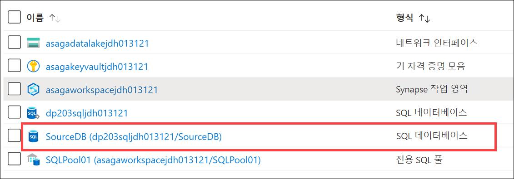

3. 개요 창에서 **서버 이름** 값을 복사합니다.

    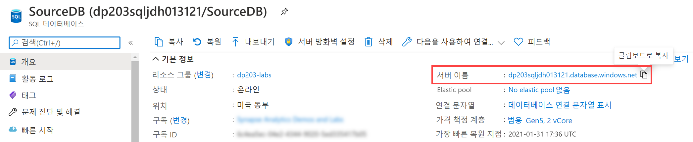

4. Azure Data Studio를 엽니다.

5. 왼쪽 메뉴에서 **서버**를 선택하고 **연결 추가**를 클릭합니다.

    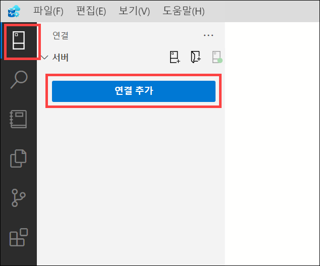

6. 연결 세부 정보 양식에서 다음 정보를 입력합니다.

    - **서버**: SourceDB 서버 이름 값을 여기에 붙여넣습니다.
    - **인증 유형**: `SQL Login`을 선택합니다.
    - **사용자 이름**: `sqladmin`을 입력합니다.
    - **암호**: 랩 환경 배포 시 제공한 또는 호스트된 랩 환경의 일부로 제공된 암호를 입력합니다.
    - **암호 저장**: 선택합니다.
    - **데이터베이스**: `SourceDB`를 선택합니다.

    

7. **연결**을 선택합니다.

8. 왼쪽 메뉴에서 **서버**를 선택하고 랩을 시작할 때 추가한 SQL Server를 마우스 오른쪽 단추로 클릭합니다. **새 쿼리**를 선택합니다.

    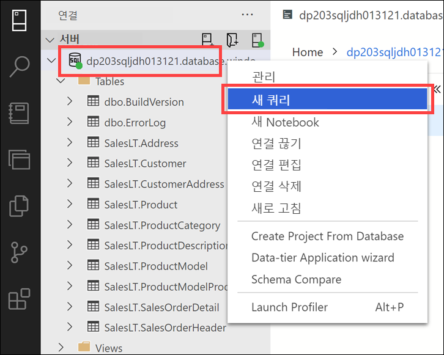

9. 쿼리 창에 다음 코드를 붙여넣어 차원 테이블과 팩트 테이블을 만듭니다.

    ```sql
    CREATE TABLE [dbo].[DimReseller](
        [ResellerKey] [int] IDENTITY(1,1) NOT NULL,
        [GeographyKey] [int] NULL,
        [ResellerAlternateKey] [nvarchar](15) NULL,
        [Phone] [nvarchar](25) NULL,
        [BusinessType] [varchar](20) NOT NULL,
        [ResellerName] [nvarchar](50) NOT NULL,
        [NumberEmployees] [int] NULL,
        [OrderFrequency] [char](1) NULL,
        [OrderMonth] [tinyint] NULL,
        [FirstOrderYear] [int] NULL,
        [LastOrderYear] [int] NULL,
        [ProductLine] [nvarchar](50) NULL,
        [AddressLine1] [nvarchar](60) NULL,
        [AddressLine2] [nvarchar](60) NULL,
        [AnnualSales] [money] NULL,
        [BankName] [nvarchar](50) NULL,
        [MinPaymentType] [tinyint] NULL,
        [MinPaymentAmount] [money] NULL,
        [AnnualRevenue] [money] NULL,
        [YearOpened] [int] NULL
    );
    GO

    CREATE TABLE [dbo].[DimEmployee](
        [EmployeeKey] [int] IDENTITY(1,1) NOT NULL,
        [ParentEmployeeKey] [int] NULL,
        [EmployeeNationalIDAlternateKey] [nvarchar](15) NULL,
        [ParentEmployeeNationalIDAlternateKey] [nvarchar](15) NULL,
        [SalesTerritoryKey] [int] NULL,
        [FirstName] [nvarchar](50) NOT NULL,
        [LastName] [nvarchar](50) NOT NULL,
        [MiddleName] [nvarchar](50) NULL,
        [NameStyle] [bit] NOT NULL,
        [Title] [nvarchar](50) NULL,
        [HireDate] [date] NULL,
        [BirthDate] [date] NULL,
        [LoginID] [nvarchar](256) NULL,
        [EmailAddress] [nvarchar](50) NULL,
        [Phone] [nvarchar](25) NULL,
        [MaritalStatus] [nchar](1) NULL,
        [EmergencyContactName] [nvarchar](50) NULL,
        [EmergencyContactPhone] [nvarchar](25) NULL,
        [SalariedFlag] [bit] NULL,
        [Gender] [nchar](1) NULL,
        [PayFrequency] [tinyint] NULL,
        [BaseRate] [money] NULL,
        [VacationHours] [smallint] NULL,
        [SickLeaveHours] [smallint] NULL,
        [CurrentFlag] [bit] NOT NULL,
        [SalesPersonFlag] [bit] NOT NULL,
        [DepartmentName] [nvarchar](50) NULL,
        [StartDate] [date] NULL,
        [EndDate] [date] NULL,
        [Status] [nvarchar](50) NULL,
	    [EmployeePhoto] [varbinary](max) NULL
    );
    GO

    CREATE TABLE [dbo].[DimProduct](
        [ProductKey] [int] IDENTITY(1,1) NOT NULL,
        [ProductAlternateKey] [nvarchar](25) NULL,
        [ProductSubcategoryKey] [int] NULL,
        [WeightUnitMeasureCode] [nchar](3) NULL,
        [SizeUnitMeasureCode] [nchar](3) NULL,
        [EnglishProductName] [nvarchar](50) NOT NULL,
        [SpanishProductName] [nvarchar](50) NOT NULL,
        [FrenchProductName] [nvarchar](50) NOT NULL,
        [StandardCost] [money] NULL,
        [FinishedGoodsFlag] [bit] NOT NULL,
        [Color] [nvarchar](15) NOT NULL,
        [SafetyStockLevel] [smallint] NULL,
        [ReorderPoint] [smallint] NULL,
        [ListPrice] [money] NULL,
        [Size] [nvarchar](50) NULL,
        [SizeRange] [nvarchar](50) NULL,
        [Weight] [float] NULL,
        [DaysToManufacture] [int] NULL,
        [ProductLine] [nchar](2) NULL,
        [DealerPrice] [money] NULL,
        [Class] [nchar](2) NULL,
        [Style] [nchar](2) NULL,
        [ModelName] [nvarchar](50) NULL,
        [LargePhoto] [varbinary](max) NULL,
        [EnglishDescription] [nvarchar](400) NULL,
        [FrenchDescription] [nvarchar](400) NULL,
        [ChineseDescription] [nvarchar](400) NULL,
        [ArabicDescription] [nvarchar](400) NULL,
        [HebrewDescription] [nvarchar](400) NULL,
        [ThaiDescription] [nvarchar](400) NULL,
        [GermanDescription] [nvarchar](400) NULL,
        [JapaneseDescription] [nvarchar](400) NULL,
        [TurkishDescription] [nvarchar](400) NULL,
        [StartDate] [datetime] NULL,
        [EndDate] [datetime] NULL,
        [Status] [nvarchar](7) NULL
    );
    GO

    CREATE TABLE [dbo].[FactResellerSales](
        [ProductKey] [int] NOT NULL,
        [OrderDateKey] [int] NOT NULL,
        [DueDateKey] [int] NOT NULL,
        [ShipDateKey] [int] NOT NULL,
        [ResellerKey] [int] NOT NULL,
        [EmployeeKey] [int] NOT NULL,
        [PromotionKey] [int] NOT NULL,
        [CurrencyKey] [int] NOT NULL,
        [SalesTerritoryKey] [int] NOT NULL,
        [SalesOrderNumber] [nvarchar](20) NOT NULL,
        [SalesOrderLineNumber] [tinyint] NOT NULL,
        [RevisionNumber] [tinyint] NULL,
        [OrderQuantity] [smallint] NULL,
        [UnitPrice] [money] NULL,
        [ExtendedAmount] [money] NULL,
        [UnitPriceDiscountPct] [float] NULL,
        [DiscountAmount] [float] NULL,
        [ProductStandardCost] [money] NULL,
        [TotalProductCost] [money] NULL,
        [SalesAmount] [money] NULL,
        [TaxAmt] [money] NULL,
        [Freight] [money] NULL,
        [CarrierTrackingNumber] [nvarchar](25) NULL,
        [CustomerPONumber] [nvarchar](25) NULL,
        [OrderDate] [datetime] NULL,
        [DueDate] [datetime] NULL,
        [ShipDate] [datetime] NULL
    );
    GO
    ```

10. **실행**을 선택하거나 `F5` 키를 눌러 쿼리를 실행합니다.

    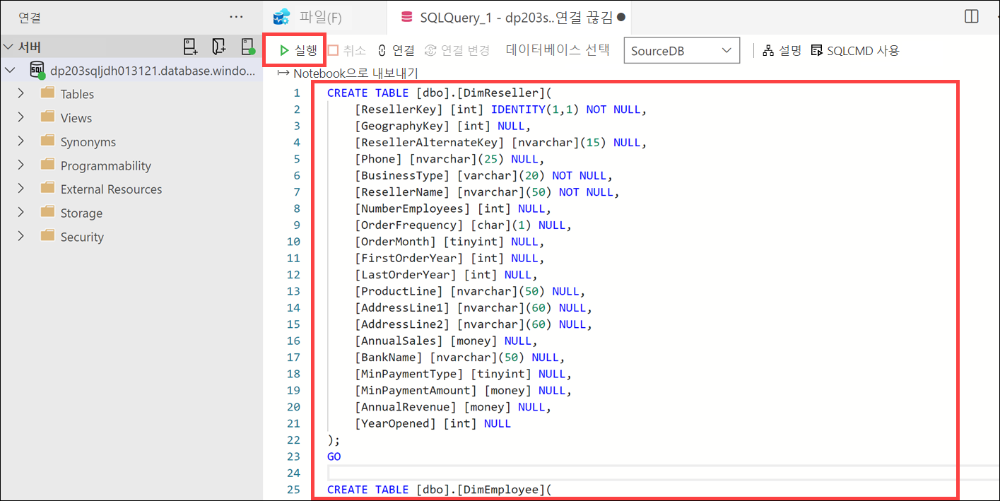

    차원 테이블 3개와 팩트 테이블 하나를 만들었습니다. 이러한 테이블로 별모양 스키마를 만들 것입니다.

    

    하지만 여기서는 SQL 데이터베이스를 사용하므로 외래 키 관계와 제약 조건을 추가해 관계를 정의하고 테이블 값을 적용할 수 있습니다.

11. 쿼리를 다음 코드로 바꾼 다음 **실행**하여 `DimReseller` 기본 키와 제약 조건을 만듭니다.

    ```sql
    -- Create DimReseller PK
    ALTER TABLE [dbo].[DimReseller] WITH CHECK ADD 
        CONSTRAINT [PK_DimReseller_ResellerKey] PRIMARY KEY CLUSTERED 
        (
            [ResellerKey]
        )  ON [PRIMARY];
    GO

    -- Create DimReseller unique constraint
    ALTER TABLE [dbo].[DimReseller] ADD  CONSTRAINT [AK_DimReseller_ResellerAlternateKey] UNIQUE NONCLUSTERED 
    (
        [ResellerAlternateKey] ASC
    )WITH (PAD_INDEX = OFF, STATISTICS_NORECOMPUTE = OFF, SORT_IN_TEMPDB = OFF, IGNORE_DUP_KEY = OFF, ONLINE = OFF, ALLOW_ROW_LOCKS = ON, ALLOW_PAGE_LOCKS = ON)
    GO
    ```

12. 쿼리를 다음 코드로 바꾼 다음 **실행**하여 `DimEmployee` 기본 키를 만듭니다.

    ```sql
    -- Create DimEmployee PK
    ALTER TABLE [dbo].[DimEmployee] WITH CHECK ADD 
        CONSTRAINT [PK_DimEmployee_EmployeeKey] PRIMARY KEY CLUSTERED 
        (
        [EmployeeKey]
        )  ON [PRIMARY];
    GO
    ```

13. 쿼리를 다음 코드로 바꾼 다음 **실행**하여 `DimProduct` 기본 키와 제약 조건을 만듭니다.

    ```sql
    -- Create DimProduct PK
    ALTER TABLE [dbo].[DimProduct] WITH CHECK ADD 
        CONSTRAINT [PK_DimProduct_ProductKey] PRIMARY KEY CLUSTERED 
        (
            [ProductKey]
        )  ON [PRIMARY];
    GO

    -- Create DimProduct unique constraint
    ALTER TABLE [dbo].[DimProduct] ADD  CONSTRAINT [AK_DimProduct_ProductAlternateKey_StartDate] UNIQUE NONCLUSTERED 
    (
        [ProductAlternateKey] ASC,
        [StartDate] ASC
    )WITH (PAD_INDEX = OFF, STATISTICS_NORECOMPUTE = OFF, SORT_IN_TEMPDB = OFF, IGNORE_DUP_KEY = OFF, ONLINE = OFF, ALLOW_ROW_LOCKS = ON, ALLOW_PAGE_LOCKS = ON)
    GO
    ```

    > 이제 팩트 테이블과 차원 테이블 간의 관계를 작성하여 별모양 스키마를 명확하게 정의할 수 있습니다.

14. 쿼리를 다음 코드로 바꾼 다음 **실행**하여 `FactResellerSales` 기본 키 및 외래 키 관계를 만듭니다.

    ```sql
    -- Create FactResellerSales PK
    ALTER TABLE [dbo].[FactResellerSales] WITH CHECK ADD 
        CONSTRAINT [PK_FactResellerSales_SalesOrderNumber_SalesOrderLineNumber] PRIMARY KEY CLUSTERED 
        (
            [SalesOrderNumber], [SalesOrderLineNumber]
        )  ON [PRIMARY];
    GO

    -- Create foreign key relationships to the dimension tables
    ALTER TABLE [dbo].[FactResellerSales] ADD
        CONSTRAINT [FK_FactResellerSales_DimEmployee] FOREIGN KEY([EmployeeKey])
                REFERENCES [dbo].[DimEmployee] ([EmployeeKey]),
        CONSTRAINT [FK_FactResellerSales_DimProduct] FOREIGN KEY([ProductKey])
                REFERENCES [dbo].[DimProduct] ([ProductKey]),
        CONSTRAINT [FK_FactResellerSales_DimReseller] FOREIGN KEY([ResellerKey])
                REFERENCES [dbo].[DimReseller] ([ResellerKey]);
    GO
    ```

    이제 별모양 스키마에서 팩트 테이블과 차원 테이블 간의 관계가 정의되었습니다. 테이블을 다이어그램에 정렬하는 경우에는 SQL Server Management Studio 등의 도구를 사용하면 관계를 명확하게 확인할 수 있습니다.

    

## 연습 2: 눈송이 스키마 구현

**눈송이 스키마**는 단일 비즈니스 엔터티용으로 일반화된 테이블 집합입니다. 제품을 범주와 하위 범주로 분류하는 Adventure Works의 경우를 예로 들어 보겠습니다. Adventure Works에서는 범주와 제품이 하위 범주에 할당됩니다. Adventure Works 관계형 데이터 웨어하우스에서는 제품 차원이 일반화되어 `DimProductCategory`, `DimProductSubcategory`, `DimProduct`의 3개 관련 테이블에 저장됩니다.

눈송이 스키마는 별모양 스키마의 변형이라 할 수 있습니다. 즉, 별모양 스키마에 일반화된 차원 테이블을 추가하여 눈송이 패턴을 만들 수 있습니다. 아래 다이어그램에는 가운데에 파란색 팩트 테이블이 있고 그 주위에 노란색 차원 테이블 여러 개가 있습니다. 대다수 차원 테이블에는 비즈니스 엔터티 일반화를 위한 관계가 설정됩니다.


### 작업 1: SQL 데이터베이스에서 제품 눈송이 스키마 만들기

이 작업에서는 `DimProductCategory` 및 `DimProductSubcategory`의 새 차원 테이블 2개를 추가합니다. 그런 다음 이 두 테이블과 `DimProduct` 테이블 간의 관계를 작성하여 일반화된 제품 차원, 즉 눈송이 차원을 만듭니다. 그러면 별모양 스키마가 업데이트되어 일반화된 제품 차원이 포함되므로 해당 스키마가 눈송이 스키마로 변환됩니다.

1. Azure Data Explorer를 엽니다.

2. 왼쪽 메뉴에서 **서버**를 선택하고 랩을 시작할 때 추가한 SQL Server를 마우스 오른쪽 단추로 클릭합니다. **새 쿼리**를 선택합니다.

    

3. 쿼리 창에 다음 코드를 붙여넣은 다음 **실행**하여 새 차원 테이블을 만듭니다.

    ```sql
    CREATE TABLE [dbo].[DimProductCategory](
        [ProductCategoryKey] [int] IDENTITY(1,1) NOT NULL,
        [ProductCategoryAlternateKey] [int] NULL,
        [EnglishProductCategoryName] [nvarchar](50) NOT NULL,
        [SpanishProductCategoryName] [nvarchar](50) NOT NULL,
        [FrenchProductCategoryName] [nvarchar](50) NOT NULL
    );
    GO

    CREATE TABLE [dbo].[DimProductSubcategory](
        [ProductSubcategoryKey] [int] IDENTITY(1,1) NOT NULL,
        [ProductSubcategoryAlternateKey] [int] NULL,
        [EnglishProductSubcategoryName] [nvarchar](50) NOT NULL,
        [SpanishProductSubcategoryName] [nvarchar](50) NOT NULL,
        [FrenchProductSubcategoryName] [nvarchar](50) NOT NULL,
        [ProductCategoryKey] [int] NULL
    );
    GO
    ```

4. 쿼리를 다음 코드로 바꾼 다음 **실행**하여 `DimProductCategory` 및 `DimProductSubcategory` 기본 키와 제약 조건을 만듭니다.

    ```sql
    -- Create DimProductCategory PK
    ALTER TABLE [dbo].[DimProductCategory] WITH CHECK ADD 
        CONSTRAINT [PK_DimProductCategory_ProductCategoryKey] PRIMARY KEY CLUSTERED 
        (
            [ProductCategoryKey]
        )  ON [PRIMARY];
    GO

    -- Create DimProductSubcategory PK
    ALTER TABLE [dbo].[DimProductSubcategory] WITH CHECK ADD 
        CONSTRAINT [PK_DimProductSubcategory_ProductSubcategoryKey] PRIMARY KEY CLUSTERED 
        (
            [ProductSubcategoryKey]
        )  ON [PRIMARY];
    GO

    -- Create DimProductCategory unique constraint
    ALTER TABLE [dbo].[DimProductCategory] ADD  CONSTRAINT [AK_DimProductCategory_ProductCategoryAlternateKey] UNIQUE NONCLUSTERED 
    (
        [ProductCategoryAlternateKey] ASC
    )WITH (PAD_INDEX = OFF, STATISTICS_NORECOMPUTE = OFF, SORT_IN_TEMPDB = OFF, IGNORE_DUP_KEY = OFF, ONLINE = OFF, ALLOW_ROW_LOCKS = ON, ALLOW_PAGE_LOCKS = ON)
    GO

    -- Create DimProductSubcategory unique constraint
    ALTER TABLE [dbo].[DimProductSubcategory] ADD  CONSTRAINT [AK_DimProductSubcategory_ProductSubcategoryAlternateKey] UNIQUE NONCLUSTERED 
    (
        [ProductSubcategoryAlternateKey] ASC
    )WITH (PAD_INDEX = OFF, STATISTICS_NORECOMPUTE = OFF, SORT_IN_TEMPDB = OFF, IGNORE_DUP_KEY = OFF, ONLINE = OFF, ALLOW_ROW_LOCKS = ON, ALLOW_PAGE_LOCKS = ON)
    GO
    ```

5. 쿼리를 다음 코드로 바꾼 다음 **실행**하여 `DimProduct`와 `DimProductSubcategory`, 그리고 `DimProductSubcategory`와 `DimProductCategory` 간의 외래 키 관계를 만듭니다.

    ```sql
    -- Create foreign key relationship between DimProduct and DimProductSubcategory
    ALTER TABLE [dbo].[DimProduct] ADD 
        CONSTRAINT [FK_DimProduct_DimProductSubcategory] FOREIGN KEY 
        (
            [ProductSubcategoryKey]
        ) REFERENCES [dbo].[DimProductSubcategory] ([ProductSubcategoryKey]);
    GO

    -- Create foreign key relationship between DimProductSubcategory and DimProductCategory
    ALTER TABLE [dbo].[DimProductSubcategory] ADD 
        CONSTRAINT [FK_DimProductSubcategory_DimProductCategory] FOREIGN KEY 
        (
            [ProductCategoryKey]
        ) REFERENCES [dbo].[DimProductCategory] ([ProductCategoryKey]);
    GO
    ```

    제품 테이블 3개를 단일 비즈니스 엔터티, 즉 제품 차원으로 일반화하여 눈송이 차원을 만들었습니다.

    

    다이어그램에 다른 테이블을 추가하면 제품 테이블이 일반화되어 별모양 스키마가 눈송이 스키마로 변환됨을 확인할 수 있습니다. 테이블을 다이어그램에 정렬하는 경우에는 SQL Server Management Studio 등의 도구를 사용하면 관계를 명확하게 확인할 수 있습니다.

    

### 작업 2: SQL 데이터베이스에서 재판매인 눈송이 스키마 만들기

이 작업에서는 `DimCustomer` 및 `DimGeography`의 새 차원 테이블 2개를 추가합니다. 그런 다음 이 두 테이블과 `DimReseller` 테이블 간의 관계를 작성하여 일반화된 재판매인 차원, 즉 눈송이 차원을 만듭니다.

1. 쿼리 창에 다음 코드를 붙여넣은 다음 **실행**하여 새 차원 테이블을 만듭니다.

    ```sql
    CREATE TABLE [dbo].[DimCustomer](
        [CustomerKey] [int] IDENTITY(1,1) NOT NULL,
        [GeographyKey] [int] NULL,
        [CustomerAlternateKey] [nvarchar](15) NOT NULL,
        [Title] [nvarchar](8) NULL,
        [FirstName] [nvarchar](50) NULL,
        [MiddleName] [nvarchar](50) NULL,
        [LastName] [nvarchar](50) NULL,
        [NameStyle] [bit] NULL,
        [BirthDate] [date] NULL,
        [MaritalStatus] [nchar](1) NULL,
        [Suffix] [nvarchar](10) NULL,
        [Gender] [nvarchar](1) NULL,
        [EmailAddress] [nvarchar](50) NULL,
        [YearlyIncome] [money] NULL,
        [TotalChildren] [tinyint] NULL,
        [NumberChildrenAtHome] [tinyint] NULL,
        [EnglishEducation] [nvarchar](40) NULL,
        [SpanishEducation] [nvarchar](40) NULL,
        [FrenchEducation] [nvarchar](40) NULL,
        [EnglishOccupation] [nvarchar](100) NULL,
        [SpanishOccupation] [nvarchar](100) NULL,
        [FrenchOccupation] [nvarchar](100) NULL,
        [HouseOwnerFlag] [nchar](1) NULL,
        [NumberCarsOwned] [tinyint] NULL,
        [AddressLine1] [nvarchar](120) NULL,
        [AddressLine2] [nvarchar](120) NULL,
        [Phone] [nvarchar](20) NULL,
        [DateFirstPurchase] [date] NULL,
        [CommuteDistance] [nvarchar](15) NULL
    );
    GO

    CREATE TABLE [dbo].[DimGeography](
        [GeographyKey] [int] IDENTITY(1,1) NOT NULL,
        [City] [nvarchar](30) NULL,
        [StateProvinceCode] [nvarchar](3) NULL,
        [StateProvinceName] [nvarchar](50) NULL,
        [CountryRegionCode] [nvarchar](3) NULL,
        [EnglishCountryRegionName] [nvarchar](50) NULL,
        [SpanishCountryRegionName] [nvarchar](50) NULL,
        [FrenchCountryRegionName] [nvarchar](50) NULL,
        [PostalCode] [nvarchar](15) NULL,
        [SalesTerritoryKey] [int] NULL,
        [IpAddressLocator] [nvarchar](15) NULL
    );
    GO
    ```

2. 쿼리를 다음 코드로 바꾼 다음 **실행**하여 `DimCustomer` 및 `DimGeography` 기본 키를 만들고 `DimCustomer` 테이블에 고유 비클러스터형 인덱스를 만듭니다.

    ```sql
    -- Create DimCustomer PK
    ALTER TABLE [dbo].[DimCustomer] WITH CHECK ADD 
        CONSTRAINT [PK_DimCustomer_CustomerKey] PRIMARY KEY CLUSTERED
        (
            [CustomerKey]
        )  ON [PRIMARY];
    GO

    -- Create DimGeography PK
    ALTER TABLE [dbo].[DimGeography] WITH CHECK ADD 
        CONSTRAINT [PK_DimGeography_GeographyKey] PRIMARY KEY CLUSTERED 
        (
        [GeographyKey]
        )  ON [PRIMARY];
    GO

    -- Create DimCustomer index
    CREATE UNIQUE NONCLUSTERED INDEX [IX_DimCustomer_CustomerAlternateKey] ON [dbo].[DimCustomer]([CustomerAlternateKey]) ON [PRIMARY];
    GO
    ```

3. 쿼리를 다음 코드로 바꾼 다음 **실행**하여 `DimReseller`와 `DimGeography`, 그리고 `DimGeography`와 `DimCustomer` 간의 외래 키 관계를 만듭니다.

    ```sql
    -- Create foreign key relationship between DimReseller and DimGeography
    ALTER TABLE [dbo].[DimReseller] ADD
        CONSTRAINT [FK_DimReseller_DimGeography] FOREIGN KEY
        (
            [GeographyKey]
        ) REFERENCES [dbo].[DimGeography] ([GeographyKey]);
    GO

    -- Create foreign key relationship between DimCustomer and DimGeography
    ALTER TABLE [dbo].[DimCustomer] ADD
        CONSTRAINT [FK_DimCustomer_DimGeography] FOREIGN KEY
        (
            [GeographyKey]
        )
        REFERENCES [dbo].[DimGeography] ([GeographyKey])
    GO
    ```

    지역 및 고객 차원을 사용하여 재판매인 데이터를 일반화하는 새 눈송이 차원이 생성되었습니다.

    

    이제 이러한 새 테이블을 추가하면 눈송이 스키마에 다른 세부 정보 수준이 추가되는 방식을 살펴보겠습니다.

    

## 연습 3: 시간 차원 테이블 구현

시간 차원 테이블은 가장 흔히 사용되는 차원 테이블 중 하나입니다. 대개 `Year` > `Quarter` > `Month` > `Day`과 같은 시간 계층 구조가 포함되는 이 테이블 유형을 사용하면 시간 분석 및 보고용으로 일관된 세분성을 적용할 수 있습니다.

시간 차원 테이블은 보고 시에 유용한 참조로 활용할 수 있는 기업별 특성과 회계 기간, 공휴일 등의 필터를 포함할 수 있습니다.

여기서 만들 시간 차원 테이블의 스키마는 다음과 같습니다.

| 열 | 데이터 형식 |
| --- | --- |
| DateKey | `int` |
| DateAltKey | `datetime` |
| CalendarYear | `int` |
| CalendarQuarter | `int` |
| MonthOfYear | `int` |
| MonthName | `nvarchar(15)` |
| DayOfMonth | `int` |
| DayOfWeek | `int` |
| DayName | `nvarchar(15)` |
| FiscalYear | `int` |
| FiscalQuarter | `int` |

### 작업 1: 시간 차원 테이블 만들기

이 작업에서는 시간 차원 테이블을 추가하고 `FactRetailerSales` 테이블에 대한 외래 키 관계를 만듭니다.

1. 쿼리 창에 다음 코드를 붙여넣은 다음 **실행**하여 새 시간 차원 테이블을 만듭니다.

    ```sql
    CREATE TABLE DimDate
        (DateKey int NOT NULL,
        DateAltKey datetime NOT NULL,
        CalendarYear int NOT NULL,
        CalendarQuarter int NOT NULL,
        MonthOfYear int NOT NULL,
        [MonthName] nvarchar(15) NOT NULL,
        [DayOfMonth] int NOT NULL,
        [DayOfWeek] int NOT NULL,
        [DayName] nvarchar(15) NOT NULL,
        FiscalYear int NOT NULL,
        FiscalQuarter int NOT NULL)
    GO
    ```

2. 쿼리를 다음 코드로 바꾼 다음 **실행**하여 `DimDate` 테이블에 기본 키와 고유 비클러스터형 인덱스를 만듭니다.

    ```sql
    -- Create DimDate PK
    ALTER TABLE [dbo].[DimDate] WITH CHECK ADD 
        CONSTRAINT [PK_DimDate_DateKey] PRIMARY KEY CLUSTERED 
        (
            [DateKey]
        )  ON [PRIMARY];
    GO

    -- Create unique non-clustered index
    CREATE UNIQUE NONCLUSTERED INDEX [AK_DimDate_DateAltKey] ON [dbo].[DimDate]([DateAltKey]) ON [PRIMARY];
    GO
    ```

3. 쿼리를 다음 코드로 바꾼 다음 **실행**하여 `FactRetailerSales` 및 `DimDate` 간의 외래 키 관계를 만듭니다.

    ```sql
    ALTER TABLE [dbo].[FactResellerSales] ADD
        CONSTRAINT [FK_FactResellerSales_DimDate] FOREIGN KEY([OrderDateKey])
                REFERENCES [dbo].[DimDate] ([DateKey]),
        CONSTRAINT [FK_FactResellerSales_DimDate1] FOREIGN KEY([DueDateKey])
                REFERENCES [dbo].[DimDate] ([DateKey]),
        CONSTRAINT [FK_FactResellerSales_DimDate2] FOREIGN KEY([ShipDateKey])
                REFERENCES [dbo].[DimDate] ([DateKey]);
    GO
    ```

    > 쿼리의 3개 필드는 `DimDate` 테이블의 기본 키를 참조합니다.

    이제 시간 차원 테이블을 포함하도록 눈송이 스키마를 업데이트했습니다.

    

### 작업 2: 시간 차원 테이블에 데이터 입력

다양한 방식 중 하나를 선택하여 시간 차원 테이블에 데이터를 입력할 수 있습니다. 예를 들어 날짜/시간 함수를 사용하는 T-SQL 스크립트 또는 Microsoft Excel 함수를 사용하거나, 플랫 파일에서 데이터를 가져오거나, BI(비즈니스 인텔리전스) 도구를 사용하여 데이터를 자동 생성할 수 있습니다. 이 작업에서는 T-SQL을 사용하여 시간 차원 테이블에 데이터를 입력하고 데이터 입력 과정에서 데이터 생성 방법을 비교합니다.

1. 쿼리 창에 다음 코드를 붙여넣은 다음 **실행**하여 새 시간 차원 테이블을 만듭니다.

    ```sql
    DECLARE @StartDate datetime
    DECLARE @EndDate datetime
    SET @StartDate = '01/01/2005'
    SET @EndDate = getdate() 
    DECLARE @LoopDate datetime
    SET @LoopDate = @StartDate
    WHILE @LoopDate <= @EndDate
    BEGIN
    INSERT INTO dbo.DimDate VALUES
        (
            CAST(CONVERT(VARCHAR(8), @LoopDate, 112) AS int) , -- date key
            @LoopDate, -- date alt key
            Year(@LoopDate), -- calendar year
            datepart(qq, @LoopDate), -- calendar quarter
            Month(@LoopDate), -- month number of year
            datename(mm, @LoopDate), -- month name
            Day(@LoopDate),  -- day number of month
            datepart(dw, @LoopDate), -- day number of week
            datename(dw, @LoopDate), -- day name of week
            CASE
                WHEN Month(@LoopDate) < 7 THEN Year(@LoopDate)
                ELSE Year(@Loopdate) + 1
            END, -- Fiscal year (assuming fiscal year runs from Jul to June)
            CASE
                WHEN Month(@LoopDate) IN (1, 2, 3) THEN 3
                WHEN Month(@LoopDate) IN (4, 5, 6) THEN 4
                WHEN Month(@LoopDate) IN (7, 8, 9) THEN 1
                WHEN Month(@LoopDate) IN (10, 11, 12) THEN 2
            END -- fiscal quarter 
        )  		  
        SET @LoopDate = DateAdd(dd, 1, @LoopDate)
    END
    ```

    > 이 환경에서는 생성된 행을 삽입하는 데 약 **18초**가 걸렸습니다.

    이 쿼리는 시작 날짜인 2005년 1월 1일에서 현재 날짜까지 반복 실행되어 값을 계산한 다음 테이블의 각 날짜에 삽입합니다.

2. 쿼리를 다음 코드로 바꾼 다음 **실행**하여 시간 차원 테이블 데이터를 확인합니다.

    ```sql
    SELECT * FROM dbo.DimDate
    ```

    다음과 유사한 출력이 표시됩니다.

    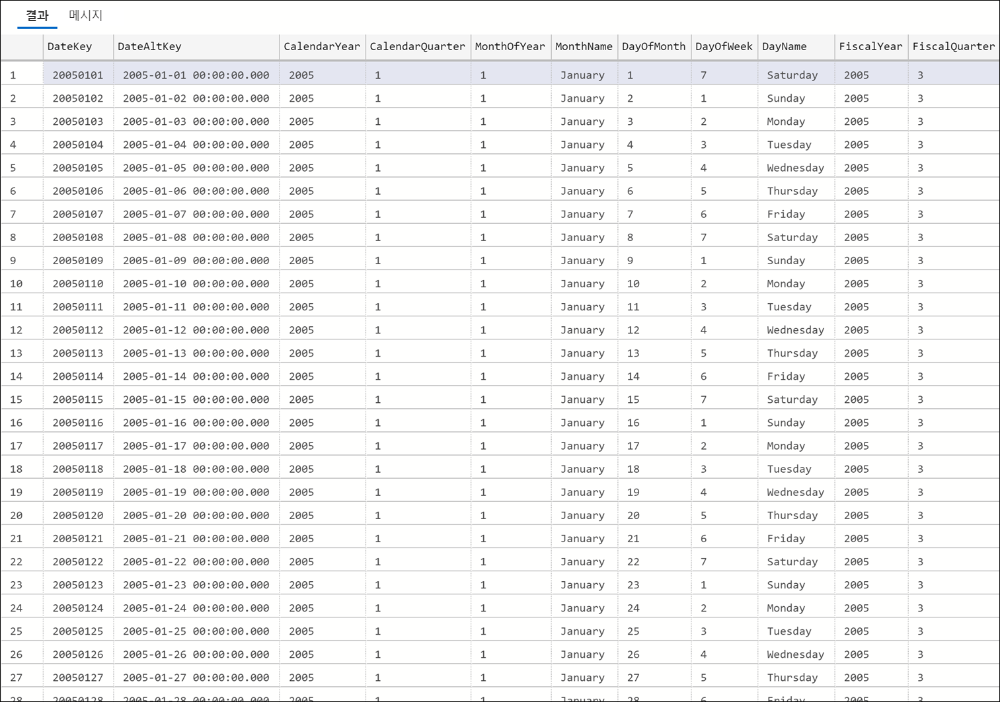

3. 시작 날짜와 종료 날짜를 모두 설정하여 원하는 기간에 대해 쿼리를 반복 실행해 테이블에 데이터를 입력할 수도 있습니다. 쿼리를 다음 코드로 바꾼 다음 **실행**하여 지정된 기간(1900년 1월 1일~2050년 12월 31일) 내의 날짜에 대해 쿼리를 반복 실행한 후 출력을 표시합니다.

    ```sql
    DECLARE @BeginDate datetime
    DECLARE @EndDate datetime

    SET @BeginDate = '1/1/1900'
    SET @EndDate = '12/31/2050'

    CREATE TABLE #Dates ([date] datetime)

    WHILE @BeginDate <= @EndDate
    BEGIN
    INSERT #Dates
    VALUES
    (@BeginDate)

    SET @BeginDate = @BeginDate + 1
    END
    SELECT * FROM #Dates
    DROP TABLE #Dates
    ```

    > 이 환경에서는 생성된 행을 삽입하는 데 약 **4초**가 걸렸습니다.

    이 방법도 문제 없이 작동하기는 하지만 많은 데이터를 정리해야 하며 실행 속도가 느립니다. 그리고 다른 필드를 추가하려면 코드를 많이 작성해야 합니다. 또한 반복 실행 방식이 사용되는데, 이 방식은 T-SQL을 사용하여 데이터를 삽입할 때의 모범 사례로 간주되지 않습니다.

4. 쿼리를 다음 코드로 바꾼 다음 **실행**하여 [CTE](https://docs.microsoft.com/sql/t-sql/queries/with-common-table-expression-transact-sql?view=sql-server-ver15)(공용 테이블 식) 문을 사용해 위의 데이터 입력 방법을 개선합니다.

    ```sql
    WITH mycte AS
    (
        SELECT cast('1900-01-01' as datetime) DateValue
        UNION ALL
        SELECT DateValue + 1
        FROM mycte 
        WHERE DateValue + 1 < '2050-12-31'
    )

    SELECT DateValue
    FROM mycte
    OPTION (MAXRECURSION 0)
    ```

    > 이 환경에서는 CTE 쿼리를 실행하는 데 **1초**가 채 걸리지 않았습니다.

### 작업 3: 다른 테이블에 데이터 로드

이 작업에서는 공용 데이터 원본의 데이터가 포함된 차원 테이블과 팩트 테이블을 로드합니다.

1. 쿼리 창에 다음 코드를 붙여넣은 다음 **실행**하여 마스터 키 암호화, 데이터베이스 범위 자격 증명, 그리고 원본 데이터가 포함된 공용 Blob Storage 계정에 액세스하는 외부 데이터 원본을 만듭니다.

    ```sql
    IF NOT EXISTS (SELECT * FROM sys.symmetric_keys) BEGIN
        declare @pasword nvarchar(400) = CAST(newid() as VARCHAR(400));
        EXEC('CREATE MASTER KEY ENCRYPTION BY PASSWORD = ''' + @pasword + '''')
    END

    CREATE DATABASE SCOPED CREDENTIAL [dataengineering]
    WITH IDENTITY='SHARED ACCESS SIGNATURE',  
    SECRET = 'sv=2019-10-10&st=2021-02-01T01%3A23%3A35Z&se=2030-02-02T01%3A23%3A00Z&sr=c&sp=rl&sig=HuizuG29h8FOrEJwIsCm5wfPFc16N1Z2K3IPVoOrrhM%3D'
    GO

    -- Create external data source secured using credential
    CREATE EXTERNAL DATA SOURCE PublicDataSource WITH (
        TYPE = BLOB_STORAGE,
        LOCATION = 'https://solliancepublicdata.blob.core.windows.net/dataengineering',
        CREDENTIAL = dataengineering
    );
    GO
    ```

2. 쿼리를 다음 코드로 바꾼 다음 **실행**하여 팩트 테이블과 차원 테이블에 데이터를 삽입합니다.

    ```sql
    BULK INSERT[dbo].[DimGeography] FROM 'dp-203/awdata/DimGeography.csv'
    WITH (
        DATA_SOURCE='PublicDataSource',
        CHECK_CONSTRAINTS,
        DATAFILETYPE='widechar',
        FIELDTERMINATOR='|',
        ROWTERMINATOR='\n',
        KEEPIDENTITY,
        TABLOCK
    );
    GO

    BULK INSERT[dbo].[DimCustomer] FROM 'dp-203/awdata/DimCustomer.csv'
    WITH (
        DATA_SOURCE='PublicDataSource',
        CHECK_CONSTRAINTS,
        DATAFILETYPE='widechar',
        FIELDTERMINATOR='|',
        ROWTERMINATOR='\n',
        KEEPIDENTITY,
        TABLOCK
    );
    GO

    BULK INSERT[dbo].[DimReseller] FROM 'dp-203/awdata/DimReseller.csv'
    WITH (
        DATA_SOURCE='PublicDataSource',
        CHECK_CONSTRAINTS,
        DATAFILETYPE='widechar',
        FIELDTERMINATOR='|',
        ROWTERMINATOR='\n',
        KEEPIDENTITY,
        TABLOCK
    );
    GO

    BULK INSERT[dbo].[DimEmployee] FROM 'dp-203/awdata/DimEmployee.csv'
    WITH (
        DATA_SOURCE='PublicDataSource',
        CHECK_CONSTRAINTS,
        DATAFILETYPE='widechar',
        FIELDTERMINATOR='|',
        ROWTERMINATOR='\n',
        KEEPIDENTITY,
        TABLOCK
    );
    GO

    BULK INSERT[dbo].[DimProductCategory] FROM 'dp-203/awdata/DimProductCategory.csv'
    WITH (
        DATA_SOURCE='PublicDataSource',
        CHECK_CONSTRAINTS,
        DATAFILETYPE='widechar',
        FIELDTERMINATOR='|',
        ROWTERMINATOR='\n',
        KEEPIDENTITY,
        TABLOCK
    );
    GO

    BULK INSERT[dbo].[DimProductSubcategory] FROM 'dp-203/awdata/DimProductSubcategory.csv'
    WITH (
        DATA_SOURCE='PublicDataSource',
        CHECK_CONSTRAINTS,
        DATAFILETYPE='widechar',
        FIELDTERMINATOR='|',
        ROWTERMINATOR='\n',
        KEEPIDENTITY,
        TABLOCK
    );
    GO

    BULK INSERT[dbo].[DimProduct] FROM 'dp-203/awdata/DimProduct.csv'
    WITH (
        DATA_SOURCE='PublicDataSource',
        CHECK_CONSTRAINTS,
        DATAFILETYPE='widechar',
        FIELDTERMINATOR='|',
        ROWTERMINATOR='\n',
        KEEPIDENTITY,
        TABLOCK
    );
    GO

    BULK INSERT[dbo].[FactResellerSales] FROM 'dp-203/awdata/FactResellerSales.csv'
    WITH (
        DATA_SOURCE='PublicDataSource',
        CHECK_CONSTRAINTS,
        DATAFILETYPE='widechar',
        FIELDTERMINATOR='|',
        ROWTERMINATOR='\n',
        KEEPIDENTITY,
        TABLOCK
    );
    GO
    ```

### 작업 4: 데이터 쿼리

1. 다음 쿼리를 붙여넣은 다음 **실행**하여 재판매인, 제품, 월 세분성을 적용해 눈송이 스키마에서 재판매인 판매 데이터를 검색합니다.

    ```sql
    SELECT
            pc.[EnglishProductCategoryName]
            ,Coalesce(p.[ModelName], p.[EnglishProductName]) AS [Model]
            ,CASE
                WHEN e.[BaseRate] < 25 THEN 'Low'
                WHEN e.[BaseRate] > 40 THEN 'High'
                ELSE 'Moderate'
            END AS [EmployeeIncomeGroup]
            ,g.City AS ResellerCity
            ,g.StateProvinceName AS StateProvince
            ,r.[AnnualSales] AS ResellerAnnualSales
            ,d.[CalendarYear]
            ,d.[FiscalYear]
            ,d.[MonthOfYear] AS [Month]
            ,f.[SalesOrderNumber] AS [OrderNumber]
            ,f.SalesOrderLineNumber AS LineNumber
            ,f.OrderQuantity AS Quantity
            ,f.ExtendedAmount AS Amount  
        FROM
            [dbo].[FactResellerSales] f
        INNER JOIN [dbo].[DimReseller] r
            ON f.ResellerKey = r.ResellerKey
        INNER JOIN [dbo].[DimGeography] g
            ON r.GeographyKey = g.GeographyKey
        INNER JOIN [dbo].[DimEmployee] e
            ON f.EmployeeKey = e.EmployeeKey
        INNER JOIN [dbo].[DimDate] d
            ON f.[OrderDateKey] = d.[DateKey]
        INNER JOIN [dbo].[DimProduct] p
            ON f.[ProductKey] = p.[ProductKey]
        INNER JOIN [dbo].[DimProductSubcategory] psc
            ON p.[ProductSubcategoryKey] = psc.[ProductSubcategoryKey]
        INNER JOIN [dbo].[DimProductCategory] pc
            ON psc.[ProductCategoryKey] = pc.[ProductCategoryKey]
        ORDER BY Amount DESC
    ```

    다음과 유사한 결과가 표시됩니다.

    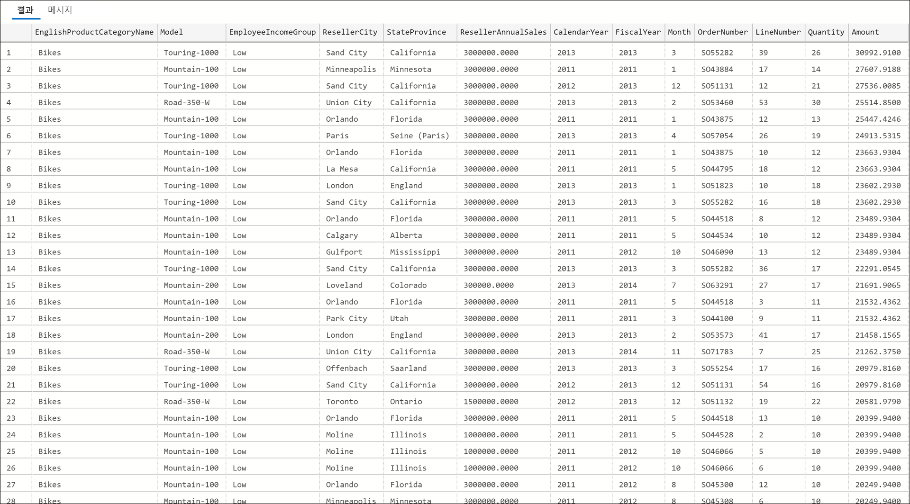

2. 쿼리를 다음 코드로 바꾼 다음 **실행**하여 2010 회계 연도와 2013 회계 연도의 10월 판매량만 표시되도록 결과를 제한합니다.

    ```sql
    SELECT
            pc.[EnglishProductCategoryName]
            ,Coalesce(p.[ModelName], p.[EnglishProductName]) AS [Model]
            ,CASE
                WHEN e.[BaseRate] < 25 THEN 'Low'
                WHEN e.[BaseRate] > 40 THEN 'High'
                ELSE 'Moderate'
            END AS [EmployeeIncomeGroup]
            ,g.City AS ResellerCity
            ,g.StateProvinceName AS StateProvince
            ,r.[AnnualSales] AS ResellerAnnualSales
            ,d.[CalendarYear]
            ,d.[FiscalYear]
            ,d.[MonthOfYear] AS [Month]
            ,f.[SalesOrderNumber] AS [OrderNumber]
            ,f.SalesOrderLineNumber AS LineNumber
            ,f.OrderQuantity AS Quantity
            ,f.ExtendedAmount AS Amount  
        FROM
            [dbo].[FactResellerSales] f
        INNER JOIN [dbo].[DimReseller] r
            ON f.ResellerKey = r.ResellerKey
        INNER JOIN [dbo].[DimGeography] g
            ON r.GeographyKey = g.GeographyKey
        INNER JOIN [dbo].[DimEmployee] e
            ON f.EmployeeKey = e.EmployeeKey
        INNER JOIN [dbo].[DimDate] d
            ON f.[OrderDateKey] = d.[DateKey]
        INNER JOIN [dbo].[DimProduct] p
            ON f.[ProductKey] = p.[ProductKey]
        INNER JOIN [dbo].[DimProductSubcategory] psc
            ON p.[ProductSubcategoryKey] = psc.[ProductSubcategoryKey]
        INNER JOIN [dbo].[DimProductCategory] pc
            ON psc.[ProductCategoryKey] = pc.[ProductCategoryKey]
        WHERE d.[MonthOfYear] = 10 AND d.[FiscalYear] IN (2012, 2013)
        ORDER BY d.[FiscalYear]
    ```

    다음과 유사한 결과가 표시됩니다.

    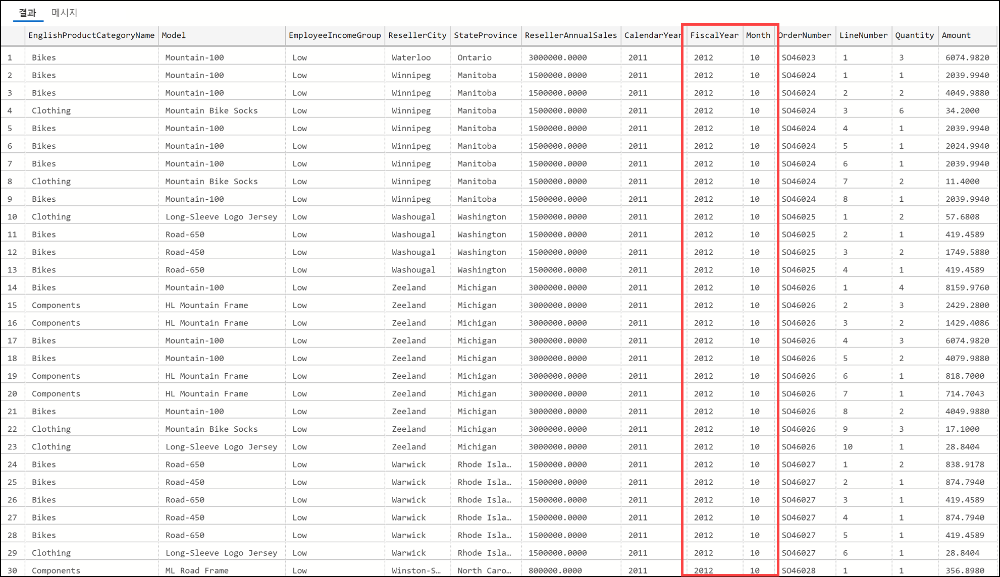

    > 이처럼 **시간 차원 테이블**을 사용하면 특정 날짜 부분 및 논리적 날짜(예: 회계 연도)를 기준으로 데이터를 더 쉽게 필터링할 수 있으며, 날짜 함수를 바로 계산할 때보다 성능도 더욱 우수합니다.

## 연습 4: Synapse Analytics에서 별모양 스키마 구현

데이터 집합이 큰 경우에는 SQL Server가 아닌 Azure Synapse에서 데이터 웨어하우스를 구현할 수 있습니다. Synapse 전용 SQL 풀에서 데이터를 모델링할 때의 모범 사례는 별모양 스키마 모델입니다. Synapse Analytics와 SQL 데이터베이스에서 테이블을 만드는 방식은 약간 다르지만, 적용되는 데이터 모델링 원칙은 동일합니다.

 Synapse에서 별모양 스키마나 눈송이 스키마를 만들 때는 테이블 작성 스크립트를 다소 변경해야 합니다. Synapse에서는 SQL Server에서와 같이 외래 키 및 고유 값 제약 조건이 적용되지 않습니다. 즉, 데이터베이스 레이어에서 이러한 규칙이 적용되지 않으므로 데이터를 로드하는 데 사용되는 작업을 통해 데이터 무결성을 유지해야 합니다. 클러스터형 인덱스를 사용할 수도 있지만, Synapse에서 만드는 대다수 차원 테이블에서는 CCI(클러스터형 columnstore 인덱스)를 사용할 수 있습니다.

Synapse Analytics는 MPP([대규모 병렬 처리](https://docs.microsoft.com/azure/architecture/data-guide/relational-data/data-warehousing#data-warehousing-in-azure)) 시스템이므로, Azure SQL Database와 같은 OLTP 데이터베이스 등의 SMP(대칭적 다중 처리) 시스템과는 달리 테이블 디자인에서 데이터 분산 방식을 고려해야 합니다. 테이블 범주에 따라 선택할 테이블 배포 옵션이 결정되는 경우가 많습니다.

| 테이블 범주 | 권장 배포 옵션 |
|:---------------|:--------------------|
| 팩트           | 클러스터형 columnstore 인덱스와 함께 해시 배포를 사용합니다. 동일한 배포 열에서 두 해시 테이블을 조인하면 성능이 향상됩니다. |
| 차원      | 작은 테이블에는 복제를 사용합니다. 테이블이 너무 커서 각 컴퓨팅 노드에 저장할 수 없는 경우 해시 분산을 사용합니다. |
| 준비        | 준비 테이블에는 라운드 로빈을 사용합니다. CTAS를 사용하면 빠르게 로드됩니다. 준비 테이블에 데이터를 추가한 후에는 INSERT...SELECT를 사용하여 데이터를 프로덕션 테이블로 이동합니다. |

이 연습에서 사용하는 차원 테이블의 경우에는 테이블당 저장되는 데이터의 양이 복제 분산 사용 기준 범위 내에 포함됩니다.

### 작업 1: Synapse 전용 SQL에서 별모양 스키마 만들기

이 작업에서는 Azure Synapse 전용 풀에서 별모양 스키마를 만듭니다. 첫 단계에서는 기본 차원과 팩트 테이블을 만듭니다.

1. Azure Portal(<https://portal.azure.com>)에 로그인합니다.

2. 이 랩용 리소스 그룹을 열고 **Synapse 작업 영역**을 선택합니다.

    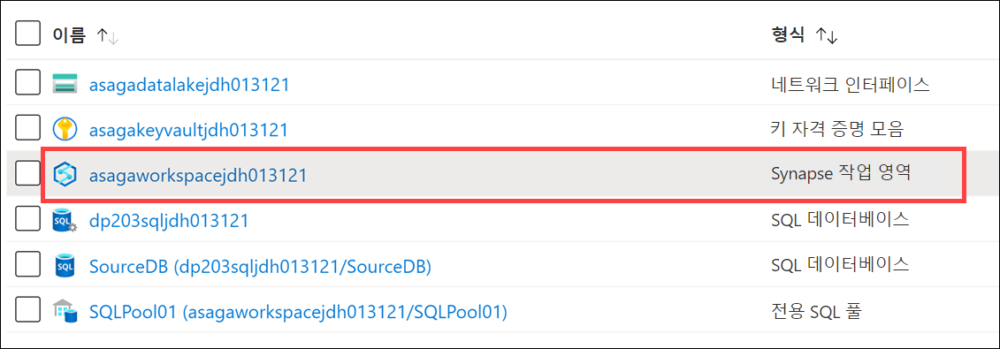

3. Synapse 작업 영역 개요 블레이드에서 `Open Synapse Studio` 내의 **열기** 링크를 선택합니다.

    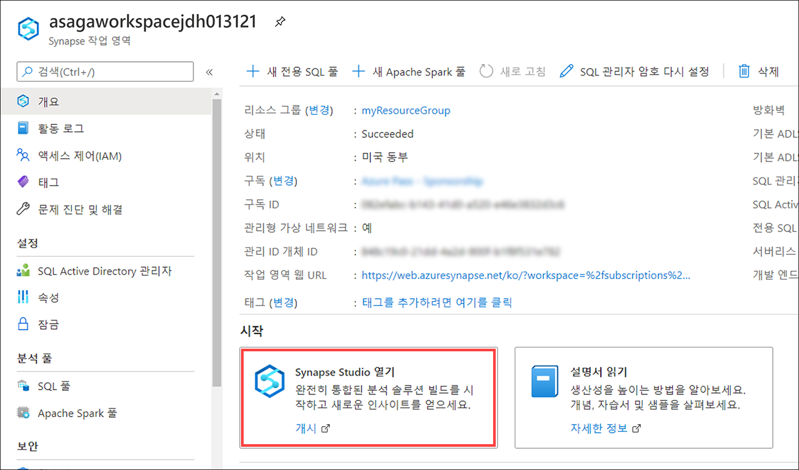

4. Synapse Studio에서 **데이터** 허브로 이동합니다.

    

5. **작업 영역** 탭 **(1)** 을 선택하고 데이터베이스를 확장한 다음 **SQLPool01(2)** 을 마우스 오른쪽 단추로 클릭합니다. **새 SQL 스크립트(3)**, **빈 스크립트(4)** 를 차례로 선택합니다.

    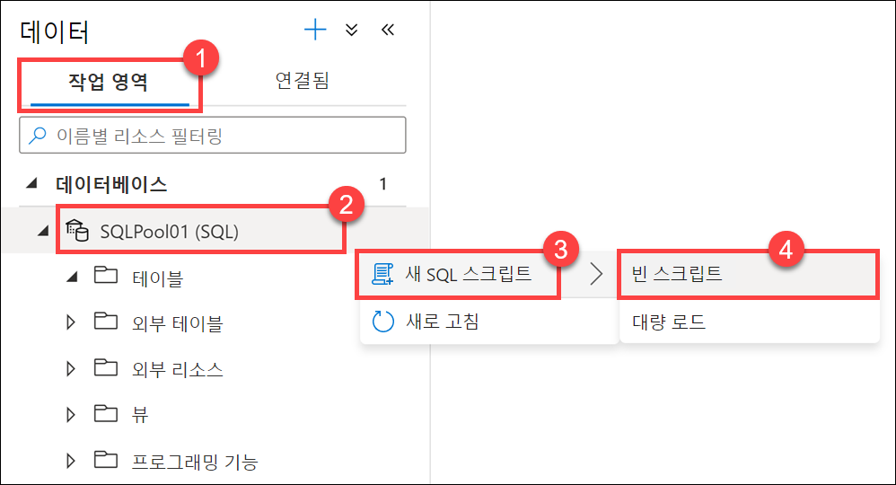

6. 빈 스크립트 창에 다음 스크립트를 붙여넣고 **실행**을 선택하거나 `F5` 키를 눌러 쿼리를 실행합니다. 원래 SQL 별모양 스키마 만들기 스크립트가 다소 변경되었음을 확인할 수 있습니다. 몇 가지 주요 변경 내용은 다음과 같습니다.
    - 각 테이블에 분산 설정이 추가되었습니다.
    - 대다수 테이블에 클러스터형 columnstore 인덱스가 사용됩니다.
    - Fact 테이블 분산에 HASH 함수가 사용됩니다. Fact 테이블은 여러 노드에 분산해야 하는 큰 테이블이기 때문입니다.
    - varbinary 데이터 형식을 사용하는 필드가 몇 개 있습니다. Azure Synapse에서는 클러스터형 columnstore 인덱스에 varbinary 데이터 형식을 포함할 수 없습니다. 그래서 작업을 손쉽게 수행하기 위해 클러스터형 인덱스가 대신 사용되었습니다.
    
    ```sql
    CREATE TABLE dbo.[DimCustomer](
        [CustomerID] [int] NOT NULL,
        [Title] [nvarchar](8) NULL,
        [FirstName] [nvarchar](50) NOT NULL,
        [MiddleName] [nvarchar](50) NULL,
        [LastName] [nvarchar](50) NOT NULL,
        [Suffix] [nvarchar](10) NULL,
        [CompanyName] [nvarchar](128) NULL,
        [SalesPerson] [nvarchar](256) NULL,
        [EmailAddress] [nvarchar](50) NULL,
        [Phone] [nvarchar](25) NULL,
        [InsertedDate] [datetime] NOT NULL,
        [ModifiedDate] [datetime] NOT NULL,
        [HashKey] [char](66)
    )
    WITH
    (
        DISTRIBUTION = REPLICATE,
        CLUSTERED COLUMNSTORE INDEX
    );
    GO
    
    CREATE TABLE [dbo].[FactResellerSales](
        [ProductKey] [int] NOT NULL,
        [OrderDateKey] [int] NOT NULL,
        [DueDateKey] [int] NOT NULL,
        [ShipDateKey] [int] NOT NULL,
        [ResellerKey] [int] NOT NULL,
        [EmployeeKey] [int] NOT NULL,
        [PromotionKey] [int] NOT NULL,
        [CurrencyKey] [int] NOT NULL,
        [SalesTerritoryKey] [int] NOT NULL,
        [SalesOrderNumber] [nvarchar](20) NOT NULL,
        [SalesOrderLineNumber] [tinyint] NOT NULL,
        [RevisionNumber] [tinyint] NULL,
        [OrderQuantity] [smallint] NULL,
        [UnitPrice] [money] NULL,
        [ExtendedAmount] [money] NULL,
        [UnitPriceDiscountPct] [float] NULL,
        [DiscountAmount] [float] NULL,
        [ProductStandardCost] [money] NULL,
        [TotalProductCost] [money] NULL,
        [SalesAmount] [money] NULL,
        [TaxAmt] [money] NULL,
        [Freight] [money] NULL,
        [CarrierTrackingNumber] [nvarchar](25) NULL,
        [CustomerPONumber] [nvarchar](25) NULL,
        [OrderDate] [datetime] NULL,
        [DueDate] [datetime] NULL,
        [ShipDate] [datetime] NULL
    )
    WITH
    (
        DISTRIBUTION = HASH([SalesOrderNumber]),
        CLUSTERED COLUMNSTORE INDEX
    );
    GO

    CREATE TABLE [dbo].[DimDate]
    ( 
        [DateKey] [int]  NOT NULL,
        [DateAltKey] [datetime]  NOT NULL,
        [CalendarYear] [int]  NOT NULL,
        [CalendarQuarter] [int]  NOT NULL,
        [MonthOfYear] [int]  NOT NULL,
        [MonthName] [nvarchar](15)  NOT NULL,
        [DayOfMonth] [int]  NOT NULL,
        [DayOfWeek] [int]  NOT NULL,
        [DayName] [nvarchar](15)  NOT NULL,
        [FiscalYear] [int]  NOT NULL,
        [FiscalQuarter] [int]  NOT NULL
    )
    WITH
    (
        DISTRIBUTION = REPLICATE,
        CLUSTERED COLUMNSTORE INDEX
    );
    GO

    CREATE TABLE [dbo].[DimReseller](
        [ResellerKey] [int] NOT NULL,
        [GeographyKey] [int] NULL,
        [ResellerAlternateKey] [nvarchar](15) NULL,
        [Phone] [nvarchar](25) NULL,
        [BusinessType] [varchar](20) NOT NULL,
        [ResellerName] [nvarchar](50) NOT NULL,
        [NumberEmployees] [int] NULL,
        [OrderFrequency] [char](1) NULL,
        [OrderMonth] [tinyint] NULL,
        [FirstOrderYear] [int] NULL,
        [LastOrderYear] [int] NULL,
        [ProductLine] [nvarchar](50) NULL,
        [AddressLine1] [nvarchar](60) NULL,
        [AddressLine2] [nvarchar](60) NULL,
        [AnnualSales] [money] NULL,
        [BankName] [nvarchar](50) NULL,
        [MinPaymentType] [tinyint] NULL,
        [MinPaymentAmount] [money] NULL,
        [AnnualRevenue] [money] NULL,
        [YearOpened] [int] NULL
    )
    WITH
    (
        DISTRIBUTION = REPLICATE,
        CLUSTERED COLUMNSTORE INDEX
    );
    GO
    
    CREATE TABLE [dbo].[DimEmployee](
        [EmployeeKey] [int] NOT NULL,
        [ParentEmployeeKey] [int] NULL,
        [EmployeeNationalIDAlternateKey] [nvarchar](15) NULL,
        [ParentEmployeeNationalIDAlternateKey] [nvarchar](15) NULL,
        [SalesTerritoryKey] [int] NULL,
        [FirstName] [nvarchar](50) NOT NULL,
        [LastName] [nvarchar](50) NOT NULL,
        [MiddleName] [nvarchar](50) NULL,
        [NameStyle] [bit] NOT NULL,
        [Title] [nvarchar](50) NULL,
        [HireDate] [date] NULL,
        [BirthDate] [date] NULL,
        [LoginID] [nvarchar](256) NULL,
        [EmailAddress] [nvarchar](50) NULL,
        [Phone] [nvarchar](25) NULL,
        [MaritalStatus] [nchar](1) NULL,
        [EmergencyContactName] [nvarchar](50) NULL,
        [EmergencyContactPhone] [nvarchar](25) NULL,
        [SalariedFlag] [bit] NULL,
        [Gender] [nchar](1) NULL,
        [PayFrequency] [tinyint] NULL,
        [BaseRate] [money] NULL,
        [VacationHours] [smallint] NULL,
        [SickLeaveHours] [smallint] NULL,
        [CurrentFlag] [bit] NOT NULL,
        [SalesPersonFlag] [bit] NOT NULL,
        [DepartmentName] [nvarchar](50) NULL,
        [StartDate] [date] NULL,
        [EndDate] [date] NULL,
        [Status] [nvarchar](50) NULL,
        [EmployeePhoto] [varbinary](max) NULL
    )
    WITH
    (
        DISTRIBUTION = REPLICATE,
        CLUSTERED INDEX (EmployeeKey)
    );
    GO
    
    CREATE TABLE [dbo].[DimProduct](
        [ProductKey] [int] NOT NULL,
        [ProductAlternateKey] [nvarchar](25) NULL,
        [ProductSubcategoryKey] [int] NULL,
        [WeightUnitMeasureCode] [nchar](3) NULL,
        [SizeUnitMeasureCode] [nchar](3) NULL,
        [EnglishProductName] [nvarchar](50) NOT NULL,
        [SpanishProductName] [nvarchar](50) NULL,
        [FrenchProductName] [nvarchar](50) NULL,
        [StandardCost] [money] NULL,
        [FinishedGoodsFlag] [bit] NOT NULL,
        [Color] [nvarchar](15) NOT NULL,
        [SafetyStockLevel] [smallint] NULL,
        [ReorderPoint] [smallint] NULL,
        [ListPrice] [money] NULL,
        [Size] [nvarchar](50) NULL,
        [SizeRange] [nvarchar](50) NULL,
        [Weight] [float] NULL,
        [DaysToManufacture] [int] NULL,
        [ProductLine] [nchar](2) NULL,
        [DealerPrice] [money] NULL,
        [Class] [nchar](2) NULL,
        [Style] [nchar](2) NULL,
        [ModelName] [nvarchar](50) NULL,
        [LargePhoto] [varbinary](max) NULL,
        [EnglishDescription] [nvarchar](400) NULL,
        [FrenchDescription] [nvarchar](400) NULL,
        [ChineseDescription] [nvarchar](400) NULL,
        [ArabicDescription] [nvarchar](400) NULL,
        [HebrewDescription] [nvarchar](400) NULL,
        [ThaiDescription] [nvarchar](400) NULL,
        [GermanDescription] [nvarchar](400) NULL,
        [JapaneseDescription] [nvarchar](400) NULL,
        [TurkishDescription] [nvarchar](400) NULL,
        [StartDate] [datetime] NULL,
        [EndDate] [datetime] NULL,
        [Status] [nvarchar](7) NULL    
    )
    WITH
    (
        DISTRIBUTION = REPLICATE,
        CLUSTERED INDEX (ProductKey)
    );
    GO

    CREATE TABLE [dbo].[DimGeography](
        [GeographyKey] [int] NOT NULL,
        [City] [nvarchar](30) NULL,
        [StateProvinceCode] [nvarchar](3) NULL,
        [StateProvinceName] [nvarchar](50) NULL,
        [CountryRegionCode] [nvarchar](3) NULL,
        [EnglishCountryRegionName] [nvarchar](50) NULL,
        [SpanishCountryRegionName] [nvarchar](50) NULL,
        [FrenchCountryRegionName] [nvarchar](50) NULL,
        [PostalCode] [nvarchar](15) NULL,
        [SalesTerritoryKey] [int] NULL,
        [IpAddressLocator] [nvarchar](15) NULL
    )
    WITH
    (
        DISTRIBUTION = REPLICATE,
        CLUSTERED COLUMNSTORE INDEX
    );
    GO
    ```
    `Run`은 스크립트 창 왼쪽 위에 있습니다.
    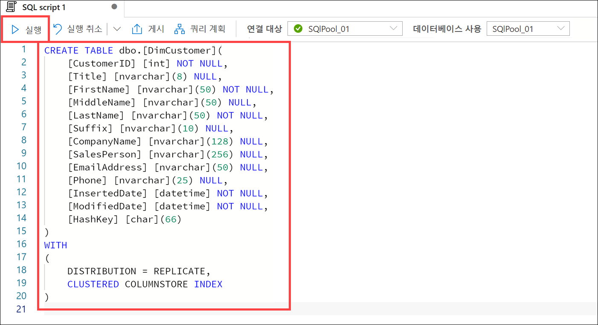

### 작업 2: Synapse 테이블에 데이터 로드

이 작업에서는 공용 데이터 원본의 데이터가 포함된 Synapse 차원 테이블과 팩트 테이블을 로드합니다. 두 가지 방법을 통해 T-SQL을 사용하여 Azure Storage 파일에서 이 데이터를 로드할 수 있습니다. 즉, COPY 명령을 사용할 수도 있고 Polybase를 사용해 외부 테이블에서 데이터를 선택할 수도 있습니다. 이 작업에서는 Azure Storage에서 분리된 데이터를 로드하는 데 사용할 수 있는 유동적이며 간단한 구문인 COPY를 사용합니다. 원본이 프라이빗 스토리지 계정이라면 CREDENTIAL 옵션을 포함하여 데이터 읽기 권한을 COPY에 부여해야 합니다. 그러나 이 예제에서는 이러한 권한을 부여할 필요가 없습니다.

1. 다음 쿼리를 붙여넣은 다음 **실행**하여 팩트 테이블과 차원 테이블에 데이터를 삽입합니다.

    ```sql
    COPY INTO [dbo].[DimProduct]
    FROM 'https://solliancepublicdata.blob.core.windows.net/dataengineering/dp-203/awdata/DimProduct.csv'
    WITH (
        FILE_TYPE='CSV',
        FIELDTERMINATOR='|',
        FIELDQUOTE='',
        ROWTERMINATOR='\n',
        ENCODING = 'UTF16'
    );
    GO

    COPY INTO [dbo].[DimReseller]
    FROM 'https://solliancepublicdata.blob.core.windows.net/dataengineering/dp-203/awdata/DimReseller.csv'
    WITH (
        FILE_TYPE='CSV',
        FIELDTERMINATOR='|',
        FIELDQUOTE='',
        ROWTERMINATOR='\n',
        ENCODING = 'UTF16'
    );
    GO

    COPY INTO [dbo].[DimEmployee]
    FROM 'https://solliancepublicdata.blob.core.windows.net/dataengineering/dp-203/awdata/DimEmployee.csv'
    WITH (
        FILE_TYPE='CSV',
        FIELDTERMINATOR='|',
        FIELDQUOTE='',
        ROWTERMINATOR='\n',
        ENCODING = 'UTF16'
    );
    GO

    COPY INTO [dbo].[DimGeography]
    FROM 'https://solliancepublicdata.blob.core.windows.net/dataengineering/dp-203/awdata/DimGeography.csv'
    WITH (
        FILE_TYPE='CSV',
        FIELDTERMINATOR='|',
        FIELDQUOTE='',
        ROWTERMINATOR='\n',
        ENCODING = 'UTF16'
    );
    GO

    COPY INTO [dbo].[FactResellerSales]
    FROM 'https://solliancepublicdata.blob.core.windows.net/dataengineering/dp-203/awdata/FactResellerSales.csv'
    WITH (
        FILE_TYPE='CSV',
        FIELDTERMINATOR='|',
        FIELDQUOTE='',
        ROWTERMINATOR='\n',
        ENCODING = 'UTF16'
    );
    GO
    ```

2. Azure Synapse에서 시간 차원 테이블에 데이터를 입력하려는 경우 분리된 파일에서 데이터를 로드하는 것이 가장 빠릅니다. 시간 데이터를 만드는 데 사용되는 반복 실행 방식은 실행 속도가 느리기 때문입니다. 이 중요 시간 차원을 입력하려면 쿼리 창에 다음 쿼리를 붙여넣은 다음 **실행**합니다.

    ```sql
    COPY INTO [dbo].[DimDate]
    FROM 'https://solliancepublicdata.blob.core.windows.net/dataengineering/dp-203/awdata/DimDate.csv'
    WITH (
        FILE_TYPE='CSV',
        FIELDTERMINATOR='|',
        FIELDQUOTE='',
        ROWTERMINATOR='0x0a',
        ENCODING = 'UTF16'
    );
    GO
    ```

### 작업 3: Synapse에서 데이터 쿼리

1. 다음 쿼리를 붙여넣은 다음 **실행**하여 재판매인, 제품, 월 세분성을 적용해 Synapse 별모양 스키마에서 재판매인 판매 데이터를 검색합니다.

    ```sql
    SELECT
        Coalesce(p.[ModelName], p.[EnglishProductName]) AS [Model]
        ,g.City AS ResellerCity
        ,g.StateProvinceName AS StateProvince
        ,d.[CalendarYear]
        ,d.[FiscalYear]
        ,d.[MonthOfYear] AS [Month]
        ,sum(f.OrderQuantity) AS Quantity
        ,sum(f.ExtendedAmount) AS Amount
        ,approx_count_distinct(f.SalesOrderNumber) AS UniqueOrders  
    FROM
        [dbo].[FactResellerSales] f
    INNER JOIN [dbo].[DimReseller] r
        ON f.ResellerKey = r.ResellerKey
    INNER JOIN [dbo].[DimGeography] g
        ON r.GeographyKey = g.GeographyKey
    INNER JOIN [dbo].[DimDate] d
        ON f.[OrderDateKey] = d.[DateKey]
    INNER JOIN [dbo].[DimProduct] p
        ON f.[ProductKey] = p.[ProductKey]
    GROUP BY
        Coalesce(p.[ModelName], p.[EnglishProductName])
        ,g.City
        ,g.StateProvinceName
        ,d.[CalendarYear]
        ,d.[FiscalYear]
        ,d.[MonthOfYear]
    ORDER BY Amount DESC
    ```

    다음과 유사한 결과가 표시됩니다.

    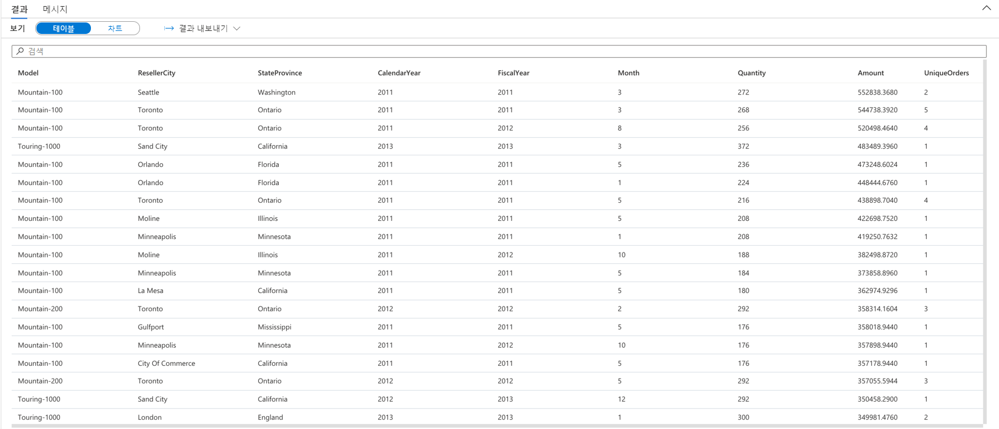

2. 쿼리를 다음 코드로 바꾼 다음 **실행**하여 2010 회계 연도와 2013 회계 연도의 10월 판매량만 표시되도록 결과를 제한합니다.

    ```sql
    SELECT
        Coalesce(p.[ModelName], p.[EnglishProductName]) AS [Model]
        ,g.City AS ResellerCity
        ,g.StateProvinceName AS StateProvince
        ,d.[CalendarYear]
        ,d.[FiscalYear]
        ,d.[MonthOfYear] AS [Month]
        ,sum(f.OrderQuantity) AS Quantity
        ,sum(f.ExtendedAmount) AS Amount
        ,approx_count_distinct(f.SalesOrderNumber) AS UniqueOrders  
    FROM
        [dbo].[FactResellerSales] f
    INNER JOIN [dbo].[DimReseller] r
        ON f.ResellerKey = r.ResellerKey
    INNER JOIN [dbo].[DimGeography] g
        ON r.GeographyKey = g.GeographyKey
    INNER JOIN [dbo].[DimDate] d
        ON f.[OrderDateKey] = d.[DateKey]
    INNER JOIN [dbo].[DimProduct] p
        ON f.[ProductKey] = p.[ProductKey]
    WHERE d.[MonthOfYear] = 10 AND d.[FiscalYear] IN (2012, 2013)
    GROUP BY
        Coalesce(p.[ModelName], p.[EnglishProductName])
        ,g.City
        ,g.StateProvinceName
        ,d.[CalendarYear]
        ,d.[FiscalYear]
        ,d.[MonthOfYear]
    ORDER BY d.[FiscalYear]
    ```

    다음과 유사한 결과가 표시됩니다.

    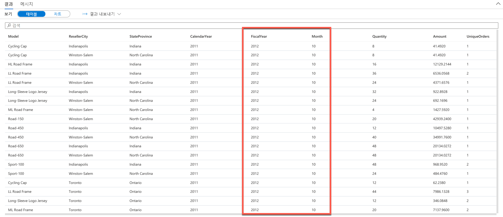

    > 이처럼 **시간 차원 테이블**을 사용하면 특정 날짜 부분 및 논리적 날짜(예: 회계 연도)를 기준으로 데이터를 더 쉽게 필터링할 수 있으며, 날짜 함수를 바로 계산할 때보다 성능도 더욱 우수합니다.

## 연습 5: 매핑 데이터 흐름을 사용하여 느린 변경 차원 업데이트

SCD(**느린 변경 차원**)는 장기적으로 차원 멤버 변경을 적절하게 관리하는 차원입니다. 비즈니스 엔터티 값이 시간이 경과하면서 임시로 변경되면 SCD가 적용됩니다. 느린 변경 차원의 대표적인 예로는 고객 차원(구체적으로는 이메일 주소 및 전화 번호와 같은 연락처 세부 정보 열)을 들 수 있습니다. 반면 주가와 같이 특성이 자주 변경되는 차원은 빠른 변경 차원으로 간주됩니다. 이 두 가지 차원을 사용할 때 공통적으로 적용되는 디자인 방식은, 빠른 변경 특성 값을 팩트 테이블 측정값에 저장하는 것입니다.

별모양 스키마 디자인 이론에서 제시하는 두 가지 공통 SCD 유형은 유형 1과 유형 2입니다. 차원 유형 테이블은 유형 1이나 유형 2 중 하나일 수도 있고, 각 열에 대해 두 유형을 동시에 지원할 수도 있습니다.

**유형 1 SCD**

**유형 1 SCD**에는 항상 최신 값이 반영됩니다. 원본 데이터의 변경 내용이 검색되면 차원 테이블 데이터를 덮어씁니다. 이 디자인 방식은 고객의 이메일 주소나 전화 번호와 같은 추가 값을 저장하는 열에 흔히 사용됩니다. 고객 이메일 주소나 전화 번호가 변경되면 차원 테이블이 새 값으로 고객 행을 업데이트합니다. 즉, 이전 정보를 덮어쓰고 새 정보를 원래 정보처럼 저장합니다.

**유형 2 SCD**

**유형 2 SCD**에서는 차원 멤버의 버전을 지정할 수 있습니다. 원본 시스템이 버전을 저장되어 있지 않은 경우에는 데이터 웨어하우스 로드 프로세스에서 변경 내용을 검색하여 차원 테이블에서 해당 변경 내용을 적절하게 관리합니다. 이 경우 차원 테이블은 서로게이트 키를 사용하여 차원 멤버 버전에 대한 고유 참조를 제공해야 합니다. 그리고 차원 테이블에는 버전의 날짜 범위 유효성을 정의하는 열(예: `StartDate` 및 `EndDate`)도 포함되며, 현재 차원 멤버를 기준으로 데이터를 쉽게 필터링할 수 있는 플래그 열(예: `IsCurrent`)도 포함될 수 있습니다.

영업 지역에 영업 사원을 할당하는 Adventure Works의 경우를 예로 들어 보겠습니다. 영업 사원의 영업 지역이 바뀌는 경우 기록 팩트를 이전 지역과 연결된 상태로 유지하려면 새 영업 사원 버전을 만들어야 합니다. 영업 사원별로 정확한 영업 기록 분석을 지원하려면 차원 테이블에 영업 사원 및 담당 지역 버전을 저장해야 합니다. 이 테이블에는 시간 유효성 정의를 위한 시작 날짜 및 종료 날짜 값도 포함해야 합니다. 현재 버전의 경우 빈 종료 날짜(또는 9999/12/31)를 정의할 수 있습니다. 이 종료 날짜는 해당 행이 현재 버전임을 나타냅니다. 그리고 이러한 상황에서는 기업 키(여기서는 직원 ID)가 고유하지 않으므로 차원 테이블에서 서로게이트 키도 정의해야 합니다.

원본 데이터에 버전이 저장되지 않는 경우에는 중간 시스템(예: 데이터 웨어하우스)을 사용하여 변경 내용을 검색 및 저장해야 합니다. 테이블 로드 프로세스에서는 기존 데이터를 보존하고 변경 내용을 검색해야 합니다. 변경 내용이 검색되면 테이블 로드 프로세스에서 현재 버전을 만료 처리해야 합니다. 이 프로세스에서는 `EndDate` 값을 업데이트하고 이전 `EndDate` 값부터 시작되는 `StartDate` 값이 지정된 새 버전을 삽입하는 방식을 통해 이러한 변경 내용을 기록합니다. 또한 관련 팩트는 시간 기반 조회를 사용하여 팩트 날짜와 관련된 차원 키 값을 검색해야 합니다.

이 연습에서는 Azure SQL Database를 원본으로, Synapse 전용 SQL 풀을 대상으로 사용하여 유형 1 SCD를 만듭니다.

### 작업 1: Azure SQL Database 연결된 서비스 만들기

Synapse Analytics의 연결된 서비스를 사용하면 외부 리소스에 대한 연결을 관리할 수 있습니다. 이 연습에서는 `DimCustomer` 차원 테이블의 데이터 원본으로 사용되는 Azure SQL Database용 연결된 서비스를 만듭니다.

1. Synapse Studio에서 **관리** 허브로 이동합니다.

    

2. 왼쪽에서 **연결된 서비스**를 선택하고 **+ 새로 만들기**를 선택합니다..

    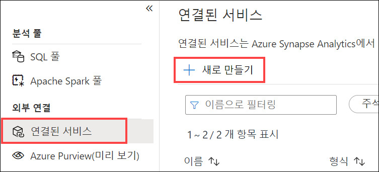

3. **Azure SQL Database**, **계속**을 차례로 선택합니다.

    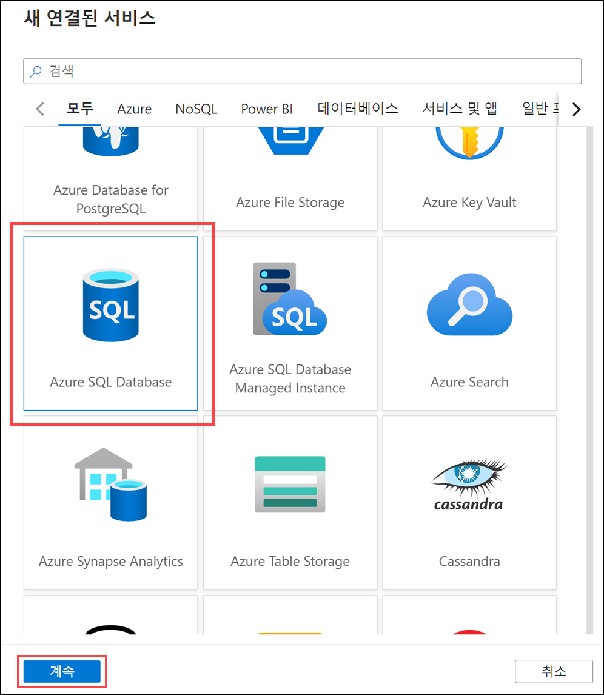

4. 다음 정보를 입력하여 새 연결된 서비스 양식을 작성합니다.

    - **이름**: `AzureSqlDatabaseSource`를 입력합니다.
    - **계정 선택 방법**: `From Azure subscription`을 선택합니다.
    - **Azure 구독**: 이 랩에 사용하는 Azure 구독을 선택합니다.
    - **서버 이름**: Azure SQL Server `dp203sqlSUFFIX`를 선택합니다(SUFFIX는 사용자의 고유한 접미사).
    - **데이터베이스 이름**: `SourceDB`를 선택합니다.
    - **인증 유형**: `SQL authentication`을 선택합니다.
    - **사용자 이름**: `sqladmin`을 입력합니다.
    - **암호**: 환경 설정 중에 입력한 암호를 입력합니다. 호스트형 랩 환경을 사용 중이라면 강사가 제공한(랩 시작 부분에서 사용한) 암호를 입력합니다.

    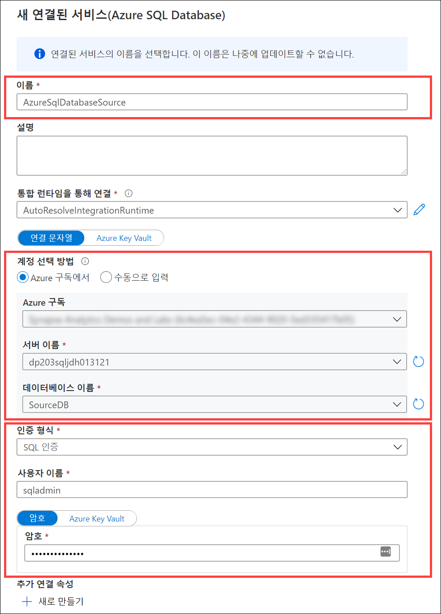

5. **만들기**를 선택합니다.

### 작업 2: 매핑 데이터 흐름 만들기

매핑 데이터 흐름은 코드 없는 환경을 통해 시각적으로 데이터 변환 방식을 지정할 수 있는 파이프라인 작업입니다. 이 기능을 사용하면 데이터 정리, 변형, 집계, 변환, 조인, 데이터 복사 작업 등을 수행할 수 있습니다.

이 작업에서는 매핑 데이터 흐름을 만들어 유형 1 SCD를 작성합니다.

1. **개발** 허브로 이동합니다.

    

2. **+**, **데이터 흐름**을 차례로 선택합니다.

    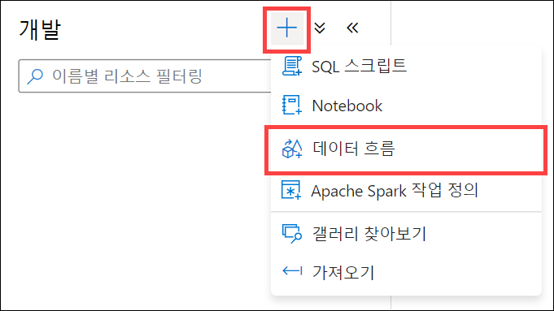

3. 새 데이터 흐름의 속성 창 **이름** 필드 **(1)** 에 `UpdateCustomerDimension`을 입력하고 **속성** 단추 **(2)** 를 선택하여 속성 창을 숨깁니다.

    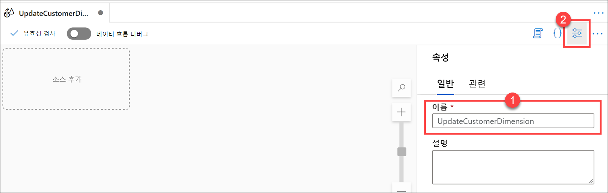

4. **데이터 흐름 디버그**를 선택하여 디버거를 사용하도록 설정합니다. 그러면 데이터 흐름을 파이프라인에서 실행하기 전에 데이터 변형을 미리 보고 데이터 흐름을 디버그할 수 있습니다.

    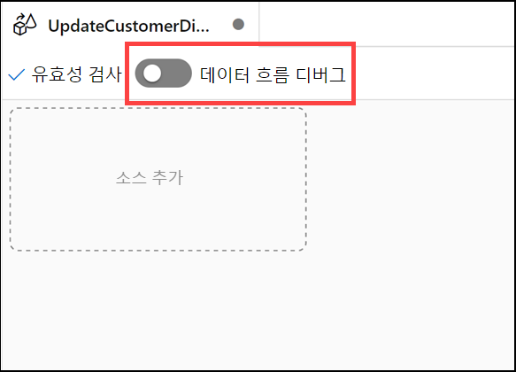

5. 표시되는 대화 상자에서 **확인**을 선택하여 데이터 흐름 디버그를 설정합니다.

    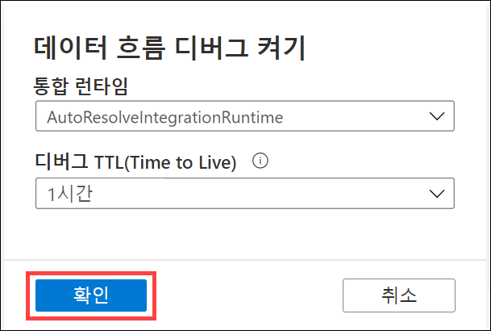

    몇 분 후에 디버그 클러스터가 시작됩니다. 그 동안 다음 단계를 계속 진행할 수 있습니다.

6. 캔버스에서 **원본 추가**를 선택합니다.

    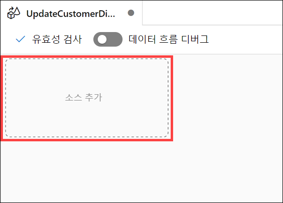

7. `Source settings`에서 다음 속성을 구성합니다.

    - **출력 스트림 이름**: `SourceDB`를 입력합니다.
    - **원본 유형**: `Dataset`을 선택합니다.
    - **옵션**: `Allow schema drift`을 선택하고 나머지 옵션은 선택하지 않은 상태로 유지합니다.
    - **샘플링**: `Disable`을 선택합니다.
    - **데이터 집합**: **+ 새로 만들기**를 선택하여 새 데이터 집합을 만듭니다.

    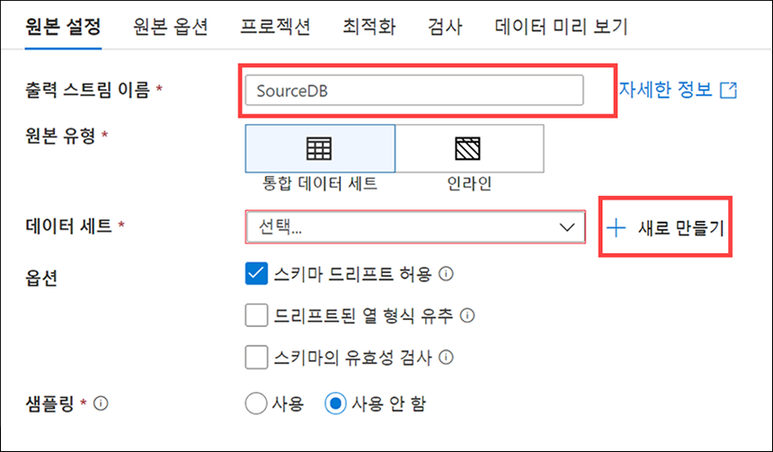

8. 새 통합 데이터 집합 대화 상자에서 **Azure SQL Database**, **계속**을 차례로 선택합니다.

    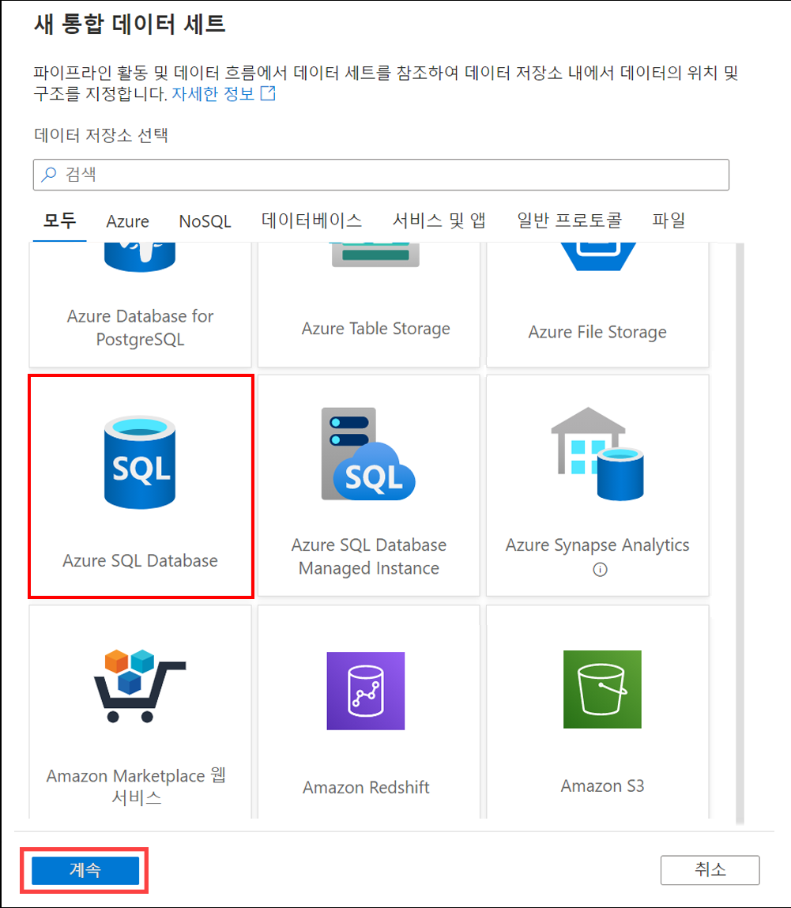

9. 데이터 집합 속성에서 다음 속성을 구성합니다.

    - **이름**: `SourceCustomer`를 입력합니다.
    - **연결된 서비스**: `AzureSqlDatabaseSource`를 선택합니다.
    - **테이블 이름**: `SalesLT.Customer`를 선택합니다.

    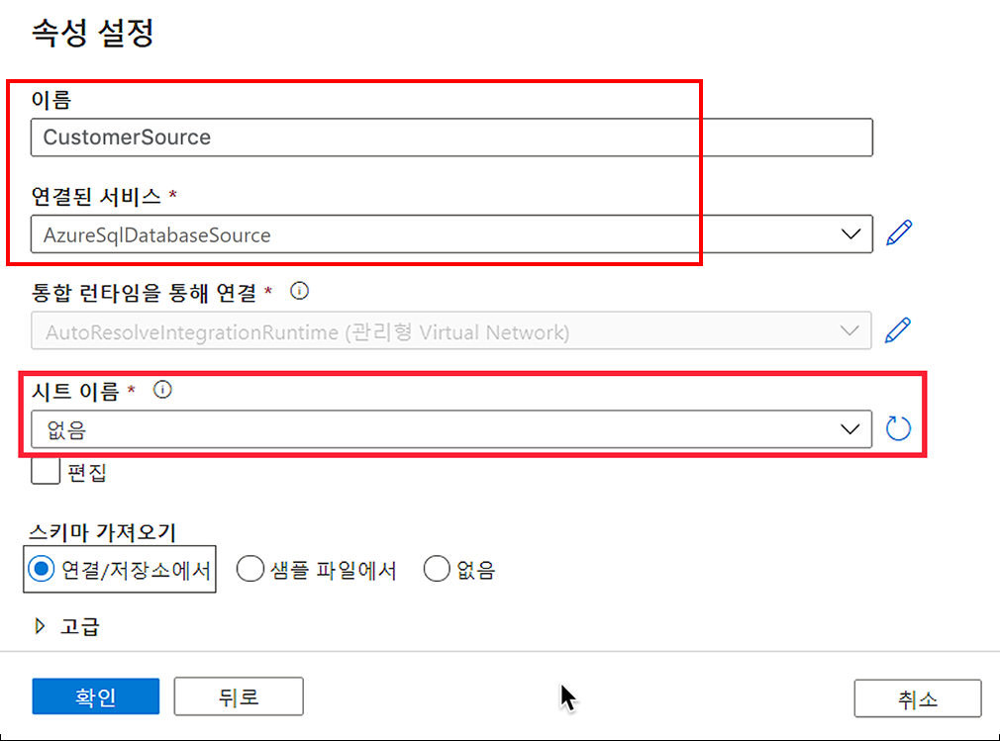

10. **확인**을 선택하여 데이터 집합을 만듭니다.

11. `SourceCustomer` 데이터 집합이 표시되며 원본 설정의 데이터 집합으로 선택됩니다.

    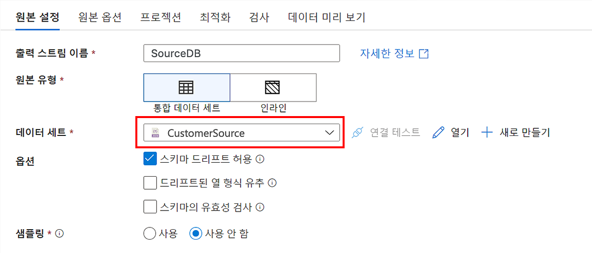

12. 캔버스의 `SourceDB` 원본 오른쪽에 있는 **+** 를 선택하고 **파생 열**을 선택합니다.

    

13. `Derived column's settings`에서 다음 속성을 구성합니다.

    - **출력 스트림 이름**: `CreateCustomerHash`를 입력합니다.
    - **들어오는 스트림**: `SourceDB`를 선택합니다.
    - **열**: 다음을 입력합니다.

    | 열 | 식 | 설명 |
    | --- | --- | --- |
    | `HashKey`를 입력합니다. | `sha2(256, iifNull(Title,'') +FirstName +iifNull(MiddleName,'') +LastName +iifNull(Suffix,'') +iifNull(CompanyName,'') +iifNull(SalesPerson,'') +iifNull(EmailAddress,'') +iifNull(Phone,''))` | 테이블 값의 SHA256 해시를 만듭니다. 이 열을 사용하여 들어오는 레코드의 해시를 대상 레코드의 해시 값과 비교해 `CustomerID` 값 일치 여부를 확인하는 방식으로 행 변경 내용을 검색합니다. `iifNull` 함수는 null 값을 빈 문자열로 바꿉니다. 이 함수를 사용하지 않는 경우 null 항목이 있으면 해시 값은 중복되는 경우가 많습니다. |

    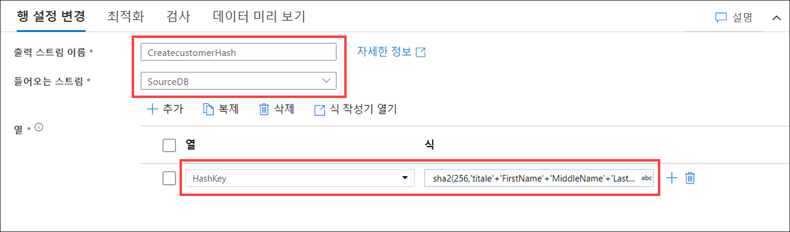

14. **식** 텍스트 상자 안을 클릭한 다음 **식 작성기 열기**를 선택합니다.

    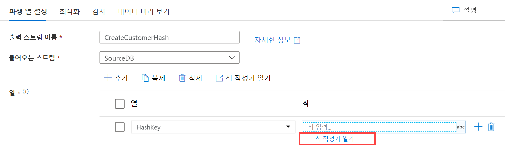

15. `Data preview` 옆의 **새로 고침**을 선택하여 `HashKey` 열의 출력을 미리 봅니다. 이 열은 앞에서 추가한 `sha2` 함수를 사용합니다. 각 해시 값이 고유하게 표시되어야 합니다.

    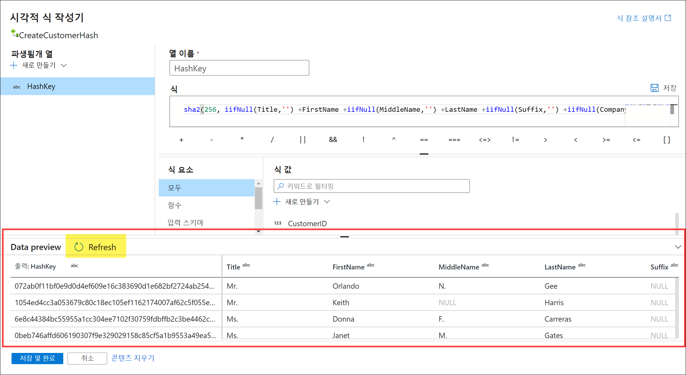

16. **저장 후 닫기**를 선택하여 식 작성기를 닫습니다.

17. 캔버스에서 `SourceDB` 원본 아래의 **원본 추가**를 선택합니다. 이제 레코드의 유무와 해시를 비교할 때 사용할 `DimCustomer` 테이블을 추가해야 합니다. 이 테이블은 Synapse 전용 SQL 풀에 있습니다.

    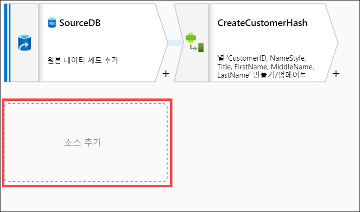

18. `Source settings` 에서 다음 속성을 구성합니다.

    - **출력 스트림 이름**: `SynapseDimCustomer`를 입력합니다.
    - **원본 유형**: `Dataset`을 선택합니다.
    - **옵션**: `Allow schema drift`을 선택하고 나머지 옵션은 선택하지 않은 상태로 유지합니다.
    - **샘플링**: `Disable`을 선택합니다.
    - **데이터 집합**: **+ 새로 만들기** 를 선택하여 새 데이터 집합을 만듭니다.

    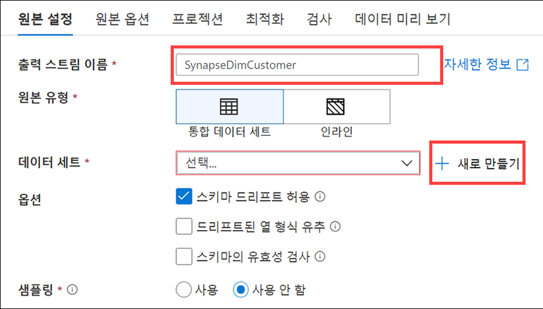

19. 새 통합 데이터 집합 대화 상자에서 **Azure Synapse Analytics**, **계속**을 차례로 선택합니다.

    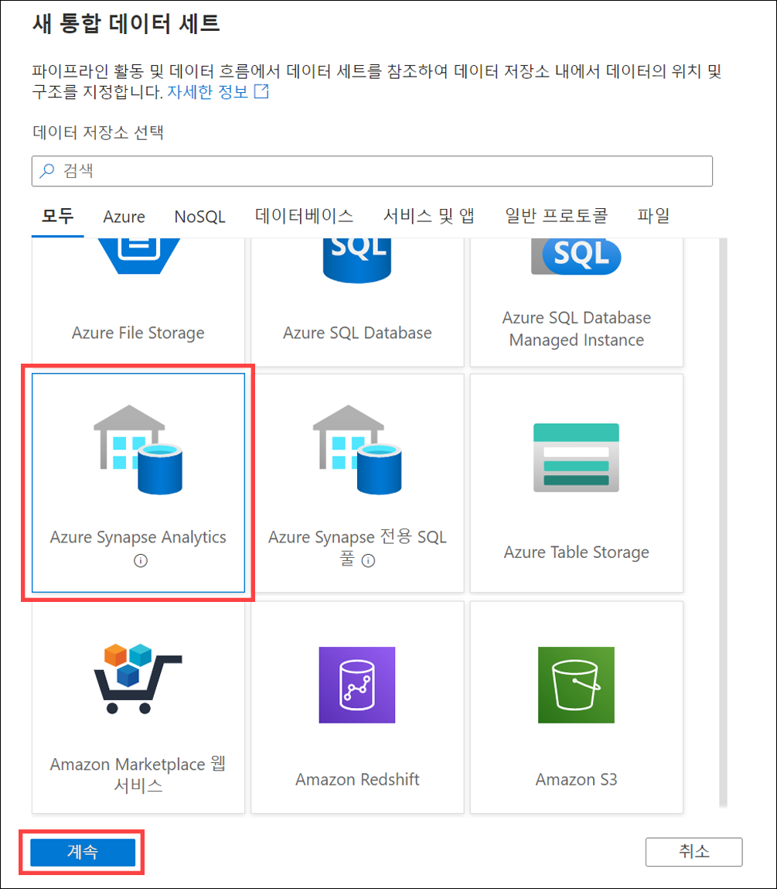

20. 데이터 집합 속성에서 다음 속성을 구성합니다.

    - **이름**: `DimCustomer`를 입력합니다.
    - **연결된 서비스**: Synapse 작업 영역 연결된 서비스를 선택합니다.
    - **테이블 이름**: 드롭다운 옆의 **새로 고침 단추**를 선택합니다.

    

21. **값** 필드에 `SQLPool01`을 입력하고 **확인**을 선택합니다.

    

22. **테이블 이름**에서 `dbo.DimCustomer`를 선택하고 **스키마 가져오기**에서 `From connection/store`를 선택한 후에 **확인**을 선택하여 데이터 집합을 만듭니다.

    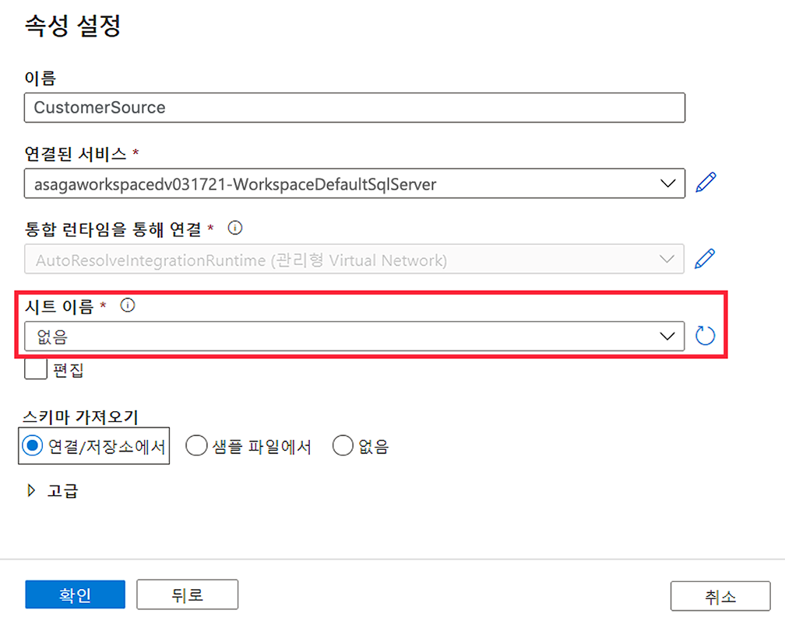

23. `DimCustomer` 데이터 집합이 표시되며 원본 설정의 데이터 집합으로 선택됩니다.

    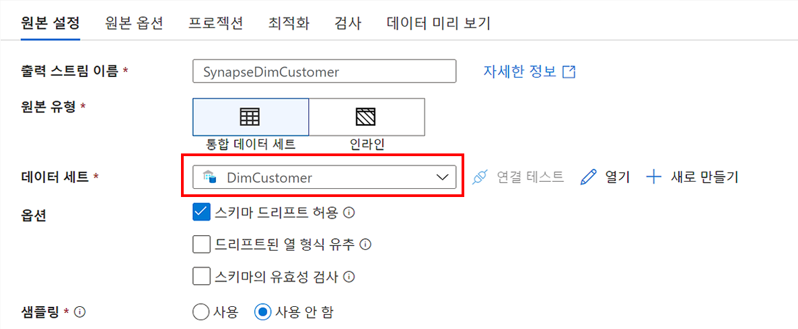

24. 앞에서 추가한 `DimCustomer` 데이터 집합 옆의 **열기**를 선택합니다.

    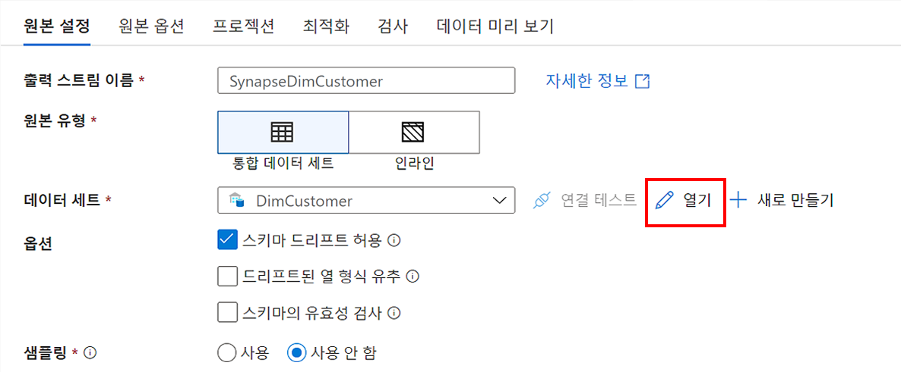

25. `DBName` 옆의 **값** 필드에 `SQLPool01`을 입력합니다.

    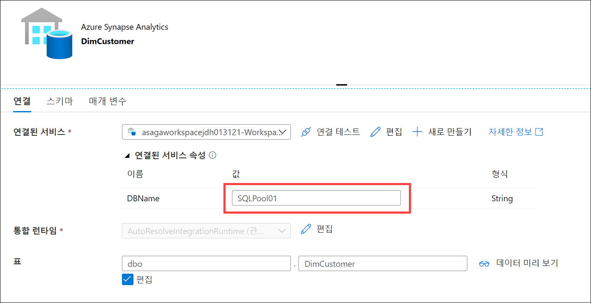

26. 데이터 흐름으로 다시 전환합니다. `DimCustomer` 데이터 집합을 닫지 *마세요*. 캔버스의 `CreateCustomerHash` 파생 열 오른쪽에 있는 **+** 를 선택하고 **Exists**를 선택합니다.

    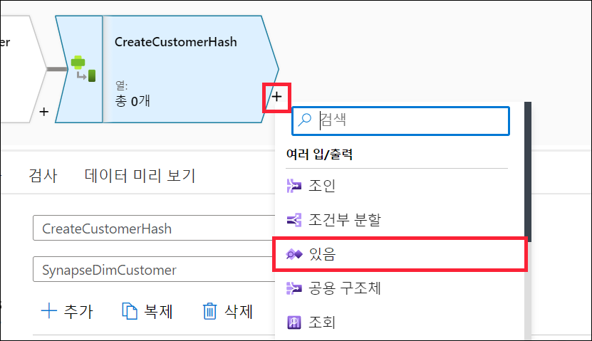

27. `Exists settings`에서 다음 속성을 구성합니다.

    - **출력 스트림 이름**: `Exists`를 입력합니다.
    - **왼쪽 스트림**: `CreateCustomerHash`를 선택합니다.
    - **오른쪽 스트림**: `SynapseDimCustomer`를 선택합니다.
    - **존재 유형**: `Doesn't exist`을 선택합니다.
    - **존재 조건**: 왼쪽 및 오른쪽에 대해 다음 속성을 설정합니다.

    | 왼쪽: CreateCustomerHash의 열 | 오른쪽: SynapseDimCustomer의 열 |
    | --- | --- |
    | `HashKey` | `HashKey` |

    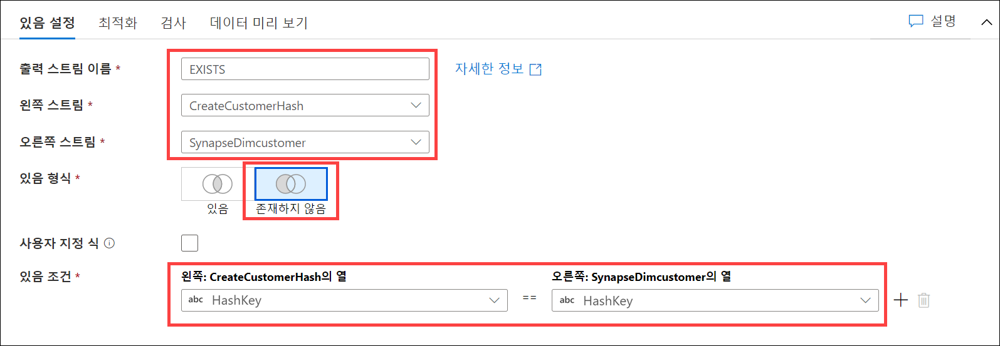

28. 캔버스의 `Exists` 오른쪽에 있는 **+** 를 선택하고 **조회**를 선택합니다.

    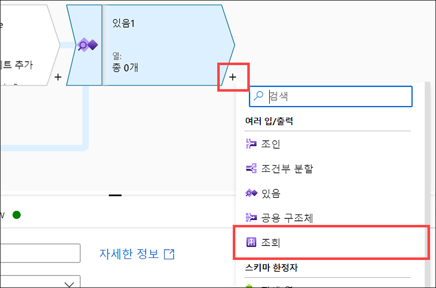

29. `Lookup settings`에서 다음 속성을 구성합니다.

    - **출력 스트림 이름**: `LookupCustomerID`를 입력합니다.
    - **기본 스트림**: `Exists`를 선택합니다.
    - **조회 스트림**: `SynapseDimCustomer`를 선택합니다.
    - **여러 행 일치**: 선택을 취소합니다.
    - **일치 기준**: `Any row`을 선택합니다.
    - **조회 조건**: 왼쪽 및 오른쪽에 대해 다음 속성을 설정합니다.

    | 왼쪽: Exists의 열 | 오른쪽: SynapseDimCustomer의 열 |
    | --- | --- |
    | `CustomerID` | `CustomerID` |

    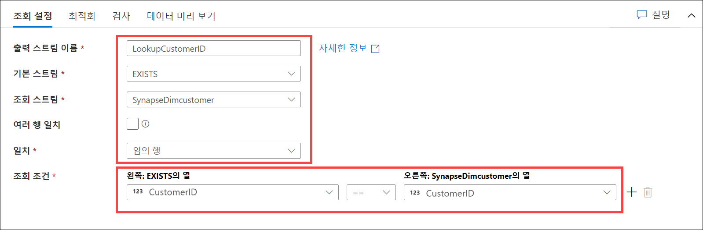

30. 캔버스의 `LookupCustomerID` 오른쪽에 있는 **+** 를 선택하고 **파생 열**을 선택합니다.

    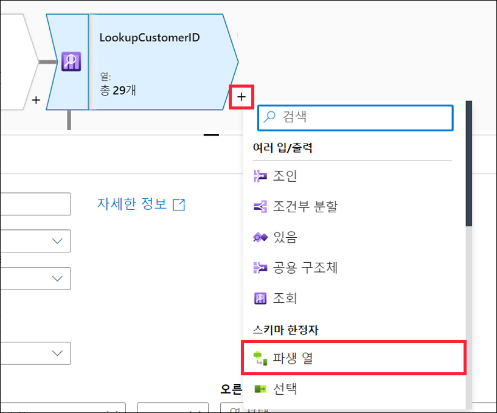

31. `Derived column's settings` 에서 다음 속성을 구성합니다.

    - **출력 스트림 이름**: `SetDates`를 입력합니다.
    - **들어오는 스트림**: `LookupCustomerID`를 선택합니다.
    - **열**: 다음을 입력합니다.

    | 열 | 식 | 설명 |
    | --- | --- | --- |
    | `InsertedDate`를 선택합니다. | `iif(isNull(InsertedDate), currentTimestamp(), {InsertedDate})` | `InsertedDate` 값이 null이면 현재 타임스탬프를 삽입합니다. 그 외의 경우에는 `InsertedDate` 값을 사용합니다. |
    | `ModifiedDate`를 선택합니다. | `currentTimestamp()` | `ModifiedDate` 값을 항상 현재 타임스탬프로 업데이트합니다. |

    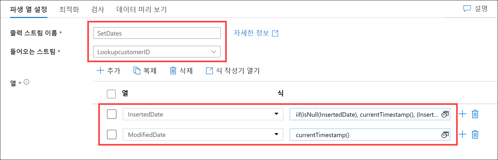

    > **참고**: 두 번째 열을 삽입하려면 열 목록 위의 **+ 추가**를 선택하고 **열 추가**를 선택합니다.

32. 캔버스의 `SetDates` 파생 열 단계 오른쪽에 있는 **+** 를 선택하고 **행 변경**을 선택합니다.

    

33. `Alter row settings`에서 다음 속성을 구성합니다.

    - **출력 스트림 이름**: `AllowUpserts`를 입력합니다.
    - **들어오는 스트림**: `SetDates`를 선택합니다.
    - **행 변경 조건**: 다음을 입력합니다.

    | 조건 | 식 | 설명 |
    | --- | --- | --- |
    | `Upsert if`를 선택합니다. | `true()` | upsert를 허용하려면 `Upsert if` 조건에서 조건을 `true()` 로 설정합니다. 그러면 매핑 데이터 흐름에서 해당 단계를 통과하는 모든 데이터가 싱크에 삽입되거나 업데이트됩니다. |

    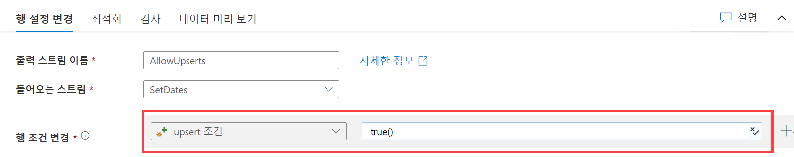

34. 캔버스의 `AllowUpserts` 행 변경 단계 오른쪽에 있는 **+** 를 선택하고 **싱크**를 선택합니다.

    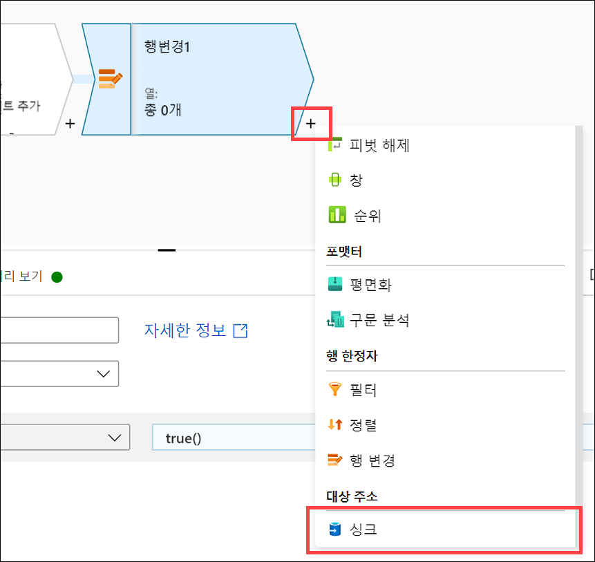

35. `Sink`에서 다음 속성을 구성합니다.

    - **출력 스트림 이름**: `Sink`를 입력합니다.
    - **들어오는 스트림**: `AllowUpserts`를 선택합니다.
    - **싱크 유형**: `Dataset`을 선택합니다.
    - **데이터 집합**: `DimCustomer`를 선택합니다.
    - **옵션**: `Allow schema drift`을 선택하고 `Validate schema`는 선택을 취소합니다.

    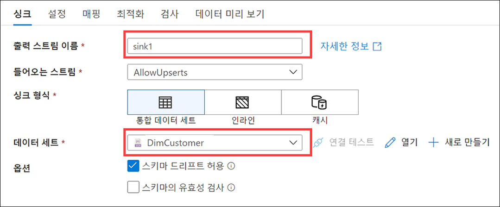

36. **설정** 탭을 선택하고 다음 속성을 구성합니다.

    - **업데이트 방법**: `Allow upsert`을 선택하고 기타 모든 옵션은 선택을 취소합니다.
    - **키 열**: `List of columns`을 선택하고 목록에서 `CustomerID`를 선택합니다.
    - **테이블 작업**: `None`을 선택합니다.
    - **준비 사용**: 선택을 취소합니다.

    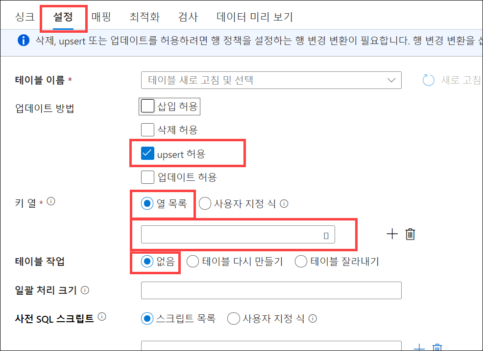

37. **매핑** 탭을 선택하고 **자동 매핑** 선택을 취소합니다. 아래의 설명과 같이 입력 열 매핑을 구성합니다.

    | 입력 열 | 출력 열 |
    | --- | --- |
    | `SourceDB@CustomerID` | `CustomerID` |
    | `SourceDB@Title` | `Title` |
    | `SourceDB@FirstName` | `FirstName` |
    | `SourceDB@MiddleName` | `MiddleName` |
    | `SourceDB@LastName` | `LastName` |
    | `SourceDB@Suffix` | `Suffix` |
    | `SourceDB@CompanyName` | `CompanyName` |
    | `SourceDB@SalesPerson` | `SalesPerson` |
    | `SourceDB@EmailAddress` | `EmailAddress` |
    | `SourceDB@Phone` | `Phone` |
    | `InsertedDate` | `InsertedDate` |
    | `ModifiedDate` | `ModifiedDate` |
    | `CreateCustomerHash@HashKey` | `HashKey` |

    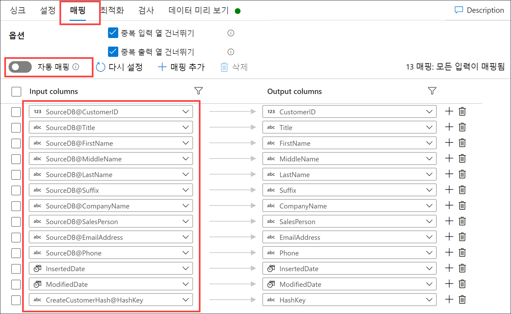

38. 완성된 매핑 흐름은 다음과 같습니다. **모두 게시**를 선택하여 변경 내용을 저장합니다.

    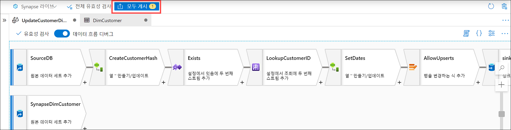

39. **게시**를 선택합니다.

    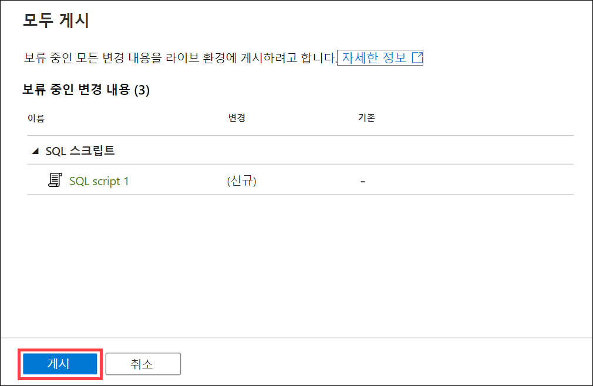

### 작업 3: 파이프라인 만들기 및 데이터 흐름 실행

이 작업에서는 매핑 데이터 흐름 실행을 위한 새 Synapse 통합 파이프라인을 만든 다음 해당 파이프라인을 실행하여 고객 레코드를 upsert합니다.

1. **통합** 허브로 이동합니다.

    

2. **+**, **파이프라인**을 차례로 선택합니다.

    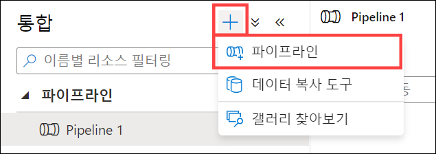

3. 새 파이프라인의 속성 창 **이름** 필드 **(1)** 에 `RunUpdateCustomerDimension`을 입력하고 **속성** 단추 **(2)** 를 선택하여 속성 창을 숨깁니다.

    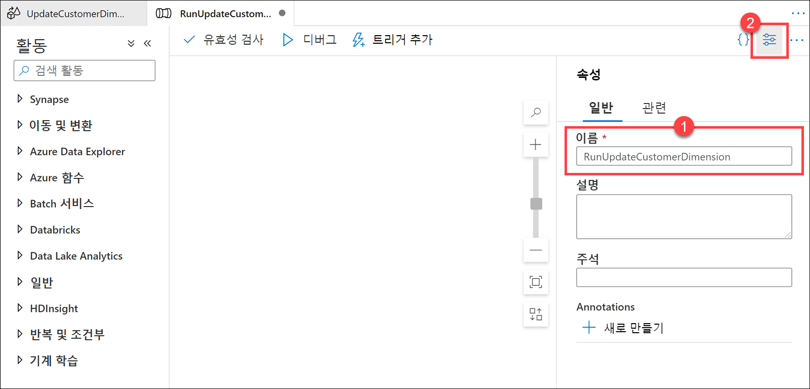

4. 디자인 캔버스 왼쪽의 활동 창 아래에서 `Move & transform`을 확장하고 **데이터 흐름** 활동을 캔버스에 끌어서 놓습니다.

    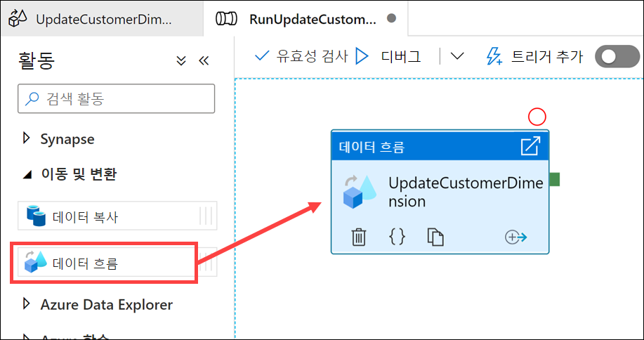

5. `General` 탭에서 이름으로 **UpdateCustomerDimension**을 입력합니다.

    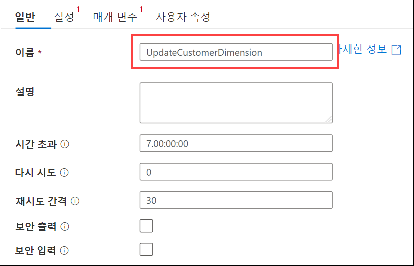

6. `Settings` 탭에서 이름으로 **UpdateCustomerDimension** 데이터 흐름을 선택합니다.

    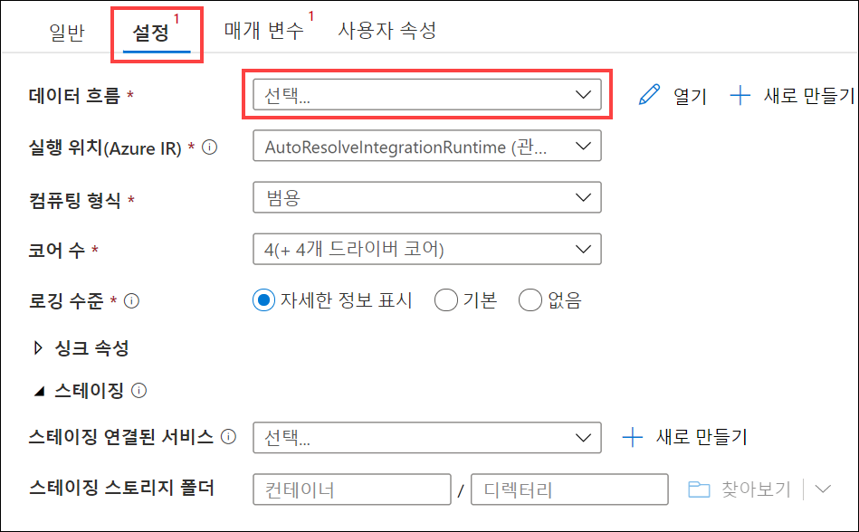

6. **모두 게시**를 선택하고 표시되는 대화 상자에서 **게시**를 선택합니다.

    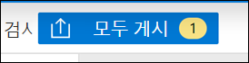

7. 게시가 완료되면 파이프라인 캔버스 위의 **트리거 추가**를 선택하고 **지금 트리거**를 선택합니다.

    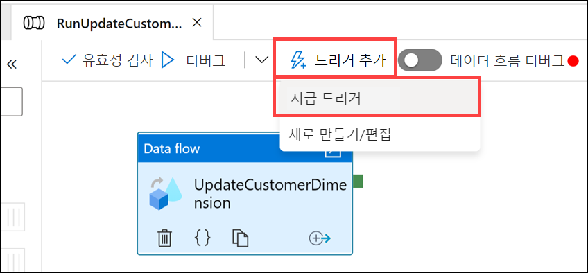

8. **모니터** 허브로 이동합니다.

    

9. 왼쪽 메뉴 **(1)** 에서 **파이프라인 실행**을 선택하고 파이프라인 실행이 정상적으로 완료될 때까지 기다립니다 **(2)**. 파이프라인 실행이 완료될 때까지 **새로 고침(3)** 을 여러 번 선택해야 할 수도 있습니다.

    

### 작업 4: 삽입된 데이터 확인

1. **데이터** 허브로 이동합니다.

    

2. **작업 영역** 탭 **(1)** 을 선택하고 데이터베이스를 확장한 다음 **SQLPool01(2)** 을 마우스 오른쪽 단추로 클릭합니다. **새 SQL 스크립트(3)**, **빈 스크립트(4)** 를 차례로 선택합니다.

    

3. 쿼리 창에 다음 스크립트를 붙여넣고 **실행**을 선택하거나 F5 키를 눌러 스크립트를 실행한 후에 결과를 확인합니다.

    ```sql
    SELECT * FROM DimCustomer
    ```

    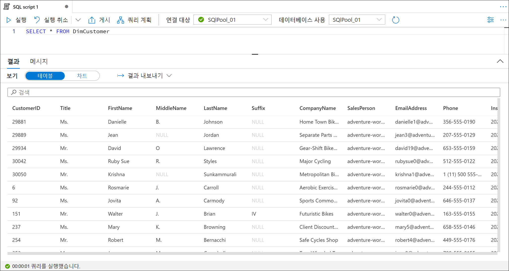

### 작업 5: 원본 고객 레코드 업데이트

1. Azure Data Studio를 엽니다. Azure Data Studio가 아직 열려 있으면 Studio로 다시 전환합니다.

2. 왼쪽 메뉴에서 **서버**를 선택하고 랩을 시작할 때 추가한 SQL Server를 마우스 오른쪽 단추로 클릭합니다. **새 쿼리**를 선택합니다.

    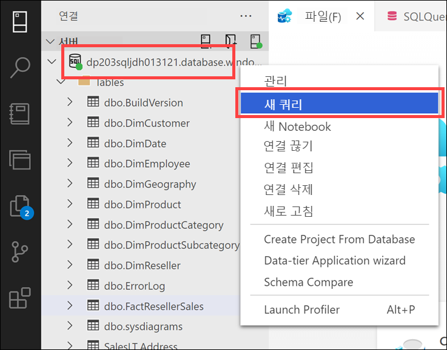

3. 쿼리 창에 다음 스크립트를 붙여넣어 `CustomerID`가 10인 고객을 표시합니다.

    ```sql
    SELECT * FROM [SalesLT].[Customer] WHERE CustomerID = 10
    ```

4. **실행**을 선택하거나 `F5` 키를 눌러 쿼리를 실행합니다.

    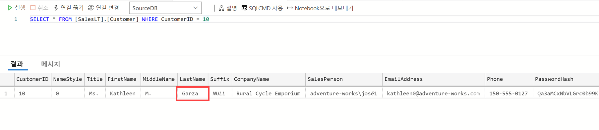

    Ms. Kathleen M. Garza 고객이 표시됩니다. 고객 성을 변경해 보겠습니다.

5. 쿼리를 다음 코드로 바꾼 다음 **실행**하여 고객 성을 업데이트합니다.

    ```sql
    UPDATE [SalesLT].[Customer] SET LastName = 'Smith' WHERE CustomerID = 10
    SELECT * FROM [SalesLT].[Customer] WHERE CustomerID = 10
    ```

    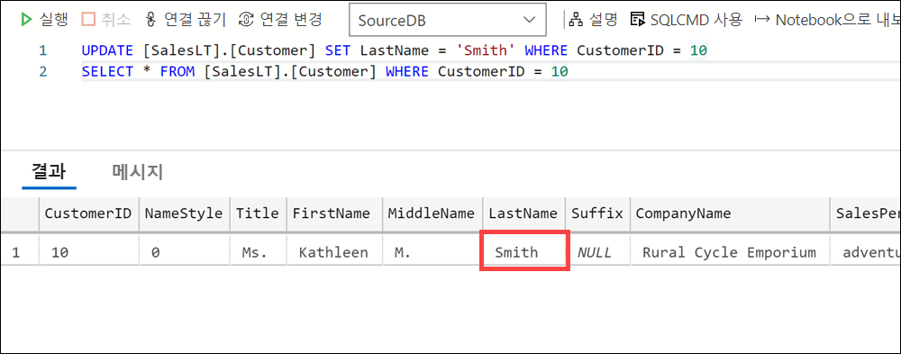

### 작업 6: 매핑 데이터 흐름 다시 실행

1. Synapse Studio로 다시 전환합니다.

2. **통합** 허브로 이동합니다.

    

3. **RunUpdateCustomerDimension** 파이프라인을 선택합니다.

    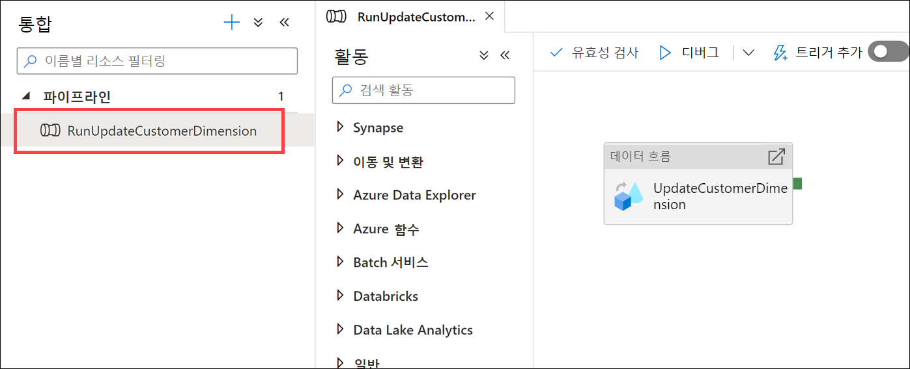

4. 파이프라인 캔버스 위의 **트리거 추가**를 선택하고 **지금 트리거**를 선택합니다.

    

5. `Pipeline run` 대화 상자에서 **확인**을 선택하여 파이프라인을 트리거합니다.

    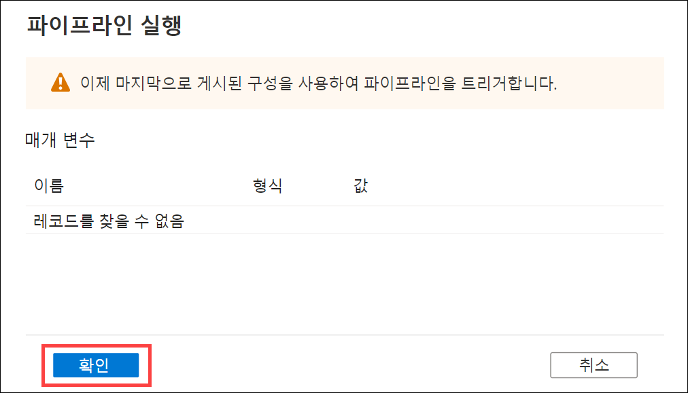

6. **모니터** 허브로 이동합니다.

    

7. 왼쪽 메뉴 **(1)** 에서 **파이프라인 실행**을 선택하고 파이프라인 실행이 정상적으로 완료될 때까지 기다립니다 **(2)**. 파이프라인 실행이 완료될 때까지 **새로 고침(3)** 을 여러 번 선택해야 할 수도 있습니다.

    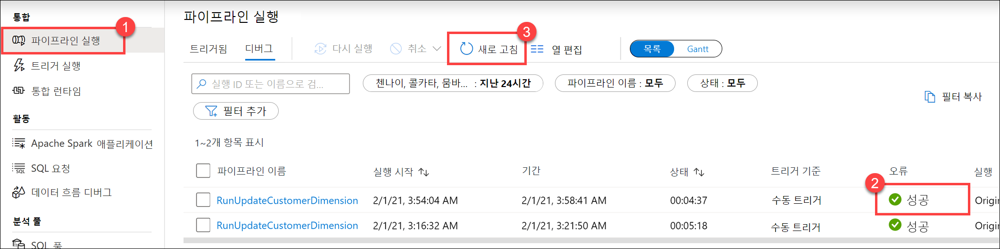

### 작업 7: 업데이트된 레코드 확인

1. **데이터** 허브로 이동합니다.

    

2. **작업 영역** 탭 **(1)** 을 선택하고 데이터베이스를 확장한 다음 **SQLPool01(2)** 을 마우스 오른쪽 단추로 클릭합니다. **새 SQL 스크립트(3)**, **빈 스크립트(4)** 를 차례로 선택합니다.

    

3. 쿼리 창에 다음 스크립트를 붙여넣고 실행을 선택하거나 F5 키를 눌러 스크립트를 실행한 후에 결과를 확인합니다.

    ```sql
    SELECT * FROM DimCustomer WHERE CustomerID = 10
    ```

    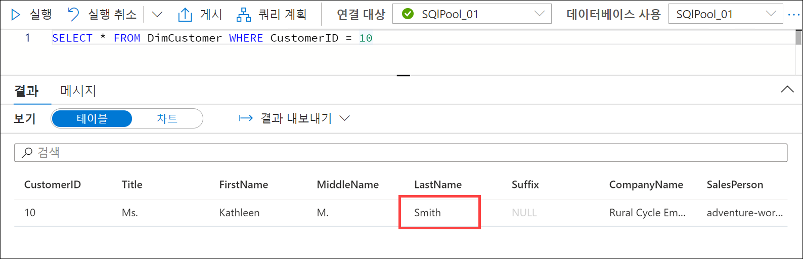

    출력에서 확인할 수 있듯이 고객 레코드가 정상적으로 업데이트되어 `LastName` 값이 원본 레코드와 일치하도록 수정되었습니다.

## 연습 6: 정리

다음 단계를 완료하여 더 이상 필요없는 리소스를 정리할 수 있습니다.

### 작업 1: 전용 SQL 풀 일시 중지

1. Synapse Studio(<https://web.azuresynapse.net/>)를 엽니다.

2. **관리** 허브를 선택합니다.

    

3. 왼쪽 메뉴에서 **SQL 풀**을 선택합니다 **(1)**. 전용 SQL 풀의 이름을 마우스 커서로 가리키고 **일시 중지(2)** 를 선택합니다.

    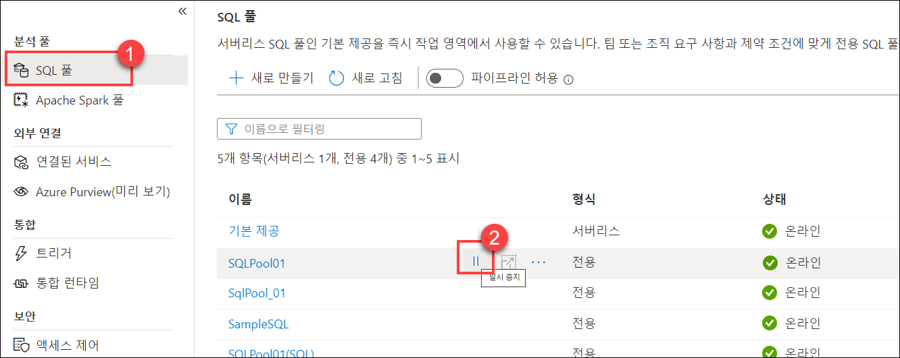

4. 메시지가 표시되면 **일시 중지**를 선택합니다.

    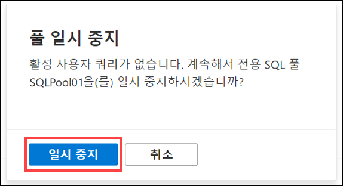
