# 모듈 8 - Azure Data Factory 또는 Azure Synapse 파이프라인을 사용하여 데이터 변환

이 모듈에서는 여러 데이터 원본에서 데이터를 수집하기 위한 데이터 통합 파이프라인을 작성하고, 매핑 데이터 흐름 및 Notebooks를 사용하여 데이터를 변환하고, 데이터 싱크 하나 이상으로의 데이터 이동을 수행하는 방법을 배웁니다.

이 모듈을 완료하면 다음 작업을 수행할 수 있습니다.

- Azure Synapse 파이프라인을 사용하여 코드 없는 대규모 변환 실행
- 데이터 파이프라인을 만들어 서식이 잘못 지정된 CSV 파일 가져오기
- 매핑 데이터 흐름 만들기

## 랩 세부 정보

- [모듈 8 - Azure Data Factory 또는 Azure Synapse 파이프라인을 사용하여 데이터 변환](#module-8---transform-data-with-azure-data-factory-or-azure-synapse-pipelines)
  - [랩 세부 정보](#lab-details)
  - [랩 설정 및 필수 구성 요소](#lab-setup-and-pre-requisites)
  - [연습 0: 전용 SQL 풀 시작](#exercise-0-start-the-dedicated-sql-pool)
  - [랩 1: Azure Synapse 파이프라인을 통한 코드 없는 대규모 변환](#lab-1-code-free-transformation-at-scale-with-azure-synapse-pipelines)
    - [연습 1: 아티팩트 만들기](#exercise-1-create-artifacts)
      - [작업 1: SQL 테이블 만들기](#task-1-create-sql-table)
      - [작업 2: 연결된 서비스 만들기](#task-2-create-linked-service)
      - [작업 3: 데이터 집합 만들기](#task-3-create-data-sets)
      - [작업 4: 캠페인 분석 데이터 집합 만들기](#task-4-create-campaign-analytics-dataset)
    - [연습 2: 데이터 파이프라인을 만들어 서식이 잘못 지정된 CSV 가져오기](#exercise-2-create-data-pipeline-to-import-poorly-formatted-csv)
      - [작업 1: 캠페인 분석 데이터 흐름 만들기](#task-1-create-campaign-analytics-data-flow)
      - [작업 2: 캠페인 분석 데이터 파이프라인 만들기](#task-2-create-campaign-analytics-data-pipeline)
      - [작업 3: 캠페인 분석 데이터 파이프라인 실행](#task-3-run-the-campaign-analytics-data-pipeline)
      - [작업 4: 캠페인 분석 테이블 콘텐츠 확인](#task-4-view-campaign-analytics-table-contents)
    - [연습 3: 구매 수 상위 제품용 매핑 데이터 흐름 만들기](#exercise-3-create-mapping-data-flow-for-top-product-purchases)
      - [작업 1: 매핑 데이터 흐름 만들기](#task-1-create-mapping-data-flow)
  - [랩 2: Azure Synapse 파이프라인에서 데이터 이동 및 변환 오케스트레이션](#lab-2-orchestrate-data-movement-and-transformation-in-azure-synapse-pipelines)
    - [연습 1: 파이프라인 만들기, 트리거 및 모니터링](#exercise-1-create-trigger-and-monitor-pipeline)
      - [작업 1: 파이프라인 만들기](#task-1-create-pipeline)
      - [작업 2: 사용자 프로필 데이터 파이프라인 트리거, 모니터링 및 분석](#task-2-trigger-monitor-and-analyze-the-user-profile-data-pipeline)
    - [연습 2: 정리](#exercise-2-cleanup)
      - [작업 1: 전용 SQL 풀 일시 중지](#task-1-pause-the-dedicated-sql-pool)

## 랩 설정 및 필수 구성 요소

> **참고:** `Lab setup and pre-requisites` 단계는 호스트된 랩 환경이 **아닌**자체 Azure 구독을 사용하는 경우에만 완료하세요. 호스트된 랩 환경을 사용하는 경우에는 연습 0부터 바로 진행하면 됩니다.

이 모듈의 **[랩 설정 지침](https://github.com/solliancenet/microsoft-data-engineering-ilt-deploy/blob/main/setup/04/README.md)에 나와 있는 작업을 완료**하세요.

다음 모듈에서도 이 모듈과 같은 환경을 사용합니다.

- [모듈 4](labs/04/README.md)
- [모듈 5](labs/05/README.md)
- [모듈 7](labs/07/README.md)
- [모듈 8](labs/08/README.md)
- [모듈 9](labs/09/README.md)
- [모듈 10](labs/10/README.md)
- [모듈 11](labs/11/README.md)
- [모듈 12](labs/12/README.md)
- [모듈 13](labs/13/README.md)
- [모듈 16](labs/16/README.md)

## 연습 0: 전용 SQL 풀 시작

이 랩에서는 전용 SQL 풀을 사용합니다. 그러므로 첫 단계에서는 풀이 일시 중지되지 않았는지를 확인해야 합니다. 풀이 일시 중지되었다면 아래 지침에 따라 풀을 시작합니다.

1. Synapse Studio(<https://web.azuresynapse.net/>)를 엽니다.

2. **관리** 허브를 선택합니다.

    

3. 왼쪽 메뉴에서 **SQL 풀**을 선택합니다 **(1)**. 전용 SQL 풀이 일시 중지되어 있으면 풀 이름을 커서로 가리키고 **다시 시작(2)** 을 선택합니다.

    

4. 메시지가 표시되면 **다시 시작**을 선택합니다. 풀이 다시 시작되려면 1~2분 정도 걸립니다.

    

> 전용 SQL 풀이 다시 시작되는 동안 **다음 연습을 계속 진행**합니다.

## 랩 1: Azure Synapse 파이프라인을 통한 코드 없는 대규모 변환

Tailwind Traders는 데이터 엔지니어리이 작업에 코드 없는 옵션을 사용하고자 합니다. 데이터의 특성은 파악하고 있지만 개발 경험은 많지 않은 신입급 데이터 엔지니어도 데이터 변환 작업 작성 및 유지 관리를 수행할 수 있도록 하기 위해서입니다. 그와 동시에, 특정 버전만 사용해야 하는 복잡한 코드 사용 시의 불안정한 작업 방식을 줄이고 코드 테스트 요구 사항을 해소하면서 장기적인 유지 관리 편의성도 개선해야 하기 때문입니다.

뿐만 아니라, 전용 SQL 풀 외에 데이터 레이크에서 변환된 데이터도 유지 관리해야 합니다. 코드 없는 옵션을 사용하면 기존에는 팩트 테이블과 차원 테이블에 저장했던 데이터 집합에 필드를 더 많이 포함할 수 있습니다. 그러면 전용 SQL 풀이 일시 중지된 상태에서도 데이터에 액세스할 수 있으므로 비용을 최적화할 수 있습니다.

이러한 요구 사항을 감안하여 매핑 데이터 흐름 작성을 추천했습니다.

매핑 데이터 흐름은 코드 없는 환경을 통해 시각적으로 데이터 변환 방식을 지정할 수 있는 파이프라인 작업입니다. 이 기능을 사용하면 데이터 정리, 변형, 집계, 변환, 조인, 데이터 복사 작업 등을 수행할 수 있습니다.

추가 이점

- Spark를 실행하여 크기 조정 가능
- 경험을 토대로 지침을 제공하여 복원력 있는 데이터 흐름을 손쉽게 작성할 수 있음
- 사용자가 원하는 방식으로 유연하게 데이터 변환 가능
- 한 위치에서 데이터 흐름 모니터링 및 관리 가능

### 연습 1: 아티팩트 만들기

#### 작업 1: SQL 테이블 만들기

여기서 작성할 매핑 데이터 흐름은 전용 SQL 풀에 사용자 구매 데이터를 씁니다. 그런데 Tailwind Traders에는 이 데이터를 저장할 테이블이 아직 없습니다. 그러므로, 먼저 SQL 스크립트를 실행하여 이 테이블(필수 구성 요소)을 만들겠습니다.

1. Synapse Analytics Studio(<https://web.azuresynapse.net/>)를 열고 **개발** 허브로 이동합니다.

    

2. **개발** 메뉴에서 **+** 단추 **(1)** 를 선택하고 컨텍스트 메뉴에서 **SQL 스크립트(2)** 를 선택합니다.

    

3. 도구 모음 메뉴에서 **SQLPool01** 데이터베이스에 연결하여 쿼리를 실행합니다.

    

4. 쿼리 창에서 스크립트를 다음 코드로 바꿔 새 테이블을 만듭니다. 이 테이블은 Azure Cosmos DB에 저장되어 있는 사용자의 선호 제품을 전자 상거래 사이트의 사용자별 구매 수 상위 제품(데이터 레이크 내의 JSON 파일에 저장되어 있음)과 조인합니다.

    ```sql
    CREATE TABLE [wwi].[UserTopProductPurchases]
    (
        [UserId] [int]  NOT NULL,
        [ProductId] [int]  NOT NULL,
        [ItemsPurchasedLast12Months] [int]  NULL,
        [IsTopProduct] [bit]  NOT NULL,
        [IsPreferredProduct] [bit]  NOT NULL
    )
    WITH
    (
        DISTRIBUTION = HASH ( [UserId] ),
        CLUSTERED COLUMNSTORE INDEX
    )
    ```

5. 도구 모음 메뉴에서 **실행**을 선택하여 SQL 명령을 실행합니다.

    

6. 쿼리 창에서 스크립트를 다음 코드로 바꿔 캠페인 분석 CSV 파일용으로 새 테이블을 만듭니다.

    ```sql
    CREATE TABLE [wwi].[CampaignAnalytics]
    (
        [Region] [nvarchar](50)  NOT NULL,
        [Country] [nvarchar](30)  NOT NULL,
        [ProductCategory] [nvarchar](50)  NOT NULL,
        [CampaignName] [nvarchar](500)  NOT NULL,
        [Revenue] [decimal](10,2)  NULL,
        [RevenueTarget] [decimal](10,2)  NULL,
        [City] [nvarchar](50)  NULL,
        [State] [nvarchar](25)  NULL
    )
    WITH
    (
        DISTRIBUTION = HASH ( [Region] ),
        CLUSTERED COLUMNSTORE INDEX
    )
    ```

7. 도구 모음 메뉴에서 **실행**을 선택하여 SQL 명령을 실행합니다.

    

#### 작업 2: 연결된 서비스 만들기

매핑 데이터 흐름에서 사용할 데이터 원본 중 하나는 Azure Cosmos DB입니다. 그런데 Tailwind Traders는 연결된 서비스를 아직 만들지 않았습니다. 그러므로 이 섹션의 단계에 따라 연결된 서비스를 만들어야 합니다.

> **참고**: Cosmos DB 연결된 서비스를 이미 만든 경우에는 이 섹션을 건너뛰면 됩니다.

1. **관리** 허브로 이동합니다.

    

2. **연결된 서비스**를 열고 **+새로 만들기**를 선택하여 새 연결된 서비스를 만듭니다. 옵션 목록에서 **Azure Cosmos DB(SQL API)** 를 선택하고 **계속**을 선택합니다.

    

3. 연결된 서비스의 이름을 `asacosmosdb01` **(1)** 로 지정하고 **Cosmos DB 계정 이름** (`asacosmosdbSUFFIX`)를 선택한 후에 **데이터베이스 이름** 값을 `CustomerProfile` **(2)** 로 설정합니다. **연결 테스트**를 선택하여 서비스에 정상적으로 연결되는지 확인 **(3)** 한 다음 **만들기(4)** 를 선택합니다.

    

#### 작업 3: 데이터 집합 만들기

사용자 프로필 데이터는 두 가지 데이터 원본에서 제공됩니다. 이 두 원본, 즉 `asal400_ecommerce_userprofiles_source` 및 `asal400_customerprofile_cosmosdb`를 지금 만들 것입니다. 전자 상거래 시스템의 고객 프로필 데이터는 데이터 레이크의 JSON 파일 내에 저장되어 있습니다. 이 데이터에서는 지난 12개월 동안 사이트를 방문한 각 방문자(고객)의 구매 수가 가장 많은 상위 제품 관련 정보를 제공합니다. 선호하는 제품, 제품 리뷰 등이 포함된 사용자 프로필 데이터는 Cosmos DB에 JSON 문서로 저장되어 있습니다.

이 섹션에서는 SQL 테이블용 데이터 집합을 만듭니다. 이 데이터 집합은 랩 뒷부분에서 만들 데이터 파이프라인용 데이터 싱크로 사용됩니다.

아래 단계를 완료하여 데이터 집합 2개, 즉 `asal400_ecommerce_userprofiles_source` 및 `asal400_customerprofile_cosmosdb`를 만듭니다.

1. **데이터** 허브로 이동합니다.

    

2. 도구 모음에서 **+(1)** 를 선택하고 **통합 데이터 집합(2)** 을 선택하여 새 데이터 집합을 만듭니다.

    

3. 목록에서 **Azure Cosmos DB(SQL API)** **(1)** 를 선택하고 **계속(2)** 을 선택합니다.

    

4. 다음 특성으로 데이터 집합을 구성하고 **확인(4)** 을 선택합니다.

    - **이름**: `asal400_customerprofile_cosmosdb`**(1)** 를 입력합니다.
    - **연결된 서비스**: Azure Cosmos DB 연결된 서비스 **(2)** 를 선택합니다.
    - **컬렉션**: `OnlineUserProfile01`**(3)** 을 선택합니다.

    

5. 데이터 집합을 만든 후 **연결** 탭에서 **데이터 미리 보기**를 선택합니다.

    

6. 데이터 미리 보기를 선택하면 선택한 Azure Cosmos DB 컬렉션을 대상으로 쿼리가 실행되어 해당 컬렉션 내의 문서 샘플이 반환됩니다. JSON 형식으로 저장되어 있는 샘플 문서에는 `userId` field, `cartId`, `preferredProducts`(제품 ID 배열, 비어 있을 수도 있음), `productReviews`(고객이 작성한 제품 리뷰 배열, 비어 있을 수도 있음)가 포함되어 있습니다.

    

7. 도구 모음에서 **+** **(1)** 를 선택하고 **통합 데이터 집합(2)** 을 선택하여 새 데이터 집합을 만듭니다.

    

8. 목록에서 **Azure Data Lake Storage Gen2** **(1)** 를 선택하고 **계속(2)** 을 선택합니다.

    

9. **JSON** 형식 **(1)** 을 선택하고 **계속(2)** 을 선택합니다.

    

10. 다음 특성으로 데이터 집합을 구성하고 **확인(5)** 을 선택합니다.

    - **이름**: `asal400_ecommerce_userprofiles_source`**(1)** 를 입력합니다.
    - **연결된 서비스**: 이미 있는 `asadatalakeXX` 연결된 서비스 **(2)** 를 선택합니다.
    - **파일 경로**: `wwi-02/online-user-profiles-02` 경로 **(3)** 로 이동합니다.
    - **스키마 가져오기**: `From connection/store`**(4)** 를 선택합니다.

    

11. 도구 모음에서 **+** **(1)** 를 선택하고 **통합 데이터 집합(2)** 을 선택하여 새 데이터 집합을 만듭니다.

    

12. 목록에서 **Azure Synapse Analytics** **(1)** 를 선택하고 **계속(2)** 을 선택합니다.

    

13. 다음 특성으로 데이터 집합을 구성하고 **확인(5)** 을 선택합니다.

    - **이름**: `asal400_wwi_campaign_analytics_asa`**(1)** 를 입력합니다.
    - **연결된 서비스**: `SqlPool01` 서비스 **(2)** 를 선택합니다.
    - **테이블 이름**: `wwi.CampaignAnalytics` **(3)** 를 선택합니다.
    - **스키마 가져오기**: `From connection/store` **(4)** 를 선택합니다.

    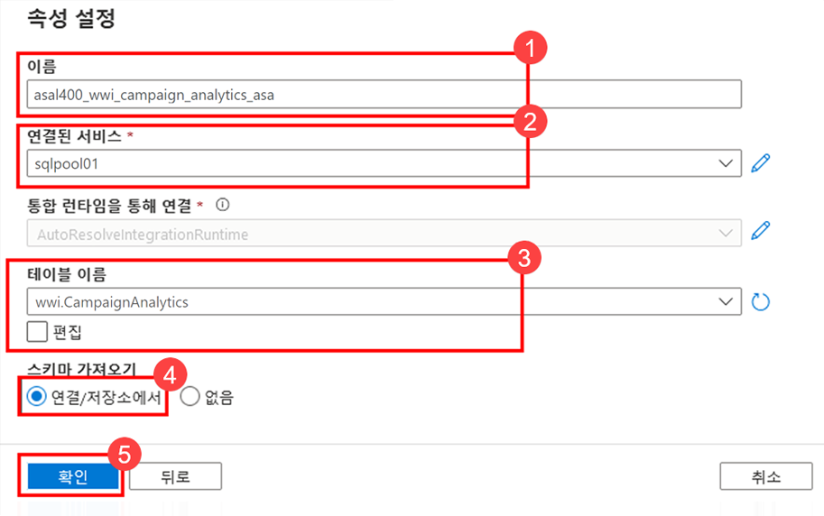

14. 도구 모음에서 **+** **(1)** 를 선택하고 **통합 데이터 집합(2)** 을 선택하여 새 데이터 집합을 만듭니다.

    

15. 목록에서 **Azure Synapse Analytics** **(1)** 를 선택하고 **계속(2)** 을 선택합니다.

    

16. 다음 특성으로 데이터 집합을 구성하고 **확인(5)** 을 선택합니다.

    - **이름**: `asal400_wwi_usertopproductpurchases_asa`**(1)** 를 입력합니다.
    - **연결된 서비스**: `SqlPool01` 서비스 **(2)** 를 선택합니다.
    - **테이블 이름**: `wwi.UserTopProductPurchases`**(3)** 를 선택합니다.
    - **스키마 가져오기**: `From connection/store`**(4)** 를 선택합니다.

    

#### 작업 4: 캠페인 분석 데이터 집합 만들기

조직에서 제공한 마케팅 캠페인 데이터가 들어 있는 CSV 파일의 형식이 적절하지 않습니다. 데이터 레이크에 업로드된 이 파일을 데이터 웨어하우스로 가져와야 합니다.


이 파일에는 수익 통화 데이터의 문자가 잘못되어 있고 열도 제대로 정렬되어 있지 않은 등 여러 가지 문제가 있습니다.

1. **데이터** 허브로 이동합니다.

    

2. 도구 모음에서 **+** **(1)** 를 선택하고 **통합 데이터 집합(2)** 을 선택하여 새 데이터 집합을 만듭니다.

    

3. 목록에서 **Azure Data Lake Storage Gen2** **(1)** 를 선택하고 **계속(2)** 을 선택합니다.

    

4. **DelimitedText** 형식 **(1)** 을 선택하고 **계속(2)** 을 선택합니다.

    

5. 다음 특성으로 데이터 집합을 구성하고 **확인(6)** 을 선택합니다.

    - **이름**: `asal400_campaign_analytics_source` **(1)** 를 입력합니다.
    - **연결된 서비스**: `asadatalakeSUFFIX` 연결된 서비스 **(2)** 를 선택합니다.
    - **파일 경로**: `wwi-02/campaign-analytics/campaignanalytics.csv` 경로 **(3)** 로 이동합니다.
    - **첫 번째 행을 머리글로 사용**: `unchecked`**(4)** 한 상태로 유지합니다. **헤더를 건너뛰는** 이유는, 헤더의 열 수와 데이터 행의 열 수가 일치하지 않기 때문입니다.
    - **스키마 가져오기**: `From connection/store`**(5)** 를 선택합니다.

    

6. 데이터 집합을 만든 후 해당 데이터 집합의 **연결** 탭으로 이동합니다. 기본 설정은 그대로 둡니다. 기본 설정은 다음 구성과 일치해야 합니다.

    - **압축 형식**: `none`을 선택합니다.
    - **열 구분 기호**: `Comma (,)`를 선택합니다.
    - **행 구분 기호**: `Default (\r,\n 또는 \r\n)`을 선택합니다.
    - **인코딩**: `Default(UTF-8)` 을 선택합니다.
    - **이스케이프 문자**: `Backslash(\)` 를 선택합니다.
    - **따옴표**: `Double quote(")` 를 선택합니다.
    - **첫 번째 행을 머리글로 사용**: `unchecked`한 상태로 유지합니다.
    - **Null 값**: 필드를 비워 둡니다.

    

7. **데이터 미리 보기**를 선택합니다.

8. 데이터 미리 보기를 선택하면 CSV 파일 샘플이 표시됩니다. 이 작업 시작 부분에 있는 스크린샷에 나와 있던 몇 가지 문제를 확인할 수 있습니다. 여기서는 첫 번째 행을 머리글로 설정하지 않았으므로 헤더 열이 첫 번째 행으로 표시됩니다. 또한 위의 스크린샷에는 나와 있던 City 및 State 값은 표시되지 않습니다. 헤더 행의 열 수와 파일 나머지 부분의 열 수가 일치하지 않기 때문입니다. 다음 연습에서 데이터 흐름을 만들 때 첫 번째 행을 제외하겠습니다.

    

9. **모두 게시**, **게시**를 차례로 선택하여 새 리소스를 저장합니다.

    

### 연습 2: 데이터 파이프라인을 만들어 서식이 잘못 지정된 CSV 가져오기

#### 작업 1: 캠페인 분석 데이터 흐름 만들기

1. **개발** 허브로 이동합니다.

    

2. +, **데이터 흐름**을 차례로 선택하여 새 데이터 흐름을 만듭니다.

    

3. 새 데이터 흐름 **속성** 블레이드의 **일반** 설정에서 **이름**을 `asal400_lab2_writecampaignanalyticstoasa`로 업데이트합니다.

    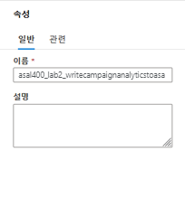

4. 데이터 흐름 캔버스에서 **원본 추가**를 선택합니다.

    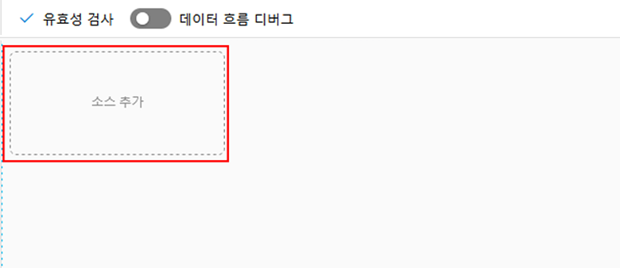

5. **원본 설정**에서 다음 항목을 구성합니다.

    - **출력 스트림 이름**: `CampaignAnalytics`를 입력합니다.
    - **원본 유형**: `Dataset`을 선택합니다.
    - **데이터 집합**: `asal400_campaign_analytics_source`를 선택합니다.
    - **옵션**: `Allow schema drift`을 선택하고 나머지 옵션은 선택하지 않은 상태로 유지합니다.
    - **열 계산 건너뛰기**: `1`을 입력합니다. 그러면 CSV 파일의 나머지 행보다 열 수가 2개 적은 헤더 행을 건너뛰어 마지막 데이터 열 2개를 자를 수 있습니다.
    - **샘플링**: `Disable` 을 선택합니다.

    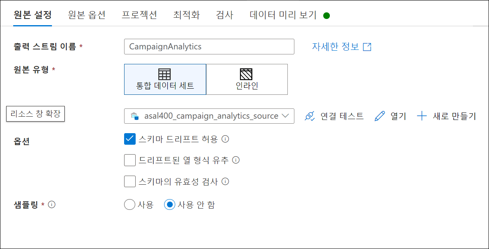

6. 데이터 흐름을 만들 때는 디버그를 활성화하면 데이터 미리 보기, 스키마(프로젝션) 가져오기 등의 특정 기능이 사용하도록 설정됩니다. 하지만 이 옵션을 사용하도록 설정하려면 시간도 오래 걸리고 랩 환경에는 제약 조건도 적용되므로, 이러한 기능은 무시하도록 하겠습니다. 이제 데이터 원본의 스키마를 설정해야 합니다. 이렇게 하려면 디자인 캔버스 위의 **스크립트**를 선택합니다.

    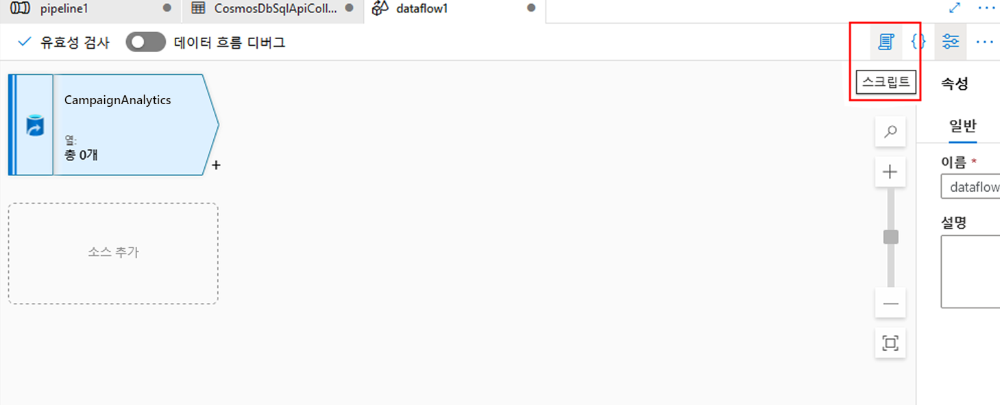

7. 스크립트를 다음 코드로 바꿔 열 매핑(`output`)을 제공하고 **확인**을 선택합니다.

    ```json
    source(output(
            {_col0_} as string,
            {_col1_} as string,
            {_col2_} as string,
            {_col3_} as string,
            {_col4_} as string,
            {_col5_} as double,
            {_col6_} as string,
            {_col7_} as double,
            {_col8_} as string,
            {_col9_} as string
        ),
        allowSchemaDrift: true,
        validateSchema: false,
        ignoreNoFilesFound: false) ~> CampaignAnalytics
    ```

    스크립트가 다음과 같이 표시되어야 합니다.

    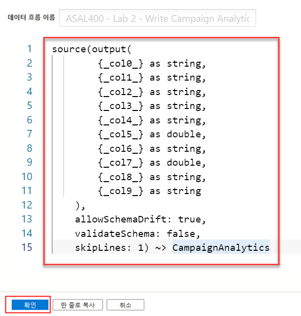

8. **CampaignAnalytics** 데이터 원본과 **프로젝션**을 차례로 선택합니다. 프로젝션에 다음 스키마가 표시됩니다.

    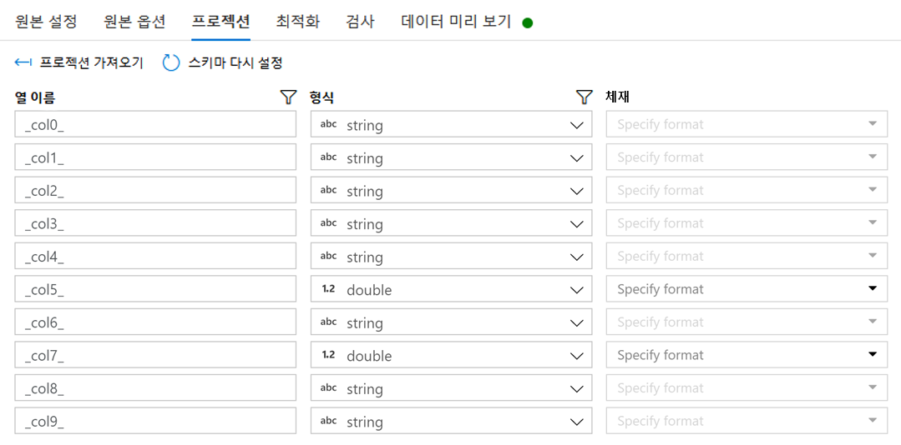

9. `CampaignAnalytics` 원본 오른쪽의 **+** 를 선택한 다음 상황에 맞는 메뉴에서 **Select** 스키마 한정자를 선택합니다.

    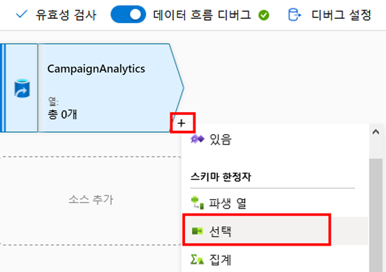

10. **Select 설정**에서 다음 항목을 구성합니다.

    - **출력 스트림 이름**: `MapCampaignAnalytics`를 입력합니다.
    - **들어오는 스트림**: `CampaignAnalytics`를 선택합니다.
    - **옵션**: 두 옵션을 모두 선택합니다.
    - **입력 열**: `Auto mapping` 이 선택 취소되어 있는지 확인하고 **다른 이름 지정** 필드에 다음 값을 입력합니다.
      - Region
      - Country
      - ProductCategory
      - CampaignName
      - RevenuePart1
      - Revenue
      - RevenueTargetPart1
      - RevenueTarget
      - City
      - State

    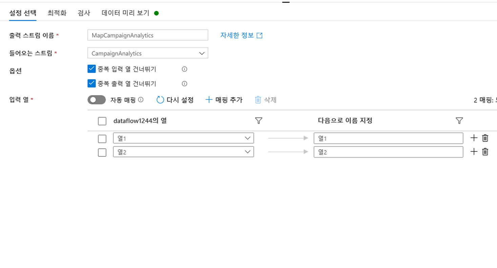

11. `MapCampaignAnalytics` 원본 오른쪽의 **+** 를 선택한 다음 상황에 맞는 메뉴에서 **파생 열**스키마 한정자를 선택합니다.

    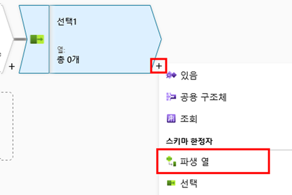

12. **파생 열 설정**에서 다음 항목을 구성합니다.

    - **출력 스트림 이름**: `ConvertColumnTypesAndValues`를 입력합니다.
    - **들어오는 스트림**: `MapCampaignAnalytics` 를 선택합니다.
    - **열**: 다음 정보를 지정합니다.

        | 열 | 식 | 설명 |
        | --- | --- | --- |
        | Revenue | `toDecimal(replace(concat(toString(RevenuePart1), toString(Revenue)), '\\', ''), 10, 2, '$###,###.##')` | `RevenuePart1` 필드와 `Revenue` 필드를 연결하고 잘못된 문자 `\`를 바꾼 후 데이터를 변환하여 서식을 10진수 형식으로 지정합니다. |
        | RevenueTarget | `toDecimal(replace(concat(toString(RevenueTargetPart1), toString(RevenueTarget)), '\\', ''), 10, 2, '$###,###.##')` | `RevenueTargetPart1` 필드와 `RevenueTarget` 필드를 연결하고 잘못된 문자 `\`를 바꾼 후 데이터를 변환하여 서식을 10진수 형식으로 지정합니다. |

    > **참고**: 두 번째 열을 삽입하려면 열 목록 위의 **+ 추가**를 선택하고 **열 추가**를 선택합니다.

    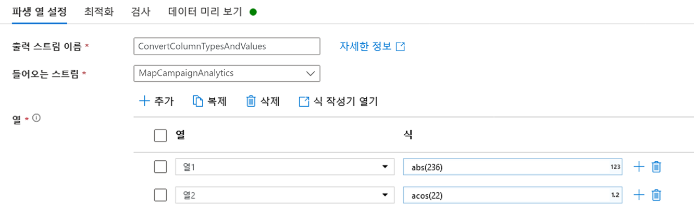

13. `ConvertColumnTypesAndValues` 단계 오른쪽의 **+** 를 선택한 다음 상황에 맞는 메뉴에서 **Select** 스키마 한정자를 선택합니다.

    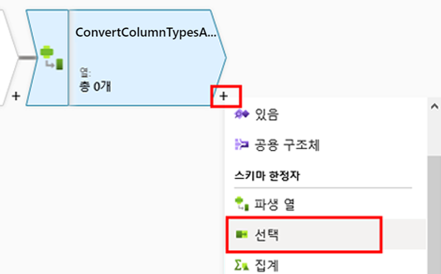

14. **Select 설정**에서 다음 항목을 구성합니다.

    - **출력 스트림 이름**: `SelectCampaignAnalyticsColumns`를 입력합니다.
    - **들어오는 스트림**: `ConvertColumnTypesAndValues`를 선택합니다.
    - **옵션**: 두 옵션을 모두 선택합니다.
    - **입력 열**: `Auto mapping` 이 선택 취소되어 있는지 확인하고 `RevenuePart1` 및 `RevenueTargetPart1`을 **삭제**합니다. 이 두 필드는 더 이상 필요하지 않습니다.

    

15. `SelectCampaignAnalyticsColumns` 단계 오른쪽의 **+** 를 선택한 다음 상황에 맞는 메뉴에서 **싱크**스키마 한정자를 선택합니다.

    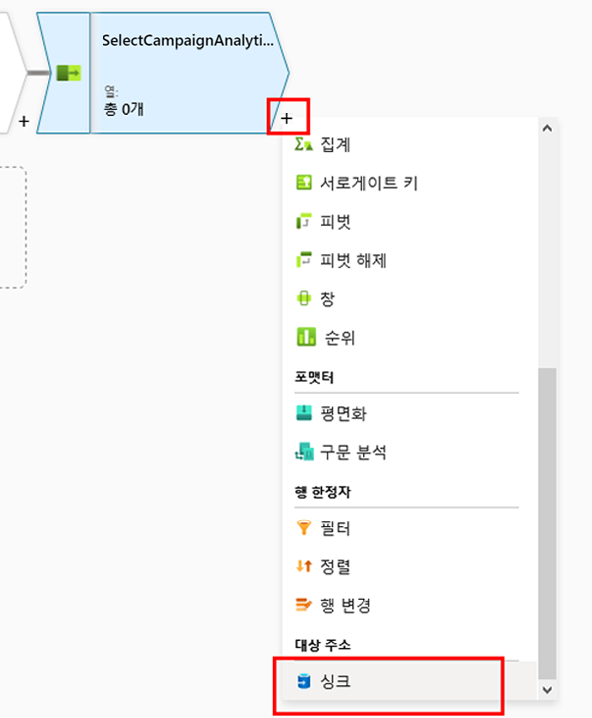

16. **싱크**에서 다음 항목을 구성합니다.

    - **출력 스트림 이름**: `CampaignAnalyticsASA`를 입력합니다.
    - **들어오는 스트림**: `SelectCampaignAnalyticsColumns`를 선택합니다.
    - **싱크 유형**: `Dataset`을 선택합니다.
    - **데이터 집합**: CampaignAnalytics SQL 테이블 `asal400_wwi_campaign_analytics_asa`를 선택합니다.
    - **옵션**: `Allow schema drift` 을 선택하고 `Validate schema` 는 선택을 취소합니다.

    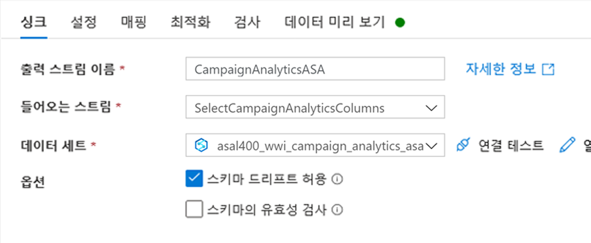

17. **설정**을 선택하고 다음 항목을 구성합니다.

    - **업데이트 방법**: `Allow insert` 을 선택하고 나머지 옵션은 선택하지 않은 상태로 유지합니다.
    - **테이블 작업**: `Truncate table` 를 선택합니다.
    - **준비 사용**: 이 옵션은 선택을 취소합니다. 샘플 CSV는 작은 파일이므로 준비 옵션은 사용할 필요가 없습니다.

    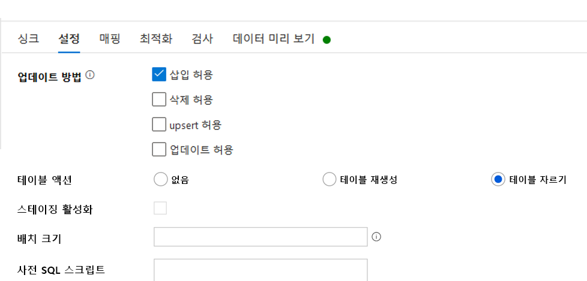

18. 완성된 데이터 흐름은 다음과 같습니다.

    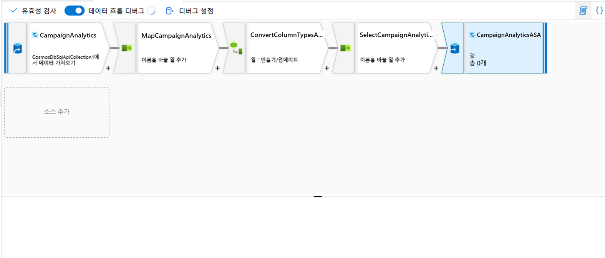

19. **모두 게시**, **게시**를 차례로 선택하여 새 데이터 흐름을 저장합니다.

    

#### 작업 2: 캠페인 분석 데이터 파이프라인 만들기

새 데이터 흐름을 실행하려면 새 파이프라인을 만들어 데이터 흐름 활동을 해당 파이프라인에 추가해야 합니다.

1. **통합** 허브로 이동합니다.

    

2. +, **파이프라인**을 차례로 선택하여 새 파이프라인을 만듭니다.

    

3. 새 파이프라인 **속성** 블레이드의 **일반**설정에서 **이름**을 `Write Campaign Analytics to ASA`로 입력합니다.

4. 활동 목록 내에서 **이동 및 변환**을 확장하고 **데이터 흐름** 활동을 파이프라인 캔버스로 끕니다.

    

5. `General` 섹션에서 **이름** 값을 `asal400_lab2_writecampaignanalyticstoasa`로 설정합니다.

    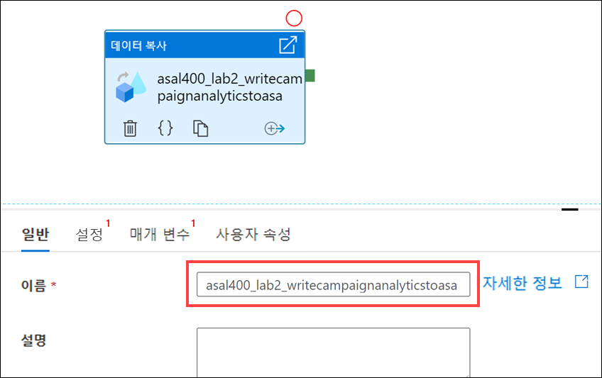

6. **설정** 탭을 선택하고 **데이터 흐름** 아래에서 `asal400_lab2_writecampaignanalyticstoasa`를 선택합니다.

    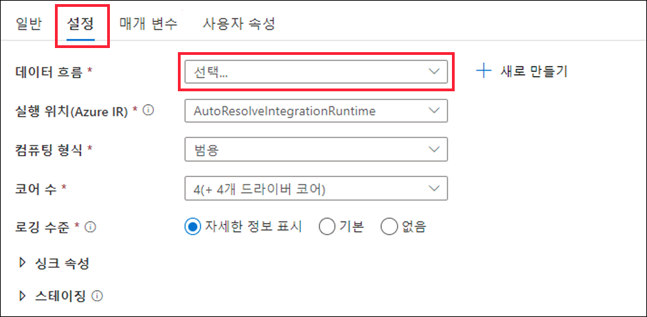

8. **모두 게시**를 선택하여 새 파이프라인을 저장합니다.

    

#### 작업 3: 캠페인 분석 데이터 파이프라인 실행

1. 파이프라인 캔버스 위쪽 도구 모음에서 **트리거 추가**, **지금 트리거**를 차례로 선택합니다.

    

2. `Pipeline run` 블레이드에서 **확인**을 선택하여 파이프라인 실행을 시작합니다.

    

3. **모니터** 허브로 이동합니다.

    

4. 파이프라인 실행이 정상적으로 완료될 때까지 기다립니다. 보기를 새로 고쳐야 할 수도 있습니다.

    > 쿼리가 실행되는 동안 나머지 랩 지침을 확인하여 해당 내용을 숙지하세요.

    

#### 작업 4: 캠페인 분석 테이블 콘텐츠 확인

파이프라인 실행이 완료되었으므로 SQL 테이블에서 데이터가 올바르게 복사되었는지를 확인해 보겠습니다.

1. **데이터** 허브로 이동합니다.

    

2. **작업 영역** 섹션 아래에서 `SqlPool01` 데이터베이스를 확장하고 `Tables` 을 확장합니다.

3. `wwi.CampaignAnalytics` 테이블을 마우스 오른쪽 단추로 클릭하고 새 SQL 스크립트 상황에 맞는 메뉴 아래에서 **상위 1000개 행 선택** 메뉴 항목을 선택합니다. 새 테이블을 확인하려면 데이터베이스를 새로 고쳐야 할 수도 있습니다.

    

4. 쿼리 결과에 적절하게 변환된 데이터가 표시됩니다.

    

5. 쿼리를 다음과 같이 업데이트하고 **실행**합니다.

    ```sql
    SELECT ProductCategory
    ,SUM(Revenue) AS TotalRevenue
    ,SUM(RevenueTarget) AS TotalRevenueTarget
    ,(SUM(RevenueTarget) - SUM(Revenue)) AS Delta
    FROM [wwi].[CampaignAnalytics]
    GROUP BY ProductCategory
    ```

6. 쿼리 결과에서 **차트** 뷰를 선택합니다. 아래에 정의된 대로 열을 구성합니다.

    - **차트 유형**: `Column` 을 선택합니다.
    - **범주 열**: `ProductCategory`를 선택합니다.
    - **범례(계열) 열**: `TotalRevenue`, `TotalRevenueTarget`, `Delta`를 선택합니다.

    

### 연습 3: 구매 수 상위 제품용 매핑 데이터 흐름 만들기

Tailwind Traders는 전자 상거래 시스템에서 JSON 파일로 가져온 구매 수 상위 제품 데이터와, Azure Cosmos DB에 JSON 문서로 저장된 프로필 데이터의 사용자 선호 제품 정보를 결합해야 합니다. 이렇게 결합한 데이터는 나중에 분석 및 보고할 수 있도록 데이터 레이크와 전용 SQL 풀에 저장하려고 합니다.

이 연습에서는 Tailwind Traders를 위해 다음 작업을 수행하는 매핑 데이터 흐름을 작성합니다.

- JSON 데이터용 ADLS Gen2 데이터 원본 2개 추가
- 두 파일 집합의 계층 구조 평면화
- 데이터 변형 및 형식 변환 수행
- 두 데이터 원본 조인
- 조건부 논리를 기준으로 조인된 데이터 집합에서 새 필드 만들기
- null 레코드에서 필수 필드 필터링
- 전용 SQL 풀에 데이터 쓰기
- 데이터 레이크에도 동시에 데이터 쓰기

#### 작업 1: 매핑 데이터 흐름 만들기

1. **개발** 허브로 이동합니다.

    

2. **+**, **데이터 흐름**을 차례로 선택하여 새 데이터 흐름을 만듭니다.

    

3. 새 데이터 흐름 **프로필** 창의 **일반** 섹션에서 **이름**을 `write_user_profile_to_asa`로 업데이트합니다.

    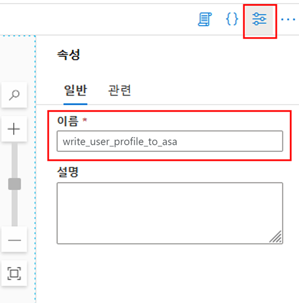

4. **속성** 단추를 선택하여 창을 숨깁니다.

    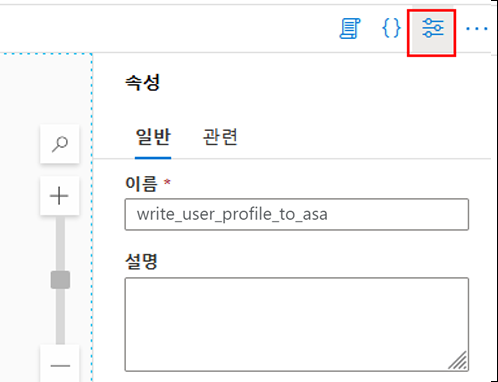

5. 데이터 흐름 캔버스에서 **원본 추가**를 선택합니다.

    

6. **원본 설정**에서 다음 항목을 구성합니다.

    - **출력 스트림 이름**: `EcommerceUserProfiles`를 입력합니다.
    - **원본 유형**: `Dataset`을 선택합니다.
    - **데이터 집합**: `asal400_ecommerce_userprofiles_source`를 선택합니다.

    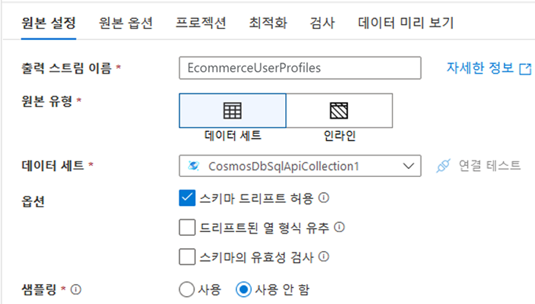

7. **원본 설정** 탭을 선택하고 다음 항목을 구성합니다.

    - **와일드카드 경로**: `online-user-profiles-02/*.json`을 입력합니다.
    - **JSON 설정**: 이 섹션을 확장한 다음 **문서 배열** 설정을 선택합니다. 이 설정을 선택하면 각 파일에 JSON 문서 배열이 포함됩니다.

    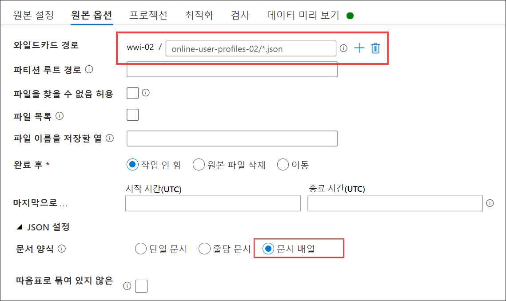

8. `EcommerceUserProfiles` 원본 오른쪽의 **+** 를 선택한 다음 상황에 맞는 메뉴에서 **파생 열**스키마 한정자를 선택합니다.

    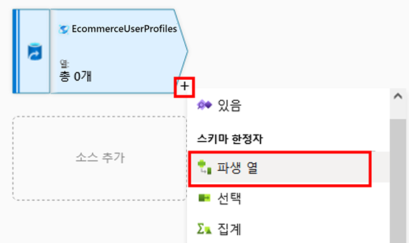

9. **파생 열 설정**에서 다음 항목을 구성합니다.

    - **출력 스트림 이름**: `userId`를 입력합니다.
    - **들어오는 스트림**: `EcommerceUserProfiles`를 선택합니다.
    - **열**: 다음 정보를 지정합니다.

        | 열 | 식 | 설명 |
        | --- | --- | --- |
        | visitorId | `toInteger(visitorId)` | `visitorId` 열을 문자열에서 정수로 변환합니다. |

    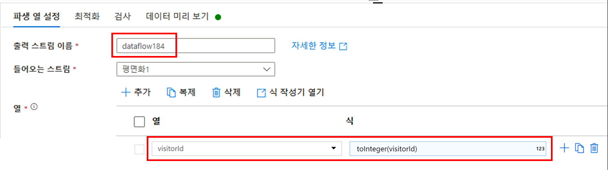

10. `userId` 단계 오른쪽의 **+** 를 선택한 다음 상황에 맞는 메뉴에서 **평면화**스키마 한정자를 선택합니다.

    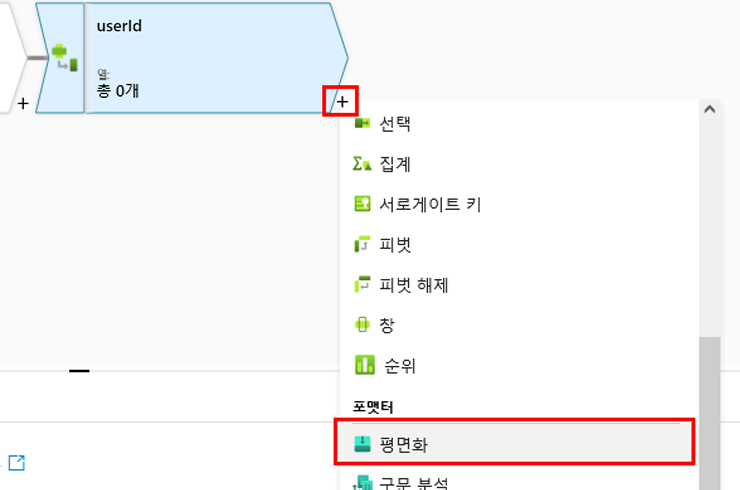

11. **평면화 설정**에서 다음 항목을 구성합니다.

    - **출력 스트림 이름**: `UserTopProducts`를 입력합니다.
    - **들어오는 스트림**: `userId`를 선택합니다.
    - **언롤 기준**: `[] topProductPurchases`를 선택합니다.
    - **입력 열**: 다음 정보를 지정합니다.

        | userId의 열 | 다른 이름 지정 |
        | --- | --- |
        | visitorId | `visitorId` |
        | topProductPurchases.productId | `productId` |
        | topProductPurchases.itemsPurchasedLast12Months | `itemsPurchasedLast12Months` |

        > **+ 매핑 추가**, **고정 매핑**을 차례로 선택하여 각 새 열 매핑을 추가합니다.

    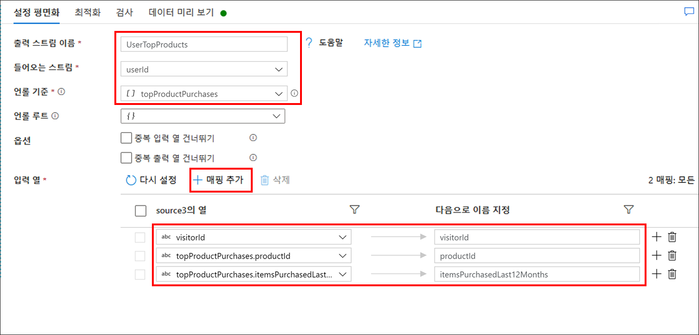

    이러한 설정을 구성하면 `visitorId`별로 행 하나 이상이 포함된 데이터 원본의 평면화된 뷰가 제공됩니다. 즉, 이전 모듈에서 Spark Notebook 내의 데이터를 살펴볼 때와 비슷한 방식으로 뷰가 표시됩니다. 데이터 미리 보기를 사용하려면 디버그 모드를 사용하도록 설정해야 하는데, 이 랩에서는 디버그 모드를 사용하도록 설정하지 않습니다. *다음 스크린샷은 설명용으로만 제공됩니다*.

    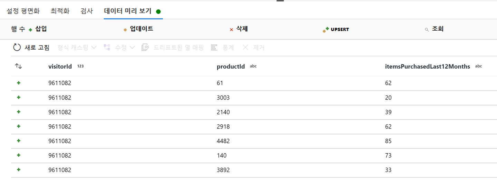

    > **중요**: 최신 릴리스에서 버그가 확인되어 사용자 인터페이스에서 userId 원본 열이 업데이트되지 않은 상태입니다. 일단은 데이터 흐름용 스크립트(도구 모음에 있음)에 액세스합니다. 스크립트에서 `userId` 활동을 찾은 다음 mapColumn 함수에서 적절한 원본 필드를 추가합니다. `productId`의 경우 원본이 **topProductPurchases.productId**인지 확인합니다. 또한 **itemsPurchasedLast12Months**의 원본은 **topProductPurchases.itemsPurchasedLast12Months**인지 확인합니다.

    

    ```javascript
    userId foldDown(unroll(topProductPurchases),
        mapColumn(
            visitorId,
            productId = topProductPurchases.productId,
            itemsPurchasedLast12Months = topProductPurchases.itemsPurchasedLast12Months
        )
    ```

    

12. `UserTopProducts` 단계 오른쪽의 **+** 를 선택한 다음 상황에 맞는 메뉴에서 **파생 열**스키마 한정자를 선택합니다.

    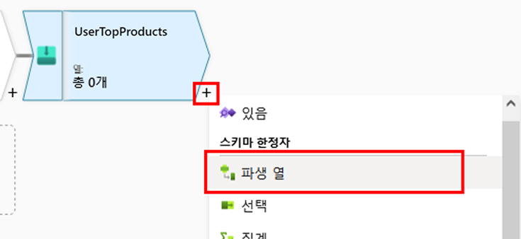

13. **파생 열 설정**에서 다음 항목을 구성합니다.

    - **출력 스트림 이름**: `DeriveProductColumns`를 입력합니다.
    - **들어오는 스트림**: `UserTopProducts`를 선택합니다.
    - **열**: 다음 정보를 지정합니다.

        | 열 | 식 | 설명 |
        | --- | --- | --- |
        | productId | `toInteger(productId)` | `productId` 열을 문자열에서 정수로 변환합니다. |
        | itemsPurchasedLast12Months | `toInteger(itemsPurchasedLast12Months)` | `itemsPurchasedLast12Months` 열을 문자열에서 정수로 변환합니다. |

    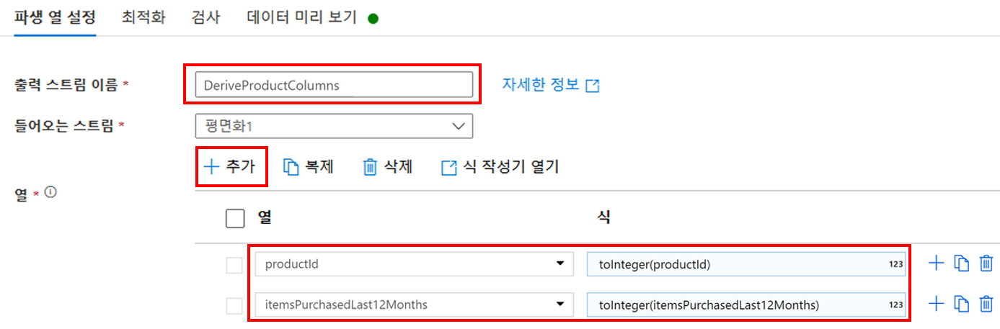

    > **참고**: 파생 열 설정에 열을 추가하려면 첫 번째 오른쪽의 **+** 를 선택하고 **열 추가**를 선택합니다.

    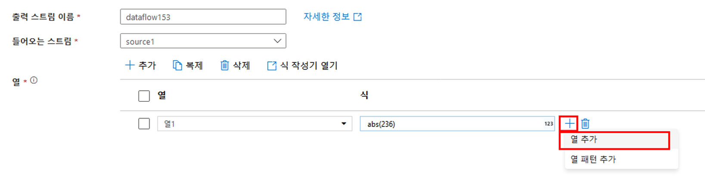

14. 데이터 흐름 캔버스에서 `EcommerceUserProfiles` 원본 아래의 **원본 추가**를 선택합니다.

    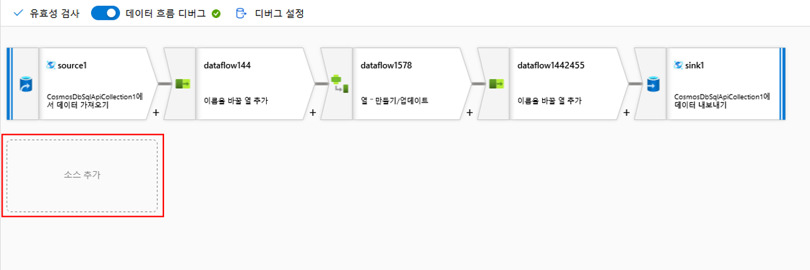

15. **원본 설정**에서 다음 항목을 구성합니다.

    - **출력 스트림 이름**: `UserProfiles`를 입력합니다.
    - **원본 유형**: `Dataset`을 선택합니다.
    - **데이터 집합**: `asal400_customerprofile_cosmosdb`를 선택합니다.

    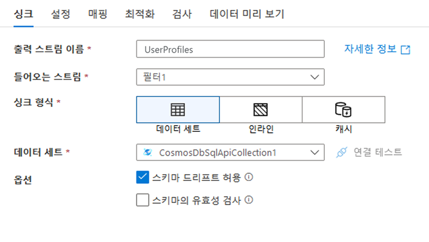

16. 여기서는 데이터 흐름 디버거를 사용하지 않으므로 원본 프로젝션을 업데이트하려면 데이터 흐름의 스크립트 뷰를 표시해야 합니다. 캔버스 위의 도구 모음에서 **스크립트**를 선택합니다.

    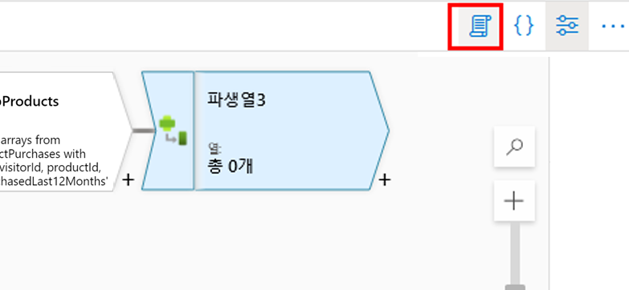

17. 스크립트에서 **UserProfiles** `source`를 찾은 후 해당 스크립트 블록을 다음 코드로 바꿉니다. 이 코드는 `preferredProducts`를 `integer[]` 배열로 설정하며, `productReviews` 배열 내의 데이터 형식이 올바르게 정의되어 있는지 확인합니다.

    ```json
    source(output(
            cartId as string,
            preferredProducts as integer[],
            productReviews as (productId as integer, reviewDate as string, reviewText as string)[],
            userId as integer
        ),
        allowSchemaDrift: true,
        validateSchema: false,
        ignoreNoFilesFound: false,
        format: 'document') ~> UserProfiles
    ```

    

18. **확인**을 선택하여 스크립트 변경 내용을 적용합니다. 이제 새 스키마가 적용되어 데이터 원본이 업데이트되었습니다. 데이터 미리 보기 옵션을 사용하여 원본 데이터를 확인할 수 있는 경우 원본 데이터가 표시되는 방식이 다음 스크린샷에 나와 있습니다. 데이터 미리 보기를 사용하려면 디버그 모드를 사용하도록 설정해야 하는데, 이 랩에서는 디버그 모드를 사용하도록 설정하지 않습니다. *다음 스크린샷은 설명용으로만 제공됩니다*.

    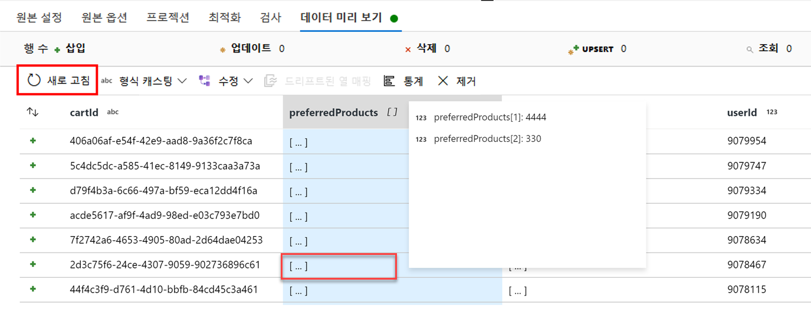

19. `UserProfiles` 원본 오른쪽의 **+** 를 선택한 다음 상황에 맞는 메뉴에서 **평면화**스키마 한정자를 선택합니다.

    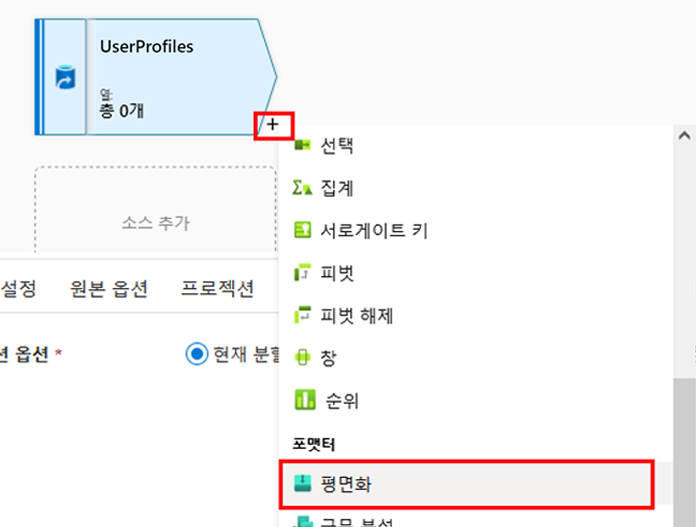

20. **평면화 설정**에서 다음 항목을 구성합니다.

    - **출력 스트림 이름**: `UserPreferredProducts`를 입력합니다.
    - **들어오는 스트림**: `UserProfiles`를 선택합니다.
    - **언롤 기준**: `[] preferredProducts`를 선택합니다.
    - **입력 열**: 다음 정보를 제공합니다. `cartId` 및 `[] productReviews`는 **삭제**해야 합니다.

        | UserProfiles의 열 | 다른 이름 지정 |
        | --- | --- |
        | [] preferredProducts | `preferredProductId` |
        | userId | `userId` |

        > **+ 매핑 추가**, **고정 매핑**을 차례로 선택하여 각 새 열 매핑을 추가합니다.

    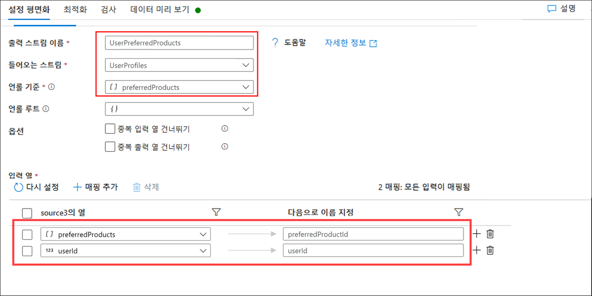

    이러한 설정을 구성하면 `userId`별로 행 하나 이상이 포함된 데이터 원본의 평면화된 뷰가 제공됩니다. 데이터 미리 보기를 사용하려면 디버그 모드를 사용하도록 설정해야 하는데, 이 랩에서는 디버그 모드를 사용하도록 설정하지 않습니다. *다음 스크린샷은 설명용으로만 제공됩니다*.

    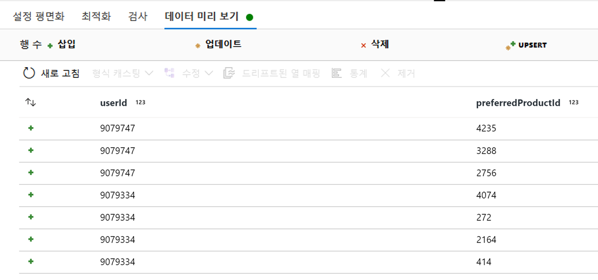

21. 이제 두 데이터 원본을 조인합니다. `DeriveProductColumns` 단계 오른쪽의 **+** 를 선택한 다음 상황에 맞는 메뉴에서 **조인**옵션을 선택합니다.

    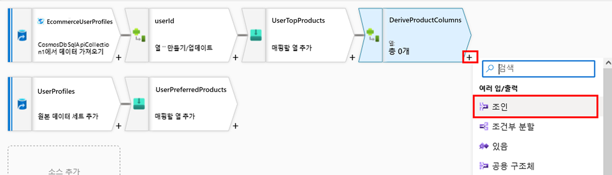

22. **조인 설정**에서 다음 항목을 구성합니다.

    - **출력 스트림 이름**: `JoinTopProductsWithPreferredProducts`를 입력합니다.
    - **왼쪽 스트림**: `DeriveProductColumns`를 선택합니다.
    - **오른쪽 스트림**: `UserPreferredProducts`를 선택합니다.
    - **조인 유형**: `Full outer`를 선택합니다.
    - **조인 조건**: 다음 정보를 지정합니다.

        | 왼쪽: DeriveProductColumns의 열 | 오른쪽: UserPreferredProducts의 열 |
        | --- | --- |
        | `visitorId` | `userId` |

    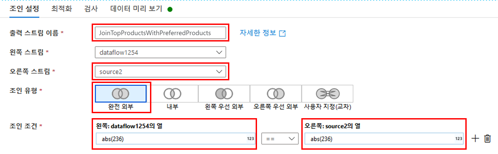

23. **최적화**를 선택하고 다음 항목을 구성합니다.

    - **브로드캐스트**: `Fixed`을 선택합니다.
    - **브로드캐스트 옵션**: `Left: 'DeriveProductColumns'` 를 선택합니다.
    - **파티션 옵션**: `Set partitioning` 을 선택합니다.
    - **파티션 유형**: `Hash` 를 선택합니다.
    - **파티션 수**: `30`을 입력합니다.
    - **열**: `productId` 를 선택합니다.

    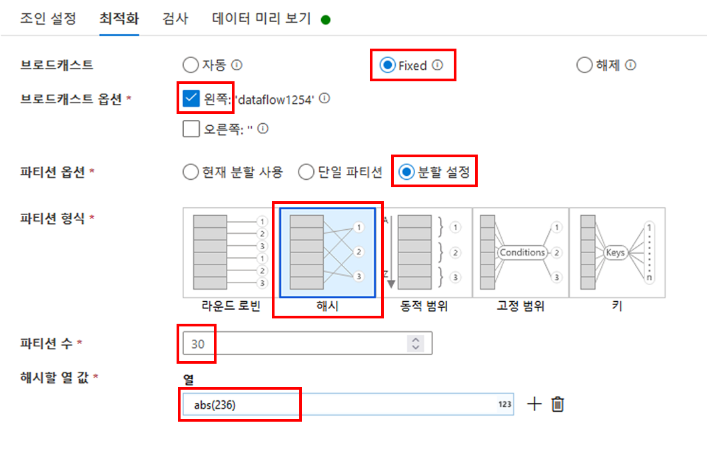

    <!-- **TODO**: 최적화 설명을 추가합니다. -->

24. **검사** 탭을 선택하여 조인 매핑을 확인합니다. 열 피드 원본, 그리고 조인에서 열이 사용되는지 여부도 함께 확인해야 합니다.

    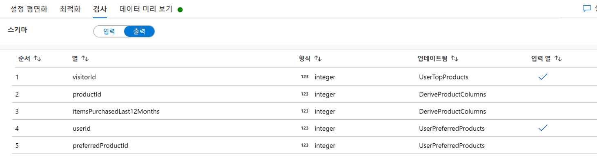

    **데이터 미리 보기 설명 전용:** 이 랩에서는 데이터 흐름 디버깅을 활성화하지 않으므로 이 단계를 수행하지 마세요. 이 샘플에는 데이터의 양이 적으므로 `userId` 및 `preferredProductId` 열에 null 값만 표시될 가능성이 높습니다. 이러한 필드에 값이 포함되어 있는 레코드 수를 파악하려면 `preferredProductId` 등의 열을 선택하고 위쪽 도구 모음에서 **통계**를 선택합니다. 그러면 값 비율이 나와 있는 열 차트가 표시됩니다.

    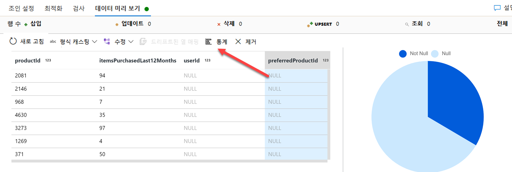

25. `JoinTopProductsWithPreferredProducts` 단계 오른쪽의 **+** 를 선택한 다음 상황에 맞는 메뉴에서 **파생 열**스키마 한정자를 선택합니다.

    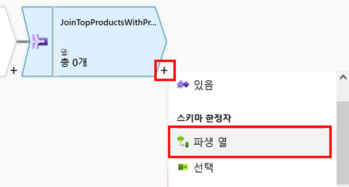

26. **파생 열 설정**에서 다음 항목을 구성합니다.

    - **출력 스트림 이름**: `DerivedColumnsForMerge`를 입력합니다.
    - **들어오는 스트림**: `JoinTopProductsWithPreferredProducts`를 선택합니다.
    - **열**: 다음 정보를 입력합니다(**_처음 2개_ 열 이름 _입력_**):

        | 열 | 식 | 설명 |
        | --- | --- | --- |
        | isTopProduct | `toBoolean(iif(isNull(productId), 'false', 'true'))` | `productId`가 null이 아니면 `true`를 반환합니다. 앞에서 설명한 것처럼, `productId`는 전자 상거래 사용자들이 많이 구매한 제품의 데이터 계보에서 제공됩니다. |
        | isPreferredProduct | `toBoolean(iif(isNull(preferredProductId), 'false', 'true'))` | `preferredProductId`가 null이 아니면 `true`를 반환합니다. 앞에서 설명한 것처럼, `preferredProductId`는 Azure Cosmos DB 사용자 프로필 데이터 계보에서 제공됩니다. |
        | productId | `iif(isNull(productId), preferredProductId, productId)` | `productId`가 null인지 여부에 따라 `productId` 출력을 `preferredProductId` 또는 `productId` 값으로 설정합니다.
        | userId | `iif(isNull(userId), visitorId, userId)` | `userId`가 null인지 여부에 따라 `userId` 출력을 `visitorId` 또는 `userId` 값으로 설정합니다.

    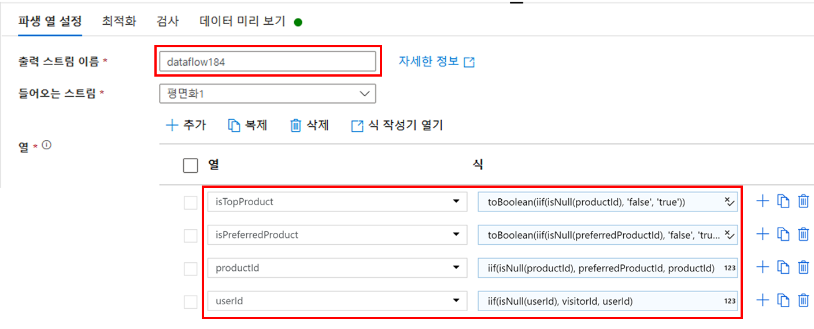

    > **참고**: 파생 열 오른쪽의 **+**, **열 추가**를 차례로 선택하여 아래쪽에 새 열을 추가해야 합니다.

    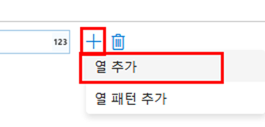

    파생 열 설정을 구성하면 다음 결과가 제공됩니다.

    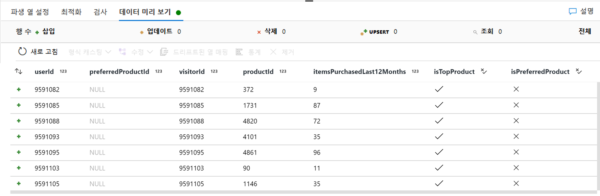

27. `DerivedColumnsForMerge` 단계 오른쪽의 **+** 를 선택한 다음 상황에 맞는 메뉴에서 **필터**스키마 한정자를 선택합니다.

    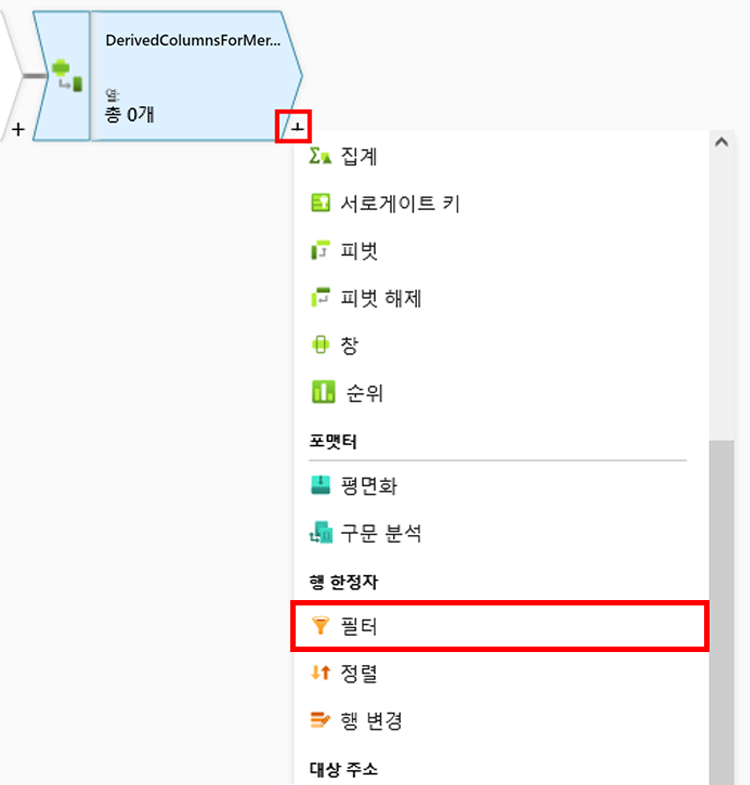

    여기서는 `ProductId`가 null인 모든 레코드를 제거하기 위해 필터 단계를 추가합니다. 이 데이터 집합에서는 잘못된 레코드 비율이 낮으므로 `UserTopProductPurchases` 전용 SQL 풀 테이블에 null `ProductId` 값을 로드하면 오류가 발생합니다.

28. **필터 기준** 식을 **`!isNull(productId)`** 로 설정합니다.

    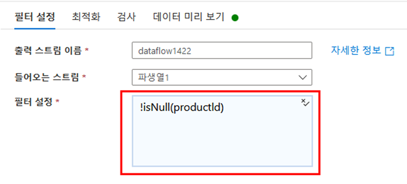

29. `Filter1` 단계 오른쪽의 **+** 를 선택한 다음 상황에 맞는 메뉴에서 **싱크**스키마 한정자를 선택합니다.

    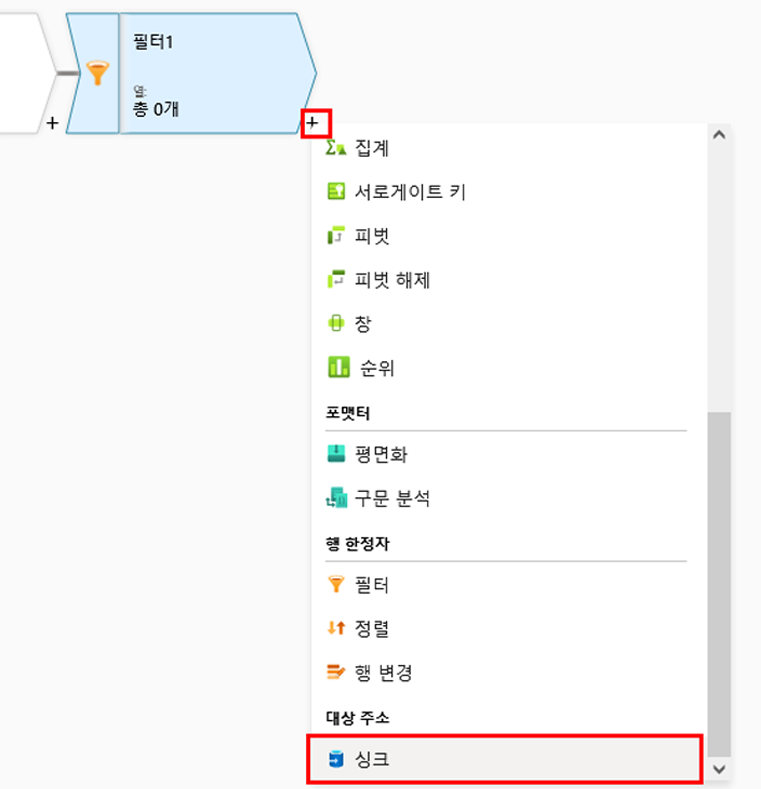

30. **싱크**에서 다음 항목을 구성합니다.

    - **출력 스트림 이름**: `UserTopProductPurchasesASA`를 입력합니다.
    - **들어오는 스트림**: `Filter1`을 선택합니다.
    - **싱크 유형**: `Dataset` 을 선택합니다.
    - **데이터 집합**: UserTopProductPurchases SQL 테이블 `asal400_wwi_usertopproductpurchases_asa`를 선택합니다.
    - **옵션**: `Allow schema drift`을 선택하고 `Validate schema` 는 선택을 취소합니다.

    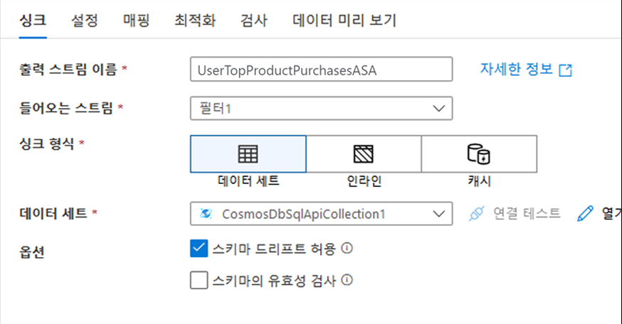

31. **설정**을 선택하고 다음 항목을 구성합니다.

    - **업데이트 방법**: `Allow insert`을 선택하고 나머지 옵션은 선택하지 않은 상태로 유지합니다.
    - **테이블 작업**: `Truncate table`를 선택합니다.
    - **준비 사용**: 이 옵션은 `Check`합니다. 여기서는 많은 데이터를 가져올 것이므로 성능 개선을 위해 준비를 사용하도록 설정합니다.

    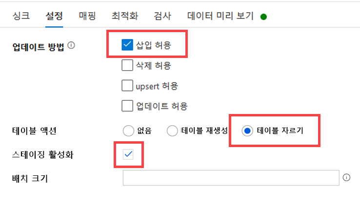

32. **매핑**을 선택하고 다음 항목을 구성합니다.

    - **자동 매핑**: 이 옵션은 `Uncheck` 합니다.
    - **열**: 다음 정보를 지정합니다.

        | 입력 열 | 출력 열 |
        | --- | --- |
        | userId | UserId |
        | productId | ProductId |
        | itemsPurchasedLast12Months | ItemsPurchasedLast12Months |
        | isTopProduct | IsTopProduct |
        | isPreferredProduct | IsPreferredProduct |

    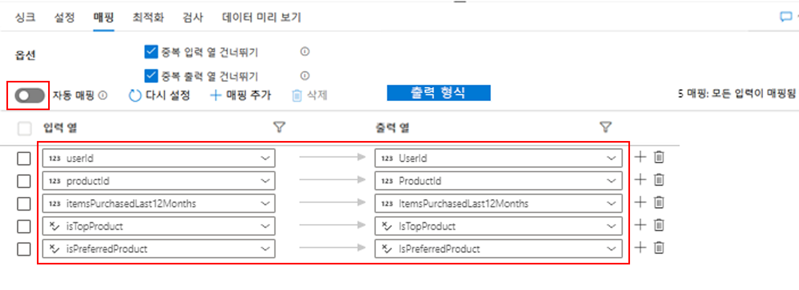

33. `Filter1` 단계 오른쪽의 **+** 를 선택한 다음 상황에 맞는 메뉴에서 **싱크**스키마 한정자를 선택하여 두 번째 싱크를 추가합니다.

    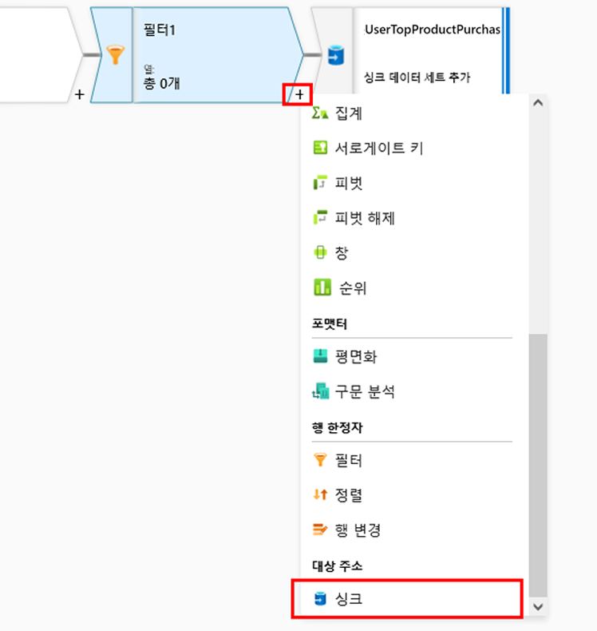

34. **싱크**에서 다음 항목을 구성합니다.

    - **출력 스트림 이름**: `DataLake`를 입력합니다.
    - **들어오는 스트림**: `Filter1`을 선택합니다.
    - **싱크 유형**: `Inline` 을 선택합니다.
    - **인라인 데이터 집합 형식**: `Delta`를 선택합니다.
    - **연결된 서비스**: 기본 작업 영역 데이터 레이크 스토리지 계정(예: `asaworkspaceinaday84-WorspaceDefaultStorage`)을 선택합니다.
    - **옵션**: `Allow schema drift`을 선택하고 `Validate schema`는 선택을 취소합니다.

    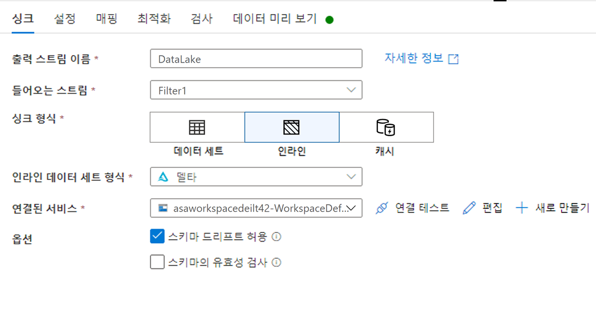

35. **설정**을 선택하고 다음 항목을 구성합니다.

    - **폴더 경로**: `wwi-02/top-products`를 입력합니다(`top-products` 폴더가 아직 없으므로 이 두 값을 **복사하여 필드에 붙여넣어야 함**).
    - **압축 형식**: `snappy`를 선택합니다.
    - **압축 수준**: `Fastest`을 선택합니다.
    - **Vacuum**: 0을 입력합니다.
    - **테이블 자르기**: 선택합니다.
    - **업데이트 방법**: `Allow insert`을 선택하고 나머지 옵션은 선택하지 않은 상태로 유지합니다.
    - **스키마 병합(델타 옵션 아래에 있음)**: 선택을 취소합니다.

    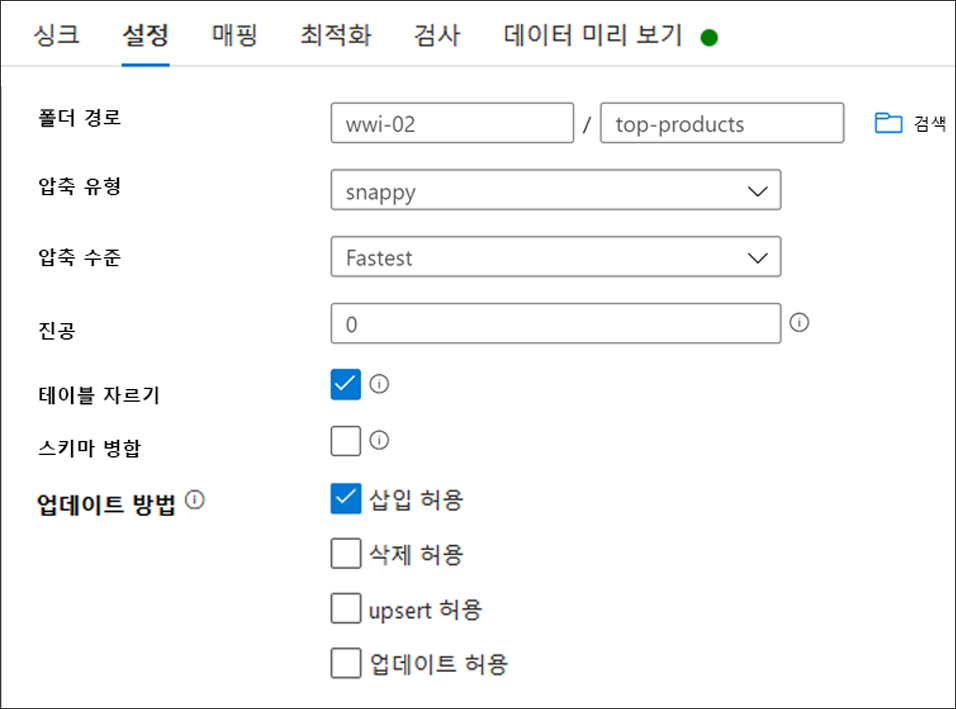

36. **매핑**을 선택하고 다음 항목을 구성합니다.

    - **자동 매핑**: 이 옵션은 `Uncheck`합니다.
    - **열**: 다음 정보를 지정합니다.

        | 입력 열 | 출력 열 |
        | --- | --- |
        | visitorId | visitorId |
        | productId | productId |
        | itemsPurchasedLast12Months | itemsPurchasedLast12Months |
        | preferredProductId | preferredProductId |
        | userId | userId |
        | isTopProduct | isTopProduct |
        | isPreferredProduct | isPreferredProduct |

    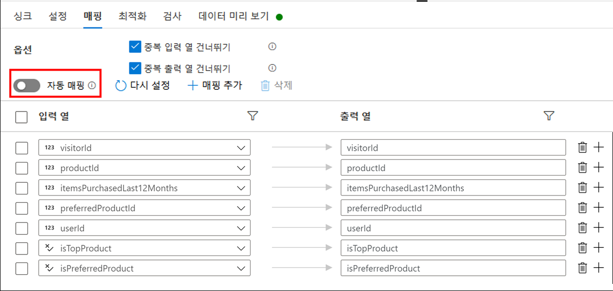

    > 위의 옵션에서는 SQL 풀 싱크에 비해 데이터 레이크 싱크(`visitorId` 및 `preferredProductId`)에서 더 많은 필드를 유지하도록 선택했습니다. 여기서는 고정 대상 스키마(예: SQL 테이블)를 적용하지 않으며, 데이터 레이크에 원래 데이터를 최대한 많이 보존해야 하기 때문입니다.

37. 완성된 데이터 흐름은 다음과 같습니다.

    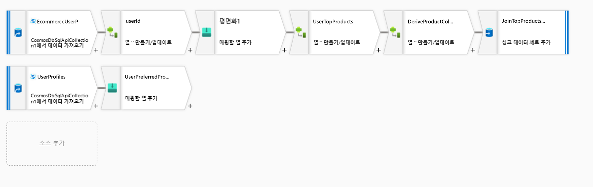

38. **모두 게시**, **게시**를 차례로 선택하여 새 데이터 흐름을 저장합니다.

    

## 랩 2: Azure Synapse 파이프라인에서 데이터 이동 및 변환 오케스트레이션

ADF(Azure Data Factory) 사용법을 잘 알고 있는 Tailwind Traders는 Azure Synapse Analytics를 ADF와 통합할 수 있거나 ADF와 비슷한 기능을 사용할 수 있는지를 파악하고자 합니다. 데이터 웨어하우스 내부와 외부에서 모두 전체 데이터 카탈로그에 대해 수행하는 데이터 수집, 변환, 로드 작업을 오케스트레이션하기 위해서입니다.

여러분은 이러한 용도로 Synapse 파이프라인 사용을 추천했습니다. 90개가 넘는 기본 제공 커넥터가 포함되어 있는 Synapse 파이프라인을 사용하는 경우 파이프라인을 수동으로 실행하거나 오케스트레이션을 수행하여 데이터를 로드할 수 있습니다. 또한 공통 로드 패턴이 지원되며, 데이터 레이크나 SQL 테이블에 데이터를 완전 병렬식으로 로드할 수 있습니다. 그리고 Synapse 파이프라인은 ADF와 코드베이스를 공유합니다.

Tailwind Traders는 Synapse 파이프라인에서도 기존에 사용해 왔던 ADF와 동일한 인터페이스를 사용할 수 있으므로 Azure Synapse Analytics 외부의 오케스트레이션 서비스를 사용할 필요가 없습니다.

### 연습 1: 파이프라인 만들기, 트리거 및 모니터링

#### 작업 1: 파이프라인 만들기

먼저 새 매핑 데이터 흐름을 실행하겠습니다. 새 데이터 흐름을 실행하려면 새 파이프라인을 만들어 데이터 흐름 활동을 해당 파이프라인에 추가해야 합니다.

1. **통합** 허브로 이동합니다.

    

2. **+(1)**, **파이프라인(2)** 을 차례로 선택합니다.

    

3. 새 데이터 흐름 **프로필** 창의 **일반** 섹션에서 **이름**을 `Write User Profile Data to ASA`로 업데이트합니다.

    

4. **속성** 단추를 선택하여 창을 숨깁니다.

    

5. 활동 목록 내에서 **이동 및 변환**을 확장하고 **데이터 흐름** 활동을 파이프라인 캔버스로 끕니다.

    

6. **일반** 탭에서 이름을 `write_user_profile_to_asa`로 설정합니다.

    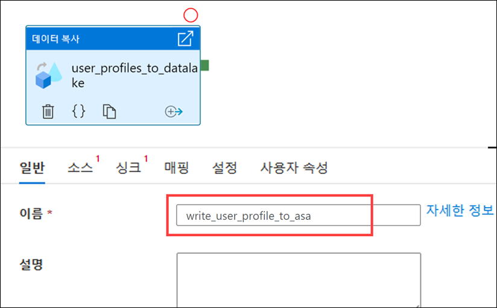

7. **설정** 탭 **(1)** 을 선택합니다. **데이터 흐름(2)** 으로 `write_user_profile_to_asa`를 선택하고 **실행 대상(Azure IR)(3)** 에서 `AutoResolveIntegrationRuntime`이 선택되어 있는지 확인합니다. `General purpose` **컴퓨팅 형식(4)** 을 선택하고 **코어 수(5)** 로는 `8 (+ 8 cores)`을 선택합니다.

    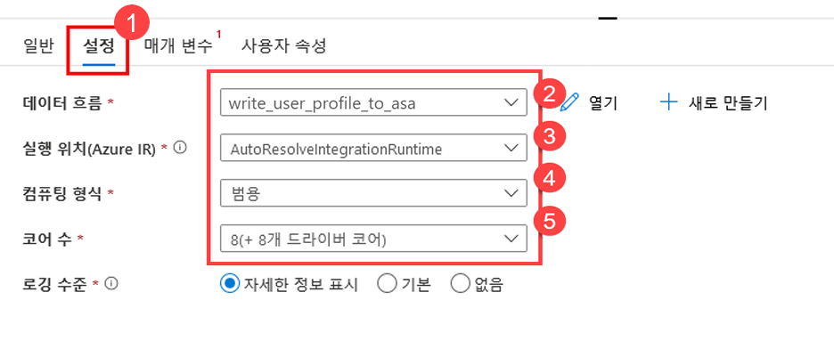

8. **준비**를 확장하고 다음 항목을 구성합니다.

    - **준비 연결된 서비스**: `asadatalakeSUFFIX` 연결된 서비스를 선택합니다.
    - **준비 스토리지 폴더**: `staging/userprofiles`를 입력합니다. `userprofiles` 폴더는 파이프라인을 처음 실행할 때 자동 작성됩니다.

    > `staging` 및 `userprofiles` 폴더 이름을 **복사하여 두 필드에 붙여넣습니다**.

    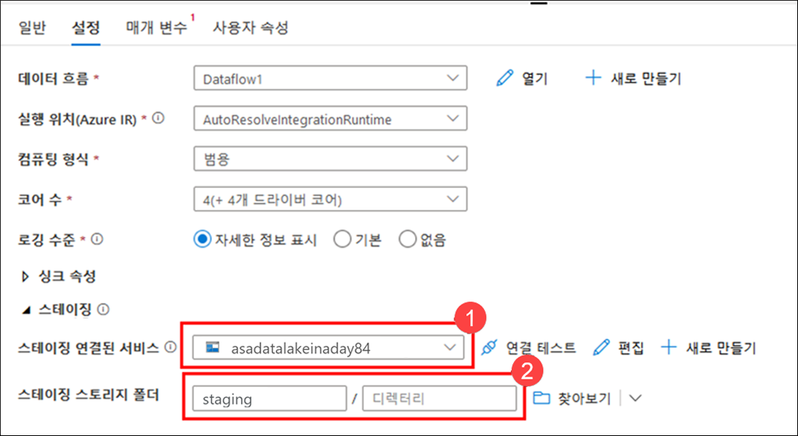

    Azure Synapse Analytics에서 가져오거나 내보내려는 데이터가 많을 때는 PolyBase 아래의 준비 옵션을 사용하는 것이 좋습니다. 프로덕션 환경에서는 데이터 흐름에서 준비를 사용하거나 사용하지 않도록 설정하여 성능 차이를 평가해 볼 수 있습니다.

9. **모두 게시**, **게시**를 차례로 선택하여 파이프라인을 저장합니다.

    

#### 작업 2: 사용자 프로필 데이터 파이프라인 트리거, 모니터링 및 분석

Tailwind Traders에서는 성능 튜닝 및 문제 해결을 위해 모든 파이프라인 실행을 모니터링하고 통계를 확인하고자 합니다.

그래서 Tailwind Traders를 대상으로 파이프라인 실행 수동 트리거, 모니터링 및 분석 방법을 시연하기로 했습니다.

1. 파이프라인 위쪽에서 **트리거 추가(1)** 와 **지금 트리거(2)** 를 차례로 선택합니다.

    

2. 이 파이프라인에는 매개 변수가 없으므로 **확인**을 선택하여 트리거를 실행합니다.

    

3. **모니터** 허브로 이동합니다.

    

4. **파이프라인 실행(1)** 을 선택하고 파이프라인 실행이 정상적으로 완료될 때까지 기다립니다 **(2)**. 보기를 새로 고쳐야 할 수도 있습니다 **(3)**.

    > 쿼리가 실행되는 동안 나머지 랩 지침을 확인하여 해당 내용을 숙지하세요.

    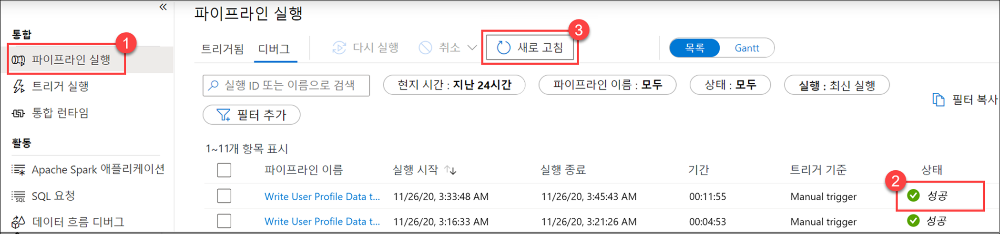

5. 파이프라인 이름을 선택하여 파이프라인 활동 실행을 확인합니다.

    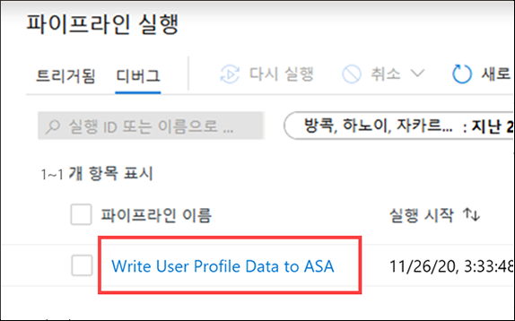

6. `Activity runs` 목록에서 데이터 흐름 활동 이름을 커서로 가리키고 **데이터 흐름 세부 정보** 아이콘을 선택합니다.

    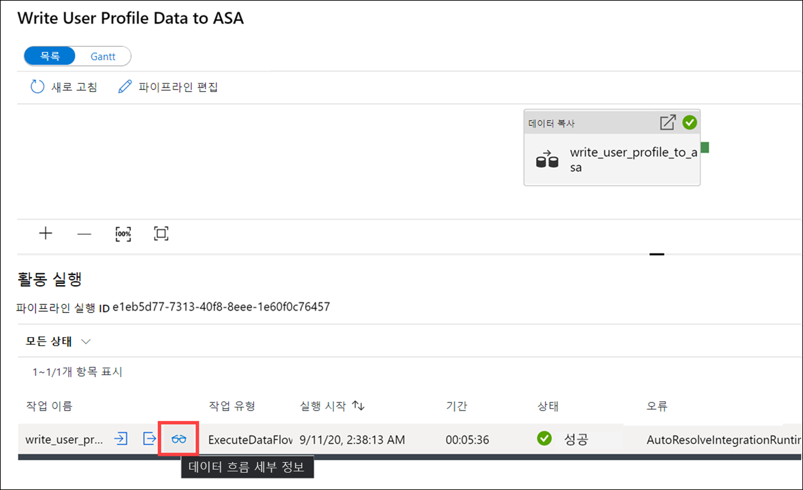

7. 데이터 흐름 세부 정보에는 데이터 흐름 단계 및 처리 세부 정보가 표시됩니다. 이 예제에서 SQL 풀 싱크 **(1)** 처리 시간은 약 **44초**, 데이터 레이크 싱크 **(2)** **처리 시간은 약 12초**였습니다. 두 싱크의 Filter1 출력에서는 약 **1백만 개의 행(3)** 이 반환되었습니다. 완료하는 데 시간이 가장 오래 걸린 활동을 확인할 수 있습니다. 전체 파이프라인 실행 시간 중 클러스터 시작 시간이 **2분 30초(4)** 이상이었습니다.

    

8. `UserTopProductPurchasesASA` 싱크 **(1)** 를 선택하여 세부 정보를 확인합니다. 계산된 행 수는 **1,622,203개**였으며 **(2)** 총 파티션 수는 30개입니다. SQL 테이블에 데이터를 쓰기 전에 ADLS Gen2에서 데이터를 준비 **(3)** 하는 데 걸린 시간은 약 **8초**였습니다. 총 싱크 처리 시간은 약 **44초(4)** 였습니다. 그리고 다른 파티션보다 훨씬 큰 **핫 파티션(5)** 도 확인되었습니다. 이 파이프라인의 성능을 높여야 하는 경우 데이터 분할을 다시 평가해 병렬 데이터 로드와 필터링을 더욱 원활하게 진행할 수 있도록 파티션을 더 균일하게 분산할 수 있습니다. 준비를 사용하지 않도록 설정하여 처리 시간이 달라지는지를 확인할 수도 있습니다. 마지막으로, 전용 SQL 풀 크기도 싱크로 데이터를 수집하는 데 걸리는 시간에 영향을 줍니다.

    

### 연습 2: 정리

다음 단계를 완료하여 더 이상 필요없는 리소스를 정리할 수 있습니다.

#### 작업 1: 전용 SQL 풀 일시 중지

1. Synapse Studio(<https://web.azuresynapse.net/>)를 엽니다.

2. **관리** 허브를 선택합니다.

    

3. 왼쪽 메뉴에서 **SQL 풀**을 선택합니다 **(1)**. 전용 SQL 풀의 이름을 마우스 커서로 가리키고 **일시 중지(2)** 를 선택합니다.

    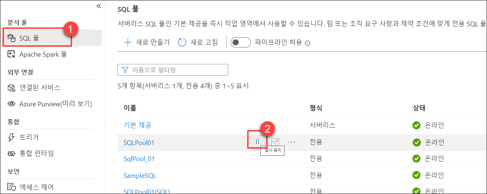

4. 메시지가 표시되면 **일시 중지**를 선택합니다.

    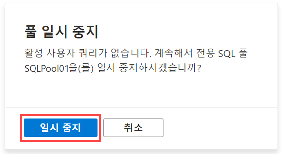
