# 모듈 9 - Azure Data Factory 또는 Azure Synapse 파이프라인을 사용하여 Notebooks의 데이터 통합

이 모듈에서는 Azure Synapse 파이프라인에서 연결된 서비스를 만들고 데이터 이동 및 변환을 오케스트레이션하는 방법을 알아봅니다.

이 모듈을 완료하면 다음 작업을 수행할 수 있습니다.

- Azure Synapse 파이프라인에서 데이터 이동 및 변환 오케스트레이션

## 랩 세부 정보

- [모듈 9 - Azure Data Factory 또는 Azure Synapse 파이프라인을 사용하여 Notebooks의 데이터 통합](#module-9---integrate-data-from-notebooks-with-azure-data-factory-or-azure-synapse-pipelines)
  - [랩 세부 정보](#lab-details)
  - [랩 설정 및 필수 구성 요소](#lab-setup-and-pre-requisites)
  - [연습 1: 연결된 서비스 및 데이터 집합](#exercise-1-linked-service-and-datasets)
    - [작업 1: 연결된 서비스 만들기](#task-1-create-linked-service)
    - [작업 2: 데이터 집합 만들기](#task-2-create-datasets)
  - [연습 2: 매핑 데이터 흐름 및 파이프라인 만들기](#exercise-2-create-mapping-data-flow-and-pipeline)
    - [작업 1: ADLS Gen2 연결된 서비스 이름 검색](#task-1-retrieve-the-adls-gen2-linked-service-name)
    - [작업 2: 매핑 데이터 흐름 만들기](#task-2-create-mapping-data-flow)
    - [작업 3: 파이프라인 만들기](#task-3-create-pipeline)
    - [작업 4: 파이프라인 트리거](#task-4-trigger-the-pipeline)
  - [연습 3: Synapse Spark Notebook을 만들어 상위 제품 찾기](#exercise-3-create-synapse-spark-notebook-to-find-top-products)
    - [작업 1: Notebook 만들기](#task-1-create-notebook)
    - [작업 2: 파이프라인에 Notebook 추가](#task-2-add-the-notebook-to-the-pipeline)

> **작업:** 모듈 9의 데이터 원본, 매핑 데이터 흐름 및 파이프라인을 모듈 10용 설정에 포함합니다.

## 랩 설정 및 필수 구성 요소

> **참고:** `Lab setup and pre-requisites` 단계는 호스트된 랩 환경이 **아닌**자체 Azure 구독을 사용하는 경우에만 완료하세요. 호스트형 랩 환경을 사용하는 경우에는 연습 1부터 바로 진행하면 됩니다.

이 모듈의 **[랩 설정 지침](https://github.com/solliancenet/microsoft-data-engineering-ilt-deploy/blob/main/setup/04/README.md)** 에 나와 있는 작업을 완료하세요.

다음 모듈에서도 이 모듈과 같은 환경을 사용합니다.

- [모듈 4](labs/04/README.md)
- [모듈 5](labs/05/README.md)
- [모듈 7](labs/07/README.md)
- [모듈 8](labs/08/README.md)
- [모듈 9](labs/09/README.md)
- [모듈 10](labs/10/README.md)
- [모듈 11](labs/11/README.md)
- [모듈 12](labs/12/README.md)
- [모듈 13](labs/13/README.md)
- [모듈 16](labs/16/README.md)

## 연습 1: 연결된 서비스 및 데이터 집합

**참고**: 모듈 8을 완료하지 **않았거나** 다음 Synapse 아티팩트가 없으면 이 연습을 완료하세요.

- 연결된 서비스:
  - `asacosmosdb01`
- 데이터 집합:
  - `asal400_ecommerce_userprofiles_source`
  - `asal400_customerprofile_cosmosdb`

모듈 8을 완료했거나 이러한 아티팩트가 이미 있으면 연습 2부터 진행하면 됩니다.

### 작업 1: 연결된 서비스 만들기

아래 단계를 완료하여 Azure Cosmos DB 연결된 서비스를 만듭니다.

> **참고**: Cosmos DB 연결된 서비스를 이미 만든 경우에는 이 섹션을 건너뛰면 됩니다.

1. Synapse Studio(<https://web.azuresynapse.net/>)를 열고 **관리** 허브로 이동합니다.

    

2. **연결된 서비스**를 열고 **+새로 만들기**를 선택하여 새 연결된 서비스를 만듭니다. 옵션 목록에서 **Azure Cosmos DB(SQL API)** 를 선택하고 **계속**을 선택합니다.

    

3. 연결된 서비스의 이름을 `asacosmosdb01`**(1)** 로 지정하고 **Cosmos DB 계정 이름** (`asacosmosdbSUFFIX`)를 선택한 후에 **데이터베이스 이름** 값을 `CustomerProfile`**(2)** 로 설정합니다. **연결 테스트**를 선택하여 서비스에 정상적으로 연결되는지 확인 **(3)** 한 다음 **만들기(4)** 를 선택합니다.

    

### 작업 2: 데이터 집합 만들기

아래 단계를 완료하여 `asal400_customerprofile_cosmosdb` 데이터 집합을 만듭니다.

> **발표자 참고 사항**: 모듈 4를 이미 완료했으면 이 섹션을 건너뛰세요.

1. **데이터** 허브로 이동합니다.

    

2. 도구 모음에서 **+** **(1)** 를 선택하고 **통합 데이터 집합(2)** 을 선택하여 새 데이터 집합을 만듭니다.

    

3. 목록에서 **Azure Cosmos DB(SQL API)** **(1)** 를 선택하고 **계속(2)** 을 선택합니다.

    

4. 다음 특성으로 데이터 집합을 구성하고 **확인(4)** 을 선택합니다.

    - **이름**: `asal400_customerprofile_cosmosdb` **(1)** 를 입력합니다.
    - **연결된 서비스**: Azure Cosmos DB 연결된 서비스 **(2)** 를 선택합니다.
    - **컬렉션**: `OnlineUserProfile01`**(3)** 을 선택합니다.

    

5. 도구 모음에서 **+** **(1)** 를 선택하고 **통합 데이터 집합(2)** 을 선택하여 새 데이터 집합을 만듭니다.

    

6. 목록에서 **Azure Data Lake Storage Gen2** **(1)** 를 선택하고 **계속(2)** 을 선택합니다.

    

7. **JSON** 형식 **(1)** 을 선택하고 **계속(2)** 을 선택합니다.

    

8. 다음 특성으로 데이터 집합을 구성하고 **확인(5)** 을 선택합니다.

    - **이름**: `asal400_ecommerce_userprofiles_source` **(1)** 를 입력합니다.
    - **연결된 서비스**: 이미 있는 `asadatalakeXX` 연결된 서비스 **(2)** 를 선택합니다.
    - **파일 경로**: `wwi-02/online-user-profiles-02` 경로 **(3)** 로 이동합니다.
    - **스키마 가져오기**: `From connection/store` **(4)** 를 선택합니다.

    

9. **모두 게시**, **게시**를 차례로 선택하여 새 리소스를 저장합니다.

    

## 연습 2: 매핑 데이터 흐름 및 파이프라인 만들기

이 연습에서는 사용자 프로필 데이터를 데이터 레이크에 복사하는 매핑 데이터 흐름을 만든 후에 파이프라인을 만듭니다. 이 파이프라인은 데이터 흐름, 그리고 이 랩 뒷부분에서 만들 Spark Notebook 실행 과정을 오케스트레이션합니다.

### 작업 1: ADLS Gen2 연결된 서비스 이름 검색

1. **관리** 허브로 이동합니다.

    

2. 왼쪽 메뉴에서 **연결된 서비스**를 선택합니다. 목록에서 **Azure Data Lake Storage Gen2** 연결된 서비스를 찾아서 가리킨 후 **{} 코드**를 선택합니다.

    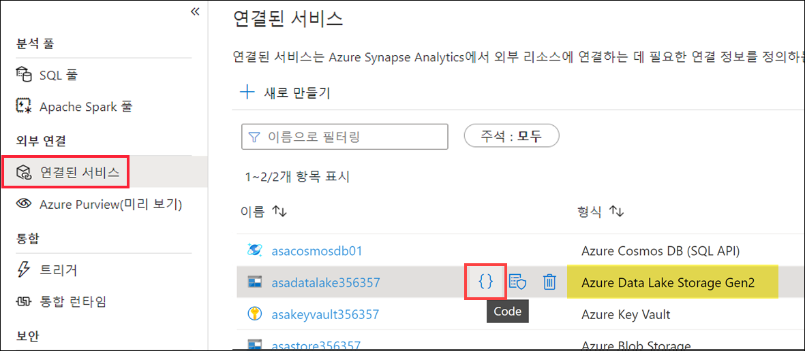

3. 연결된 서비스 **이름**을 복사한 후 **취소**를 선택하여 대화 상자를 닫습니다. 나중에 사용할 수 있도록 메모장 또는 유사한 텍스트 편집기에 이 값을 저장합니다.

    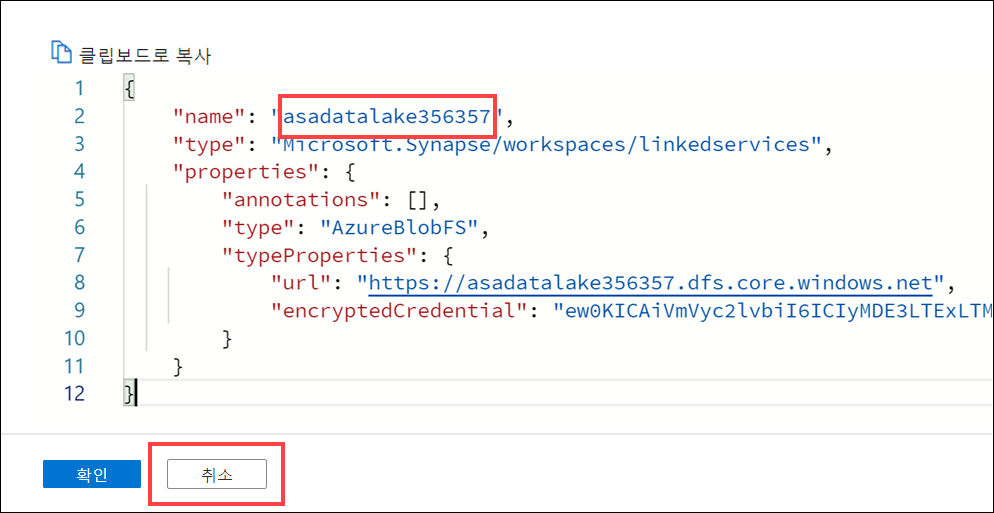

### 작업 2: 매핑 데이터 흐름 만들기

1. **개발** 허브로 이동합니다.

    

2. +, **데이터 흐름**을 차례로 선택하여 새 데이터 흐름을 만듭니다.

    

3. 새 데이터 흐름 **속성** 블레이드의 **일반**설정에서 **이름**을 `user_profiles_to_datalake`로 업데이트합니다. 이름이 정확하게 일치해야 합니다. 그렇지 않으면 몇 단계 후 코드 보기를 닫을 때 오류가 발생합니다.

    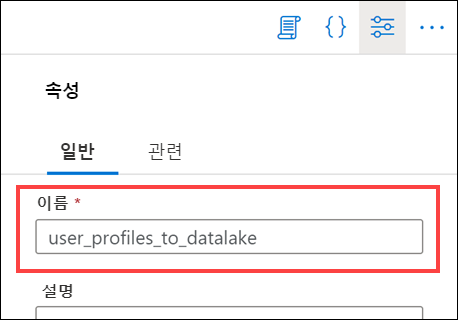

4. 데이터 흐름 속성 위의 오른쪽 상단에서 **{} 코드** 단추를 선택합니다.

    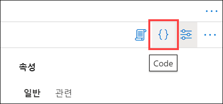

5. 기존 코드를 다음 코드로 **바꿉니다**.

    ```json
    {
        "name": "user_profiles_to_datalake",
        "properties": {
            "type": "MappingDataFlow",
            "typeProperties": {
                "sources": [
                    {
                        "dataset": {
                            "referenceName": "asal400_ecommerce_userprofiles_source",
                            "type": "DatasetReference"
                        },
                        "name": "EcommerceUserProfiles"
                    },
                    {
                        "dataset": {
                            "referenceName": "asal400_customerprofile_cosmosdb",
                            "type": "DatasetReference"
                        },
                        "name": "UserProfiles"
                    }
                ],
                "sinks": [
                    {
                        "linkedService": {
                            "referenceName": "INSERT_YOUR_DATALAKE_SERVICE_NAME",
                            "type": "LinkedServiceReference"
                        },
                        "name": "DataLake"
                    }
                ],
                "transformations": [
                    {
                        "name": "userId"
                    },
                    {
                        "name": "UserTopProducts"
                    },
                    {
                        "name": "DerivedProductColumns"
                    },
                    {
                        "name": "UserPreferredProducts"
                    },
                    {
                        "name": "JoinTopProductsWithPreferredProducts"
                    },
                    {
                        "name": "DerivedColumnsForMerge"
                    },
                    {
                        "name": "Filter1"
                    }
                ],
                "script": "source(output(\n\t\tvisitorId as string,\n\t\ttopProductPurchases as (productId as string, itemsPurchasedLast12Months as string)[]\n\t),\n\tallowSchemaDrift: true,\n\tvalidateSchema: false,\n\tignoreNoFilesFound: false,\n\tdocumentForm: 'arrayOfDocuments',\n\twildcardPaths:['online-user-profiles-02/*.json']) ~> EcommerceUserProfiles\nsource(output(\n\t\tcartId as string,\n\t\tpreferredProducts as integer[],\n\t\tproductReviews as (productId as integer, reviewDate as string, reviewText as string)[],\n\t\tuserId as integer\n\t),\n\tallowSchemaDrift: true,\n\tvalidateSchema: false,\n\tformat: 'document') ~> UserProfiles\nEcommerceUserProfiles derive(visitorId = toInteger(visitorId)) ~> userId\nuserId foldDown(unroll(topProductPurchases),\n\tmapColumn(\n\t\tvisitorId,\n\t\tproductId = topProductPurchases.productId,\n\t\titemsPurchasedLast12Months = topProductPurchases.itemsPurchasedLast12Months\n\t),\n\tskipDuplicateMapInputs: false,\n\tskipDuplicateMapOutputs: false) ~> UserTopProducts\nUserTopProducts derive(productId = toInteger(productId),\n\t\titemsPurchasedLast12Months = toInteger(itemsPurchasedLast12Months)) ~> DerivedProductColumns\nUserProfiles foldDown(unroll(preferredProducts),\n\tmapColumn(\n\t\tpreferredProductId = preferredProducts,\n\t\tuserId\n\t),\n\tskipDuplicateMapInputs: false,\n\tskipDuplicateMapOutputs: false) ~> UserPreferredProducts\nDerivedProductColumns, UserPreferredProducts join(visitorId == userId,\n\tjoinType:'outer',\n\tpartitionBy('hash', 30,\n\t\tproductId\n\t),\n\tbroadcast: 'left')~> JoinTopProductsWithPreferredProducts\nJoinTopProductsWithPreferredProducts derive(isTopProduct = toBoolean(iif(isNull(productId), 'false', 'true')),\n\t\tisPreferredProduct = toBoolean(iif(isNull(preferredProductId), 'false', 'true')),\n\t\tproductId = iif(isNull(productId), preferredProductId, productId),\n\t\tuserId = iif(isNull(userId), visitorId, userId)) ~> DerivedColumnsForMerge\nDerivedColumnsForMerge filter(!isNull(productId)) ~> Filter1\nFilter1 sink(allowSchemaDrift: true,\n\tvalidateSchema: false,\n\tformat: 'delta',\n\tcompressionType: 'snappy',\n\tcompressionLevel: 'Fastest',\n\tfileSystem: 'wwi-02',\n\tfolderPath: 'top-products',\n\ttruncate:true,\n\tmergeSchema: false,\n\tautoCompact: false,\n\toptimizedWrite: false,\n\tvacuum: 0,\n\tdeletable:false,\n\tinsertable:true,\n\tupdateable:false,\n\tupsertable:false,\n\tmapColumn(\n\t\tvisitorId,\n\t\tproductId,\n\t\titemsPurchasedLast12Months,\n\t\tpreferredProductId,\n\t\tuserId,\n\t\tisTopProduct,\n\t\tisPreferredProduct\n\t),\n\tskipDuplicateMapInputs: true,\n\tskipDuplicateMapOutputs: true) ~> DataLake"
            }
        }
    }
    ```

6. `line 25` 의 **INSERT_YOUR_DATALAKE_SERVICE_NAME**는 위의 이전 작업(작업 1)에서 복사한 ADLS Gen2 연결된 서비스의 이름으로 바꿉니다.

    

    이제 해당 값에 연결된 서비스 이름이 포함되어 있어야 합니다.

    

7. **확인**을 선택합니다.

8. 데이터 흐름은 다음과 같습니다.

    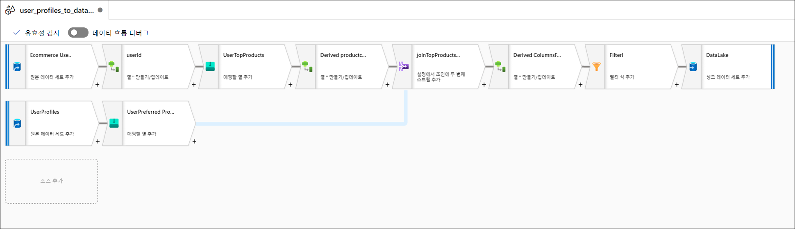

### 작업 3: 파이프라인 만들기

이 단계에서는 데이터 흐름을 실행할 새 통합 파이프라인을 만듭니다.

1. **통합** 허브로 이동합니다.

    

2. **+(1)**, **파이프라인(2)** 을 차례로 선택합니다.

    

3. 새 데이터 흐름 **프로필** 창의 **일반** 섹션에서 **이름**을 `User Profiles to Datalake`로 업데이트합니다. **속성** 단추를 선택하여 창을 숨깁니다.

    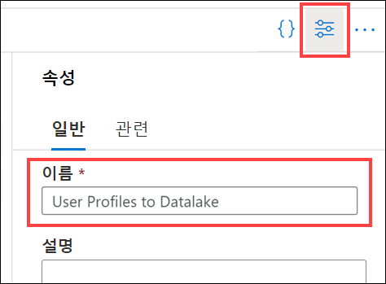

4. 활동 목록 내에서 **이동 및 변환**을 확장하고 **데이터 흐름** 활동을 파이프라인 캔버스로 끕니다.

    

5. **일반** 탭에서 이름을 `user_profiles_to_datalake`로 설정합니다.

    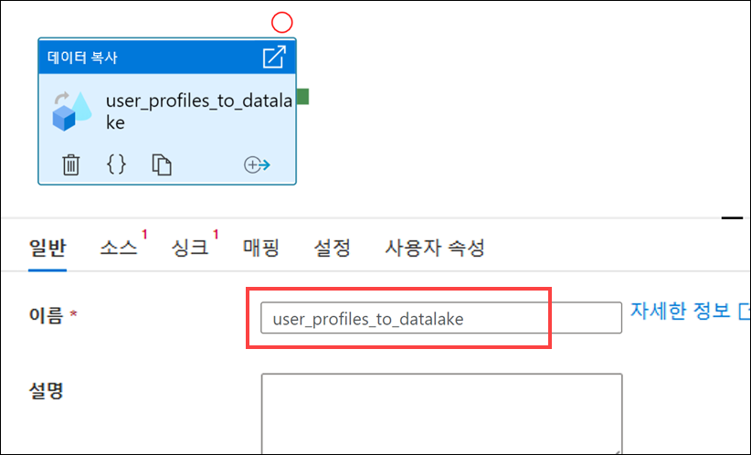

6. **설정** 탭 **(1)** 을 선택합니다. **데이터 흐름(2)** 으로 `user_profiles_to_datalake`를 선택하고 **실행 대상(Azure IR)(3)** 에서 `AutoResolveIntegrationRuntime`이 선택되어 있는지 확인합니다. `General purpose` **컴퓨팅 형식(4)** 을 선택하고 **코어 수(5)** 로는 `8 (+ 8 cores)`을 선택합니다.

    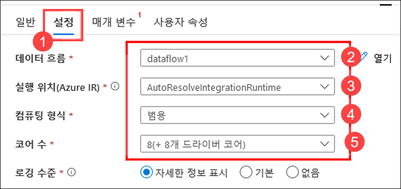

7. **모두 게시**, **게시**를 차례로 선택하여 파이프라인을 저장합니다.

    

### 작업 4: 파이프라인 트리거

1. 파이프라인 위쪽에서 **트리거 추가(1)** 와 **지금 트리거(2)** 를 차례로 선택합니다.

    

2. 이 파이프라인에는 매개 변수가 없으므로 **확인**을 선택하여 트리거를 실행합니다.

    

3. **모니터** 허브로 이동합니다.

    

4. **파이프라인 실행(1)** 을 선택하고 파이프라인 실행이 정상적으로 완료될 때까지 기다립니다 **(2)**. 보기를 새로 고쳐야 할 수도 있습니다 **(3)**.

    > 쿼리가 실행되는 동안 나머지 랩 지침을 확인하여 해당 내용을 숙지하세요.

    

## 연습 3: Synapse Spark Notebook을 만들어 상위 제품 찾기

Tailwind Traders는 Synapse Analytics의 매핑 데이터 흐름을 사용하여 사용자 프로필 데이터 처리, 조인, 가져오기를 수행합니다. 현재 Tailwind Traders는 각 사용자의 선호 제품과 구매 수가 많은 제품, 그리고 지난 12개월 동안 구매 수가 가장 많은 제품을 기준으로 하여 각 사용자의 상위 제품 5개를 확인하려고 합니다. 그런 다음 전체 제품 중 상위 5개 제품을 계산하려고 합니다.

이 랩 세그먼트에서는 이러한 계산을 수행할 Synapse Spark Notebook을 만듭니다.

> 이 계산에서는 전용 SQL 풀을 사용할 필요가 없도록 데이터 흐름의 두 번째 싱크로 추가한 데이터 레이크의 데이터에 액세스합니다.

### 작업 1: Notebook 만들기

1. Synapse Analytics Studio(<https://web.azuresynapse.net/>)를 열고 **데이터** 허브로 이동합니다.

    

2. **연결됨** 탭 **(1)** 을 선택하고 **Azure Data Lake Storage Gen2** 아래의 **기본 데이터 레이크 스토리지 계정(2)** 을 확장합니다. **wwi-02** 컨테이너 **(3)** 를 선택하고 **top-products** 폴더 **(4)** 를 엽니다. 아무 Parquet 파일 **(5)** 이나 마우스 오른쪽 단추로 클릭하고 **새 Notebook** 메뉴 항목 **(6)** 을 선택한 다음 **데이터 프레임에 로드(7)** 를 선택합니다. 해당 폴더가 표시되지 않으면 위쪽의 `Refresh`을 선택합니다.

    

3. Notebook이 Spark 풀에 연결되어 있는지 확인합니다.

    

4. Parquet 파일 이름을 `*.parquet` **(1)** 으로 바꿔 `top-products` 폴더의 모든 Parquet 파일을 선택합니다. 예를 들어 `abfss://wwi-02@YOUR_DATALAKE_NAME.dfs.core.windows.net/top-products/*.parquet`과 같은 경로를 사용할 수 있습니다.

    

5. Notebook 도구 모음에서 **모두 실행**을 선택하여 Notebook을 실행합니다.

    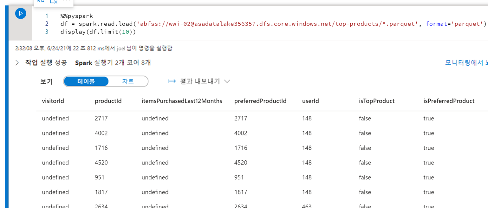

    > **참고:** Spark 풀에서 Notebook을 처음 실행하면 Synapse가 새 세션을 생성합니다. 이 작업은 약 3~5분이 걸릴 수 있습니다.

    > **참고:** 셀만 실행하려면 셀을 마우스로 가리키고 셀 왼쪽에 있는 _셀 실행_ 아이콘을 선택하거나 셀을 선택한 후 키보드에서 **Ctrl+Enter**를 누릅니다.

6. **+** 단추를 선택하고 **</> 코드 셀** 항목을 선택하여 아래쪽에 새 셀을 만듭니다. + 단추는 Notebook 셀 아래 왼쪽에 있습니다.

    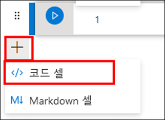

7. 새 셀에서 다음 코드를 입력하고 실행하여 새 데이터 프레임 `topPurchases`에 데이터를 입력하고 새 임시 보기 `top_purchases`를 만든 다음 처음 100개 행을 표시합니다.

    ```python
    topPurchases = df.select(
        "UserId", "ProductId",
        "ItemsPurchasedLast12Months", "IsTopProduct",
        "IsPreferredProduct")

    # Populate a temporary view so we can query from SQL
    topPurchases.createOrReplaceTempView("top_purchases")

    topPurchases.show(100)
    ```

    다음과 같은 출력이 표시됩니다.

    ```text
    +------+---------+--------------------------+------------+------------------+
    |UserId|ProductId|ItemsPurchasedLast12Months|IsTopProduct|IsPreferredProduct|
    +------+---------+--------------------------+------------+------------------+
    |   148|     2717|                      null|       false|              true|
    |   148|     4002|                      null|       false|              true|
    |   148|     1716|                      null|       false|              true|
    |   148|     4520|                      null|       false|              true|
    |   148|      951|                      null|       false|              true|
    |   148|     1817|                      null|       false|              true|
    |   463|     2634|                      null|       false|              true|
    |   463|     2795|                      null|       false|              true|
    |   471|     1946|                      null|       false|              true|
    |   471|     4431|                      null|       false|              true|
    |   471|      566|                      null|       false|              true|
    |   471|     2179|                      null|       false|              true|
    |   471|     3758|                      null|       false|              true|
    |   471|     2434|                      null|       false|              true|
    |   471|     1793|                      null|       false|              true|
    |   471|     1620|                      null|       false|              true|
    |   471|     1572|                      null|       false|              true|
    |   833|      957|                      null|       false|              true|
    |   833|     3140|                      null|       false|              true|
    |   833|     1087|                      null|       false|              true|
    ```

8. 새 셀에서 다음 코드를 실행하여 `IsTopProduct`와 `IsPreferredProduct`가 모두 true인 상위 선호 제품만 포함할 새 데이터 프레임을 만듭니다.

    ```python
    from pyspark.sql.functions import *

    topPreferredProducts = (topPurchases
        .filter( col("IsTopProduct") == True)
        .filter( col("IsPreferredProduct") == True)
        .orderBy( col("ItemsPurchasedLast12Months").desc() ))

    topPreferredProducts.show(100)
    ```

    

9. 새 셀에서 다음 코드를 실행하여 SQL을 사용해 새 임시 보기를 만듭니다.

    ```sql
    %%sql

    CREATE OR REPLACE TEMPORARY VIEW top_5_products
    AS
        select UserId, ProductId, ItemsPurchasedLast12Months
        from (select *,
                    row_number() over (partition by UserId order by ItemsPurchasedLast12Months desc) as seqnum
            from top_purchases
            ) a
        where seqnum <= 5 and IsTopProduct == true and IsPreferredProduct = true
        order by a.UserId
    ```

    *위 쿼리에서는 출력이 반환되지 않습니다.* 이 쿼리는 `top_purchases` 임시 보기를 원본으로 사용하며, `row_number() over` 메서드를 적용하여 `ItemsPurchasedLast12Months`가 가장 큰 각 사용자 레코드에 행 번호를 적용합니다. `where` 절이 결과를 필터링하므로 `IsTopProduct`와 `IsPreferredProduct`가 모두 true인 제품이 5개까지만 검색됩니다. 즉, Azure Cosmos DB에 저장되어 있는 사용자 프로필에 따라 각 사용자가 가장 선호하는 제품으로 확인된 _동시에_ 가장 많이 구매한 상위 5개 제품을 확인할 수 있습니다.

10. 새 셀에서 다음 코드를 실행하여 새 데이터 프레임을 만들어 표시합니다. 이 데이터 프레임에는 이전 셀에서 만든 `top_5_products` 임시 보기의 결과가 저장됩니다.

    ```python
    top5Products = sqlContext.table("top_5_products")

    top5Products.show(100)
    ```

    사용자별 상위 5개 선호 제품이 표시되는 다음과 같은 출력을 확인할 수 있습니다.

    

11. 새 셀에서 다음 코드를 실행하여 고객별 상위 선호 제품 수와 상위 5개 선호 제품을 비교합니다.

    ```python
    print('before filter: ', topPreferredProducts.count(), ', after filter: ', top5Products.count())
    ```

    `before filter:  997873 , after filter:  85020`와 같은 출력이 표시됩니다.

12. 이번에는 고객이 가장 선호하는 동시에 가장 많이 구매한 제품을 기준으로 하여 전체 제품 중 상위 5개 제품을 계산합니다. 이렇게 하려면 새 셀에서 다음 코드를 실행합니다.

    ```python
    top5ProductsOverall = (top5Products.select("ProductId","ItemsPurchasedLast12Months")
        .groupBy("ProductId")
        .agg( sum("ItemsPurchasedLast12Months").alias("Total") )
        .orderBy( col("Total").desc() )
        .limit(5))

    top5ProductsOverall.show()
    ```

    이 셀의 코드는 제품 ID 기준 상위 5개 선호 제품을 그룹화하고 지난 12개월 동안 고객이 구매한 총 항목 수의 합을 계산합니다. 그런 다음 해당 값을 내림차순으로 정렬하고 상위 5개 결과를 반환합니다. 다음과 유사하게 출력될 것입니다.

    ```text
    +---------+-----+
    |ProductId|Total|
    +---------+-----+
    |      347| 4523|
    |     4833| 4314|
    |     3459| 4233|
    |     2486| 4135|
    |     2107| 4113|
    +---------+-----+
    ```

13. 파이프라인에서 이 Notebook을 실행해 보겠습니다. 여기서는 Parquet 파일 이름을 지정하는 데 사용할 `runId` 변수 값을 설정하는 매개 변수를 전달합니다. 새 셀에서 다음 코드를 실행합니다.

    ```python
    import uuid

    # 임의 GUID 생성
    runId = uuid.uuid4()
    ```

    위의 코드에 나와 있는 것처럼, Spark에서 제공되는 `uuid` 라이브러리를 사용하여 임의 GUID를 생성했습니다. 파이프라인에서 전달한 매개 변수로 `runId` 변수를 재정의하려고 합니다. 이렇게 하려면 이 셀을 매개 변수 셀로 토글해야 합니다.

14. 셀 **(1)** 위의 작업 줄임표 **(...)** 를 선택하고 **매개 변수 셀 토글(2)** 을 선택합니다.

    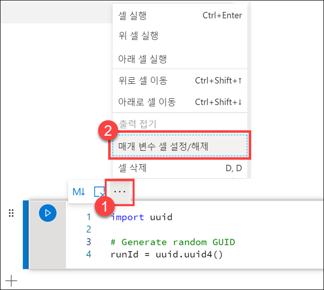

    이 옵션을 토글하고 나면 셀에 **매개 변수** 태그가 표시됩니다.

    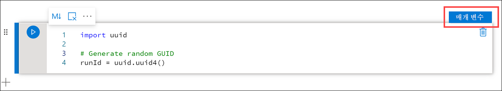

15. 새 셀에 다음 코드를 붙여넣습니다. 그러면 기본 데이터 레이크 계정의 `/top5-products/` 경로에서 `runId` 매개 변수가 Parquet 파일 이름으로 사용됩니다. 경로의 **`YOUR_DATALAKE_NAME`** 은 기본 데이터 레이크 계정 이름으로 **바꿉니다**. 이 이름을 찾으려면 페이지 위쪽 **(1)** 으로 스크롤하여 **셀 1**을 찾습니다. 경로 **(2)** 에서 데이터 레이크 스토리지 계정을 복사합니다. 새 셀 내의 경로 **(3)** 에서 **`YOUR_DATALAKE_NAME`** 대신 이 값을 붙여넣고 셀을 실행합니다.

    ```python
    %%pyspark

    top5ProductsOverall.write.parquet('abfss://wwi-02@YOUR_DATALAKE_NAME.dfs.core.windows.net/top5-products/' + str(runId) + '.parquet')
    ```

    

16. 데이터 레이크에 파일이 작성되었는지 확인합니다. **데이터** 허브로 이동하여 **연결됨** 탭 **(1)** 을 선택합니다. 기본 데이터 레이크 스토리지 계정을 확장하고 **wwi-02** 컨테이너 **(2)** 를 선택합니다. **top5-products** 폴더 **(3)** 로 이동합니다. 디렉터리에 GUID가 파일 이름으로 지정된 Parquet 파일의 폴더가 표시됩니다 **(4)**.

    

    이전에는 이 디렉터리가 없었기 때문에 Notebook 셀에서 데이터 프레임에 대해 실행된 Parquet write 메서드가 해당 디렉터리를 만들었습니다.

17. Notebook으로 돌아갑니다. Notebook 오른쪽 위에서 **세션 중지**를 선택합니다. 여기서 세션을 중지하는 이유는, 다음 섹션에서 파이프라인 내에서 Notebook을 실행할 수 있도록 컴퓨팅 리소스를 확보하기 위해서입니다.

    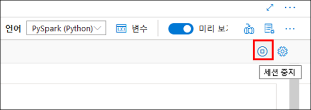

18. 현재 세션 중지에서 **지금 중지**를 선택합니다.

    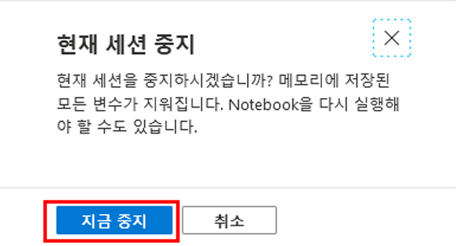

### 작업 2: 파이프라인에 Notebook 추가

Tailwind Traders는 오케스트레이션 프로세스의 일환으로 매핑 데이터 흐름 실행 후에 이 Notebook을 실행하려고 합니다. 이 작업에서는 해당 Notebook을 새 Notebook 활동으로 파이프라인에 추가합니다.

1. Notebook으로 돌아갑니다. Notebook 오른쪽 위의 **속성** 단추 **(1)** 를 선택하고 **이름(2)** 으로 `Calculate Top 5 Products`를 입력합니다.

    

2. Notebook 오른쪽 위의 **파이프라인에 추가** 단추 **(1)** 를 선택하고 **기존 파이프라인(2)** 을 선택합니다.

    

3. **User Profiles to Datalake** 파이프라인 **(1)** 을 선택하고 **추가(2)** 를 선택합니다.

    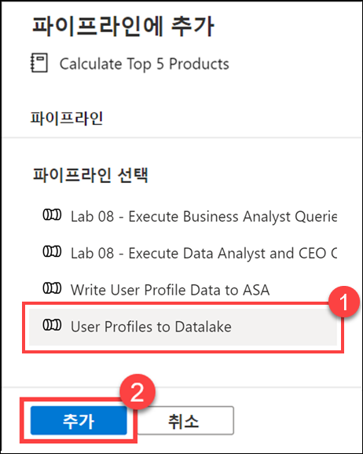

4. Synapse Studio에서 파이프라인에 Notebook 활동을 추가합니다. **Notebook 활동**이 **데이터 흐름 활동** 오른쪽에 오도록 활동을 다시 정렬합니다. **데이터 흐름 활동**을 선택한 다음 **성공** 활동 파이프라인 연결(**녹색 상자**)을 **Notebook 활동**으로 끕니다.

    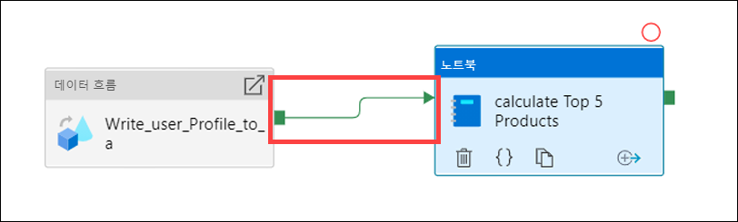

    성공 활동 화살표를 Notebook 활동으로 끌면 데이터 흐름 활동이 정상적으로 실행된 후 Notebook 활동을 실행하라는 명령이 파이프라인에 전송됩니다.

5. **Notebook 활동(1)** 을 선택하고 **설정** 탭 **(2)** 을 선택한 후 **기본 매개 변수(3)** 를 확장하고 **+ 새로 만들기(4)** 를 선택합니다. **이름** 필드 **(5)** 에 **`runId`** 를 입력합니다. **유형(6)** 으로 **문자열**을 선택합니다. **값**으로 **동적 콘텐츠 추가(7)** 를 선택합니다.

    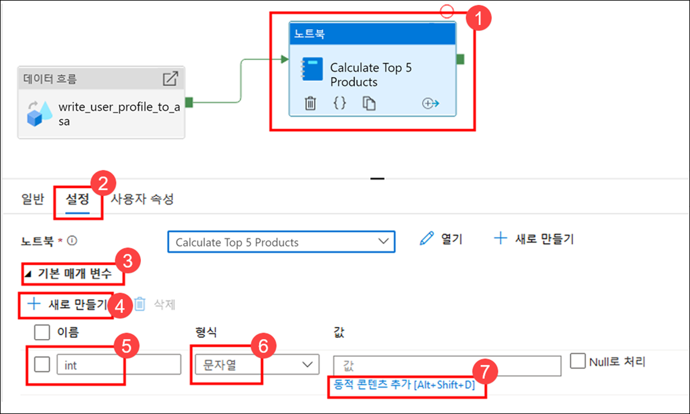

6. **시스템 변수(1)** 알래에서 **파이프라인 실행 ID**를 선택합니다. 그러면 동적 콘텐츠 상자 **(2)** 에 `@pipeline().RunId`가 추가됩니다. **마침(3)** 을 선택하여 대화 상자를 닫습니다.

    

    파이프라인 실행 ID 값은 각 파이프라인 실행에 할당되는 고유 GUID입니다. 여기서는 이 값을 `runId` Notebook 매개 변수로 전달하여 Parquet 파일의 이름으로 사용하겠습니다. 그리고 나면 파이프라인 실행 기록을 확인하여 각 파이프라인 실행용으로 작성된 특정 Parquet 파일을 찾을 수 있습니다.

7. **모두 게시**, **게시**를 차례로 선택하여 변경 내용을 저장합니다.

    

8. **선택 사항 - 파이프라인이 10분 이상 실행됨 -** 게시가 완료되면 **트리거 추가(1)**, **지금 트리거(2)** 를 차례로 선택하여 업데이트된 파이프라인을 실행합니다.

    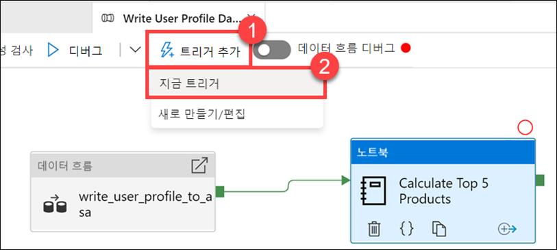

9. **확인**을 선택하여 트리거를 실행합니다.

    

10. **모니터** 허브로 이동합니다.

    

11. **파이프라인 실행(1)** 을 선택하고 파이프라인 실행이 정상적으로 완료될 때까지 기다립니다 **(2)**. 보기를 새로 고쳐야 할 수도 있습니다 **(3)**.

    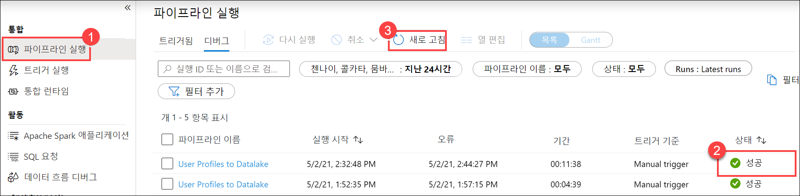

    > Notebook 활동을 추가한 파이프라인 실행이 완료되려면 10분 이상 걸릴 수 있습니다.
    > 쿼리가 실행되는 동안 나머지 랩 지침을 확인하여 해당 내용을 숙지하세요.

12. 파이프라인 이름을 선택하여 파이프라인 활동 실행을 확인합니다.

    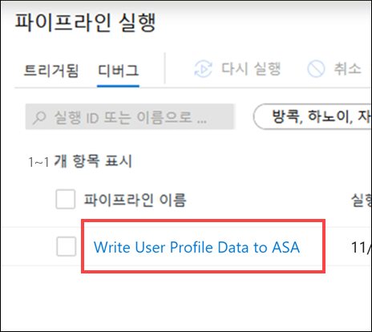

13. 이번에는 **데이터 흐름** 활동과 새 **Notebook** 활동 **(1)** 이 모두 표시됩니다. **파이프라인 실행 ID** 값 **(2)** 을 적어 둡니다. 이 값을 Notebook에서 생성된 Parquet 파일 이름과 비교할 것입니다. **Calculate Top 5 Products** Notebook 이름을 선택하여 해당 세부 정보 **(3)** 를 확인합니다.

    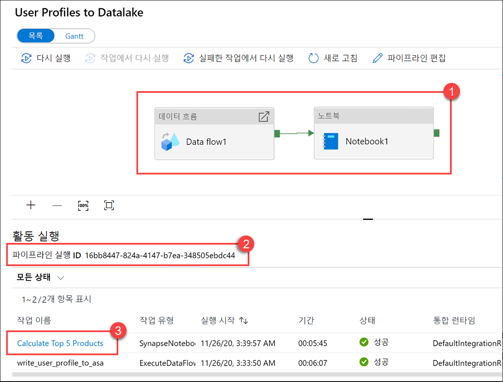

14. Notebook 실행 세부 정보가 표시됩니다. **재생** 단추 **(1)** 를 선택하면 **작업(2)** 진행 상황을 확인할 수 있습니다. 아래쪽에서는 다양한 필터 옵션 **(3)** 을 사용하여 **진단** 및 **로그**를 확인할 수 있습니다. 특정 단계를 가리키면 지속 시간, 총 작업 수, 데이터 세부 정보 등의 단계 세부 정보를 확인할 수 있습니다. **단계**의 **세부 정보 보기** 링크를 선택하면 해당 세부 정보 **(5)** 가 표시됩니다.

    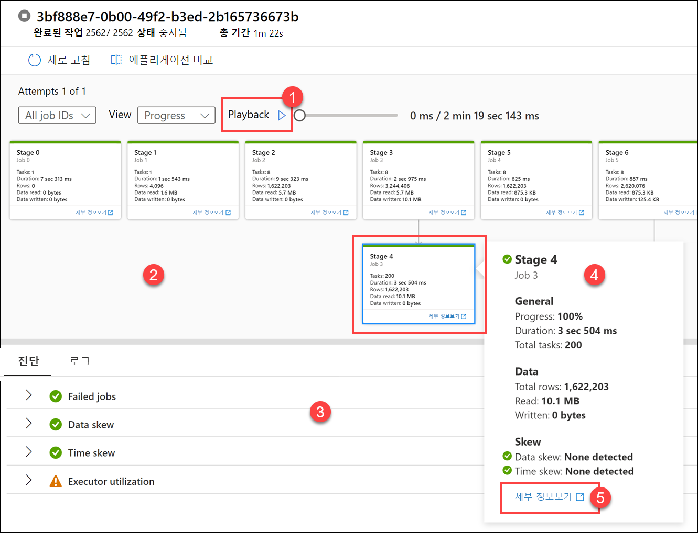

15. Spark 애플리케이션 UI가 새 탭에서 열립니다. 이 탭에서 단계 세부 정보를 확인할 수 있습니다. **DAG 시각화**를 확장하여 단계 세부 정보를 확인합니다.

    

16. **데이터** 허브로 돌아갑니다.

    

17. **연결됨** 탭 **(1)** 을 선택하고 기본 데이터 레이크 스토리지 계정에서 **wwi-02** 컨테이너 **(2)** 를 선택합니다. 그런 다음 **top5-products** 폴더 **(3)** 로 이동하여 이름이 **파이프라인 실행 ID**와 일치하는 Parquet 파일용 폴더가 있는지 확인합니다.

    

    보시다시피 앞에서 확인한 **파이프라인 실행 ID**와 이름이 일치하는 파일이 있습니다.

    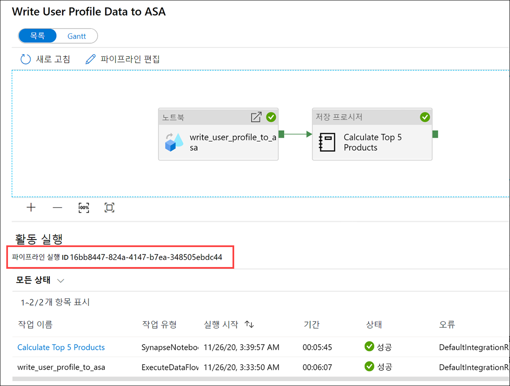

    이 두 값이 일치하는 이유는, Notebook 활동에서 `runId` 매개 변수에 파이프라인 실행 ID를 전달했기 때문입니다.
