# 모듈 10 - Azure Synapse에서 전용 SQL 풀을 사용하여 쿼리 성능 최적화

이 모듈에서는 Azure Synapse Analytics에서 전용 SQL 풀을 사용할 때 데이터 저장 및 처리를 최적화하는 전략에 대해 알아봅니다. 구체적으로는 창 작업 및 HyperLogLog 함수 등의 개발자 기능 사용법, 데이터 로드 모범 사례 사용법, 그리고 쿼리 성능 최적화 및 개선 방법을 파악합니다.

이 모듈을 완료하면 다음 작업을 수행할 수 있습니다.

- Azure Synapse Analytics의 개발자 기능 파악
- Azure Synapse Analytics에서 데이터 웨어하우스 쿼리 성능 최적화
- 쿼리 성능 개선

## 랩 세부 정보

- [모듈 10 - Azure Synapse에서 전용 SQL 풀을 사용하여 쿼리 성능 최적화](#module-10---optimize-query-performance-with-dedicated-sql-pools-in-azure-synapse)
  - [랩 세부 정보](#lab-details)
  - [랩 설정 및 필수 구성 요소](#lab-setup-and-pre-requisites)
  - [연습 0: 전용 SQL 풀 시작](#exercise-0-start-the-dedicated-sql-pool)
  - [연습 1: Azure Synapse Analytics의 개발자 기능 파악](#exercise-1-understanding-developer-features-of-azure-synapse-analytics)
    - [작업 1: 테이블 만들기 및 데이터 로드](#task-1-create-tables-and-load-data)
    - [작업 2: 창 함수 사용](#task-2-using-window-functions)
      - [작업 2.1: OVER 절](#task-21-over-clause)
      - [작업 2.2: 집계 함수](#task-22-aggregate-functions)
      - [작업 2.3: 분석 함수](#task-23-analytic-functions)
      - [작업 2.4: ROWS 절](#task-24-rows-clause)
    - [작업 3: HyperLogLog 함수를 사용한 근사 실행](#task-3-approximate-execution-using-hyperloglog-functions)
  - [연습 2: Azure Synapse Analytics에서 데이터 로드 모범 사례 사용](#exercise-2-using-data-loading-best-practices-in-azure-synapse-analytics)
    - [작업 1: 워크로드 관리 구현](#task-1-implement-workload-management)
    - [작업 2: 특정 쿼리의 중요도를 높이는 워크로드 분류자 만들기](#task-2-create-a-workload-classifier-to-add-importance-to-certain-queries)
    - [작업 3: 워크로드 격리를 통해 특정 워크로드에 대한 리소스 예약](#task-3-reserve-resources-for-specific-workloads-through-workload-isolation)
  - [연습 3: Azure Synapse Analytics에서 데이터 웨어하우스 쿼리 성능 최적화](#exercise-3-optimizing-data-warehouse-query-performance-in-azure-synapse-analytics)
    - [작업 1: 테이블 관련 성능 문제 파악](#task-1-identify-performance-issues-related-to-tables)
    - [작업 2: 해시 배포 및 columnstore 인덱스를 사용하여 테이블 구조 개선](#task-2-improve-table-structure-with-hash-distribution-and-columnstore-index)
    - [작업 4: 분할을 통해 테이블 구조 추가 개선](#task-4-improve-further-the-table-structure-with-partitioning)
      - [작업 4.1: 테이블 배포](#task-41-table-distributions)
      - [작업 4.2: 인덱스](#task-42-indexes)
      - [작업 4.3: 분할](#task-43-partitioning)
  - [연습 4: 쿼리 성능 개선](#exercise-4-improve-query-performance)
    - [작업 1: 구체화된 뷰 사용](#task-1-use-materialized-views)
    - [작업 2: 결과 집합 캐싱 사용](#task-2-use-result-set-caching)
    - [작업 3: 통계 만들기 및 업데이트](#task-3-create-and-update-statistics)
    - [작업 4: 인덱스 만들기 및 업데이트](#task-4-create-and-update-indexes)
    - [작업 5: 순서가 지정된 클러스터형 columnstore 인덱스](#task-5-ordered-clustered-columnstore-indexes)
  - [연습 5: 정리](#exercise-5-cleanup)
    - [작업 1: 전용 SQL 풀 일시 중지](#task-1-pause-the-dedicated-sql-pool)

## 랩 설정 및 필수 구성 요소

> **참고:** `Lab setup and pre-requisites` 단계는 호스트된 랩 환경이 **아닌**자체 Azure 구독을 사용하는 경우에만 완료하세요. 호스트된 랩 환경을 사용하는 경우에는 연습 0부터 바로 진행하면 됩니다.

이 모듈의 **[랩 설정 지침](https://github.com/solliancenet/microsoft-data-engineering-ilt-deploy/blob/main/setup/04/README.md)에 나와 있는 작업을 완료**하세요.

다음 모듈에서도 이 모듈과 같은 환경을 사용합니다.

- [모듈 4](labs/04/README.md)
- [모듈 5](labs/05/README.md)
- [모듈 7](labs/07/README.md)
- [모듈 8](labs/08/README.md)
- [모듈 9](labs/09/README.md)
- [모듈 10](labs/10/README.md)
- [모듈 11](labs/11/README.md)
- [모듈 12](labs/12/README.md)
- [모듈 13](labs/13/README.md)
- [모듈 16](labs/16/README.md)

## 연습 0: 전용 SQL 풀 시작

이 랩에서는 전용 SQL 풀을 사용합니다. 그러므로 첫 단계에서는 풀이 일시 중지되지 않았는지를 확인해야 합니다. 풀이 일시 중지되었다면 아래 지침에 따라 풀을 시작합니다.

1. Synapse Studio(<https://web.azuresynapse.net/>)를 엽니다.

2. **관리** 허브를 선택합니다.

    

3. 왼쪽 메뉴에서 **SQL 풀**을 선택합니다 **(1)**. 전용 SQL 풀이 일시 중지되어 있으면 풀 이름을 커서로 가리키고 **다시 시작(2)** 을 선택합니다.

    

4. 메시지가 표시되면 **다시 시작**을 선택합니다. 풀이 다시 시작되려면 1~2분 정도 걸립니다.

    

> 전용 SQL 풀이 다시 시작될 때까지 **기다립니다**.

## 연습 1: Azure Synapse Analytics의 개발자 기능 파악

### 작업 1: 테이블 만들기 및 데이터 로드

이 작업을 시작하기 전에 새 테이블 몇 개를 만들고 데이터를 로드해야 합니다.

1. Synapse Studio(<https://web.azuresynapse.net/>)를 엽니다.

2. **개발** 허브를 선택합니다.

    

3. **개발** 메뉴에서 + 단추 **(1)** 를 선택하고 컨텍스트 메뉴에서 **SQL 스크립트(2)** 를 선택합니다.

    

4. 도구 모음 메뉴에서 **SQLPool01** 데이터베이스에 연결하여 쿼리를 실행합니다.

    

5. 쿼리 창에서 `wwi_security.Sale` 테이블의 데이터에 `OVER` 절을 사용하도록 스크립트를 다음과 같이 바꿉니다.

    ```sql
    IF OBJECT_ID(N'[dbo].[Category]', N'U') IS NOT NULL
    DROP TABLE [dbo].[Category]

    CREATE TABLE [dbo].[Category]
    ( 
        [ID] [float]  NOT NULL,
        [Category] [varchar](255)  NULL,
        [SubCategory] [varchar](255)  NULL
    )
    WITH
    (
        DISTRIBUTION = ROUND_ROBIN,
        CLUSTERED COLUMNSTORE INDEX
    )
    GO

    IF OBJECT_ID(N'[dbo].[Books]', N'U') IS NOT NULL
    DROP TABLE [dbo].[Books]

    CREATE TABLE [dbo].[Books]
    ( 
        [ID] [float]  NOT NULL,
        [BookListID] [float]  NULL,
        [Title] [varchar](255)  NULL,
        [Author] [varchar](255)  NULL,
        [Duration] [float]  NULL,
        [Image] [varchar](255)  NULL
    )
    WITH
    (
        DISTRIBUTION = ROUND_ROBIN,
        CLUSTERED COLUMNSTORE INDEX
    )
    GO

    IF OBJECT_ID(N'[dbo].[BookConsumption]', N'U') IS NOT NULL
    DROP TABLE [dbo].[BookConsumption]

    CREATE TABLE [dbo].[BookConsumption]
    ( 
        [BookID] [float]  NULL,
        [Clicks] [float]  NULL,
        [Downloads] [float]  NULL,
        [Time Spent] [float]  NULL,
        [Country] [varchar](255)  NULL
    )
    WITH
    (
        DISTRIBUTION = ROUND_ROBIN,
        CLUSTERED COLUMNSTORE INDEX
    )
    GO

    IF OBJECT_ID(N'[dbo].[BookList]', N'U') IS NOT NULL
    DROP TABLE [dbo].[BookList]

    CREATE TABLE [dbo].[BookList]
    ( 
        [ID] [float]  NOT NULL,
        [CategoryID] [float]  NULL,
        [BookList] [varchar](255)  NULL
    )
    WITH
    (
        DISTRIBUTION = ROUND_ROBIN,
        CLUSTERED COLUMNSTORE INDEX
    )
    GO

    COPY INTO Category 
    FROM 'https://solliancepublicdata.blob.core.windows.net/dataengineering/dp-203/books/Category.csv'
    WITH (
        FILE_TYPE = 'CSV',
        FIRSTROW = 2
    )
    GO

    COPY INTO Books 
    FROM 'https://solliancepublicdata.blob.core.windows.net/dataengineering/dp-203/books/Books.csv'
    WITH (
        FILE_TYPE = 'CSV',
        FIRSTROW = 2
    )
    GO

    COPY INTO BookConsumption 
    FROM 'https://solliancepublicdata.blob.core.windows.net/dataengineering/dp-203/books/BookConsumption.csv'
    WITH (
        FILE_TYPE = 'CSV',
        FIRSTROW = 2
    )
    GO

    COPY INTO BookList 
    FROM 'https://solliancepublicdata.blob.core.windows.net/dataengineering/dp-203/books/BookList.csv'
    WITH (
        FILE_TYPE = 'CSV',
        FIRSTROW = 2
    )
    GO
    ```

6. 도구 모음 메뉴에서 **실행**을 선택하여 SQL 명령을 실행합니다.

    

    몇 초 후 쿼리 실행이 정상적으로 완료됩니다.

### 작업 2: 창 함수 사용

Tailwind Traders에서는 고가의 커서, 하위 쿼리 및 현재 사용 중인 기타 구식 방법을 사용하지 않고 영업 데이터를 더욱 효율적으로 분석할 수 있는 방법을 모색하고 있습니다.

여러분은 분석 효율성 개선을 위해 창 함수를 사용하여 특정 행 집합을 대상으로 계산을 수행하는 방식을 제안합니다. 이러한 함수를 사용할 때는 행 그룹이 엔터티 하나로 처리됩니다.

#### 작업 2.1: OVER 절

창 함수의 주요 구성 요소 중 하나는 **`OVER`** 절입니다. 이 절은 관련 창 함수를 적용하기 전에 행 집합의 분할과 순서를 결정합니다. 즉, OVER 절은 쿼리 결과 집합 내의 창 또는 사용자 지정 행 집합을 정의합니다. 그런 다음 창 함수가 창의 각 행에 대한 값을 계산합니다. OVER 절에 함수를 사용하여 이동 평균, 누적 집계, 누계 또는 그룹 결과당 상위 N개 결과 등의 집계된 값을 계산할 수 있습니다.

1. **개발** 허브를 선택합니다.

    

2. **개발** 메뉴에서 + 단추 **(1)** 를 선택하고 컨텍스트 메뉴에서 **SQL 스크립트(2)** 를 선택합니다.

    

3. 도구 모음 메뉴에서 **SQLPool01** 데이터베이스에 연결하여 쿼리를 실행합니다.

    

4. 쿼리 창에서 `wwi_security.Sale` 테이블의 데이터에 `OVER` 절을 사용하도록 스크립트를 다음과 같이 바꿉니다.

    ```sql
    SELECT
      ROW_NUMBER() OVER(PARTITION BY Region ORDER BY Quantity DESC) AS "Row Number",
      Product,
      Quantity,
      Region
    FROM wwi_security.Sale
    WHERE Quantity <> 0  
    ORDER BY Region;
    ```

5. 도구 모음 메뉴에서 **실행**을 선택하여 SQL 명령을 실행합니다.

    

    `PARTITION BY`를 `OVER` 절 **(1)** 과 함께 사용할 때는 쿼리 결과 집합을 파티션으로 나눕니다. 창 함수는 각 파티션에 별도로 적용되므로 각 파티션에 대해 계산이 다시 시작됩니다.

    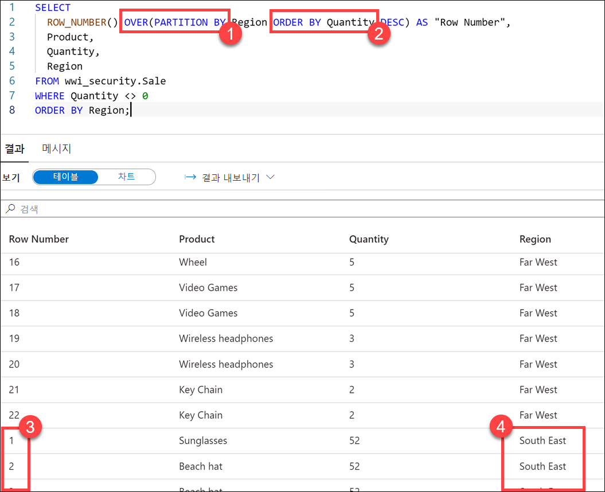

    앞에서 실행한 스크립트에서는 OVER 절에 ROW_NUMBER 함수 **(1)** 를 사용하여 파티션 내 각 행의 행 번호를 표시합니다. 이 스크립트의 파티션은 `Region` 열입니다. OVER 절에 지정된 ORDER BY 절 **(2)** 은 `Quantity` 열을 기준으로 하여 각 파티션의 행을 정렬합니다. SELECT 문의 ORDER BY 절은 전체 쿼리 결과 집합이 반환되는 순서를 결정합니다.

    **Row Number** 개수 **(3)** 가 **다른 지역(4)** 부터 다시 시작될 때까지 결과 뷰를 **아래로 스크롤**합니다. 파티션이 `Region`으로 설정되어 있으므로 지역이 변경되면 `ROW_NUMBER`가 다시 설정됩니다. 요약하자면, 이 스크립트에서는 지역을 기준으로 결과 집합을 분할했으며 해당 지역의 행 수를 기준으로 결과 집합을 확인했습니다.

#### 작업 2.2: 집계 함수

이번에는 OVER 절을 사용하는 쿼리를 확장하여 창에서 집계 함수를 사용해 보겠습니다.

1. 쿼리 창에서 스크립트를 다음과 같이 바꿔 집계 함수를 추가합니다.

    ```sql
    SELECT
      ROW_NUMBER() OVER(PARTITION BY Region ORDER BY Quantity DESC) AS "Row Number",
      Product,
      Quantity,
      SUM(Quantity) OVER(PARTITION BY Region) AS Total,  
      AVG(Quantity) OVER(PARTITION BY Region) AS Avg,  
      COUNT(Quantity) OVER(PARTITION BY Region) AS Count,  
      MIN(Quantity) OVER(PARTITION BY Region) AS Min,  
      MAX(Quantity) OVER(PARTITION BY Region) AS Max,
      Region
    FROM wwi_security.Sale
    WHERE Quantity <> 0  
    ORDER BY Region;
    ```

2. 도구 모음 메뉴에서 **실행**을 선택하여 SQL 명령을 실행합니다.

    

    이 쿼리에서는 `SUM`, `AVG`, `COUNT`, `MIN` 및 `MAX` 집계 함수를 추가했습니다. OVER 절을 사용하는 것이 하위 쿼리를 사용하는 것보다 더 효율적입니다.

    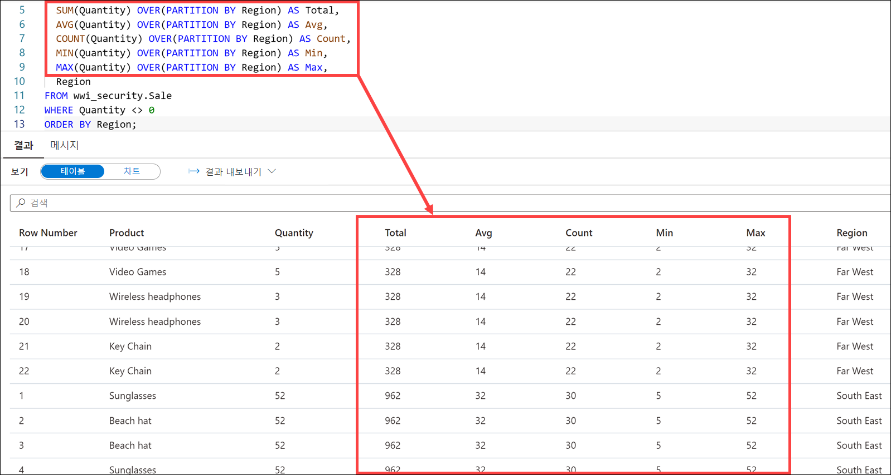

#### 작업 2.3: 분석 함수

분석 함수는 행 그룹을 기반으로 집계 값을 계산합니다. 그러나 집계 함수와 달리 분석 함수는 각 그룹에 대해 여러 행을 반환할 수 있습니다. 분석 함수를 사용하면 이동 평균, 누계, 백분율 또는 그룹 내 상위 N개 결과를 계산할 수 있습니다.

Tailwind Traders는 온라인 상점에서 가져온 책 판매 데이터를 보유하고 있으며 범주별로 책 다운로드 비율을 계산하려고 합니다.

이 계산을 위해 `PERCENTILE_CONT` 및 `PERCENTILE_DISC` 함수를 사용하는 창 함수를 작성하기로 했습니다.

1. 쿼리 창에서 스크립트를 다음과 같이 바꿔 집계 함수를 추가합니다.

    ```sql
    -- PERCENTILE_CONT, PERCENTILE_DISC
    SELECT DISTINCT c.Category  
    ,PERCENTILE_CONT(0.5) WITHIN GROUP (ORDER BY bc.Downloads)
                          OVER (PARTITION BY Category) AS MedianCont  
    ,PERCENTILE_DISC(0.5) WITHIN GROUP (ORDER BY bc.Downloads)
                          OVER (PARTITION BY Category) AS MedianDisc  
    FROM dbo.Category AS c  
    INNER JOIN dbo.BookList AS bl
        ON bl.CategoryID = c.ID
    INNER JOIN dbo.BookConsumption AS bc  
        ON bc.BookID = bl.ID
    ORDER BY Category
    ```

2. 도구 모음 메뉴에서 **실행**을 선택하여 SQL 명령을 실행합니다.

    

    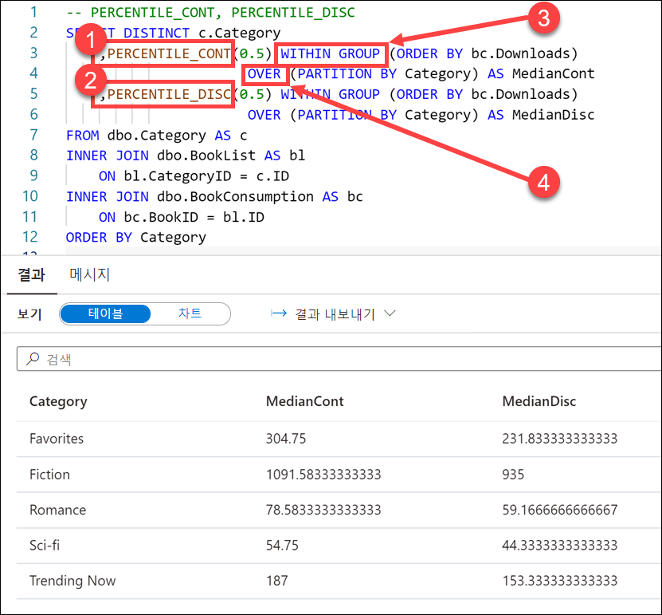

    이 쿼리에서는 **PERCENTILE_CONT(1)** 및 **PERCENTILE_DISC(2)** 를 사용하여 각 책 범주의 다운로드 수 중앙값을 확인합니다. 이러한 함수는 같은 값을 반환하지 않을 수 있습니다. PERCENTILE_CONT는 데이터 집합에 있거나 없을 수 있는 적절한 값을 보간하는 반면, PERCENTILE_DISC는 항상 데이터 집합에서 실제 값을 반환합니다. 자세히 설명하자면 PERCENTILE_DISC는 전체 행 집합에 정렬된 값 또는 행 집합의 고유 파티션 내에 정렬된 값의 특정 백분위수를 계산합니다.

    > **백분위수 함수(1 및 2)** 에 전달된 값 `0.5`는 다운로드 수의 50번째 백분위수, 즉 중앙값을 계산합니다.

    **WITHIN GROUP** 식 **(3)** 은 정렬하여 백분위수를 계산할 값의 목록을 지정합니다. ORDER BY 식 하나만 사용할 수 있으며 기본 정렬 순서는 오름차순입니다.

    **OVER** 절 **(4)** 은 FROM 절의 결과 집합을 파티션으로 나눕니다. 여기서 파티션은 `Category`입니다. 백분위수 함수는 해당 파티션에 적용됩니다.

3. 쿼리 창에서 스크립트를 다음과 같이 바꿔 LAG 분석 함수를 사용합니다.

    ```sql
    --LAG Function
    SELECT ProductId,
        [Hour],
        [HourSalesTotal],
        LAG(HourSalesTotal,1,0) OVER (ORDER BY [Hour]) AS PreviousHouseSalesTotal,
        [HourSalesTotal] - LAG(HourSalesTotal,1,0) OVER (ORDER BY [Hour]) AS Diff
    FROM ( 
        SELECT ProductId,
            [Hour],
            SUM(TotalAmount) AS HourSalesTotal
        FROM [wwi_perf].[Sale_Index]
        WHERE ProductId = 3848 AND [Hour] BETWEEN 8 AND 20
        GROUP BY ProductID, [Hour]) as HourTotals
    ```

    Tailwind Traders는 시간 경과에 따른 제품의 판매량 합계를 시간 단위로 비교하여 값의 차이를 표시하려고 합니다.

    이를 위해 LAG 분석 함수를 사용합니다. 이 함수는 자체 조인을 사용하지 않고 동일한 결과 집합에 있는 이전 행의 데이터에 액세스합니다. LAG 함수를 사용하면 현재 행 앞에 나오는, 지정한 실제 오프셋에 있는 행에 액세스할 수 있습니다. 이 분석 함수를 사용하여 현재 행의 값을 이전 행의 값과 비교할 수 있습니다.

4. 도구 모음 메뉴에서 **실행**을 선택하여 SQL 명령을 실행합니다.

    

    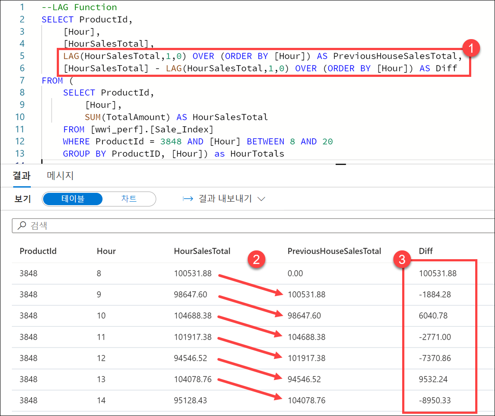

    이 쿼리에서는 **LAG 함수(1)** 를 사용하여 판매량이 가장 많은 시간대(8-20)에 특정 제품의 **판매량 차이(2)** 를 반환합니다. 또한 한 행과 다음 행 **(3)** 의 판매량 차이를 계산합니다. 첫 번째 행의 경우 앞에 나오는 LAG 값이 없으므로 기본값(0)이 반환됩니다.

#### 작업 2.4: ROWS 절

ROWS 및 RANGE 절은 파티션 내에서 시작점과 끝점을 지정하여 파티션 내의 행을 추가로 제한합니다. 이 작업은 논리적 연결이나 물리적 연결을 통해 현재 행을 기준으로 한 행 범위를 지정하여 수행됩니다. 물리적 연결은 ROWS 절을 사용하여 수행됩니다.

Tailwind Traders는 국가별로 다운로드 수가 가장 적은 책을 찾고 국가별로 각 책의 총 다운로드 수를 오름차순으로 표시하려고 합니다.

이를 위해 ROWS를 UNBOUNDED PRECEDING과 함께 사용해 `Country` 파티션 내로 행을 제한하여 창의 시작점을 해당 파티션의 첫 번째 행으로 지정합니다.

1. 쿼리 창에서 스크립트를 다음과 같이 바꿔 집계 함수를 추가합니다.

    ```sql
    -- ROWS UNBOUNDED PRECEDING
    SELECT DISTINCT bc.Country, b.Title AS Book, bc.Downloads
        ,FIRST_VALUE(b.Title) OVER (PARTITION BY Country  
            ORDER BY Downloads ASC ROWS UNBOUNDED PRECEDING) AS FewestDownloads
    FROM dbo.BookConsumption AS bc
    INNER JOIN dbo.Books AS b
        ON b.ID = bc.BookID
    ORDER BY Country, Downloads
    ```

2. 도구 모음 메뉴에서 **실행**을 선택하여 SQL 명령을 실행합니다.

    

    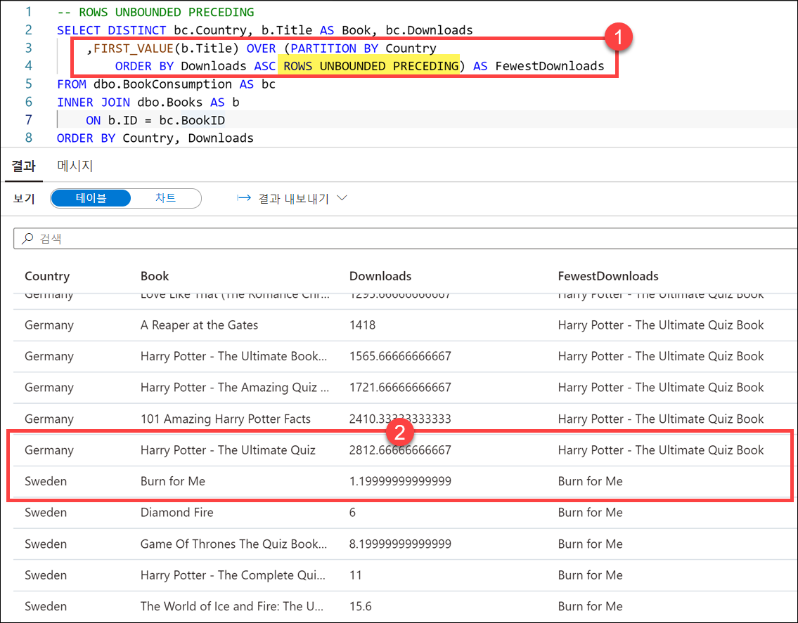

    이 쿼리에서는 `FIRST_VALUE` 분석 함수를 사용하여 `Country` 파티션 **(1)** 에 대한 **`ROWS UNBOUNDED PRECEDING`** 절에서 표시된 것처럼 다운로드 수가 가장 적은 책 제목을 검색합니다. `UNBOUNDED PRECEDING` 옵션은 창의 시작점을 파티션의 첫 번째 행으로 설정하여 해당 파티션에 속하는 국가에서 다운로드 수가 가장 적은 책 제목을 알려 줍니다.

    결과 집합에서 다운로드 수를 기준으로 오름차순으로 정렬된 국가별 책 목록을 스크롤할 수 있습니다. 독일의 경우를 보면 `Fallen Kitten of the Sword - The Ultimate Quiz`가 가장 많이 다운로드되었고 스웨덴 **(2)** 에서는 `Notebooks for Burning`이 가장 적게 다운로드되었습니다.

### 작업 3: HyperLogLog 함수를 사용한 근사 실행

Tailwind Traders는 매우 큰 데이터 집합을 사용하기 시작하면서 쿼리 실행 속도가 느려지고 있습니다. 예를 들어 데이터 탐색의 초기 단계에서 모든 고객의 고유 개수를 가져오면 프로세스가 느려집니다. 쿼리의 속도를 어떻게 높일 수 있을까요?

여러분은 정확도가 소폭 줄어드는 대신 쿼리 대기 시간을 줄이기 위해 HyperLogLog 정확도를 사용하여 근사 실행을 사용하기로 합니다. 이 절충안은 데이터에 대한 감을 익혀야 하는 Tailwind Trader의 상황에 적합합니다.

요구 사항을 이해하기 위해 먼저 대규모의 `Sale_Heap` 테이블에서 고유 개수 계산을 실행하여 고유한 고객 수를 확인해 보겠습니다.

1. 쿼리 창에서 스크립트를 다음과 같이 바꿉니다.

    ```sql
    SELECT COUNT(DISTINCT CustomerId) from wwi_poc.Sale
    ```

2. 도구 모음 메뉴에서 **실행**을 선택하여 SQL 명령을 실행합니다.

    

    쿼리를 실행하려면 50~70초가 걸립니다. 시간이 생각보다 오래 걸리는 이유는 고유 개수 계산은 가장 최적화하기 어려운 쿼리 유형 중 하나이기 때문입니다.

    결과는 `1,000,000`이어야 합니다.

3. 쿼리 창에서 다음과 같이 스크립트를 바꿔 HyperLogLog 접근 방식을 사용합니다.

    ```sql
    SELECT APPROX_COUNT_DISTINCT(CustomerId) from wwi_poc.Sale
    ```

4. 도구 모음 메뉴에서 **실행**을 선택하여 SQL 명령을 실행합니다.

    

    쿼리를 실행하는 데 걸리는 시간이 훨씬 짧아집니다. 그리고 이전에 쿼리를 실행했을 때와는 다른 `1,001,619` 등의 결과가 반환될 수도 있습니다.

    APPROX_COUNT_DISTINCT는 평균적으로 실제 카디널리티의 **2% 정확도**로 결과를 반환합니다.

    즉, COUNT(DISTINCT)가 `1,000,000`을 반환하는 경우 HyperLogLog는 `999,736`에서 `1,016,234` 범위의 값을 반환합니다.

## 연습 2: Azure Synapse Analytics에서 데이터 로드 모범 사례 사용

### 작업 1: 워크로드 관리 구현

혼합된 워크로드를 실행하면 사용량이 많은 시스템에서 리소스 문제가 발생할 수 있습니다. 솔루션 아키텍트는 SLA를 충족하는 데 충분한 리소스가 있도록 하기 위해 클래식 데이터 웨어하우징 작업(예: 데이터 로드, 변환 및 쿼리)을 분리하는 방법을 찾습니다.

Azure Synapse의 전용 SQL 풀용 워크로드 관리에 적용되는 세 가지 대략적인 개념은 워크로드 분류, 워크로드 중요도 및 워크로드 격리입니다. 이러한 기능을 통해 워크로드가 시스템 리소스를 활용하는 방법을 더 효과적으로 제어할 수 있습니다.

워크로드 중요도는 요청에서 리소스에 액세스하는 순서에 영향을 줍니다. 사용량이 많은 시스템에서 중요도가 높은 요청은 리소스에 먼저 액세스할 수 있습니다. 또한 중요도는 잠금에 대한 순차적 액세스를 보장할 수 있습니다.

워크로드 격리는 작업 그룹에 대한 리소스를 예약합니다. 작업 그룹에 예약된 리소스는 실행을 보장하기 위해 해당 작업 그룹 전용으로 유지됩니다. 또한 작업 그룹을 활용하면 리소스 클래스를 사용할 때처럼 요청당 할당되는 리소스의 양도 정의할 수 있습니다. 그리고 특정 요청 집합에서 사용할 수 있는 리소스 양을 예약하거나 상한을 설정할 수도 있습니다. 마지막으로, 작업 그룹은 쿼리 시간 제한과 같은 규칙을 요청에 적용하는 메커니즘입니다.

### 작업 2: 특정 쿼리의 중요도를 높이는 워크로드 분류자 만들기

Tailwind Traders에서 CEO가 실행하는 쿼리의 중요도를 다른 쿼리보다 높게 표시하는 방법이 있는지를 문의해 왔습니다. 대량 데이터 로드 또는 큐의 기타 워크로드로 인해 쿼리 실행 속도가 느려 보이는 상황을 방지하기 위해서라고 합니다. 여러분은 워크로드 분류자를 만들고 중요도를 추가하여 CEO 쿼리의 우선 순위를 지정하기로 결정합니다.

1. **개발** 허브를 선택합니다.

    

2. **개발** 메뉴에서 **+** 단추 **(1)** 를 선택하고 컨텍스트 메뉴에서 **SQL 스크립트(2)** 를 선택합니다.

    

3. 도구 모음 메뉴에서 **SQLPool01** 데이터베이스에 연결하여 쿼리를 실행합니다.

    

4. 쿼리 창에서 스크립트를 다음과 같이 바꿉니다. 이 스크립트는 `asa.sql.workload01`(조직 CEO) 또는 `asa.sql.workload02`(프로젝트 작업 중인 데이터 분석가)로 로그인한 사용자가 현재 실행 중인 쿼리가 없는지를 확인합니다.

    ```sql
    --First, let's confirm that there are no queries currently being run by users logged in workload01 or workload02

    SELECT s.login_name, r.[Status], r.Importance, submit_time, 
    start_time ,s.session_id FROM sys.dm_pdw_exec_sessions s 
    JOIN sys.dm_pdw_exec_requests r ON s.session_id = r.session_id
    WHERE s.login_name IN ('asa.sql.workload01','asa.sql.workload02') and Importance
    is not NULL AND r.[status] in ('Running','Suspended') 
    --and submit_time>dateadd(minute,-2,getdate())
    ORDER BY submit_time ,s.login_name
    ```

5. 도구 모음 메뉴에서 **실행**을 선택하여 SQL 명령을 실행합니다.

    

    실행 중인 쿼리가 없음을 확인했으므로 이제 시스템에 쿼리를 대량으로 전송해 `asa.sql.workload01` 및 `asa.sql.workload02` 사용자의 쿼리 실행 성능이 어떻게 변화하는지를 확인해야 합니다. 이렇게 하려면 쿼리를 트리거하는 Synapse 파이프라인을 실행합니다.

6. **통합** 허브를 선택합니다.

    

7. **Lab 08 - Execute Data Analyst and CEO Queries** 파이프라인 **(1)** 을 선택합니다. 그러면 `asa.sql.workload01` 및 `asa.sql.workload02` 쿼리가 실행/트리거됩니다. **트리거 추가(2)** 와 **지금 트리거(3)** 를 차례로 선택합니다. 표시되는 대화 상자에서 **확인**을 선택합니다.

    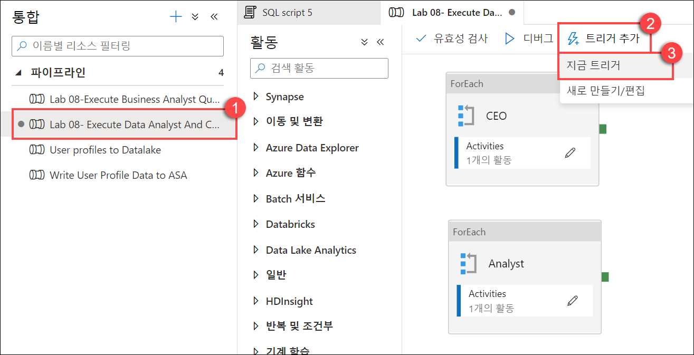

    > **참고**: 뒷부분에서 이 파이프라인을 다시 사용할 것이므로 이 탭을 열어 두세요.

8. 시스템에 쿼리를 대량으로 전송하면 방금 트리거한 모든 쿼리가 어떻게 변경되는지 살펴보겠습니다. 쿼리 창에서 스크립트를 다음과 같이 바꿉니다.

    ```sql
    SELECT s.login_name, r.[Status], r.Importance, submit_time, start_time ,s.session_id FROM sys.dm_pdw_exec_sessions s 
    JOIN sys.dm_pdw_exec_requests r ON s.session_id = r.session_id
    WHERE s.login_name IN ('asa.sql.workload01','asa.sql.workload02') and Importance
    is not NULL AND r.[status] in ('Running','Suspended') and submit_time>dateadd(minute,-2,getdate())
    ORDER BY submit_time ,status
    ```

9. 도구 모음 메뉴에서 **실행**을 선택하여 SQL 명령을 실행합니다.

    

    다음과 유사한 결과가 표시됩니다.

    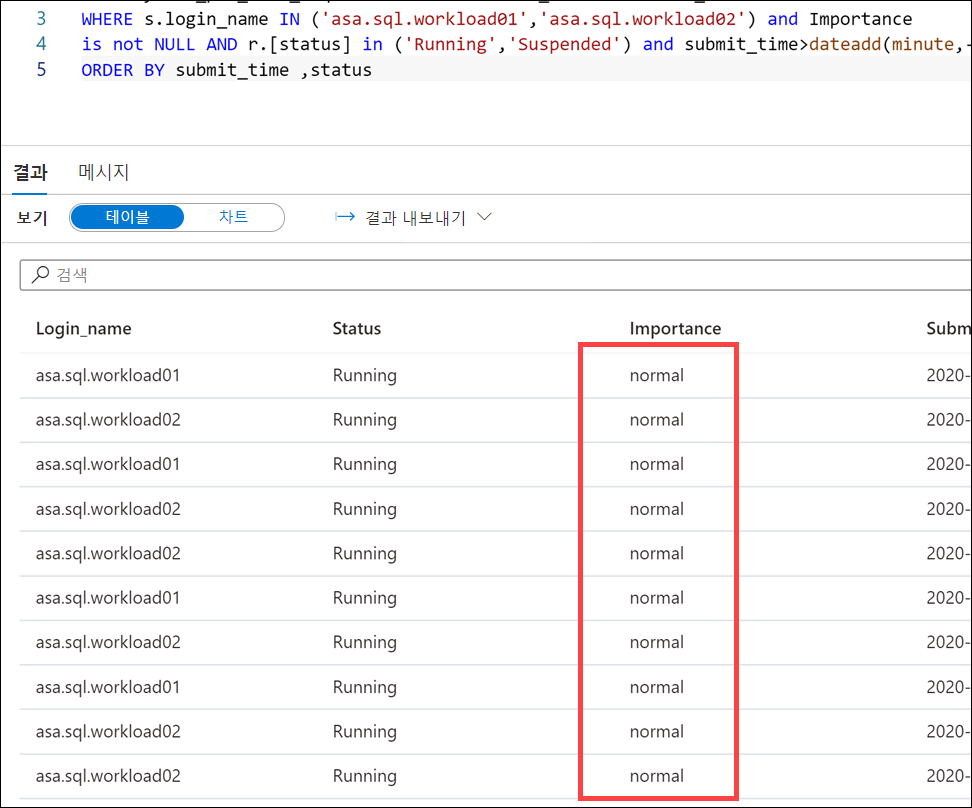

    > **참고**: 이 쿼리를 실행하려면 1분 이상 걸릴 수 있습니다. 실행 시간이 더 오래 걸리면 쿼리를 취소한 후에 다시 실행하세요.

    모든 쿼리의 **Importance** 수준은 **normal**로 설정되어 있습니다.

10. 이제 **워크로드 중요도**기능을 구현하여 `asa.sql.workload01` 사용자 쿼리에 우선 순위를 지정하겠습니다. 쿼리 창에서 스크립트를 다음과 같이 바꿉니다.

    ```sql
    IF EXISTS (SELECT * FROM sys.workload_management_workload_classifiers WHERE name = 'CEO')
    BEGIN
        DROP WORKLOAD CLASSIFIER CEO;
    END
    CREATE WORKLOAD CLASSIFIER CEO
      WITH (WORKLOAD_GROUP = 'largerc'
      ,MEMBERNAME = 'asa.sql.workload01',IMPORTANCE = High);
    ```

    이 스크립트를 실행하면 새 **워크로드 분류자**인 `CEO`가 작성됩니다. 이 분류자는 `largerc` 작업 그룹을 사용하며, 쿼리 **Importance** 수준을 **High**로 설정합니다.

11. 도구 모음 메뉴에서 **실행**을 선택하여 SQL 명령을 실행합니다.

    

12. 다시 시스템에 쿼리를 대량으로 전송하여 이번에는 `asa.sql.workload01` 및 `asa.sql.workload02` 사용자의 쿼리 성능 변화를 확인해 보겠습니다. 이렇게 하려면 쿼리를 트리거하는 Synapse 파이프라인을 실행합니다. `Integrate` 탭을 **선택**하고 **Lab 08 - Execute Data Analyst and CEO Queries** 파이프라인을 **실행**합니다. 그러면 `asa.sql.workload01` 및 `asa.sql.workload02` 쿼리가 실행/트리거됩니다.

13. 쿼리 창에서 스크립트를 다음과 같이 바꿔서 이번에는 `asa.sql.workload01` 쿼리 실행 성능이 어떻게 바뀌는지를 확인합니다.

    ```sql
    SELECT s.login_name, r.[Status], r.Importance, submit_time, start_time ,s.session_id FROM sys.dm_pdw_exec_sessions s 
    JOIN sys.dm_pdw_exec_requests r ON s.session_id = r.session_id
    WHERE s.login_name IN ('asa.sql.workload01','asa.sql.workload02') and Importance
    is not NULL AND r.[status] in ('Running','Suspended') and submit_time>dateadd(minute,-2,getdate())
    ORDER BY submit_time ,status desc
    ```

14. 도구 모음 메뉴에서 **실행**을 선택하여 SQL 명령을 실행합니다.

    

    다음과 유사한 결과가 표시됩니다.

    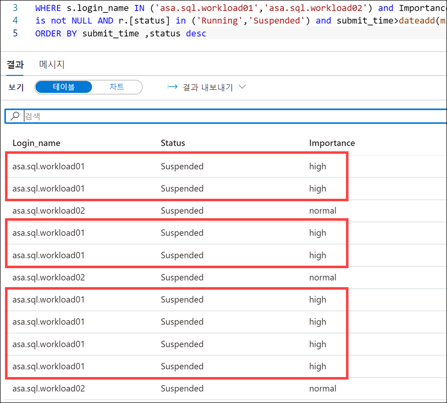

    `asa.sql.workload01` 사용자가 실행한 쿼리의 중요도는 **high**입니다.

15. **모니터** 허브를 선택합니다.

    

16. **파이프라인 실행(1)** 을 선택한 다음 현재 실행 중이며 **진행 중(3)** 으로 표시된 각 랩 08 파이프라인에서 **재귀 취소(2)** 를 선택합니다. 이렇게 하면 나머지 작업 속도를 높일 수 있습니다.

    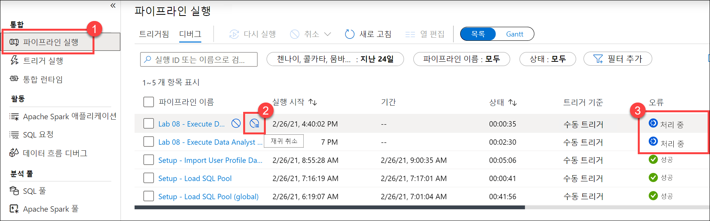

    > **참고**: 위에서 설명한 파이프라인 작업이 실패하더라도 괜찮습니다. 파이프라인 작업은 제한 시간이 2분에 불과하므로, 이 랩에서 실행하는 쿼리가 파이프라인 작업으로 인해 중단되는 현상은 발생하지 않습니다.

### 작업 3: 워크로드 격리를 통해 특정 워크로드에 대한 리소스 예약

워크로드 격리는 작업 그룹 전용으로 리소스가 예약되어 있음을 의미합니다. 작업 그룹은 일련의 요청에 대한 컨테이너이며 시스템에서 워크로드 격리를 포함하여 워크로드 관리를 구성하는 방식의 토대가 됩니다. 간단한 워크로드 관리 구성에서 데이터 로드와 사용자 쿼리를 관리할 수 있습니다.

워크로드 격리가 없으면 요청이 리소스의 공유 풀에서 작동합니다. 공유 풀의 리소스에 대한 액세스는 보장되지 않으며 중요도를 기준으로 할당됩니다.

Tailwind Traders에서 제공한 워크로드 요구 사항을 고려하여 CEO가 실행하는 쿼리용 리소스 예약을 위해 새 작업 그룹 `CEODemo`를 만들기로 했습니다.

여러 매개 변수를 실험하는 것부터 시작하겠습니다.

1. 쿼리 창에서 스크립트를 다음과 같이 바꿉니다.

    ```sql
    IF NOT EXISTS (SELECT * FROM sys.workload_management_workload_groups where name = 'CEODemo')
    BEGIN
        Create WORKLOAD GROUP CEODemo WITH  
        ( MIN_PERCENTAGE_RESOURCE = 50        -- integer value
        ,REQUEST_MIN_RESOURCE_GRANT_PERCENT = 25 --  
        ,CAP_PERCENTAGE_RESOURCE = 100
        )
    END
    ```

    이 스크립트는 작업 그룹 `CEODemo`를 만들어 해당 작업 그룹용으로 리소스를 독점 예약합니다. 이 예에서는 `MIN_PERCENTAGE_RESOURCE`가 50%로 설정되고 `REQUEST_MIN_RESOURCE_GRANT_PERCENT`가 25%로 설정된 작업 그룹을 2개까지 동시 실행할 수 있습니다.

    > **참고**: 이 쿼리를 실행하려면 최대 1분이 걸릴 수 있습니다. 실행 시간이 더 오래 걸리면 쿼리를 취소한 후에 다시 실행하세요.

2. 도구 모음 메뉴에서 **실행**을 선택하여 SQL 명령을 실행합니다.

    

3. 쿼리 창에서 스크립트를 다음과 같이 바꿔서 들어오는 요청에 작업 그룹 및 중요도를 할당하는 워크로드 분류자 `CEODreamDemo`를 만듭니다.

    ```sql
    IF NOT EXISTS (SELECT * FROM sys.workload_management_workload_classifiers where  name = 'CEODreamDemo')
    BEGIN
        Create Workload Classifier CEODreamDemo with
        ( Workload_Group ='CEODemo',MemberName='asa.sql.workload02',IMPORTANCE = BELOW_NORMAL);
    END
    ```

    이 스크립트는 새 `CEODreamDemo` 워크로드 분류자를 통해 `asa.sql.workload02` 사용자의 쿼리 Importance를 **BELOW_NORMAL**로 설정합니다.

4. 도구 모음 메뉴에서 **실행**을 선택하여 SQL 명령을 실행합니다.

    

5. 쿼리 창에서 스크립트를 다음과 같이 바꿔서 `asa.sql.workload02`가 실행 중인 활성 쿼리가 없는지 확인합니다(일시 중단된 쿼리는 있어도 됨).

    ```sql
    SELECT s.login_name, r.[Status], r.Importance, submit_time,
    start_time ,s.session_id FROM sys.dm_pdw_exec_sessions s
    JOIN sys.dm_pdw_exec_requests r ON s.session_id = r.session_id
    WHERE s.login_name IN ('asa.sql.workload02') and Importance
    is not NULL AND r.[status] in ('Running','Suspended')
    ORDER BY submit_time, status
    ```

    > **참고:** 활성 쿼리가 아직 있으면 1~2분 정도 기다립니다. 파이프라인 취소 시에 쿼리도 항상 취소되는 것은 아니므로, 이러한 쿼리는 2분이 지나면 시간 초과 처리되도록 구성되어 있습니다.

6. 도구 모음 메뉴에서 **실행**을 선택하여 SQL 명령을 실행합니다.

    

7. **통합** 허브를 선택합니다.

    

8. **Lab 08 - Execute Business Analyst Queries** 파이프라인 **(1)** 을 선택합니다. 그러면 `asa.sql.workload02` 쿼리가 실행/트리거됩니다. **트리거 추가(2)** 와 **지금 트리거(3)** 를 차례로 선택합니다. 표시되는 대화 상자에서 **확인**을 선택합니다.

    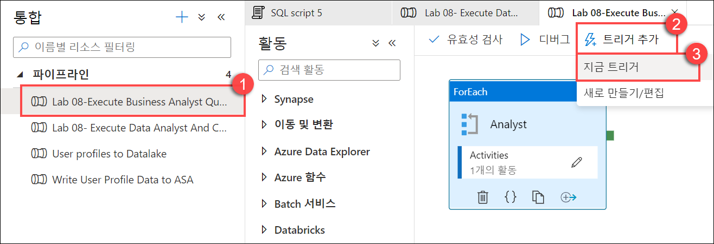

    > **참고**: 뒷부분에서 이 파이프라인을 다시 사용할 것이므로 이 탭을 열어 두세요.

9. 쿼리 창에서 스크립트를 다음과 같이 바꿔 방금 트리거한 모든 `asa.sql.workload02` 쿼리가 시스템에서 대량으로 실행될 때 어떤 결과가 발생했는지 확인합니다.

    ```sql
    SELECT s.login_name, r.[Status], r.Importance, submit_time,
    start_time ,s.session_id FROM sys.dm_pdw_exec_sessions s
    JOIN sys.dm_pdw_exec_requests r ON s.session_id = r.session_id
    WHERE s.login_name IN ('asa.sql.workload02') and Importance
    is not NULL AND r.[status] in ('Running','Suspended')
    ORDER BY submit_time, status
    ```

10. 도구 모음 메뉴에서 **실행**을 선택하여 SQL 명령을 실행합니다.

    

    각 세션의 중요도가 `below_normal`로 설정되었음을 보여 주는 다음과 같은 출력이 표시됩니다.

    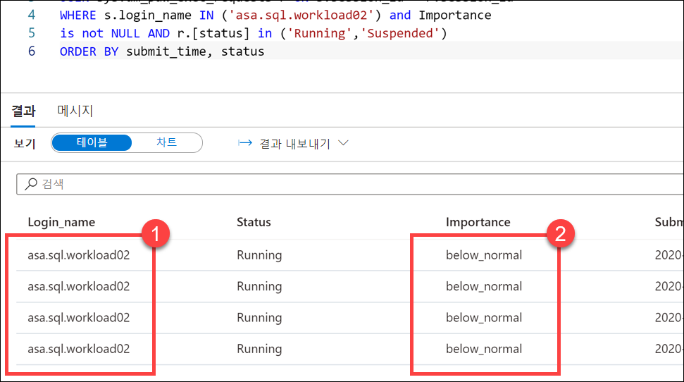

    즉, 실행 중인 스크립트는 Importance 수준이 **below_normal(2)** 인 `asa.sql.workload02` 사용자 **(1)** 가 실행한 것입니다. CEO 쿼리보다 낮은 중요도로 실행되도록 비즈니스 분석가 쿼리를 성공적으로 구성했습니다. 또한 `CEODreamDemo` 워크로드 분류자가 정상적으로 작동함도 확인할 수 있습니다.

11. **모니터** 허브를 선택합니다.

    

12. **파이프라인 실행(1)** 을 선택한 다음 현재 실행 중이며 **진행 중(3)** 으로 표시된 각 랩 08 파이프라인에서 **재귀 취소(2)** 를 선택합니다. 이렇게 하면 나머지 작업 속도를 높일 수 있습니다.

    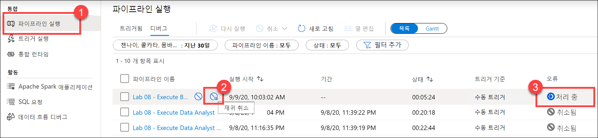

13. **개발** 허브의 쿼리 창으로 돌아갑니다. 쿼리 창에서 스크립트를 다음과 같이 바꿔 요청당 3.25%의 최소 리소스를 설정합니다.

    ```sql
    IF  EXISTS (SELECT * FROM sys.workload_management_workload_classifiers where group_name = 'CEODemo')
    BEGIN
        Drop Workload Classifier CEODreamDemo
        DROP WORKLOAD GROUP CEODemo
    END
    --- Creates a workload group 'CEODemo'.
    Create  WORKLOAD GROUP CEODemo WITH  
    (
        MIN_PERCENTAGE_RESOURCE = 26 -- integer value
        ,REQUEST_MIN_RESOURCE_GRANT_PERCENT = 3.25 -- factor of 26 (guaranteed more than 4 concurrencies)
        ,CAP_PERCENTAGE_RESOURCE = 100
    )
    --- Creates a workload Classifier 'CEODreamDemo'.
    Create Workload Classifier CEODreamDemo with
    (Workload_Group ='CEODemo',MemberName='asa.sql.workload02',IMPORTANCE = BELOW_NORMAL);
    ```

    > **참고**: 이 쿼리 실행 시간이 45초를 초과하면 쿼리를 취소한 후에 다시 실행하세요.

    > **참고**: 워크로드 포함을 구성하면 최대 동시성 수준이 암시적으로 정의됩니다. CAP_PERCENTAGE_RESOURCE가 60%로 설정되고 REQUEST_MIN_RESOURCE_GRANT_PERCENT가 1%로 설정되면 작업 그룹에 대해 최대 60개의 동시성 수준이 허용됩니다. 최대 동시성을 결정하려면 아래에 포함된 방법을 고려해 보세요.
    > 
    > [Max Concurrency] = [CAP_PERCENTAGE_RESOURCE] / [REQUEST_MIN_RESOURCE_GRANT_PERCENT]

14. 도구 모음 메뉴에서 **실행**을 선택하여 SQL 명령을 실행합니다.

    

## 연습 3: Azure Synapse Analytics에서 데이터 웨어하우스 쿼리 성능 최적화

### 작업 1: 테이블 관련 성능 문제 파악

1. **개발** 허브를 선택합니다.

    

2. **개발** 메뉴에서 **+** 단추 **(1)** 를 선택하고 컨텍스트 메뉴에서 **SQL 스크립트(2)** 를 선택합니다.

    

3. 도구 모음 메뉴에서 **SQLPool01** 데이터베이스에 연결하여 쿼리를 실행합니다.

    

4. 쿼리 창에서 스크립트를 다음과 같이 바꿔 힙 테이블의 레코드 수를 계산합니다.

    ```sql
    SELECT  
        COUNT_BIG(*)
    FROM
        [wwi_poc].[Sale]
    ```

5. 도구 모음 메뉴에서 **실행**을 선택하여 SQL 명령을 실행합니다.

    

    스크립트를 실행하려면 최대 **15초**가 걸립니다. 실행이 완료되면 테이블의 행 개수(최대 9억 8,200만 개)가 반환됩니다.

    > 45초 후에도 스크립트가 계속 실행되면 취소를 클릭합니다.

    > **참고**: 이 쿼리를 미리 실행하지 _마세요_. 미리 실행하면 후속 실행 시 쿼리가 더 빠르게 실행될 수 있습니다.

    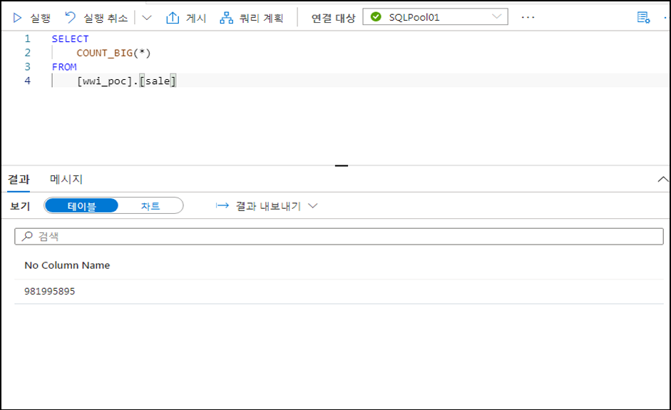

6. 쿼리 창에서 스크립트를 더 복잡한 다음 명령문으로 바꿉니다.

    ```sql
    SELECT TOP 1000 * FROM
    (
        SELECT
            S.CustomerId
            ,SUM(S.TotalAmount) as TotalAmount
        FROM
            [wwi_poc].[Sale] S
        GROUP BY
            S.CustomerId
    ) T
    OPTION (LABEL = 'Lab: Heap')
    ```

7. 도구 모음 메뉴에서 **실행**을 선택하여 SQL 명령을 실행합니다.

    
  
    스크립트를 실행하려면 최대 **60초**가 걸립니다. 실행이 완료되면 결과가 반환됩니다. `Sale_Heap` 테이블의 문제로 인해 성능 저하가 발생함을 확인할 수 있습니다.

    > 90초 후에도 스크립트가 계속 실행되면 취소를 클릭합니다.

    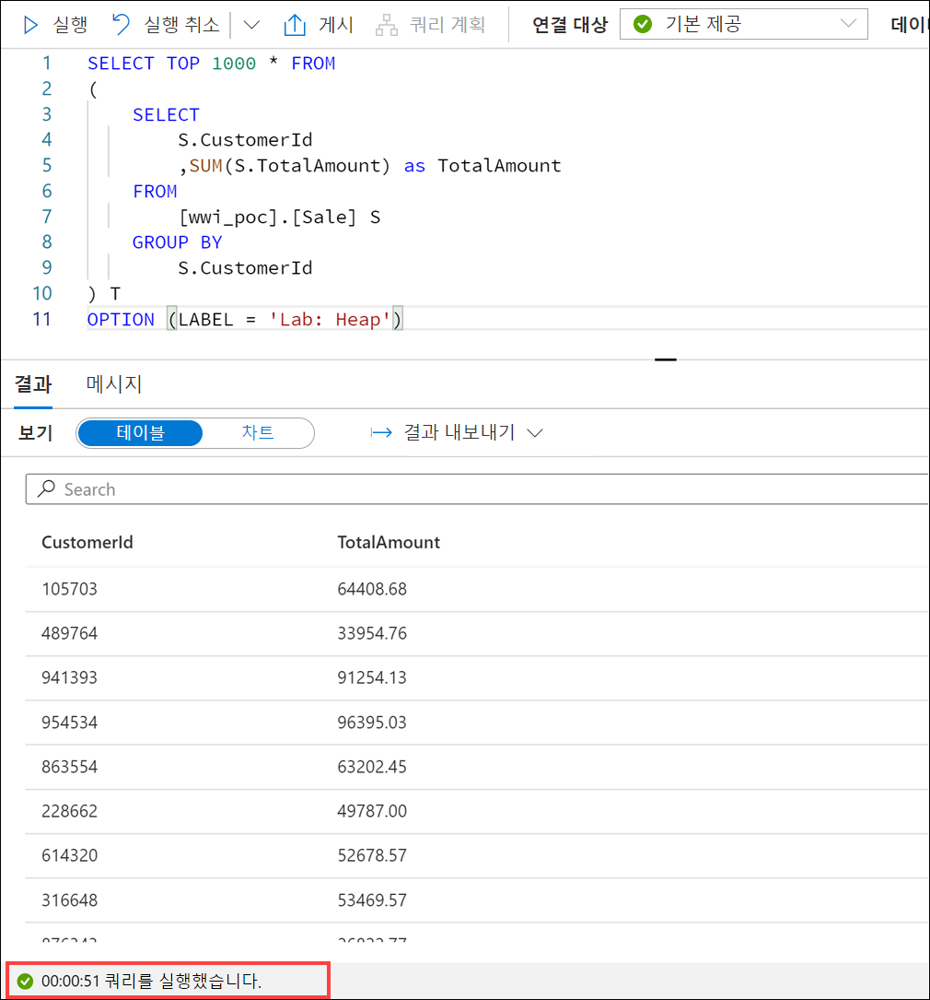

    > 이 문에는 OPTION 절이 사용되었습니다. [sys.dm_pdw_exec_requests](https://docs.microsoft.com/sql/relational-databases/system-dynamic-management-views/sys-dm-pdw-exec-requests-transact-sql) DMV에서 쿼리를 확인하려는 경우 OPTION 절을 사용하면 편리합니다.
    >
    >```sql
    >SELECT  *
    >FROM    sys.dm_pdw_exec_requests
    >WHERE   [label] = 'Lab: Heap';
    >```

8. **데이터** 허브를 선택합니다.

    

9. **SQLPool01** 데이터베이스와 해당 테이블 목록을 확장합니다. **`wwi_poc.Sale`(1)** 을 마우스 오른쪽 단추로 클릭하고 **새 SQL 스크립트(2)** 를 선택한 다음 **CREATE(3)** 를 선택합니다.

    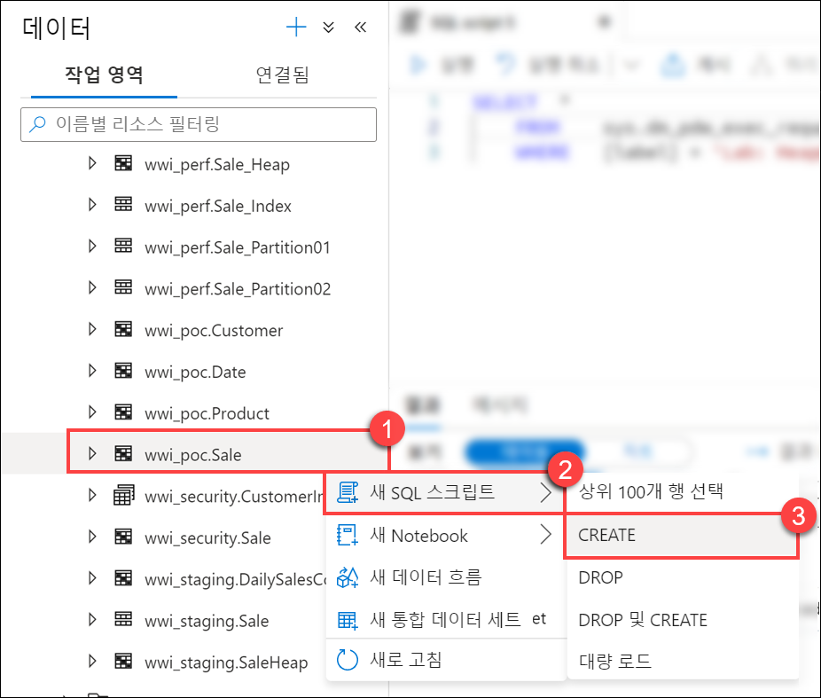

10. 테이블을 만드는 데 사용되는 스크립트를 살펴봅니다.

    ```sql
    CREATE TABLE [wwi_poc].[Sale]
    ( 
        [TransactionId] [uniqueidentifier]  NOT NULL,
        [CustomerId] [int]  NOT NULL,
        [ProductId] [smallint]  NOT NULL,
        [Quantity] [tinyint]  NOT NULL,
        [Price] [decimal](9,2)  NOT NULL,
        [TotalAmount] [decimal](9,2)  NOT NULL,
        [TransactionDateId] [int]  NOT NULL,
        [ProfitAmount] [decimal](9,2)  NOT NULL,
        [Hour] [tinyint]  NOT NULL,
        [Minute] [tinyint]  NOT NULL,
        [StoreId] [smallint]  NOT NULL
    )
    WITH
    (
        DISTRIBUTION = ROUND_ROBIN,
        HEAP
    )
    ```

    > **참고**: 이 스크립트는 실행하지 *마세요*! 스키마를 검토하기 위해 데모 목적으로만 사용됩니다.

    최소한 다음 두 가지 성능 적중 이유를 즉시 발견할 수 있습니다.

    - `ROUND_ROBIN` 배포
    - 테이블의 `HEAP` 구조

    > **참고**
    >
    > 이 경우 빠른 쿼리 응답 시간을 찾고 있다면 힙 구조는 적절한 선택이 아닙니다. 이에 대해서는 잠시 후에 확인하겠습니다. 그러나 힙 테이블 사용 시 성능이 저하되는 대신 향상되는 경우도 있습니다. 전용 SQL 풀과 연결된 SQL 풀에 대량의 데이터를 수집하려는 경우를 예로 들 수 있습니다.

    쿼리 계획을 자세히 검토하면 성능 문제의 근본 원인이 배포 간 데이터 이동임을 명확히 알 수 있습니다.

11. 2단계에서 실행한 것과 같은 스크립트를 실행합니다. 단, 이번에는 해당 스크립트 앞에 `EXPLAIN WITH_RECOMMENDATIONS` 줄을 추가합니다.

    ```sql
    EXPLAIN WITH_RECOMMENDATIONS
    SELECT TOP 1000 * FROM
    (
        SELECT
            S.CustomerId
            ,SUM(S.TotalAmount) as TotalAmount
        FROM
            [wwi_poc].[Sale] S
        GROUP BY
            S.CustomerId
    ) T
    ```

    `EXPLAIN WITH_RECOMMENDATIONS` 절은 Azure Synapse Analytics SQL 문을 실제로 실행하지는 않고 해당 문의 쿼리 계획을 반환합니다. EXPLAIN을 사용하여 데이터 이동이 필요한 작업을 미리 보고 쿼리 작업의 예상 비용을 표시합니다. 기본적으로는 XML 형식 실행 계획이 반환됩니다. 이 계획은 CSV, JSON 등의 다른 형식으로 내보낼 수 있습니다. 도구 모음에서 `Query Plan`을 선택하면 **안 됩니다**. 이렇게 하면 쿼리 계획을 다운로드하여 SQL Server Management Studio에서 여는 과정이 진행되기 때문입니다.

    쿼리를 실행하면 다음과 같은 결과가 반환됩니다.

    ```xml
    <data><row><explain><?xml version="1.0" encoding="utf-8"?>
    <dsql_query number_nodes="4" number_distributions="60" number_distributions_per_node="15">
    <sql>SELECT TOP 1000 * FROM
    (
        SELECT
            S.CustomerId
            ,SUM(S.TotalAmount) as TotalAmount
        FROM
            [wwi_poc].[Sale] S
        GROUP BY
            S.CustomerId
    ) T</sql>
    <materialized_view_candidates>
        <materialized_view_candidates with_constants="False">CREATE MATERIALIZED VIEW View1 WITH (DISTRIBUTION = HASH([Expr0])) AS
    SELECT [S].[CustomerId] AS [Expr0],
        SUM([S].[TotalAmount]) AS [Expr1]
    FROM [wwi_poc].[Sale] [S]
    GROUP BY [S].[CustomerId]</materialized_view_candidates>
    </materialized_view_candidates>
    <dsql_operations total_cost="4.0656044" total_number_operations="5">
        <dsql_operation operation_type="RND_ID">
        <identifier>TEMP_ID_56</identifier>
        </dsql_operation>
        <dsql_operation operation_type="ON">
        <location permanent="false" distribution="AllDistributions" />
        <sql_operations>
            <sql_operation type="statement">CREATE TABLE [qtabledb].[dbo].[TEMP_ID_56] ([CustomerId] INT NOT NULL, [col] DECIMAL(38, 2) NOT NULL ) WITH(DISTRIBUTED_MOVE_FILE='');</sql_operation>
        </sql_operations>
        </dsql_operation>
        <dsql_operation operation_type="SHUFFLE_MOVE">
        <operation_cost cost="4.0656044" accumulative_cost="4.0656044" average_rowsize="13" output_rows="78184.7" GroupNumber="11" />
        <source_statement>SELECT [T1_1].[CustomerId] AS [CustomerId], [T1_1].[col] AS [col] FROM (SELECT SUM([T2_1].[TotalAmount]) AS [col], [T2_1].[CustomerId] AS [CustomerId] FROM [SQLPool01].[wwi_poc].[Sale] AS T2_1 GROUP BY [T2_1].[CustomerId]) AS T1_1
    OPTION (MAXDOP 4, MIN_GRANT_PERCENT = [MIN_GRANT], DISTRIBUTED_MOVE(N''))</source_statement>
        <destination_table>[TEMP_ID_56]</destination_table>
        <shuffle_columns>CustomerId;</shuffle_columns>
        </dsql_operation>
        <dsql_operation operation_type="RETURN">
        <location distribution="AllDistributions" />
        <select>SELECT [T1_1].[CustomerId] AS [CustomerId], [T1_1].[col] AS [col] FROM (SELECT TOP (CAST ((1000) AS BIGINT)) SUM([T2_1].[col]) AS [col], [T2_1].[CustomerId] AS [CustomerId] FROM [qtabledb].[dbo].[TEMP_ID_56] AS T2_1 GROUP BY [T2_1].[CustomerId]) AS T1_1
    OPTION (MAXDOP 4, MIN_GRANT_PERCENT = [MIN_GRANT])</select>
        </dsql_operation>
        <dsql_operation operation_type="ON">
        <location permanent="false" distribution="AllDistributions" />
        <sql_operations>
            <sql_operation type="statement">DROP TABLE [qtabledb].[dbo].[TEMP_ID_56]</sql_operation>
        </sql_operations>
        </dsql_operation>
    </dsql_operations>
    </dsql_query></explain></row></data>
    ```

    MPP 시스템의 내부 레이아웃 세부 정보를 살펴봅니다.

    `<dsql_query number_nodes="4" number_distributions="60" number_distributions_per_node="15">`

    이 레이아웃은 현재 DWU(데이터 웨어하우스 단위) 설정에 따라 적용된 것입니다. 위 예제에 사용된 설정에서는 쿼리가 `DW2000c`에서 실행되었습니다. 즉, 4개 실제 노드가 60개 배포를 처리하므로 실제 노드당 배포 수는 15개입니다. 이 수치는 실제 DWU 설정에 따라 달라집니다.

    쿼리 계획에 따르면, 데이터 이동 작업을 수행해야 합니다. 이 작업은 `SHUFFLE_MOVE` 분산 SQL 작업으로 표시되어 있습니다.

    데이터 이동은 쿼리를 실행하는 동안 분산 테이블의 일부가 다른 노드로 이동하는 작업입니다. 이 작업은 대상 노드에서 데이터를 사용할 수 없는 경우, 가장 일반적으로 테이블이 배포 키를 공유하지 않는 경우에 필요합니다. 가장 일반적인 데이터 이동 작업은 순서 섞기입니다. 순서 섞기 중 각 입력 행에 대해 Synapse는 조인 열을 사용하여 해시 값을 컴퓨팅한 다음, 해당 해시 값을 소유하고 있는 노드에 행을 보냅니다. 조인의 한쪽이나 양쪽 모두 순서 섞기에 참여할 수 있습니다. 아래 다이어그램에는 테이블 T1과 T2 간 조인을 구현하는 순서 섞기가 나와 있으며, 조인 열 col2에는 두 테이블 모두 배포되어 있지 않습니다.

    

    이제 쿼리 계획에서 제공되는 세부 정보를 확인하여 현재 방식의 몇 가지 문제를 파악해 보겠습니다. 쿼리 계획에 언급되어 있는 모든 작업의 설명이 아래 표에 나와 있습니다.

    작업 | 작업 유형 | 설명
    ---|---|---
    1 | RND_ID | 만들 개체를 식별하는 ID입니다. 여기서 만들 개체는 `TEMP_ID_76` 내부 테이블입니다.
    2 | ON | 작업을 수행할 위치(노드 또는 배포)입니다. 값이 `AllDistributions`이면 SQL 풀의 60개 배포 각각에서 작업이 수행됩니다. 즉, SQL 작업(`<sql_operations>`로 지정됨)이 수행되어 `TEMP_ID_76` 테이블이 작성됩니다.
    3 | SHUFFLE_MOVE | 순서 섞기 열 목록에는 `CustomerId`(`<shuffle_columns>`를 통해 지정됨) 열 하나만 포함되어 있습니다. 값은 해시 소유 배포로 분산되어 로컬의 `TEMP_ID_76` 테이블에 저장됩니다. 이 작업에서는 예상 행 수 41265.25(`<operation_cost>`를 통해 지정됨)가 출력됩니다. 동일 섹션에서 확인할 수 있는 평균 결과 행 크기는 13바이트입니다.
    4 | RETURN | 내부 임시 테이블 `TEMP_ID_76`을 쿼리하여 순서 섞기 작업에서 생성된 데이터를 모든 배포에서 수집합니다(`<location>` 참조).
    5 | ON | 모든 배포에서 `TEMP_ID_76`이 삭제됩니다.

    성능 문제의 근본 원인은 배포 간 데이터 이동이라는 것이 명확하게 확인되었습니다. 실제로 순서 섞기가 필요한 데이터 크기가 작다는 점에서 가장 간단한 예제 중 하나입니다. 순서 섞기 행 크기가 커지면 상황이 얼마나 악화될지 짐작할 수 있습니다.

    EXPLAIN 문에서 생성되는 쿼리 계획 구조 관련 정보는 [여기](https://docs.microsoft.com/ko-kr/sql/t-sql/queries/explain-transact-sql?view=azure-sqldw-latest)서 자세히 알아볼 수 있습니다.

12. 이처럼 `EXPLAIN` 문을 사용할 수 있을 뿐 아니라, `sys.dm_pdw_request_steps` DMV를 사용하여 계획 세부 정보를 파악할 수도 있습니다.

    `sys.dm_pdw_exec_requests` DMW를 쿼리하여 쿼리 ID(앞의 6단계에서 실행한 쿼리의 ID)를 확인합니다.

    ```sql
    SELECT  
        *
    FROM    
        sys.dm_pdw_exec_requests
    WHERE   
        [label] = 'Lab: Heap'
    ```

    결과에는 쿼리 ID(`Request_id`), 레이블, 원래 SQL 문 등의 정보가 포함됩니다.

    

13. 쿼리 ID(여기서는 `QID5418`. **실제 본인의 ID로 대체해야 함**)를 검색하고 나면 쿼리의 개별 단계를 조사할 수 있습니다.

    ```sql
    SELECT
       *
    FROM
        sys.dm_pdw_request_steps
    WHERE
        request_id = 'QID5418'
    ORDER BY
       step_index
    ```

    쿼리의 단계(0~4로 인덱싱됨)는 쿼리 계획의 작업 2~6과 일치합니다. 여기서도 쿼리 성능 문제의 원인을 확인할 수 있습니다. 즉, 인덱스가 2인 단계가 파티션 간 데이터 이동 작업입니다. `TOTAL_ELAPSED_TIME` 열을 확인하면 이 단계에서 쿼리 실행 시간이 가장 오래 걸림을 쉽게 파악할 수 있습니다. 다음 쿼리에 사용할 수 있도록 **단계 인덱스를 적어 두세요**.

    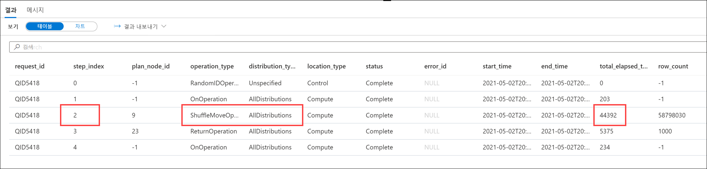

14. 다음 SQL 문을 사용하여 문제의 원인이 되는 단계의 세부 정보를 추가로 확인합니다(`request_id` 및 `step_index`는 실제 ID와 인덱스 값으로 대체).

    ```sql
    SELECT
    *
    FROM
        sys.dm_pdw_sql_requests
    WHERE
        request_id = 'QID5418'
        AND step_index = 2
    ```

    이 문을 실행하면 반환되는 결과에서는 SQL 풀 내의 각 배포에서 발생하는 현상 관련 세부 정보가 제공됩니다.

    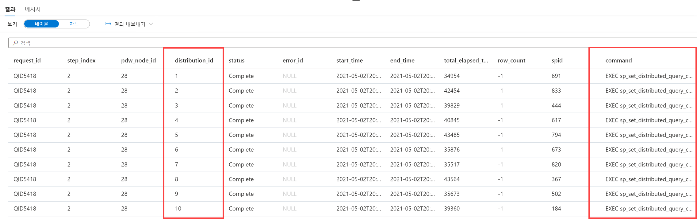

15. 마지막으로, 다음 SQL 문을 사용하면 분산된 데이터베이스에서 수행되는 데이터 이동을 조사할 수 있습니다(`request_id` 및 `step_index`는 실제 ID와 인덱스 값으로 대체).

    ```sql
    SELECT
        *
    FROM
        sys.dm_pdw_dms_workers
    WHERE
        request_id = 'QID5418'
        AND step_index = 2
    ORDER BY
        distribution_id
    ```

    이 문을 실행하면 반환되는 결과에서는 각 배포에서 이동 중인 데이터 관련 세부 정보가 제공됩니다. 여기서는 특히 `ROWS_PROCESSED` 열이 매우 유용한 정보를 제공합니다. 즉, 쿼리 실행 시 수행되는 데이터 이동의 예상 규모를 파악할 수 있습니다.

    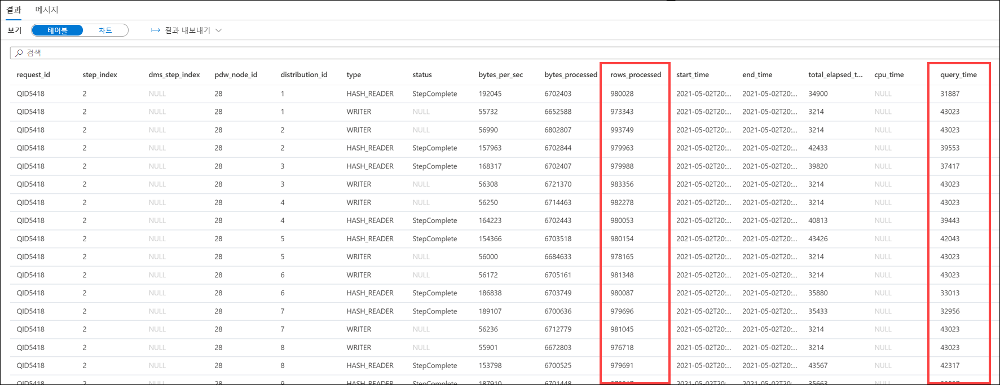

### 작업 2: 해시 배포 및 columnstore 인덱스를 사용하여 테이블 구조 개선

1. **개발** 허브를 선택합니다.

    

2. **개발** 메뉴에서 **+** 단추 **(1)** 를 선택하고 컨텍스트 메뉴에서 **SQL 스크립트(2)** 를 선택합니다.

    

3. 도구 모음 메뉴에서 **SQLPool01** 데이터베이스에 연결하여 쿼리를 실행합니다.

    

4. 쿼리 창에서 스크립트를 다음 코드로 바꿉니다. 이 코드는 CTAS(Create Table As Select)를 사용해 테이블의 개선된 버전을 만듭니다.

     ```sql
    CREATE TABLE [wwi_perf].[Sale_Hash]
    WITH
    (
        DISTRIBUTION = HASH ( [CustomerId] ),
        CLUSTERED COLUMNSTORE INDEX
    )
    AS
    SELECT
        *
    FROM
        [wwi_poc].[Sale]
    ```

5. 도구 모음 메뉴에서 **실행**을 선택하여 SQL 명령을 실행합니다.

    

    쿼리 실행이 완료되려면 **10분** 정도 걸립니다. 쿼리가 실행되는 동안 나머지 랩 지침을 확인하여 해당 내용을 숙지하세요.

    > **참고**
    >
    > CTAS는 SELECT...INTO 문의 한 버전으로, 보다 다양한 사용자 지정이 가능합니다.
    > SELECT...INTO를 사용할 때는 작업의 일환으로 배포 방법이나 인덱스 유형을 변경할 수 없습니다. 기본 배포 유형인 ROUND_ROBIN과 기본 테이블 구조인 CLUSTERED COLUMNSTORE INDEX를 사용하여 새 테이블을 생성합니다.
    >
    > 반면, CTAS를 사용할 때는 테이블 데이터 배포와 테이블 구조 유형을 모두 지정할 수 있습니다.

6. 쿼리 창에서 스크립트를 다음과 같이 바꿔 성능 향상을 확인합니다.

    ```sql
    SELECT TOP 1000 * FROM
    (
        SELECT
            S.CustomerId
            ,SUM(S.TotalAmount) as TotalAmount
        FROM
            [wwi_perf].[Sale_Hash] S
        GROUP BY
            S.CustomerId
    ) T
    ```

7. 도구 모음 메뉴에서 **실행**을 선택하여 SQL 명령을 실행합니다.

    

    힙 테이블에 대해 스크립트를 처음 실행했을 때와 비교하여 새 해시 테이블에 대해 실행할 때 성능이 향상됩니다. 여기서는 약 8초 이내에 쿼리 실행이 완료됩니다.

    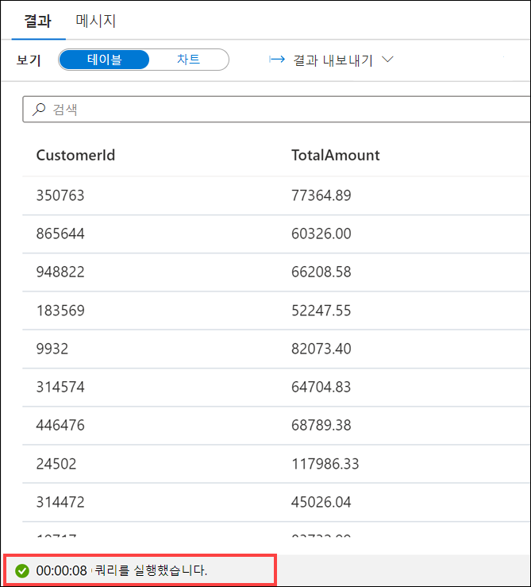

8. 다음 EXPLAIN 문을 다시 실행하여 쿼리 계획을 가져옵니다(도구 모음에서 `Query Plan`을 선택하면 안 됩니다. 이렇게 하면 쿼리 계획을 다운로드하여 SQL Server Management Studio에서 여는 과정이 진행되기 때문입니다).

    ```sql
    EXPLAIN
    SELECT TOP 1000 * FROM
    (
        SELECT
            S.CustomerId
            ,SUM(S.TotalAmount) as TotalAmount
        FROM
            [wwi_perf].[Sale_Hash] S
        GROUP BY
            S.CustomerId
    ) T
    ```

    이번에 반환되는 쿼리 계획은 이전 계획보다 훨씬 개선된 버전입니다. 이 쿼리에서는 배포 간 데이터 이동이 수행되지 않기 때문입니다.

    ```xml
    <data><row><explain><?xml version="1.0" encoding="utf-8"?>
    <dsql_query number_nodes="5" number_distributions="60" number_distributions_per_node="12">
    <sql>SELECT TOP 1000 * FROM
    (
        SELECT
            S.CustomerId
            ,SUM(S.TotalAmount) as TotalAmount
        FROM
            [wwi_perf].[Sale_Hash] S
        GROUP BY
            S.CustomerId
    ) T</sql>
    <dsql_operations total_cost="0" total_number_operations="1">
        <dsql_operation operation_type="RETURN">
        <location distribution="AllDistributions" />
        <select>SELECT [T1_1].[CustomerId] AS [CustomerId], [T1_1].[col] AS [col] FROM (SELECT TOP (CAST ((1000) AS BIGINT)) SUM([T2_1].[TotalAmount]) AS [col], [T2_1].[CustomerId] AS [CustomerId] FROM [SQLPool01].[wwi_perf].[Sale_Hash] AS T2_1 GROUP BY [T2_1].[CustomerId]) AS T1_1
    OPTION (MAXDOP 4)</select>
        </dsql_operation>
    </dsql_operations>
    </dsql_query></explain></row></data>
    ```

9. 더 복잡한 쿼리를 실행하여 실행 계획 및 실행 단계를 조사해 봅니다. 사용 가능한 더 복잡한 쿼리의 예는 다음과 같습니다.

    ```sql
    SELECT
        AVG(TotalProfit) as AvgMonthlyCustomerProfit
    FROM
    (
        SELECT
            S.CustomerId
            ,D.Year
            ,D.Month
            ,SUM(S.TotalAmount) as TotalAmount
            ,AVG(S.TotalAmount) as AvgAmount
            ,SUM(S.ProfitAmount) as TotalProfit
            ,AVG(S.ProfitAmount) as AvgProfit
        FROM
            [wwi_perf].[Sale_Partition01] S
            join [wwi].[Date] D on
                D.DateId = S.TransactionDateId
        GROUP BY
            S.CustomerId
            ,D.Year
            ,D.Month
    ) T
    ```

### 작업 4: 분할을 통해 테이블 구조 추가 개선

테이블 파티션을 사용하면 데이터를 더 작은 데이터 그룹으로 나눌 수 있습니다. 분할은 데이터 유지 관리 및 쿼리 성능에 도움이 될 수 있습니다. 분할이 이러한 두 가지 측면 모두에 효과적인지 아니면 한 가지 측면에만 효과적인지는 데이터의 로드 방식, 동일한 열이 두 가지 용도로 사용될 수 있는지에 따라 좌우됩니다. 분할은 한 열에 대해서만 수행할 수 있기 때문입니다.

일반적으로 배포 수준에서 테이블을 분할하기에 적합한 항목은 날짜 열입니다. Tailwind Traders 영업 데이터의 경우에는 `TransactionDateId` 열을 기준으로 테이블을 분할하면 효율적입니다.

전용 SQL 풀에는 `TransactionDateId`를 사용하여 분할된 `Sale` 테이블의 2개 버전인 `[wwi_perf].[Sale_Partition01]` 및 `[wwi_perf].[Sale_Partition02]`가 이미 포함되어 있습니다. 이 두 테이블을 만드는 데 사용된 CTAS 쿼리가 아래에 나와 있습니다.

1. 쿼리 창에서 스크립트를 파티션 테이블을 만드는 다음 CTAS 쿼리로 바꿉니다(쿼리를 실행하지는 **마세요**).

    ```sql
    CREATE TABLE [wwi_perf].[Sale_Partition01]
    WITH
    (
      DISTRIBUTION = HASH ( [CustomerId] ),
      CLUSTERED COLUMNSTORE INDEX,
      PARTITION
      (
        [TransactionDateId] RANGE RIGHT FOR VALUES (
                20190101, 20190201, 20190301, 20190401, 20190501, 20190601, 20190701, 20190801, 20190901, 20191001, 20191101, 20191201)
      )
    )
    AS
    SELECT
      *
    FROM	
      [wwi_perf].[Sale_Heap]
    OPTION  (LABEL  = 'CTAS : Sale_Partition01')

    CREATE TABLE [wwi_perf].[Sale_Partition02]
    WITH
    (
      DISTRIBUTION = HASH ( [CustomerId] ),
      CLUSTERED COLUMNSTORE INDEX,
      PARTITION
      (
        [TransactionDateId] RANGE RIGHT FOR VALUES (
                20190101, 20190401, 20190701, 20191001)
      )
    )
    AS
    SELECT *
    FROM
        [wwi_perf].[Sale_Heap]
    OPTION  (LABEL  = 'CTAS : Sale_Partition02')
    ```

    > **참고**
    >
    > 이러한 쿼리는 전용 SQL 풀에서 이미 실행된 상태이므로 스크립트를 실행하지는 **마세요**.

여기서는 두 가지 분할 전략, 즉 월 기준 분할 구성표와 분기 기준 분할 구성표 **(3)**.가 사용되었습니다.


#### 작업 4.1: 테이블 배포

앞에서 살펴본 것처럼, 분할된 테이블 2개는 해시 분산 테이블 **(1)** 입니다. 분산 테이블은 단일 테이블로 나타나지만 실제로는 행이 60개의 배포에 저장됩니다. 행은 해시 또는 라운드 로빈 알고리즘으로 분산됩니다.

분산 유형은 다음과 같습니다.

- **라운드 로빈 분산**: 모든 배포에서 테이블 행을 무작위로 균등 분산합니다.
- **해시 분산**: 결정적 해시 함수를 사용하여 각 배포에 행을 하나씩 할당하는 방식으로 전체 컴퓨팅 노드에 테이블 행을 분산합니다.
- **복제**: 각 컴퓨팅 노드에서 테이블의 전체 복사본에 액세스할 수 있습니다.

해시 분산 테이블은 결정적 해시 함수를 사용하여 각 배포에 행을 하나씩 할당하는 방식으로 전체 컴퓨팅 노드에 테이블 행을 분산합니다.

동일한 값은 항상 동일한 배포에 해시하므로 데이터 웨어하우스에는 행 위치에 대한 기본 제공 정보가 있습니다.

전용 SQL 풀은 이 정보를 사용하여 쿼리 중 데이터 이동을 최소화하므로 쿼리 성능이 개선됩니다. 해시 분산 테이블은 별모양 스키마의 큰 팩트 테이블에 적합합니다. 행 수가 매우 많은 경우에도 여전히 높은 성능을 유지할 수 있습니다. 물론 분산 시스템이 제공하도록 디자인된 성능을 얻는 데 도움이 되는 디자인 고려 사항이 있습니다.

*다음 경우 해시 분산 테이블을 사용하는 것이 좋습니다.*

- 디스크의 테이블 크기가 2GB보다 큽니다.
- 테이블에 삽입, 업데이트 및 삭제 작업이 빈번합니다.

#### 작업 4.2: 인덱스

쿼리의 분할된 테이블 2개는 **클러스터형 columnstore 인덱스(2)** 를 사용하여 구성되어 있습니다. 전용 SQL 풀에서는 다음과 같은 여러 인덱스 유형을 사용할 수 있습니다.

- **클러스터형 columnstore 인덱스(기본 주 인덱스)**: 데이터 압축 수준이 가장 높으며 전반적인 쿼리 성능도 가장 우수합니다.
- **클러스터형 인덱스(주 인덱스)**: 열 하나~몇 개를 조회할 때 우수한 성능을 제공합니다.
- **힙(주 인덱스)**: 임시 데이터를 더욱 빠르게 로드 및 랜딩할 수 있습니다. 소형 조회 테이블에 사용하면 가장 효율적입니다.
- **비클러스터형 인덱스(보조 인덱스)**: 테이블에 포함된 여러 열의 순서를 지정할 수 있으며, 테이블 하나에 비클러스터형 인덱스 여러 개를 포함할 수 있습니다. 위에 나와 있는 모든 주 인덱스에서 이러한 보조 인덱스를 만들 수 있습니다. 보조 인덱스를 만들면 조회 쿼리의 성능이 개선됩니다.

기본적으로는 테이블에서 인덱스 옵션이 지정되어 있지 않으면 전용 SQL 풀은 클러스터형 columnstore 인덱스를 만듭니다. 클러스터형 columnstore 테이블은 가장 높은 수준의 데이터 압축 뿐만 아니라 전반적으로 최적의 쿼리 성능을 제공합니다. 그리고 일반적으로 클러스터형 인덱스 또는 힙 테이블보다 나은 성능을 제공하며 대형 테이블에 적합합니다. 이러한 이유로, 클러스터형 columnstore는 테이블 인덱싱 방법을 잘 모를 경우에 시작하기 가장 좋습니다.

다음과 같은 일부 시나리오에서는 클러스터형 columnstore를 사용하는 것이 적합하지 않을 수 있습니다.

- columnstore 테이블은 `varchar(max)`, `nvarchar(max)` 및 `varbinary(max)`를 지원하지 않습니다. 대신 힙 또는 클러스터형 인덱스를 고려합니다.
- Columnstore 테이블이 임시 데이터에 대해 덜 효율적일 수 있습니다. 힙 및 임시 테이블을 고려합니다.
- 1억개 미만의 행이 있는 작은 테이블. 힙 테이블을 고려합니다.

#### 작업 4.3: 분할

이 쿼리에서도 2개 테이블을 다른 방식으로 분할합니다 **(3)**. 그러면 성능 차이를 평가하여 장기적으로 가장 효율적인 분할 전략을 결정할 수 있습니다. 최종 전략은 Tailwind Traders 데이터에 적용되는 다양한 요인에 따라 달라집니다. 가령 쿼리 성능 최적화를 위해 두 테이블을 모두 유지할 수도 있습니다. 하지만 이 경우 데이터 관리를 위한 데이터 저장 및 유지 관리 요구 사항은 두 배로 가중됩니다.

분할은 모든 테이블 유형에서 지원됩니다.

이 쿼리에서 사용하는 **RANGE RIGHT** 옵션 **(3)** 은 시간 파티션용입니다. 그리고 RANGE LEFT는 숫자 파티션용입니다.

테이블을 분할하는 경우의 주요 이점은 다음과 같습니다.

- 쿼리 범위를 데이터 하위 집합으로 제한하여 데이터 로드 및 쿼리 성능과 효율성을 높일 수 있습니다.
- 파티션 키를 기준으로 데이터를 필터링하면 불필요한 검사와 I/O(입/출력 작업)를 방지할 수 있는 경우 쿼리 성능을 대폭 개선할 수 있습니다.

여기서는 적절한 크기를 적용하여 쿼리를 실행해 보기 위해 각기 다른 파티션 전략 **(3)** 을 사용해 테이블 2개를 만들었습니다.

분할을 사용하면 성능을 개선할수는 있지만, 파티션이 너무 많은 테이블을 만들면 성능이 저하되는 경우도 있습니다. 특히 앞에서 만든 클러스터형 columnstore 테이블의 경우에는 성능 저하 현상이 더욱 명확하게 나타납니다. 분할이 도움이 되려면 분할을 사용하는 시기 및 만들려는 파티션 수를 이해하는 것이 중요합니다. '너무 많은 파티션'이 어느 정도인지를 규정하는 명확한 규칙은 없습니다. 즉, 데이터의 형식과 동시에 로드하는 파티션 수에 따라 파티션 수가 너무 많은지 여부가 달라집니다. 성공적인 파티션 구성표에는 일반적으로 수천 개가 아닌 수십 개에서 수백 개의 파티션이 있습니다.

*추가 정보*:

클러스터형 columnstore 테이블에서 파티션을 만들 때는 각 파티션에 포함할 행 수를 고려해야 합니다. 클러스터형 columnstore 테이블에 대한 최적의 압축 및 성능을 고려할 때, 배포 및 파티션당 최소 1백만 개의 행이 필요합니다. 전용 SQL 풀은 파티션을 만들기 전에 각 테이블을 분산 데이터베이스 60개로 나눕니다. 백그라운드에서 생성된 배포 외에, 테이블에 분할이 추가됩니다. 가령 이 예제에서 영업 팩트 테이블의 월별 파티션 수가 36개라면 전용 SQL 풀의 분산 수가 60개이므로 영업 팩트 테이블에는 매월 행 6천만 개가 저장됩니다. 그리고 1~12월에 모두 최대 수의 행을 저장하는 경우 행의 수는 21억 개가 됩니다. 테이블이 파티션당 권장되는 최소 행 수보다 적은 행을 포함하면 파티션당 행 수를 늘리기 위해 더 적은 수의 파티션을 사용할 것을 고려해야 합니다.

## 연습 4: 쿼리 성능 개선

### 작업 1: 구체화된 뷰 사용

표준 뷰와 달리 구체화된 뷰는 테이블처럼 전용 SQL 풀에서 데이터 미리 계산, 저장, 유지 관리를 수행합니다. 아래에는 표준 뷰와 구체화된 뷰의 기본적인 특징을 비교한 정보가 나와 있습니다.

| 비교                     | 뷰                                         | 구체화된 뷰
|:-------------------------------|:---------------------------------------------|:-------------------------------------------------------------|
|뷰 정의                 | Synapse Analytics에 저장됩니다.              | Synapse Analytics에 저장됩니다.
|뷰 콘텐츠                    | 뷰가 사용될 때마다 생성됩니다.   | 뷰를 만드는 과정에서 전처리된 후 Synapse Analytics에 저장됩니다. 데이터가 기본 테이블에 추가되면 업데이트됩니다.
|데이터 새로 고침                    | 항상 업데이트됩니다.                               | 항상 업데이트됩니다.
|복합 쿼리에서 뷰 데이터를 검색하는 속도     | 느림                                         | 빠름  
|추가 스토리지                   | 없음                                           | 있음
|구문                          | CREATE VIEW                                  | CREATE MATERIALIZED VIEW AS SELECT

1. 다음 쿼리를 실행하여 대략적인 실행 시간을 확인합니다.

    ```sql
    SELECT TOP 1000 * FROM
    (
        SELECT
            S.CustomerId
            ,D.Year
            ,D.Quarter
            ,SUM(S.TotalAmount) as TotalAmount
        FROM
            [wwi_perf].[Sale_Partition02] S
            join [wwi].[Date] D on
                S.TransactionDateId = D.DateId
        GROUP BY
            S.CustomerId
            ,D.Year
            ,D.Quarter
    ) T
    ```

2. 다음 쿼리도 실행합니다(위의 쿼리와는 약간 다름).

    ```sql
    SELECT TOP 1000 * FROM
    (
        SELECT
            S.CustomerId
            ,D.Year
            ,D.Month
            ,SUM(S.ProfitAmount) as TotalProfit
        FROM
            [wwi_perf].[Sale_Partition02] S
            join [wwi].[Date] D on
                S.TransactionDateId = D.DateId
        GROUP BY
            S.CustomerId
            ,D.Year
            ,D.Month
    ) T
    ```

3. 위의 두 쿼리를 모두 지원할 수 있는 구체화된 뷰를 만듭니다.

    ```sql
    CREATE MATERIALIZED VIEW
        wwi_perf.mvCustomerSales
    WITH
    (
        DISTRIBUTION = HASH( CustomerId )
    )
    AS
    SELECT
        S.CustomerId
        ,D.Year
        ,D.Quarter
        ,D.Month
        ,SUM(S.TotalAmount) as TotalAmount
        ,SUM(S.ProfitAmount) as TotalProfit
    FROM
        [wwi_perf].[Sale_Partition02] S
        join [wwi].[Date] D on
            S.TransactionDateId = D.DateId
    GROUP BY
        S.CustomerId
        ,D.Year
        ,D.Quarter
        ,D.Month
    ```

4. 다음 쿼리를 실행하여 예상 실행 계획을 가져옵니다(도구 모음에서 `쿼리 계획`을 선택하면 안 됩니다. 이렇게 하면 쿼리 계획을 다운로드하여 SQL Server Management Studio에서 여는 과정이 진행되기 때문입니다).

    ```sql
    EXPLAIN
    SELECT TOP 1000 * FROM
    (
        SELECT
            S.CustomerId
            ,D.Year
            ,D.Quarter
            ,SUM(S.TotalAmount) as TotalAmount
        FROM
            [wwi_perf].[Sale_Partition02] S
            join [wwi].[Date] D on
                S.TransactionDateId = D.DateId
        GROUP BY
            S.CustomerId
            ,D.Year
            ,D.Quarter
    ) T
    ```

    그러면 반환되는 실행 계획에는 새로 만든 구체화된 뷰를 사용하여 실행을 최적화하는 방법이 표시됩니다. `<dsql_operations>` 요소에는 `FROM [SQLPool01].[wwi_perf].[mvCustomerSales]`가 포함되어 있습니다.

    ```xml
    <?xml version="1.0" encoding="utf-8"?>
    <dsql_query number_nodes="5" number_distributions="60" number_distributions_per_node="12">
    <sql>SELECT TOP 1000 * FROM
    (
        SELECT
            S.CustomerId
            ,D.Year
            ,D.Quarter
            ,SUM(S.TotalAmount) as TotalAmount
        FROM
            [wwi_perf].[Sale_Partition02] S
            join [wwi].[Date] D on
                S.TransactionDateId = D.DateId
        GROUP BY
            S.CustomerId
            ,D.Year
            ,D.Quarter
    ) T</sql>
    <dsql_operations total_cost="0" total_number_operations="1">
        <dsql_operation operation_type="RETURN">
        <location distribution="AllDistributions" />
        <select>SELECT [T1_1].[CustomerId] AS [CustomerId], [T1_1].[Year] AS [Year], [T1_1].[Quarter] AS [Quarter], [T1_1].[col] AS [col] FROM (SELECT TOP (CAST ((1000) AS BIGINT)) [T2_1].[CustomerId] AS [CustomerId], [T2_1].[Year] AS [Year], [T2_1].[Quarter] AS [Quarter], [T2_1].[col1] AS [col] FROM (SELECT ISNULL([T3_1].[col1], CONVERT (BIGINT, 0, 0)) AS [col], [T3_1].[CustomerId] AS [CustomerId], [T3_1].[Year] AS [Year], [T3_1].[Quarter] AS [Quarter], [T3_1].[col] AS [col1] FROM (SELECT SUM([T4_1].[TotalAmount]) AS [col], SUM([T4_1].[cb]) AS [col1], [T4_1].[CustomerId] AS [CustomerId], [T4_1].[Year] AS [Year], [T4_1].[Quarter] AS [Quarter] FROM (SELECT [T5_1].[CustomerId] AS [CustomerId], [T5_1].[TotalAmount] AS [TotalAmount], [T5_1].[cb] AS [cb], [T5_1].[Quarter] AS [Quarter], [T5_1].[Year] AS [Year] FROM [SQLPool01].[wwi_perf].[mvCustomerSales] AS T5_1) AS T4_1 GROUP BY [T4_1].[CustomerId], [T4_1].[Year], [T4_1].[Quarter]) AS T3_1) AS T2_1 WHERE ([T2_1].[col] != CAST ((0) AS BIGINT))) AS T1_1
    OPTION (MAXDOP 6)</select>
        </dsql_operation>
    </dsql_operations>
    </dsql_query>
    ```

5. 두 번째 쿼리를 최적화할 때도 같은 구체화된 뷰가 사용됩니다. 다음 쿼리를 실행하여 실행 계획을 가져옵니다.

    ```sql
    EXPLAIN
    SELECT TOP 1000 * FROM
    (
        SELECT
            S.CustomerId
            ,D.Year
            ,D.Month
            ,SUM(S.ProfitAmount) as TotalProfit
        FROM
            [wwi_perf].[Sale_Partition02] S
            join [wwi].[Date] D on
                S.TransactionDateId = D.DateId
        GROUP BY
            S.CustomerId
            ,D.Year
            ,D.Month
    ) T
    ```

    그러면 반환되는 실행 계획에는 같은 구체화된 뷰를 사용하여 실행을 최적화하는 방법이 표시됩니다.

    ```xml
    <?xml version="1.0" encoding="utf-8"?>
    <dsql_query number_nodes="5" number_distributions="60" number_distributions_per_node="12">
    <sql>SELECT TOP 1000 * FROM
    (
        SELECT
            S.CustomerId
            ,D.Year
            ,D.Month
            ,SUM(S.ProfitAmount) as TotalProfit
        FROM
            [wwi_perf].[Sale_Partition02] S
            join [wwi].[Date] D on
                S.TransactionDateId = D.DateId
        GROUP BY
            S.CustomerId
            ,D.Year
            ,D.Month
    ) T</sql>
    <dsql_operations total_cost="0" total_number_operations="1">
        <dsql_operation operation_type="RETURN">
        <location distribution="AllDistributions" />
        <select>SELECT [T1_1].[CustomerId] AS [CustomerId], [T1_1].[Year] AS [Year], [T1_1].[Month] AS [Month], [T1_1].[col] AS [col] FROM (SELECT TOP (CAST ((1000) AS BIGINT)) [T2_1].[CustomerId] AS [CustomerId], [T2_1].[Year] AS [Year], [T2_1].[Month] AS [Month], [T2_1].[col1] AS [col] FROM (SELECT ISNULL([T3_1].[col1], CONVERT (BIGINT, 0, 0)) AS [col], [T3_1].[CustomerId] AS [CustomerId], [T3_1].[Year] AS [Year], [T3_1].[Month] AS [Month], [T3_1].[col] AS [col1] FROM (SELECT SUM([T4_1].[TotalProfit]) AS [col], SUM([T4_1].[cb]) AS [col1], [T4_1].[CustomerId] AS [CustomerId], [T4_1].[Year] AS [Year], [T4_1].[Month] AS [Month] FROM (SELECT [T5_1].[CustomerId] AS [CustomerId], [T5_1].[TotalProfit] AS [TotalProfit], [T5_1].[cb] AS [cb], [T5_1].[Month] AS [Month], [T5_1].[Year] AS [Year] FROM [SQLPool01].[wwi_perf].[mvCustomerSales] AS T5_1) AS T4_1 GROUP BY [T4_1].[CustomerId], [T4_1].[Year], [T4_1].[Month]) AS T3_1) AS T2_1 WHERE ([T2_1].[col] != CAST ((0) AS BIGINT))) AS T1_1
    OPTION (MAXDOP 6)</select>
        </dsql_operation>
    </dsql_operations>
    </dsql_query>
    ```

    >**참고**
    >
    >위의 두 쿼리는 집계 수준이 다르지만, 쿼리 최적화 프로그램은 구체화된 뷰가 사용되었음을 유추할 수 있습니다. 구체화된 뷰에는 집계 수준(`Quarter` 및 `Month`)과 집계 측정값(`TotalAmount` 및 `ProfitAmount`)이 모두 포함되기 때문입니다.

6. 구체화된 뷰 오버헤드를 확인합니다.

    ```sql
    DBCC PDW_SHOWMATERIALIZEDVIEWOVERHEAD ( 'wwi_perf.mvCustomerSales' )
    ```

    반환되는 결과에 따르면 `BASE_VIEW_ROWS`는 `TOTAL_ROWS`와 같습니다(따라서 `OVERHEAD_RATIO`는 1임). 즉, 구체화된 뷰와 기준 뷰가 완벽하게 일치합니다. 하지만 기본 데이터가 변경되기 시작하면 이러한 상태도 바뀝니다.

7. 구체화된 뷰를 작성할 때 기준으로 사용했던 원래 데이터를 업데이트합니다.

    ```sql
    UPDATE
        [wwi_perf].[Sale_Partition02]
    SET
        TotalAmount = TotalAmount * 1.01
        ,ProfitAmount = ProfitAmount * 1.01
    WHERE
        CustomerId BETWEEN 100 and 200
    ```

8. 구체화된 뷰 오버헤드를 다시 확인합니다.

    ```sql
    DBCC PDW_SHOWMATERIALIZEDVIEWOVERHEAD ( 'wwi_perf.mvCustomerSales' )
    ```

    

    이제 구체화된 뷰에서 델타를 저장했으므로 `TOTAL_ROWS`가 `BASE_VIEW_ROWS`보다 커졌으며, 따라서 `OVERHEAD_RATIO`도 1보다 커졌습니다.

9. 구체화된 뷰를 다시 작성하여 오버헤드 비율이 1로 돌아갔는지 확인합니다.

    ```sql
    ALTER MATERIALIZED VIEW [wwi_perf].[mvCustomerSales] REBUILD

    DBCC PDW_SHOWMATERIALIZEDVIEWOVERHEAD ( 'wwi_perf.mvCustomerSales' )
    ```

    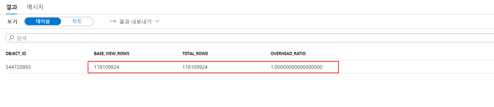

### 작업 2: 결과 집합 캐싱 사용

Tailwind Trader에서는 많은 사용자가 다운스트림 보고서를 사용합니다. 따라서 자주 변경되지 않는 데이터를 대상으로 같은 쿼리를 반복 실행하는 경우가 많습니다. 그러므로 이러한 쿼리 유형의 성능을 개선하기 위해 수행할 수 있는 작업을 파악해야 합니다. 그리고 기본 데이터가 변경되면 이러한 쿼리는 어떤 방식으로 작동하는지도 파악해야 합니다.

이러한 상황에서 Tailwind Trader가 고려할 수 있는 옵션은 결과 집합 캐싱입니다.

즉, 전용 Azure Synapse SQL 풀 스토리지에 쿼리 결과를 캐시하는 것입니다. 이렇게 하면 데이터가 자주 변경되지 않는 테이블에 반복되는 쿼리에 대화형 응답 시간을 사용할 수 있습니다.

> 전용 SQL 풀을 일시 중지했다가 나중에 다시 시작해도 결과 집합 캐시는 그대로 보존됩니다.

하지만 기본 테이블 데이터 또는 쿼리 코드가 변경되면 쿼리 캐시는 무효화 및 갱신됩니다.

결과 캐시는 TLRU(시간 인식 오래 전에 사용한 항목) 알고리즘에 따라 정기적으로 제거됩니다.

1. 쿼리 창에서 스크립트를 다움 코드로 바꿔 현재 전용 SQL 풀에서 결과 집합 캐싱이 설정되어 있는지 확인합니다.

    ```sql
    SELECT
        name
        ,is_result_set_caching_on
    FROM
        sys.databases
    ```

2. 도구 모음 메뉴에서 **실행**을 선택하여 SQL 명령을 실행합니다.

    

    쿼리 출력에서 **SQLPool01**의 `is_result_set_caching_on` 값을 확인합니다. 여기서는 해당 값이 `False`로 설정되어 있습니다. 즉, 결과 집합 캐싱이 현재 사용하지 않도록 설정되어 있습니다.

    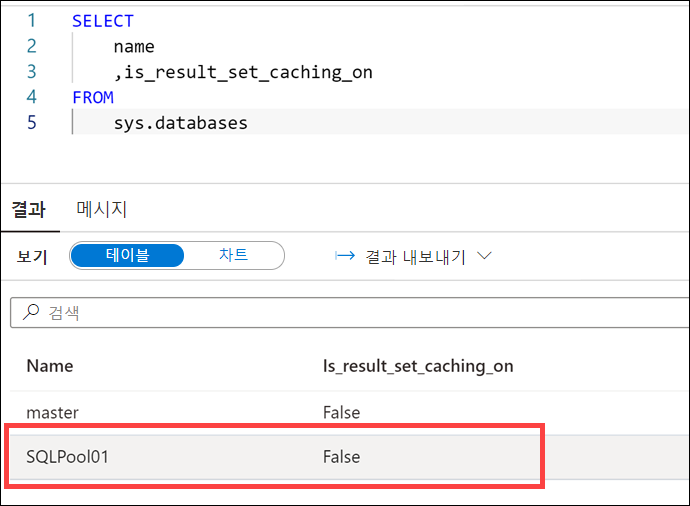

3. 쿼리 창에서 데이터베이스를 **master(1)** 로 변경하고 스크립트 **(2)** 를 다음 코드로 바꿔 결과 집합 캐싱을 활성화합니다.

    ```sql
    ALTER DATABASE SQLPool01
    SET RESULT_SET_CACHING ON
    ```

    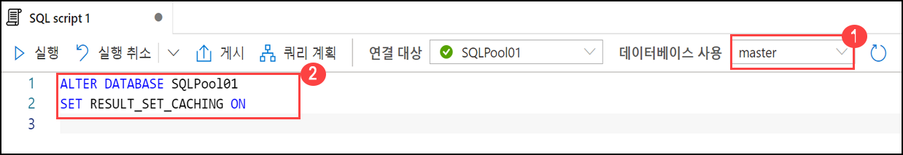

4. 도구 모음 메뉴에서 **실행**을 선택하여 SQL 명령을 실행합니다.

    

    > **중요**
    >
    > 결과 집합 캐시를 만들고 캐시에서 데이터를 검색하는 작업은 전용 SQL 풀 인스턴스의 제어 노드에서 수행됩니다. 결과 집합 캐싱을 설정한 상태에서 쿼리를 실행하여 큰 결과 집합(예: 1GB를 초과하는 결과)이 반환되는 경우 제어 노드의 제한이 높아지며 인스턴스의 전반적인 쿼리 응답 속도가 느려질 수 있습니다. 이러한 쿼리는 일반적으로 데이터 탐색 또는 ETL 작업 중에 사용됩니다. 컨트롤 노드의 스트레스를 방지하고 성능 문제가 발생하는 것을 방지하려면 사용자는 해당 유형의 쿼리를 실행하기 전에 데이터베이스에서 결과 집합 캐싱을 해제해야 합니다.

5. 다음 쿼리를 실행할 수 있도록 도구 모음 메뉴에서 **SQLPool01** 데이터베이스에 연결합니다.

    

6. 쿼리 창에서 스크립트를 다음 쿼리로 바꿔 캐시 적중 여부를 즉시 확인합니다.

    ```sql
    SELECT
        D.Year
        ,D.Quarter
        ,D.Month
        ,SUM(S.TotalAmount) as TotalAmount
        ,SUM(S.ProfitAmount) as TotalProfit
    FROM
        [wwi_perf].[Sale_Partition02] S
        join [wwi].[Date] D on
            S.TransactionDateId = D.DateId
    GROUP BY
        D.Year
        ,D.Quarter
        ,D.Month
    OPTION (LABEL = 'Lab: Result set caching')

    SELECT
        result_cache_hit
    FROM
        sys.dm_pdw_exec_requests
    WHERE
        request_id =
        (
            SELECT TOP 1
                request_id
            FROM
                sys.dm_pdw_exec_requests
            WHERE
                [label] = 'Lab: Result set caching'
            ORDER BY
                start_time desc
        )
    ```

7. 도구 모음 메뉴에서 **실행**을 선택하여 SQL 명령을 실행합니다.

    

    예상대로  **`False`(0)** 결과가 반환됩니다.

    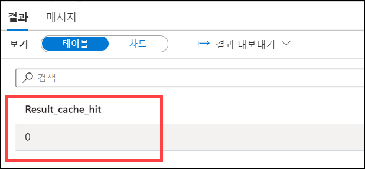

    그러나 쿼리 실행 중에 전용 SQL 풀이 결과 집합도 캐시했음을 확인할 수 있습니다.

8. 쿼리 창에서 스크립트를 다음 코드로 바꿔 실행 단계를 가져옵니다.

    ```sql
    SELECT
        step_index
        ,operation_type
        ,location_type
        ,status
        ,total_elapsed_time
        ,command
    FROM
        sys.dm_pdw_request_steps
    WHERE
        request_id =
        (
            SELECT TOP 1
                request_id
            FROM
                sys.dm_pdw_exec_requests
            WHERE
                [label] = 'Lab: Result set caching'
            ORDER BY
                start_time desc
        )
    ```

9. 도구 모음 메뉴에서 **실행**을 선택하여 SQL 명령을 실행합니다.

    

    실행 단계에 결과 집합 캐시가 작성되었음이 표시됩니다.

    

    사용자 세션 수준에서 결과 집합 캐시 사용을 제어할 수 있습니다.

10. 쿼리 창에서 스크립트를 다음 코드로 바꿔 결과 캐시를 비활성화했다가 다시 활성화합니다.

    ```sql  
    SET RESULT_SET_CACHING OFF

    SELECT
        D.Year
        ,D.Quarter
        ,D.Month
        ,SUM(S.TotalAmount) as TotalAmount
        ,SUM(S.ProfitAmount) as TotalProfit
    FROM
        [wwi_perf].[Sale_Partition02] S
        join [wwi].[Date] D on
            S.TransactionDateId = D.DateId
    GROUP BY
        D.Year
        ,D.Quarter
        ,D.Month
    OPTION (LABEL = 'Lab: Result set caching off')

    SET RESULT_SET_CACHING ON

    SELECT
        D.Year
        ,D.Quarter
        ,D.Month
        ,SUM(S.TotalAmount) as TotalAmount
        ,SUM(S.ProfitAmount) as TotalProfit
    FROM
        [wwi_perf].[Sale_Partition02] S
        join [wwi].[Date] D on
            S.TransactionDateId = D.DateId
    GROUP BY
        D.Year
        ,D.Quarter
        ,D.Month
    OPTION (LABEL = 'Lab: Result set caching on')

    SELECT TOP 2
        request_id
        ,[label]
        ,result_cache_hit
    FROM
        sys.dm_pdw_exec_requests
    WHERE
        [label] in ('Lab: Result set caching off', 'Lab: Result set caching on')
    ORDER BY
        start_time desc
    ```

11. 도구 모음 메뉴에서 **실행**을 선택하여 SQL 명령을 실행합니다.

    

    위 스크립트의 결과인 **`SET RESULT_SET_CACHING OFF`** 는 캐시 적중 테스트 결과에 표시됩니다(캐시 적중 시 `result_cache_hit` 열에서 `1`이, 캐시 누락 시 `0`이 반환되며 결과 집합 캐싱이 사용되지 않은 이유를 나타내는 *음수 값*이 함께 반환됨).

    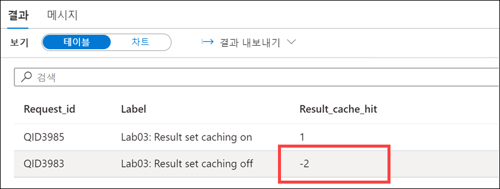

12. 쿼리 창에서 스크립트를 다음 코드로 바꿔 결과 캐시에 사용되는 공간을 확인합니다.

    ```sql
    DBCC SHOWRESULTCACHESPACEUSED
    ```

13. 도구 모음 메뉴에서 **실행**을 선택하여 SQL 명령을 실행합니다.

    

    쿼리 결과에서는 예약된 공간의 양, 데이터가 사용하는 공간, 인덱스에 사용되는 공간, 그리고 결과 캐시에 사용 가능한 미사용 공간의 양을 확인할 수 있습니다.

    

14. 쿼리 창에서 스크립트를 다음 코드로 바꿔 결과 집합 캐시를 지웁니다.

    ```sql
    DBCC DROPRESULTSETCACHE
    ```

15. 도구 모음 메뉴에서 **실행**을 선택하여 SQL 명령을 실행합니다.

    

16. 쿼리 창에서 데이터베이스를 **master(1)** 로 변경하고 스크립트 **(2)** 를 다음 코드로 바꿔 결과 집합 캐싱을 사용하지 않도록 설정합니다.

    ```sql
    ALTER DATABASE SQLPool01
    SET RESULT_SET_CACHING OFF
    ```

    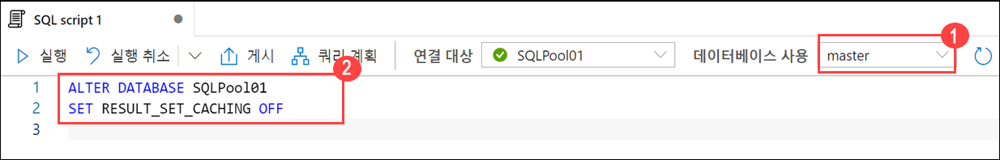

17. 도구 모음 메뉴에서 **실행**을 선택하여 SQL 명령을 실행합니다.

    

    > **참고**
    >
    > 전용 SQL 풀에서 결과 집합 캐싱을 사용하지 않도록 설정해야 합니다. 이렇게 하지 않으면 데모의 나머지 작업을 수행할 때 실행 시간이 일치하지 않아 작업 효율성이 떨어지며, 이후 진행할 여러 연습을 원래 목적대로 완료할 수 없게 됩니다.

    결과 세트 캐시의 최대 크기는 데이터베이스당 1TB입니다. 기본 쿼리 데이터가 변경되면 캐시된 결과가 자동으로 무효화됩니다.

    캐시 제거는 다음 일정에 따라 전용 SQL 풀에서 자동으로 관리됩니다.

    - 결과 세트가 사용되지 않았거나 무효화된 경우 48시간 간격으로
    - 결과 세트 캐시가 최대 크기에 가까워질 때

    다음 옵션 중 하나를 사용하여 전체 결과 세트 캐시를 수동으로 비울 수 있습니다.

    - 데이터베이스에 대한 결과 집합 캐시 기능을 해제
    - 데이터베이스에 연결된 상태에서 DBCC DROPRESULTSETCACHE 실행

    데이터베이스를 일시 중지해도 캐시된 결과 집합은 비워지지 않습니다.

### 작업 3: 통계 만들기 및 업데이트

전용 SQL 풀 리소스는 데이터 관련 정보를 많이 파악할수록 쿼리를 더 빠르게 실행할 수 있습니다. 전용 SQL 풀에 데이터를 로드한 후 쿼리 최적화를 위해 수행할 수 있는 가장 중요한 작업 중 하나는 데이터 관련 통계를 수집하는 것입니다.

전용 SQL 풀 쿼리 최적화 프로그램은 비용을 기준으로 작동합니다. 즉, 다양한 쿼리 계획의 비용을 비교한 다음 비용이 가장 낮은 계획을 선택합니다. 선택된 계획은 대부분의 경우 가장 빠르게 실행되는 계획입니다.

예를 들어 최적화 프로그램은 쿼리에서 필터링 기준으로 특정 날짜를 사용할 때 행 하나가 반환된다고 예측하는 경우와 행 1백만 개가 반환된다고 예측하는 경우에 각기 다른 계획을 반환합니다.

1. 데이터베이스에서 통계가 자동 작성되도록 설정되어 있는지 확인합니다.

    ```sql
    SELECT name, is_auto_create_stats_on
    FROM sys.databases
    ```

2. 자동 작성된 통계를 확인합니다(데이터베이스는 전용 SQL 풀로 다시 변경해야 함).

    ```sql
    SELECT
        *
    FROM
        sys.dm_pdw_exec_requests
    WHERE
        Command like 'CREATE STATISTICS%'
    ```

    자동 작성된 통계에는 특수 이름 패턴이 사용됩니다.

    

3. `wwi_perf.Sale_Has` 테이블의 `CustomerId`용으로 작성된 통계가 있는지 확인합니다.

    ```sql
    DBCC SHOW_STATISTICS ('wwi_perf.Sale_Hash', CustomerId) WITH HISTOGRAM
    ```

    `CustomerId` 관련 통계는 없다는 오류가 표시됩니다.

4. `CustomerId`용 통계를 만듭니다.

    ```sql
    CREATE STATISTICS Sale_Hash_CustomerId ON wwi_perf.Sale_Hash (CustomerId)
    ```

    새로 작성된 통계를 표시합니다.

    ```sql
    DBCC SHOW_STATISTICS([wwi_perf.Sale_Hash], 'Sale_Hash_CustomerId')
    ```

    결과 창에서 `Chart` 표시로 전환하여 다음과 같이 속성을 구성합니다.

    - **차트 유형**: 영역
    - **범주 열**: RANGE_HI_KEY
    - **범례(계열) 열**: RANGE_ROWS

    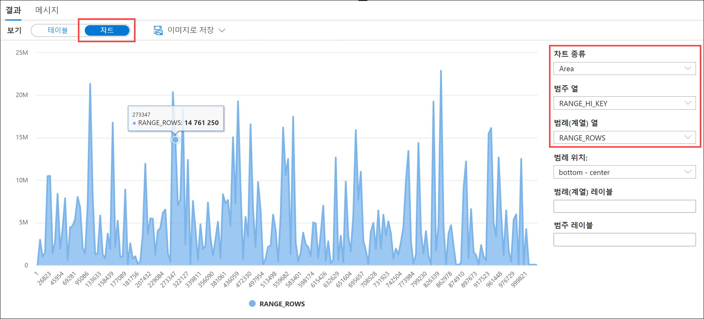

    그러면 `CustomerId` 열에 사용하기 위해 작성한 통계가 표시됩니다.

    >**중요**
    >
    >SQL 풀은 데이터 관련 정보를 많이 파악할수록 해당 데이터를 대상으로 쿼리를 더 빠르게 실행할 수 있습니다. SQL 풀에 데이터를 로드한 후 쿼리 최적화를 위해 수행할 수 있는 가장 중요한 작업 중 하나는 데이터 관련 통계를 수집하는 것입니다.
    >
    >SQL 풀 쿼리 최적화 프로그램은 비용을 기준으로 작동합니다. 즉, 다양한 쿼리 계획의 비용을 비교한 다음 비용이 가장 낮은 계획을 선택합니다. 선택된 계획은 대부분의 경우 가장 빠르게 실행되는 계획입니다.
    >
    >예를 들어 최적화 프로그램은 쿼리에서 필터링 기준으로 특정 날짜를 사용할 때 행 하나가 반환된다고 예측하는 경우와 행 1백만 개가 반환된다고 예측하는 경우에 각기 다른 계획을 반환합니다.

### 작업 4: 인덱스 만들기 및 업데이트

클러스터형 columnstore 인덱스, 힙, 클러스터형 인덱스와 비클러스터형 인덱스 비교

클러스터형 인덱스는 단일 행을 빠르게 검색해야 하는 경우 클러스터형 columnstore 인덱스보다 더 나은 성능을 제공할 수 있습니다. 하나 또는 매우 적은 수의 행을 아주 빠른 속도로 쿼리해야 하는 경우 클러스터 인덱스 또는 비클러스터형 보조 인덱스를 고려합니다. 클러스터형 인덱스를 사용할 때의 단점은 클러스터형 인덱스 열에 고도의 선택 필터를 사용하는 쿼리에만 도움이 된다는 것입니다. 다른 열에 대한 필터를 향상시키기 위해 비클러스터형 인덱스를 다른 열에 추가할 수 있습니다. 그러나 테이블에 각 인덱스가 추가될 때마다 차지하는 공간이 늘어나고 로드 처리 시간도 늘어납니다.

1. 다음 쿼리를 실행하여 CCI를 사용하는 테이블에서 고객 한 명에 대한 정보를 검색합니다.

    ```sql
    SELECT
        *
    FROM
        [wwi_perf].[Sale_Hash]
    WHERE
        CustomerId = 500000
    ```

    위 쿼리의 실행 시간을 적어 둡니다.

2. 다음 쿼리를 실행하여 클러스터형 인덱스를 사용하는 테이블에서 고객 한 명에 대한 정보를 검색합니다.

    ```sql
    SELECT
        *
    FROM
        [wwi_perf].[Sale_Index]
    WHERE
        CustomerId = 500000
    ```

    이 쿼리의 실행 시간은 이전 쿼리의 실행 시간과 비슷합니다. 선택 기준이 매우 세부적인 쿼리를 실행하는 시나리오에서는 클러스터형 columnstore 인덱스를 사용해도 클러스터형 인덱스에 비해 큰 이점이 없습니다.

3. 다음 쿼리를 실행하여 CCI를 사용하는 테이블에서 고객 여러 명에 대한 정보를 검색합니다.

    ```sql
    SELECT
        *
    FROM
        [wwi_perf].[Sale_Hash]
    WHERE
        CustomerId between 400000 and 400100
    ```

    그런 다음 클러스터형 인덱스를 사용하는 테이블에서 같은 정보를 검색합니다.

    ```sql
    SELECT
        *
    FROM
        [wwi_perf].[Sale_Index]
    WHERE
        CustomerId between 400000 and 400100
    ```

    실행 시간이 일정해질 때까지 두 쿼리를 모두 여러 번 실행합니다. 정상 상태에서는 고객 수가 비교적 적더라도 일정 시점이 되면 CCI 테이블이 클러스터형 인덱스 테이블보다 더 정확한 결과를 반환하기 시작합니다.

4. 이제 쿼리에 `StoreId` 열을 참조하는 조건을 더 추가합니다.

    ```sql
    SELECT
        *
    FROM
        [wwi_perf].[Sale_Index]
    WHERE
        CustomerId between 400000 and 400100
        and StoreId between 2000 and 4000
    ```

    위 쿼리의 실행 시간을 적어 둡니다.

5. `StoreId` 열에 비클러스터형 인덱스를 만듭니다.

    ```sql
    CREATE INDEX Store_Index on wwi_perf.Sale_Index (StoreId)
    ```

    인덱스 만들기는 몇 분 내에 완료됩니다. 인덱스가 작성되면 이전 쿼리를 다시 실행합니다. 새로 만든 비클러스터형 인덱스로 인해 실행 시간이 단축되었음을 확인할 수 있습니다.

    >**참고**
    >
    >`wwi_perf.Sale_Index`에서는 기존 클러스터형 인덱스를 기준으로 비클러스터형 인덱스를 만듭니다. 추가 연습으로 `wwi_perf.Sale_Hash` 테이블에서도 동일 유형의 인덱스를 만들어 보고 인덱스 작성 시간의 차이를 확인합니다.

### 작업 5: 순서가 지정된 클러스터형 ColumnStore 인덱스

인덱스 옵션을 사용하지 않고 만드는 각 테이블에서는 기본적으로 내부 구성 요소(인덱스 작성기)가 해당 테이블에 순서가 지정되지 않은 CCI(클러스터형 columnstore 인덱스)를 만듭니다. 각 열의 데이터는 별도의 CCI 행 그룹 세그먼트에 압축됩니다. 각 세그먼트의 값 범위에는 메타데이터가 포함되어 있으므로 쿼리 실행 과정에서는 쿼리 조건자 경계 외부의 세그먼트를 디스크에서 읽지 않습니다. CCI 사용 시에는 데이터를 최고 수준으로 압축할 수 있으므로. 읽어야 하는 세그먼트 크기가 작아져 쿼리를 더 빠르게 실행할 수 있습니다. 그러나 인덱스 작성기는 데이터를 세그먼트로 압축하기 전에 정렬하지 않으므로 여러 세그먼트의 값 범위가 겹칠 수 있습니다. 그러면 쿼리가 디스크에서 더 많은 세그먼트를 읽어야 하므로 쿼리 실행이 완료될 때까지 시간이 더 오래 걸립니다.

순서가 지정된 CCI를 만들 때는 Synapse SQL 엔진이 순서 키를 기준으로 메모리의 기존 데이터를 정렬합니다. 그리고 나면 인덱스 작성기가 데이터를 인덱스 세그먼트로 압축합니다. 이처럼 데이터가 정렬되므로 값 범위가 겹치는 세그먼트 수가 줄어듭니다. 그러면 쿼리는 불필요한 세그먼트를 더욱 효율적으로 제거할 수 있으며, 디스크에서 읽어야 하는 세그먼트 수가 감소하므로 쿼리 성능이 개선됩니다. 메모리에서 모든 데이터를 한꺼번에 정렬할 수 있다면 세그먼트 겹침 현상도 방지할 수 있습니다. 하지만 데이터 웨어하우스에는 큰 테이블이 많기 때문에 이러한 정렬을 수행하기가 어려운 경우가 많습니다.

순서가 지정된 CCI를 만들면 일반적으로 더 빠르게 실행되는 쿼리 패턴은 다음과 같습니다.

- 같음, 같지 않음, 범위 조건자가 포함된 쿼리
- 조건자 열과 순서가 지정된 CCI 열이 동일한 쿼리
- 조건자 열이 순서가 지정된 CCI 열의 열 서수와 같은 순서로 사용되는 쿼리

1. 다음 쿼리를 실행하여 `Sale_Hash` 테이블에서 겹치는 세그먼트를 표시합니다.

    ```sql
    select
        OBJ.name as table_name
        ,COL.name as column_name
        ,NT.distribution_id
        ,NP.partition_id
        ,NP.rows as partition_rows
        ,NP.data_compression_desc
        ,NCSS.segment_id
        ,NCSS.version
        ,NCSS.min_data_id
        ,NCSS.max_data_id
        ,NCSS.row_count
    from
        sys.objects OBJ
        JOIN sys.columns as COL ON
            OBJ.object_id = COL.object_id
        JOIN sys.pdw_table_mappings TM ON
            OBJ.object_id = TM.object_id
        JOIN sys.pdw_nodes_tables as NT on
            TM.physical_name = NT.name
        JOIN sys.pdw_nodes_partitions NP on
            NT.object_id = NP.object_id
            and NT.pdw_node_id = NP.pdw_node_id
            and substring(TM.physical_name, 40, 10) = NP.distribution_id
        JOIN sys.pdw_nodes_column_store_segments NCSS on
            NP.partition_id = NCSS.partition_id
            and NP.distribution_id = NCSS.distribution_id
            and COL.column_id = NCSS.column_id
    where
        OBJ.name = 'Sale_Hash'
        and COL.name = 'CustomerId'
        and TM.physical_name  not like '%HdTable%'
    order by
        NT.distribution_id
    ```

    쿼리에 포함되어 있는 테이블의 간략한 설명이 아래에 나와 있습니다.

    테이블 이름 | 설명
    ---|---
    sys.objects | 데이터베이스의 모든 개체가 포함된 테이블입니다. `Sale_Hash` 테이블만 일치 항목으로 포함되도록 필터링됩니다.
    sys.columns | 데이터베이스의 모든 열이 포함된 테이블입니다. `Sale_Hash` 테이블의 `CustomerId` 열만 일치 항목으로 포함되도록 필터링됩니다.
    sys.pdw_table_mappings | 각 테이블을 실제 노드와 분산의 로컬 테이블에 매핑합니다.
    sys.pdw_nodes_tables | 각 분산에 있는 개별 로컬 테이블의 정보가 포함됩니다.
    sys.pdw_nodes_partitions | 각 분산에 있는 개별 로컬 테이블의 각 로컬 파티션 관련 정보가 포함됩니다.
    sys.pdw_nodes_column_store_segments | 각 분산에 있는 개별 로컬 테이블의 각 파티션 및 분산 열용 개별 CCI 세그먼트 관련 정보가 포함됩니다. `Sale_Hash` 테이블의 `CustomerId` 열만 일치 항목으로 포함되도록 필터링됩니다.

    이 정보를 기억하면서 결과를 살펴봅니다.

    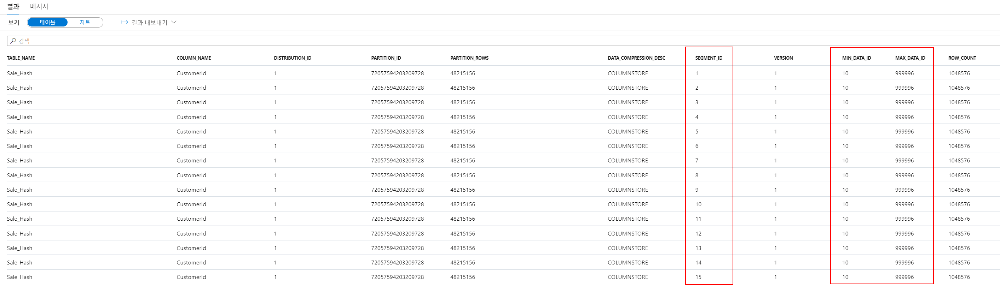

    결과 집합을 살펴보면서 세그먼트가 많이 겹치는 부분을 파악합니다. 사실상 모든 세그먼트 쌍에서 고객 ID(데이터 범위 1~1,000,000의 `CustomerId` 값)가 겹침을 확인할 수 있습니다. 이 CCI의 세그먼트 구조는 매우 비효율적이며, 이 구조를 사용하는 경우 쿼리가 스토리지에서 필요한 읽기를 매우 많이 수행해야 합니다.

2. 다음 쿼리를 실행하여 `Sale_Hash_Ordered` 테이블에서 겹치는 세그먼트를 표시합니다.

    ```sql
    select
        OBJ.name as table_name
        ,COL.name as column_name
        ,NT.distribution_id
        ,NP.partition_id
        ,NP.rows as partition_rows
        ,NP.data_compression_desc
        ,NCSS.segment_id
        ,NCSS.version
        ,NCSS.min_data_id
        ,NCSS.max_data_id
        ,NCSS.row_count
    from
        sys.objects OBJ
        JOIN sys.columns as COL ON
            OBJ.object_id = COL.object_id
        JOIN sys.pdw_table_mappings TM ON
            OBJ.object_id = TM.object_id
        JOIN sys.pdw_nodes_tables as NT on
            TM.physical_name = NT.name
        JOIN sys.pdw_nodes_partitions NP on
            NT.object_id = NP.object_id
            and NT.pdw_node_id = NP.pdw_node_id
            and substring(TM.physical_name, 40, 10) = NP.distribution_id
        JOIN sys.pdw_nodes_column_store_segments NCSS on
            NP.partition_id = NCSS.partition_id
            and NP.distribution_id = NCSS.distribution_id
            and COL.column_id = NCSS.column_id
    where
        OBJ.name = 'Sale_Hash_Ordered'
        and COL.name = 'CustomerId'
        and TM.physical_name  not like '%HdTable%'
    order by
        NT.distribution_id
    ```

    `wwi_perf.Sale_Hash_Ordered` 테이블을 만드는 데 사용된 CTAS는 다음과 같습니다(**쿼리를 실행하지 마세요**).

    ```sql
    CREATE TABLE [wwi_perf].[Sale_Hash_Ordered]
    WITH
    (
        DISTRIBUTION = HASH ( [CustomerId] ),
        CLUSTERED COLUMNSTORE INDEX ORDER( [CustomerId] )
    )
    AS
    SELECT
        *
    FROM
        [wwi_perf].[Sale_Heap]
    OPTION  (LABEL  = 'CTAS : Sale_Hash', MAXDOP 1)
    ```

    여기서는 MAXDOP를 1로 설정해 순서가 지정된 CCI를 만들었습니다. 순서가 지정된 CCI 만들기에 사용된 각 스레드는 데이터 하위 집합에서 작동하여 해당 데이터를 로컬에서 정렬합니다. 즉, 여러 스레드가 전체 데이터를 전역에서 정렬하지 않습니다. 여러 병렬 스레드를 사용하면 순서가 지정된 CCI를 만드는 시간을 단축할 수는 있지만, 스레드 하나를 사용할 때보다 겹치는 세그먼트가 더 많이 생성됩니다. 현재는 CREATE TABLE AS SELECT 명령을 사용하여 순서가 지정된 CCI 테이블을 만들 때만 MAXDOP 옵션을 사용할 수 있습니다. CREATE INDEX 또는 CREATE TABLE 명령을 통해 순서가 지정된 CCI를 만들 때는 MAXDOP 옵션을 사용할 수 없습니다.

    결과를 살펴보면 겹치는 세그먼트가 훨씬 적어졌음을 확인할 수 있습니다.

    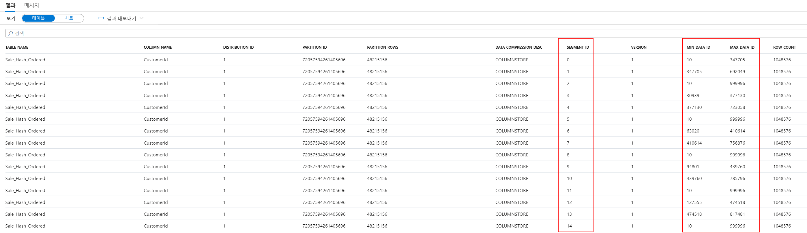

## 연습 5: 정리

다음 단계를 완료하여 더 이상 필요없는 리소스를 정리할 수 있습니다.

### 작업 1: 전용 SQL 풀 일시 중지

1. Synapse Studio(<https://web.azuresynapse.net/>)를 엽니다.

2. **관리** 허브를 선택합니다.

    

3. 왼쪽 메뉴에서 **SQL 풀**을 선택합니다 **(1)**. 전용 SQL 풀의 이름을 마우스 커서로 가리키고 **일시 중지(2)** 를 선택합니다.

    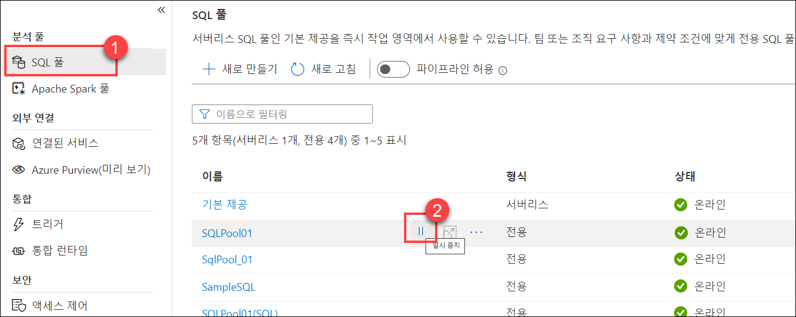

4. 메시지가 표시되면 **일시 중지**를 선택합니다.

    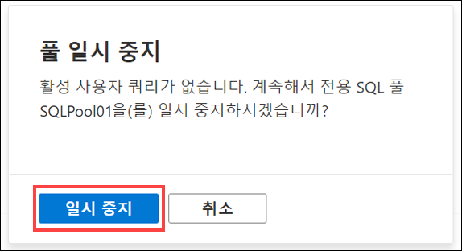
