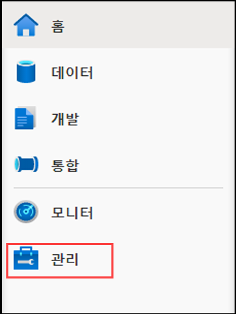
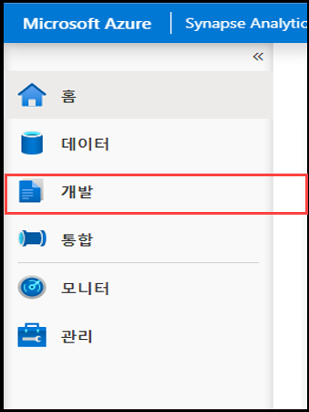
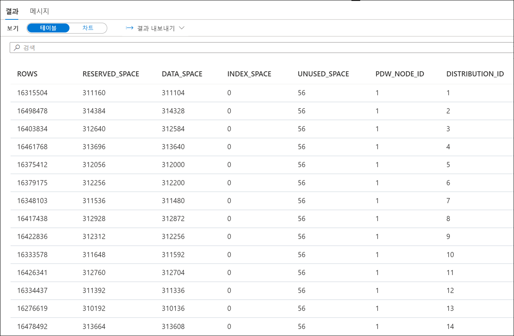
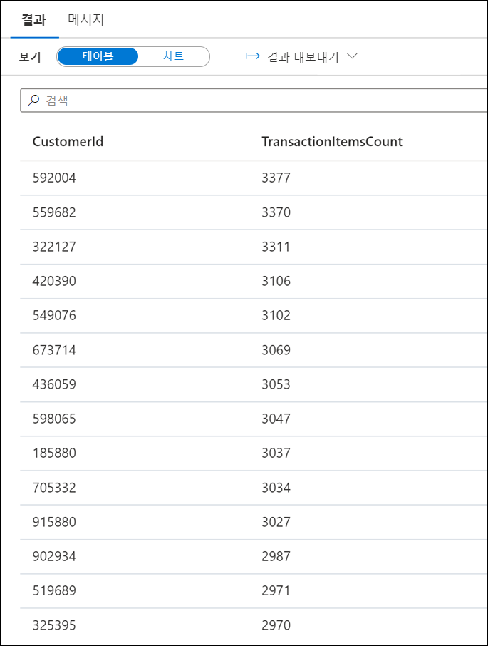
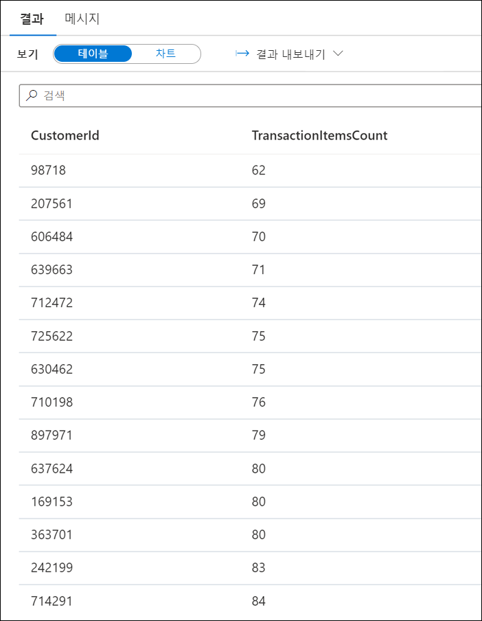
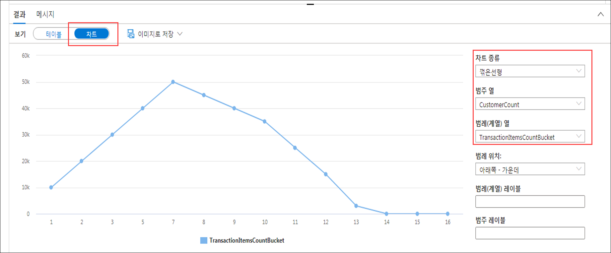
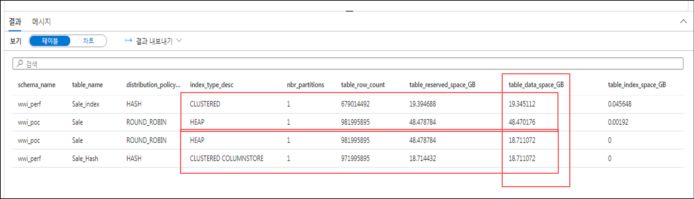
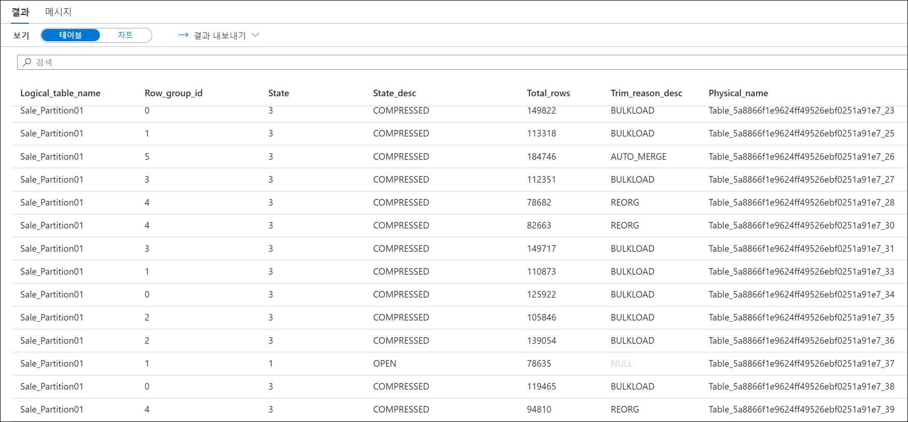
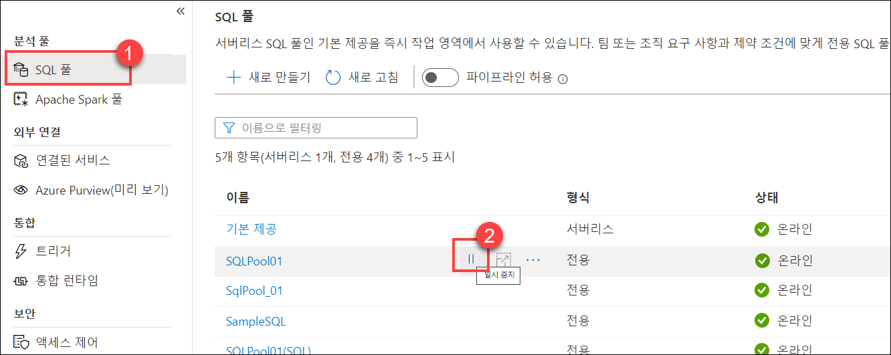
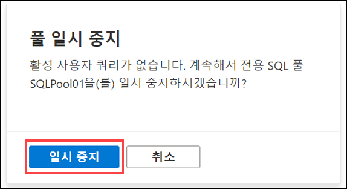

# 모듈 11 - 데이터 웨어하우스 스토리지 분석 및 최적화

이 모듈에서는 Azure Synapse 전용 SQL 풀의 데이터 스토리지를 분석 및 최적화하는 방법을 알아봅니다. 그리고 테이블 공간 사용량 및 열 저장 스토리지 세부 정보를 파악하는 기술을 살펴봅니다. 그 후에는 각기 다른 데이터 형식을 사용하는 동일 테이블 간의 스토리지 요구 사항을 비교하는 방법을 확인합니다. 그리고 마지막으로 복잡한 쿼리 대신 구체화된 뷰를 실행하는 경우의 영향을 살펴보고, 삭제 작업을 최적화하여 광범위한 로깅을 방지하는 방법을 알아봅니다.

이 모듈을 완료하면 다음 작업을 수행할 수 있습니다.

- 기울어진 데이터 및 공간 사용량 확인
- 열 저장 스토리지 세부 정보 파악
- 구체화된 뷰의 영향 파악
- 최소한으로 로깅되는 작업 관련 규칙 살펴보기

## 랩 세부 정보

- [모듈 11 - 데이터 웨어하우스 스토리지 분석 및 최적화](#module-11---analyze-and-optimize-data-warehouse-storage)
  - [랩 세부 정보](#lab-details)
  - [랩 설정 및 필수 구성 요소](#lab-setup-and-pre-requisites)
  - [연습 0: 전용 SQL 풀 시작](#exercise-0-start-the-dedicated-sql-pool)
  - [연습 1 - 기울어진 데이터 및 공간 사용량 확인](#exercise-1---check-for-skewed-data-and-space-usage)
    - [작업 1 - 테이블에 사용되는 공간 분석](#task-1---analyze-the-space-used-by-tables)
    - [작업 2 - 고급 방식을 사용하여 테이블 공간 사용량 파악](#task-2---use-a-more-advanced-approach-to-understand-table-space-usage)
  - [연습 2 - 열 저장 스토리지 세부 정보 파악](#exercise-2---understand-column-store-storage-details)
    - [작업 1 - 열 저장 행 그룹 통계용 뷰 만들기](#task-1---create-view-for-column-store-row-group-stats)
    - [작업 2 - 열 저장 스토리지 세부 정보 살펴보기](#task-2---explore-column-store-storage-details)
  - [연습 3 - 열 데이터 형식을 잘못 선택하는 경우의 영향 확인](#exercise-3---study-the-impact-of-wrong-choices-for-column-data-types)
    - [작업 1 - 테이블을 만들어 최적 열 데이터 형식 입력](#task-1---create-and-populate-tables-with-optimal-column-data-types)
    - [작업 2 - 테이블을 만들어 비최적 열 데이터 형식 입력](#task-2---create-and-populate-tables-with-sub-optimal-column-data-types)
    - [작업 3 - 스토리지 요구 사항 비교](#task-3---compare-storage-requirements)
  - [연습 4 - 구체화된 뷰의 영향 확인](#exercise-4---study-the-impact-of-materialized-views)
    - [작업 1 - 쿼리의 실행 계획 분석](#task-1---analyze-the-execution-plan-of-a-query)
    - [작업 2 - 구체화된 뷰를 사용하여 쿼리의 실행 계획 개선](#task-2---improve-the-execution-plan-of-the-query-with-a-materialized-view)
  - [연습 5 - 광범위한 로깅 방지](#exercise-5---avoid-extensive-logging)
    - [작업 1 - 최소한으로 로깅되는 작업 관련 규칙 살펴보기](#task-1---explore-rules-for-minimally-logged-operations)
    - [작업 2 - 삭제 작업 최적화](#task-2---optimizing-a-delete-operation)
  - [연습 6: 정리](#exercise-6-cleanup)
    - [작업 1: 전용 SQL 풀 일시 중지](#task-1-pause-the-dedicated-sql-pool)

## 랩 설정 및 필수 구성 요소

> **참고:** `Lab setup and pre-requisites` 단계는 호스트된 랩 환경이 **아닌**자체 Azure 구독을 사용하는 경우에만 완료하세요. 호스트된 랩 환경을 사용하는 경우에는 연습 0부터 바로 진행하면 됩니다.

이 모듈의 **[랩 설정 지침](https://github.com/solliancenet/microsoft-data-engineering-ilt-deploy/blob/main/setup/04/README.md)에 나와 있는 작업을 완료**하세요.

다음 모듈에서도 이 모듈과 같은 환경을 사용합니다.

- [모듈 4](labs/04/README.md)
- [모듈 5](labs/05/README.md)
- [모듈 7](labs/07/README.md)
- [모듈 8](labs/08/README.md)
- [모듈 9](labs/09/README.md)
- [모듈 10](labs/10/README.md)
- [모듈 11](labs/11/README.md)
- [모듈 12](labs/12/README.md)
- [모듈 13](labs/13/README.md)
- [모듈 16](labs/16/README.md)

## 연습 0: 전용 SQL 풀 시작

이 랩에서는 전용 SQL 풀을 사용합니다. 그러므로 첫 단계에서는 풀이 일시 중지되지 않았는지를 확인해야 합니다. 풀이 일시 중지되었다면 아래 지침에 따라 풀을 시작합니다.

1. Synapse Studio(<https://web.azuresynapse.net/>)를 엽니다.

2. **관리** 허브를 선택합니다.

    

3. 왼쪽 메뉴에서 **SQL 풀**을 선택합니다 **(1)**. 전용 SQL 풀이 일시 중지되어 있으면 풀 이름을 커서로 가리키고 **다시 시작(2)** 을 선택합니다.

    

4. 메시지가 표시되면 **다시 시작**을 선택합니다. 풀이 다시 시작되려면 1~2분 정도 걸립니다.

    

> 전용 SQL 풀이 다시 시작되는 동안 **다음 연습을 계속 진행**합니다.

## 연습 1 - 기울어진 데이터 및 공간 사용량 확인

### 작업 1 - 테이블에 사용되는 공간 분석

1. Synapse Studio(<https://web.azuresynapse.net/>)를 엽니다.

2. **개발** 허브를 선택합니다.

    

3. **개발** 메뉴에서 **+** 단추 **(1)** 를 선택하고 컨텍스트 메뉴에서 **SQL 스크립트(2)** 를 선택합니다.

    

4. 도구 모음 메뉴에서 **SQLPool01** 전용 SQL 풀과 **SQLPool01** 데이터베이스에 연결합니다.

    

5. 해시 분산 CCI(클러스터형 columnstore 인덱스) 테이블이 아직 없으면 다음 스크립트를 붙여넣어 CTAS(Create Table As Select)를 사용해 테이블을 만듭니다.

     ```sql
    IF OBJECT_ID(N'[wwi_perf].[Sale_Hash]', N'U') IS NULL
    BEGIN
        CREATE TABLE [wwi_perf].[Sale_Hash]
        WITH
        (
            DISTRIBUTION = HASH ( [CustomerId] ),
            CLUSTERED COLUMNSTORE INDEX
        )
        AS
        SELECT
            *
        FROM
            [wwi_poc].[Sale]
    END
    ```

6. 도구 모음 메뉴에서 **실행**을 선택하여 SQL 명령을 실행합니다.

    

    **테이블이 아직 없는 경우** 쿼리 실행이 완료되려면 **10분** 정도 걸립니다. 쿼리가 실행되는 동안 나머지 랩 지침을 확인하여 해당 내용을 숙지하세요.

    > **참고**
    >
    > CTAS는 SELECT...INTO 문의 한 버전으로, 보다 다양한 사용자 지정이 가능합니다.
    > SELECT...INTO를 사용할 때는 작업의 일환으로 배포 방법이나 인덱스 유형을 변경할 수 없습니다. 기본 배포 유형인 ROUND_ROBIN과 기본 테이블 구조인 CLUSTERED COLUMNSTORE INDEX를 사용하여 새 테이블을 생성합니다.
    >
    > 반면, CTAS를 사용할 때는 테이블 데이터 배포와 테이블 구조 유형을 모두 지정할 수 있습니다.

7. 쿼리 창에서 스크립트를 다음 DBCC(Database Console Command)로 바꿉니다.

    ```sql
    DBCC PDW_SHOWSPACEUSED('wwi_perf.Sale_Hash');
    ```

    

8. 각 분포의 행 수를 분석합니다. 행 수가 최대한 균일해야 합니다. 결과에서 모든 분포에 행이 균등하게 분산되어 있음을 확인할 수 있습니다. 이번에는 더 자세한 분석을 수행해 보겠습니다. 다음 쿼리를 사용하여 판매 거래 항목이 가장 많은 고객을 가져옵니다.

    ```sql
    SELECT TOP 1000
        CustomerId,
        count(*) as TransactionItemsCount
    FROM
        [wwi_perf].[Sale_Hash]
    GROUP BY
        CustomerId
    ORDER BY
        count(*) DESC
    ```

    

    이번에는 판매 거래 항목이 가장 적은 고객을 찾습니다.

    ```sql
    SELECT TOP 1000
        CustomerId,
        count(*) as TransactionItemsCount
    FROM
        [wwi_perf].[Sale_Hash]
    GROUP BY
        CustomerId
    ORDER BY
        count(*) ASC
    ```

    

    랩 환경에서는 거래 항목 최대값이 3,377이고 최소값이 62입니다.

    이제 고객별 거래 항목 수의 분포를 살펴보겠습니다. 다음 쿼리를 실행합니다.

    ```sql
    SELECT
        T.TransactionItemsCountBucket
        ,count(*) as CustomersCount
    FROM
        (
            SELECT
                CustomerId,
                (count(*) - 62) / 100 as TransactionItemsCountBucket
            FROM
                [wwi_perf].[Sale_Hash]
            GROUP BY
                CustomerId
        ) T
    GROUP BY
        T.TransactionItemsCountBucket
    ORDER BY
        T.TransactionItemsCountBucket
    ```

    `Results` 창에서 `Chart` 뷰로 전환하여 뷰를 다음과 같이 구성합니다(오른쪽에 설정된 옵션 참조).

    

    이 히스토그램에서 자세한 수치 및 통계 정보를 확인할 필요는 없으며, `Sale_Hash` 테이블의 데이터 분산에서 기울어짐 현상이 사실상 나타나지 않는 이유만 확인하면 됩니다. 고객별 거래 항목 수가 '준정규' 방식으로 분포되어 있으므로 기울어짐 현상이 나타나지 않습니다.

### 작업 2 - 고급 방식을 사용하여 테이블 공간 사용량 파악

1. 다음 스크립트를 실행하여 `vTableSizes` 뷰를 만듭니다.

    ```sql
    CREATE VIEW [wwi_perf].[vTableSizes]
    AS
    WITH base
    AS
    (
    SELECT
        GETDATE()                                                              AS  [execution_time]
        , DB_NAME()                                                            AS  [database_name]
        , s.name                                                               AS  [schema_name]
        , t.name                                                               AS  [table_name]
        , QUOTENAME(s.name)+'.'+QUOTENAME(t.name)                              AS  [two_part_name]
        , nt.[name]                                                            AS  [node_table_name]
        , ROW_NUMBER() OVER(PARTITION BY nt.[name] ORDER BY (SELECT NULL))     AS  [node_table_name_seq]
        , tp.[distribution_policy_desc]                                        AS  [distribution_policy_name]
        , c.[name]                                                             AS  [distribution_column]
        , nt.[distribution_id]                                                 AS  [distribution_id]
        , i.[type]                                                             AS  [index_type]
        , i.[type_desc]                                                        AS  [index_type_desc]
        , nt.[pdw_node_id]                                                     AS  [pdw_node_id]
        , pn.[type]                                                            AS  [pdw_node_type]
        , pn.[name]                                                            AS  [pdw_node_name]
        , di.name                                                              AS  [dist_name]
        , di.position                                                          AS  [dist_position]
        , nps.[partition_number]                                               AS  [partition_nmbr]
        , nps.[reserved_page_count]                                            AS  [reserved_space_page_count]
        , nps.[reserved_page_count] - nps.[used_page_count]                    AS  [unused_space_page_count]
        , nps.[in_row_data_page_count]
            + nps.[row_overflow_used_page_count]
            + nps.[lob_used_page_count]                                        AS  [data_space_page_count]
        , nps.[reserved_page_count]
        - (nps.[reserved_page_count] - nps.[used_page_count])
        - ([in_row_data_page_count]
                + [row_overflow_used_page_count]+[lob_used_page_count])        AS  [index_space_page_count]
        , nps.[row_count]                                                      AS  [row_count]
    FROM
        sys.schemas s
    INNER JOIN sys.tables t
        ON s.[schema_id] = t.[schema_id]
    INNER JOIN sys.indexes i
        ON  t.[object_id] = i.[object_id]
        AND i.[index_id] <= 1
    INNER JOIN sys.pdw_table_distribution_properties tp
        ON t.[object_id] = tp.[object_id]
    INNER JOIN sys.pdw_table_mappings tm
        ON t.[object_id] = tm.[object_id]
    INNER JOIN sys.pdw_nodes_tables nt
        ON tm.[physical_name] = nt.[name]
    INNER JOIN sys.dm_pdw_nodes pn
        ON  nt.[pdw_node_id] = pn.[pdw_node_id]
    INNER JOIN sys.pdw_distributions di
        ON  nt.[distribution_id] = di.[distribution_id]
    INNER JOIN sys.dm_pdw_nodes_db_partition_stats nps
        ON nt.[object_id] = nps.[object_id]
        AND nt.[pdw_node_id] = nps.[pdw_node_id]
        AND nt.[distribution_id] = nps.[distribution_id]
    LEFT OUTER JOIN (select * from sys.pdw_column_distribution_properties where distribution_ordinal = 1) cdp
        ON t.[object_id] = cdp.[object_id]
    LEFT OUTER JOIN sys.columns c
        ON cdp.[object_id] = c.[object_id]
        AND cdp.[column_id] = c.[column_id]
    WHERE pn.[type] = 'COMPUTE'
    )
    , size
    AS
    (
    SELECT
    [execution_time]
    ,  [database_name]
    ,  [schema_name]
    ,  [table_name]
    ,  [two_part_name]
    ,  [node_table_name]
    ,  [node_table_name_seq]
    ,  [distribution_policy_name]
    ,  [distribution_column]
    ,  [distribution_id]
    ,  [index_type]
    ,  [index_type_desc]
    ,  [pdw_node_id]
    ,  [pdw_node_type]
    ,  [pdw_node_name]
    ,  [dist_name]
    ,  [dist_position]
    ,  [partition_nmbr]
    ,  [reserved_space_page_count]
    ,  [unused_space_page_count]
    ,  [data_space_page_count]
    ,  [index_space_page_count]
    ,  [row_count]
    ,  ([reserved_space_page_count] * 8.0)                                 AS [reserved_space_KB]
    ,  ([reserved_space_page_count] * 8.0)/1000                            AS [reserved_space_MB]
    ,  ([reserved_space_page_count] * 8.0)/1000000                         AS [reserved_space_GB]
    ,  ([reserved_space_page_count] * 8.0)/1000000000                      AS [reserved_space_TB]
    ,  ([unused_space_page_count]   * 8.0)                                 AS [unused_space_KB]
    ,  ([unused_space_page_count]   * 8.0)/1000                            AS [unused_space_MB]
    ,  ([unused_space_page_count]   * 8.0)/1000000                         AS [unused_space_GB]
    ,  ([unused_space_page_count]   * 8.0)/1000000000                      AS [unused_space_TB]
    ,  ([data_space_page_count]     * 8.0)                                 AS [data_space_KB]
    ,  ([data_space_page_count]     * 8.0)/1000                            AS [data_space_MB]
    ,  ([data_space_page_count]     * 8.0)/1000000                         AS [data_space_GB]
    ,  ([data_space_page_count]     * 8.0)/1000000000                      AS [data_space_TB]
    ,  ([index_space_page_count]  * 8.0)                                   AS [index_space_KB]
    ,  ([index_space_page_count]  * 8.0)/1000                              AS [index_space_MB]
    ,  ([index_space_page_count]  * 8.0)/1000000                           AS [index_space_GB]
    ,  ([index_space_page_count]  * 8.0)/1000000000                        AS [index_space_TB]
    FROM base
    )
    SELECT *
    FROM size
    ```

    위의 스크립트를 잠시 분석해 보겠습니다. 위 스크립트에는 이전 랩에서 사용했던 몇 가지 테이블이 포함되어 있습니다. 쿼리에 포함되어 있는 테이블과 DMV의 간략한 설명이 아래에 나와 있습니다.

    테이블 이름 | 설명
    ---|---
    sys.schemas | 데이터베이스의 모든 스키마가 포함된 테이블입니다.
    sys.tables | 데이터베이스의 모든 테이블이 포함된 테이블입니다.
    sys.indexes | 데이터베이스의 모든 인덱스가 포함된 테이블입니다.
    sys.columns | 데이터베이스의 모든 열이 포함된 테이블입니다.
    sys.pdw_table_mappings | 각 테이블을 실제 노드와 분산의 로컬 테이블에 매핑합니다.
    sys.pdw_nodes_tables | 각 분산에 있는 개별 로컬 테이블의 정보가 포함됩니다.
    sys.pdw_table_distribution_properties | 테이블의 분포 정보(테이블에 적용된 분포 유형)가 포함됩니다.
    sys.pdw_column_distribution_properties | 열의 분포 정보가 포함됩니다. 부모 테이블을 분산하는 데 사용된 열만 포함하도록 필터링됩니다(`distribution_ordinal` = 1).
    sys.pdw_distributions |  SQL 풀의 분포 관련 정보가 포함됩니다.
    sys.dm_pdw_nodes | SQL 풀의 노드 관련 정보가 포함됩니다. 컴퓨팅 노드만 포함하도록 필터링됩니다(`type` = `COMPUTE`).
    sys.dm_pdw_nodes_db_partition_stats | 현재 데이터베이스의 모든 파티션에 대해 페이지 및 행 수 정보를 반환합니다.

2. 다음 스크립트를 실행하여 `wwi_perf` 스키마의 테이블, 그리고 `Sale_Hash`테이블의 원본으로 사용된 `[wwi_poc].[Sale]` 테이블의 구조 관련 세부 정보를 확인합니다.

    ```sql
    SELECT
        schema_name
    ,    table_name
    ,    distribution_policy_name
    ,      distribution_column
    ,    index_type_desc
    ,    COUNT(distinct partition_nmbr) as nbr_partitions
    ,    SUM(row_count)                 as table_row_count
    ,    SUM(reserved_space_GB)         as table_reserved_space_GB
    ,    SUM(data_space_GB)             as table_data_space_GB
    ,    SUM(index_space_GB)            as table_index_space_GB
    ,    SUM(unused_space_GB)           as table_unused_space_GB
    FROM
        [wwi_perf].[vTableSizes]
    WHERE
        schema_name = 'wwi_perf' OR (schema_name = 'wwi_poc' AND table_name = 'sale')
    GROUP BY
        database_name
    ,    schema_name
    ,    table_name
    ,    distribution_policy_name
    ,      distribution_column
    ,    index_type_desc
    ORDER BY
        table_reserved_space_GB desc
    ```

    결과를 분석합니다.

    

    `CLUSTERED COLUMNSTORE` 테이블과 `HEAP` 또는 `CLUSTERED` 테이블이 사용하는 공간의 양에는 큰 차이가 있습니다. 즉, columnstore 인덱스를 사용하는 경우 공간 사용량과 관련하여 큰 이점이 제공됨을 명확하게 확인할 수 있습니다. **행 수를 적어 두세요**.

## 연습 2 - 열 저장 스토리지 세부 정보 파악

### 작업 1 - 열 저장 행 그룹 통계용 뷰 만들기

1. 다음 쿼리를 실행하여 `vColumnStoreRowGroupStats`를 만듭니다.

    ```sql
    create view [wwi_perf].[vColumnStoreRowGroupStats]
    as
    with cte
    as
    (
    select   tb.[name]                    AS [logical_table_name]
    ,        rg.[row_group_id]            AS [row_group_id]
    ,        rg.[state]                   AS [state]
    ,        rg.[state_desc]              AS [state_desc]
    ,        rg.[total_rows]              AS [total_rows]
    ,        rg.[trim_reason_desc]        AS trim_reason_desc
    ,        mp.[physical_name]           AS physical_name
    FROM    sys.[schemas] sm
    JOIN    sys.[tables] tb               ON  sm.[schema_id]          = tb.[schema_id]
    JOIN    sys.[pdw_table_mappings] mp   ON  tb.[object_id]          = mp.[object_id]
    JOIN    sys.[pdw_nodes_tables] nt     ON  nt.[name]               = mp.[physical_name]
    JOIN    sys.[dm_pdw_nodes_db_column_store_row_group_physical_stats] rg      ON  rg.[object_id]     = nt.[object_id]
                                                                                AND rg.[pdw_node_id]   = nt.[pdw_node_id]
                                            AND rg.[distribution_id]    = nt.[distribution_id]
    )
    select *
    from cte;
    ```

    이 쿼리에서는 `sys.dm_pdw_nodes_db_column_store_row_group_physical_stats` DMV를 사용했습니다. 이 DMV는 현재 데이터베이스 내 모든 columnstore 인덱스와 관련한 현재 행 그룹 수준 정보를 제공합니다.

    `state_desc` 열에서는 행 그룹 상태와 관련된 유용한 정보를 제공합니다.

    이름 | 설명
    ---|---
    `INVISIBLE` | 압축 중인 행 그룹입니다.
    `OPEN` | 새 행을 추가할 수 있는 deltastore 행 그룹입니다. 열린 상태의 행 그룹은 아직 rowstore 형식이며 columnstore 형식으로 압축되지 않은 그룹입니다.
    `CLOSED` | 최대 행 수가 포함되어 있으며 튜플 이동기 프로세스에서 columnstore로의 압축 대기 중인 deltastore 행 그룹입니다.
    `COMPRESSED` | columnstore 식을 사용하여 압축된 후 columnstore에 저장된 행 그룹입니다.
    `TOMBSTONE` | 이전에는 deltastore에 있었지만 더 이상 사용되지 않는 행 그룹입니다.

    `trim_reason_desc` 열을 사용하여 `COMPRESSED` 행 그룹의 행 수가 최대값보다 적은 이유를 설명합니다.

    이름 | 설명
    ---|---
    `UNKNOWN_UPGRADED_FROM_PREVIOUS_VERSION` | 이전 버전의 SQL Server에서 업그레이드할 때 행 수가 적어졌습니다.
    `NO_TRIM` | 행 그룹이 잘리지 않았습니다. 즉, 최대 1,048,476개 행을 포함할 수 있도록 행 그룹이 압축되었습니다. 델타 행 그룹이 닫힌 후 행 하위 집합이 삭제된 경우 행 수가 적어질 수 있습니다.
    `BULKLOAD` | 대량 로드 일괄 처리 크기로 인해 행 수가 제한되었습니다. 데이터 로드를 최적화할 때는 이러한 제한을 확인해야 합니다. 로드 프로세스 중의 리소스 결핍 상태를 나타내는 현상이기 때문입니다.
    `REORG` | REORG 명령이 실행되어 강제 압축이 수행되었습니다.
    `DICTIONARY_SIZE` | 사전 크기가 너무 커져서 모든 행을 함께 압축하지 못했습니다.
    `MEMORY_LIMITATION` | 메모리가 부족해서 모든 행을 함께 압축하지 못했습니다.
    `RESIDUAL_ROW_GROUP` | 인덱스 작성 작업 중에 행이 1백만 개 미만인 마지막 행 그룹의 일부분으로 행 그룹이 닫혔습니다.

### 작업 2 - 열 저장 스토리지 세부 정보 살펴보기

1. 다음 쿼리를 사용하여 `Sale_Partition01` 테이블의 columnstore 통계를 살펴봅니다.

    ```sql
    SELECT
        *
    FROM
        [wwi_perf].[vColumnStoreRowGroupStats]
    WHERE
        Logical_Table_Name = 'Sale_Partition01'
    ```

2. 쿼리의 결과를 살펴봅니다.

    

    결과를 살펴보면서 행 그룹 상태를 대략적으로 확인합니다. 상태가 `COMPRESSED`인 행 그룹도 있고 `OPEN`인 행 그룹도 있습니다.

3. 같은 쿼리를 사용하여 `Sale_Hash_Ordered` 테이블의 columnstore 통계를 살펴봅니다.

    ```sql
    SELECT
        *
    FROM
        [wwi_perf].[vColumnStoreRowGroupStats]
    WHERE
        Logical_Table_Name = 'Sale_Hash_Ordered'
    ```

4. 쿼리의 결과를 살펴봅니다.

    

    이 테이블의 행 그룹 상태는 이전 테이블과는 전혀 다릅니다. 즉, 순서가 지정된 CCI를 사용하는 경우 제공될 수 있는 이점 중 한 가지를 명확하게 확인할 수 있습니다.

## 연습 3 - 열 데이터 형식을 잘못 선택하는 경우의 영향 확인

### 작업 1 - 테이블을 만들어 최적 열 데이터 형식 입력

다음 쿼리를 사용하여 `Sale_Hash_Ordered`의 열 하위 집합이 포함된 테이블 2개(`Sale_Hash_Projection` 및 `Sale_Hash_Projection2`)를 만듭니다.

```sql
CREATE TABLE [wwi_perf].[Sale_Hash_Projection]
WITH
(
	DISTRIBUTION = HASH ( [CustomerId] ),
	HEAP
)
AS
SELECT
	[CustomerId]
	,[ProductId]
	,[Quantity]
FROM
	[wwi_perf].[Sale_Hash_Ordered]

CREATE TABLE [wwi_perf].[Sale_Hash_Projection2]
WITH
(
	DISTRIBUTION = HASH ( [CustomerId] ),
	CLUSTERED COLUMNSTORE INDEX
)
AS
SELECT
	[CustomerId]
	,[ProductId]
	,[Quantity]
FROM
	[wwi_perf].[Sale_Hash_Ordered]
```

> 쿼리 실행은 4분 내에 완료되어야 합니다. 쿼리가 실행되는 동안 나머지 랩 지침을 확인하여 해당 내용을 숙지하세요.

### 작업 2 - 테이블을 만들어 비최적 열 데이터 형식 입력

다음 쿼리를 사용하여 동일한 열을 포함하되 데이터 형식이 다른(sub_optimal) 테이블 2개(`Sale_Hash_Projection_Big` 및 `Sale_Hash_Projection_Big2`)를 더 만듭니다.

```sql
CREATE TABLE [wwi_perf].[Sale_Hash_Projection_Big]
WITH
(
	DISTRIBUTION = HASH ( [CustomerId] ),
	HEAP
)
AS
SELECT
	[CustomerId]
	,CAST([ProductId] as bigint) as [ProductId]
	,CAST([Quantity] as bigint) as [Quantity]
FROM
	[wwi_perf].[Sale_Hash_Ordered]

CREATE TABLE [wwi_perf].[Sale_Hash_Projection_Big2]
WITH
(
	DISTRIBUTION = HASH ( [CustomerId] ),
	CLUSTERED COLUMNSTORE INDEX
)
AS
SELECT
	[CustomerId]
	,CAST([ProductId] as bigint) as [ProductId]
	,CAST([Quantity] as bigint) as [Quantity]
FROM
	[wwi_perf].[Sale_Hash_Ordered]
```

> 쿼리 실행은 이전 쿼리와 비슷한 시간 내에 완료되어야 합니다. 쿼리가 실행되는 동안 랩 지침을 계속 확인하세요.

### 작업 3 - 스토리지 요구 사항 비교

1. 4개 테이블의 행 수가 같은지 확인합니다(각 테이블의 행 수가 339,507,246개여야 함).

    ```sql
    SELECT 'Sale_Hash_Projection', COUNT_BIG(*) FROM [wwi_perf].[Sale_Hash_Projection]
    UNION
    SELECT 'Sale_Hash_Projection2', COUNT_BIG(*) FROM [wwi_perf].[Sale_Hash_Projection2]
    UNION
    SELECT 'Sale_Hash_Projection_Big', COUNT_BIG(*) FROM [wwi_perf].[Sale_Hash_Projection_Big]
    UNION
    SELECT 'Sale_Hash_Projection_Big2', COUNT_BIG(*) FROM [wwi_perf].[Sale_Hash_Projection_Big2]
    ```

2. 다음 쿼리를 실행하여 3개 테이블의 스토리지 요구 사항을 비교합니다.

    ```sql
    SELECT
        table_name
    ,    distribution_policy_name
    ,      distribution_column
    ,    index_type_desc
    ,    COUNT(distinct partition_nmbr) as nbr_partitions
    ,    SUM(row_count)                 as table_row_count
    ,    SUM(reserved_space_GB)         as table_reserved_space_GB
    ,    SUM(data_space_GB)             as table_data_space_GB
    ,    SUM(index_space_GB)            as table_index_space_GB
    ,    SUM(unused_space_GB)           as table_unused_space_GB
    FROM
        [wwi_perf].[vTableSizes]
    WHERE
        schema_name = 'wwi_perf'
        and table_name in ('Sale_Hash_Projection', 'Sale_Hash_Projection2',
            'Sale_Hash_Projection_Big', 'Sale_Hash_Projection_Big2')
    GROUP BY
        database_name
    ,    schema_name
    ,    table_name
    ,    distribution_policy_name
    ,      distribution_column
    ,    index_type_desc
    ORDER BY
        table_data_space_GB desc
    ```

3. 결과를 분석합니다.

    행 수가 적은 경우(약 3억 4천만 개) `BIGINT` 열 유형의 공간 사용량이 `SMALLINT` 및 `TINYINT` 열 유형과 다소 달라집니다.
    
    이 랩 외부에서 한 실험을 보면 행 29억 개를 로드한 후에 같은 쿼리를 실행하면 공간 사용량의 차이가 더욱 명확하게 나타납니다. 실험에서 얻은 중요한 결론 두 가지는 다음과 같습니다.

    - `HEAP` 테이블에서는 `SMALLINT`(`ProductId`의 경우) 및 `TINYINT`(`QUANTITY`의 경우)가 아닌 `BIGINT`를 사용하면 공간 사용량이 거의 1GB(0.8941GB)나 감소합니다. 테이블에 열 2개와 적당량의 행(29억 개)만 포함하더라도 공간 사용량이 이 정도나 달라지는 것입니다.
    - 테이블이 압축되어 공간 사용량 차이가 다소 상쇄되는 `CLUSTERED COLUMNSTORE` 테이블에서도 12.7MB의 공간 사용량 차이를 확인할 수 있습니다.

데이터 형식의 크기를 최소화하면 쿼리 성능을 향상시키는 행 길이를 줄입니다. 그러므로 데이터에 적합한 최소 크기의 데이터 형식을 사용해야 합니다.

- 문자 열을 큰 기본 길이로 정의하지 마세요. 예를 들어 가장 긴 값이 25자인 경우 열을 VARCHAR(25)로 정의합니다.
- VARCHAR만 필요한 경우 [NVARCHAR][NVARCHAR]를 사용하지 마세요.
- 가능한 경우 NVARCHAR(MAX) 또는 VARCHAR(MAX) 대신 NVARCHAR(4000) 또는 VARCHAR(8000)를 사용합니다.

>**메모**
>
>PolyBase 외부 테이블을 사용하여 SQL 풀 테이블을 로드하는 경우 정의된 테이블 행의 길이는 1MB를 초과할 수 없습니다. 가변 길이 데이터가 있는 행이 1MB를 초과하는 경우 행을 PolyBase가 아닌 BCP로 로드할 수 있습니다.

## 연습 4 - 구체화된 뷰의 영향 확인

### 작업 1 - 쿼리의 실행 계획 분석

1. 위의 쿼리를 다시 실행하여 고객별 거래 항목 수의 각 버킷에서 고객 수를 확인합니다.

    ```sql
    SELECT
        T.TransactionItemsCountBucket
        ,count(*) as CustomersCount
    FROM
        (
            SELECT
                CustomerId,
                (count(*) - 184) / 100 as TransactionItemsCountBucket
            FROM
                [wwi_perf].[Sale_Hash]
            GROUP BY
                CustomerId
        ) T
    GROUP BY
        T.TransactionItemsCountBucket
    ORDER BY
        T.TransactionItemsCountBucket
    ```

2. 첫 번째 고객별 거래 항목 수 버킷의 하한 계산 지원 코드를 추가하여 쿼리를 개선합니다.

    ```sql
    SELECT
        T.TransactionItemsCountBucket
        ,count(*) as CustomersCount
    FROM
        (
            SELECT
                CustomerId,
                (
                    COUNT(*) -
                    (
                        SELECT
                            MIN(TransactionItemsCount)
                        FROM
                        (
                            SELECT
                                COUNT(*) as TransactionItemsCount
                            FROM
                                [wwi_perf].[Sale_Hash]
                            GROUP BY
                                CustomerId
                        ) X
                    )
                ) / 100 as TransactionItemsCountBucket
            FROM
                [wwi_perf].[Sale_Hash]
            GROUP BY
                CustomerId
        ) T
    GROUP BY
        T.TransactionItemsCountBucket
    ORDER BY
        T.TransactionItemsCountBucket
    ```

### 작업 2 - 구체화된 뷰를 사용하여 쿼리의 실행 계획 개선

1. `EXPLAIN` 지시문을 포함하여 쿼리를 실행합니다(`WITH_RECOMMENDATIONS` 옵션도 포함되어 있음).

    ```sql
    EXPLAIN WITH_RECOMMENDATIONS
    SELECT
        T.TransactionItemsCountBucket
        ,count(*) as CustomersCount
    FROM
        (
            SELECT
                CustomerId,
                (
                    COUNT(*) - 
                    (
                        SELECT 
                            MIN(TransactionItemsCount)
                        FROM 
                        (
                            SELECT 
                                COUNT(*) as TransactionItemsCount
                            FROM 
                                [wwi_perf].[Sale_Hash] 
                            GROUP BY 
                                CustomerId 
                        ) X 
                    )
                ) / 100 as TransactionItemsCountBucket
            FROM
                [wwi_perf].[Sale_Hash]
            GROUP BY
                CustomerId
        ) T
    GROUP BY
        T.TransactionItemsCountBucket
    ORDER BY
        T.TransactionItemsCountBucket
    ```

2. 반환되는 실행 계획을 분석합니다. `<materialized_view_candidates>` 섹션을 자세히 살펴봅니다. 이 섹션에서는 쿼리 성능을 개선하기 위해 만들 수 있는 구체화된 뷰가 제안됩니다.

    ```xml
    <?xml version="1.0" encoding="utf-8"?>
    <dsql_query number_nodes="5" number_distributions="60" number_distributions_per_node="12">
    <sql>SELECT
        T.TransactionItemsCountBucket
        ,count(*) as CustomersCount
    FROM
        (
            SELECT
                CustomerId,
                (
                    COUNT(*) -
                    (
                        SELECT
                            MIN(TransactionItemsCount)
                        FROM
                        (
                            SELECT
                                COUNT(*) as TransactionItemsCount
                            FROM
                                [wwi_perf].[Sale_Hash]
                            GROUP BY
                                CustomerId
                        ) X
                    )
                ) / 100 as TransactionItemsCountBucket
            FROM
                [wwi_perf].[Sale_Hash]
            GROUP BY
                CustomerId
        ) T
    GROUP BY
        T.TransactionItemsCountBucket
    ORDER BY
        T.TransactionItemsCountBucket</sql>
    <materialized_view_candidates>
        <materialized_view_candidates with_constants="False">CREATE MATERIALIZED VIEW View1 WITH (DISTRIBUTION = HASH([Expr0])) AS
    SELECT [SQLPool01].[wwi_perf].[Sale_Hash].[CustomerId] AS [Expr0],
        COUNT(*) AS [Expr1]
    FROM [wwi_perf].[Sale_Hash]
    GROUP BY [SQLPool01].[wwi_perf].[Sale_Hash].[CustomerId]</materialized_view_candidates>
    </materialized_view_candidates>
    <dsql_operations total_cost="0.0242811172881356" total_number_operations="9">
        <dsql_operation operation_type="RND_ID">
        <identifier>TEMP_ID_99</identifier>
        </dsql_operation>
        <dsql_operation operation_type="ON">
        <location permanent="false" distribution="AllComputeNodes" />
        <sql_operations>
            <sql_operation type="statement">CREATE TABLE [qtabledb].[dbo].[TEMP_ID_99] ([col] INT ) WITH(DISTRIBUTED_MOVE_FILE='');</sql_operation>
        </sql_operations>
        </dsql_operation>
        <dsql_operation operation_type="BROADCAST_MOVE">
        <operation_cost cost="0.00096" accumulative_cost="0.00096" average_rowsize="4" output_rows="1" GroupNumber="69" />
        <source_statement>SELECT [T1_1].[col] AS [col] FROM (SELECT MIN([T2_1].[col]) AS [col] FROM (SELECT COUNT(CAST ((0) AS INT)) AS [col], 0 AS [col1] FROM [SQLPool01].[wwi_perf].[Sale_Hash] AS T3_1 GROUP BY [T3_1].[CustomerId]) AS T2_1 GROUP BY [T2_1].[col1]) AS T1_1
    OPTION (MAXDOP 6, MIN_GRANT_PERCENT = [MIN_GRANT], DISTRIBUTED_MOVE(N''))</source_statement>
        <destination_table>[TEMP_ID_99]</destination_table>
        </dsql_operation>
        <dsql_operation operation_type="RND_ID">
        <identifier>TEMP_ID_100</identifier>
        </dsql_operation>
        <dsql_operation operation_type="ON">
        <location permanent="false" distribution="AllDistributions" />
        <sql_operations>
            <sql_operation type="statement">CREATE TABLE [qtabledb].[dbo].[TEMP_ID_100] ([col] INT, [col1] BIGINT ) WITH(DISTRIBUTED_MOVE_FILE='');</sql_operation>
        </sql_operations>
        </dsql_operation>
        <dsql_operation operation_type="SHUFFLE_MOVE">
        <operation_cost cost="0.0233211172881356" accumulative_cost="0.0242811172881356" average_rowsize="12" output_rows="95.5518" GroupNumber="75" />
        <source_statement>SELECT [T1_1].[col1] AS [col], [T1_1].[col] AS [col1] FROM (SELECT COUNT_BIG(CAST ((0) AS INT)) AS [col], [T2_1].[col] AS [col1] FROM (SELECT (([T3_2].[col] - [T3_1].[col]) / CAST ((100) AS INT)) AS [col] FROM (SELECT MIN([T4_1].[col]) AS [col] FROM [qtabledb].[dbo].[TEMP_ID_99] AS T4_1) AS T3_1 INNER JOIN
    (SELECT COUNT(CAST ((0) AS INT)) AS [col] FROM [SQLPool01].[wwi_perf].[Sale_Hash] AS T4_1 GROUP BY [T4_1].[CustomerId]) AS T3_2
    ON (0 = 0)) AS T2_1 GROUP BY [T2_1].[col]) AS T1_1
    OPTION (MAXDOP 6, MIN_GRANT_PERCENT = [MIN_GRANT], DISTRIBUTED_MOVE(N''))</source_statement>
        <destination_table>[TEMP_ID_100]</destination_table>
        <shuffle_columns>col;</shuffle_columns>
        </dsql_operation>
        <dsql_operation operation_type="RETURN">
        <location distribution="AllDistributions" />
        <select>SELECT [T1_1].[col1] AS [col], [T1_1].[col] AS [col1] FROM (SELECT CONVERT (INT, [T2_1].[col], 0) AS [col], [T2_1].[col1] AS [col1] FROM (SELECT ISNULL([T3_1].[col], CONVERT (BIGINT, 0, 0)) AS [col], [T3_1].[col1] AS [col1] FROM (SELECT SUM([T4_1].[col1]) AS [col], [T4_1].[col] AS [col1] FROM [qtabledb].[dbo].[TEMP_ID_100] AS T4_1 GROUP BY [T4_1].[col]) AS T3_1) AS T2_1) AS T1_1 ORDER BY [T1_1].[col1] ASC
    OPTION (MAXDOP 6, MIN_GRANT_PERCENT = [MIN_GRANT])</select>
        </dsql_operation>
        <dsql_operation operation_type="ON">
        <location permanent="false" distribution="AllDistributions" />
        <sql_operations>
            <sql_operation type="statement">DROP TABLE [qtabledb].[dbo].[TEMP_ID_100]</sql_operation>
        </sql_operations>
        </dsql_operation>
        <dsql_operation operation_type="ON">
        <location permanent="false" distribution="AllComputeNodes" />
        <sql_operations>
            <sql_operation type="statement">DROP TABLE [qtabledb].[dbo].[TEMP_ID_99]</sql_operation>
        </sql_operations>
        </dsql_operation>
    </dsql_operations>
    </dsql_query>
    ```

3. Create the suggested materialized view:

    ```sql
    CREATE MATERIALIZED VIEW
        mvTransactionItemsCounts
    WITH
    (
        DISTRIBUTION = HASH([CustomerId])
    )
    AS
    SELECT
        CustomerId
        ,COUNT(*) AS ItemsCount
    FROM
        [wwi_perf].[Sale_Hash]
    GROUP BY
        CustomerId
    ```

4. 실행 계획을 다시 확인합니다.

    ```sql
    EXPLAIN WITH_RECOMMENDATIONS
    SELECT
        T.TransactionItemsCountBucket
        ,count(*) as CustomersCount
    FROM
        (
            SELECT
                CustomerId,
                (
                    COUNT(*) - 
                    (
                        SELECT 
                            MIN(TransactionItemsCount)
                        FROM 
                        (
                            SELECT 
                                COUNT(*) as TransactionItemsCount
                            FROM 
                                [wwi_perf].[Sale_Hash] 
                            GROUP BY 
                                CustomerId 
                        ) X 
                    )
                ) / 100 as TransactionItemsCountBucket
            FROM
                [wwi_perf].[Sale_Hash]
            GROUP BY
                CustomerId
        ) T
    GROUP BY
        T.TransactionItemsCountBucket
    ORDER BY
        T.TransactionItemsCountBucket
    ```

    반환되는 실행 계획에는 `mvTransactionItemsCounts`(`BROADCAST_MOVE` 분산 SQL 작업) 구체화된 뷰가 사용됨이 표시됩니다. 따라서 쿼리 실행 시간이 단축됩니다.

    ```xml
    <?xml version="1.0" encoding="utf-8"?>
    <dsql_query number_nodes="5" number_distributions="60" number_distributions_per_node="12">
    <sql>SELECT
        T.TransactionItemsCountBucket
        ,count(*) as CustomersCount
    FROM
        (
            SELECT
                CustomerId,
                (
                    COUNT(*) -
                    (
                        SELECT
                            MIN(TransactionItemsCount)
                        FROM
                        (
                            SELECT
                                COUNT(*) as TransactionItemsCount
                            FROM
                                [wwi_perf].[Sale_Hash]
                            GROUP BY
                                CustomerId
                        ) X
                    )
                ) / 100 as TransactionItemsCountBucket
            FROM
                [wwi_perf].[Sale_Hash]
            GROUP BY
                CustomerId
        ) T
    GROUP BY
        T.TransactionItemsCountBucket
    ORDER BY
        T.TransactionItemsCountBucket</sql>
    <materialized_view_candidates>
        <materialized_view_candidates with_constants="False">CREATE MATERIALIZED VIEW View1 WITH (DISTRIBUTION = HASH([Expr0])) AS
    SELECT [SQLPool01].[wwi_perf].[Sale_Hash].[CustomerId] AS [Expr0],
        COUNT(*) AS [Expr1]
    FROM [wwi_perf].[Sale_Hash]
    GROUP BY [SQLPool01].[wwi_perf].[Sale_Hash].[CustomerId]</materialized_view_candidates>
    </materialized_view_candidates>
    <dsql_operations total_cost="0.0242811172881356" total_number_operations="9">
        <dsql_operation operation_type="RND_ID">
        <identifier>TEMP_ID_111</identifier>
        </dsql_operation>
        <dsql_operation operation_type="ON">
        <location permanent="false" distribution="AllComputeNodes" />
        <sql_operations>
            <sql_operation type="statement">CREATE TABLE [qtabledb].[dbo].[TEMP_ID_111] ([col] INT ) WITH(DISTRIBUTED_MOVE_FILE='');</sql_operation>
        </sql_operations>
        </dsql_operation>
        <dsql_operation operation_type="BROADCAST_MOVE">
        <operation_cost cost="0.00096" accumulative_cost="0.00096" average_rowsize="4" output_rows="1" GroupNumber="134" />
        <source_statement>SELECT [T1_1].[col] AS [col] FROM (SELECT MIN([T2_1].[col]) AS [col] FROM (SELECT CONVERT (INT, [T3_1].[col], 0) AS [col], 0 AS [col1] FROM (SELECT ISNULL([T4_1].[col], CONVERT (BIGINT, 0, 0)) AS [col] FROM (SELECT SUM([T5_1].[ItemsCount]) AS [col] FROM (SELECT [T6_1].[CustomerId] AS [CustomerId], [T6_1].[ItemsCount] AS [ItemsCount] FROM [SQLPool01].[dbo].[mvTransactionItemsCounts] AS T6_1) AS T5_1 GROUP BY [T5_1].[CustomerId]) AS T4_1) AS T3_1 WHERE ([T3_1].[col] != CAST ((0) AS BIGINT))) AS T2_1 GROUP BY [T2_1].[col1]) AS T1_1
    OPTION (MAXDOP 6, MIN_GRANT_PERCENT = [MIN_GRANT], DISTRIBUTED_MOVE(N''))</source_statement>
        <destination_table>[TEMP_ID_111]</destination_table>
        </dsql_operation>
        <dsql_operation operation_type="RND_ID">
        <identifier>TEMP_ID_112</identifier>
        </dsql_operation>
        <dsql_operation operation_type="ON">
        <location permanent="false" distribution="AllDistributions" />
        <sql_operations>
            <sql_operation type="statement">CREATE TABLE [qtabledb].[dbo].[TEMP_ID_112] ([col] INT, [col1] BIGINT ) WITH(DISTRIBUTED_MOVE_FILE='');</sql_operation>
        </sql_operations>
        </dsql_operation>
        <dsql_operation operation_type="SHUFFLE_MOVE">
        <operation_cost cost="0.0233211172881356" accumulative_cost="0.0242811172881356" average_rowsize="12" output_rows="95.5518" GroupNumber="140" />
        <source_statement>SELECT [T1_1].[col1] AS [col], [T1_1].[col] AS [col1] FROM (SELECT COUNT_BIG(CAST ((0) AS INT)) AS [col], [T2_1].[col] AS [col1] FROM (SELECT (([T3_2].[col] - [T3_1].[col]) / CAST ((100) AS INT)) AS [col] FROM (SELECT MIN([T4_1].[col]) AS [col] FROM [qtabledb].[dbo].[TEMP_ID_111] AS T4_1) AS T3_1 INNER JOIN
    (SELECT CONVERT (INT, [T4_1].[col], 0) AS [col] FROM (SELECT ISNULL([T5_1].[col], CONVERT (BIGINT, 0, 0)) AS [col] FROM (SELECT SUM([T6_1].[ItemsCount]) AS [col] FROM (SELECT [T7_1].[CustomerId] AS [CustomerId], [T7_1].[ItemsCount] AS [ItemsCount] FROM [SQLPool01].[dbo].[mvTransactionItemsCounts] AS T7_1) AS T6_1 GROUP BY [T6_1].[CustomerId]) AS T5_1) AS T4_1 WHERE ([T4_1].[col] != CAST ((0) AS BIGINT))) AS T3_2
    ON (0 = 0)) AS T2_1 GROUP BY [T2_1].[col]) AS T1_1
    OPTION (MAXDOP 6, MIN_GRANT_PERCENT = [MIN_GRANT], DISTRIBUTED_MOVE(N''))</source_statement>
        <destination_table>[TEMP_ID_112]</destination_table>
        <shuffle_columns>col;</shuffle_columns>
        </dsql_operation>
        <dsql_operation operation_type="RETURN">
        <location distribution="AllDistributions" />
        <select>SELECT [T1_1].[col1] AS [col], [T1_1].[col] AS [col1] FROM (SELECT CONVERT (INT, [T2_1].[col], 0) AS [col], [T2_1].[col1] AS [col1] FROM (SELECT ISNULL([T3_1].[col], CONVERT (BIGINT, 0, 0)) AS [col], [T3_1].[col1] AS [col1] FROM (SELECT SUM([T4_1].[col1]) AS [col], [T4_1].[col] AS [col1] FROM [qtabledb].[dbo].[TEMP_ID_112] AS T4_1 GROUP BY [T4_1].[col]) AS T3_1) AS T2_1) AS T1_1 ORDER BY [T1_1].[col1] ASC
    OPTION (MAXDOP 6, MIN_GRANT_PERCENT = [MIN_GRANT])</select>
        </dsql_operation>
        <dsql_operation operation_type="ON">
        <location permanent="false" distribution="AllDistributions" />
        <sql_operations>
            <sql_operation type="statement">DROP TABLE [qtabledb].[dbo].[TEMP_ID_112]</sql_operation>
        </sql_operations>
        </dsql_operation>
        <dsql_operation operation_type="ON">
        <location permanent="false" distribution="AllComputeNodes" />
        <sql_operations>
            <sql_operation type="statement">DROP TABLE [qtabledb].[dbo].[TEMP_ID_111]</sql_operation>
        </sql_operations>
        </dsql_operation>
    </dsql_operations>
    </dsql_query>
    ```

## 연습 5 - 광범위한 로깅 방지

### 작업 1 - 최소한으로 로깅되는 작업 관련 규칙 살펴보기

다음은 최소한으로 로깅 가능한 작업입니다.

- CREATE TABLE AS SELECT (CTAS)
- INSERT..SELECT
- CREATE  INDEX
- ALTER INDEX REBUILD
- DROP INDEX
- TRUNCATE TABLE
- DROP TABLE
- ALTER TABLE SWITCH PARTITION

**대량 로드를 사용하여 최소 로깅**
  
CTAS 및 INSERT...SELECT는 둘 다 대량 로드 작업입니다. 그러나 둘 다 대상 테이블 정의의 영향을 받으며 부하 시나리오에 따라 달라집니다. 다음 표에서는 대량 작업이 완전히 기록되거나 최소로 기록되는 시기를 설명합니다.  

| 기본 인덱스 | 부하 시나리오 | 로깅 모드 |
| --- | --- | --- |
| 힙 |모두 |**최소** |
| 클러스터형 인덱스 |빈 대상 테이블 |**최소** |
| 클러스터형 인덱스 |로드된 행이 대상의 기존 페이지와 겹치지 않음 |**최소** |
| 클러스터형 인덱스 |로드된 행이 대상의 기존 페이지와 겹침 |전체 |
| 클러스터형 Clustered 인덱스 |Batch 크기는 파티션 정렬 분산당 102,400 이상 |**최소** |
| 클러스터형 Clustered 인덱스 |Batch 크기는 파티션 정렬 분산당 102,400 미만 |전체 |

보조 또는 비클러스터형 인덱스를 업데이트하는 모든 쓰기 작업은 항상 전체 로깅됩니다.

> **중요**
> 
> Synapse Analytics SQL 풀에는 60개의 배포가 있습니다. 따라서 모든 행이 균등하게 분산되고 단일 파티션에 도착한다고 가정하면, 클러스터형 Columnstore 인덱스에 쓸 때 최소한으로 로깅하려면 배치에 6,144,000개 이상의 행이 포함되어야 합니다. 테이블이 분할되어 있고, 삽입되는 행이 파티션 경계에 걸쳐 있는 경우에는 데이터가 균등하게 분산된다는 가정하에 파티션 경계당 6,144,000개의 행이 필요합니다. 삽입 작업을 분산에 최소한으로 로깅하려면 각 분산의 각 파티션이 행 임계값 102,400을 독립적으로 초과해야 합니다.

클러스터형 인덱스가 포함된 비어 있지 않은 테이블로 데이터를 로드하면 전체 로깅 행과 최소 로깅 행이 모두 포함되는 경우가 종종 있습니다. 클러스터형 인덱스는 균형 잡힌 페이지 트리(b-트리)입니다. 쓰여지고 있는 페이지가 이미 다른 트랜잭션의 행을 포함하고 있으면 쓰기 작업이 전체 로깅됩니다. 그러나 페이지가 비어 있으면 해당 페이지에 대한 쓰기 작업이 최소한으로 로깅됩니다.

### 작업 2 - 삭제 작업 최적화

1. 다음 쿼리를 사용하여 ID가 90만 개 미만인 고객의 거래 항목 수를 확인합니다.

    ```sql
    SELECT
        COUNT_BIG(*) as TransactionItemsCount
    FROM
        [wwi_perf].[Sale_Hash]
    WHERE
        CustomerId < 900000
    ```

2. 최소 로깅 방식을 구현하여 ID가 90만 개 미만인 고객의 거래 항목을 삭제합니다. 다음 CTAS 쿼리를 사용하여 유지해야 하는 거래 항목을 격리합니다.

    ```sql
    CREATE TABLE [wwi_perf].[Sale_Hash_v2]
    WITH
    (
        DISTRIBUTION = ROUND_ROBIN,
        HEAP
    )
    AS
    SELECT
        *
    FROM
        [wwi_perf].[Sale_Hash]
    WHERE
        CustomerId >= 900000
    ```

    이 쿼리의 실행은 약 90초 내에 완료됩니다. 원래 `Sale_Hash` 테이블을 먼저 삭제하고 `Sale_Hash_v2`의 이름을 `Sale_Hash`로 바꾸면 프로세스가 완료됩니다.

3. 다음 쿼리를 실행하여 기존의 삭제 방식을 사용한 이전 작업과 비교해 봅니다.

    ```sql
    DELETE
        [wwi_perf].[Sale_Hash]
    WHERE
        CustomerId < 900000
    ```

    >**참고**
    >
    >이 쿼리는 실행하는 데 시간이 오래 걸릴 수 있습니다(12분 이상). 쿼리 실행 시간이 이전 CTAS 쿼리 실행 시간보다 훨씬 길어지면 쿼리를 취소할 수 있습니다(CTAS 기반 방식의 이점은 이미 확인했으므로 쿼리 실행을 완료하지 않아도 됨).

## 연습 6: 정리

다음 단계를 완료하여 더 이상 필요없는 리소스를 정리할 수 있습니다.

### 작업 1: 전용 SQL 풀 일시 중지

1. Synapse Studio(<https://web.azuresynapse.net/>)를 엽니다.

2. **관리** 허브를 선택합니다.

    

3. 왼쪽 메뉴에서 **SQL 풀**을 선택합니다 **(1)**. 전용 SQL 풀의 이름을 마우스 커서로 가리키고 **일시 중지(2)** 를 선택합니다.

    

4. 메시지가 표시되면 **일시 중지**를 선택합니다.

    
