# 모듈 12 - Azure Synapse Link를 사용한 HTAP(하이브리드 트랜잭션 분석 처리) 지원

이 모듈에서는 Azure Synapse Link를 사용해 Synapse 작업 영역에 Azure Cosmos DB 계정을 원활하게 연결하는 방법을 알아봅니다. 구체적으로는 Synapse 링크를 사용하도록 설정하고 구성한 다음, Apache Spark 및 SQL Serverless를 사용하여 Azure Cosmos DB 분석 저장소를 쿼리하는 방법을 파악합니다.

이 모듈을 완료하면 다음 작업을 수행할 수 있습니다.

- Azure Cosmos DB를 사용하여 Azure Synapse Link 구성
- Synapse Analytics용 Apache Spark로 Azure Cosmos DB 쿼리
- Azure Synapse Analytics용 서버리스 SQL 풀로 Azure Cosmos DB 쿼리

## 랩 세부 정보

- [모듈 12 - Azure Synapse Link를 사용한 HTAP(하이브리드 트랜잭션 분석 처리) 지원](#module-12---support-hybrid-transactional-analytical-processing-htap-with-azure-synapse-link)
  - [랩 세부 정보](#lab-details)
  - [랩 설정 및 필수 구성 요소](#lab-setup-and-pre-requisites)
  - [연습 1: 랩 설정](#exercise-1-lab-setup)
    - [작업 1: 연결된 서비스 만들기](#task-1-create-linked-service)
    - [작업 2: 데이터 집합 만들기](#task-2-create-dataset)
  - [연습 2: Azure Cosmos DB를 사용하여 Azure Synapse Link 구성](#exercise-2-configuring-azure-synapse-link-with-azure-cosmos-db)
    - [작업 1: Azure Synapse Link 활성화](#task-1-enable-azure-synapse-link)
    - [작업 2: 새 Azure Cosmos DB 컨테이너 만들기](#task-2-create-a-new-azure-cosmos-db-container)
    - [작업 3: 복사 파이프라인 만들기 및 실행](#task-3-create-and-run-a-copy-pipeline)
  - [연습 3: Synapse Analytics용 Apache Spark로 Azure Cosmos DB 쿼리](#exercise-3-querying-azure-cosmos-db-with-apache-spark-for-synapse-analytics)
    - [작업 1: Notebook 만들기](#task-1-create-a-notebook)
  - [연습 4: Azure Synapse Analytics용 서버리스 SQL 풀로 Azure Cosmos DB 쿼리](#exercise-4-querying-azure-cosmos-db-with-serverless-sql-pool-for-azure-synapse-analytics)
    - [작업 1: 새 SQL 스크립트 만들기](#task-1-create-a-new-sql-script)

## 랩 설정 및 필수 구성 요소

> **참고:** `랩 설정 및 필수 구성 요소` 단계는 호스트된 랩 환경이 **아닌 **자체 Azure 구독을 사용하는 경우에만 완료하세요. 호스트형 랩 환경을 사용하는 경우에는 연습 1부터 바로 진행하면 됩니다.

이 모듈의 **[랩 설정 지침](https://github.com/solliancenet/microsoft-data-engineering-ilt-deploy/blob/main/setup/04/README.md)에 나와 있는 작업을 완료**하세요.

다음 모듈에서도 이 모듈과 같은 환경을 사용합니다.

- [모듈 4](labs/04/README.md)
- [모듈 5](labs/05/README.md)
- [모듈 7](labs/07/README.md)
- [모듈 8](labs/08/README.md)
- [모듈 9](labs/09/README.md)
- [모듈 10](labs/10/README.md)
- [모듈 11](labs/11/README.md)
- [모듈 12](labs/12/README.md)
- [모듈 13](labs/13/README.md)
- [모듈 16](labs/16/README.md)

## 연습 1: 랩 설정

### 작업 1: 연결된 서비스 만들기

아래 단계를 완료하여 Azure Cosmos DB 연결된 서비스를 만듭니다.

> **참고**: 이전 모듈에서 이 환경 내에 다음 항목을 이미 만든 경우에는 이 섹션을 건너뛰면 됩니다.
> 
> 연결된 서비스:
> - `asacosmosdb01`(Cosmos DB)
> 
> 통합 데이터 집합:
> - `asal400_customerprofile_cosmosdb`

1. Synapse Studio(<https://web.azuresynapse.net/>)를 열고 **관리** 허브로 이동합니다.

    

2. **연결된 서비스**를 열고 **+새로 만들기**를 선택하여 새 연결된 서비스를 만듭니다. 옵션 목록에서 **Azure Cosmos DB(SQL API)**를 선택하고 **계속**을 선택합니다.

    

3. 연결된 서비스의 이름을 `asacosmosdb01`**(1)**로 지정하고 **Cosmos DB 계정 이름**(`asacosmosdbSUFFIX`)를 선택한 후에 **데이터베이스 이름** 값을 `CustomerProfile`**(2)**로 설정합니다. **연결 테스트**를 선택하여 서비스에 정상적으로 연결되는지 확인**(3)**한 다음 **만들기(4)**를 선택합니다.

    

### 작업 2: 데이터 집합 만들기

아래 단계를 완료하여 `asal400_customerprofile_cosmosdb` 데이터 집합을 만듭니다.

> **발표자 참고 사항**: 모듈 4를 이미 완료했으면 이 섹션을 건너뛰세요.

1. **데이터** 허브로 이동합니다.

    

2. 도구 모음에서 **+****(1)**를 선택하고 **통합 데이터 집합(2)**을 선택하여 새 데이터 집합을 만듭니다.

    

3. 목록에서 **Azure Cosmos DB(SQL API)****(1)**를 선택하고 **계속(2)**을 선택합니다.

    

4. 다음 특성으로 데이터 집합을 구성하고 **확인(4)**을 선택합니다.

    - **이름**: `asal400_customerprofile_cosmosdb`**(1)**를 입력합니다.
    - **연결된 서비스**: Azure Cosmos DB 연결된 서비스**(2)**를 선택합니다.
    - **컬렉션**: `OnlineUserProfile01`**(3)**을 선택합니다.

    

5. 데이터 집합을 만든 후 **연결** 탭에서 **데이터 미리 보기**를 선택합니다.

    

6. 데이터 미리 보기를 선택하면 선택한 Azure Cosmos DB 컬렉션을 대상으로 쿼리가 실행되어 해당 컬렉션 내의 문서 샘플이 반환됩니다. JSON 형식으로 저장되어 있는 샘플 문서에는 `userId` field, `cartId`, `preferredProducts`(제품 ID 배열, 비어 있을 수도 있음), `productReviews`(고객이 작성한 제품 리뷰 배열, 비어 있을 수도 있음)가 포함되어 있습니다.

    

7. **모두 게시**, **게시**를 차례로 선택하여 새 리소스를 저장합니다.

    

## 연습 2: Azure Cosmos DB를 사용하여 Azure Synapse Link 구성

Tailwind Traders에서는 Azure Cosmos DB를 사용하여 전자 상거래 사이트의 사용자 프로필 데이터를 저장합니다. Azure Cosmos DB SQL API에서 제공하는 NoSQL 문서 저장소를 사용하면 SQL 구문으로 익숙하게 데이터를 관리하는 동시에 글로벌한 범위의 대규모 파일을 읽고 쓸 수 있습니다.

Tailwind Traders에서는 Azure Cosmos DB의 기능과 성능에는 만족하지만 데이터 웨어하우스의 여러 파티션에 걸쳐 대용량 분석 쿼리를 실행(크로스 파티션 쿼리)하는 데 드는 비용을 우려하고 있습니다. 이 기업은 RU(Azure Cosmos DB 요청 단위)를 늘릴 필요 없이 모든 데이터에 효율적으로 액세스하기를 원합니다. Azure Cosmos DB 변경 피드 메커니즘을 통해 데이터를 변경할 때 컨테이너에서 데이터 레이크로 데이터를 추출하는 옵션도 살펴보았습니다. 이 접근 방식에는 추가 서비스와 코드 종속성 및 솔루션의 장기 유지 관리라는 문제점이 있습니다. Synapse 파이프라인에서 대량 내보내기를 수행할 수 있지만 이럴 경우 지정된 순간에 최신 정보는 얻지 못합니다.

Cosmos DB용 Azure Synapse Link를 활성화하고 Azure Cosmos DB 컨테이너에서 분석 저장소를 사용하도록 설정합니다. 이처럼 구성하면 모든 트랜잭션 데이터가 완전히 격리된 열 저장소에 자동으로 저장됩니다. 이 저장소를 사용하면 트랜잭션 워크로드에 영향을 주거나 RU(리소스 단위) 비용을 발생시키지 않고 Azure Cosmos DB의 작동 데이터를 대상으로 대규모 분석이 가능합니다. Cosmos DB용 Azure Synapse Link를 통해 Azure Cosmos DB와 Azure Synapse Analytics를 긴밀하게 통합할 수 있습니다. 그러면 Tailwind Traders에서는 트랜잭션 워크로드로부터 전체 성능을 격리하고 ETL 없이 작동 데이터에 대한 근 실시간 분석을 실행할 수 있습니다.

Azure Synapse Link는 Cosmos DB의 트랜잭션 처리 및 기본 제공 분석 저장소의 배포 스케일을 Azure Synapse Analytics의 컴퓨팅 성능과 결합하여 Tailwind Traders의 비즈니스 프로세스를 최적화하는 데 사용하는 HTAP(하이브리드 트랜잭션/분석 처리) 아키텍처를 지원합니다. 통합을 통해 ETL 프로세스가 제거되므로 비즈니스 분석가, 데이터 엔지니어 및 데이터 과학자가 작동 데이터에 대해 근 실시간으로 BI, 분석, 기계 학습 파이프라인을 셀프 서비스하고 실행할 수 있습니다.

### 작업 1: Azure Synapse Link 활성화

1. Azure Portal(<https://portal.azure.com>)로 이동하여 랩 환경용 리소스 그룹을 엽니다.

2. **Azure Cosmos DB 계정**을 선택합니다.

    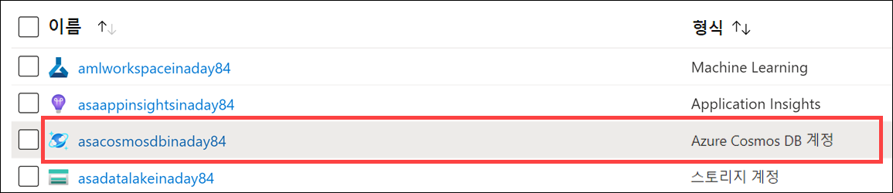

3. 왼쪽 메뉴에서 **기능****(1)**을 선택한 다음 **Azure Synapse Link(2)**를 선택합니다.

    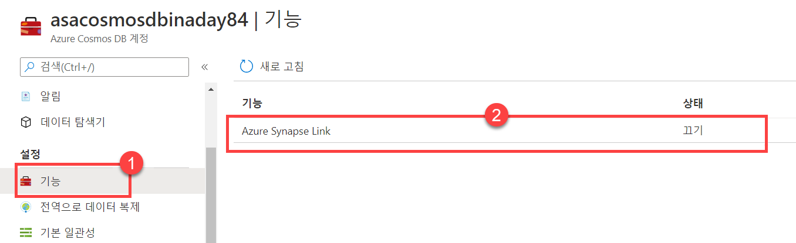

4. **사용**을 선택합니다.

    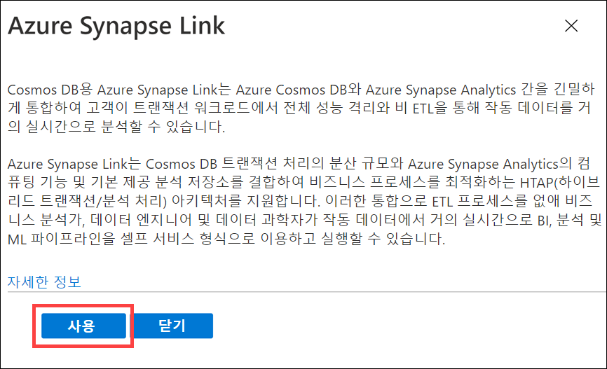

    분석 저장소를 사용하여 Azure Cosmos DB 컨테이너를 만들려면 먼저 Azure Synapse Link를 활성화해야 합니다.

5. 다음 작업을 계속 진행하려면 이 작업이 완료될 때까지 기다려야 합니다. 이 작업을 완료하려면 약 1분 정도 걸립니다. Azure **알림** 아이콘을 선택하여 상태를 확인합니다.

    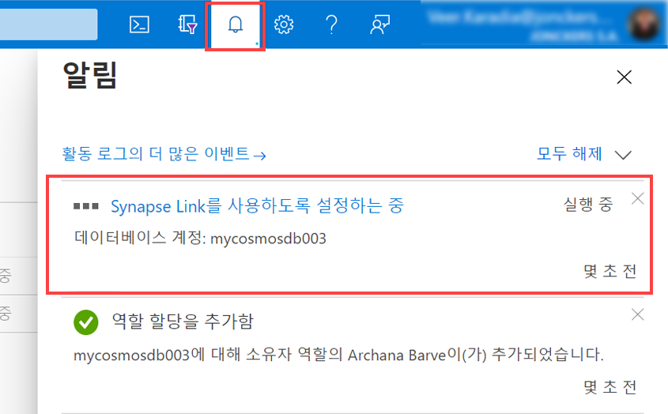

    이 프로세스가 정상적으로 완료되면 "Synapse Link 사용하도록 설정 중" 옆에 녹색 확인 표시가 나타납니다.

    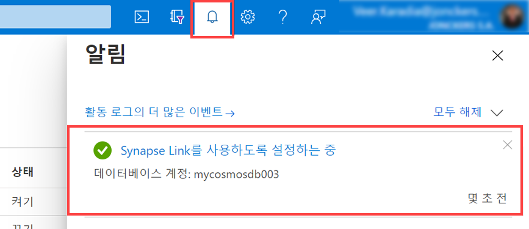

### 작업 2: 새 Azure Cosmos DB 컨테이너 만들기

Tailwind Traders에는 Azure Cosmos DB 컨테이너 `OnlineUserProfile01`이 있습니다. 컨테이너가 이미 생성된 후 Azure Synapse Link 기능을 활성화했으므로 컨테이너에서 분석 저장소를 활성화할 수 없습니다. 파티션 키가 동일한 새 컨테이너를 만들고 분석 저장소를 활성화합니다.

컨테이너를 만든 후 새 Synapse Pipeline을 만들어 OnlineUserProfile01 컨테이너의 데이터를 새 컨테이너에 복사합니다.

1. 왼쪽 메뉴에서 **Data Explorer**를 선택합니다.

    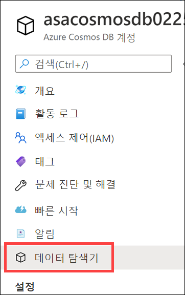

2. **새 컨테이너**를 선택합니다.

    

3. **데이터베이스 ID**에 대해 **기존 항목 사용**을 선택한 다음 **`CustomerProfile`(1)**을 선택합니다. **컨테이너 ID(2)**에 **`UserProfileHTAP`**를 입력하고 **파티션 키(3)**에 **`/userId`**를 입력합니다. **처리량**에 대해** 자동 크기 조정(4)**을 선택한 다음 **최대 RU/s** 값**(5)**으로 **`4000`**을 입력합니다. 마지막으로 **분석 저장소**를 **켜짐(6)**으로 설정하고 **확인**을 선택합니다.

    

    여기서는 `파티션 키` 값을 `customerId`로 설정합니다. 이 필드가 쿼리에 가장 많이 사용되고 적절한 분할 성능을 위해 비교적 높은 카디널리티(고유 값 수)를 포함하기 때문입니다. 최대 값이 4,000RU(요청 단위)인 자동 크기 조정으로 처리량을 설정합니다. 즉, 컨테이너에는 최소 400RU가 할당되고(최대 10%), 스케일링 엔진에서 처리량 증가를 보장하기에 충분한 수요를 감지하면 최대 4,000까지 스케일 업됩니다. 마지막으로, 컨테이너에서 **분석 저장소**를 활성화하면 이를 통해 Synapse Analytics 내에서 하이브리드 HTAP(트랜잭션/분석 처리) 아키텍처를 최대한 활용할 수 있습니다.

    새 컨테이너에 복사할 데이터를 간략히 살펴보겠습니다.

4. **CustomerProfile** 데이터베이스 아래에 있는 `OnlineUserProfile01` 컨테이너를 확장한 다음** 항목(1)**을 선택합니다. 문서 중 하나**(2)**를 선택하고 그 내용을 확인**(3)**합니다. 문서는 JSON 형식으로 저장됩니다.

    

5. 왼쪽 메뉴에서 **키**를 선택**(1)**한 다음 **기본 키** 값**(2)**를 복사하여 나중에 참조할 수 있도록 메모장이나 유사한 텍스트 편집기에 저장합니다. 왼쪽 위에서 Azure Cosmos DB **계정 이름**을 복사**(3)**한 다음 마찬가지로 나중에 참조할 수 있도록 메모장이나 유사한 텍스트 편집기에 저장합니다.

    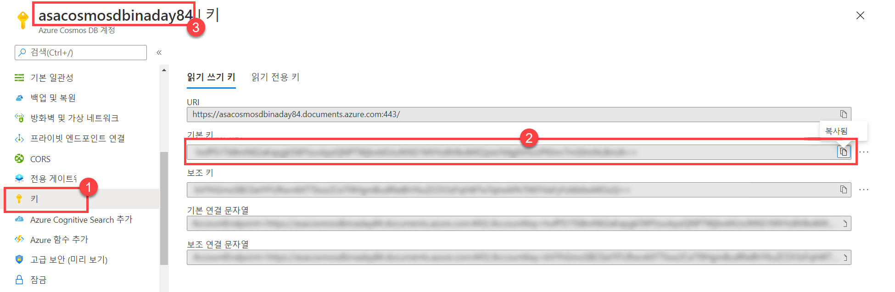

    > **참고**: 이러한 값을 기록해 둡니다. 데모 거의 끝부분에서 SQL 보기를 만들 때 이 정보가 필요합니다.

### 작업 3: 복사 파이프라인 만들기 및 실행

이전 작업에서 분석 저장소를 사용하도록 설정한 새 Azure Cosmos DB 컨테이너를 만들었습니다. 이번에는 Synapse 파이프라인을 사용하여 기존 컨테이너의 내용을 복사해야 합니다.

1. Synapse Studio(<https://web.azuresynapse.net/>)를 열고 **통합** 허브로 이동합니다.

    

2. **+(1)**, **파이프라인(2)**을 차례로 선택합니다.

    

3. 활동 아래에서 `이동 및 변환` 그룹을 확장한 다음 **데이터 복사** 활동을 캔버스**(1)**로 끕니다. 속성 블레이드에서 **이름**을 **`Copy Cosmos DB Container`**로 설정합니다**(2)**.

    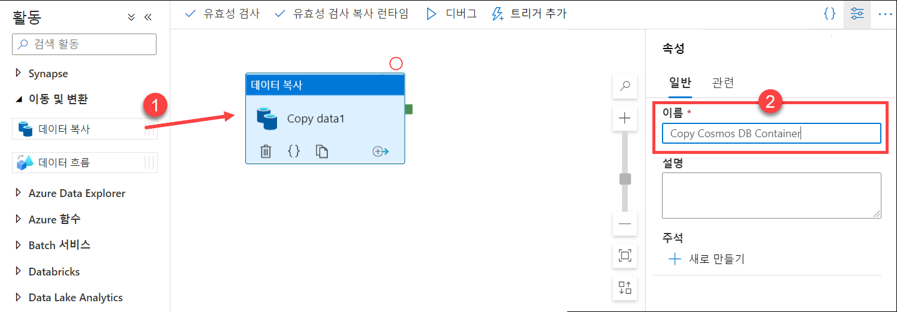

4. 캔버스에 추가한 새 복사 활동을 선택하고 **원본** 탭**(1)**을 선택합니다. 목록에서 **`asal400_customerprofile_cosmosdb`** 원본 데이터 집합**(2)**을 선택합니다.

    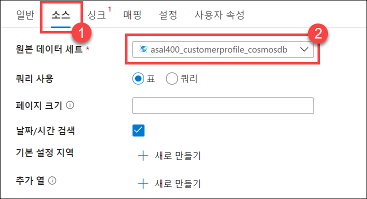

5. **싱크** 탭**(1)**을 선택하고 **+ 새로 만들기(2)**를 선택합니다.

    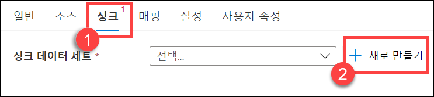

6. **Azure Cosmos DB(SQL API)** 데이터 집합 형식**(1)**을 선택하고 **계속(2)**을 선택합니다.

    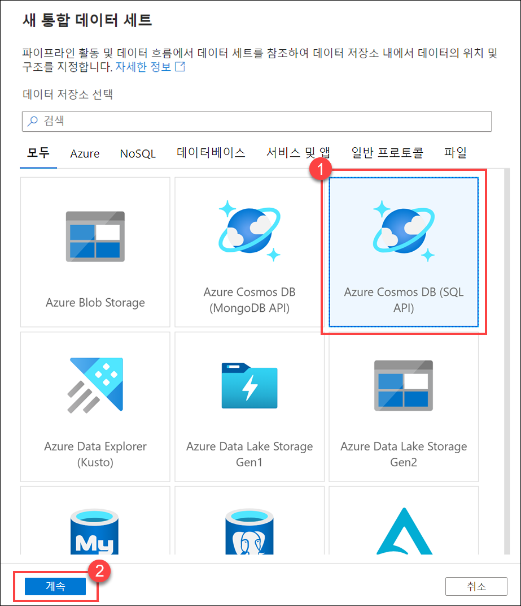

7. **이름**으로 **`cosmos_db_htap`(1)**를 입력합니다. **`asacosmosdb01`(2)** **연결된 서비스**를 선택합니다. **`UserProfileHTAP`(3)** **컬렉션**을 선택합니다. **스키마 가져오기(4)** 아래에서 **연결/저장소에서**를 선택하고 **확인(5)**을 선택합니다.

    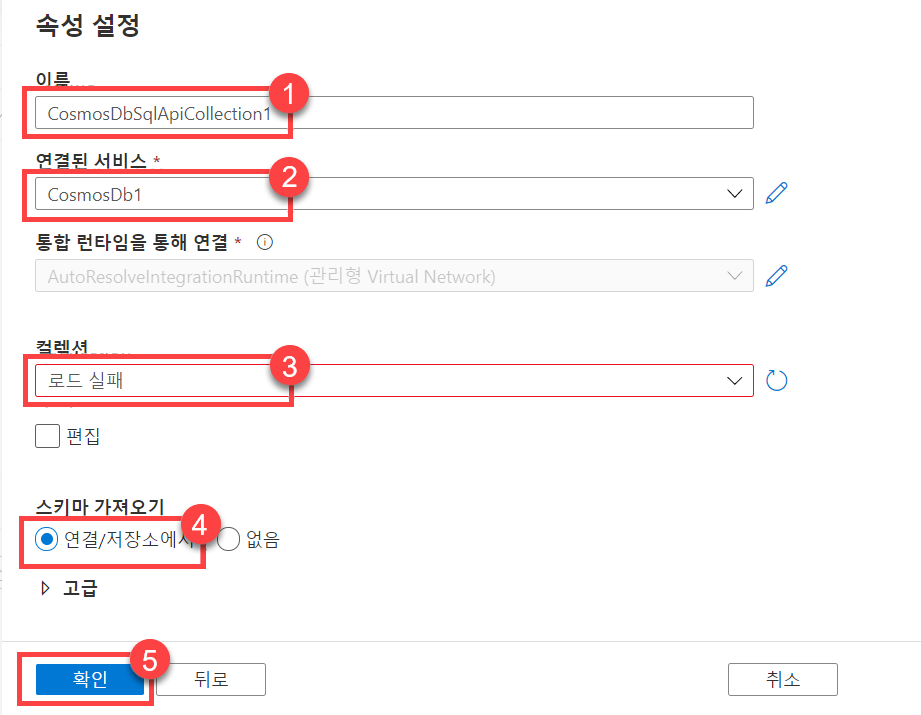

8. 방금 추가한 새 싱크 아래에서 **삽입** 쓰기 동작을 선택합니다.

    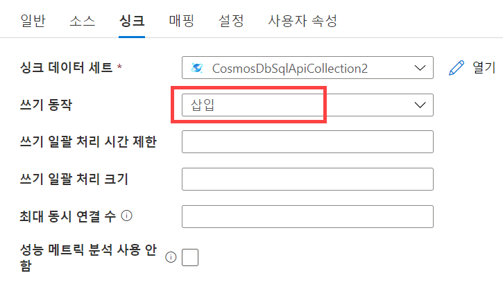

9. **모두 게시**, **게시**를 차례로 선택하여 새 파이프라인을 저장합니다.

    

10. 파이프라인 캔버스 위쪽에서 **트리거 추가(1)**와 **지금 트리거(2)**를 차례로 선택합니다. **확인**을 선택하여 실행을 트리거합니다.

    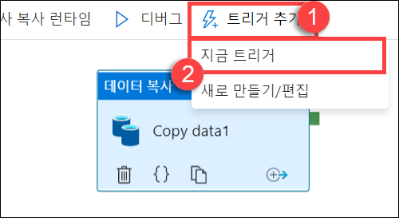

11. **모니터** 허브로 이동합니다.

    

12. **파이프라인 실행(1)**을 선택하고 파이프라인 실행이 정상적으로 완료될 때까지 기다립니다**(2)**. **새로 고침(3)**을 몇 번 선택해야 할 수도 있습니다.

    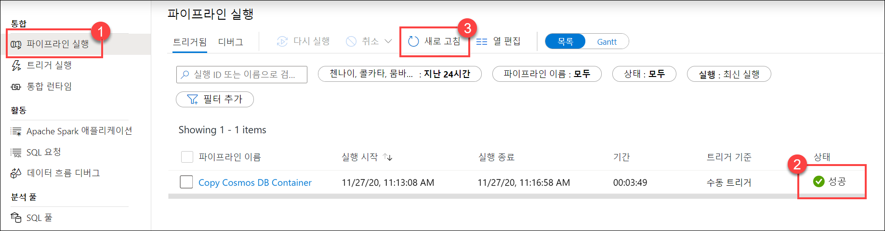

    > 파이프라인 실행을 완료하려면 **4분 정도** 걸릴 수 있습니다. 쿼리가 실행되는 동안 나머지 랩 지침을 확인하여 해당 내용을 숙지하세요.

## 연습 3: Synapse Analytics용 Apache Spark로 Azure Cosmos DB 쿼리

Tailwind Traders는 Apache Spark를 사용하여 새 Azure Cosmos DB 컨테이너를 대상으로 분석 쿼리를 실행하려고 합니다. 이 세그먼트에서는 Synapse Studio의 기본 제공 제스처를 사용하여 Synapse Notebook을 만듭니다. 이 Notebook은 트랜잭션 저장소에 영향을 주지 않고 HTAP 사용 컨테이너의 분석 저장소에서 데이터를 로드합니다.

Tailwind Traders는 각 사용자에게서 확인된 선호 제품 목록과 리뷰 기록의 일치하는 제품 ID를 함께 사용하여 모든 선호 제품 리뷰 목록을 표시하는 방법을 파악하고자 합니다.

### 작업 1: Notebook 만들기

1. **데이터** 허브로 이동합니다.

    

2. **연결됨** 탭**(1)**을 선택하고 **Azure Cosmos DB** 섹션을 확장한 다음 **asacosmosdb01(CustomerProfile)** 연결된 서비스**(2)**를 확장합니다. **UserProfileHTAP** 컨테이너**(3)**를 마우스 오른쪽 단추로 클릭하고 **새 Notebook** 제스처**(4)**를 선택한 다음 **데이터 프레임에 로드(5)**를 선택합니다.

    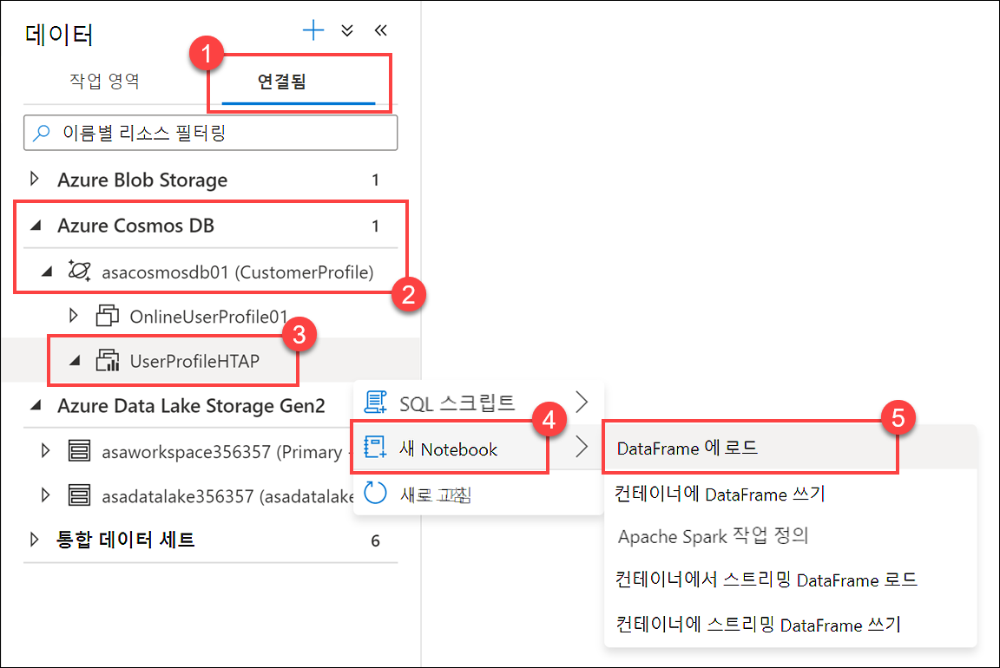

    앞에서 만든 `UserProfileHTAP` 컨테이너의 아이콘은 다른 컨테이너의 아이콘과 약간 다릅니다. 이 아이콘은 분석 저장소가 사용하도록 설정되어 있음을 나타냅니다.

3. 새 Notebook의 **연결 대상** 드롭다운 목록에서 사용자의 Spark 풀을 선택합니다.

    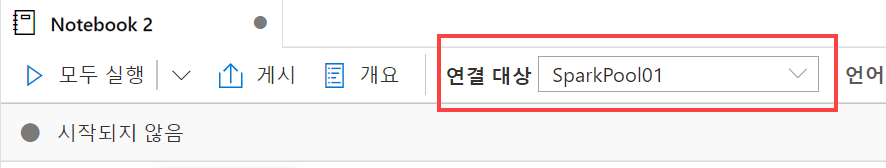

4. **모두 실행(1)**을 선택합니다.

    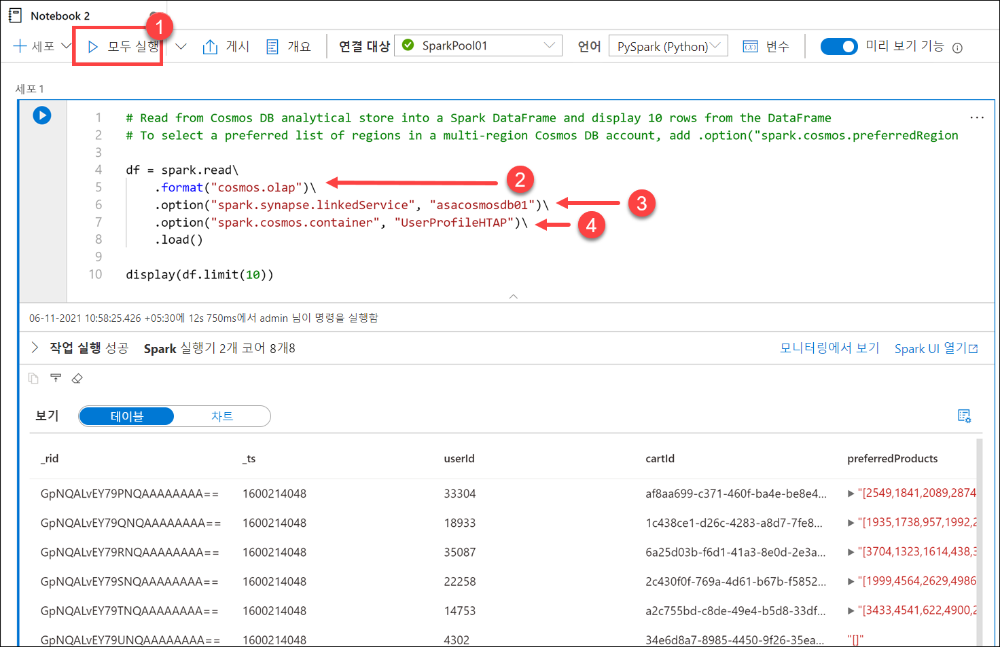

    > Spark 세션을 처음으로 시작하려면 몇 분 정도 걸립니다.

    셀 1 내에 생성된 코드에서는 `spark.read` 형식이 **`cosmos.olap`(2)**로 설정되어 있습니다. 이 형식은 컨테이너의 분석 저장소를 사용하도록 Synapse Link에 명령합니다. 분석 저장소가 아닌 트랜잭션 저장소에 연결하거나 데이터를 변경 피드에서 읽거나 컨테이너에 쓰려는 경우에는 `cosmos.oltp`를 대신 사용하면 됩니다.

    > **참고:** 분석 저장소에 데이터를 쓸 수는 없으며 분석 저장소의 데이터 읽기만 가능합니다. 컨테이너에 데이터를 로드하려면 트랜잭션 저장소에 연결해야 합니다.

    첫 번째 `option`은 Azure Cosmos DB 연결된 서비스**(3)**의 이름을 구성합니다. 두 번째 `option`은 읽으려는 데이터가 있는 Azure Cosmos DB 컨테이너**(4)**를 정의합니다.

5. 실행한 셀 아래쪽의 **+** 단추를 선택하고 **</> 코드 셀**을 선택합니다. 그러면 첫 번째 코드 셀 아래에 새 코드 셀이 추가됩니다.

    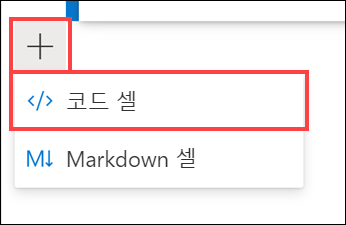

6. 데이터 프레임에는 불필요한 추가 열이 포함되어 있습니다. 불필요한 열을 제거하여 정리된 데이터 프레임 버전을 만들어 보겠습니다. 이렇게 하려면 새 셀에 다음 코드를 입력하고 **실행**합니다.

    ```python
    unwanted_cols = {'_attachments','_etag','_rid','_self','_ts','collectionType','id'}

    # columns 컬렉션에서 불필요한 열 제거
    cols = list(set(df.columns) - unwanted_cols)

    profiles = df.select(cols)

    display(profiles.limit(10))
    ```

    이제 출력에는 원하는 열만 포함됩니다. `preferredProducts`**(1)** 및 `productReviews`**(2)** 열에는 자식 요소가 포함되어 있습니다. 행의 값을 확장하면 자식 요소를 확인할 수 있습니다. 이전 모듈에서 확인한 것처럼, Azure Cosmos DB Data Explorer 내의 `UserProfiles01` 컨테이너에는 원시 JSON 형식이 표시됩니다.

    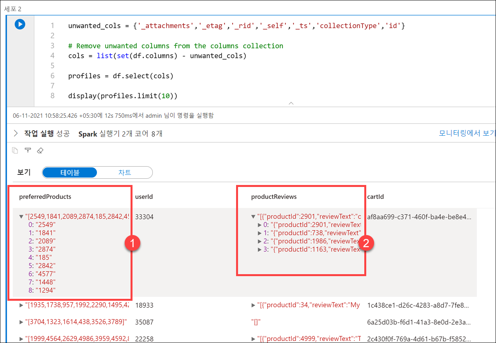

7. 이제 처리해야 하는 레코드 수를 확인해야 합니다. 이렇게 하려면 새 셀에 다음 코드를 입력하고 **실행**합니다.

    ```python
    profiles.count()
    ```

    결과로 레코드 수 10만 개가 표시되어야 합니다.

8. 이제 각 사용자의 `preferredProducts` 열 배열과 `productReviews` 열 배열을 사용하여 사용자의 선호 제품 목록에 포함된 제품 중 사용자가 리뷰를 남긴 제품과 일치하는 제품의 그래프를 만들어야 합니다. 이렇게 하려면 해당 2개 열의 평면화된 값이 들어 있는 새 데이터 프레임 2개를 만들어야 합니다. 그래야 이후 단계에서 두 데이터 프레임을 조인할 수 있습니다. 새 셀에 다음 코드를 입력하고 **실행**합니다.

    ```python
    from pyspark.sql.functions import udf, explode

    preferredProductsFlat=profiles.select('userId',explode('preferredProducts').alias('productId'))
    productReviewsFlat=profiles.select('userId',explode('productReviews').alias('productReviews'))
    display(productReviewsFlat.limit(10))
    ```

    이 셀에서는 특수 PySpark [`explode` 함수](https://spark.apache.org/docs/latest/api/python/pyspark.sql.html?highlight=explode#pyspark.sql.functions.explode)를 가져왔습니다. 이 함수는 배열의 각 요소에 해당하는 새 열을 반환합니다. 이 함수를 사용하면 `preferredProducts` 및 `productReviews` 열을 평면화하여 데이터를 더 쉽게 읽거나 쿼리할 수 있습니다.

    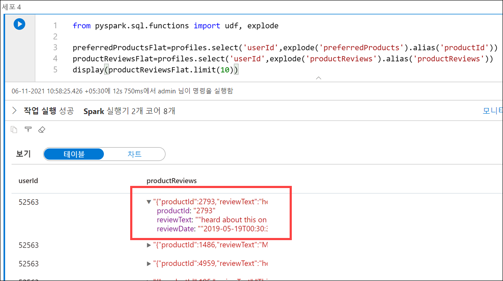

    `productReviewFlat` 데이터 프레임 내용이 표시된 셀 출력을 살펴봅니다. 새 `productReviews` 열에 사용자의 선호 제품 목록과 일치 여부를 확인하려는 `productId`가 포함되어 있으며, 표시 또는 저장하려는 `reviewText`도 포함되어 있습니다.

9. 이제 `preferredProductsFlat` 데이터 프레임의 내용을 살펴보겠습니다. 이렇게 하려면 새 셀에 다음 코드를 입력하고 **실행**합니다.

    ```python
    display(preferredProductsFlat.limit(20))
    ```

    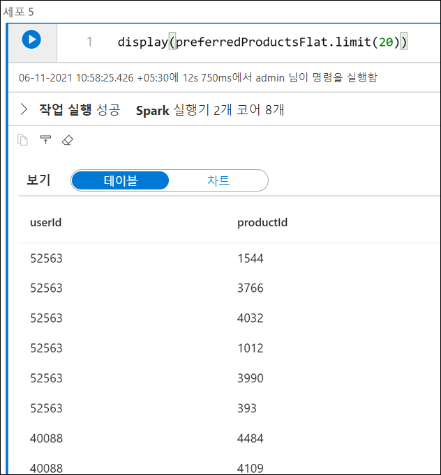

    선호 제품 배열에서 `explode` 함수를 사용했으므로 열 값이 `userId` 및 `productId` 행으로 평면화되어 사용자를 기준으로 순서가 지정되었습니다.

10. 이제 `productReviewFlat` 데이터 프레임 내용을 추가로 평면화하여 `productReviews.productId` 및 `productReviews.reviewText` 필드를 추출하고 각 데이터 조합용으로 새 행을 만들어야 합니다. 이렇게 하려면 새 셀에 다음 코드를 입력하고 **실행**합니다.

    ```python
    productReviews = (productReviewsFlat.select('userId','productReviews.productId','productReviews.reviewText')
        .orderBy('userId'))

    display(productReviews.limit(10))
    ```

    이제 출력에는 각 `userId`에 해당하는 행이 여러 개 표시됩니다.

    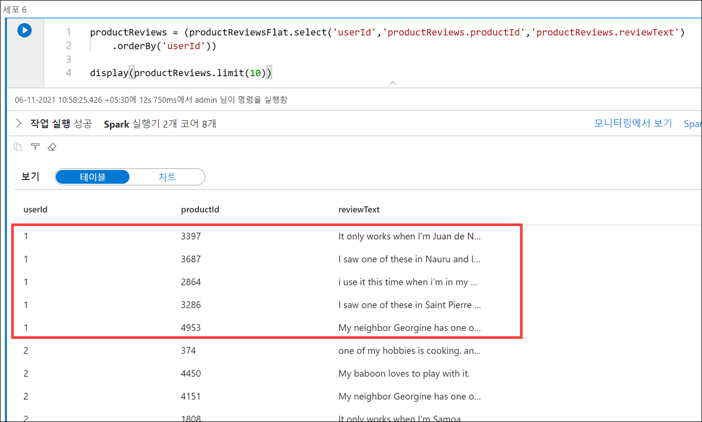

11. 마지막 단계에서는 `userId` 및 `productId` 값에서 `preferredProductsFlat` 및 `productReviews` 데이터 프레임을 조인하여 선호 제품 리뷰 그래프를 작성합니다. 이렇게 하려면 새 셀에 다음 코드를 입력하고 **실행**합니다.

    ```python
    preferredProductReviews = (preferredProductsFlat.join(productReviews,
        (preferredProductsFlat.userId == productReviews.userId) &
        (preferredProductsFlat.productId == productReviews.productId))
    )

    display(preferredProductReviews.limit(100))
    ```

    > **참고**: 테이블 보기에서 열 머리글을 임의로 클릭하여 결과 집합을 정렬합니다.

    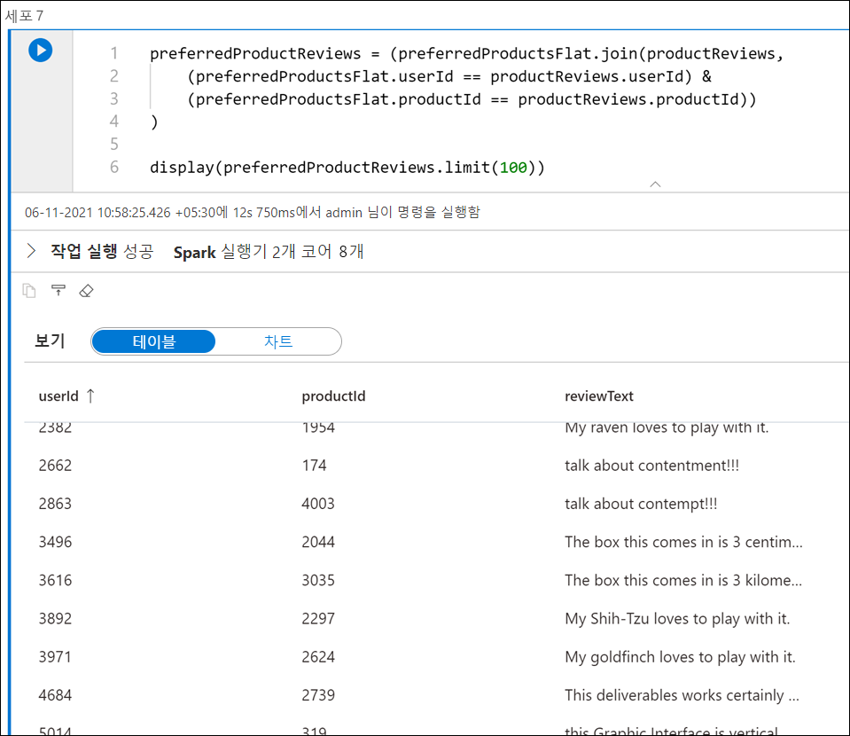

## 연습 4: Azure Synapse Analytics용 서버리스 SQL 풀로 Azure Cosmos DB 쿼리

Tailwind Traders는 T-SQL을 사용하여 Azure Cosmos DB 분석 저장소를 탐색하려고 합니다. 그리고 분석 저장소 탐색용 보기를 만들려고 합니다. 이 보기는 다른 분석 저장소 컨테이너 또는 데이터 레이크의 파일과의 조인에 사용할 수도 있고, Power BI 등의 외부 도구가 액세스할 수도 있습니다.

### 작업 1: 새 SQL 스크립트 만들기

1. **개발** 허브로 이동합니다.

    

2. **+(1)**, **SQL 스크립트(2)**를 차례로 선택합니다.

    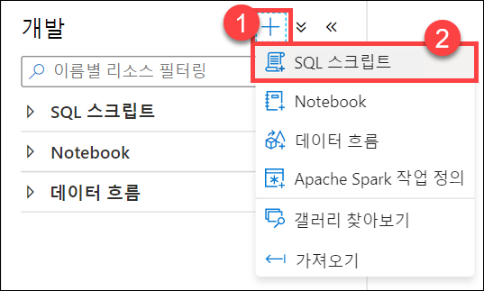

3. 스크립트가 열리면 오른쪽에 **속성** 창**(1)**이 표시됩니다. **이름(2)**으로 **`User Profile HTAP`**를 입력하고 **속성** 단추를 선택하여 창을 숨깁니다**(1)**.

    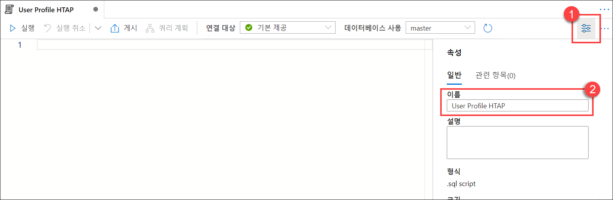

4. 서버리스 SQL 풀(**기본 제공**)이 선택되어 있는지 확인합니다.

    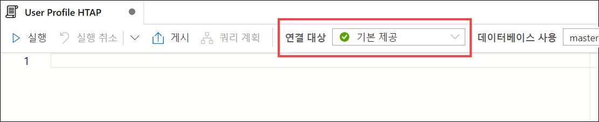

5. 다음 SQL 쿼리를 붙여넣습니다. OPENROWSET 문에서 **`YOUR_ACCOUNT_NAME`**은 사용자의 Azure Cosmos DB 계정 이름으로 바꾸고 **`YOUR_ACCOUNT_KEY`**는 위의 5단계에서 컨테이너를 만든 후에 복사한 Azure Cosmos DB 기본 키 값으로 바꿉니다.

    ```sql
    USE master
    GO

    IF DB_ID (N'Profiles') IS NULL
    BEGIN
        CREATE DATABASE Profiles;
    END
    GO

    USE Profiles
    GO

    DROP VIEW IF EXISTS UserProfileHTAP;
    GO

    CREATE VIEW UserProfileHTAP
    AS
    SELECT
        *
    FROM OPENROWSET(
        'CosmosDB',
        N'account=YOUR_ACCOUNT_NAME;database=CustomerProfile;key=YOUR_ACCOUNT_KEY',
        UserProfileHTAP
    )
    WITH (
        userId bigint,
        cartId varchar(50),
        preferredProducts varchar(max),
        productReviews varchar(max)
    ) AS profiles
    CROSS APPLY OPENJSON (productReviews)
    WITH (
        productId bigint,
        reviewText varchar(1000)
    ) AS reviews
    GO
    ```

    완성된 쿼리는 다음과 같습니다.

    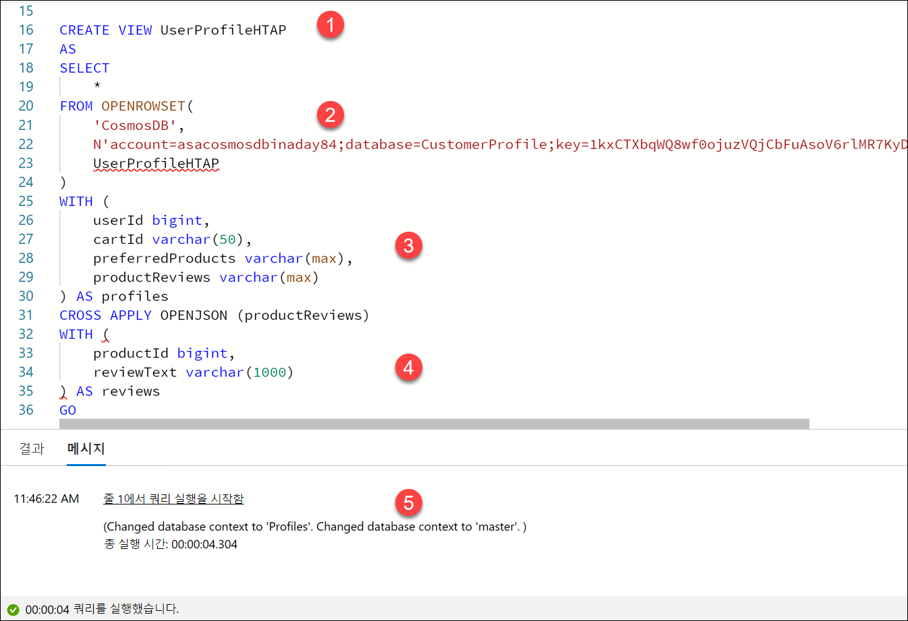

    이 쿼리는 먼저 서버리스 SQL 풀 데이터베이스 `Profiles`가 없으면 새로 만듭니다. 그런 다음 `USE Profiles`를 실행하여 `Profiles` 데이터베이스를 대상으로 나머지 스크립트 내용을 실행합니다. 그런 다음 `UserProfileHTAP` 보기가 있으면 삭제합니다. 그리고 마지막으로 다음 작업을 수행합니다.

    - **1.** SQL 보기 `UserProfileHTAP`를 만듭니다.
    - **2.** `OPENROWSET` 문을 사용하여 데이터 원본 형식을 `CosmosDB`로 설정하고 계정 세부 정보를 설정합니다. 그런 다음 Azure Cosmos DB 분석 저장소 컨테이너 `UserProfileHTAP`를 통해 보기를 만들 것임을 지정합니다.
    - **3.** `WITH` 절을 사용하여 JSON 문서의 속성 이름 일치 여부를 확인한 다음 적절한 SQL 데이터 형식을 적용합니다. `preferredProducts` 및 `productReviews` 필드는 `varchar(max)`로 설정됩니다. 이 두 속성 내에는 모두 JSON 형식 데이터가 포함되어 있기 때문입니다.
    - **4.** JSON 문서의 `productReviews` 속성에는 중첩 하위 배열이 포함되어 있으므로 문서의 모든 속성을 배열의 모든 요소와 "조인"해야 합니다. Synapse SQL에서는 중첩 배열에 `OPENJSON` 함수를 적용하여 중첩 구조를 평면화할 수 있습니다. 앞에서 Synapse Notebook의 Python `explode` 함수를 사용하여 값을 평면화했던 것처럼 여기서도 `productReviews` 내의 값을 평면화합니다.
    - **5.** 출력에 문이 정상적으로 실행되었음이 표시됩니다.

6. **데이터** 허브로 이동합니다.

    

7. **작업 영역** 탭**(1)**을 선택하고 데이터베이스 그룹을 확장합니다. **Profiles** SQL 주문형 데이터베이스**(2)**를 확장합니다. 목록에 이 데이터베이스가 표시되지 않으면 데이터베이스 목록을 새로 고칩니다. 보기를 확장하고 **`UserProfileHTAP`** 보기**(3)**를 마우스 오른쪽 단추로 클릭합니다. **새 SQL 스크립트(4)**, **상위 100개 행 선택(5)**을 차례로 선택합니다.

    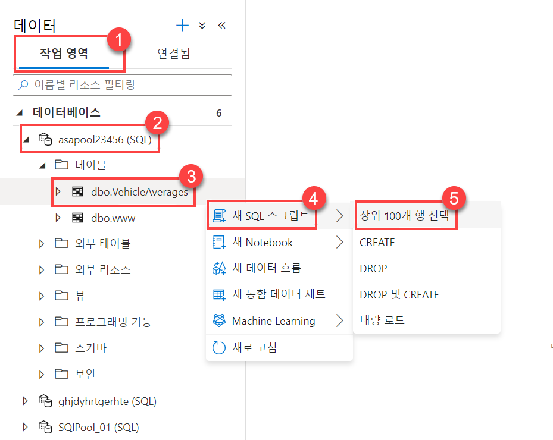

8. 쿼리를 **실행**하여 결과를 확인합니다.

    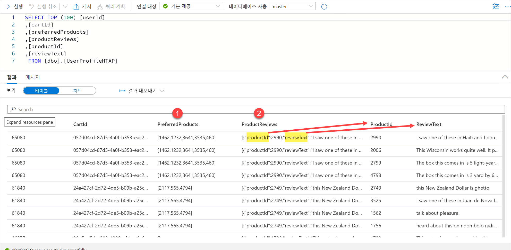

    `preferredProducts`**(1)** 및 `productReviews`**(2)** 필드가 쿼리에 포함되어 있습니다. 이 두 필드에는 모두 JSON 형식 값이 들어 있습니다. 보기에서는 CROSS APPLY OPENJSON 문이 `productId` 및 `reviewText` 값을 새 필드에 추출하여 `productReviews`**(2)** 필드의 중첩 하위 배열 값을 올바르게 평면화했습니다.
