# 모듈 14 - Stream Analytics를 사용하여 실시간 스트림 처리

이 모듈에서는 Azure Stream Analytics를 사용하여 스트리밍 데이터를 처리하는 방법을 알아봅니다. 구체적으로는 Event Hubs에 차량 원격 분석 데이터를 수집한 다음 Azure Stream Analytics의 여러 창 기능을 사용하여 실시간으로 해당 데이터를 처리합니다. 그 후에 Azure Synapse Analytics로 데이터를 출력합니다. 그리고 마지막으로는 처리량을 높이기 위해 Stream Analytics 작업 크기를 조정하는 방법을 알아봅니다.

이 모듈을 완료하면 다음 작업을 수행할 수 있습니다.

- Stream Analytics를 사용하여 Event Hubs에서 실시간 데이터 처리
- Stream Analytics 창 기능을 사용하여 집계를 작성한 다음 Synapse Analytics로 출력
- 분할을 통해 처리량을 높이도록 Azure Stream Analytics 작업 크기 조정
- 병렬 처리 최적화를 위해 스트림 입력 다시 분할

## 랩 세부 정보

- [모듈 14 - Stream Analytics를 사용하여 실시간 스트림 처리](#module-14---real-time-stream-processing-with-stream-analytics)
  - [랩 세부 정보](#lab-details)
  - [기술 개요](#technology-overview)
    - [Azure Stream Analytics](#azure-stream-analytics)
    - [Azure Event Hubs](#azure-event-hubs)
    - [Power BI](#power-bi)
  - [시나리오 개요](#scenario-overview)
  - [랩 설정 및 필수 구성 요소](#lab-setup-and-pre-requisites)
  - [연습 0: 전용 SQL 풀 시작](#exercise-0-start-the-dedicated-sql-pool)
  - [연습 1: 서비스 구성](#exercise-1-configure-services)
    - [작업 1: Event Hubs 구성](#task-1-configure-event-hubs)
    - [작업 2: Synapse Analytics 구성](#task-2-configure-synapse-analytics)
    - [작업 3: Stream Analytics 구성](#task-3-configure-stream-analytics)
  - [연습 2: 데이터 생성 및 시각화](#exercise-2-generate-and-visualize-data)
    - [작업 1: 데이터 생성기 실행](#task-1-run-data-generator)
    - [작업 2: Power BI 대시보드 만들기](#task-2-create-power-bi-dashboard)
    - [작업 3: Synapse Analytics에서 집계 데이터 확인](#task-3-view-aggregate-data-in-synapse-analytics)
  - [연습 3: 정리](#exercise-3-cleanup)
    - [작업 1: 데이터 생성기 중지](#task-1-stop-the-data-generator)
    - [작업 2: Streaming Analytics 작업 중지](#task-2-stop-the-stream-analytics-job)
    - [작업 3: 전용 SQL 풀 일시 중지](#task-3-pause-the-dedicated-sql-pool)

## 기술 개요

### Azure Stream Analytics

다양한 연결된 디바이스 및 센서에서 생성되는 데이터가 갈 수록 늘어남에 따라, 이 데이터를 실시간에 가깝게 실행 가능한 인사이트 및 예측 정보로 변환하는 것은 이제 운영상 불가피한 일입니다. 실시간 애플리케이션 아키텍처와 원활하게 통합되는 [Azure Stream Analytics](https://docs.microsoft.com/azure/stream-analytics/stream-analytics-introduction)는 데이터의 양에 관계없이 데이터에 대한 효율적인 실시간 분석을 지원합니다.

Azure Stream Analytics를 사용하면 대규모 병렬 CEP(복합 이벤트 처리) 파이프라인을 간편하게 개발할 수 있습니다. 즉, Azure Stream Analytics 내에 포함되어 있는 임시 논리 지원 기능을 통해 매우 단순한 선언적 [SQL 형식 언어](https://docs.microsoft.com/stream-analytics-query/stream-analytics-query-language-reference)를 사용하여 유용한 실시간 분석 솔루션을 작성할 수 있습니다. 그리고 광범위한 [즉시 사용 가능 커넥터](https://docs.microsoft.com/azure/stream-analytics/stream-analytics-define-outputs), 고급 디버깅 및 작업 모니터링 기능을 활용하면 솔루션 개발에 필요한 개발자 기술을 대폭 줄여 비용도 절약할 수 있습니다. 뿐만 아니라, Azure Stream Analytics에서는 [JavaScript 사용자 정의 함수](https://docs.microsoft.com/azure/stream-analytics/stream-analytics-javascript-user-defined-functions)를 사용하는 사용자 지정 코드가 지원되므로 SQL로 작성된 스트리밍 논리를 추가로 확장할 수 있습니다.

인프라, 서버, 가상 머신, 클러스터 등을 관리할 필요가 없는 Azure Stream Analytics는 몇 초만에 손쉽게 사용을 시작할 수 있습니다. 어떤 작업에서든 스트리밍 단위 1개~수백 개를 추가하여 [처리 기능을 즉시 스케일 아웃](https://docs.microsoft.com/azure/stream-analytics/stream-analytics-streaming-unit-consumption)할 수 있습니다. 작업당 사용하는 처리 단위에 해당하는 요금만 결제하면 됩니다.

[이벤트 배달이 보장](https://docs.microsoft.com/stream-analytics-query/event-delivery-guarantees-azure-stream-analytics)되며 가용성 99.9%의 엔터프라이즈급 SLA가 제공되는 Azure Stream Analytics는 중요 업무용 워크로드에 적합한 솔루션입니다. 또한 자동화된 검사점이 제공되므로 작업에서 내결함성을 유지할 수 있으며, 데이터 손실 없이 중단된 작업을 빠르게 다시 시작할 수 있습니다.

Azure Stream Analytics를 사용하면 Power BI를 통해 실시간 대시보드를 빠르게 작성하여 라이브 명령 및 제어 보기를 활용할 수 있습니다. [실시간 대시보드](https://docs.microsoft.com/azure/stream-analytics/stream-analytics-power-bi-dashboard)에서는 라이브 데이터를 유용한 인사이트를 제공하는 실행 가능한 시각적 개체로 변환할 수 있으며 가장 중요한 정보를 중점적으로 파악할 수 있습니다.

### Azure Event Hubs

초당 수백만 개의 이벤트를 수집할 수 있는 빅 데이터 파이프라인인 [Azure Event Hubs](https://docs.microsoft.com/azure/event-hubs/event-hubs-about)에서는 HTTPS, AMQP, websocket을 통한 AMQP, Kafka 등의 표준 프로토콜을 사용하여 원격 분석 및 이벤트 스트림 데이터 캡처, 보존, 재생을 원활하게 진행할 수 있습니다. 여러 원본에서 데이터를 동시에 수신할 수 있으며, 최대 20개 소비자 그룹에서 애플리케이션을 통해 원하는 속도로 전체 이벤트 허브를 독립적으로 읽을 수 있습니다.

### Power BI

[Power BI](https://docs.microsoft.com/power-bi/)는 정보를 기반으로 신속한 의사 결정을 내릴 수 있도록 인사이트를 제공하는 비즈니스 분석 서비스입니다. Power BI를 활용하면 데이터를 유용한 시각적 개체로 변환하여 어떤 디바이스에서나 동료와 공유할 수 있습니다. Power BI에서 제공하는 다양한 기능이 포함된 캔버스를 통해 시각적으로 [데이터를 탐색 및 분석](https://docs.microsoft.com/power-bi/service-basic-concepts)할 수 있습니다. Power BI 환경에서는 사용자 지정된 [대시보드](https://docs.microsoft.com/azure/stream-analytics/stream-analytics-power-bi-dashboard) 및 대화형 보고서를 공유하고 이러한 대시보드와 보고서에서 공동 작업을 수행하는 기능이 제공됩니다. 따라서 기본 제공 거버넌스 및 보안 기능을 적용해 조직 전체에서 해당 기능을 활용할 수 있습니다.

## 시나리오 개요

차량 원격 정보를 수집 중인 Contoso Auto는 Event Hubs를 사용하여 원시 형식 데이터를 빠르게 수집 및 저장한 다음 실시간에 가깝게 처리하려고 합니다. 그리고 최종적으로는 처리된 데이터가 수신되면 새 데이터를 반영하여 자동 업데이트되는 대시보드를 만들려고 합니다. 이 대시보드에서는 엔진 과열, 비정상적 유압, 공격적 운전 등의 검색된 변칙을 나타내는 다양한 시각화를 확인하고자 합니다. 지도 등의 구성 요소를 사용하여 도시 내에서 발생하는 변칙을 표시하고, 이러한 정보를 명확하게 보여 주는 다양한 차트와 그래프도 사용할 예정입니다.

이 환경에서는 Azure Event Hubs를 사용해 차량 원격 분석 스트리밍 데이터를 수집합니다. 이렇게 수집된 데이터는 Event Hubs, Azure Stream Analytics 및 Power BI에서 실시간에 가깝게 작성되는 분석 파이프라인을 실행하는 데 사용됩니다. Azure Stream Analytics가 Event Hubs에서 차량 센서 데이터를 추출하고 특정 기간의 데이터 집계를 수행합니다. 그런 다음 데이터 시각화 및 분석을 위해 Azure Synapse Analytics 및 Power BI에 집계된 데이터를 전송합니다. 그리고 차량 원격 분석 데이터 생성기를 사용해 Event Hubs에 차량 원격 분석 데이터를 전송합니다.

## 랩 설정 및 필수 구성 요소

> **참고:** `랩 설정 및 필수 구성 요소` 단계는 호스트형 랩 환경이 **아닌 **자체 Azure 구독을 사용하는 경우에만 완료하세요. 호스트형 랩 환경을 사용하는 경우에는 연습 0부터 바로 진행하면 됩니다.

- Azure 구독
- Power BI 계정(<https://powerbi.microsoft.com>에서 등록)
- [랩 환경 설정](https://github.com/solliancenet/microsoft-data-engineering-ilt-deploy/tree/main/setup/14)

## 연습 0: 전용 SQL 풀 시작

이 랩에서는 전용 SQL 풀을 사용합니다. 그러므로 첫 단계에서는 풀이 일시 중지되지 않았는지를 확인해야 합니다. 풀이 일시 중지되었다면 아래 지침에 따라 풀을 시작합니다.

1. Synapse Studio(<https://web.azuresynapse.net/>)를 엽니다.

2. **관리** 허브를 선택합니다.

    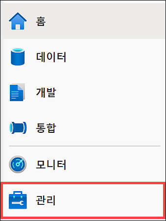

3. 왼쪽 메뉴에서 **SQL 풀**을 선택합니다 **(1)**. 전용 SQL 풀이 일시 중지되어 있으면 풀 이름을 커서로 가리키고 **다시 시작(2)** 을 선택합니다.

    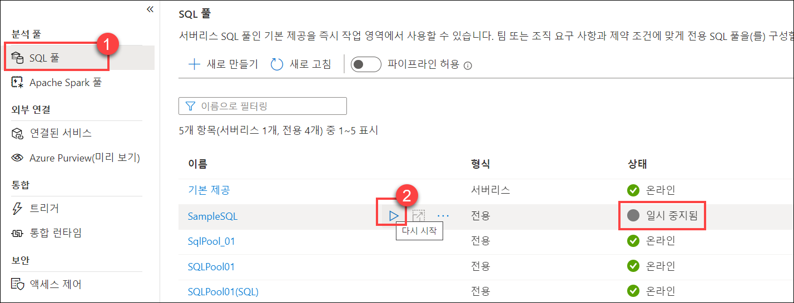

4. 메시지가 표시되면 **다시 시작**을 선택합니다. 풀이 다시 시작되려면 1~2분 정도 걸립니다.

    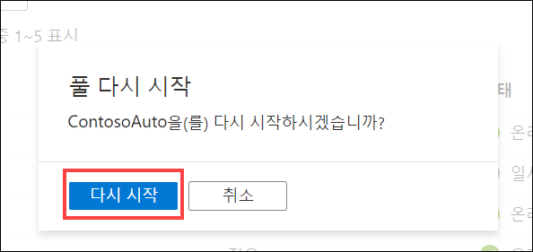

> 전용 SQL 풀이 다시 시작되는 동안 **다음 연습을 계속 진행**합니다.

## 연습 1: 서비스 구성

### 작업 1: Event Hubs 구성

Azure Event Hubs는 초당 이벤트 수백만 개를 수신하고 처리할 수 있는 빅 데이터 스트리밍 플랫폼 및 이벤트 수집 서비스입니다. 여기서는 Azure Event Hubs를 사용하여 차량 원격 분석 데이터를 임시로 저장합니다. 이렇게 저장된 데이터는 실시간 대시보드로 전송할 수 있도록 처리됩니다. 데이터가 Event Hubs로 전송되면 Azure Stream Analytics가 데이터를 쿼리하여 집계를 적용하고 변칙에 태그를 적용합니다. 그런 다음 Azure Synapse Analytics 및 Power BI에 해당 데이터를 전송합니다.

이 작업에서는 제공된 Event Hubs 네임스페이스 내에서 새 이벤트 허브를 만들고 구성합니다. 해당 이벤트 허브는 나중에 작성할 Azure 함수를 통해 처리 및 보강된 차량 원격 분석을 캡처하는 데 사용됩니다.

1. [Azure Portal](https://portal.azure.com)로 이동합니다.

2. 왼쪽 메뉴에서 **리소스 그룹**을 선택합니다. 그런 다음 **ms-dataengineering-14** 리소스 그룹을 선택합니다.

3. 리소스 그룹의 리소스 목록에서 **Event Hubs 네임스페이스**(`eventhubYOUR_UNIQUE_ID`)를 선택합니다.

    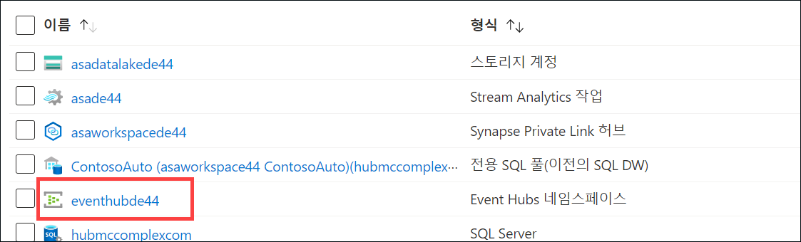

4. Event Hubs 네임스페이스 블레이드의 왼쪽 메뉴 내에서 **Event Hubs**를 선택합니다.

    

5. 목록에서 **원격 분석** 이벤트 허브를 선택합니다.

    

6. 왼쪽 메뉴에서 **공유 액세스 정책**을 선택합니다.

    

7. 위쪽 도구 모음에서 **+ 추가**를 선택하여 새 공유 액세스 정책을 만듭니다.

    

8. **SAS 정책 추가** 블레이드에서 다음 항목을 구성합니다.

    - **이름:** "읽기"를 입력합니다.
    - **관리:** 선택을 취소합니다.
    - **보내기:** 선택을 취소합니다.
    - **수신 대기:** 선택합니다.

    

    > 이벤트 읽기, 쓰기, 관리용으로 각기 별도의 정책을 만드는 것이 좋습니다. 이렇게 하면 최소 권한 원칙에 따라 서비스와 애플리케이션의 권한 없는 작업 수행을 방지할 수 있습니다.

9. 값을 모두 입력한 후 양식 아래쪽의 **만들기**를 선택합니다.

10. 위쪽 도구 모음에서 **+ 추가**를 선택하여 새 공유 액세스 정책을 만듭니다.

    

11. **SAS 정책 추가** 블레이드에서 다음 항목을 구성합니다.

    - **이름:** "쓰기"를 입력합니다.
    - **관리:** 선택을 취소합니다.
    - **보내기:** 선택합니다.
    - **수신 대기:** 선택을 취소합니다.

    

12. 값을 모두 입력한 후 양식 아래쪽의 **만들기**를 선택합니다.

13. 목록에서 **쓰기** 정책을 선택합니다. 필드 오른쪽의 복사 단추를 선택하여 **연결 문자열 - 기본 키** 값을 복사합니다. 나중에 사용할 수 있도록 메모장 또는 유사한 텍스트 편집기에 **이 값을 저장**합니다.

    

### 작업 2: Synapse Analytics 구성

Azure Synapse는 SQL 데이터 웨어하우징, 빅 데이터 분석 및 데이터 통합 기능이 환경 하나에 통합되어 있는 엔드투엔드 분석 플랫폼입니다. 사용자는 이 플랫폼에서 모든 데이터에 빠르게 액세스하여 인사이트를 파악할 수 있으므로 성능과 확장성을 업계 최고 수준으로 대폭 개선할 수 있습니다.

이 작업에서는 Synapse 전용 SQL 풀에 테이블을 만듭니다. Event Hubs에서 수집한 차량 원격 분석을 처리하는 Stream Analytics 작업에서 제공되는 집계 차량 데이터를 이 테이블에 저장합니다.

1. [Azure Portal](https://portal.azure.com)로 이동합니다.

2. 왼쪽 메뉴에서 **리소스 그룹**을 선택합니다. 그런 다음 **ms-dataengineering-14** 리소스 그룹을 선택합니다.

3. 리소스 그룹의 리소스 목록에서 **Synapse 작업 영역**(`asaworkspaceYOUR_UNIQUE_ID`)를 선택합니다.

    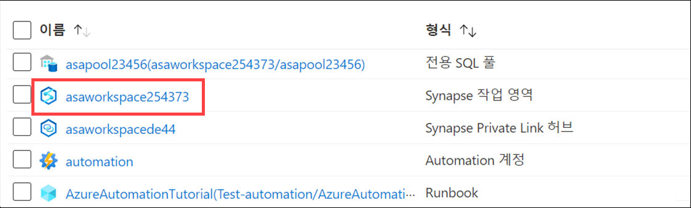

4. 개요 창 안에 있는 **Synapse Studio 열기** 상자 내의 **열기**를 선택합니다.

    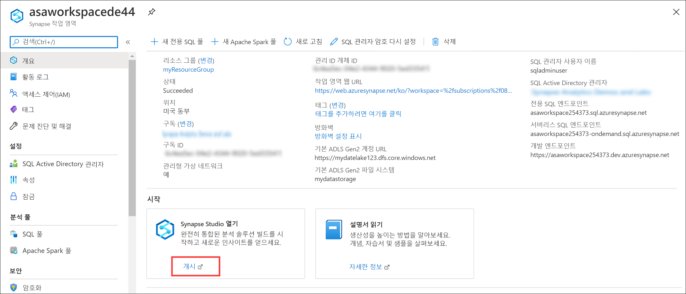

5. Synapse Studio 내의 왼쪽 메뉴에서 **데이터**를 선택하여 데이터 허브로 이동합니다.

    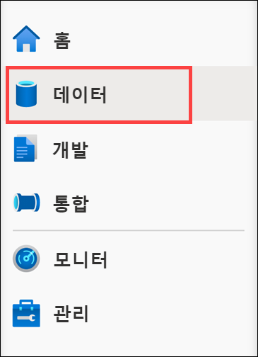

6. **작업 영역** 탭**(1)**을 선택하고 데이터베이스를 확장한 다음 **ContosoAuto(2)**를 마우스 오른쪽 단추로 클릭합니다. **새 SQL 스크립트(3)**, **빈 스크립트(4)**를 차례로 선택합니다.

    

7. 스크립트가 `ContosoAuto`에 연결되어 있는지 확인한 후 스크립트를 다음 코드로 바꾸고 **실행**을 선택하여 새 테이블을 만듭니다.

    ```sql
    CREATE TABLE dbo.VehicleAverages
    ( 
        [AverageEngineTemperature] [float] NOT  NULL,
        [AverageSpeed] [float] NOT  NULL,
        [Snapshot] [datetime] NOT  NULL
    )
    WITH
    (
        DISTRIBUTION = ROUND_ROBIN,
        CLUSTERED COLUMNSTORE INDEX
    )
    GO
    ```

    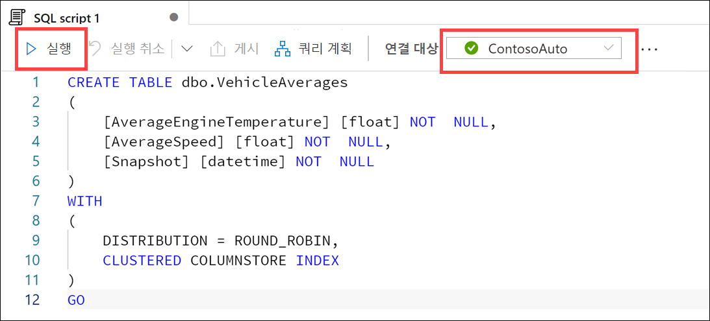

### 작업 3: Stream Analytics 구성

Azure Stream Analytics는 장치에서 대량의 데이터 스트리밍을 검사할 수 있는 이벤트 처리 엔진입니다. 들어오는 데이터는 장치, 센서, 웹 사이트, 소셜 미디어 피드, 애플리케이션 등에서 수집할 수 있습니다. 또한 데이터 스트림에서 정보 추출, 패턴 식별 및 관계도 지원합니다. 그런 다음 이러한 패턴을 사용하여 경고 만들기, 보고 도구에 정보를 피드하거나 나중에 사용할 수 있도록 저장하는 등의 다른 작업을 다운스트림으로 트리거할 수 있습니다.

이 작업에서는 원본으로 만든 이벤트 허브를 사용하도록 Stream Analytics를 구성하고 해당 데이터를 쿼리 및 분석합니다. 그런 다음 보고용으로 Power Bi에 해당 데이터를 전송하고, 집계된 데이터를 Azure Synapse Analytics에 전송합니다.

1. [Azure Portal](https://portal.azure.com)로 이동합니다.

2. 왼쪽 메뉴에서 **리소스 그룹**을 선택합니다. 그런 다음 **ms-dataengineering-14** 리소스 그룹을 선택합니다.

3. 리소스 그룹의 리소스 목록에서 **Stream Analytics 작업**(`asaYOUR_UNIQUE_ID`)를 선택합니다.

    

4. Stream Analytics 작업 내의 왼쪽 메뉴에서 **스토리지 계정 설정**을 선택한 후 **스토리지 계정 추가**를 선택합니다. 여기서는 출력 중 하나로 Synapse Analytics를 사용할 것이므로 먼저 작업 스토리지 계정을 구성해야 합니다.

    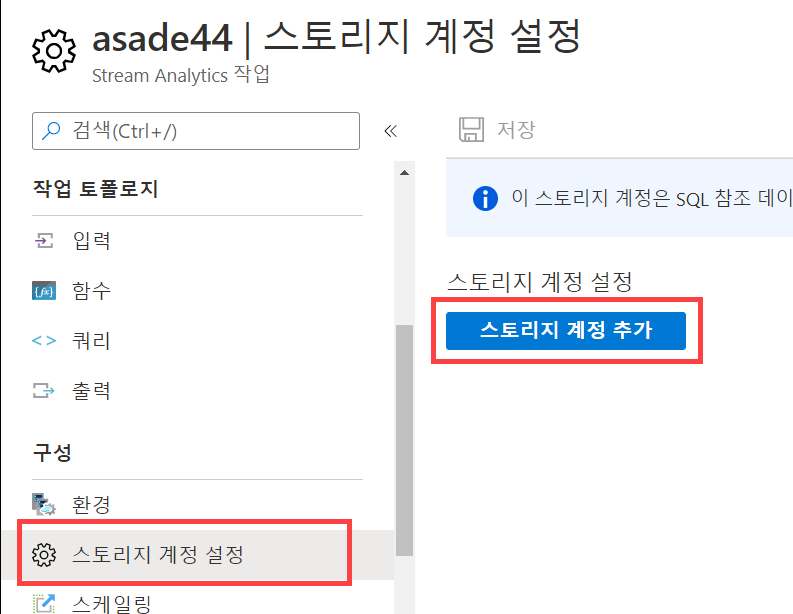

5. **스토리지 계정 설정** 양식에서 다음 항목을 구성합니다.

   - **구독에서 스토리지 계정을 선택합니다.:** 선택합니다.
   - **구독:** 이 랩에 사용 중인 구독이 선택되어 있는지 확인합니다.
   - **스토리지 계정:** 스토리지 계정 **asadatalakeYOUR_UNIQUE_ID**를 선택합니다.
   - **인증 모드:** "연결 문자열"을 선택합니다.

   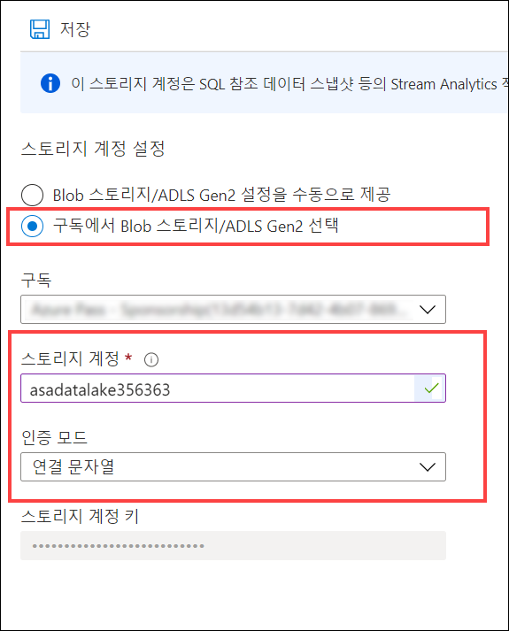

6. 메시지가 표시되면 **저장**, **예**를 차례로 선택하여 스토리지 계정 설정을 저장합니다.

7. Stream Analytics 작업 내의 왼쪽 메뉴 내에서 **입력**을 선택합니다.

    

8. 위쪽 도구 모음에서 **+ 스트림 입력 추가**를 선택한 다음 **이벤트 허브**를 선택하여 새 이벤트 허브 입력을 만듭니다.

    

9. **새 입력** 블레이드에서 다음 항목을 구성합니다.

    - **이름:** "eventhub"를 입력합니다.
    - **구독에서 이벤트 허브를 선택합니다.:** 선택합니다.
    - **구독:** 이 랩에 사용 중인 구독이 선택되어 있는지 확인합니다.
    - **이벤트 허브 네임스페이스:** 이 랩에 사용 중인 이벤트 허브 네임스페이스를 선택합니다.
    - **이벤트 허브 이름:** **기존 항목 사용**을 선택하고 앞에서 만든 **원격 분석**을 선택합니다.
    - **이벤트 허브 소비자 그룹:** **기존 항목 사용**을 선택하고 **$Default**를 선택합니다.
    - **인증 모드:** **연결 문자열**을 선택합니다.
    - **이벤트 허브 정책 이름:** **기존 항목 사용**을 선택하고 **읽기**를 선택합니다.
    - 나머지 값은 모두 기본값을 그대로 유지합니다.

    

10. 값을 모두 입력한 후 양식 아래쪽의 **저장**을 선택합니다.

11. Stream Analytics 작업 블레이드 내의 왼쪽 메뉴 내에서 **출력**을 선택합니다.

    

12. 위쪽 도구 모음에서 **+ 추가**를 선택한 다음 **Power BI**를 선택하여 새 Power BI 출력을 만듭니다.

    

13. **새 출력** 블레이드에서 **권한 부여** 단추를 선택하여 Stream Analytics에서 Power BI 계정으로의 연결에 권한을 부여합니다.

    

14. 메시지가 표시되면 Power BI 계정에 로그인합니다. 이 계정은 랩용으로 제공되었으며 Azure Portal에 로그인하는 데 사용한 것과 같은 사용자 이름 및 암호입니다.

    

15. Power BI 계정에 정상적으로 로그인되면 새 출력 블레이드가 업데이트되여 현재 권한이 부여되어 있음이 표시됩니다.

    

16. **새 출력** 블레이드에서 다음 항목을 구성합니다.

    - **출력 별칭:** `powerBIAlerts`를 입력합니다.
    - **인증 모드:** "사용자 토큰"을 선택합니다.
    - **그룹 작업 영역:** "내 작업 영역"을 선택합니다(이 옵션이 표시되지 않으면 "사용자 토큰" 인증 모드를 먼저 선택합니다).
    - **데이터 집합 이름:** `ContosoAutoVehicleAnomalies`를 입력합니다.
    - **테이블 이름:** `Alerts`를 입력합니다.

    

17. 값을 모두 입력한 후 양식 아래쪽의 **저장**을 선택합니다.

18. 위쪽 도구 모음에서 **+ 추가**를 선택한 다음 **Azure Synapse Analytics(이전 명칭 SQL DW)**를 선택하여 새 Synapse Analytics 출력을 만듭니다.

    

19. **새 출력** 블레이드에서 다음 항목을 구성합니다.

    - **출력 별칭:** "synapse"를 입력합니다.
    - **구독에서 Azure Synapse Analytics를 선택합니다.:** 선택합니다.
    - **구독:** 이 랩에 사용 중인 구독을 선택합니다.
    - **데이터베이스:** "ContosoAuto"를 선택합니다. "서버 이름" 아래에 정확한 Synapse 작업 영역 이름이 표시되어 있는지 확인합니다.
    - **테이블:** `dbo.VehicleAverages`를 입력합니다.
    - **인증 모드:** "연결 문자열"을 선택합니다.
    - **사용자 이름:** `asa.sql.admin`을 입력합니다.
    - **암호:** 암호 `P4ssw.rd` 또는 랩 환경 배포 시 입력한 SQL 관리자 암호 값 또는 호스트된 랩 환경의 일부로 제공된 암호를 입력합니다. **참고**: 이 암호는 Azure Portal에 로그인하는 데 사용한 암호와 다를 것입니다.

    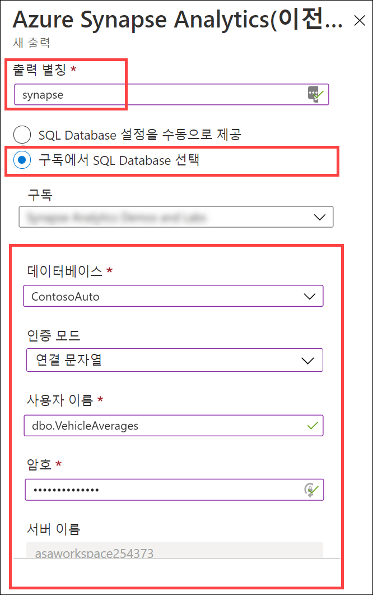

20. 값을 모두 입력한 후 양식 아래쪽의 **저장**을 선택합니다.

21. Stream Analytics 작업 블레이드 내의 왼쪽 메뉴 내에서 **쿼리**를 선택합니다.

    

22. **쿼리** 창의 내용을 지운 다음 편집하여 다음 코드를 대신 붙여넣습니다.

    ```sql
    WITH
        Averages AS (
        select
            AVG(engineTemperature) averageEngineTemperature,
            AVG(speed) averageSpeed
        FROM
            eventhub TIMESTAMP BY [timestamp]
        GROUP BY
            TumblingWindow(Duration(second, 2))
    ),
    Anomalies AS (
        select
            t.vin,
            t.[timestamp],
            t.city,
            t.region,
            t.outsideTemperature,
            t.engineTemperature,
            a.averageEngineTemperature,
            t.speed,
            a.averageSpeed,
            t.fuel,
            t.engineoil,
            t.tirepressure,
            t.odometer,
            t.accelerator_pedal_position,
            t.parking_brake_status,
            t.headlamp_status,
            t.brake_pedal_status,
            t.transmission_gear_position,
            t.ignition_status,
            t.windshield_wiper_status,
            t.abs,
            (case when a.averageEngineTemperature >= 405 OR a.averageEngineTemperature <= 15 then 1 else 0 end) as enginetempanomaly,
            (case when t.engineoil <= 1 then 1 else 0 end) as oilanomaly,
            (case when (t.transmission_gear_position = 'first' OR
                t.transmission_gear_position = 'second' OR
                t.transmission_gear_position = 'third') AND
                t.brake_pedal_status = 1 AND
                t.accelerator_pedal_position >= 90 AND
                a.averageSpeed >= 55 then 1 else 0 end) as aggressivedriving
        from eventhub t TIMESTAMP BY [timestamp]
        INNER JOIN Averages a ON DATEDIFF(second, t, a) BETWEEN 0 And 2
    ),
    VehicleAverages AS (
        select
            AVG(engineTemperature) averageEngineTemperature,
            AVG(speed) averageSpeed,
            System.TimeStamp() as snapshot
        FROM
            eventhub TIMESTAMP BY [timestamp]
        GROUP BY
            TumblingWindow(Duration(minute, 2))
    )
    -- INSERT INTO POWER BI
    SELECT
        *
    INTO
        powerBIAlerts
    FROM
        Anomalies
    where aggressivedriving = 1 OR enginetempanomaly = 1 OR oilanomaly = 1
    -- INSERT INTO SYNAPSE ANALYTICS
    SELECT
        *
    INTO
        synapse
    FROM
        VehicleAverages
    ```

    

    이 쿼리는 2초 동안의 엔진 온도와 속도 평균을 계산합니다. 그런 다음 이전 단계의 평균 값을 비롯한 모든 원격 분석 데이터를 선택하고 다음 변칙을 새 필드로 지정합니다.

    a. **enginetempanomaly**: 평균 엔진 온도가 405도 이상이거나 15도 미만인 상태입니다.

    b. **oilanomaly**: 엔진 오일의 유압이 1 이하인 상태입니다.

    c. **aggressivedriving**: 변속기 기어 위치가 1단, 2단, 3단이고 브레이크 페달 상태는 1, 가속기 페달 위치는 90 이상이며 평균 속도가 55km 이상인 상태입니다.

    이 쿼리는 anomalies 단계의 모든 필드를 `powerBIAlerts` 출력에 표시합니다. 이 출력에서는 보고용으로 aggressivedriving = 1, enginetempanomaly = 1 또는 oilanomaly = 1 상태가 표시됩니다. 또한 `TumblingWindow(Duration(minute, 2))`를 사용하여 지난 2분 동안의 모든 차량 평균 엔진 온도 및 속도도 집계한 다음 `synapse` 출력에 해당 필드를 표시합니다.

23. 쿼리 업데이트를 완료한 후 위쪽 도구 모음에서 **쿼리 저장**을 선택합니다.

24. Stream Analytics 작업 블레이드 내의 왼쪽 메뉴 내에서 **개요**를 선택합니다. 개요 블레이드의 위쪽에서 **시작**을 선택합니다.

    

25. 작업 시작 블레이드가 표시되면 작업 출력 시작 시간으로 **지금**을 선택하고 **시작**을 선택합니다. 그러면 Stream Analytics 작업이 시작되어 나중에 이벤트를 처리하여 Power BI로 전송하는 과정을 시작할 수 있는 상태가 됩니다.

    

## 연습 2: 데이터 생성 및 시각화

### 작업 1: 데이터 생성기 실행

데이터 생성기 콘솔 애플리케이션은 다양한 차량(VIN(차량 ID 번호)으로 표시됨)을 대상으로 시뮬레이션된 차량 센서 원격 분석을 작성하여 Event Hubs로 직접 전송합니다. 데이터 생성기가 이 과정을 정상적으로 진행할 수 있도록 하려면 먼저 이벤트 허브 연결 문자열을 사용하여 데이터 생성기를 구성해야 합니다.

이 작업에서는 데이터 생성기를 구성 및 실행합니다. 데이터 생성기는 Event Hubs에 시뮬레이션된 차량 원격 분석 데이터를 저장합니다. 그리고 보강된 데이터를 집계 및 분석하여 Bower BI 및 Synapse Analytics에 전송하라는 알림을 Stream Analytics 작업에 전송합니다. 이어지는 작업의 마지막 단계에서는 Power BI 보고서를 만듭니다.

1. 랩 VM 또는 컴퓨터에서 [TransactionGeneratorExecutable.zip](https://solliancepublicdata.blob.core.windows.net/dataengineering/dp-203/TransactionGeneratorExecutable.zip) 파일을 다운로드합니다.

2. 컴퓨터의 zip 파일의 압축을 풀고 압축을 푼 위치를 적어 둡니다.

3. 압축을 푼 파일이 포함되어 있는 폴더를 열고 사용 중인 환경에 따라 `linux-x64`, `osx-x64` 또는 `win-x64` 하위 폴더를 엽니다.

4. 해당 하위 폴더 내에서 **appsettings.json** 파일을 엽니다. `EVENT_HUB_CONNECTION_STRING` 옆에 `telemetry` 이벤트 허브 연결 문자열 값을 붙여넣습니다. 다음과 같이 값을 따옴표("")로 묶어야 합니다. 파일을 **저장**합니다.

    

    `SECONDS_TO_LEAD`는 차량 원격 분석 데이터를 전송하기 전에 대기할 시간입니다. 기본값은 `0`입니다.

    `SECONDS_TO_RUN`은 데이터 전송을 중지할 때까지 생성기 실행을 허용할 최대 시간입니다. 기본값은 `1800`입니다. 생성기가 실행 중인 상태에서 Ctrl+C를 누르거나 창을 닫아도 데이터 전송이 중지됩니다.

5. 사용 중인 플랫폼에 따라 다음 방법 중 하나를 사용하여 데이터 생성기를 실행합니다.

   1. Windows:

      * `win-x64` 폴더 내의 **TransactionGenerator.exe**를 실행합니다.

   2. Linux:

      * `linux-x64` 폴더로 이동합니다.
      * `chmod 777 DataGenerator`를 실행하여 이진 파일 액세스 권한을 제공합니다.
      * `./DataGenerator`를 실행합니다.

   3. MacOS:

      * 새 터미널을 엽니다.
      * `osx-x64` 디렉터리로 이동합니다.
      * `./DataGenerator`를 실행합니다.

6. Windows를 사용하고 데이터 생성기 실행을 시도한 후 대화 상자가 표시되는 경우 **추가 정보**, **실행**을 차례로 선택합니다.

    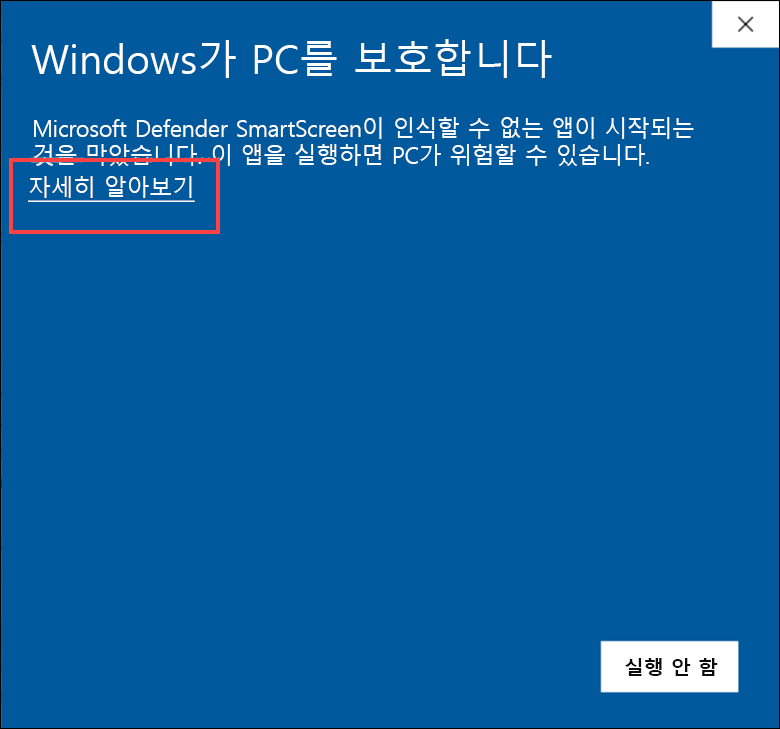

    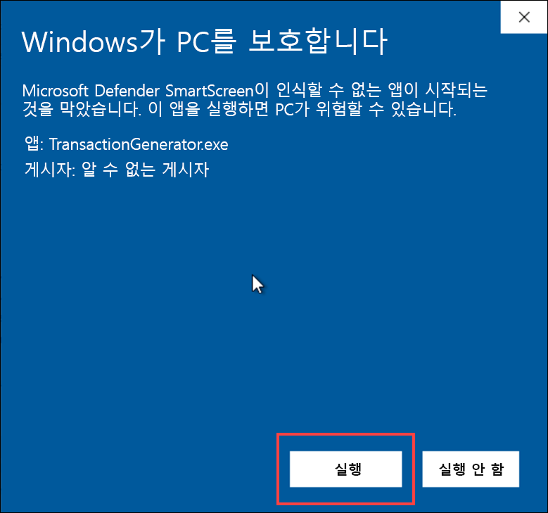

6.  새 콘솔 창이 열리고 몇 초 후에 데이터 전송이 시작됩니다. Event Hubs로 데이터가 전송되고 있음을 확인한 후 창을 _최소화_하여 백그라운드에서 계속 실행합니다.

    

    500개 레코드의 전송이 요청될 때마다 출력 통계가 표시됩니다.

### 작업 2: Power BI 대시보드 만들기

이 작업에서는 Power BI를 사용하여 캡처된 차량 변칙 데이턱가 표시되는 보고서를 만듭니다. 그런 다음 실시간에 가깝게 업데이트 가능하도록 라이브 대시보드에 해당 보고서를 고정합니다.

1. 웹 브라우저를 열고 <https://powerbi.microsoft.com/>으로 이동합니다. 오른쪽 위의 **로그인**을 선택합니다.

    

2. Stream Analytics용 Power BI 출력을 만들 때 사용한 Power BI 자격 증명을 입력합니다.

3. 로그인한 후 왼쪽 메뉴에서 **내 작업 영역**을 선택합니다.

    

4. 작업 영역 위쪽에서 **데이터 집합 + 데이터 흐름** 탭을 선택합니다. **ContosoAutoVehicleAnomalies** 데이터 집합을 찾은 후 이름 오른쪽의 **보고서 만들기** 작업 단추를 선택합니다. 이 데이터 집합이 표시되지 않으면 몇 분 정도 기다렸다가 페이지를 새로 고쳐야 할 수 있습니다.

    

    > **참고:** 데이터 집합이 표시되려면 몇 분 정도 걸릴 수 있습니다. 페이지를 주기적으로 새로 고쳐야 데이터 집합 탭이 표시될 수도 있습니다.

5. 몇 분 정도 지나면 맨 오른쪽에 필드 목록이 있는 VehicleAnomalies의 비어 있는 새 보고서가 표시됩니다.

    

6. 오른쪽의 시각화 섹션 내에서 **지도** 시각화를 선택합니다..

    

7. **city** 필드를 **위치**로 끌고 **aggressivedriving**을 **크기**로 끕니다. 그러면 공격적 운전 레코드의 수에 따라 지도의 여러 도시에 각기 크기가 다른 점이 표시됩니다.

    

8. 그러면 다음과 같은 지도가 표시됩니다.

    

9. 보고서의 빈 곳을 선택하여 지도를 선택 취소합니다. 그런 다음 **트리맵** 시각화를 선택합니다.

    

10. **enginetemperature** 필드를 **값**으로 끌고 **transmission_gear_position** 필드를 **그룹**으로 끕니다. 그러면 트리맵에서 변속기 기어 위치를 기준으로 엔진 온도 값이 그룹화됩니다. 따라서 최고 또는 최저 엔진 온도와 연관된 기어 위치를 확인할 수 있습니다. 트리맵에서는 값에 따라 그룹 크기가 설정되어 가장 큰 그룹이 왼쪽 위에, 가장 작은 그룹이 오른쪽 아래에 표시됩니다.

    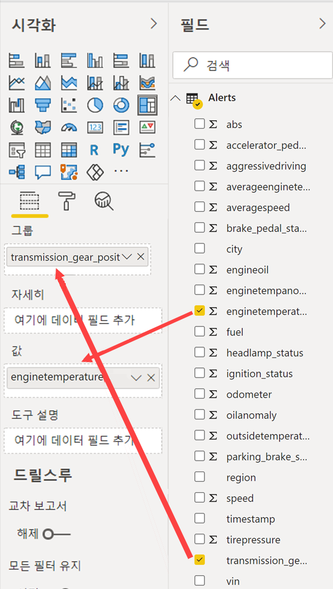

11. **값** 아래에서 **enginetemperature** 필드 옆에 있는 아래쪽 화살표를 선택합니다. 메뉴에서 **평균**을 선택하여 합계가 아닌 평균을 기준으로 값을 집계합니다.

    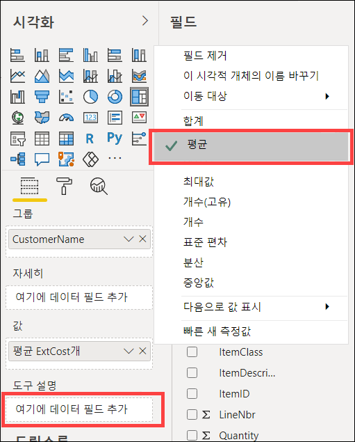

12. 그러면 다음과 같은 트리맵이 표시됩니다.

    

13. 보고서의 빈 곳을 선택하여 트리맵을 선택 취소합니다. 그런 다음 **영역 차트** 시각화를 선택합니다.

    

14. **region** 필드를 **범례**로, **speed** 필드를 **값**으로, **timestamp** 필드를 **축**으로 끕니다. 그러면 각 지역, 그리고 운전자가 해당 지역 내에서 운전을 한 기간별 속도를 나타내는 여러 색이 지정된 영역 차트가 표시됩니다.

    

15. **값** 아래에서 **speed** 필드 옆에 있는 아래쪽 화살표를 선택합니다. 메뉴에서 **평균**을 선택하여 합계가 아닌 평균을 기준으로 값을 집계합니다.

    

16. 그러면 다음과 같은 영역 차트가 표시됩니다.

    

17. 보고서의 빈 곳을 선택하여 영역 차트를 선택 취소합니다. 그런 다음 **여러 행 카드** 시각화를 선택합니다.

    

18. **aggressivedriving** 필드, **enginetempanomaly** 및 **oilanomaly** 필드를 **필드**로 끕니다.

    

19. 여러 행 카드 설정에서 **서식** 탭을 선택하고 **데이터 레이블**을 확장합니다. **텍스트 크기**를 30으로 설정합니다. **범주 레이블**을 확장하고 **텍스트 크기**를 12로 설정합니다.

    

20. 그러면 다음과 같은 여러 행 카드가 표시됩니다.

    

21. 페이지의 오른쪽 위에서 **저장**을 선택합니다.

    

22. "Contoso Auto Vehicle Anomalies" 등의 이름을 입력하고 **저장**을 선택합니다.

    

23. 이제 대시보드에 이 보고서를 추가해 보겠습니다. 보고서 위쪽의 **대시보드에 고정**을 선택합니다(줄임표 ...를 선택해야 해당 옵션이 표시될 수도 있음).

    

24. **새 대시보드**를 선택하고 "Contoso Auto Vehicle Anomalies 대시보드" 등의 이름을 입력합니다. **라이브 고정**을 선택합니다. 메시지가 표시되면 대시보드를 표시하는 옵션을 선택합니다. 왼쪽 메뉴의 내 대시보드에서 대시보드를 확인할 수도 있습니다.

    

25. 데이터를 캡처하면 라이브 대시보드가 자동으로 새로 고쳐져 업데이트됩니다. 차트에서 원하는 지점을 가리키면 항목 관련 정보를 확인할 수 있습니다. 평균 속도 차트 위쪽의 범례에서 지역 중 하나를 선택합니다. 그러면 기타 모든 차트가 해당 지역을 기준으로 자동 필터링됩니다. 지역을 다시 클릭하면 필터가 해제됩니다.

    

### 작업 3: Synapse Analytics에서 집계 데이터 확인

Stream Analytics에서 쿼리를 만들 때 2분 간격으로 엔진 온도 및 차량 속도 데이터를 집계하여 Synapse Analytics에 해당 데이터를 저장했습니다. 즉, Stream Analytics 쿼리에서는 서로 다른 간격으로 여러 출력에 데이터를 쓸 수 있습니다. Synapse Analytics 전용 SQL 풀에 데이터를 쓰면 ETL/ELT 프로세스를 진행하지 않고도 데이터 웨어하우스의 일부분으로 기록 집계 데이터와 최신 집계 데이터를 모두 보존할 수 있습니다.

이 작업에서는 Synapse Analytics 내에서 변칙 데이터를 확인합니다.

1. **TransactionGenerator**를 아직 중지하지 않았으면 **중지**합니다.

2. [Azure Portal](https://portal.azure.com)로 이동합니다.

3. 왼쪽 메뉴에서 **리소스 그룹**을 선택합니다. 그런 다음 **ms-dataengineering-14** 리소스 그룹을 선택합니다.

4. 리소스 그룹의 리소스 목록에서 **Synapse 작업 영역**(`asaworkspaceYOUR_UNIQUE_ID`)를 선택합니다.

    

5. 개요 창 안에 있는 **Synapse Studio 열기** 상자 내의 **열기**를 선택합니다.

    

6. Synapse Studio 내의 왼쪽 메뉴에서 **데이터**를 선택하여 데이터 허브로 이동합니다.

    

7. **작업 영역** 탭**(1)**을 선택하고 `ContosoAuto` 데이터베이스와 `테이블`을 차례로 확장한 다음 **dbo.VehicleAverages** 테이블**(2)**을 마우스 오른쪽 단추로 클릭합니다. 이 테이블이 목록에 표시되지 않으면 테이블 목록을 새로 고칩니다. **새 SQL 스크립트(3)**, **상위 100개 행 선택(4)**을 차례로 선택합니다.

    

8. 쿼리 결과를 표시하여 `AverageEngineTemperature` 및 `AverageSpeed`에 저장되어 있는 집계 데이터를 살펴봅니다. 이 두 레코드에서는 `Snapshot` 값이 2분 간격으로 변경됩니다.

   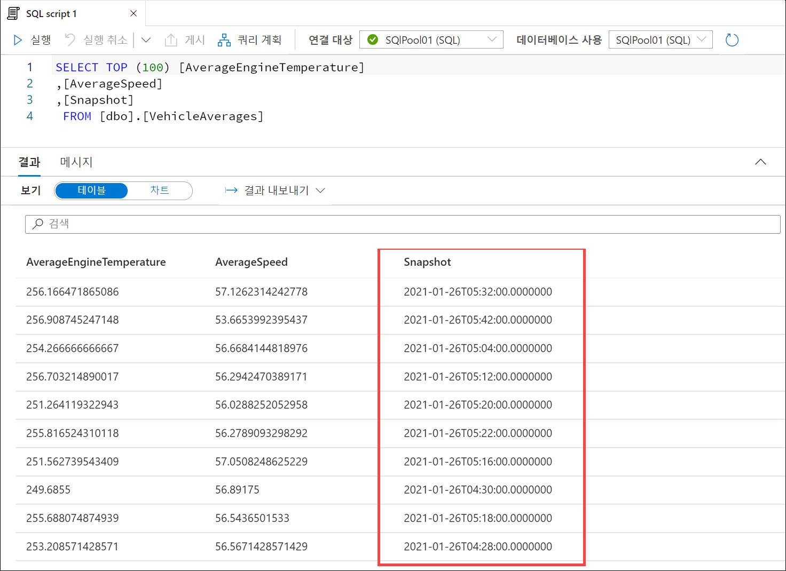

9. 결과 출력에서 **차트** 뷰를 선택하고 차트 종류를 **영역**으로 설정합니다. 이 시각화에는 시간별 평균 온도와 상관 관계가 지정된 평균 엔진 온도가 표시됩니다. 여러 차트 설정을 적용해 보시기 바랍니다.

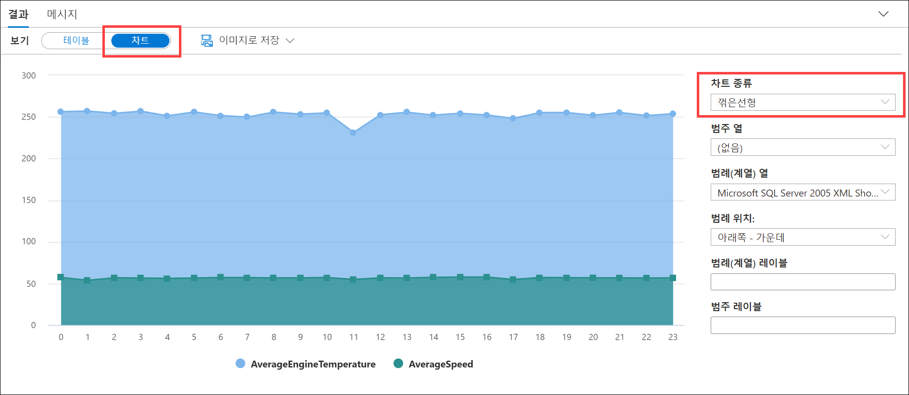

## 연습 3: 정리

다음 단계를 완료하여 데이터 생성기를 중지하고 더 이상 필요없는 리소스를 정리할 수 있습니다.

### 작업 1: 데이터 생성기 중지

1. 데이터 생성기가 실행 중인 콘솔/터미널 창으로 돌아갑니다. 생성기를 중지하려면 창을 닫습니다.

### 작업 2: Streaming Analytics 작업 중지

1. Azure Portal에서 Stream Analytics 작업으로 이동합니다.

2. 개요 창에서 **중지**를 선택한 다음 메시지가 표시되면 **예**를 선택합니다.

    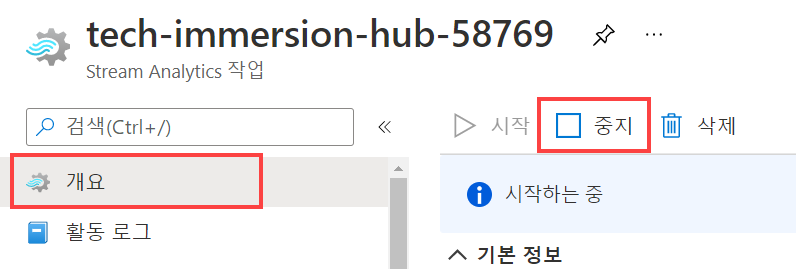

### 작업 3: 전용 SQL 풀 일시 중지

1. Synapse Studio(<https://web.azuresynapse.net/>)를 엽니다.

2. **관리** 허브를 선택합니다.

    

3. 왼쪽 메뉴에서 **SQL 풀**을 선택합니다 **(1)**. 전용 SQL 풀의 이름을 마우스 커서로 가리키고 **일시 중지(2)** 를 선택합니다.

    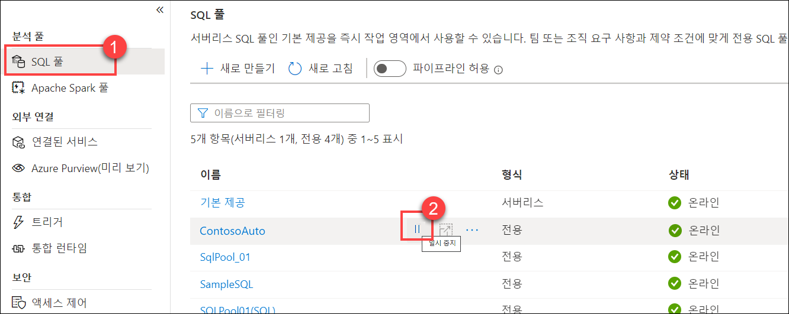

4. 메시지가 표시되면 **일시 중지**를 선택합니다.

    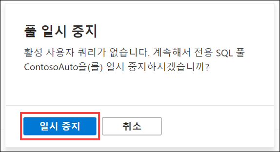
