# 모듈 16 - Azure Synapse Analytics와 Power BI를 통합하여 보고서 작성

이 모듈에서는 Synapse 작업 영역을 Power BI와 통합하여 Power BI에서 보고서를 작성하는 방법을 알아봅니다. 구체적으로는 Synapse Studio에서 새 데이터 원본과 Power BI 보고서를 만듭니다. 그런 다음 구체화된 뷰와 결과 집합 캐싱을 사용하여 쿼리 성능을 개선하는 방법을 알아봅니다. 그리고 마지막으로 서버리스 SQL 풀이 포함된 데이터 레이크를 살펴보고, Power BI에서 해당 데이터의 시각화를 만듭니다.

이 모듈을 완료하면 다음 작업을 수행할 수 있습니다.

- Synapse 작업 영역과 Power BI 통합
- Power BI와의 통합 최적화
- 구체화된 뷰와 결과 집합 캐싱을 사용하여 쿼리 성능 개선
- SQL 서버리스를 사용하여 데이터를 시각화하고 Power BI 보고서 만들기

## 랩 세부 정보

- [모듈 16 - Azure Synapse Analytics와 Power BI를 통합하여 보고서 작성](#module-16---build-reports-using-power-bi-integration-with-azure-synapse-analytics)
  - [랩 세부 정보](#lab-details)
  - [이 랩에서 사용하는 리소스 명명 방법](#resource-naming-throughout-this-lab)
  - [랩 설정 및 필수 구성 요소](#lab-setup-and-pre-requisites)
  - [연습 0: 전용 SQL 풀 시작](#exercise-0-start-the-dedicated-sql-pool)
  - [연습 1: Power BI 및 Synapse 작업 영역 통합](#exercise-1-power-bi-and-synapse-workspace-integration)
    - [작업 1: Power BI에 로그인](#task-1-login-to-power-bi)
    - [작업 2: Power BI 작업 영역 만들기](#task-2-create-a-power-bi-workspace)
    - [작업 3: Synapse에서 Power BI에 연결](#task-3-connect-to-power-bi-from-synapse)
    - [작업 4: Synapse Studio의 Power BI 연결된 서비스 살펴보기](#task-4-explore-the-power-bi-linked-service-in-synapse-studio)
    - [작업 5: Power BI Desktop에서 사용할 새 데이터 원본 만들기](#task-5-create-a-new-datasource-to-use-in-power-bi-desktop)
    - [작업 6: Synapse Studio에서 새 Power BI 보고서 만들기](#task-6-create-a-new-power-bi-report-in-synapse-studio)
  - [연습 2: Power BI와의 통합 최적화](#exercise-2-optimizing-integration-with-power-bi)
    - [작업 1: Power BI 최적화 옵션 살펴보기](#task-1-explore-power-bi-optimization-options)
    - [작업 2: 구체화된 뷰를 사용하여 성능 개선](#task-2-improve-performance-with-materialized-views)
    - [작업 3: 결과 집합 캐싱을 사용하여 성능 개선](#task-3-improve-performance-with-result-set-caching)
  - [연습 3: SQL 서버리스를 사용하여 데이터 시각화](#exercise-3-visualize-data-with-sql-serverless)
    - [작업 1: SQL 서버리스를 사용하여 데이터 레이크 살펴보기](#task-1-explore-the-data-lake-with-sql-serverless)
    - [작업 2: SQL 서버리스를 사용하여 데이터를 시각화하고 Power BI 보고서 만들기](#task-2-visualize-data-with-sql-serverless-and-create-a-power-bi-report)
  - [연습 4: 정리](#exercise-4-cleanup)
    - [작업 1: 전용 SQL 풀 일시 중지](#task-1-pause-the-dedicated-sql-pool)

## 이 랩에서 사용하는 리소스 명명 방법

이 가이드의 뒷부분에서는 다양한 ASA 관련 리소스에 다음과 같은 용어가 사용됩니다(각 용어는 실제 이름과 값으로 바꿔야 함).

| Azure Synapse Analytics 리소스  | 사용되는 용어 |
| --- | --- |
| 작업 영역/작업 영역 이름 | `Workspace` |
| Power BI 작업 영역 이름 | `Synapse 01` |
| SQL 풀 | `SqlPool01` |
| 랩 스키마 이름 | `pbi` |

## 랩 설정 및 필수 구성 요소

> **참고:** `랩 설정 및 필수 구성 요소` 단계는 호스트된 랩 환경이 **아닌** 자체 Azure 구독을 사용하는 경우에만 완료하세요. 호스트된 랩 환경을 사용하는 경우에는 연습 0부터 바로 진행하면 됩니다.

랩 컴퓨터나 VM에 [Power BI Desktop](https://www.microsoft.com/download/details.aspx?id=58494)을 설치합니다.

이 모듈의 **[랩 설정 지침](https://github.com/solliancenet/microsoft-data-engineering-ilt-deploy/blob/main/setup/04/README.md)에 나와 있는 작업을 완료**하세요.

다음 모듈에서도 이 모듈과 같은 환경을 사용합니다.

- [모듈 4](labs/04/README.md)
- [모듈 5](labs/05/README.md)
- [모듈 7](labs/07/README.md)
- [모듈 8](labs/08/README.md)
- [모듈 9](labs/09/README.md)
- [모듈 10](labs/10/README.md)
- [모듈 11](labs/11/README.md)
- [모듈 12](labs/12/README.md)
- [모듈 13](labs/13/README.md)
- [모듈 16](labs/16/README.md)

## 연습 0: 전용 SQL 풀 시작

이 랩에서는 전용 SQL 풀을 사용합니다. 그러므로 첫 단계에서는 풀이 일시 중지되지 않았는지를 확인해야 합니다. 풀이 일시 중지되었다면 아래 지침에 따라 풀을 시작합니다.

1. Synapse Studio(<https://web.azuresynapse.net/>)를 엽니다.

2. **관리** 허브를 선택합니다.

    

3. 왼쪽 메뉴에서 **SQL 풀**을 선택합니다 **(1)**. 전용 SQL 풀이 일시 중지되어 있으면 풀 이름을 커서로 가리키고 **다시 시작(2)** 을 선택합니다.

    

4. 메시지가 표시되면 **다시 시작**을 선택합니다. 풀이 다시 시작되려면 1~2분 정도 걸립니다.

    

> 전용 SQL 풀이 다시 시작되는 동안 **다음 연습을 계속 진행**합니다.

## 연습 1: Power BI 및 Synapse 작업 영역 통합

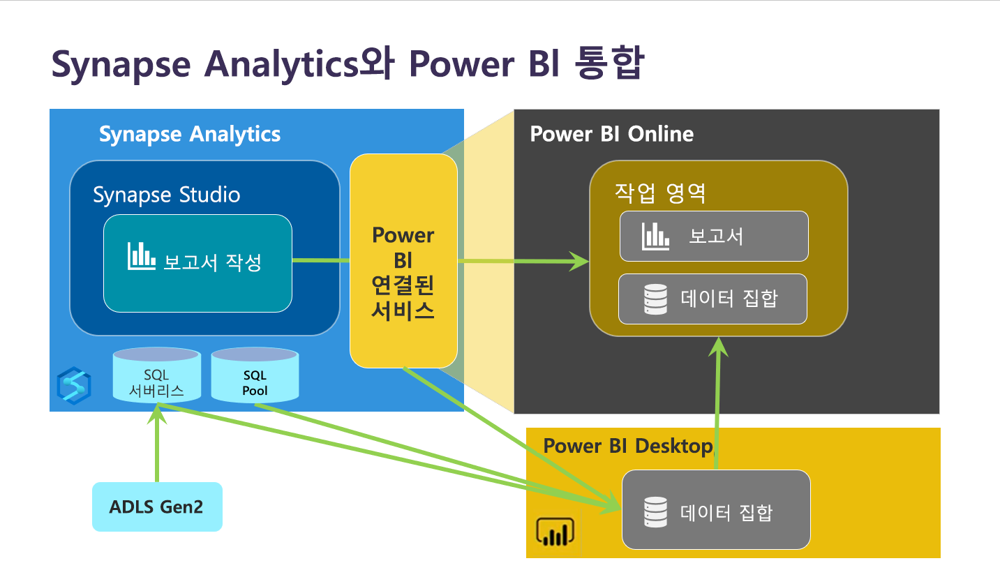

### 작업 1: Power BI에 로그인

1. 새 브라우저 탭에서 <https://powerbi.microsoft.com/>으로 이동합니다.

2. 오른쪽 위의 **로그인** 링크를 선택하여 Azure에 로그인하는 데 사용하는 것과 같은 계정으로 로그인합니다.

3. 이 계정에 처음 로그인하는 경우 기본 옵션을 사용하여 설정 마법사를 완료합니다.

### 작업 2: Power BI 작업 영역 만들기

1. **작업 영역**, **작업 영역 만들기**를 차례로 선택합니다.

    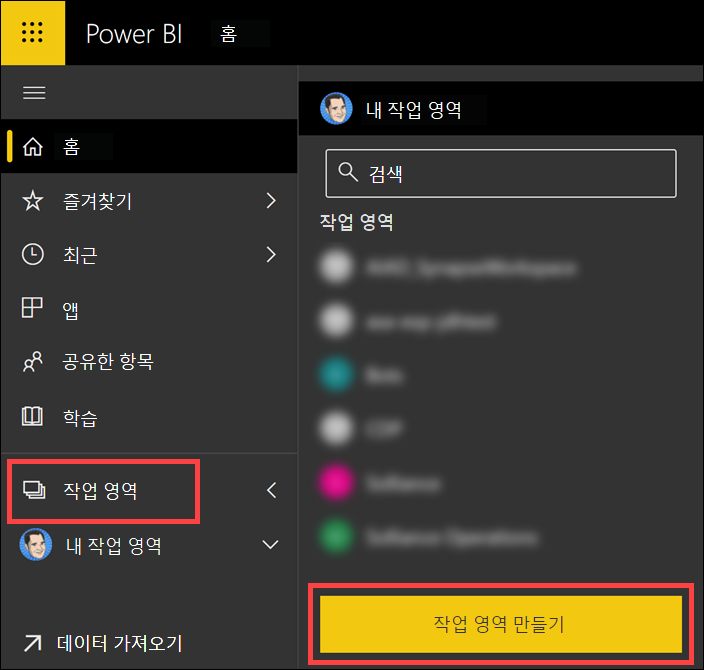

2. Power BI Pro로 업그레이드하라는 메시지가 표시되면 **무료 체험**을 선택합니다.

    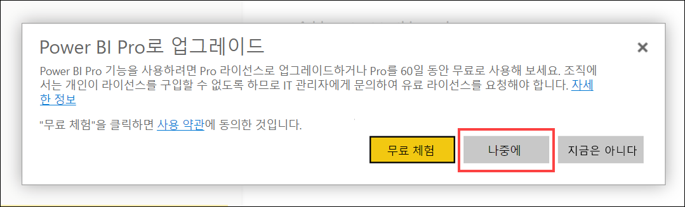

    **확인**을 선택하여 Pro 구독을 확인합니다.

    

3. 작업 영역 이름을 **synapse-training**으로 지정하고 **저장**을 선택합니다. `synapse-training`을 이름으로 지정할 수 없다는 메시지가 표시되면 사용자의 이니셜이나 기타 문자를 추가하여 조직 내에서 고유한 작업 영역 이름을 지정합니다.

    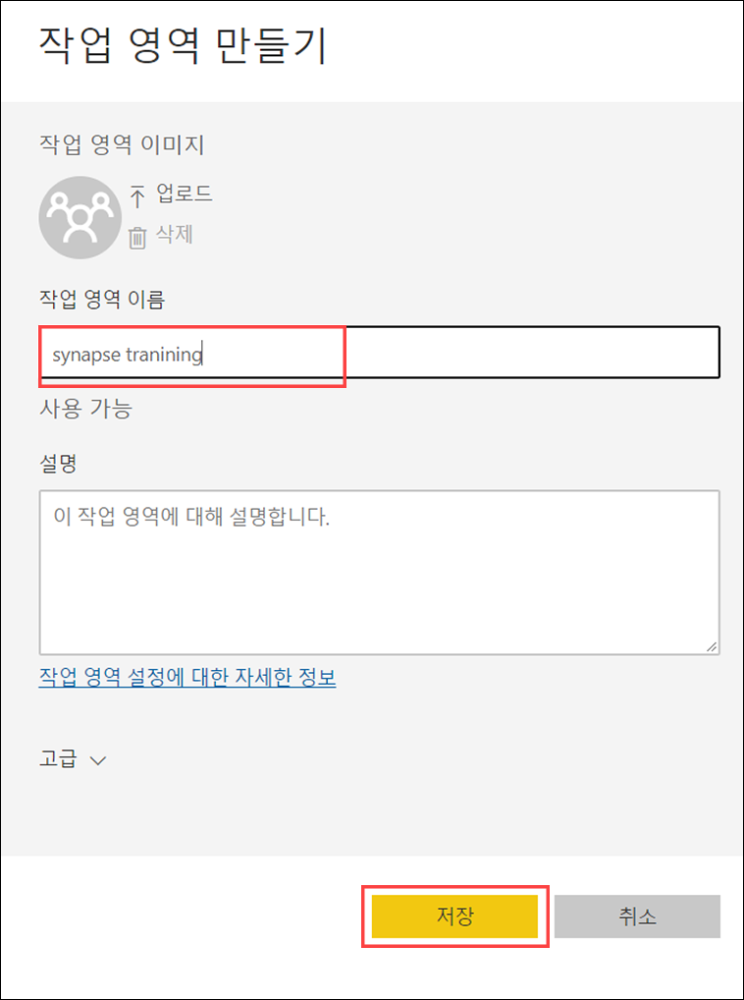

### 작업 3: Synapse에서 Power BI에 연결

1. Synapse Studio(<https://web.azuresynapse.net/>)를 열고 **관리 허브**로 이동합니다.

    

2. 왼쪽 메뉴에서 **연결된 서비스**를 선택하고 **+ 새로 만들기**를 선택합니다..

    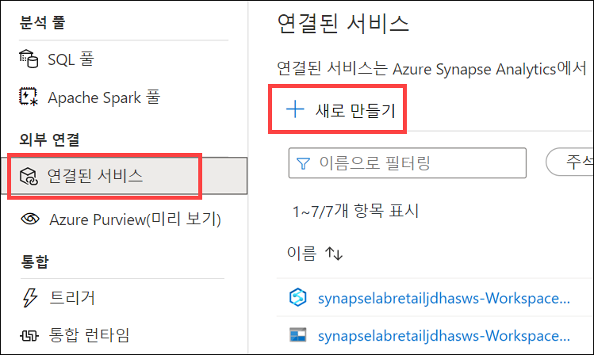

3. **Power BI**, **계속**을 차례로 선택합니다.

    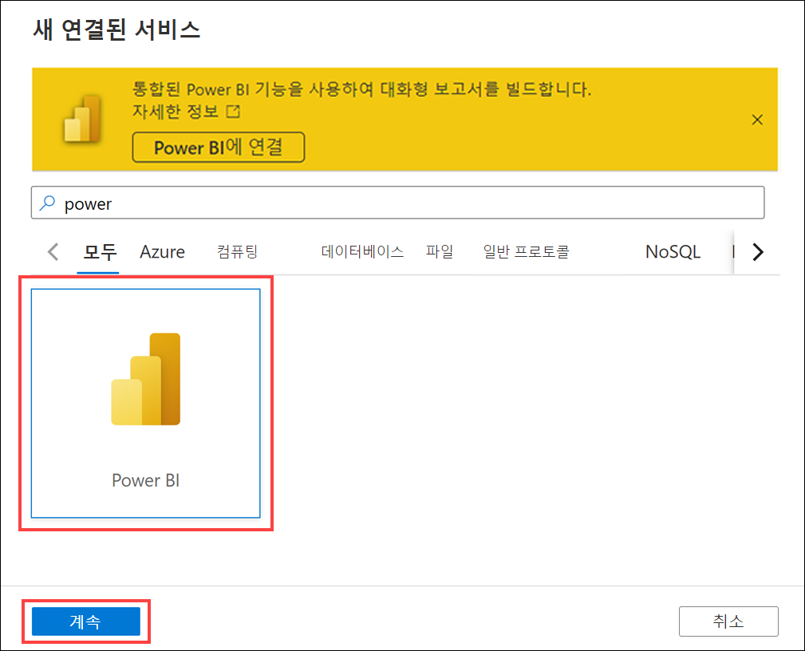

4. 데이터 집합 속성 양식에서 다음 속성을 작성합니다.

    | 필드                          | 값                                              |
    | ------------------------------ | ------------------------------------------         |
    | 이름 | _`handson_powerbi` 입력_ |
    | 작업 영역 이름 | _synapse-training` 선택_ |

    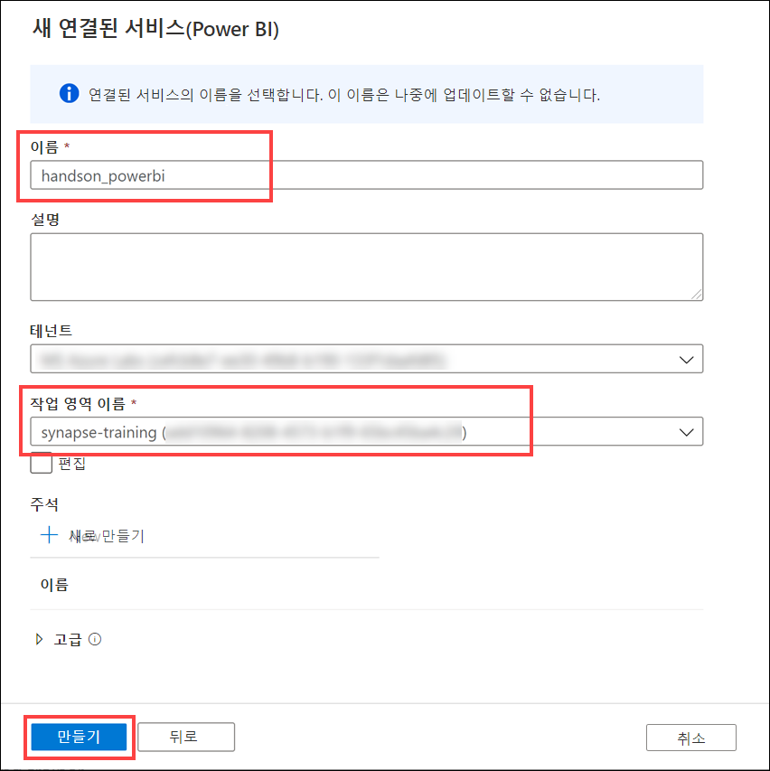

5. **만들기**를 선택합니다.

6. **모두 게시**, **게시**를 차례로 선택합니다.

    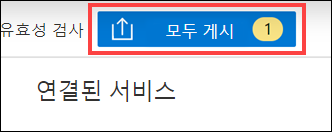

### 작업 4: Synapse Studio의 Power BI 연결된 서비스 살펴보기

1. [**Azure Synapse Studio**](<https://web.azuresynapse.net/>)에서 왼쪽 메뉴 옵션을 사용하여 **개발** 허브로 이동합니다.

    

2. `Power BI`, `handson_powerbi`를 차례로 확장하여 Synapse Studio에서 Power BI 데이터 집합과 보고서에 직접 액세스할 수 있음을 확인합니다.

    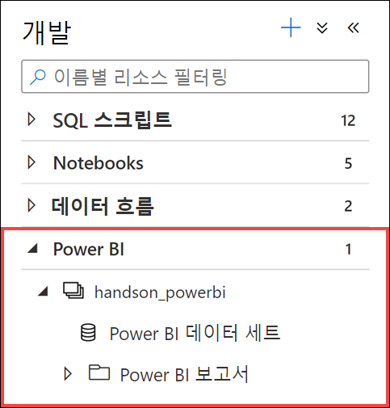

    **개발** 탭의 맨 위에 있는 **+** 를 선택하여 새 보고서를 만들 수 있습니다. 보고서 이름을 선택하여 기존 보고서를 편집할 수 있습니다. 저장된 변경 내용은 Power BI 작업 영역에 다시 기록됩니다.

### 작업 5: Power BI Desktop에서 사용할 새 데이터 원본 만들기

1. **Power BI** 아래쪽의 연결된 Power BI 작업 영역에서 **Power BI 데이터 집합**을 선택합니다.

2. 위쪽 작업 메뉴에서 **새 Power BI 데이터 집합**을 선택합니다.

    

3. **시작**을 선택하고 환경 컴퓨터에 Power BI Desktop이 설치되어 있는지 확인합니다.

    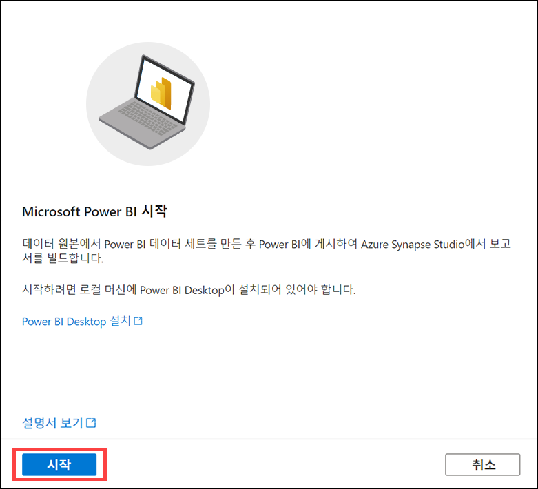

4. **SQLPool01**, **계속**을 차례로 선택합니다.

    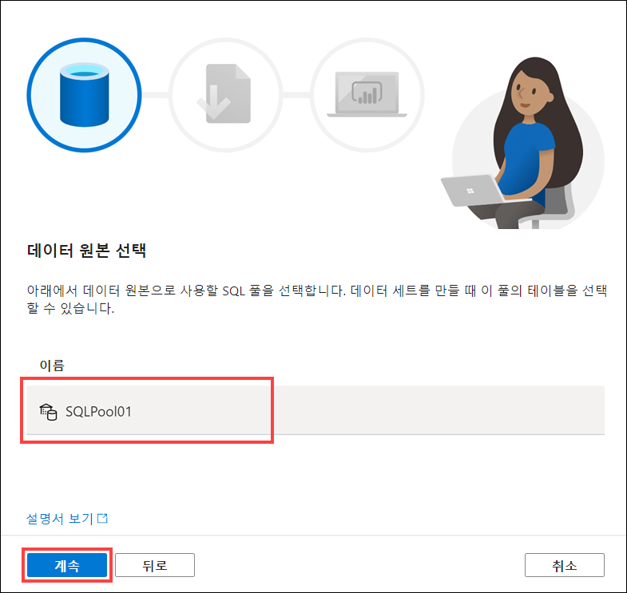

5. 그런 후에 **다운로드**를 선택하여 `.pbids` 파일을 다운로드합니다.

    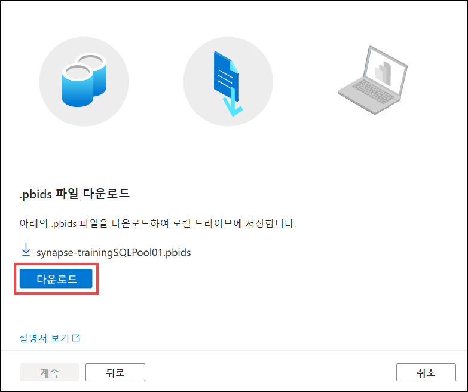

6. **계속**, **닫은 후 새로 고침**을 차례로 선택하여 게시 대화 상자를 닫습니다.

### 작업 6: Synapse Studio에서 새 Power BI 보고서 만들기

1. [**Azure Synapse Studio**](<https://web.azuresynapse.net/>)의 왼쪽 메뉴에서 **개발**을 선택합니다.

    

2. **+**, **SQL 스크립트**를 차례로 선택합니다.

    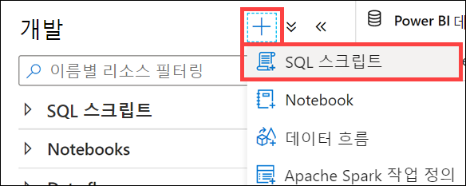

3. **SQLPool01**에 연결한 후 다음 쿼리를 실행하여 대략적인 실행 시간(약 1분)을 확인합니다. 이 연습 뒷부분에서 작성할 Power BI 보고서의 데이터를 가져올 때 이 쿼리를 사용할 것입니다.

    ```sql
    SELECT
        FS.CustomerID
        ,P.Seasonality
        ,D.Year
        ,D.Quarter
        ,D.Month
        ,avg(FS.TotalAmount) as AvgTotalAmount
        ,avg(FS.ProfitAmount) as AvgProfitAmount
        ,sum(FS.TotalAmount) as TotalAmount
        ,sum(FS.ProfitAmount) as ProfitAmount
    FROM
        wwi.SaleSmall FS
        JOIN wwi.Product P ON P.ProductId = FS.ProductId
        JOIN wwi.Date D ON FS.TransactionDateId = D.DateId
    GROUP BY
        FS.CustomerID
        ,P.Seasonality
        ,D.Year
        ,D.Quarter
        ,D.Month
    ```

    쿼리 결과로 194683820이 표시되어야 합니다.

    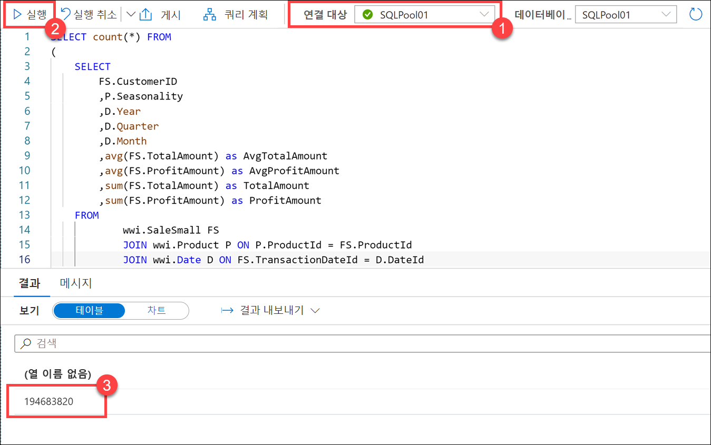

4. 데이터 원본에 연결하려면 Power BI Desktop에서 다운로드한 .pbids 파일을 엽니다. 왼쪽의 **Microsoft 계정** 옵션을 선택하고 **로그인**한 후에(Synapse 작업 영역에 연결하는 데 사용하는 것과 같은 자격 증명 사용) **연결**을 클릭합니다.

    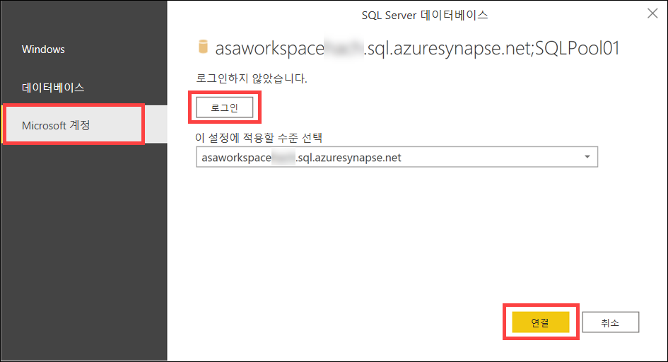

5. 탐색기 대화 상자에서 루트 데이터베이스 노드를 마우스 오른쪽 단추로 클릭하고 **데이터 변환**을 선택합니다.

    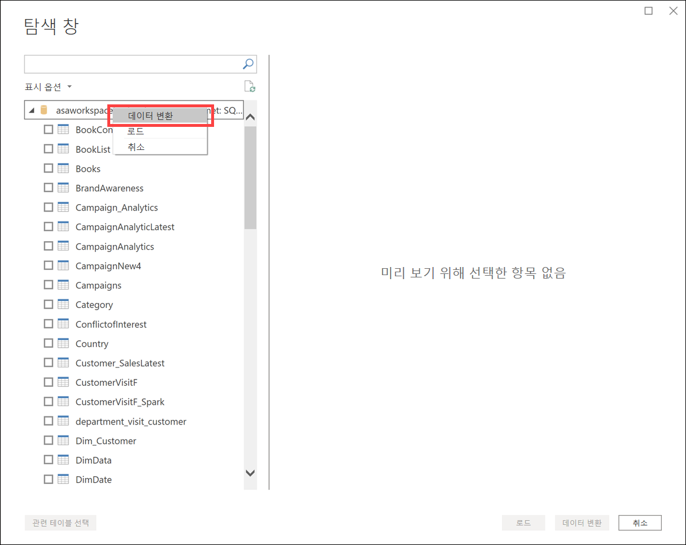

6. 연결 설정 대화 상자에서 **DirectQuery** 옵션을 선택합니다. 이 랩에서는 Power BI로 데이터 복사본을 가져올 필요는 없으며, 보고서 시각화를 사용하면서 데이터 원본을 쿼리할 수 있다는 것만 확인하면 되기 때문입니다. **확인**을 클릭하고 연결이 구성되는 동안 몇 초 정도 기다립니다.

    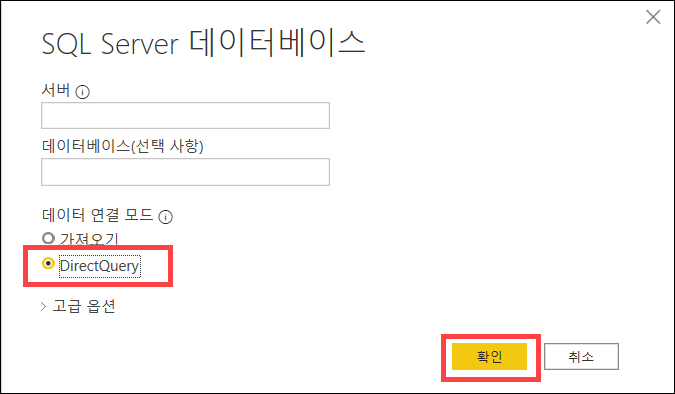

7. Power Query 편집기에서 쿼리의 **원본** 단계 설정 페이지를 엽니다. **고급 옵션** 섹션을 확장하고 다음 쿼리를 붙여넣은 후에 **확인**을 클릭합니다.

    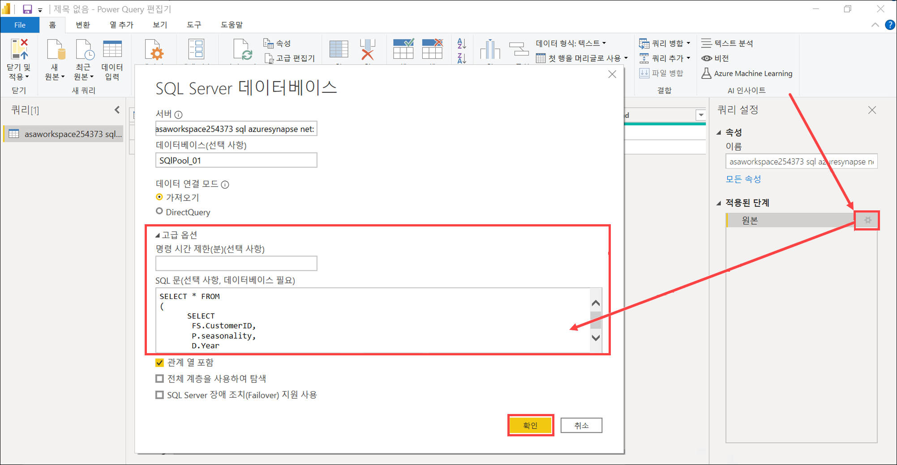

    ```sql
    SELECT * FROM
    (
        SELECT
            FS.CustomerID
            ,P.Seasonality
            ,D.Year
            ,D.Quarter
            ,D.Month
            ,avg(FS.TotalAmount) as AvgTotalAmount
            ,avg(FS.ProfitAmount) as AvgProfitAmount
            ,sum(FS.TotalAmount) as TotalAmount
            ,sum(FS.ProfitAmount) as ProfitAmount
        FROM
            wwi.SaleSmall FS
            JOIN wwi.Product P ON P.ProductId = FS.ProductId
            JOIN wwi.Date D ON FS.TransactionDateId = D.DateId
        GROUP BY
            FS.CustomerID
            ,P.Seasonality
            ,D.Year
            ,D.Quarter
            ,D.Month
    ) T
    ```

    > 이 단계를 실행하려면 최소 40~60초가 걸립니다. Synapse SQL 풀 연결에서 직접 쿼리를 제출하기 때문입니다.

8. 편집기 창 왼쪽 위의 **닫기 및 적용**을 선택하여 쿼리를 적용하겨 Power BI Designer 창에서 초기 스키마를 가져옵니다.

    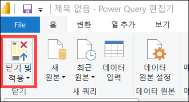

9. Power BI 보고서 편집기로 돌아와 오른쪽의 **시각화** 메뉴를 확장한 후 **꺾은선형 및 누적 세로 막대형 차트** 시각화를 선택합니다.

    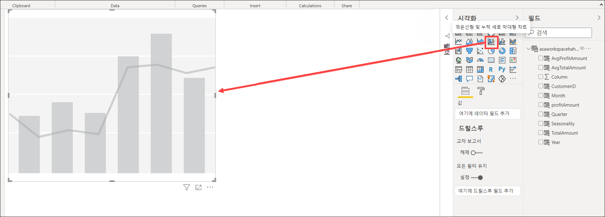

10. 새로 만든 차트를 선택하여 해당 속성 창을 확장합니다. 확장된 **필드** 메뉴를 사용하여 다음과 같이 시각화를 구성합니다.

     - **공유 축**: `Year`, `Quarter`
     - **열 계열**: `Seasonality`
     - **열 값**: `TotalAmount`
     - **꺾은선 값**: `ProfitAmount`

    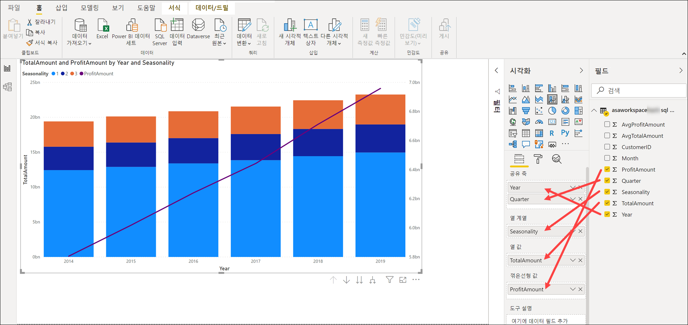

    > 시각화가 렌더링되려면 40~60초 정도 걸립니다. Synapse 전용 SQL 풀에서 쿼리가 라이브로 실행되기 때문입니다.

11. Power BI Desktop 애플리케이션에서 시각화를 구성하면서 실행되는 쿼리를 확인할 수 있습니다. Synapse Studio로 다시 전환하여 왼쪽 메뉴에서 **모니터** 허브를 선택합니다.

    

12. **활동** 섹션에서 **SQL 요청** 모니터를 엽니다. 풀 필터에서는 기본적으로 기본 제공이 선택되어 있는데, **SQLPool01**을 선택해야 합니다.

    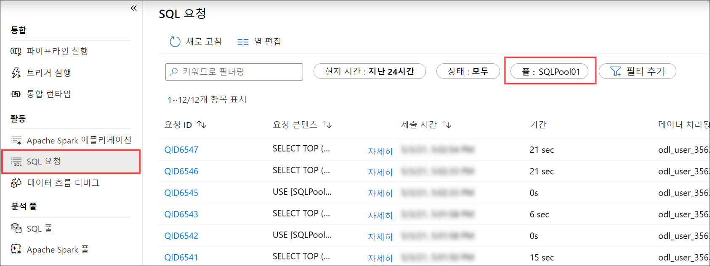

13. 로그 맨 위에 표시되는 요청의 시각화에 사용되는 쿼리를 확인하고 해당 쿼리의 실행 시간(약 20~30초)을 살펴봅니다. 요청에서 **자세히**를 선택하여 Power BI Desktop에서 제출되는 실제 쿼리를 살펴봅니다.

    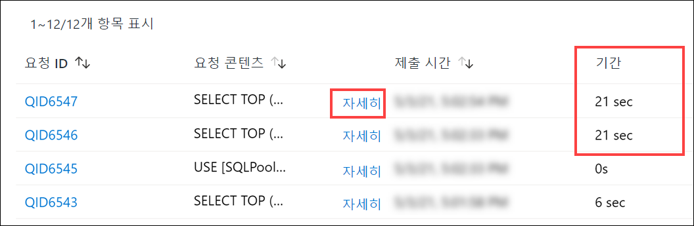

    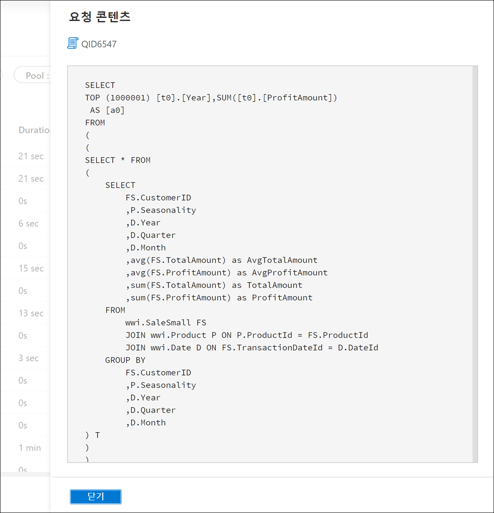

14. Power BI Desktop 애플리케이션으로 다시 전환하여 왼쪽 위의 **저장**을 클릭합니다.

    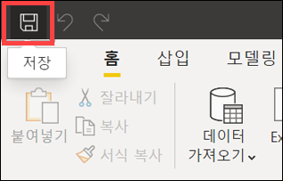

15. 파일 이름을 `synapse-lab`과 같이 지정하고 **저장**을 클릭합니다.

    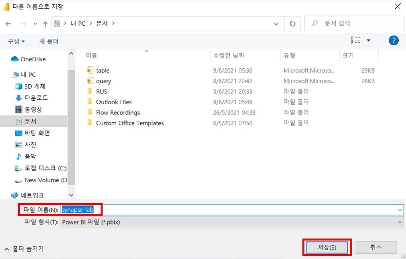

16. 저장한 보고서 위의 **게시**를 클릭합니다. Power BI Desktop에서 Power BI 포털 및 Synapse Studio에서 사용하는 것과 같은 계정으로 로그인되어 있는지 확인합니다. 창 오른쪽 위에서 적절한 계정으로 전환할 수 있습니다.

    

    현재 Power BI Desktop에 로그인되어 있지 않으면 이메일 주소를 입력하라는 메시지가 표시됩니다. 이 랩에서 Azure Portal 및 Synapse Studio에 연결하는 데 사용 중인 계정 자격 증명을 사용합니다.

    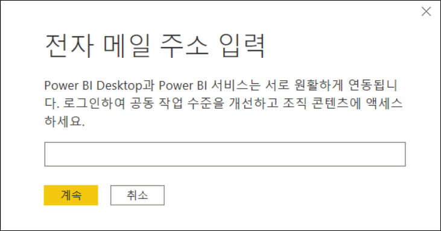

    메시지 내용에 따라 계정 로그인을 완료합니다.

17. **Power BI에 게시** 대화 상자에서 Synapse에 연결한 작업 영역(예: **synapse-training**)을 선택하고 **선택**을 클릭합니다.

    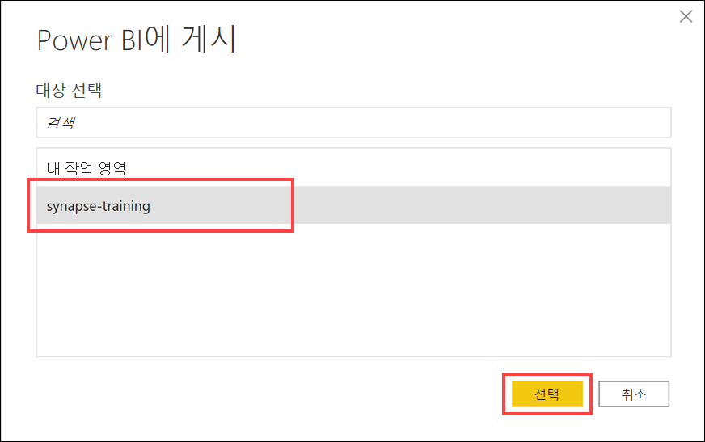

18. 게시 작업이 정상적으로 완료될 때까지 기다립니다.

    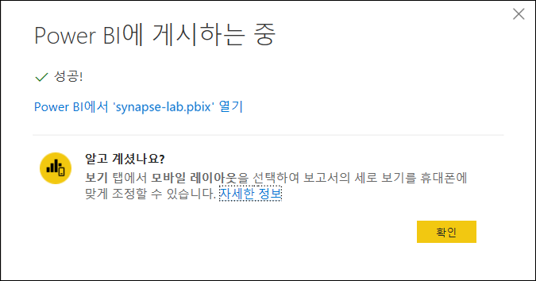

19. Power BI 서비스로 다시 전환합니다. 앞에서 서비스를 닫은 경우 새 브라우저 탭에서 Power BI 서비스(<https://powerbi.microsoft.com/>)로 이동합니다.

20. 앞에서 만든 **synapse-training** 작업 영역을 선택합니다. 이 작업 영역이 이미 열려 있으면 페이지를 새로 고쳐 새 보고서와 데이터 집합을 표시합니다.

    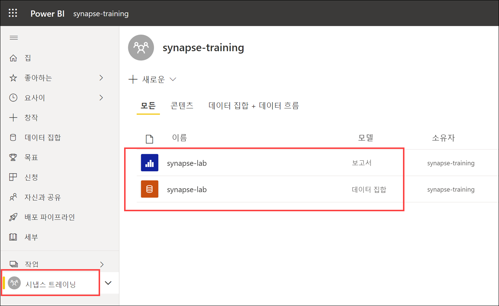

21. 페이지 오른쪽 위의 **설정** 톱니 바퀴 아이콘을 선택하고 **설정**을 선택합니다. 톱니 바퀴 아이콘이 표시되지 않으면 줄임표(...)를 선택하여 메뉴 항목을 표시해야 합니다.

    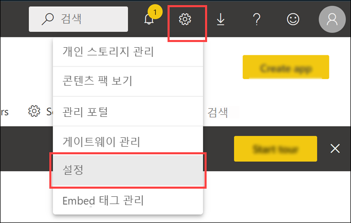

22. **데이터 집합** 탭을 선택합니다. ``Data source credentials` 아래에 자격 증명이 잘못되어 데이터 원본을 새로 고칠 수 없다는 오류 메시지가 표시되면 **자격 증명 편집**을 선택합니다. 이 섹션이 표시되려면 몇 초 정도 걸릴 수 있습니다.

    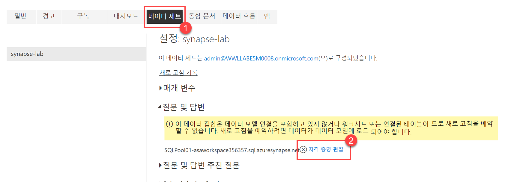

23. 표시되는 대화 상자에서 **OAuth2** 인증 방법을 선택하고 **로그인**을 선택한 후에 메시지가 표시되면 자격 증명을 입력합니다.

    

24. 이제 Synapse Studio에서 이 보고서가 게시되었음을 확인할 수 있습니다. Synapse Studio로 다시 전환하여 **개발** 허브를 선택하고 Power BI 보고서 노드를 새로 고칩니다.

    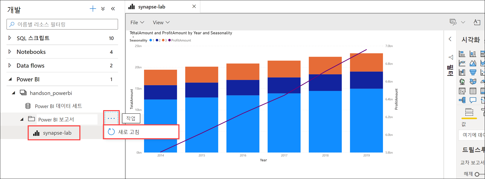

## 연습 2: Power BI와의 통합 최적화

### 작업 1: Power BI 최적화 옵션 살펴보기

Azure Synapse Analytics에 Power BI 보고서를 통합할 때는 다양한 성능 최적화 옵션이 제공됩니다. 이 연습 뒷부분에서는 결과 집합 캐싱 및 구체화된 뷰 옵션 사용 방법을 살펴보겠습니다.

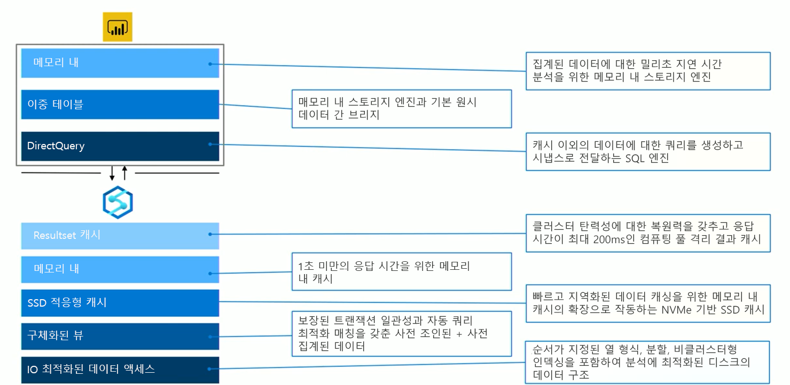

### 작업 2: 구체화된 뷰를 사용하여 성능 개선

1. [**Azure Synapse Studio**](<https://web.azuresynapse.net/>)의 왼쪽 메뉴에서 **개발**을 선택합니다.

    

2. **+**, **SQL 스크립트**를 차례로 선택합니다.

    

3. SQLPool01에 연결한 후 다음 쿼리를 실행하여 예상 실행 계획을 표시하고 총 비용 및 작업 수를 확인합니다.

    ```sql
    EXPLAIN
    SELECT * FROM
    (
        SELECT
        FS.CustomerID
        ,P.Seasonality
        ,D.Year
        ,D.Quarter
        ,D.Month
        ,avg(FS.TotalAmount) as AvgTotalAmount
        ,avg(FS.ProfitAmount) as AvgProfitAmount
        ,sum(FS.TotalAmount) as TotalAmount
        ,sum(FS.ProfitAmount) as ProfitAmount
    FROM
        wwi.SaleSmall FS
        JOIN wwi.Product P ON P.ProductId = FS.ProductId
        JOIN wwi.Date D ON FS.TransactionDateId = D.DateId
    GROUP BY
        FS.CustomerID
        ,P.Seasonality
        ,D.Year
        ,D.Quarter
        ,D.Month
    ) T
    ```

4. 결과는 다음과 유사합니다.

    ```xml
    <?xml version="1.0" encoding="utf-8"?>
    <dsql_query number_nodes="1" number_distributions="60" number_distributions_per_node="60">
        <sql>SELECT count(*) FROM
    (
        SELECT
        FS.CustomerID
        ,P.Seasonality
        ,D.Year
        ,D.Quarter
        ,D.Month
        ,avg(FS.TotalAmount) as AvgTotalAmount
        ,avg(FS.ProfitAmount) as AvgProfitAmount
        ,sum(FS.TotalAmount) as TotalAmount
        ,sum(FS.ProfitAmount) as ProfitAmount
    FROM
        wwi.SaleSmall FS
        JOIN wwi.Product P ON P.ProductId = FS.ProductId
        JOIN wwi.Date D ON FS.TransactionDateId = D.DateId
    GROUP BY
        FS.CustomerID
        ,P.Seasonality
        ,D.Year
        ,D.Quarter
        ,D.Month
    ) T</sql>
        <dsql_operations total_cost="10.61376" total_number_operations="12">
    ```

5. 쿼리를 다음 코드로 바꿔 위의 쿼리를 지원할 수 있는 구체화된 뷰를 만듭니다.

    ```sql
    IF EXISTS(select * FROM sys.views where name = 'mvCustomerSales')
        DROP VIEW wwi_perf.mvCustomerSales
        GO

    CREATE MATERIALIZED VIEW
        wwi_perf.mvCustomerSales
    WITH
    (
        DISTRIBUTION = HASH( CustomerId )
    )
    AS
    SELECT
        FS.CustomerID
        ,P.Seasonality
        ,D.Year
        ,D.Quarter
        ,D.Month
        ,avg(FS.TotalAmount) as AvgTotalAmount
        ,avg(FS.ProfitAmount) as AvgProfitAmount
        ,sum(FS.TotalAmount) as TotalAmount
        ,sum(FS.ProfitAmount) as ProfitAmount
    FROM
        wwi.SaleSmall FS
        JOIN wwi.Product P ON P.ProductId = FS.ProductId
        JOIN wwi.Date D ON FS.TransactionDateId = D.DateId
    GROUP BY
        FS.CustomerID
        ,P.Seasonality
        ,D.Year
        ,D.Quarter
        ,D.Month
    GO
    ```

    > 이 쿼리의 실행을 완료하려면 60~150초가 걸립니다.
    >
    > 먼저 뷰가 있으면 삭제합니다. 이전 랩에서 사용했던 뷰가 이미 있기 때문입니다.

6. 다음 쿼리를 실행하여 작성한 구체화된 뷰에 실제로 연결되는지를 확인합니다.

    ```sql
    EXPLAIN
    SELECT * FROM
    (
        SELECT
        FS.CustomerID
        ,P.Seasonality
        ,D.Year
        ,D.Quarter
        ,D.Month
        ,avg(FS.TotalAmount) as AvgTotalAmount
        ,avg(FS.ProfitAmount) as AvgProfitAmount
        ,sum(FS.TotalAmount) as TotalAmount
        ,sum(FS.ProfitAmount) as ProfitAmount
    FROM
        wwi.SaleSmall FS
        JOIN wwi.Product P ON P.ProductId = FS.ProductId
        JOIN wwi.Date D ON FS.TransactionDateId = D.DateId
    GROUP BY
        FS.CustomerID
        ,P.Seasonality
        ,D.Year
        ,D.Quarter
        ,D.Month
    ) T
    ```

7. Power BI Desktop 보고서로 다시 전환한 후 보고서 위의 **새로 고침** 단추를 클릭하여 쿼리를 제출합니다. 이번에는 쿼리 최적화 프로그램이 새 구체화된 뷰를 사용합니다.

    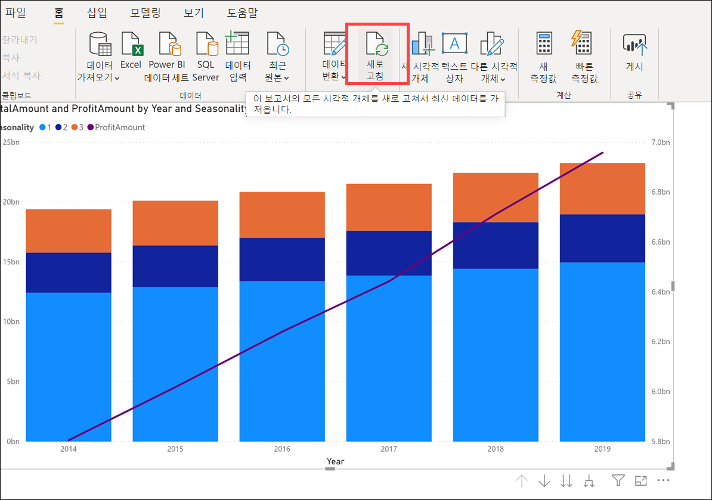

    > 이전에 비해 이번에는 데이터를 새로 고치는 데 몇 초밖에 걸리지 않습니다.

8. Synapse Studio의 모니터링 허브 내 SQL 요청 아래에서 쿼리 실행 시간을 다시 확인합니다. 새 구체화된 뷰를 사용하는 PoweR BI 쿼리는 훨씬 더 빠르게 실행됩니다(실행 시간 10초 미만).

    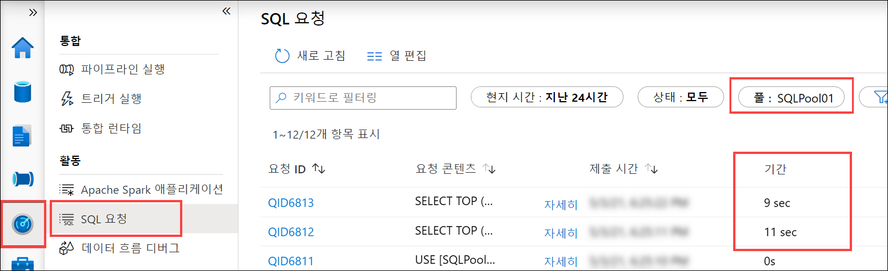

### 작업 3: 결과 집합 캐싱을 사용하여 성능 개선

1. [**Azure Synapse Studio**](<https://web.azuresynapse.net/>)의 왼쪽 메뉴에서 **개발**을 선택합니다.

    

2. **+**, **SQL 스크립트**를 차례로 선택합니다.

    

3. SQLPool01에 연결한 후 다음 쿼리를 실행하여 현재 SQL 풀에서 결과 집합 캐싱이 설정되어 있는지 확인합니다.

    ```sql
    SELECT
        name
        ,is_result_set_caching_on
    FROM
        sys.databases
    ```

4. `SQLPool01`에 대해 `False`가 반환되면 다음 쿼리를 실행하여 결과 집합 캐싱을 활성화합니다(`master` 데이터베이스를 대상으로 쿼리를 실행해야 함).

    ```sql
    ALTER DATABASE [SQLPool01]
    SET RESULT_SET_CACHING ON
    ```

    **SQLPool01**에 연결하여 **master** 데이터베이스를 사용합니다.

    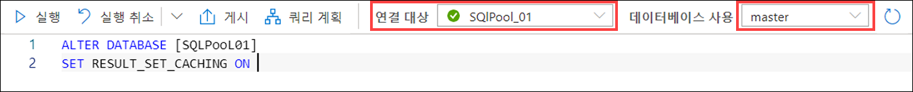

    > 이 프로세스를 완료하려면 몇 분 정도 걸립니다. 프로세스가 실행되는 동안 나머지 랩 내용을 계속 확인하세요.
    
    >**중요**
    >
    >결과 집합 캐시를 만들고 캐시에서 데이터를 검색하는 작업은 Synapse SQL 풀 인스턴스의 제어 노드에서 수행됩니다. 결과 집합 캐싱을 설정한 상태에서 쿼리를 실행하여 큰 결과 집합(예: 1GB를 초과하는 결과)이 반환되는 경우 제어 노드의 제한이 높아지며 인스턴스의 전반적인 쿼리 응답 속도가 느려질 수 있습니다. 이러한 쿼리는 일반적으로 데이터 탐색 또는 ETL 작업 중에 사용됩니다. 컨트롤 노드의 스트레스를 방지하고 성능 문제가 발생하는 것을 방지하려면 사용자는 해당 유형의 쿼리를 실행하기 전에 데이터베이스에서 결과 집합 캐싱을 해제해야 합니다.

5. Power BI Desktop 보고서로 다시 이동한 후 **새로 고침** 단추를 클릭하여 쿼리를 다시 제출합니다.

    

6. 데이터가 새로 고쳐지면 **새로 고침**을 다시 클릭하여 결과 집합 캐시가 사용되는지 확인합니다.

7. Synapse Studio의 모니터링 허브 - SQL 요청 페이지에서 쿼리 실행 시간을 다시 확인합니다. 이번에는 쿼리가 거의 즉시 실행됩니다(실행 시간 = 0초).

    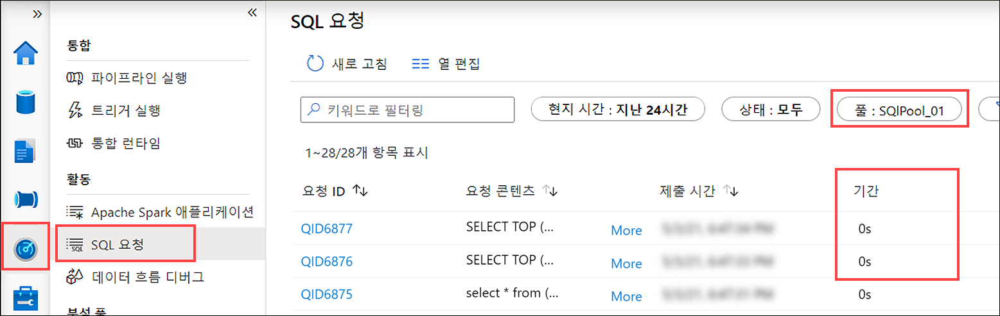

8. 전용 SQL 풀에 연결된 상태로 SQL 스크립트로 돌아와서(스크립트를 닫았으면 새 스크립트 작성) **master** 데이터베이스를 대상으로 다음 스크립트를 실행하여 결과 집합 캐싱을 다시 해제합니다.

    ```sql
    ALTER DATABASE [SQLPool01]
    SET RESULT_SET_CACHING OFF
    ```

    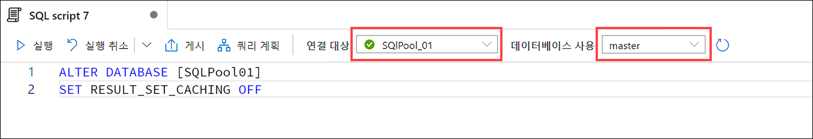

## 연습 3: SQL 서버리스를 사용하여 데이터 시각화


### 작업 1: SQL 서버리스를 사용하여 데이터 레이크 살펴보기

먼저 Power BI 보고서 쿼리 준비를 위해 시각화에 사용할 데이터 원본을 살펴보겠습니다. 이 연습에서는 Synapse 작업 영역의 SQL 주문형 인스턴스를 사용합니다.

1. [Azure Synapse Studio](https://web.azuresynapse.net)에서 **데이터** 허브로 이동합니다.

    

2. **연결됨** 탭 **(1)** 을 선택합니다. **Azure Data Lake Storage Gen2** 그룹에서 기본 데이터 레이크(첫 번째 노드) **(2)** 를 선택하고 **wwi-02** 컨테이너 **(3)** 를 선택합니다. **`wwi-02/sale-small/Year=2019/Quarter=Q1/Month=1/Day=20190101` (4)** 로 이동합니다. Parquet 파일 **(5)** 을 마우스 오른쪽 단추로 클릭하고 **새 SQL 스크립트(6)**, **상위 100개 행 선택(7)** 을 차례로 선택합니다.

    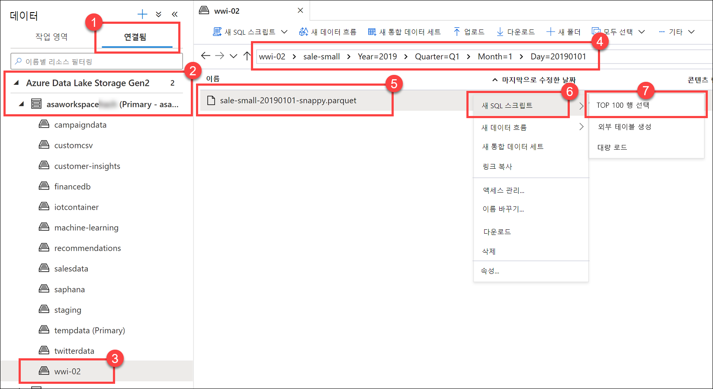

3. 생성된 스크립트를 실행하여 Parquet 파일에 저장된 데이터를 미리 봅니다.

    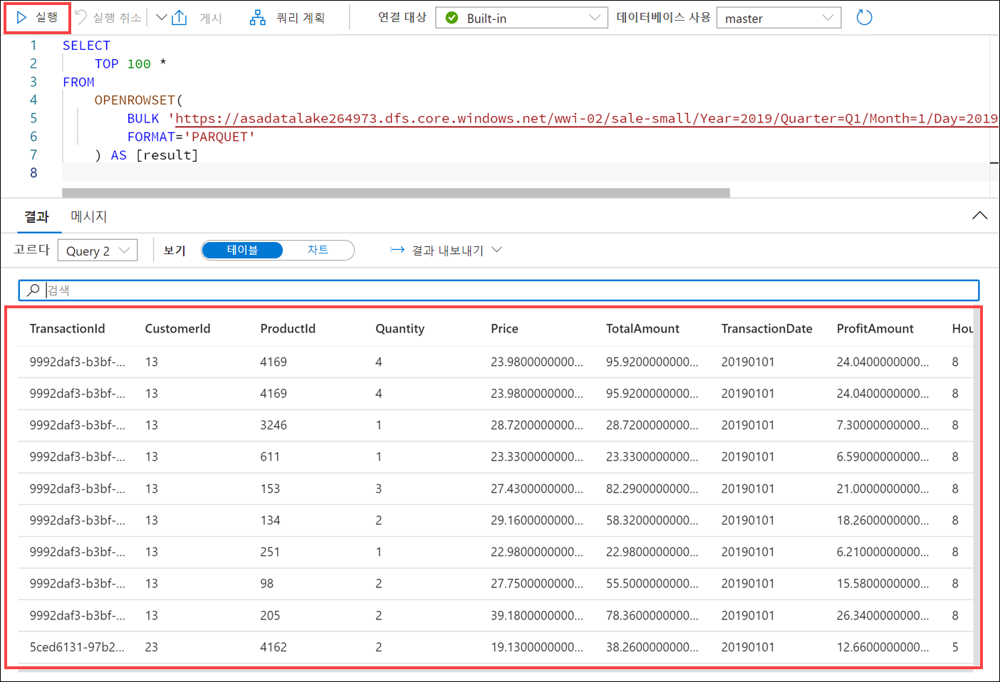

4. 쿼리에서 기본 데이터 레이크 스토리지 계정 이름을 **복사**하여 메모장이나 유사한 텍스트 편집기에 저장합니다. 다음 단계에서 해당 이름이 필요합니다.

    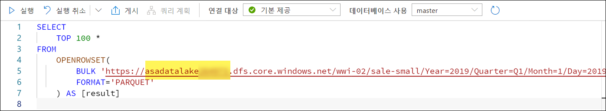

5. 이제 Power BI 보고서에서 사용할 쿼리를 준비합니다. 이 쿼리는 특정 월의 일별 금액 및 이익 합계를 추출합니다. 여기서는 2019년 1월의 값을 추출하겠습니다. 파일 경로에는 한 달에 해당하는 모든 파일을 참조하는 와일드카드가 사용됩니다. SQL 주문형 인스턴스에서 다음 쿼리를 붙여넣은 다음 실행합니다. **`YOUR_STORAGE_ACCOUNT_NAME`** 은 위에서 복사한 스토리지 계정 이름으로 **바꿉니다**.

    ```sql
    DROP DATABASE IF EXISTS demo;
    GO

    CREATE DATABASE demo;
    GO

    USE demo;
    GO

    CREATE VIEW [2019Q1Sales] AS
    SELECT
        SUBSTRING(result.filename(), 12, 4) as Year
        ,SUBSTRING(result.filename(), 16, 2) as Month
        ,SUBSTRING(result.filename(), 18, 2) as Day
        ,SUM(TotalAmount) as TotalAmount
        ,SUM(ProfitAmount) as ProfitAmount
        ,COUNT(*) as TransactionsCount
    FROM
        OPENROWSET(
            BULK 'https://YOUR_STORAGE_ACCOUNT_NAME.dfs.core.windows.net/wwi-02/sale-small/Year=2019/Quarter=Q1/Month=1/*/*.parquet',
            FORMAT='PARQUET'
        ) AS [result]
    GROUP BY
        [result].filename()
    GO
    ```

    다음과 유사한 쿼리 출력이 표시됩니다.

    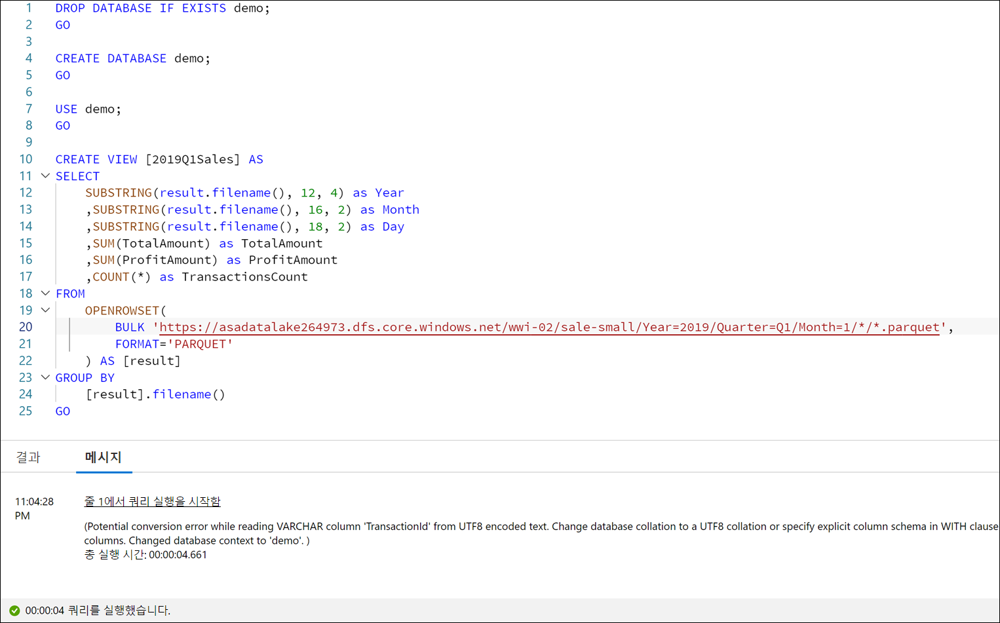

6. 쿼리를 다음 코드로 바꿔 새로 만든 뷰 중에서 선택합니다.

    ```sql
    USE demo;

    SELECT TOP (100) [Year]
    ,[Month]
    ,[Day]
    ,[TotalAmount]
    ,[ProfitAmount]
    ,[TransactionsCount]
    FROM [dbo].[2019Q1Sales]
    ```

    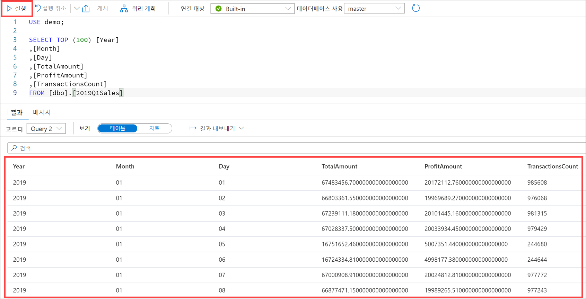

7. 왼쪽 메뉴에서 **데이터** 허브로 이동합니다.

    

8. **작업 영역** 탭 **(1)** 을 선택하고 **데이터베이스** 그룹을 마우스 오른쪽 단추로 클릭한 후에 **새로 고침**을 선택하여 데이터베이스 목록을 업데이트합니다. 데이터베이스 그룹을 확장한 후 새로 만든 **demo (SQL on-demand)** 데이터베이스 **(2)** 를 확장합니다. 뷰 그룹 내에 **dbo.2019Q1Sales** 뷰 **(3)** 가 표시됩니다.

    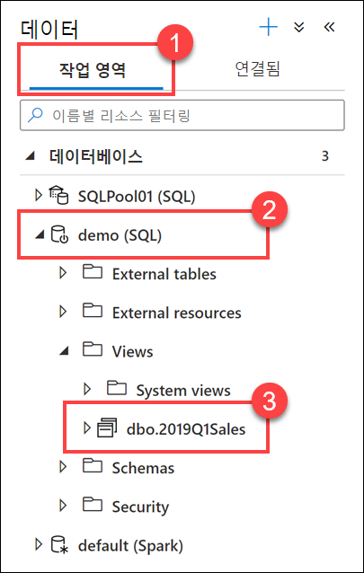

    > **참고**
    >
    > Synapse 서버리스 SQL 데이터베이스는 실제 데이터가 아닌 메타데이터 확인용으로만 사용됩니다.

### 작업 2: SQL 서버리스를 사용하여 데이터를 시각화하고 Power BI 보고서 만들기

1. [Azure Portal](https://portal.azure.com)에서 Synapse 작업 영역으로 이동합니다. **개요** 탭에서 **서버리스 SQL 엔드포인트**를 **복사**합니다.

    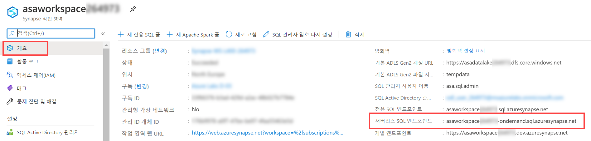

2. Power BI Desktop으로 다시 전환합니다. 새 보고서를 만들고 **데이터 가져오기**를 클릭합니다.

    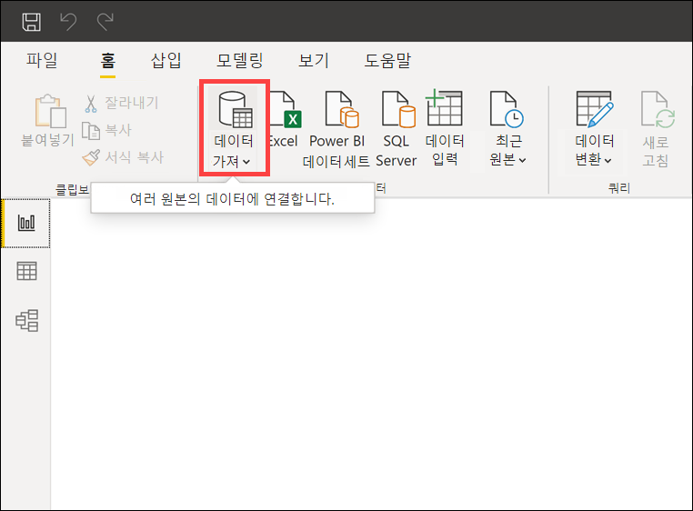

3. 왼쪽 메뉴에서 **Azure**를 선택하고 **Azure Synapse Analytics(SQL DW)** 를 선택합니다. 마지막으로 **연결**을 클릭합니다.

    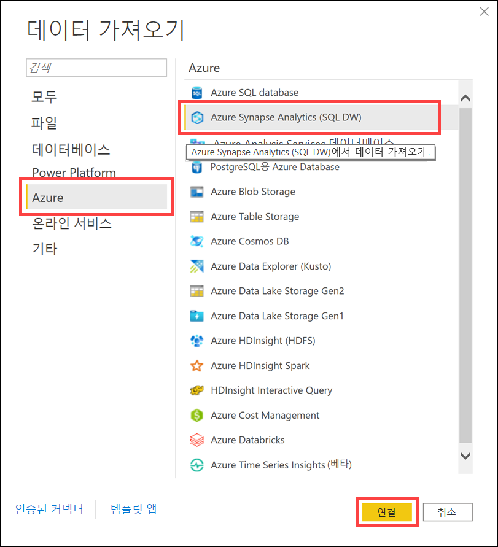

4. 1단계에서 확인한 서버리스 SQL 엔드포인트를 **서버** 필드 **(1)** 에 붙여넣고 **데이터베이스(2)** 에는 **`demo`** 를 입력합니다. 그런 다음 **DirectQuery(3)** 를 선택하고, SQL Server 데이터베이스 대화 상자의 확장된 **고급 옵션** 섹션에 **아래 쿼리를 붙여넣습니다(4)**. 마지막으로 **확인(5)** 을 클릭합니다.

    ```sql
    SELECT TOP (100) [Year]
    ,[Month]
    ,[Day]
    ,[TotalAmount]
    ,[ProfitAmount]
    ,[TransactionsCount]
    FROM [dbo].[2019Q1Sales]
    ```

    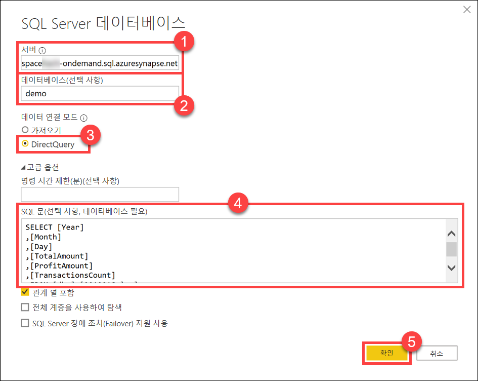

5. (메시지가 표시되면) 왼쪽의 **Microsoft 계정** 옵션을 선택하고 **로그인**한 후에(Synapse 작업 영역에 연결하는 데 사용하는 것과 같은 자격 증명 사용) **연결**을 클릭합니다.

    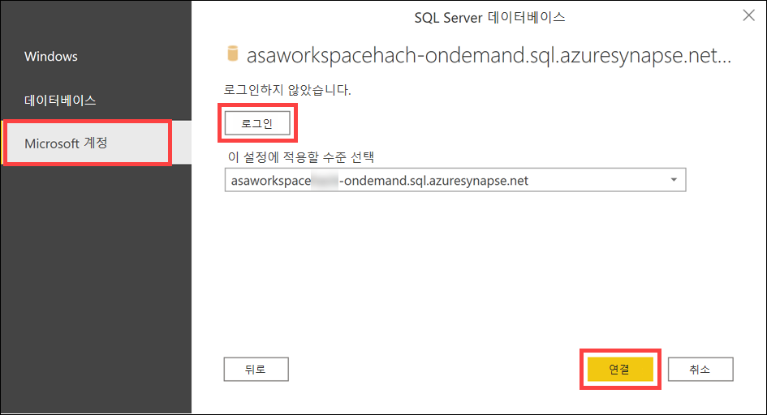

6. 데이터 미리 보기 창에서 **로드**를 선택하고 연결이 구성될 때까지 기다립니다.

    

7. 데이터가 로드되면 **시각화** 메뉴에서 **꺾은선형 차트**를 선택합니다.

    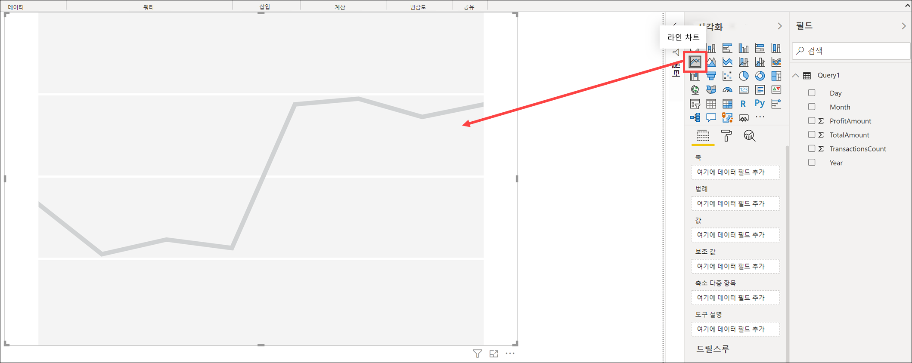

8. 꺾은선형 차트 시각화를 선택하여 일별 이익, 금액, 거래 수가 표시되도록 다음과 같이 구성합니다.

    - **축**: `Day`
    - **값**: `ProfitAmount`, `TotalAmount`
    - **보조 값**: `TransactionsCount`

    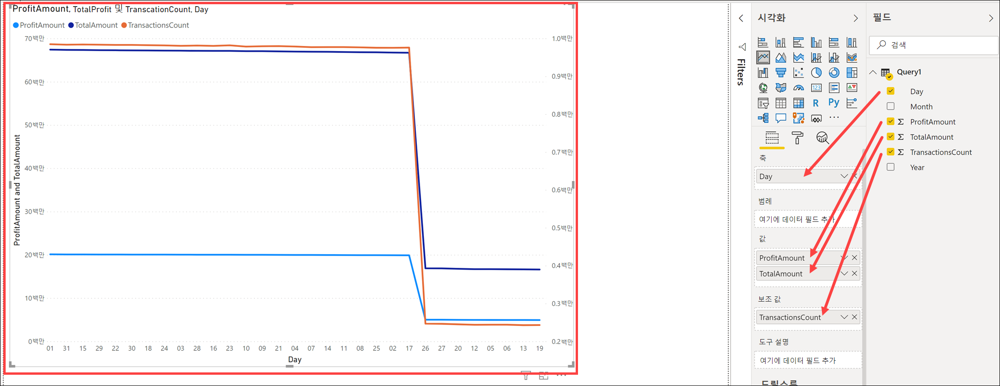

9. 꺾은선형 차트 시각화를 선택하여 거래일 기준 오름차순으로 정렬되도록 구성합니다. 이렇게 하려면 차트 시각화 옆의 **기타 옵션**을 선택합니다.

    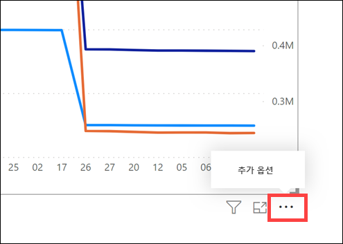

    **오름차순 정렬**을 선택합니다.

    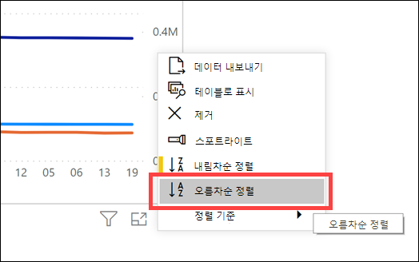

    차트 시각화 옆의 **기타 옵션**을 다시 선택합니다.

    

    **정렬 기준**, **일**을 차례로 선택합니다.

    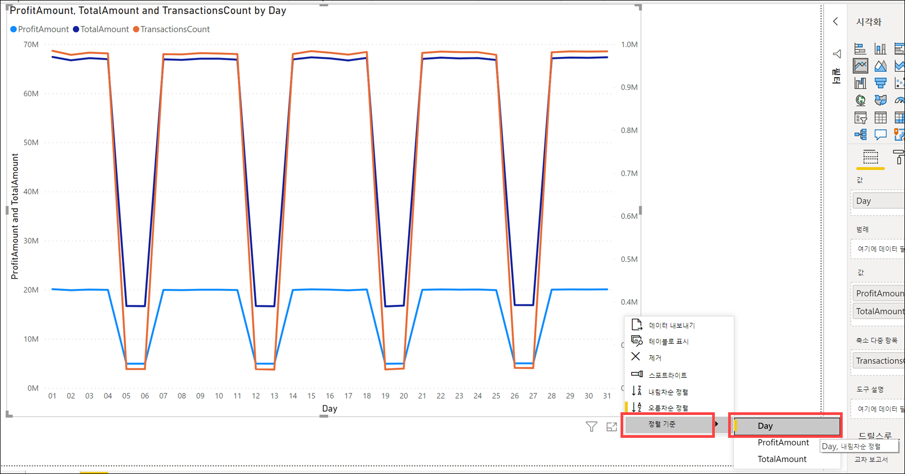

10. 왼쪽 위에서 **저장**을 클릭합니다.

    

11. 파일 이름을 `synapse-sql-serverless`와 같이 지정하고 **저장**을 클릭합니다.

    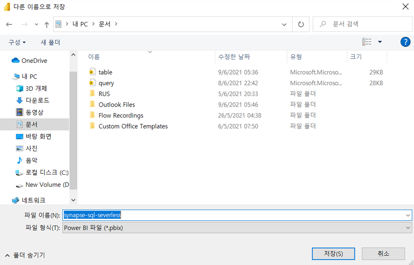

12. 저장한 보고서 위의 게시를 클릭합니다. Power BI Desktop에서 Power BI 포털 및 Synapse Studio에서 사용하는 것과 같은 계정으로 로그인되어 있는지 확인합니다. 창 오른쪽 위에서 적절한 계정으로 전환할 수 있습니다. Power BI에 게시 대화 상자에서 Synapse에 연결한 작업 영역(예: **synapse-training**)을 선택하고 **선택**을 클릭합니다.

    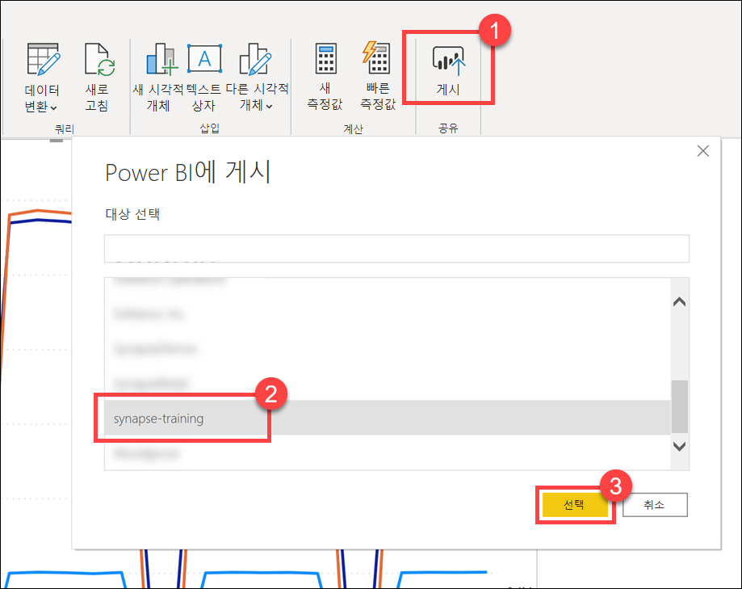

13. 게시 작업이 정상적으로 완료될 때까지 기다립니다.

    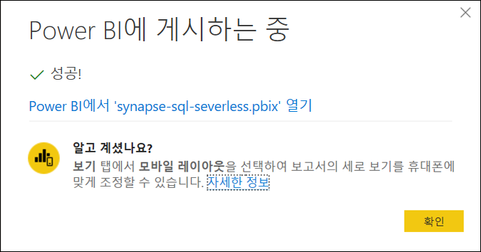


14. Power BI 서비스로 다시 전환합니다. 앞에서 서비스를 닫은 경우 새 브라우저 탭에서 Power BI 서비스(<https://powerbi.microsoft.com/>)로 이동합니다.

15. 앞에서 만든 **synapse-training** 작업 영역을 선택합니다. 이 작업 영역이 이미 열려 있으면 페이지를 새로 고쳐 새 보고서와 데이터 집합을 표시합니다.

    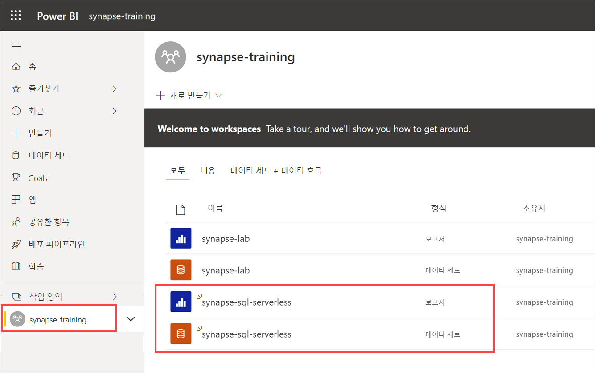

16. 페이지 오른쪽 위의 **설정** 톱니 바퀴 아이콘을 선택하고 **설정**을 선택합니다. 톱니 바퀴 아이콘이 표시되지 않으면 줄임표(...)를 선택하여 메뉴 항목을 표시해야 합니다.

    

17. **데이터 집합** 탭 **(1)** 을 선택하고 **synapse-sql-serverless** 데이터 집합 **(2)** 을 선택합니다. `Data source credentials` 아래에 자격 증명이 잘못되어 데이터 원본을 새로 고칠 수 없다는 오류 메시지가 표시되면 **자격 증명 편집(3)** 을 선택합니다. 이 섹션이 표시되려면 몇 초 정도 걸릴 수 있습니다.

    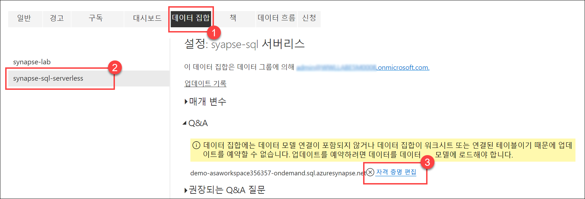

18. 표시되는 대화 상자에서 OAuth2 인증 방법을 선택하고 로그인을 선택한 후에 메시지가 표시되면 자격 증명을 입력합니다.

    

19. [Azure Synapse Studio](https://web.azuresynapse.net)에서 **개발** 허브로 이동합니다.

    

20. Power BI 그룹 > Power BI 연결된 서비스(예: `handson_powerbi`)를 차례로 확장하고 **Power BI 보고서**를 마우스 오른쪽 단추로 클릭한 후에 **새로 고침**을 선택하여 보고서 목록을 업데이트합니다. 이 랩에서 만든 Power BI 보고서 2개(`synapse-lab` 및 `synapse-sql-serverless`)가 표시됩니다.

    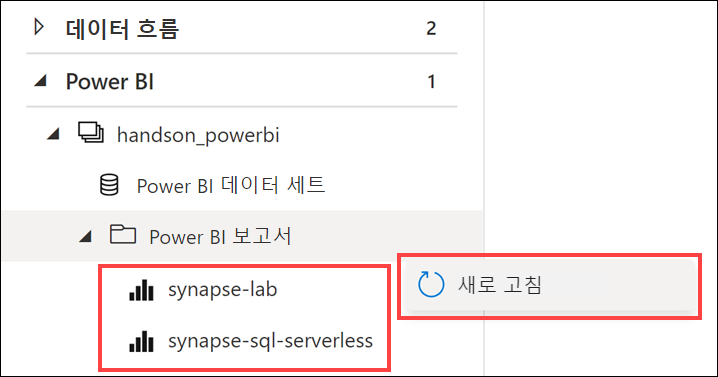

21. **`synapse-lab`** 보고서를 선택합니다. Synapse Studio 내에서 보고서를 직접 확인하고 편집할 수 있습니다.

    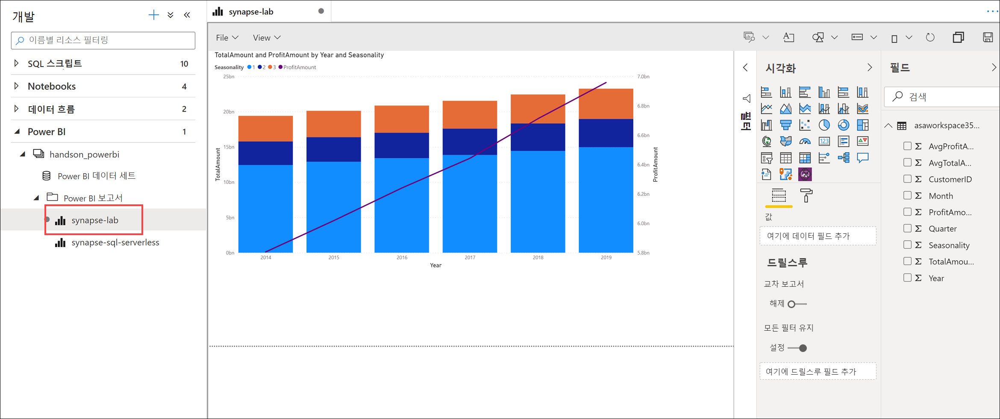

22. **`synapse-sql-serverless`** 보고서를 선택합니다. 이 보고서도 확인 및 편집할 수 있습니다.

    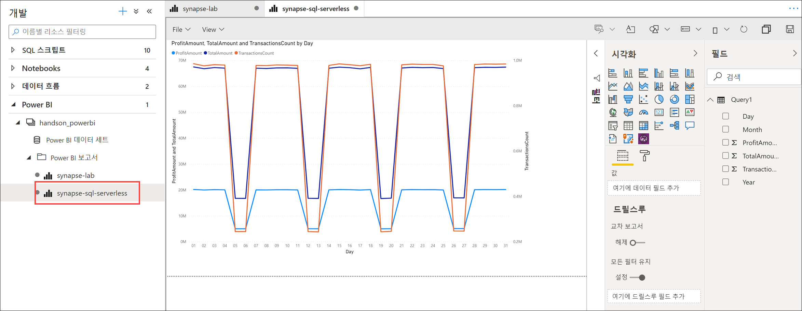

## 연습 4: 정리

다음 단계를 완료하여 더 이상 필요없는 리소스를 정리할 수 있습니다.

### 작업 1: 전용 SQL 풀 일시 중지

1. Synapse Studio(<https://web.azuresynapse.net/>)를 엽니다.

2. **관리** 허브를 선택합니다.

    

3. 왼쪽 메뉴에서 **SQL 풀**을 선택합니다 **(1)**. 전용 SQL 풀의 이름을 마우스 커서로 가리키고 **일시 중지(2)** 를 선택합니다.

    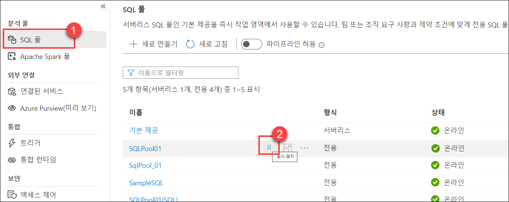

4. 메시지가 표시되면 **일시 중지**를 선택합니다.

    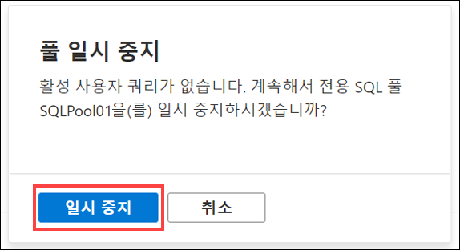
