# 모듈 17 - Azure Synapse Analytics에서 통합 기계 학습 프로세스 수행

이 랩에서는 Azure Synapse Analytics의 통합 엔드투엔드 Azure Machine Learning 및 Azure Cognitive Services 환경을 살펴봅니다. 구체적으로는 연결된 서비스를 사용하여 Azure Machine Learning 작업 영역에 Azure Synapse Analytics 작업 영역을 연결한 다음, Spark 테이블의 데이터를 사용하는 자동화된 ML 실험을 트리거하는 방법을 알아봅니다. 그리고 Azure Machine Learning 또는 Azure Cognitive Services에서 학습된 모델을 사용하여 SQL 풀 테이블의 데이터를 보강한 다음 Power BI를 사용하여 예측 결과를 제공하는 방법도 알아봅니다.

이 랩을 완료하면 Azure Synapse Analytics와 Azure Machine Learning을 통합하여 진행 가능한 엔드투엔드 기계 학습 프로세스의 주요 단계를 파악할 수 있습니다.

## 랩 세부 정보

- [모듈 17 - Azure Synapse Analytics에서 통합 기계 학습 프로세스 수행](#module-17---perform-integrated-machine-learning-processes-in-azure-synapse-analytics)
  - [랩 세부 정보](#lab-details)
  - [필수 구성 요소](#pre-requisites)
  - [실습 랩 시작 전 준비 사항](#before-the-hands-on-lab)
    - [작업 1: Azure Synapse Analytics 작업 영역 만들기 및 구성](#task-1-create-and-configure-the-azure-synapse-analytics-workspace)
    - [작업 2: 이 랩용 추가 리소스 만들기 및 구성](#task-2-create-and-configure-additional-resources-for-this-lab)
  - [연습 0: 전용 SQL 풀 시작](#exercise-0-start-the-dedicated-sql-pool)
  - [연습 1: Azure Machine Learning 연결된 서비스 만들기](#exercise-1-create-an-azure-machine-learning-linked-service)
    - [작업 1: Synapse Studio에서 Azure Machine Learning 연결된 서비스 만들기 및 구성](#task-1-create-and-configure-an-azure-machine-learning-linked-service-in-synapse-studio)
    - [작업 2: Synapse Studio의 Azure Machine Learning 통합 기능 살펴보기](#task-2-explore-azure-machine-learning-integration-features-in-synapse-studio)
  - [연습 2: Spark 테이블의 데이터를 사용하여 자동화된 ML 실험 트리거](#exercise-2-trigger-an-auto-ml-experiment-using-data-from-a-spark-table)
    - [작업 1: Spark 테이블에서 회귀 자동화된 ML 실험 트리거](#task-1-trigger-a-regression-auto-ml-experiment-on-a-spark-table)
    - [작업 2: Azure Machine Learning 작업 영역에서 실험 세부 정보 확인](#task-2-view-experiment-details-in-azure-machine-learning-workspace)
  - [연습 3: 학습된 모델을 사용하여 데이터 보강](#exercise-3-enrich-data-using-trained-models)
    - [작업 1: Azure Machine Learning에서 학습된 모델을 사용하여 SQL 풀 테이블에서 데이터 보강](#task-1-enrich-data-in-a-sql-pool-table-using-a-trained-model-from-azure-machine-learning)
    - [작업 2: Azure Cognitive Services에서 학습된 모델을 사용하여 Spark 테이블에서 데이터 보강](#task-2-enrich-data-in-a-spark-table-using-a-trained-model-from-azure-cognitive-services)
    - [작업 3: Synapse 파이프라인에서 기계 학습 기반 보강 절차 통합](#task-3-integrate-a-machine-learning-based-enrichment-procedure-in-a-synapse-pipeline)
  - [연습 4: Power BI를 사용하여 예측 결과 제공](#exercise-4-serve-prediction-results-using-power-bi)
    - [작업 1: Power BI 보고서에서 예측 결과 표시](#task-1-display-prediction-results-in-a-power-bi-report)
  - [연습 5: 정리](#exercise-5-cleanup)
    - [작업 1: 전용 SQL 풀 일시 중지](#task-1-pause-the-dedicated-sql-pool)
  - [리소스](#resources)

## 필수 구성 요소

랩 컴퓨터나 VM에 [Power BI Desktop](https://www.microsoft.com/download/details.aspx?id=58494)을 설치합니다.

## 실습 랩 시작 전 준비 사항

> **참고:** `Before the hands-on lab` 단계는 호스트형 랩 환경이 **아닌** 자체 Azure 구독을 사용하는 경우에만 완료하세요. 호스트된 랩 환경을 사용하는 경우에는 연습 0부터 바로 진행하면 됩니다.

이 랩의 연습을 진행하기 전에 Azure Synapse Analytics 작업 영역을 올바르게 구성했는지 확인하세요. 작업 영역을 구성하려면 아래 작업을 수행합니다.

### 작업 1: Azure Synapse Analytics 작업 영역 만들기 및 구성

>**참고**
>
>이 리포지토리에서 제공되는 다른 랩 중 하나를 실행하면서 Synapse Analytics 작업 영역을 이미 만들고 구성했다면 이 작업을 다시 수행하면 안 되며, 다음 작업으로 넘어가면 됩니다. 모든 랩에서는 같은 Synapse Analytics 작업 영역을 사용하므로 작업 영역은 한 번만 만들면 됩니다.

**호스트형 랩 환경을 사용하지 않는 경우**에는 [Azure Synapse Analytics 작업 영역 배포](https://github.com/solliancenet/microsoft-data-engineering-ilt-deploy/blob/main/setup/17/asa-workspace-deploy.md)의 지침에 따라 작업 영역을 만들고 구성합니다.

### 작업 2: 이 랩용 추가 리소스 만들기 및 구성

**호스트형 랩 환경을 사용하지 않는 경우**에는 [랩 01용 리소스 배포](https://github.com/solliancenet/microsoft-data-engineering-ilt-deploy/blob/main/setup/17/lab-01-deploy.md)의 지침에 따라 이 랩용 추가 리소스를 배포합니다. 배포가 완료되면 이 랩의 연습을 진행할 수 있습니다.

## 연습 0: 전용 SQL 풀 시작

이 랩에서는 전용 SQL 풀을 사용합니다. 그러므로 첫 단계에서는 풀이 일시 중지되지 않았는지를 확인해야 합니다. 풀이 일시 중지되었다면 아래 지침에 따라 풀을 시작합니다.

1. Synapse Studio(<https://web.azuresynapse.net/>)를 엽니다.

2. **관리** 허브를 선택합니다.

    

3. 왼쪽 메뉴에서 **SQL 풀**을 선택합니다 **(1)**. 전용 SQL 풀이 일시 중지되어 있으면 풀 이름을 커서로 가리키고 **다시 시작(2)** 을 선택합니다.

    

4. 메시지가 표시되면 **다시 시작**을 선택합니다. 풀이 다시 시작되려면 1~2분 정도 걸립니다.

    

> 전용 SQL 풀이 다시 시작되는 동안 **다음 연습을 계속 진행**합니다.

## 연습 1: Azure Machine Learning 연결된 서비스 만들기

이 연습에서는 Synapse Studio에서 Azure Machine Learning 연결된 서비스를 만들고 구성합니다. 연결된 서비스를 사용할 수 있게 되면 Synapse Studio의 Azure Machine Learning 통합 기능을 살펴보겠습니다.

### 작업 1: Synapse Studio에서 Azure Machine Learning 연결된 서비스 만들기 및 구성

Synapse Analytics 연결된 서비스는 서비스 주체를 사용하여 Azure Machine Learning에 인증합니다. 이 작업에서 사용하는 서비스 주체는 Azure Active Directory 애플리케이션 `Azure Synapse Analytics GA Labs`의 사용자이며, 배포 절차에서 이미 자동으로 작성되었습니다. 해당 서비스 주체와 연결된 비밀도 작성되어 Azure Key Vault 인스턴스에 이름 `ASA-GA-LABS`로 저장된 상태입니다.

>**참고**
>
>이 리포지토리에서 제공하는 랩에서는 단일 Azure AD 테넌트에서 Azure AD 애플리케이션을 사용합니다. 따라서 서비스 주체 하나가 해당 애플리케이션에 연결되어 있습니다. 그러므로 여기서는 Azure AD 애플리케이션과 서비스 주체가 같은 의미의 용어로 사용됩니다. Azure AD 애플리케이션과 서비스 주체 관련 세부 설명을 확인하려면 [Azure Active Directory의 애플리케이션 및 서비스 주체 개체](https://docs.microsoft.com/azure/active-directory/develop/app-objects-and-service-principals)를 참조하세요.

1. 서비스 주체를 확인하려면 Azure Portal을 열고 사용자의 Azure Active Directory 인스턴스로 이동합니다. `App registrations` 섹션을 선택하면 `Owned applications` 탭 아래에 `Azure Synapse Analytics GA Labs SUFFIX` 애플리케이션이 표시됩니다(여기서 `SUFFIX`는 랩 배포 시에 사용했던 사용자의 고유 접미사).

    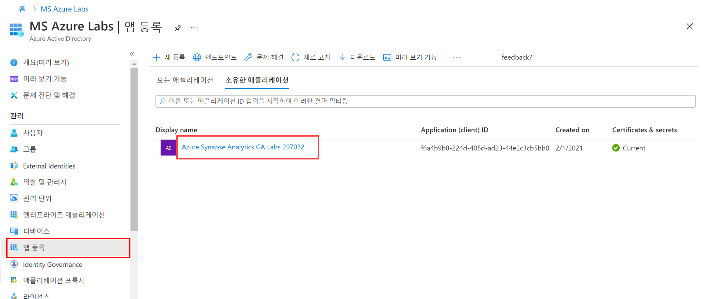

2. 애플리케이션을 선택하여 속성을 표시한 다음 `Application (client) ID` 속성의 값을 복사합니다(잠시 후에 연결된 서비스를 구성할 때 해당 값이 필요함).

    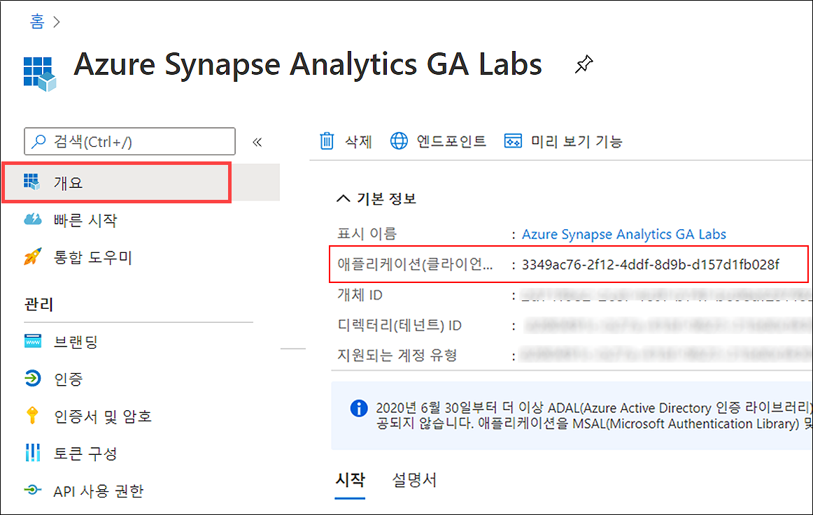

3. 비밀을 확인하려면 Azure Portal을 열고 사용자의 리소스 그룹에 작성된 Azure Key Vault 인스턴스로 이동합니다. `Secrets` 섹션을 선택하면 `ASA-GA-LABS` 비밀이 표시됩니다.

    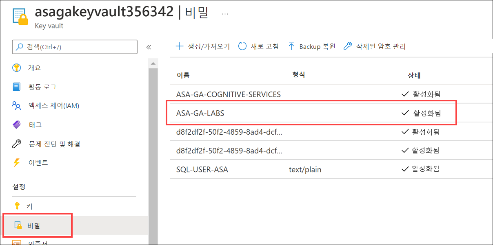

4. 먼저 Azure Machine Learning 작업 영역을 사용할 권한이 서비스 주체에 있는지를 확인해야 합니다. Azure Portal을 열고 사용자의 리소스 그룹에 작성된 Azure Machine Learning 작업 영역으로 이동합니다. 왼쪽의 `Access control (IAM)` 섹션을 선택하고 `+ Add`, `Add role assignment`를 차례로 선택합니다. `Add role assignment` 대화 상자에서 `Contributor` 역할을 선택하고 `Azure Synapse Analytics GA Labs SUFFIX`(여기서 `SUFFIX`는 랩 배포 시에 사용했던 사용자의 고유 접미사) 서비스 주체를 선택한 후에 `Save`을 선택합니다.

    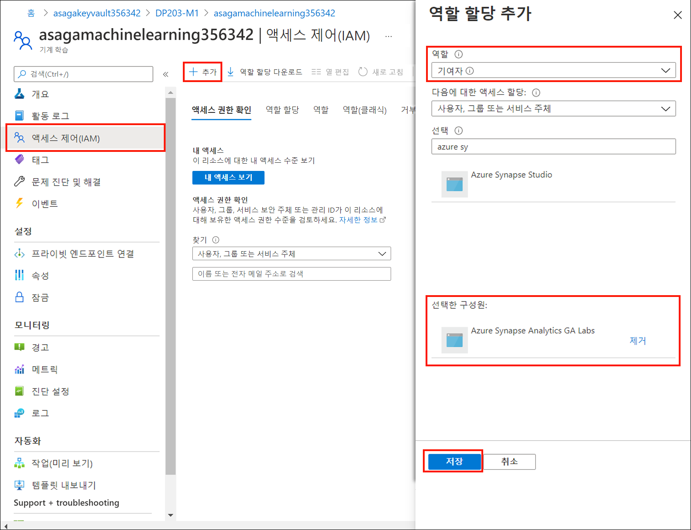

    이제 Azure Machine Learning 연결된 서비스를 만들 수 있습니다.

1. Synapse Studio(<https://web.azuresynapse.net/>)를 엽니다.

2. **관리** 허브를 선택합니다.

    

3. `Linked services` 를 선택하고 `+ New` 를 선택합니다. `New linked service` 대화 상자의 검색 필드에 `Azure Machine Learning`을 입력합니다. `Azure Machine Learning` 옵션을 선택하고 `Continue` 을 선택합니다.

    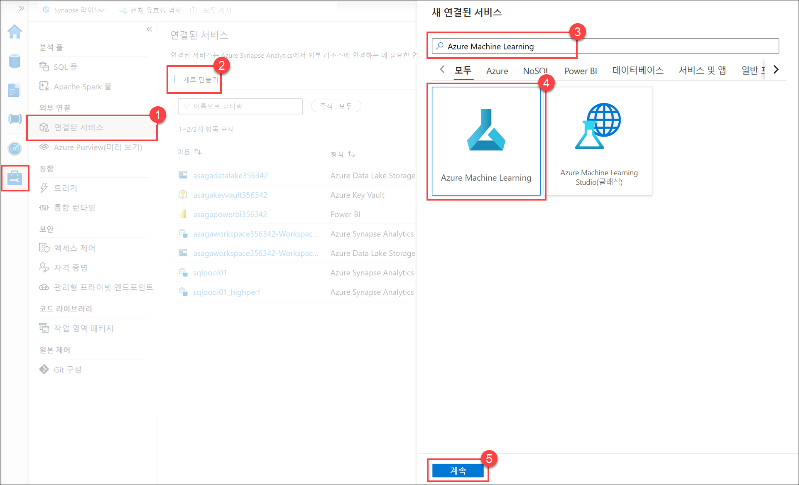

4. `New linked service (Azure Machine Learning)` 대화 상자에서 다음 속성을 입력합니다.

   - 이름: `asagamachinelearning01`을 입력합니다.
   - Azure 구독: 사용자의 리소스 그룹이 포함된 Azure 구독이 선택되어 있는지 확인합니다.
   - Azure Machine Learning 작업 영역 이름: 사용자의 Azure Machine Learning 작업 영역이 선택되어 있는지 확인합니다.
   - `Tenant identifier`는 이미 입력되어 있습니다.
   - 서비스 주체 ID: 앞에서 복사한 애플리케이션 클라이언트 ID를 입력합니다.
   - `Azure Key Vault` 옵션을 선택합니다.
   - AKV 연결된 서비스: 사용자의 Azure Key Vault 서비스가 선택되어 있는지 확인합니다.
   - 비밀 이름: `ASA-GA-LABS`를 입력합니다.

    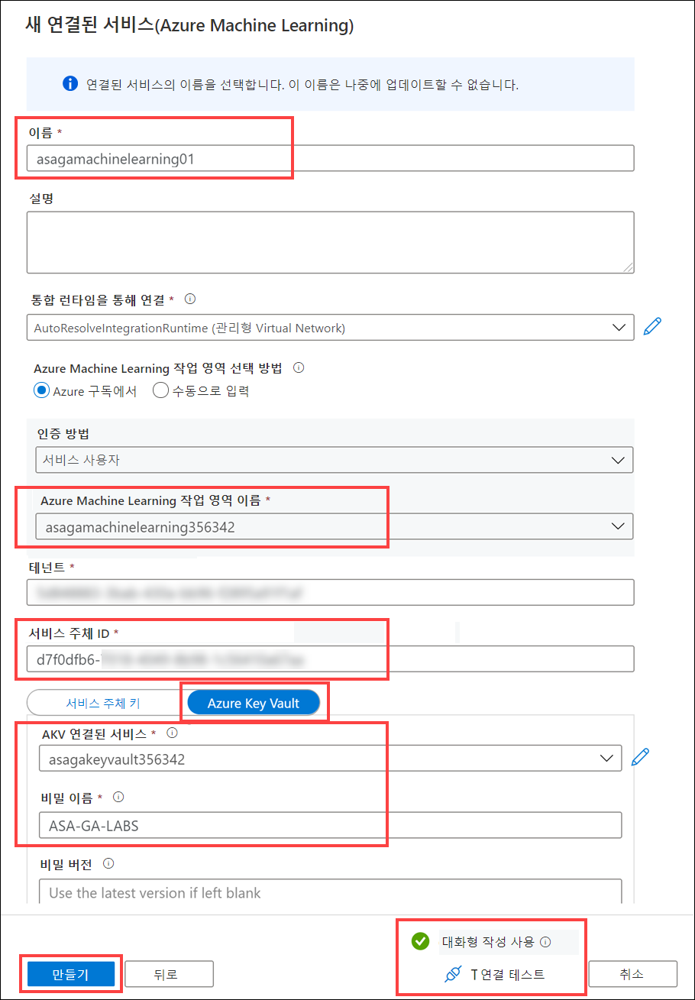

5. 다음으로 `Test connection`를 선택하여 모든 설정이 정확한지 확인하고 `Create` 를 선택합니다. Synapse Analytics 작업 영역에 Azure Machine Learning 연결된 서비스가 작성됩니다.

    >**중요**
    >
    >연결된 서비스는 작업 영역에 게시해야 완성됩니다. Azure Machine Learning 연결된 서비스 근처의 표시기를 통해 완성 여부를 확인할 수 있습니다. 연결된 서비스를 게시하려면 `Publish all`, `Publish` 를 차례로 선택합니다.

    

### 작업 2: Synapse Studio의 Azure Machine Learning 통합 기능 살펴보기

기계 학습 모델 학습 프로세스를 시작하려면 먼저 Spark 테이블부터 만들어야 합니다.

1. **데이터** 허브를 선택합니다.

    

2. **연결됨** 탭을 선택합니다.

3. 기본 `Azure Data Lake Storage Gen 2` 계정에서 `wwi-02` 파일 시스템을 선택한 다음 `wwi-02\sale-small\Year=2019\Quarter=Q4\Month=12\Day=20191201`에서 `sale-small-20191201-snappy.parquet` 파일을 선택합니다. 선택한 파일을 마우스 오른쪽 단추로 클릭하고 `New notebook -> New Spark table` 을 선택합니다.

    

4. Notebook에 Spark 클러스터를 연결하고 언어가 `PySpark(Python)`로 설정되어 있는지 확인합니다.

    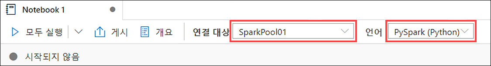

5. Notebook 셀의 내용을 다음 코드로 바꾸고 셀을 실행합니다.

    ```python
    import pyspark.sql.functions as f

    df = spark.read.load('abfss://wwi-02@<data_lake_account_name>.dfs.core.windows.net/sale-small/Year=2019/Quarter=Q4/Month=12/*/*.parquet',
        format='parquet')
    df_consolidated = df.groupBy('ProductId', 'TransactionDate', 'Hour').agg(f.sum('Quantity').alias('TotalQuantity'))
    df_consolidated.write.mode("overwrite").saveAsTable("default.SaleConsolidated")
    ```

    >**참고**:
    >
    >`<data_lake_account_name>`은 사용자의 Synapse Analytics 기본 데이터 레이크 계정 실제 이름으로 바꿉니다.

    위의 코드는 2019년 12월의 모든 사용 가능 데이터를 가져온 다음 `ProductId`, `TransactionDate`, `Hour` 수준에서 집계하여 총 제품 판매량을 `TotalQuantity`로 계산합니다. 그리고 나면 결과가 Spark 테이블 `SaleConsolidated`에 저장됩니다. `Data` 허브에서 테이블을 확인하려면 `Workspace` 섹션에서 `default (Spark)` 데이터베이스를 확장합니다. `Tables` 폴더에 테이블이 표시됩니다. 테이블 이름 오른쪽의 점 3개를 선택하여 상황에 맞는 메뉴에 `Machine Learning` 옵션을 표시합니다.

    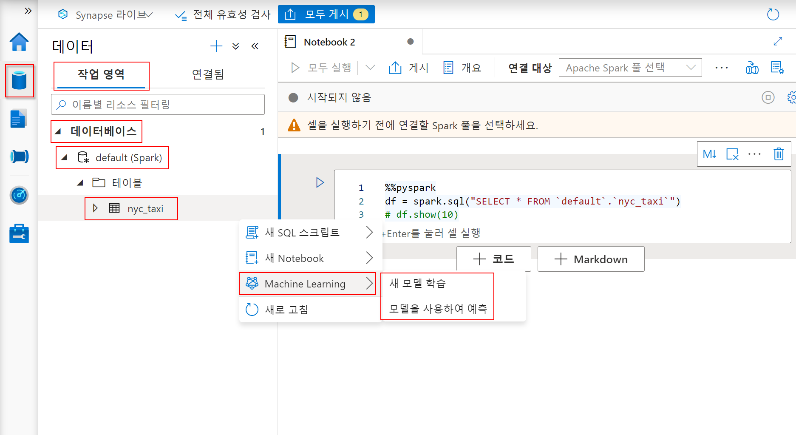

    `Machine Learning` 섹션에서 사용할 수 있는 옵션은 다음과 같습니다.

    - 새 모델로 보강: 자동화된 ML 실험을 시작하여 새 모델을 학습시킬 수 있습니다.
    - 기존 모델로 보강: 기존 Azure Cognitive Services 모델을 사용할 수 있습니다.

## 연습 2: Spark 테이블의 데이터를 사용하여 자동화된 ML 실험 트리거

이 연습에서는 자동화된 ML 실험 실행을 트리거하고 Azure Machine Learning Studio에서 실험의 진행 상황을 확인합니다.

### 작업 1: Spark 테이블에서 회귀 자동화된 ML 실험 트리거

1. 새 자동화된 ML 실험 실행을 트리거하려면 `Data` 허브를 선택하고 `saleconsolidated` Spark 테이블 오른쪽의 `...` 영역을 선택하여 상황에 맞는 메뉴를 활성화합니다.

    

2. 상황에 맞는 메뉴에서 `Enrich with new model` 을 선택합니다.

    

    `Enrich with new model` 대화 상자에서 Azure Machine Learning 실험의 속성을 설정할 수 있습니다. 다음과 같이 값을 입력합니다.

    - **Azure Machine Learning 작업 영역**: 사용자의 Azure Machine Learning 작업 영역 이름이 자동으로 입력되어 있습니다. 입력된 값을 그대로 두면 됩니다.
    - **실험 이름**: 이름이 자동으로 제안됩니다. 제안된 이름을 그대로 두면 됩니다.
    - **최적 모델 이름**: 이름이 자동으로 제안됩니다. 제안된 이름을 그대로 두면 됩니다. 나중에 Azure Machine Learning Studio에서 모델을 확인할 때 이 이름이 필요하므로 이름을 저장해 둡니다.
    - **대상 열**: 예측하려는 특성인 `TotalQuantity(long)`을 선택합니다.
    - **Spark 풀**: 사용자의 Spark 풀 이름이 자동으로 입력되어 있습니다. 입력된 값을 그대로 두면 됩니다.

    

    Apache Spark 구성 세부 정보를 확인합니다.

    - 사용할 실행기 수
    - 실행기 크기

3. `Continue` 을 선택하여 자동화된 ML 실험 구성을 계속 진행합니다.

4. 다음으로는 모델 유형을 선택합니다. 여기서는 연속 숫자 값을 예측할 것이므로 `Regression` 를 선택합니다. 모델 유형을 선택한 후 `Continue` 을 선택하여 계속 진행합니다.

    

5. `Configure regression model` 대화 상자에서 다음과 같이 값을 입력합니다.

   - **기본 메트릭**: `Spearman correlation` 가 기본적으로 제안됩니다. 제안된 메트릭을 그대로 두면 됩니다.
   - **학습 작업 시간(시간)**: 0.25로 설정합니다. 그러면 프로세스가 15분 후에 강제로 완료됩니다.
   - **최대 동시 반복**: 현재 값을 유지합니다.
   - **ONNX 모델 호환성**: `Enable` 으로 설정합니다. 현재 Synapse Studio 통합 환경에서는 ONNX 모델만 지원되므로 반드시 사용으로 설정해야 합니다.

6. 모든 값을 설정한 후 `Create run` 를 선택하여 계속 진행합니다.

    

    실행을 제출하면 자동화된 ML 실행이 제출될 때까지 기다리라는 팝업 알림이 표시됩니다. 화면 오른쪽 위의 `Notifications` 아이콘을 선택하면 알림 상태를 확인할 수 있습니다.

    

    실행이 정상 제출되면 자동화된 ML 실험 실행이 실제로 시작되었음을 알리는 추가 알림이 표시됩니다.

    

    >**참고**
    >
    >`Create run` 옵션 옆에는 `Open in notebook option` 옵션이 있습니다. 이 옵션을 선택하면 자동화된 ML 실행을 제출하는 데 사용되는 실제 Python 코드를 검토할 수 있습니다. 연습을 위해 이 작업의 모든 단계를 다시 진행하되 이번에는 `Create run` 가 아닌 `Open in notebook` 를 선택해 보세요. 그러면 다음과 같은 Notebook이 표시됩니다.
    >
    >
    >
    >잠시 자동 생성된 코드를 확인해 봅니다.

### 작업 2: Azure Machine Learning 작업 영역에서 실험 세부 정보 확인

1. 방금 시작한 실험 실행을 확인하려면 Azure Portal을 열고 리소스 그룹을 선택한 다음 해당 리소스 그룹에서 Azure Machine Learning 작업 영역을 선택합니다.

    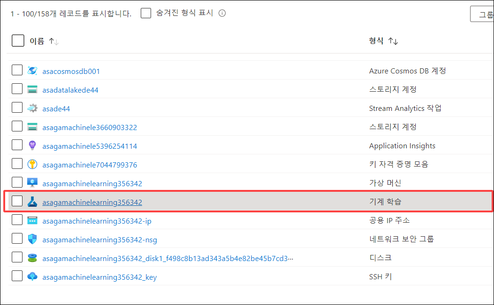

2. `Launch studio` 단추를 찾아서 선택하여 Azure Machine Learning Studio를 시작합니다.

    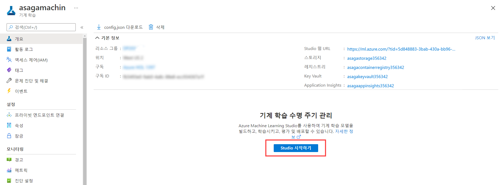

3. Azure Machine Learning Studio에서 왼쪽의 `Automated ML` 섹션을 선택하고 방금 시작한 실험 실행을 확인합니다. 실험 이름, `Running status` 및 `local` 컴퓨팅 대상을 살펴봅니다.

    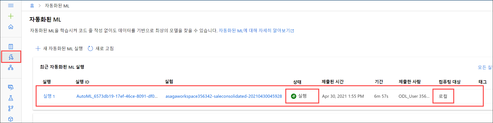

    컴퓨팅 대상으로 `local`이 표시되는 이유는, Synapse Analytics 내의 Spark 풀에서 자동화된 ML 실험을 실행하고 있기 때문입니다. 즉, Azure Machine Learning에서 볼 때 이 실험은 Azure Machine Learning 컴퓨팅 리소스가 아닌 "로컬" 컴퓨팅 리소스에서 실행되고 있는 것입니다.

4. 실행을 선택하고 `Models` 탭을 선택하여 실행에서 작성되고 있는 현재 모델 목록을 확인합니다. 모델은 메트릭 값(여기서는 `Spearman correlation`)의 내림차순으로 최적 모델부터 차례로 나열됩니다.

    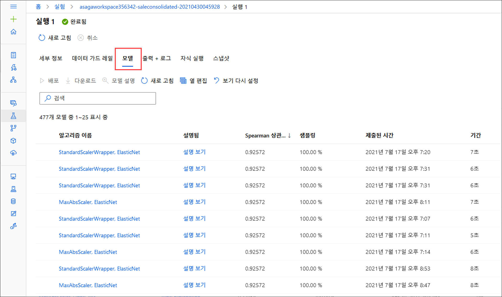

5. 최적 모델(목록 맨 위의 모델)을 선택하고 `View Explanations` 를 클릭하여 `Explanations (preview)` 탭을 열고 모델 설명을 확인합니다.

6. **기능 중요도 집계** 탭을 선택합니다. 그러면 입력 기능의 전역 중요도를 확인할 수 있습니다. 모델에서 예측 값에 가장 큰 영향을 주는 기능은 `ProductId`입니다.

    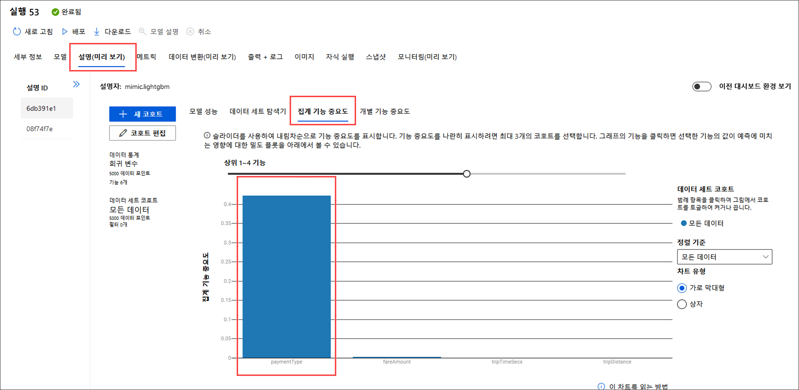

7. 다음으로 Azure Machine Learning Studio 왼쪽의 `Models` 섹션을 선택하여 Azure Machine Learning에 등록된 최적 모델을 확인합니다. 그러면 이 랩 뒷부분에서 해당 모델을 참조할 수 있습니다.

    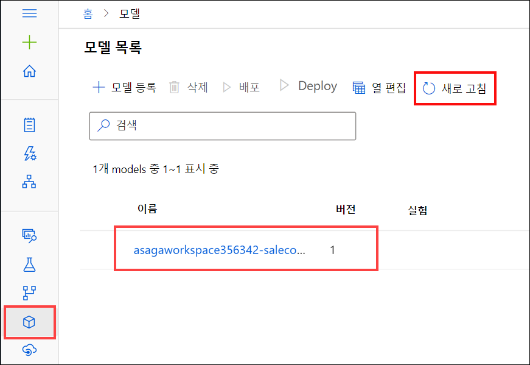

## 연습 3: 학습된 모델을 사용하여 데이터 보강

이 연습에서는 기존의 학습된 모델을 사용하여 데이터 관련 예측을 수행합니다. 작업 1에서는 Azure Machine Learning 서비스에서 학습된 모델을 사용하며 작업 2에서는 Azure Cognitive Services에서 학습된 모델을 사용합니다. 마지막으로 작업 1에서 작성한 예측 저장 프로시저를 Synapse 파이프라인에 포함합니다.

### 작업 1: Azure Machine Learning에서 학습된 모델을 사용하여 SQL 풀 테이블에서 데이터 보강

1. Synapse Studio로 다시 전환하여 **데이터** 허브를 선택합니다.

    

2. `Workspace` 탭을 선택하고 `SQLPool01 (SQL)` 데이터베이스(`Databases` 아래)에서 `wwi.ProductQuantityForecast` 테이블을 찾습니다. 테이블 이름 오른쪽의 `...` 을 선택하여 상황에 맞는 메뉴를 활성화한 다음 `New SQL script > Select TOP 100 rows` 을 선택합니다. 테이블에는 다음과 같은 열이 포함되어 있습니다.

- **ProductId**: 예측할 제품의 식별자
- **TransactionDate**: 예측할 이후 거래 날짜
- **Hour**: 예측할 이후 거래 날짜의 시간
- **TotalQuantity**: 특정 제품, 날짜, 시간에 대해 예측할 값

    

    > 현재 모든 행의 `TotalQuantity`는 0입니다. 이 항목은 나중에 확인하려는 예측 값의 자리 표시자이기 때문입니다.

3. Azure Machine Learning에서 방금 학습시킨 모델을 사용하려면 `wwi.ProductQuantityForecast`의 상황에 맞는 메뉴를 활성화하고 `Machine Learning > Enrich with existing model` 을 선택합니다.

    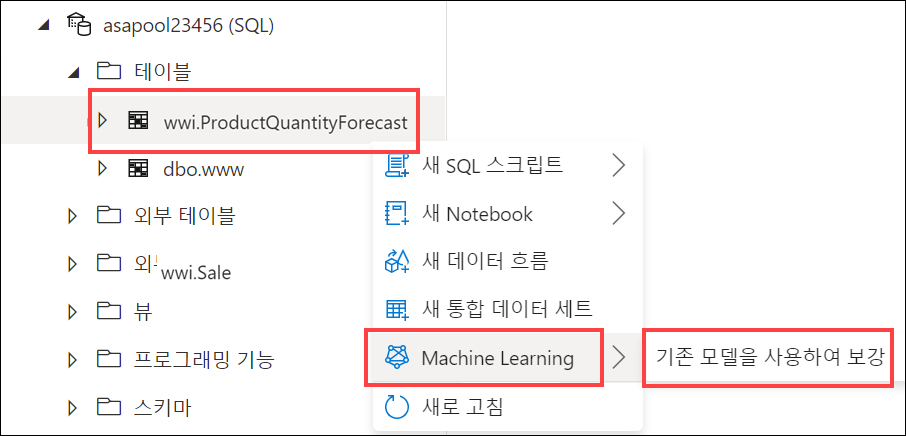

4. 그러면 열리는 `Enrich with existing model` 대화 상자에서 모델을 선택할 수 있습니다. 가장 최근 모델을 선택하고 `Continue`을 선택합니다.

    

5. 다음으로는 입력 및 출력 열 매핑을 관리합니다. 대상 테이블의 열 이름과 모델 학습에 사용한 테이블의 열 이름이 일치하므로 모든 매핑은 기본 제안값대로 두면 됩니다. `Continue` 을 선택하여 계속 진행합니다.

    

6. 마지막 단계에서는 예측을 수행할 저장 프로시저 이름을 지정하고, 모델의 직렬화된 형식을 저장할 테이블을 지정합니다. 다음 값을 입력합니다.

   - **저장 프로시저 이름**: `[wwi].[ForecastProductQuantity]`
   - **대상 테이블 선택**: `Create new`
   - **새 테이블**: `[wwi].[Model]`

    **모델 배포 + 스크립트 열기**를 선택하여 SQL 풀에 모델을 배포합니다.

    

7. 자동 작성된 새 SQL 스크립트에서 모델 ID를 복사합니다.

    

8. 생성된 T-SQL 코드는 예측 결과를 반환만 하며 실제로 저장하지는 않습니다. 예측 결과를 `[wwi].[ProductQuantityForecast]` 테이블에 직접 저장하려면 생성된 코드를 다음 코드로 바꾸고 스크립트를 실행합니다(`<your_model_id>`는 실제 모델 ID로 바꾼 후에 스크립트를 실행해야 함).

    ```sql
    CREATE PROC [wwi].[ForecastProductQuantity] AS
    BEGIN

    SELECT
        CAST([ProductId] AS [bigint]) AS [ProductId],
        CAST([TransactionDate] AS [bigint]) AS [TransactionDate],
        CAST([Hour] AS [bigint]) AS [Hour]
    INTO #ProductQuantityForecast
    FROM [wwi].[ProductQuantityForecast]
    WHERE TotalQuantity = 0;

    SELECT
        ProductId
        ,TransactionDate
        ,Hour
        ,CAST(variable_out1 as INT) as TotalQuantity
    INTO
        #Pred
    FROM PREDICT (MODEL = (SELECT [model] FROM wwi.Model WHERE [ID] = '<your_model_id>'),
                DATA = #ProductQuantityForecast,
                RUNTIME = ONNX) WITH ([variable_out1] [real])

    MERGE [wwi].[ProductQuantityForecast] AS target  
        USING (select * from #Pred) AS source (ProductId, TransactionDate, Hour, TotalQuantity)  
    ON (target.ProductId = source.ProductId and target.TransactionDate = source.TransactionDate and target.Hour = source.Hour)  
        WHEN MATCHED THEN
            UPDATE SET target.TotalQuantity = source.TotalQuantity;
    END
    GO
    ```

    위의 코드에서 `<your_model_id>`는 모델의 실제 ID(이전 단계에서 복사한 ID)로 바꿔야 합니다.

    >**참고**:
    >
    >여기서 작성된 저장 프로시저 버전에서는 `MERGE` 명령을 사용하여 `wwi.ProductQuantityForecast` 테이블에서 `TotalQuantity` 필드의 값을 현재 위치에서 업데이트합니다. `MERGE` 명령은 Azure Synapse Analytics에 최근 추가된 명령입니다. 자세한 내용은 [Azure Synapse Analytics의 새로운 MERGE 명령](https://azure.microsoft.com/updates/new-merge-command-for-azure-synapse-analytics/)을 참조하세요.

9. 이제 `TotalQuantity` 열을 대상으로 예측을 수행할 수 있습니다. SQL 스크립트를 바꿔 다음 문을 실행합니다.

    ```sql
    EXEC
        wwi.ForecastProductQuantity
    SELECT
        *
    FROM
        wwi.ProductQuantityForecast
    ```

    `TotalQuantity` 열의 값이 0에서 0이 아닌 예측 값으로 변경되었습니다.

    

### 작업 2: Azure Cognitive Services에서 학습된 모델을 사용하여 Spark 테이블에서 데이터 보강

먼저 Cognitive Services 모델의 입력으로 사용할 Spark 테이블부터 만들어야 합니다.

1. **데이터** 허브를 선택합니다.

    

2. `Linked` 탭을 선택합니다. 기본 `Azure Data Lake Storage Gen 2` 계정에서 `wwi-02` 파일 시스템을 선택한 다음 `wwi-02\sale-small-product-reviews`에서 `ProductReviews.csv` 파일을 선택합니다. 선택한 파일을 마우스 오른쪽 단추로 클릭하고 `New notebook -> New Spark table`을 선택합니다.

    

3. Notebook에 Apache Spark 풀을 연결하고 언어로 `PySpark(Python)`가 선택되어 있는지 확인합니다.

    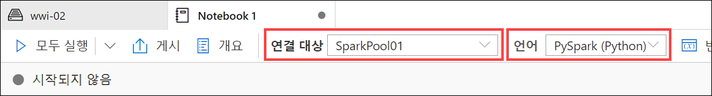

4. Notebook 셀의 내용을 다음 코드로 바꾸고 셀을 실행합니다.

    ```python
    %%pyspark
    df = spark.read.load('abfss://wwi-02@<data_lake_account_name>.dfs.core.windows.net/sale-small-product-reviews/ProductReviews.csv', format='csv'
    ,header=True
    )
    df.write.mode("overwrite").saveAsTable("default.ProductReview")
    ```

    >**참고**:
    >
    >`<data_lake_account_name>`은 사용자의 Synapse Analytics 기본 데이터 레이크 계정 실제 이름으로 바꿉니다.

5. `Data` 허브에서 테이블을 확인하려면 `Workspace` 섹션에서 `default (Spark)` 데이터베이스를 확장합니다. `Tables` 폴더에 **productreview** 테이블이 표시됩니다. 테이블 이름 오른쪽의 점 3개를 선택하여 상황에 맞는 메뉴에 `Machine Learning` 옵션을 표시합니다. 그런 다음 `Machine Learning > Enrich with existing model`을 선택합니다.

    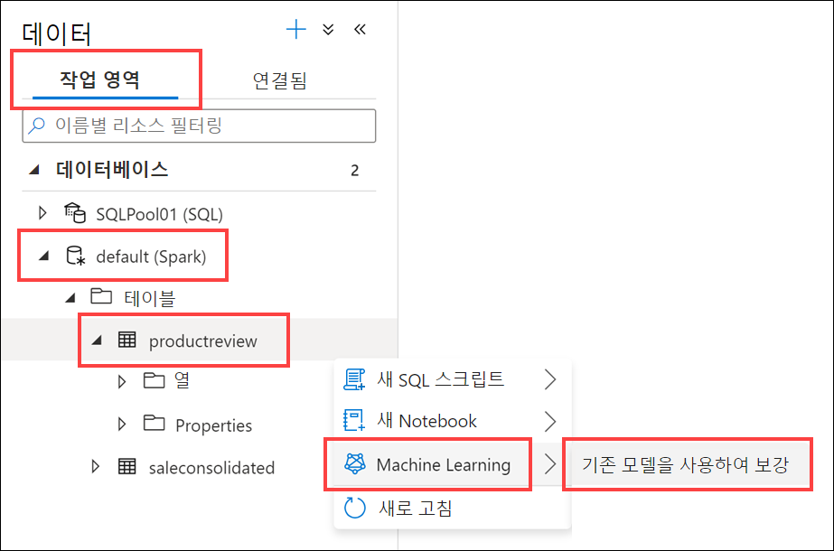

6. `Enrich with existing model` 대화 상자의 `Azure Cognitive Services` 아래에서 `Text Analytics - Sentiment Analysis`을 선택하고 `Continue`을 선택합니다.

    

7. 그런 다음 아래과 같이 값을 입력합니다.

   - **Azure 구독**: 사용자 리소스 그룹의 Azure 구독을 선택합니다.
   - **Cognitive Services 계정**: 리소스 그룹에 프로비전된 Cogntive Services 계정을 선택합니다. 계정 이름은 `asagacognitiveservices<unique_suffix>`입니다. 여기서 `<unique_suffix>`는 Synapse Analytics 작업 영역을 배포할 때 입력했던 고유 접미사입니다.
   - **Azure Key Vault 연결된 서비스**: Synapse Analytics 작업 영역에 프로비전된 Azure Key Vault 연결된 서비스를 선택합니다. 서비스 이름은 `asagakeyvault<unique_suffix>`입니다. 여기서 `<unique_suffix>`는 Synapse Analytics 작업 영역을 배포할 때 입력했던 고유 접미사입니다.
   - **비밀 이름**: `ASA-GA-COGNITIVE-SERVICES`(지정한 Cognitive Services 계정용 키가 포함된 비밀 이름).

8. `계속`을 선택하여 다음 단계를 진행합니다.

    

9. 그런 다음 아래과 같이 값을 입력합니다.

   - **언어**: `English`를 선택합니다.
   - **텍스트 열**: `ReviewText (string)` 를 선택합니다.

10. `Notebook 열기`를 선택하여 생성된 코드를 확인합니다.

    >**참고**:
    >
    >Notebook 셀을 실행하여 `ProductReview` Spark 테이블을 만들 때 해당 Notebook에서 Spark 세션이 시작되었습니다. Synapse Analytics 작업 영역의 기본 설정을 사용하는 경우에는 이 세션과 병렬로 실행되는 새 Notebook을 시작할 수 없습니다.
    따라서 Cognitive Services 통합 코드가 포함된 셀 2개의 내용을 해당 Notebook에 복사한 다음 이미 시작된 Spark 세션에서 이 두 셀을 실행해야 합니다. 셀 2개를 복사하면 다음과 같은 화면이 표시됩니다.
    >
    >

    >**참고**:
    >셀을 복사하지 않고 Synapse Studio에서 생성된 Notebook을 실행하려는 경우에는 `Monitor` 허브의 `Apache Spark applications` 섹션을 통해 실행 중인 Spark 세션을 확인한 후 취소할 수 있습니다. 자세한 내용은 [Synapse Studio를 사용하여 Apache Spark 애플리케이션 모니터링](https://docs.microsoft.com/azure/synapse-analytics/monitoring/apache-spark-applications)을 참조하세요. 이 랩에서는 실행 중인 Spark 세션을 취소한 후 새 세션을 시작하는 데 걸리는 추가 시간을 절약하기 위해 셀 복사 방식을 사용했습니다.

    Notebook에서 셀 2와 3을 실행하여 데이터의 감정 분석 결과를 확인합니다.

    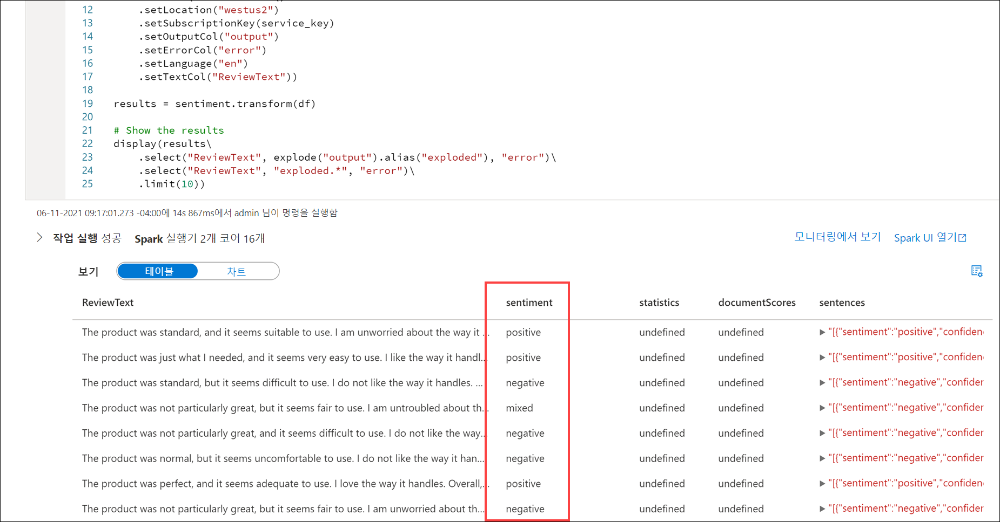

### 작업 3: Synapse 파이프라인에서 기계 학습 기반 보강 절차 통합

1. **통합** 허브를 선택합니다.

    

2. **+**, **파이프라인**을 차례로 선택하여 새 Synapse 파이프라인을 만듭니다.

    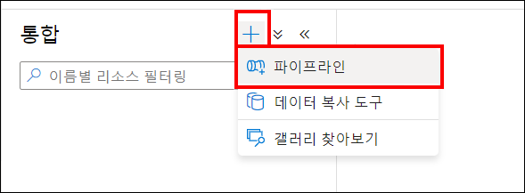

3. 속성 창에 파이프라인 이름으로 `Product Quantity Forecast`을 입력하고 **속성** 단추를 선택하여 창을 숨깁니다.

    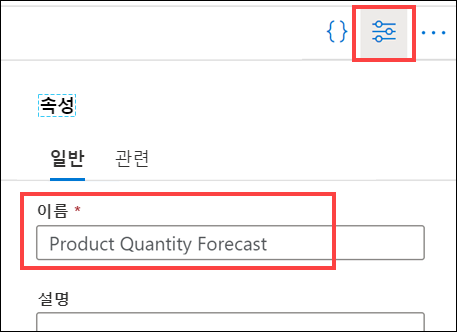

4. `Move & transform` 섹션에서 `Copy data` 활동을 추가한 후 이름을 `Import forecast requests`로 지정합니다.

    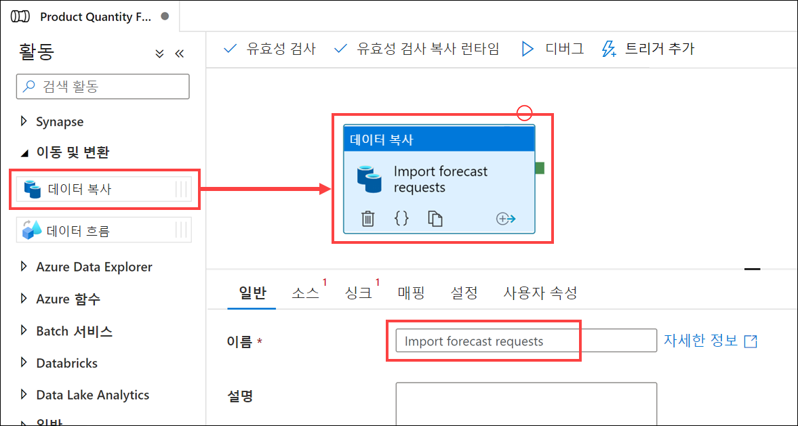

5. 복사 활동 속성의 `Source` 섹션에서 다음 값을 입력합니다.

   - **원본 데이터 집합**: `wwi02_sale_small_product_quantity_forecast_adls` 데이터 집합을 선택합니다.
   - **파일 경로 유형**: `Wildcard file path` 를 선택합니다.
   - **와일드카드 경로**: 첫 번째 텍스트 상자에는 `sale-small-product-quantity-forecast`를 입력하고 두 번째 텍스트 상자에는 `*.csv`를 입력합니다.

    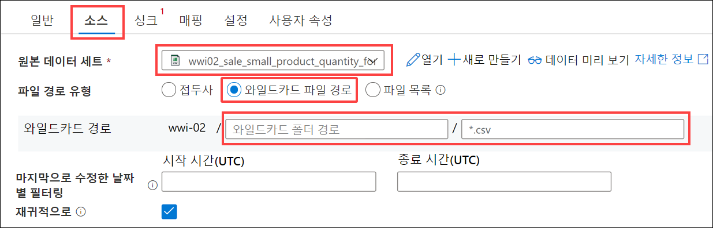

6. 복사 활동 속성의 `Sink` 섹션에서 다음 값을 입력합니다.

   - **싱크 데이터 집합**: `wwi02_sale_small_product_quantity_forecast_asa` 데이터 집합을 선택합니다.

    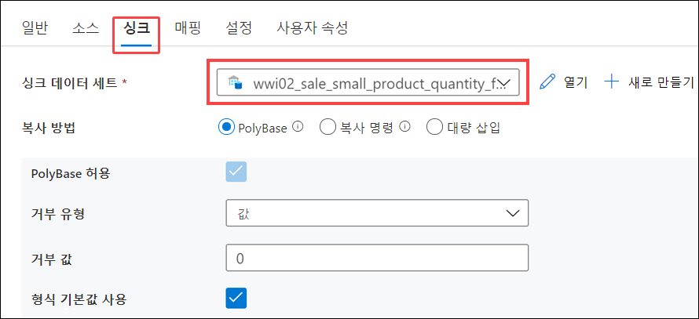

7. 복사 활동 속성의 `Mapping` 섹션에서 `Import schemas` 를 선택하고 원본과 싱크 간의 필드 매핑을 확인합니다.

    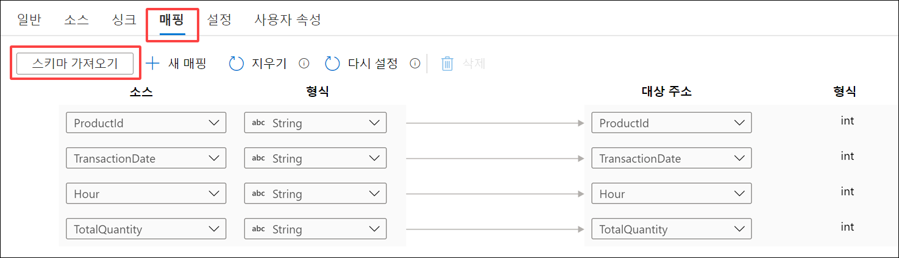

8. 복사 활동 속성의 `Settings` 섹션에서 다음 값을 입력합니다.

   - **준비 사용**: 옵션을 선택합니다.
   - **준비 계정 연결된 서비스**: `asagadatalake<unique_suffix>` 연결된 서비스를 선택합니다(여기서 `<unique_suffix>`는 Synapse Analytics 작업 영역을 배포할 때 입력했던 고유 접미사).
   - **스토리지 경로**: `staging`을 입력합니다.

    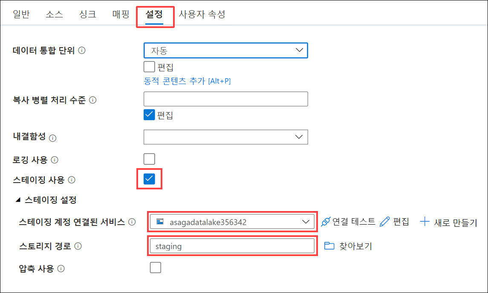

9. `Synapse` 섹션에서 `SQL pool stored procedure` 활동을 추가하고 이름을 `Forecast product quantities` 으로 지정합니다. 데이터를 가져온 후 저장 프로시저가 실행되도록 두 파이프라인 활동을 연결합니다.

    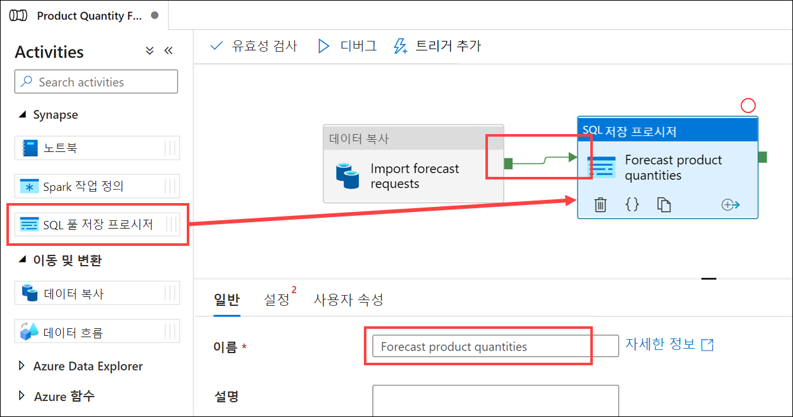

10. 저장 프로시저 활동 속성의 `Settings` 섹션에서 다음 값을 입력합니다.

    - **Azure Synapse 전용 SQL 풀**: 전용 SQL 풀(예: `SQLPool01`)을 선택합니다.
    - **저장 프로시저 이름**: `[wwi].[ForecastProductQuantity]`를 선택합니다.

    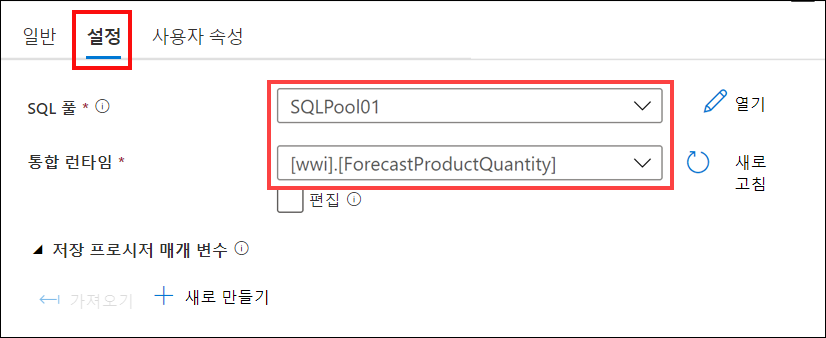

11. **디버그**를 선택하여 파이프라인이 올바르게 작동하는지 확인합니다.

    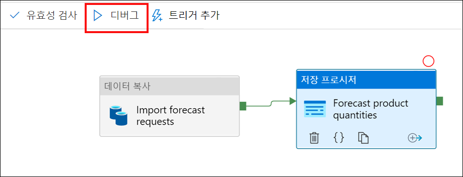

    파이프라인 **출력** 탭에 디버그 상태가 표시됩니다. 두 활동의 상태가 모두 `Succeeded` 으로 표시될 때까지 기다립니다.

    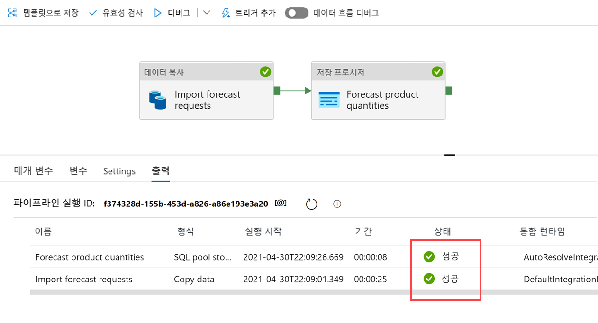

12. **모두 게시**, **게시**를 차례로 선택하여 파이프라인을 게시합니다.

13. **개발** 허브를 선택합니다.

    

14. **+**, **SQL 스크립트**를 차례로 선택합니다.

    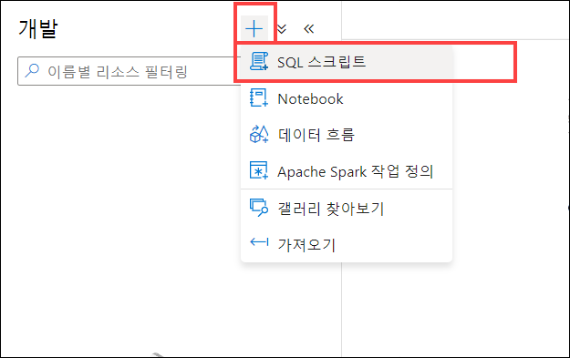

15. 전용 SQL 풀에 연결하여 다음 스크립트를 실행합니다.

    ```sql
    SELECT  
        *
    FROM
        wwi.ProductQuantityForecast
    ```

    결과에는 Hour = 11(파이프라인에서 가져온 행에 해당하는 숫자)의 예측 값이 표시됩니다.

    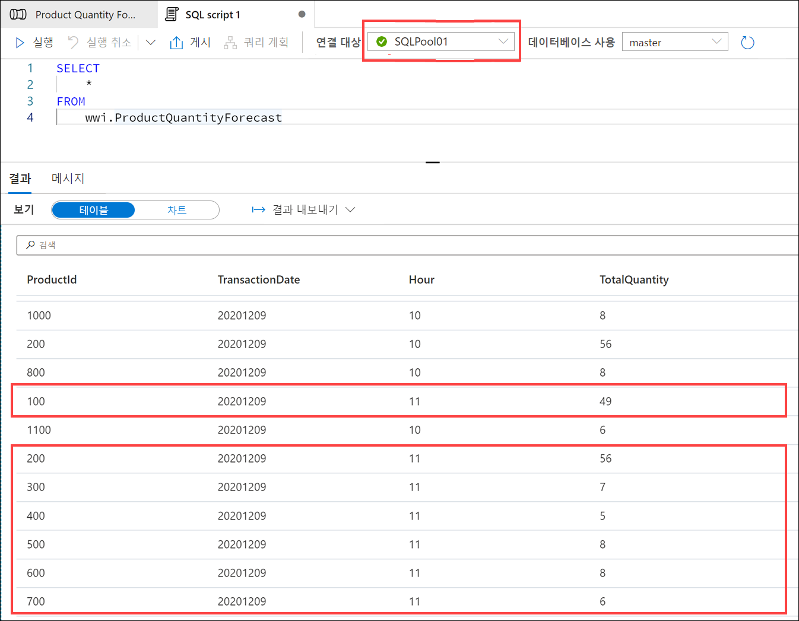

## 연습 4: Power BI를 사용하여 예측 결과 제공

이 연습에서는 Power BI 보고서에서 예측 결과를 확인합니다. 그리고 새 입력 데이터를 사용해 예측 파이프라인을 트리거하고 Power BI 보고서에서 업데이트된 수량을 확인합니다.

### 작업 1: Power BI 보고서에서 예측 결과 표시

먼저 Power BI에 간단한 제품 수량 예측 보고서를 게시합니다.

1. GitHub 리포지토리에서 `ProductQuantityForecast.pbix` 파일을 다운로드합니다. [ProductQuantityForecast.pbix](ProductQuantityForecast.pbix)(GitHub 페이지에서 `Download` 선택)

2. Power BI Desktop에서 해당 파일을 엽니다(자격 증명 누락 경고는 무시하면 됨). 그리고 자격 증명을 업데이트하라는 메시지가 처음 표시되면 해당 메시지를 무시한 후 연결 정보를 업데이트하지 않고 팝업을 닫으면 됩니다.

3. 보고서의 `Home` 섹션에서 **데이터 변환**을 선택합니다.

    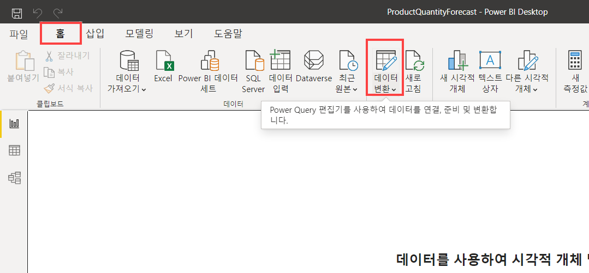

4. `ProductQuantityForecast` 쿼리의 `APPLIED STEPS` 목록에서 `Source` 항목의 **톱니 바퀴 아이콘**을 선택합니다.

    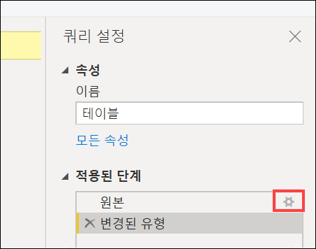

5. 서버 이름을 `asagaworkspace<unique_suffix>.sql.azuresynapse.net` 으로 변경하고(여기서 `<unique_suffix>` 는 Synapse Analytics 작업 영역의 고유 접미사) **확인**을 선택합니다.

    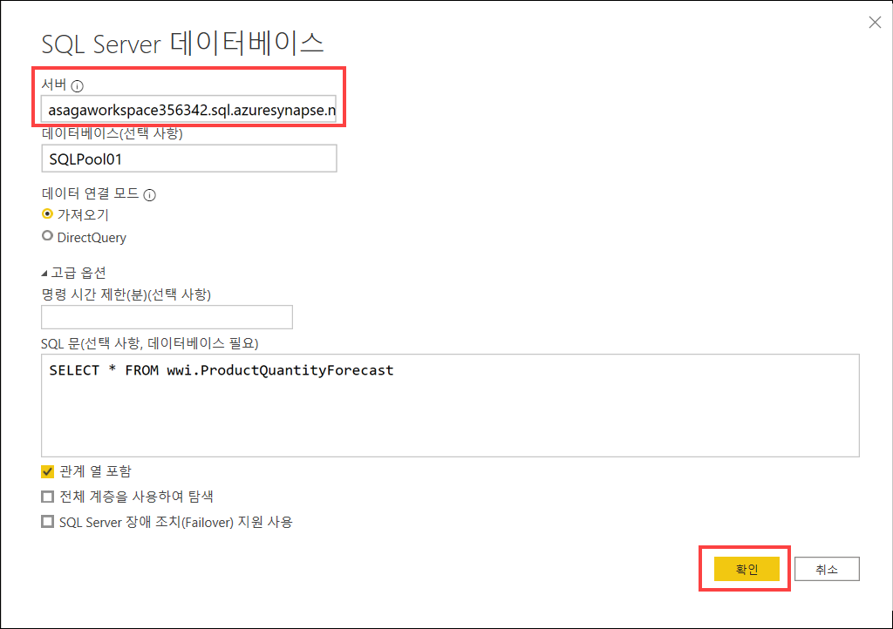

6. 자격 증명 팝업 창이 나타나고 Synapse Analytics SQL 풀에 연결하려면 자격 증명을 입력하라는 메시지가 표시됩니다(이 팝업이 표시되지 않으면 리본에서 `Data source settings`을 선택하고 데이터 원본을 선택한 후 `Edit Permissions...` > `Edit...` > `Credentials` 선택).

7. 자격 증명 창에서 `Microsoft 계정`을 선택하고 `Sign in` 을 선택합니다. Power BI Pro 계정을 사용하여 로그인합니다.

    

8. 로그인한 후 **연결**을 선택하여 전용 SQL 풀에 대한 연결을 설정합니다.

    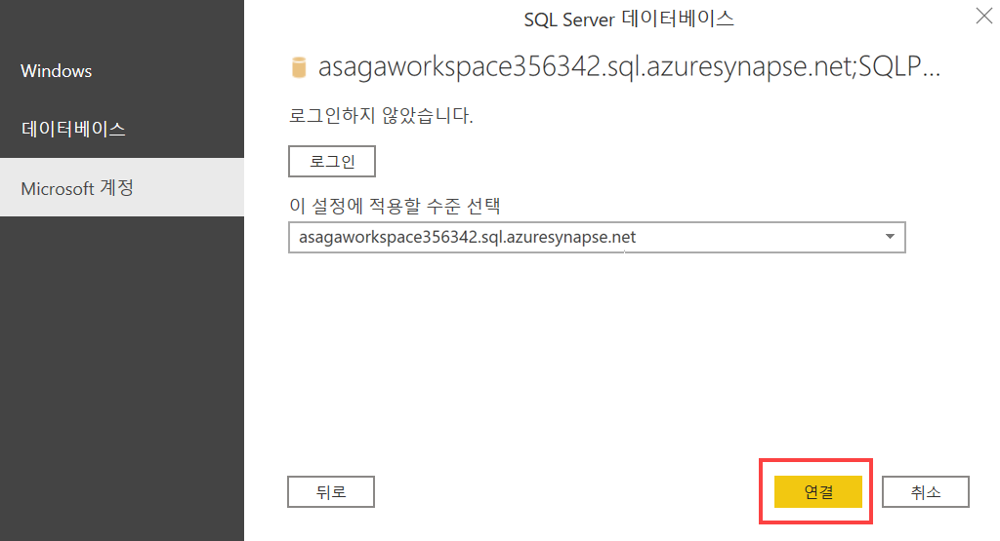

9. 열려 있는 팝업 창을 모두 닫고 **닫기 및 적용**을 선택합니다.

    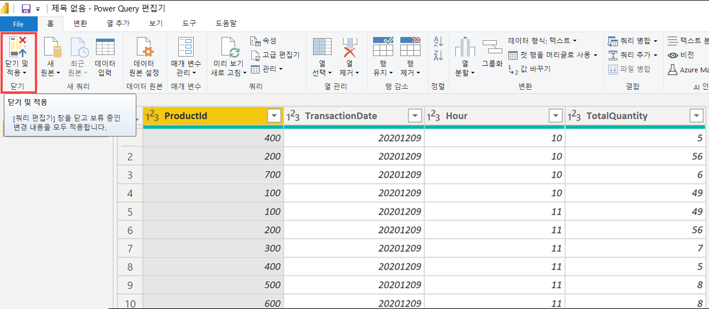

10. 보고서가 로드되면 리본에서 **게시**를 선택합니다. 변경 내용을 저장하라는 메시지가 표시되면 **저장**을 선택합니다.

    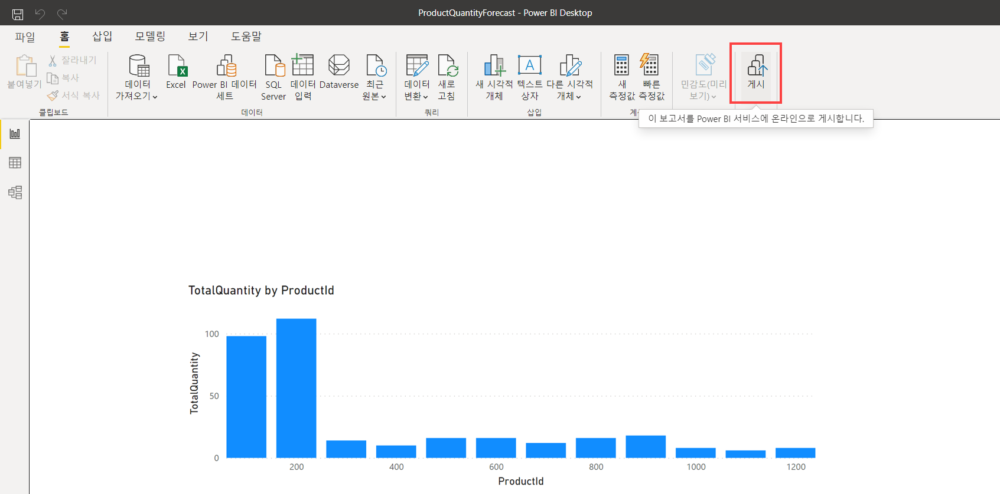

11. 메시지가 표시되면 이 랩에서 사용 중인 Azure 계정의 이메일 주소를 입력하고 **계속**을 선택합니다. 메시지가 표시되면 암호를 입력하거나 목록에서 사용자를 선택합니다.

    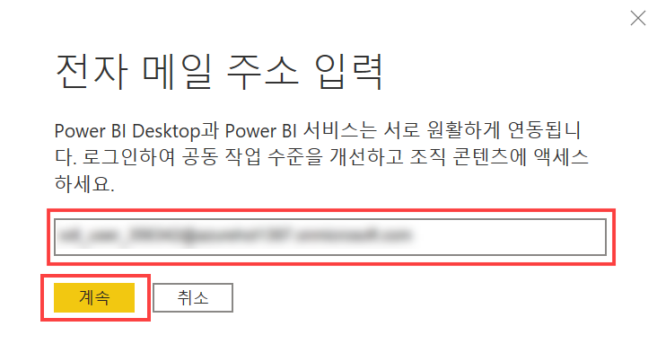

12. 이 랩용으로 만든 Synapse Analytics Power BI Pro 작업 영역을 선택하고 **저장**을 선택합니다.

    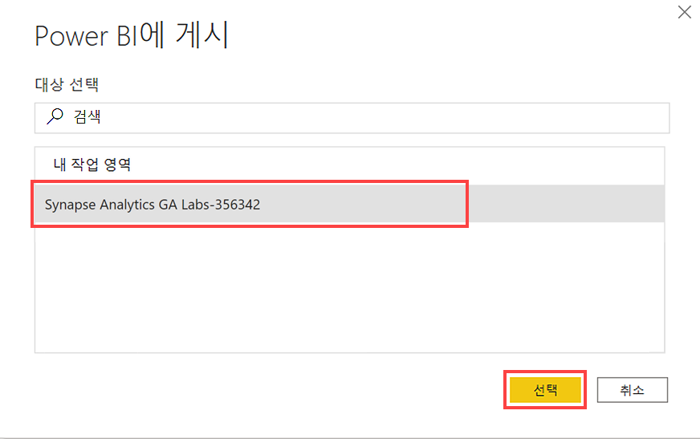

    게시가 정상적으로 완료될 때까지 기다립니다.

    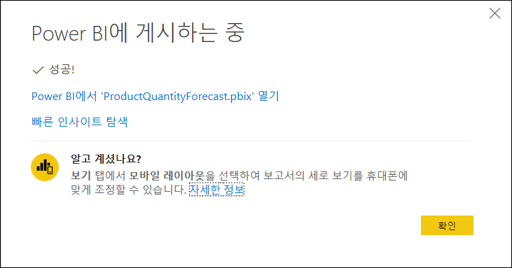

13. 새 웹 브라우저 탭에서 <https://powerbi.com>으로 이동합니다.

14. **로그인**을 선택하고 메시지가 표시되면 랩에서 사용 중인 Azure 자격 증명을 입력합니다.

15. 왼쪽 메뉴에서 **작업 영역**을 선택하고 이 랩용으로 만든 Synapse Analytics Power BI 작업 영역을 선택합니다. 방금 게시한 작업 영역을 선택하면 됩니다.

    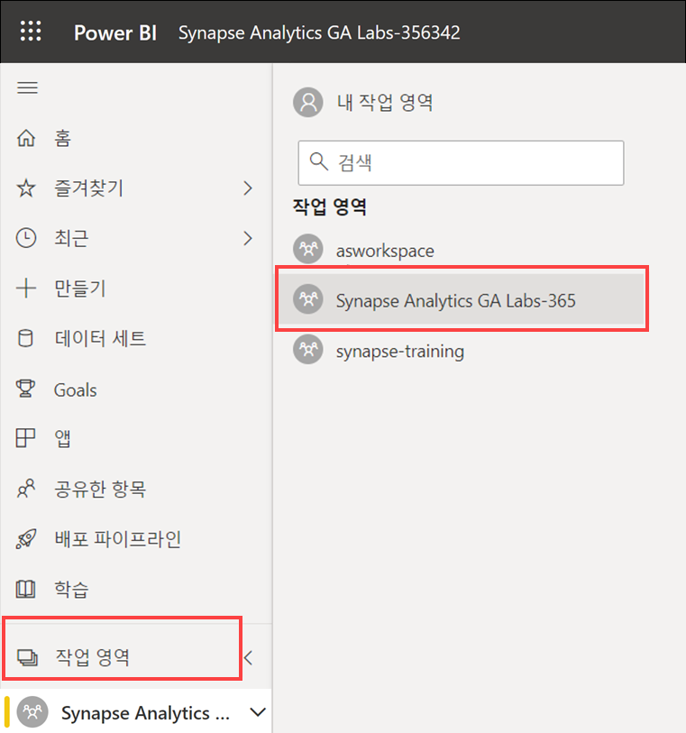

16. 맨 위 메뉴에서 **설정**을 선택한 후 **설정**을 선택합니다.

    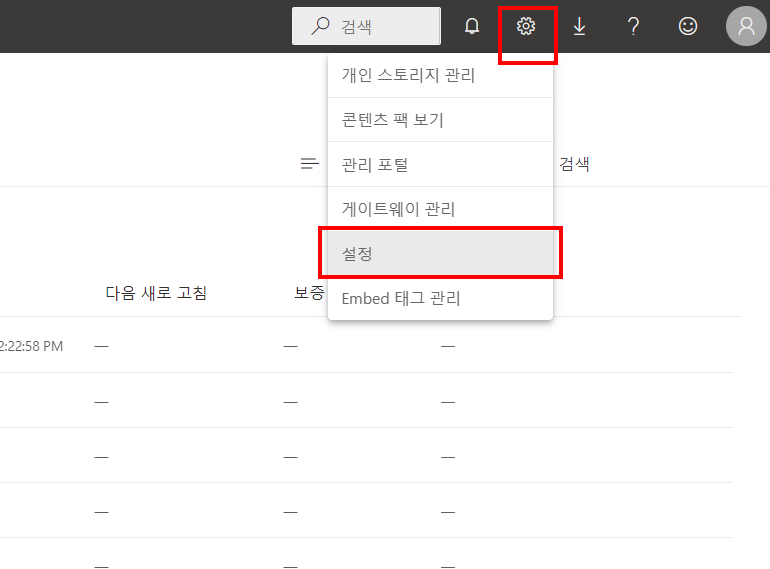

17. **데이터 집합** 탭을 선택하고 **자격 증명 편집**을 선택합니다.

    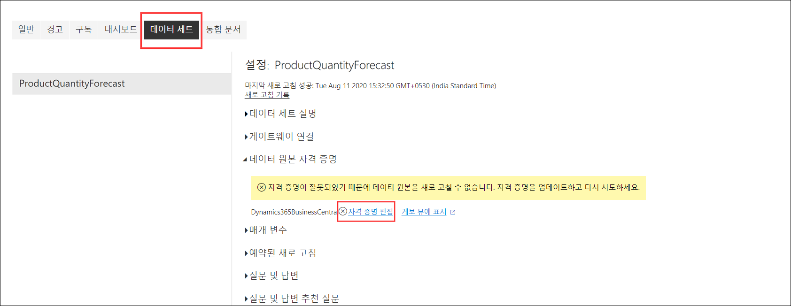

18. `Authentication method` 에서 **OAuth2**를 선택하고 **로그인**을 선택한 후에 메시지가 표시되면 자격 증명을 입력합니다.

    

19. 보고서의 결과를 확인하려면 Synapse Studio로 다시 전환합니다.

20. 왼쪽에서 `Develop` 허브를 선택합니다.

    

21. `Power BI` 섹션을 확장하고 작업 영역의 `Power BI reports` 섹션에서 `ProductQuantityForecast` 보고서를 선택합니다.

    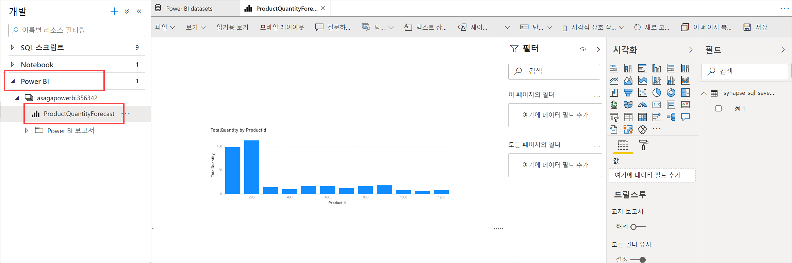

<!-- ### 작업 2: 이벤트 기반 트리거를 사용하여 파이프라인 트리거

1. Synapse Studio의 왼쪽에서 **통합** 허브를 선택합니다.

    

2. `Product Quantity Forecast` 파이프라인을 엽니다. **+ 트리거 추가**, **새로 만들기/편집**을 차례로 선택합니다.

    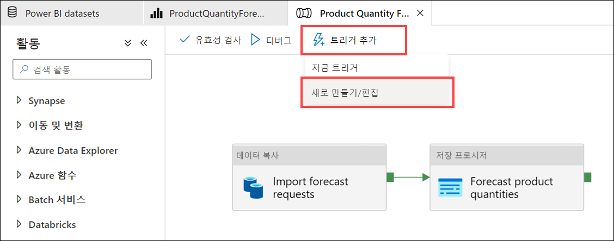

3. `Add triggers` 대화 상자에서 **트리거 선택...**, **+ 새로 만들기** 를 차례로 선택합니다.

    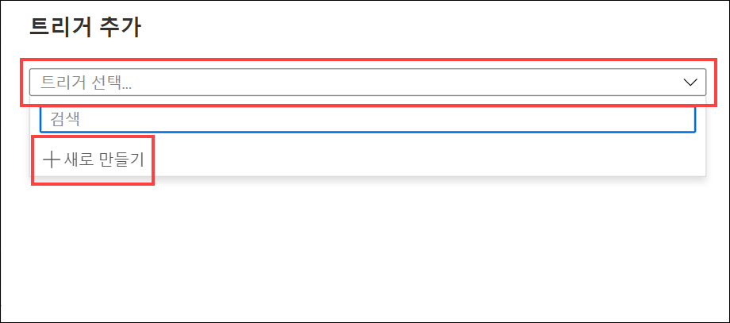

4. `New trigger` 창에서 다음 값을 입력합니다.

   - **이름**: `New data trigger`를 입력합니다.
   - **유형**: `Storage events`를 선택합니다.
   - **Azure 구독**: 올바른 Azure 구독(사용자의 리소스 그룹이 포함된 구독)이 선택되어 있는지 확인합니다.
   - **스토리지 계정 이름**: `asagadatalake<uniqu_prefix>` 계정을 선택합니다(여기서 `<unique_suffix>`는 Synapse Analytics 작업 영역의 고유 접미사).
   - **컨테이너 이름**: `wwi-02`를 선택합니다.
   - **Blob 경로 시작 문자**: `sale-small-product-quantity-forecast/ProductQuantity`를 입력합니다.
   - **이벤트**: `Blob created` 을 선택합니다.

   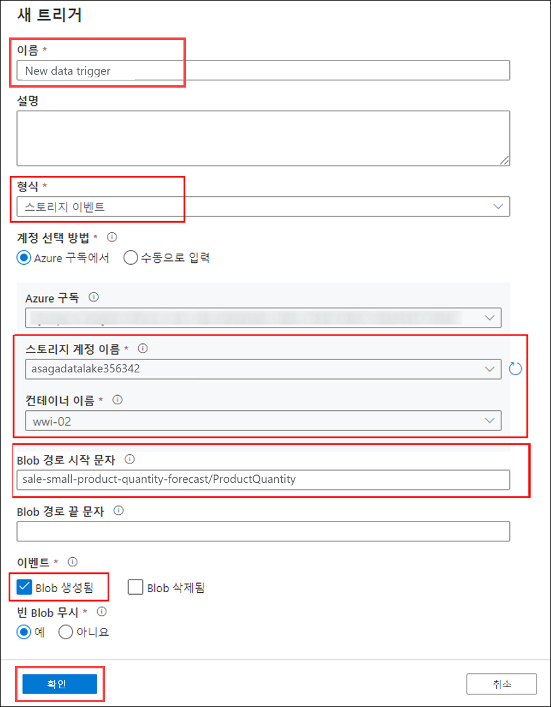

5. **계속**을 선택하여 트리거를 만든 후 `Data preview` 대화 상자에서 `Continue`을 다시 선택합니다. 그런 다음 `OK`, `OK`을 차례로 선택하여 트리거를 저장합니다.

    

6. Synapse Studio에서 `Publish all`, `Publish` 를 차례로 선택하여 변경 내용을 모두 게시합니다.

7. https://solliancepublicdata.blob.core.windows.net/wwi-02/sale-small-product-quantity-forecast/ProductQuantity-20201209-12.csv에서 `ProductQuantity-20201209-12.csv` 파일을 다운로드합니다.

8. Synapse Studio에서 왼쪽의 `Data` 허브를 선택하고 `Linked` 섹션에서 기본 데이터 레이크 계정으로 이동한 다음 `wwi-02 > sale-small-product-quantity-forecast` 경로를 엽니다. 기존 `ProductQuantity-20201209-11.csv` 파일을 삭제하고 `ProductQuantity-20201209-12.csv` 파일을 업로드합니다. 그러면 `Product Quantity Forecast` 파이프라인이 트리거됩니다. 이 파이프라인은 해당 CSV 파일에서 예측 요청을 가져온 다음 예측 저장 프로시저를 실행합니다.

9. Synapse Studio에서 왼쪽의 `Monitor` 허브를 선택하고 `트리거 실행`을 선택하여 새로 활성화된 파이프라인 실행을 확인합니다. 파이프라인 실행이 완료되면 Synapse Studio에서 Power BI 보고서를 새로 고쳐 업데이트된 데이터를 확인합니다. -->

## 연습 5: 정리

다음 단계를 완료하여 더 이상 필요없는 리소스를 정리할 수 있습니다.

### 작업 1: 전용 SQL 풀 일시 중지

1. Synapse Studio(<https://web.azuresynapse.net/>)를 엽니다.

2. **관리** 허브를 선택합니다.

    

3. 왼쪽 메뉴에서 **SQL 풀**을 선택합니다 **(1)**. 전용 SQL 풀의 이름을 마우스 커서로 가리키고 **일시 중지(2)** 를 선택합니다.

    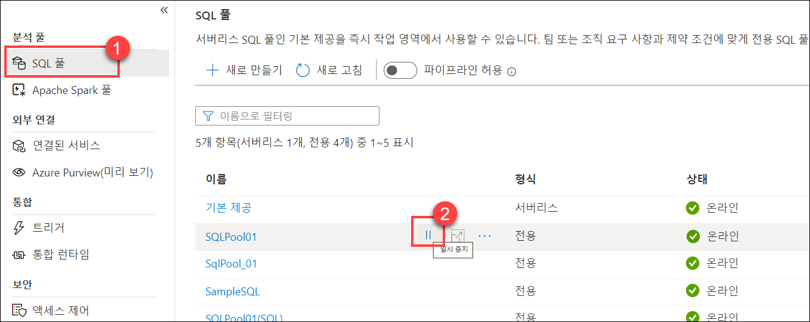

4. 메시지가 표시되면 **일시 중지**를 선택합니다.

    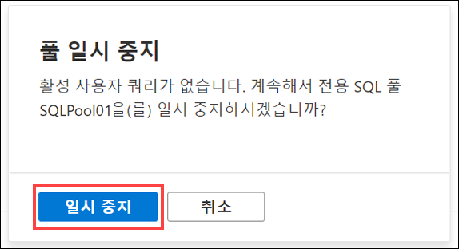

## 리소스

이 랩에서 다룬 토픽에 대해 자세히 알아보려면 다음 리소스를 참조하세요.

- [빠른 시작: Synapse에서 새로운 Azure Machine Learning 연결된 서비스 만들기](https://docs.microsoft.com/azure/synapse-analytics/machine-learning/quickstart-integrate-azure-machine-learning)
- [자습서: 전용 SQL 풀을 위한 기계 학습 모델 점수 매기기 마법사](https://docs.microsoft.com/azure/synapse-analytics/machine-learning/tutorial-sql-pool-model-scoring-wizard)
