---
lab:
    title: 'Apache Spark를 사용하여 데이터를 탐색 및 변환한 후 데이터 웨어하우스에 로드'
    module: '모듈 4'
---

# 랩 4 - Apache Spark를 사용하여 데이터를 탐색 및 변환한 후 데이터 웨어하우스에 로드

이 랩에서는 데이터 레이크에 저장된 데이터를 탐색 및 변환한 다음 관계형 데이터 저장소에 로드하는 방법을 알아봅니다. 구체적으로는 Parquet 및 JSON 파일을 살펴보고, JSON 파일을 쿼리한 다음 계층 구조를 적용하여 변환하는 기술을 사용해 봅니다. 그런 후에는 Apache Spark를 사용하여 데이터 웨어하우스에 데이터를 로드하고, 데이터 레이크의 Parquet 데이터를 전용 SQL 풀의 데이터와 조인합니다.

이 랩을 마치면 다음과 같은 역량을 갖추게 됩니다.

- Synapse Studio에서 데이터 탐색 수행
- Azure Synapse Analytics에서 Spark Notebooks를 사용하여 데이터 수집
- Azure Synapse Analytics의 Spark 풀에서 DataFrames를 사용하여 데이터 변환
- Azure Synapse Analytics에서 SQL 및 Spark 풀 통합

## 랩 설정 및 필수 구성 요소

이 랩을 시작하기 전에 랩 환경을 만드는 설정 단계를 성공적으로 완료했는지 확인하세요. 그런 후에 다음 설정 작업을 완료하여 전용 SQL 풀을 만드세요.

> **참고**: 설정 작업에는 약 6~7분이 소요됩니다. 스크립트가 실행 중인 동안 랩을 계속할 수 있습니다.

> **참고**: 클라우드에 만드신 개발용VM 에서 브라우저를 띄우고 azure에 접속하여 진행합니다. (<http://portal.azure.com/>)

### 작업 1: 전용 SQL 풀 만들기

1. Synapse Studio(<https://web.azuresynapse.net/>)를 엽니다.

2. **관리** 허브를 선택합니다.

    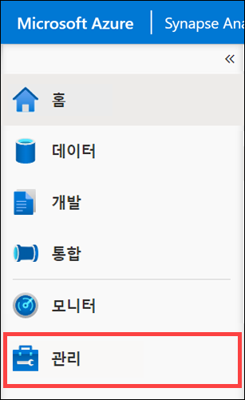

3. 왼쪽 메뉴에서 **SQL 풀**을 선택하고 **+ 새로 만들기**를 선택합니다.

    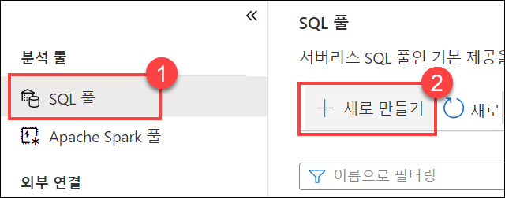

4. **전용 SQL 풀 만들기** 페이지에서 풀 이름으로 **`SQLPool01`**을 입력하고(여기에 표시된 것과 <u>똑같은</u> 이름을 사용해야 함) 성능 수준을 **DW100c**로 설정합니다(슬라이더를 왼쪽 끝으로 이동).

5. **검토 + 만들기**를 클릭합니다. 그런 다음에 유효성 검사 단계에서 **만들기**를 선택합니다.
6. 전용 SQL 풀이 만들어질 때까지 기다립니다.

> **중요:** 시작된 후, 전용 SQL 풀은 일시 중지될 때까지 Azure 구독의 크레딧을 소비합니다. 이 랩을 잠시 멈출 경우 또는 이 랩을 완료하지 않기로 결정할 경우, 랩 끝에 있는 지침을 따라 **SQL 풀을 일시 중지**해야 합니다.

### 작업 2: PowerShell 스크립트 실행

1. 이 과정에서 제공하는 호스팅되는 VM 환경에서 Powershell을 관리자 모드로 열고, 로컬 PowerShell 스크립트 파일을 실행할 수 있도록 다음을 실행하여 실행 정책을 무제한으로 설정합니다.

    ```
    Set-ExecutionPolicy Unrestricted
    ```

    > **참고**: 신뢰할 수 없는 리포지토리로부터 모듈을 설치하고 있다는 메시지가 나타나면 **모두 예**를 선택하여 설정을 진행합니다.

2. 디렉터리를 로컬 파일 시스템 내 이 리포지토리의 루트로 변경합니다.

    ```
    cd C:\dp-203\data-engineering-ilt-deployment\Allfiles\00\artifacts\environment-setup\automation\
    ```

2.1 필요한 모듈을 설치합니다. 
```
    Install-Module sqlserver
```

   - 선택을 물으면 [A] Yes to All 를 선택합니다. 
  
  ```
    Import-Module sqlserver
  
  ```
3. 다음 명령을 입력하여 SQL 풀에서 개체를 만드는 PowerShell 스크립트를 실행합니다.

    ```
    .\setup-sql.ps1
    ```

4. Azure에 로그인하라는 메시지가 나타나고 브라우저가 열리면 본인의 자격 증명을 사용하여 로그인합니다. 로그인한 후 브라우저를 닫고 Windows PowerShell로 돌아갈 수 있습니다.

5. 관련 메시지가 나타날 때 Azure 계정에 다시 로그인합니다. (스크립트가 Azure 구독에서 리소스를 관리할 수 있도록 하기 위해 필요합니다. 앞서와 동일한 자격 증명을 사용해야 합니다.)

6. Azure 구독이 여러 개인 경우에는 관련 메시지가 나타날 때 구독 목록에서 번호를 입력하여 랩에서 사용할 구독을 선택합니다.

7. 관련 메시지가 나타날 때 Azure Synapse Analytics 작업 영역이 들어 있는 리소스 그룹의 이름을 입력합니다(예: **data-engineering-synapse-*xxxxxxx***).

8. 이 스크립트가 실행되는 동안 **연습 1을 진행**합니다.

> **참고** 이 스크립트를 완료하는 데 약 2~3분이 걸립니다.
> 
> SQLPool01 전용 SQL 풀의 연결된 서비스(3개가 있음)를 만드는 동안 스크립트가 멈춘 것처럼 느껴지면 **Enter** 키를 누르세요. 그러면 PowerShell 스크립트가 새로 고쳐지고 끝까지 계속 진행되는 경우가 많습니다.
>
> ### 무시해도 되는 잠재적 오류
>
> 스크립트 실행 중에 몇 가지 오류와 경고가 발생할 수 있습니다. 아래 오류는 무시해도 괜찮습니다.
> 
> 1. 다음 오류는 전용 SQL 풀에서 SQL 사용자를 만들고 역할 할당을 추가할 때 발생할 수 있으며, 무시해도 괜찮습니다.
>
>       *주체 'xxx@xxx.com'을 만들 수 없습니다. Active Directory 계정을 사용하여 설정한 연결만 다른 Active Directory 사용자를 만들 수 있습니다.*
>
>2. 다음 오류도 발생할 수 있으며 무시해도 괜찮습니다.
>
>       *07-create-wwi-perf-sale-heap 및 레이블 CTAS: Sale_Heap. Null 배열로 인덱싱할 수도 없습니다.*

## 연습 1 - Synapse Studio에서 데이터 탐색 수행

데이터 수집 중에 대개 첫 번째로 수행하는 엔지니어링 작업 중 하나는 가져올 데이터 탐색입니다. 엔지니어는 데이터를 탐색하여 수집 중인 파일의 내용을 더욱 자세히 파악할 수 있습니다. 이 프로세스에서는 자동화된 수집 프로세스의 중단 원인이 될 수 있는 데이터 품질 문제 가능성을 파악할 수 있습니다. 데이터를 탐색하면 데이터 형식, 데이터 품질, 그리고 데이터를 데이터 레이크로 가져오거나 분석 워크로드에 사용하기 전에 수행해야 하는 처리 작업의 유무와 관련된 인사이트를 파악할 수 있습니다.

Tailspin Traders의 엔지니어들이 데이터 웨어하우스로 영업 데이터를 수집하는 중에 문제가 발생했습니다. 그래서 Synapse Studio를 사용하여 이러한 문제를 해결하는 방법을 파악하는 과정에서 여러분에게 지원을 요청했습니다. 이 프로세스의 첫 단계에서는 데이터를 탐색하여 Tailspin Traders에 발생한 문제의 원인을 파악한 후 해결 방법을 제공해야 합니다.

### 작업 1: Azure Synapse Studio의 데이터 미리 보기를 사용하여 데이터 탐색

Azure Synapse Studio에서는 여러 가지 방법으로 데이터를 탐색할 수 있습니다. 가령 간단한 미리 보기 인터페이스를 사용할 수도 있고, Synapse Spark Notebook를 사용하는 더욱 복잡한 프로그래밍 옵션을 활용할 수도 있습니다. 이 연습에서는 이러한 기능을 사용해 문제가 있는 파일을 탐색, 식별 및 수정하는 방법을 알아봅니다. 구체적으로는 데이터 레이크의 **wwi-02/sale-poc** 폴더에 저장된 CSV 파일을 살펴보면서 문제를 식별 및 해결하는 방법을 알아봅니다.

1. Azure Synapse Studio에서 **데이터** 허브로 이동합니다.

    

    > 데이터 허브에서는 작업 영역에 프로비전된 SQL 풀 데이터베이스 및 SQL 서버리스 데이터베이스는 물론 스토리지 계정과 기타 연결된 서비스 등의 외부 데이터 원본에도 액세스할 수 있습니다.

2. 여기서는 작업 영역 기본 데이터 레이크에 저장된 파일에 액세스할 것이므로 데이터 허브 내에서 **연결됨**탭을 선택합니다.

    

3. 연결됨 탭에서 **Azure Data Lake Storage Gen2**를 확장한 다음 작업 영역의 **기본** 데이터 레이크를 확장합니다.

    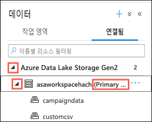

4. 기본 데이터 레이크 스토리지 계정 내의 컨테이너 목록에서 **wwi-02** 컨테이너를 선택합니다.

    

5. 컨테이너 탐색기 창에서 **sale-poc**로 이동합니다.

    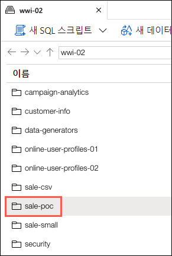

6. **sale-poc**에는 2017년 5월의 영업 데이터가 포함되어 있습니다. 폴더에 몇 개의 파일이 있습니다. 이러한 파일은 Tailspin의 가져오기 프로세스에서 발생한 문제를 처리하기 위해 임시 프로세스를 통해 가져온 것입니다. 그러면 파일 몇 개를 잠시 살펴보겠습니다.

7. 목록의 첫 번째 파일인 **sale-20170501.csv**를 마우스 오른쪽 단추로 클릭하고 상황에 맞는 메뉴에서 **미리 보기**를 선택합니다.

    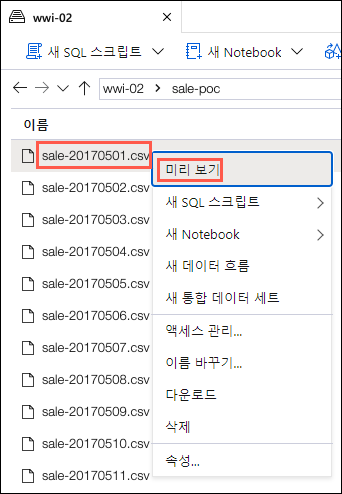

8. Synapse Studio의 미리 보기 기능을 사용하면 코드를 작성하지 않고도 파일 내용을 빠르게 검사할 수 있습니다. 즉, 미리 보기는 개별 파일의 특정 기능(열), 그리고 해당 열 내에 저장된 데이터 형식을 기본적으로 파악할 수 있는 효율적인 방법입니다.

    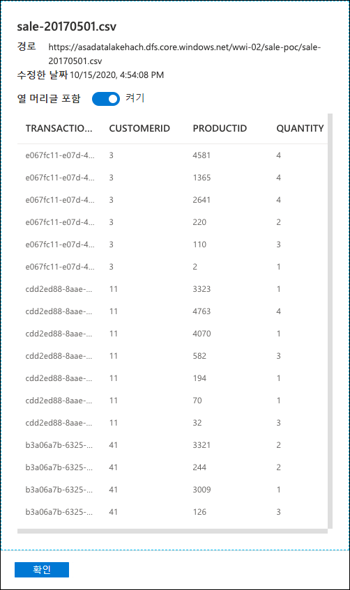

    > **sale-20170501.csv**의 미리 보기 대화 상자에서 파일 미리 보기를 스크롤하여 잠시 살펴봅니다. 아래쪽으로 스크롤하면 미리 보기에 포함되는 행 수가 제한됨을 확인할 수 있습니다. 즉, 미리 보기에서는 파일 구조를 대략적으로만 파악할 수 있습니다. 오른쪽으로 스크롤하면 파일에 포함된 열의 이름과 수를 확인할 수 있습니다.

9. **확인**을 선택하여 미리 보기를 닫습니다.

10. 데이터 탐색을 수행할 때는 여러 파일을 살펴보면 데이터를 더욱 정확하게 대표하는 샘플을 파악할 수 있습니다. 이제 폴더의 다음 파일을 살펴보겠습니다. **sale-20170502.csv** 파일을 마우스 오른쪽 단추로 클릭하고 상황에 맞는 메뉴에서 **미리 보기**를 선택합니다.

    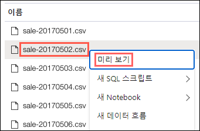

11. 이 파일의 구조는 **sale-20170501.csv** 파일과 다릅니다. 이 파일의 경우 미리 보기에 데이터 행이 표시되지 않으며, 열 머리글에는 필드 이름이 아닌 데이터가 포함되어 있습니다.

    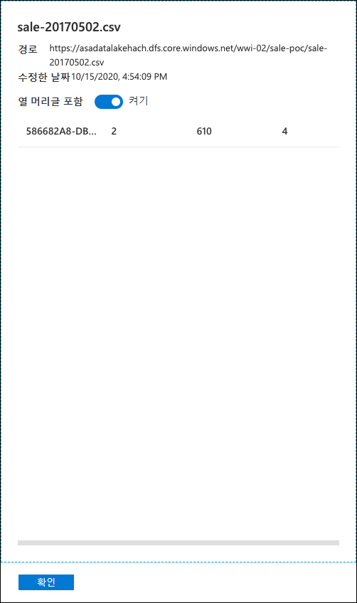

12. 이 파일은 열 머리글을 포함하지 않은 것처럼 보이므로, **열 머리글 포함** 옵션을 **끄기**로 설정하고(변경하는 데 시간이 오래 걸릴 수 있음) 결과를 조사합니다.

    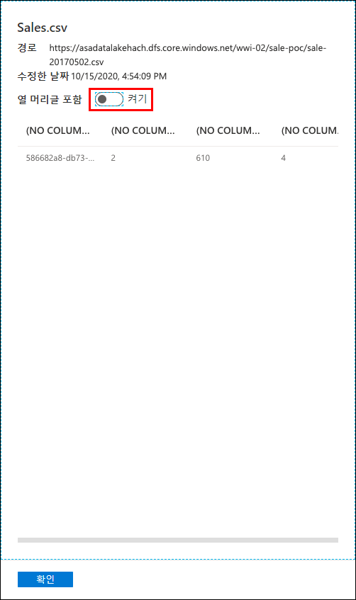

    > **열 머리글 포함**을 끄기로 설정하면 파일에 열 머리글이 없는 것으로 간주되므로 머리글의 모든 열에 "(열 이름 없음)"이 표시됩니다. 그리고 이 설정을 적용하면 데이터가 아래쪽으로 적절하게 이동되며, 행이 하나뿐인 것처럼 표시됩니다. 오른쪽으로 스크롤하면 행은 하나뿐인 것으로 표시되지만 첫 번째 파일을 미리 볼 때 표시되었던 것보다 열은 훨씬 더 많음을 확인할 수 있습니다. 이 파일에는 열이 11개 있습니다.

13. 지금까지 서로 다른 두 가지 파일 구조를 살펴보았습니다. 이번에는 또 다른 파일을 확인하여 **sale-poc** 폴더 내에 포함된 전형적인 파일 형식을 알아보겠습니다. **sale-20170502.csv**의 미리 보기를 닫은 후에 **sale-20170503.csv**의 미리 보기를 엽니다.

    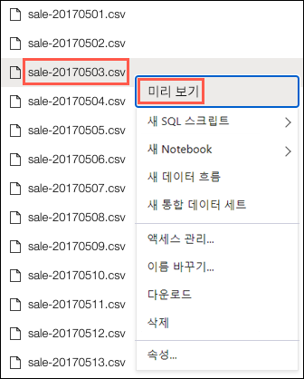

14. **sale-20170503.csv** 파일의 구조가 **20170501.csv**와 비슷한지 확인합니다.

    

15. **확인**을 선택하여 미리 보기를 닫습니다.

### 작업 2: 서버리스 SQL 풀을 사용하여 파일 탐색

Synapse Studio의 미리 보기 기능을 사용하면 파일을 빠르게 탐색할 수 있습니다. 그러나 데이터를 심층 파악하거나 문제가 있는 파일과 관련된 다양한 인사이트를 확인할 수는 없습니다. 이 작업에서는 Synapse의 **서버리스 SQL 풀(기본 제공)** 기능을 사용하여 T-SQL을 통해 이러한 파일을 탐색해 보겠습니다.

1. **sale-20170501.csv** 파일을 다시 마우스 오른쪽 단추로 클릭하고, 이번에는 상황에 맞는 메뉴에서 **새 SQL 스크립트** > **상위 100개 행 선택**을 선택합니다.

    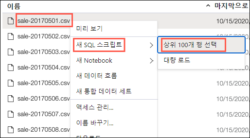

2. Synapse Studio에서 새 SQL 스크립트 탭이 열립니다. 이 탭에는 파일의 첫 100개 행을 읽는 SELECT 문이 포함되어 있습니다. 즉, 이 방법으로도 파일 내용을 검사할 수 있습니다. 검사 대상 행 수를 제한하면 탐색 프로세스를 더욱 빠르게 진행할 수 있습니다. 파일 내의 모든 데이터를 로드하는 쿼리는 실행 속도가 느리기 때문입니다.

    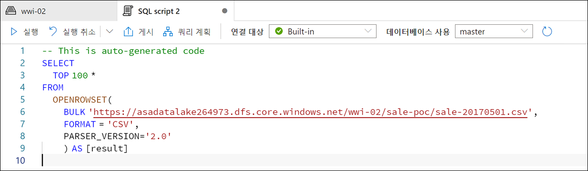

    > **팁**: 스크립트의 **속성** 창을 숨기면 스크립트를 좀 더 쉽게 볼 수 있습니다.
    > 


    데이터 레이크에 저장된 파일에 대한 T-SQL 쿼리는 OPENROWSET 함수를 활용하는데, 이 함수는 쿼리의 FROM 절에서 마치 테이블인 것처럼 참조될 수 있습니다. 이 함수는 파일의 데이터를 읽어서 행 세트로 반환할 수 있는 기본 제공 BULK 공급자를 통해 대량 작업을 지원합니다. 자세한 내용을 알아보려는 경우 [OPENROWSET 설명서](https://docs.microsoft.com/azure/synapse-analytics/sql/develop-openrowset)를 검토하면 됩니다.

3. 이제 도구 모음에서 **실행**을 선택하여 쿼리를 실행합니다.

    

4. **결과** 창에서 출력을 살펴봅니다.

    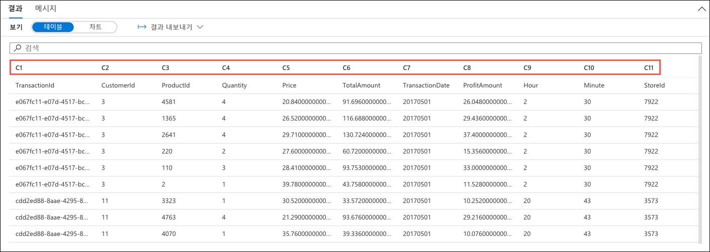

    > 결과에서는 열 머리글이 포함된 첫 번째 행이 데이터 행으로 렌더링되었으며 열에는 이름 **C1** - **C11**이 할당되어 있음을 확인할 수 있습니다. OPENROWSET 함수의 FIRSTROW 매개 변수를 사용하면 데이터로 표시할 파일의 첫 번째 행 수를 지정할 수 있습니다. 기본값은 1이므로 파일에 머리글 행이 포함되어 있다면 값을 2로 설정하여 열 머리글을 건너뛸 수 있습니다. 그런 다음 `WITH` 절을 사용하여 파일과 연결된 스키마를 지정할 수 있습니다.

5. 쿼리를 아래와 같이 수정하여 머리글 행을 건너뛰고 결과 세트에서 열의 이름을 지정합니다. 이때 *SUFFIX*를 스토리지 계정의 고유 리소스 접미사로 바꿉니다.

    ```sql
    SELECT
        TOP 100 *
    FROM
        OPENROWSET(
            BULK 'https://asadatalakeSUFFIX.dfs.core.windows.net/wwi-02/sale-poc/sale-20170501.csv',
            FORMAT = 'CSV',
            PARSER_VERSION='2.0',
            FIRSTROW = 2
        ) WITH (
            [TransactionId] varchar(50),
            [CustomerId] int,
            [ProductId] int,
            [Quantity] int,
            [Price] decimal(10,3),
            [TotalAmount] decimal(10,3),
            [TransactionDate] varchar(8),
            [ProfitAmount] decimal(10,3),
            [Hour] int,
            [Minute] int,
            [StoreId] int
        ) AS [result]
    ```

    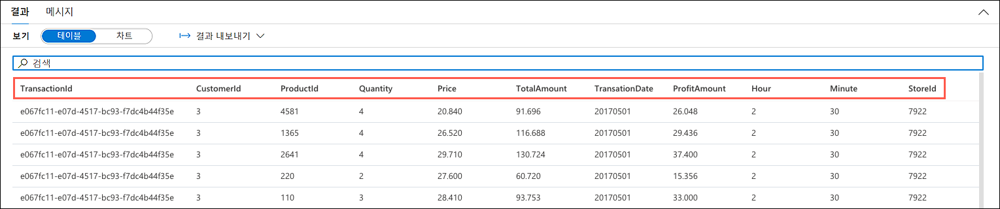

    > 이제 T-SQL 구문에서 OPENROWSET 함수를 사용하여 데이터를 더 자세히 탐색할 수 있습니다. 예를 들어 WHERE 절을 사용해 여러 필드에서 *null* 또는 고급 분석 워크로드에 데이터를 사용하기 전에 처리해야 할 수 있는 기타 값의 유무를 확인할 수 있습니다. 스키마를 지정하고 나면 이름으로 필드를 참조하여 이 프로세스를 더욱 쉽게 진행할 수 있습니다.

6. SQL 스크립트 탭을 닫습니다. 관련 메시지가 나타나면 **닫기 + 변경 내용 취소**를 선택합니다.

    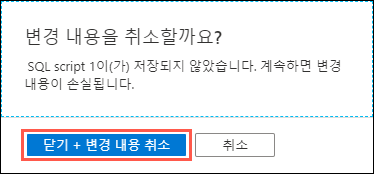

7. **미리 보기** 기능을 사용하는 과정에서 **sale-20170502.csv**의 형식이 잘못되었음을 확인했습니다. T-SQL을 사용하여 이 파일의 데이터에 대해 자세히 알아볼 수 있는지를 살펴보겠습니다. **wwi-02** 탭에서 **sale-20170502.csv** 파일을 마우스 오른쪽 단추로 클릭하고 **새 SQL 스크립트** > **상위 100개 행 선택**을 선택합니다.

    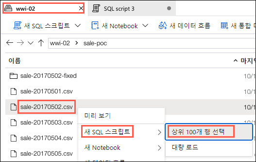

8. 자동으로 생성된 쿼리를 실행합니다.

    

9. *외부 파일을 처리하는 동안 오류가 발생했습니다. '0바이트부터 허용되는 최대 행 크기인 8388608바이트보다 큰 행이 발견되었습니다.'* 오류에서 쿼리 결과를 관찰합니다.

    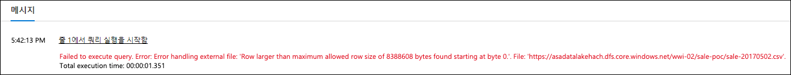

    > 이 오류는 해당 파일의 미리 보기 창에 표시되었던 문제를 의미합니다. 즉, 미리 보기에서 데이터가 열로 구분되어 있는데 모든 데이터가 행 하나에 표시되었던 현상에 해당됩니다. 이 파일에서는 기본 필드 구분 기호(쉼표)를 사용하여 데이터가 열로 분할되어 있는데 행 종결자 `\r`이 누락된 것 같습니다.

10. 쿼리 탭을 닫고, 변경 내용을 취소하고, **wwi-02** 탭에서 **sale-20170502.csv** 파일을 마우스 오른쪽 단추로 클릭하고 **다운로드**를 선택합니다. 파일이 다운로드되고 브라우저에서 열립니다.

11. 브라우저에서 데이터를 검토하고, 행 종결자가 없는지 그리고 모든 데이터가 단일 행에 있는지(브라우저 디스플레이 안에 다 표시됨) 확인합니다.

12. **sale-20170502.csv** 파일의 콘텐츠가 들어 있는 브라우저 탭을 닫습니다.

    이 파일을 수정하려면 코드를 사용해야 합니다. T-SQL 및 Synapse 파이프라인에서는 이러한 유형의 문제를 효율적으로 처리하는 기능이 제공되지 않습니다. 이 파일의 문제를 해결하려면 Synapse Spark Notebook을 사용해야 합니다.

### 작업 3: Synap Spark를 사용하여 데이터 탐색 및 수정

이 작업에서는 Synapse Spark Notebook을 사용해 데이터 레이크의 **wwi-02/sale-poc** 폴더에 있는 파일 몇 개를 살펴봅니다. 그리고 뒷부분에서 Synapse 파이프라인을 사용해 디렉터리의 모든 파일을 수집할 수 있도록 Python 코드를 사용하여 **sale-20170502.csv** 파일의 문제를 해결합니다.

1. Synapse Studio에서 **개발** 허브를 엽니다.

    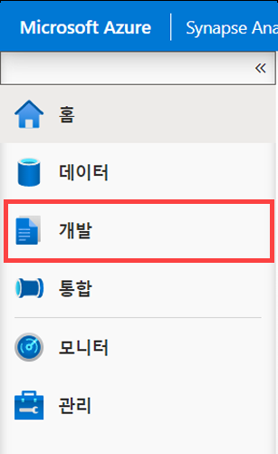

2. **+** 메뉴에서 **가져오기**를 선택합니다.

    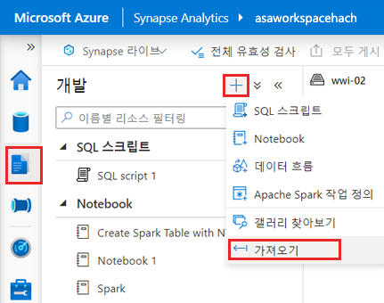

3. C:\dp-203\data-engineering-ilt-deployment\Allfiles\synapse-apache-spark-notebooks 폴더에서 **Explore with Spark.ipynb** Notebook을 가져옵니다.

4. Notebook 내에 포함된 지침에 따라 이 작업의 나머지 부분을 완료하고, **SparkPool01** Spark 풀에 연결합니다. 첫 번째 셀은 Spark 풀이 시작되어야 하기 때문에 실행하는 데 시간이 좀 걸릴 수도 있습니다. 

4.1. Notebook 의 마지막 부분에서 fixed data를 확인하기 위해 새로고침을 하세요.
   

5. **Explore with Spark** Notebook 사용을 완료했으면 Notebook 도구 모음 맨 오른쪽의 **세션 중지** 단추를 선택하여 다음 연습에서 사용할 수 있도록 Spark 클러스터를 릴리스합니다.

    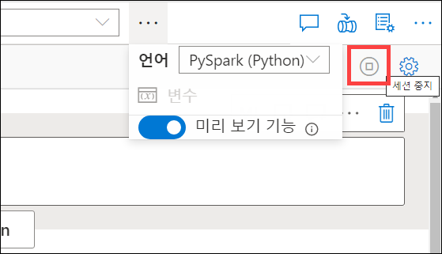

## 연습 2 - Azure Synapse Analytics에서 Spark Notebooks를 사용하여 데이터 수집

Tailwind Traders에는 다양한 데이터 원본에서 수집된 비구조적 파일과 반구조적 파일이 있습니다. Tailwind Traders의 데이터 엔지니어는 Spark 관련 전문 지식을 활용하여 이러한 파일을 탐색, 수집, 변환하려고 합니다.

이러한 용도로 Azure Synapse Analytics 작업 영역에 통합되어 있으며 Synapse Studio 내에서 사용 가능한 Synapse Notebooks 사용을 추천했습니다.

### 작업 1: Azure Synapse용 Apache Spark를 사용하여 데이터 레이크에서 Parquet 파일 수집 및 탐색

1. Azure Synapse Studio에서 **데이터** 허브를 선택합니다.
2. **연결됨** 탭의 **wwi-02** 컨테이너에서 *sale-small/Year=2019/Quarter=Q4/Month=12/Day=20191231* 폴더로 이동합니다. 그런 다음에 Parquet 파일을 마우스 오른쪽 단추로 클릭하고 **새 Notebook**, **데이터 프레임에 로드**를 차례로 선택합니다.

   
    


    그러면 Spark 데이터 프레임에 데이터를 로드하고 헤더와 함께 10개의 행을 표시하는 PySpark 코드가 있는 Notebook이 생성됩니다.

3. **SparkPool01** Spark 풀을 Notebook에 연결하되, **<u>이 단계에서는 셀을 실행하지 않습니다.</u>** -  먼저 데이터 레이크의 이름에 대한 변수를 만들어야 합니다.

    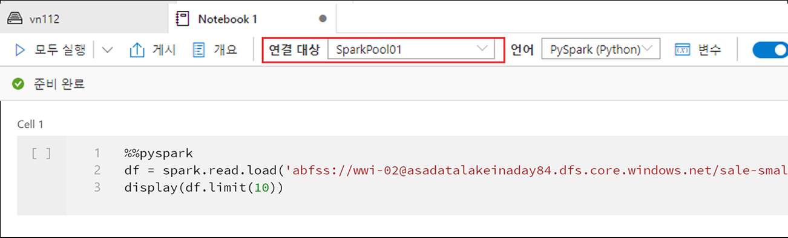

    Spark 풀은 모든 Notebook 작업에 대한 컴퓨팅을 제공합니다. Notebook 도구 모음 아래를 살펴보면 풀이 시작되지 않은 것을 알 수 있습니다. 풀이 유휴 상태일 때 Notebook에서 셀을 실행하면 풀이 시작되고 리소스를 할당합니다. 이 작업은 한 번만 수행되며, 그 후에는 풀이 너무 오랫동안 유휴 상태로 유지되어 자동으로 일시 중지됩니다.

    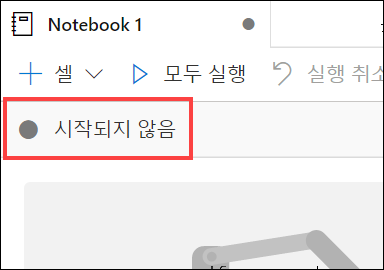

    > 자동 일시 중지 설정은 관리 허브의 Spark 풀 구성에서 구성할 수 있습니다.

4. 셀의 코드 아래에 다음 코드를 추가하여 값이 기본 스토리지 계정 이름인 **datalake** 변수를 정의합니다(*SUFFIX*를 데이터 레이크 저장소의 고유 접미사로 바꿈).

    ```python
    datalake = 'asadatalakeSUFFIX'
    ```

    

    이 변수는 후속 셀에서 사용됩니다.

5. Notebook 도구 모음에서 **모두 실행**을 선택하여 Notebook을 실행합니다.

    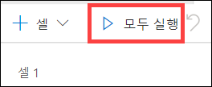

    > **참고:** Spark 풀에서 Notebook을 처음 실행하면 Azure Synapse에서 새 세션을 만듭니다. 이 작업은 약 2~3분이 걸릴 수 있습니다.

    > **참고:** 셀만 실행하려면 셀을 마우스로 가리키고 셀 왼쪽에 있는 _셀 실행_ 아이콘을 선택하거나 셀을 선택한 후 키보드에서 **Ctrl+Enter**를 누릅니다.

6. 셀 실행이 완료된 후 셀 출력에서 보기를 **차트**로 변경합니다.

    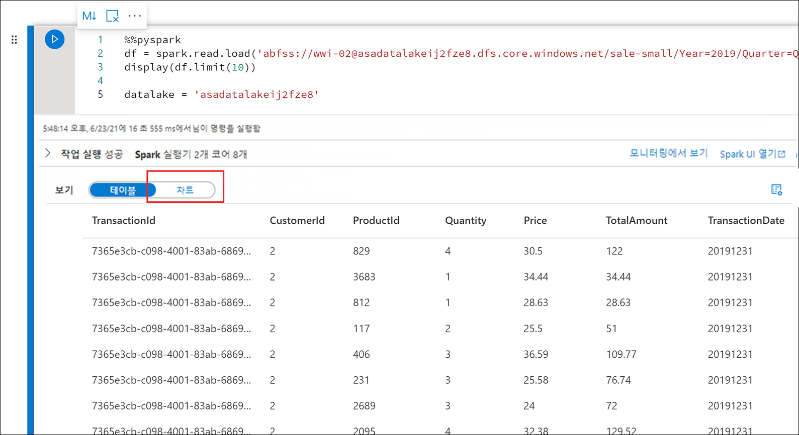

    **display()** 함수를 사용할 때 셀은 기본적으로 테이블 보기로 출력됩니다. 출력에서 2019년 12월 31일 화요일에 Parquet 파일에 저장된 판매 거래 데이터를 볼 수 있습니다. **차트** 시각화를 선택하여 데이터의 다른 보기를 확인해 보겠습니다.

7. 오른쪽에 있는 **보기 옵션** 단추를 선택합니다.

    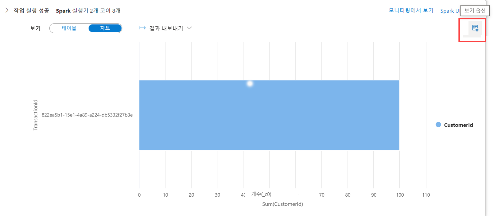

8. **키**를 **ProductId**로, **값**을 **TotalAmount**로 설정하고 **적용**을 선택합니다.

    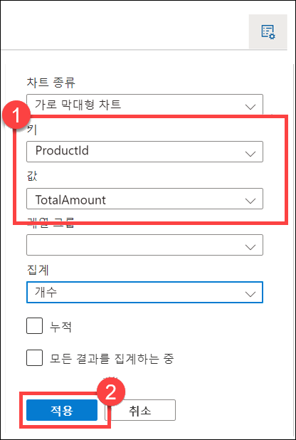

9. 차트 시각화가 표시됩니다. 세부 정보를 보려면 막대를 마우스로 가리킵니다.

    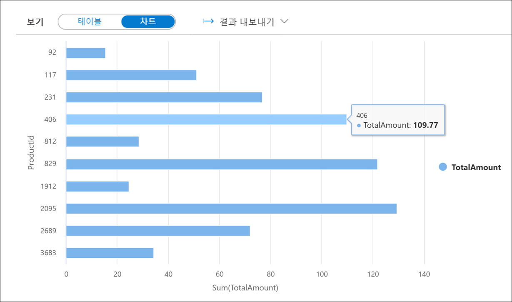

10. **+ 코드**를 선택하여 아래에 새 셀을 만듭니다.

11. Spark 엔진은 Parquet 파일을 분석하고 스키마를 유추할 수 있습니다. 이렇게 하려면 새 셀에 다음 코드를 입력하고 실행합니다.

    ```python
    df.printSchema()
    ```

    출력은 다음과 같습니다.

    ```
    root
     |-- TransactionId: string (nullable = true)
     |-- CustomerId: integer (nullable = true)
     |-- ProductId: short (nullable = true)
     |-- Quantity: byte (nullable = true)
     |-- Price: decimal(38,18) (nullable = true)
     |-- TotalAmount: decimal(38,18) (nullable = true)
     |-- TransactionDate: integer (nullable = true)
     |-- ProfitAmount: decimal(38,18) (nullable = true)
     |-- Hour: byte (nullable = true)
     |-- Minute: byte (nullable = true)
     |-- StoreId: short (nullable = true)
    ```

    Spark는 파일 콘텐츠를 평가하여 스키마를 유추합니다. 자동 유추는 보통 데이터 탐색 및 대부분의 변환 작업에 충분합니다. 그러나 SQL 테이블과 같은 외부 리소스에 데이터를 로드하는 경우에는 때로 고유한 스키마를 선언하여 데이터 집합에 적용해야 합니다. 현재로는 스키마가 정상적으로 보입니다.

12. 이제 데이터를 더 정확하게 이해하기 위해 집계 및 그룹화 작업을 사용해 보겠습니다. 새 코드 셀을 만들고 다음 코드를 입력한 후 셀을 실행합니다.

    ```python
    from pyspark.sql import SparkSession
    from pyspark.sql.types import *
    from pyspark.sql.functions import *

    profitByDateProduct = (df.groupBy("TransactionDate","ProductId")
        .agg(
            sum("ProfitAmount").alias("(sum)ProfitAmount"),
            round(avg("Quantity"), 4).alias("(avg)Quantity"),
            sum("Quantity").alias("(sum)Quantity"))
        .orderBy("TransactionDate"))
    display(profitByDateProduct.limit(100))
    ```

    > 스키마에 정의된 집계 함수 및 유형을 사용하여 쿼리를 성공적으로 실행하기 위해 필요한 Python 라이브러리를 가져옵니다.

    출력에는 위의 차트에 표시된 것과 동일한 데이터가 표시됩니다. 단, 이번에는 **sum** 및 **avg** 집계가 사용됩니다. 그리고 **alias** 메서드를 사용하여 열 이름을 변경합니다.

    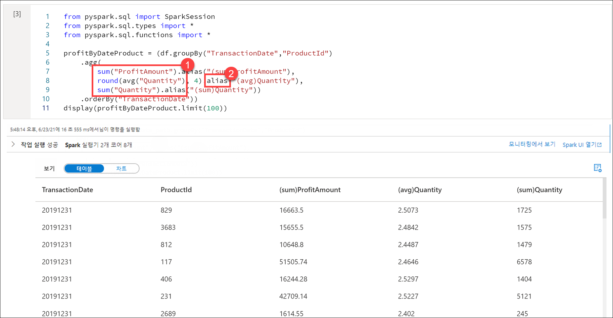

13. 다음 연습을 위해 Notebook을 열어둡니다.

## 연습 3 - Azure Synapse Analytics의 Spark 풀에서 데이터 프레임을 사용하여 데이터 변환

Tailwind Traders에는 영업 데이터 외에 전자 상거래 시스템의 고객 프로필 데이터도 있습니다. 이 데이터에서는 지난 12개월 동안 사이트를 방문한 각 방문자(고객)의 구매 수가 가장 많은 상위 제품 관련 정보를 제공합니다. 이 데이터는 데이터 레이크의 JSON 파일 내에 저장됩니다. Tailwind Traders는 JSON 파일을 수집, 탐색 및 변환하기 위해 노력하고 있으며 조언을 구하고자 합니다. 파일은 계층 구조로 되어 있는데 이 기업에서는 관계형 데이터 저장소로 로드하기 전에 이를 평면화하려고 합니다. 또한 데이터 엔지니어링 프로세스의 일환으로 그룹화 및 집계 작업을 적용하고자 합니다. Synapse Notebook을 사용하여 JSON 파일에서 데이터 변환을 탐색하고 적용하기를 권장합니다.

### 작업 1: Azure Synapse용 Apache Spark를 사용하여 JSON 데이터 쿼리 및 변환

1. Spark Notebook에서 새로운 코드 셀을 만들고, 다음 코드를 입력하고, 해당 셀을 실행합니다.

    ```python
    df = (spark.read \
            .option('inferSchema', 'true') \
            .json('abfss://wwi-02@' + datalake + '.dfs.core.windows.net/online-user-profiles-02/*.json', multiLine=True)
        )

    df.printSchema()
    ```

    > 여기서는 첫 번째 셀에서 만든 **datalake** 변수가 파일 경로의 일부분으로 사용되었습니다.

    출력은 다음과 같습니다.

    ```
    root
    |-- topProductPurchases: array (nullable = true)
    |    |-- element: struct (containsNull = true)
    |    |    |-- itemsPurchasedLast12Months: long (nullable = true)
    |    |    |-- productId: long (nullable = true)
    |-- visitorId: long (nullable = true)
    ```

    > 여기서는 **online-user-profiles-02** 디렉터리 내의 모든 JSON 파일을 선택합니다. 각 JSON 파일에는 여러 행이 포함되어 있으므로 **multiLine=True** 옵션을 지정했습니다. 또한 **inferSchema** 옵션을 **true**로 설정했습니다. 이 옵션은 파일을 검토한 후 데이터의 특성에 따라 스키마를 만들도록 Spark 엔진에 명령합니다.

2. 지금까지는 셀에서 Python 코드를 사용했습니다. SQL 구문을 사용하여 파일을 쿼리하려면 데이터 프레임 내에서 데이터의 임시 보기를 만드는 것이 한 가지 옵션입니다. 새 코드 셀에서 다음 코드를 실행하여 **user_profiles** 뷰를 만듭니다.

    ```python
    # create a view called user_profiles
    df.createOrReplaceTempView("user_profiles")
    ```

3. 새로운 코드 셀을 만듭니다. Python 대신 SQL을 사용하고자 하므로 **%%sql** *매직*을 사용하여 셀 언어를 SQL로 설정합니다. 셀에서 다음 코드를 실행합니다.

    ```sql
    %%sql

    SELECT * FROM user_profiles LIMIT 10
    ```

    출력에는 **topProductPurchases**의 중첩 데이터가 표시됩니다. 이 데이터에는 **productId** 및 **itemsPurchasedLast12Months** 값 배열이 포함되어 있습니다. 각 행에서 오른쪽 삼각형을 클릭하여 필드를 확장할 수 있습니다.

    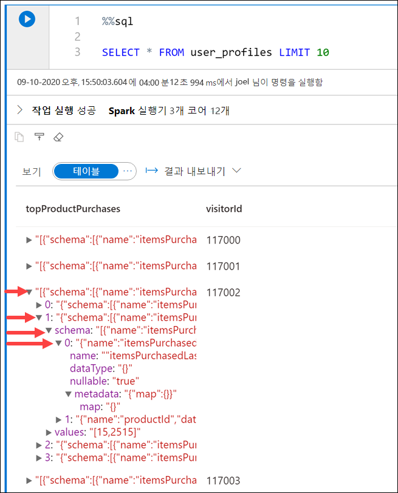

    이로 인해 데이터 분석이 다소 어려워집니다. JSON 파일 내용이 다음과 같기 때문입니다.

    ```json
    [
        {
            "visitorId": 9529082,
            "topProductPurchases": [
                {
                    "productId": 4679,
                    "itemsPurchasedLast12Months": 26
                },
                {
                    "productId": 1779,
                    "itemsPurchasedLast12Months": 32
                },
                {
                    "productId": 2125,
                    "itemsPurchasedLast12Months": 75
                },
                {
                    "productId": 2007,
                    "itemsPurchasedLast12Months": 39
                },
                {
                    "productId": 1240,
                    "itemsPurchasedLast12Months": 31
                },
                {
                    "productId": 446,
                    "itemsPurchasedLast12Months": 39
                },
                {
                    "productId": 3110,
                    "itemsPurchasedLast12Months": 40
                },
                {
                    "productId": 52,
                    "itemsPurchasedLast12Months": 2
                },
                {
                    "productId": 978,
                    "itemsPurchasedLast12Months": 81
                },
                {
                    "productId": 1219,
                    "itemsPurchasedLast12Months": 56
                },
                {
                    "productId": 2982,
                    "itemsPurchasedLast12Months": 59
                }
            ]
        },
        {
            ...
        },
        {
            ...
        }
    ]
    ```

4. PySpark에는 특수한 [**explode**](https://spark.apache.org/docs/latest/api/python/pyspark.sql.html?highlight=explode#pyspark.sql.functions.explode) 함수가 포함되며, 이 함수는 배열의 각 요소에 대해 새로운 행을 반환합니다. 따라서 **topProductPurchases** 열을 평면화하여 데이터를 더 쉽게 읽거나 쿼리할 수 있습니다. 새 코드 셀에서 다음을 실행합니다.

    ```python
    from pyspark.sql.functions import udf, explode

    flat=df.select('visitorId',explode('topProductPurchases').alias('topProductPurchases_flat'))
    flat.show(100)
    ```

    이 셀에서는 새 데이터 프레임 **flat**을 만들었습니다. 이 데이터 프레임에는 **visitorId** 필드와 새 별칭 필드 **topProductPurchases_flat**이 포함됩니다. 여기에서 볼 수 있듯 출력은 조금 더 읽기 쉬울 뿐더러 쿼리하기도 간편합니다.

    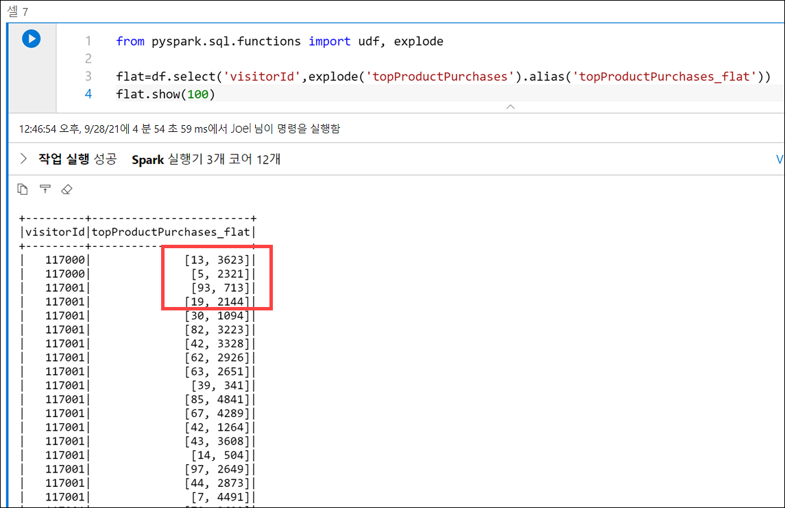

5. 새 셀을 만들고 다음 코드를 실행하여 데이터 프레임의 새 평면화된 버전을 만듭니다. 이 버전은 **topProductPurchases_flat.productId** 및 **topProductPurchases_flat.itemsPurchasedLast12Months** 필드를 추출하여 각 데이터 조합용으로 새 행을 만듭니다.

    ```python
    topPurchases = (flat.select('visitorId','topProductPurchases_flat.productId','topProductPurchases_flat.itemsPurchasedLast12Months')
        .orderBy('visitorId'))

    topPurchases.show(100)
    ```

    이제 출력에는 각 **visitorId**에 해당하는 여러 행이 표시됩니다.

    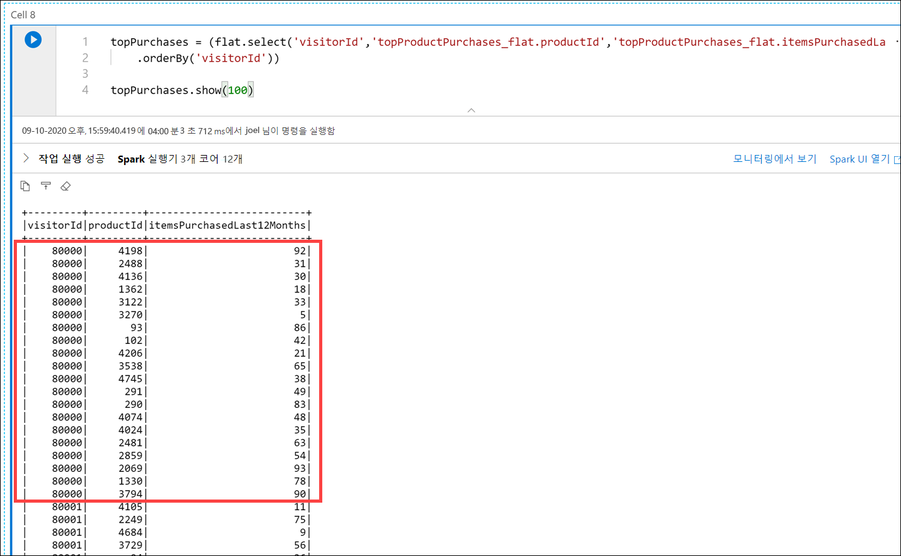

6. 지난 12개월간 구매한 항목의 수로 행의 순서를 지정해 보겠습니다. 새 코드 셀을 만들고 다음 코드를 실행합니다.

    ```python
    # Let's order by the number of items purchased in the last 12 months
    sortedTopPurchases = topPurchases.orderBy("itemsPurchasedLast12Months")

    display(sortedTopPurchases.limit(100))
    ```

    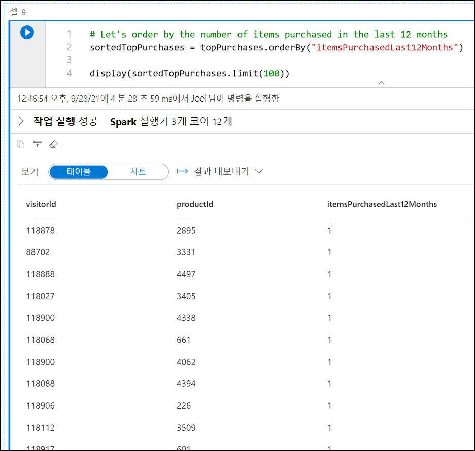

7. 결과를 역순으로 정렬하려는 경우 *topPurchases.orderBy("itemsPurchasedLast12Months desc")*. 새 코드 셀에서 사용해 봅니다.

    ```python
    topPurchases.orderBy("itemsPurchasedLast12Months desc")
    ```

    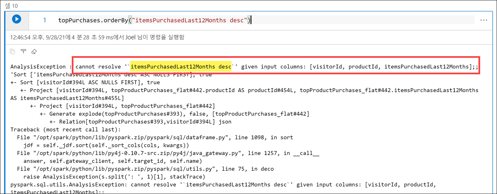

    **itemsPurchasedLast12Months desc**가 열 이름과 일치하지 않으므로 **AnalysisException** 오류가 발생합니다.

    이 코드가 작동하지 않는 이유는

    - **DataFrames** API가 SQL 엔진을 기반으로 작성된 것이기 때문입니다.
    - 이 API와 SQL 구문은 전반적으로 매우 비슷합니다.
    - 하지만 **orderBy(..)** 에는 열 이름을 사용해야 하는데
    - 여기서는 **requests desc** 형식의 SQL 식을 지정했습니다.
    - 해당 식을 프로그래매틱 방식으로 표현하는 방법이 필요합니다.
    - 따라서 두 번째 변형인 **orderBy(Column)**`, 구체적으로는 **Column** 클래스가 필요합니다.

8. Column 클래스는 열의 이름을 지정할 수 있을 뿐 아니라 내림차순으로 정렬과 같은 열 수준 변환도 수행할 수 있는 개체입니다. 이전에 실패한 코드를 다음 코드로 바꾸고 실행합니다.

    ```python
    sortedTopPurchases = (topPurchases
        .orderBy( col("itemsPurchasedLast12Months").desc() ))

    display(sortedTopPurchases.limit(100))
    ```

    이제는 결과가 **itemsPurchasedLast12Months** 열을 기준으로 내림차순으로 정렬되어 표시됩니다. **col** 개체에 **desc()** 메서드가 포함되어 있기 때문입니다.

    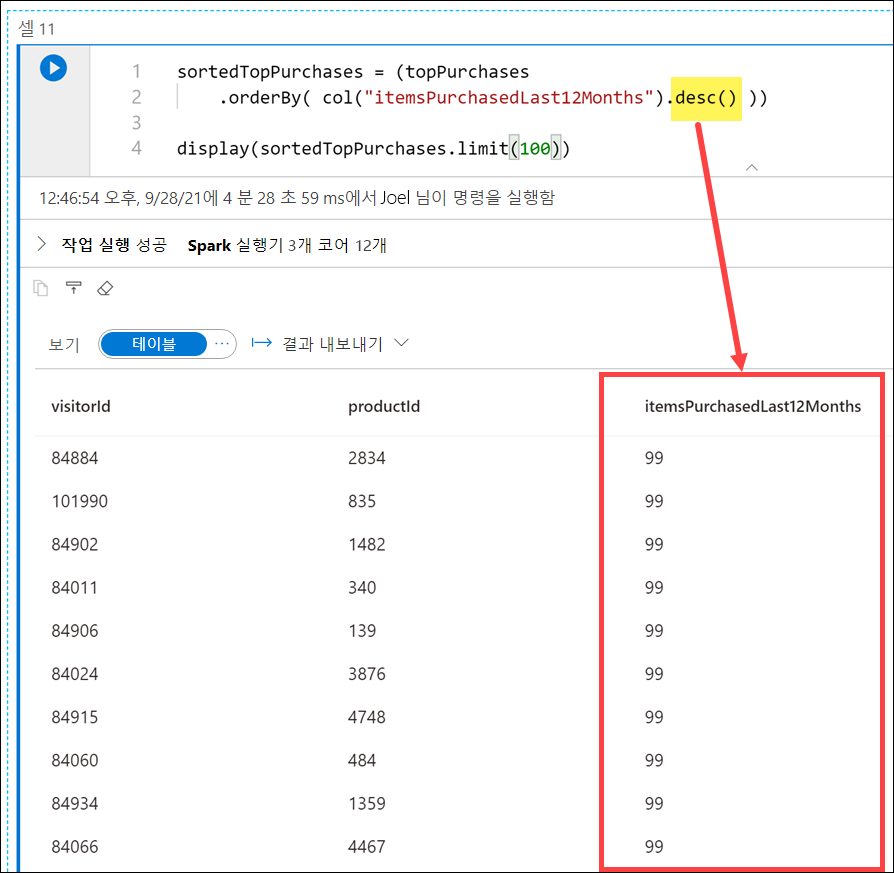

9. 각 고객이 구매한 제품 *유형* 수를 확인하려는 경우에는 **visitorId**를 기준으로 결과를 그룹화한 다음 고객당 행 수를 집계해야 합니다. 새 코드 셀에서 다음 코드를 실행합니다.

    ```python
    groupedTopPurchases = (sortedTopPurchases.select("visitorId")
        .groupBy("visitorId")
        .agg(count("*").alias("total"))
        .orderBy("visitorId") )

    display(groupedTopPurchases.limit(100))
    ```

    위의 코드에서는 **visitorId** 열에서 **groupBy** 메서드를 사용했으며, 레코드 수에는 **agg** 메서드를 사용하여 각 고객이 구매한 총 제품 수를 표시합니다.

    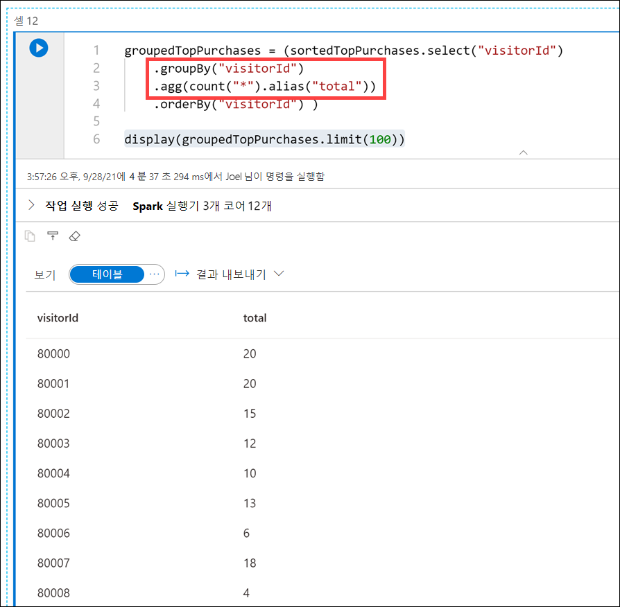

10. 각 고객이 구매한 *총 항목* 수를 확인하려는 경우에는 **visitorId**를 기준으로 결과를 그룹화한 다음 고객당 **itemsPurchasedLast12Months** 값의 합을 집계해야 합니다. 새 코드 셀에서 다음 코드를 실행합니다.

    ```python
    groupedTopPurchases = (sortedTopPurchases.select("visitorId","itemsPurchasedLast12Months")
        .groupBy("visitorId")
        .agg(sum("itemsPurchasedLast12Months").alias("totalItemsPurchased"))
        .orderBy("visitorId") )

    display(groupedTopPurchases.limit(100))
    ```

    여기서도 **visitorId**를 기준으로 결과를 그룹화했지만, 이번에는 **agg** 메서드에서 **itemsPurchasedLast12Months** 열에 **sum**을 사용했습니다. 그리고 **sum**에서 사용할 수 있도록 **select** 문에 **itemsPurchasedLast12Months** 열을 포함했습니다.

    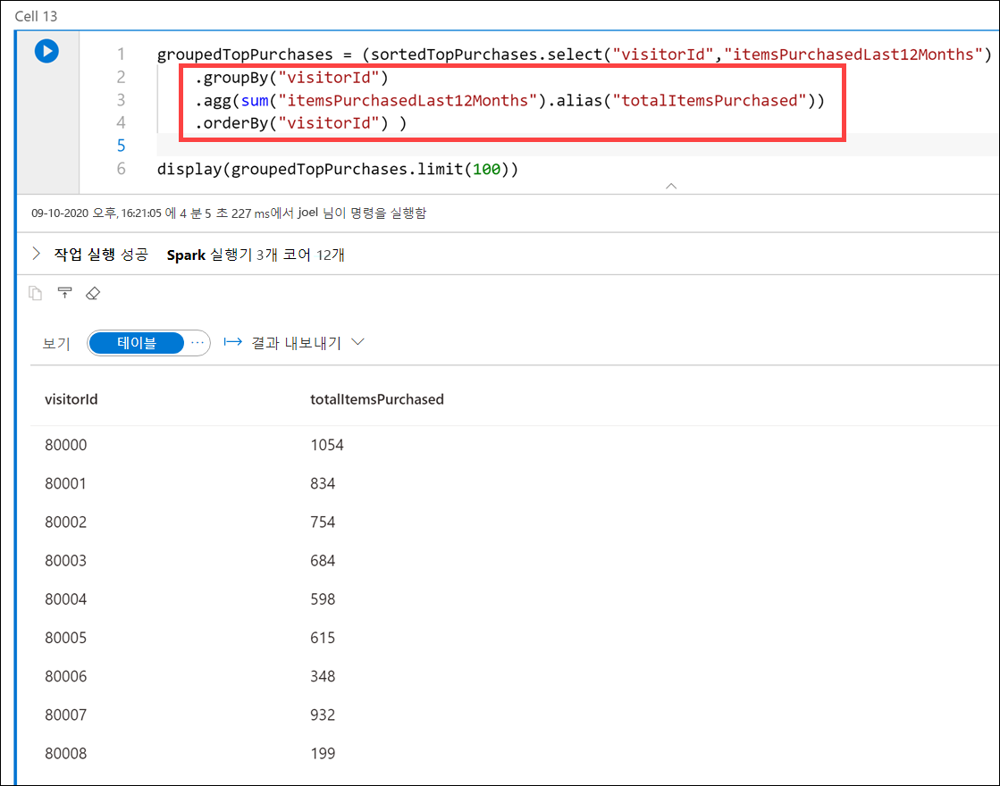

11. 다음 연습을 위해 Notebook을 열어둡니다.

## 연습 4 - Azure Synapse Analytics에서 SQL 및 Spark 풀 통합

Tailwind Traders는 Spark에서 데이터 엔지니어링 작업을 수행한 후 전용 SQL 풀에 연결된 SQL 데이터베이스에 데이터를 쓴 다음, 다른 파일의 데이터가 포함된 Spark 데이터 프레임과 조인할 때 사용할 원본으로 해당 SQL 데이터베이스를 참조하려고 합니다.

Azure Synapse의 SQL 데이터베이스와 Spark 데이터베이스 간에 데이터를 효율적으로 전송하기 위해 Apache Spark-Synapse SQL 커넥터를 사용하기로 결정했습니다.

JDBC를 사용하여 Spark 데이터베이스와 SQL 데이터베이스 간에 데이터를 전송할 수 있습니다. 그러나 Spark풀 및 SQL 풀과 같은 두 개의 분산 시스템이 사용되므로 JDBC는 직렬 데이터를 전송할 때 병목 상태가 발생하는 경향이 있습니다.

Apache Spark 풀-Synapse SQL 커넥터는 Apache Spark에 대한 데이터 원본 구현입니다. 이 커넥터는 Azure Data Lake Storage Gen2 및 전용 SQL 풀의 PolyBase를 사용하여 Spark 클러스터와 Synapse SQL 인스턴스 간에 데이터를 효율적으로 전송합니다.

### 작업 1: Notebook 업데이트

1. 지금까지는 셀에서 Python 코드를 사용했습니다. Apache Spark 풀-Synapse SQL 커넥터를 사용하려는 경우 한 가지 옵션은 데이터 프레임 내에서 데이터 임시 뷰를 만드는 것입니다. 새 코드 셀에서 다음을 실행하여 **top_purchases** 뷰를 만듭니다.

    ```python
    # Create a temporary view for top purchases so we can load from Scala
    topPurchases.createOrReplaceTempView("top_purchases")
    ```

    **topPurchases** 데이터 프레임에서 새 임시 뷰를 만들었습니다. 이전 작업에서 만들었던 이 데이터 프레임에는 평면화된 JSON 사용자 구매 데이터가 포함되어 있습니다.

2. Scala에서 Apache Spark 풀-Synapse SQL 커넥터를 사용하는 코드를 실행해야 합니다. 이렇게 하려면 셀에 **%%spark** 매직을 추가합니다. 새 코드 셀에서 다음을 실행하여 **top_purchases** 뷰에서 데이터를 읽어들입니다.

    ```scala
    %%spark
    // Make sure the name of the dedcated SQL pool (SQLPool01 below) matches the name of your SQL pool.
    val df = spark.sqlContext.sql("select * from top_purchases")
    df.write.synapsesql("SQLPool01.wwi.TopPurchases", Constants.INTERNAL)
    ```

    > **참고**: 셀에서 실행하는 데 1분 넘게 걸릴 수 있습니다. 이전에 명령을 실행한 경우 테이블이 이미 있기 때문에 “...라는 개체가 이미 있습니다.”라는 오류가 표시됩니다.

    셀에서 실행이 완료되면 테이블이 만들어졌는지 확인하기 위해 SQL 테이블 목록을 살펴봅시다.

3. **Notebook을 열어 두고** **데이터**허브로 이동합니다(아직 데이터 허브를 선택하지 않은 경우).

4. **작업 영역** 탭을 선택하고 **데이터베이스**의 **줄임표(...)** 메뉴에서 **새로 고침**을 선택합니다. 그런 다음에 **SQLPool01** 데이터베이스를 확장하고 해당 **테이블** 폴더에서 **wwi.TopPurchases** 테이블과 해당 열을 확장합니다.

    **wwi.TopPurchases** 테이블은 Spark 데이터 프레임의 파생 스키마를 기준으로 자동 작성된 것입니다. Apache Spark 풀-Synapse SQL 커넥터는 테이블을 만들고 데이터를 효율적으로 로드하는 작업을 담당했습니다.

5. Notebook으로 돌아온 다음 새 코드 셀에서 다음 코드를 실행하여 *sale-small/Year=2019/Quarter=Q4/Month=12/* 폴더에 있는 모든 Parquet 파일에서 영업 데이터를 읽어들입니다.

    ```python
    dfsales = spark.read.load('abfss://wwi-02@' + datalake + '.dfs.core.windows.net/sale-small/Year=2019/Quarter=Q4/Month=12/*/*.parquet', format='parquet')
    display(dfsales.limit(10))
    ```

    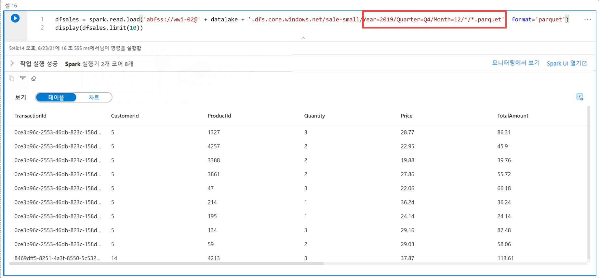

    위 셀의 파일 경로를 첫 번째 셀의 파일 경로와 비교합니다. 여기서는 2019년 12월 31일 화요일 판매 데이터만 로드하는 것이 아니라 상대 경로를 사용하여 **sale-small**에 있는 Parquet 파일의 **모든 2019년 12월** 판매 데이터를 로드합니다.

    다음으로는 앞에서 만든 SQL 테이블의 **TopSales** 데이터를 새 Spark 데이터 프레임에 로드한 다음 해당 데이터 프레임을 새 **dfsales** 데이터 프레임과 조인합니다. 이렇게 하려면 새 셀에서도 **%%spark** 매직을 사용해야 합니다. Apache Spark 풀-Synapse SQL 커넥터를 사용하여 SQL 데이터베이스에서 데이터를 검색할 것이기 때문입니다. 그런 다음 Python에서 데이터에 액세스할 수 있도록 새 임시 뷰에 데이터 프레임 콘텐츠를 추가해야 합니다.

6. 새 셀에서 다음 코드를 실행하여 **TopSales** SQL 테이블에서 데이터를 읽어들인 다음 임시 뷰에 저장합니다.

    ```scala
    %%spark
    // Make sure the name of the SQL pool (SQLPool01 below) matches the name of your SQL pool.
    val df2 = spark.read.synapsesql("SQLPool01.wwi.TopPurchases")
    df2.createTempView("top_purchases_sql")

    df2.head(10)
    ```

    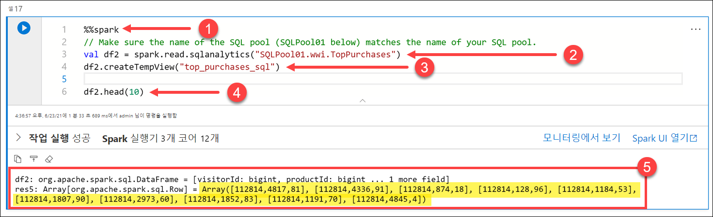

    셀의 맨 윗부분에서는 **%%spark** 매직을 사용하여 셀 언어를 Scala로 설정했습니다. 그리고 새 변수 **df2**를 **spark.read.synapsesql** 메서드로 작성된 새 데이터 프레임으로 선언했습니다. 이 메서드는 SQL 데이터베이스의 **TopPurchases** 테이블에서 데이터를 읽어들입니다. 그런 다음 **top_purchases_sql**이라는 새 임시 뷰를 채웠습니다. 그리고 마지막으로 **df2.head(10))** 줄을 사용하여 처음 10개 레코드를 표시했습니다. 셀 출력에는 데이터 프레임 값이 표시됩니다.

7. 새 코드 셀에서 다음 코드를 실행하여 **top_purchases_sql** 임시 뷰에서 새 데이터 프레임을 Python으로 작성한 다음 처음 10개 결과를 표시합니다.

    ```python
    dfTopPurchasesFromSql = sqlContext.table("top_purchases_sql")

    display(dfTopPurchasesFromSql.limit(10))
    ```

    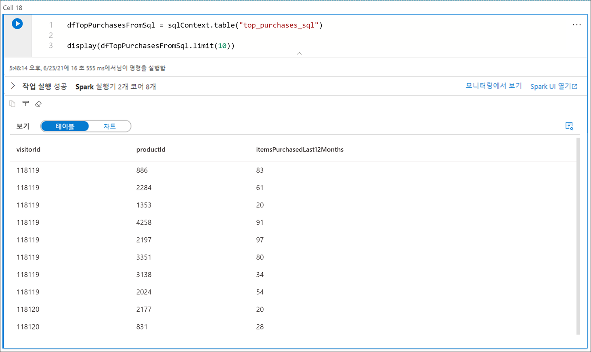

8. 새 코드 셀에서 다음 코드를 실행하여 영업 Parquet 파일과 **TopPurchases** SQL 데이터베이스의 데이터를 조인합니다.

    ```python
    inner_join = dfsales.join(dfTopPurchasesFromSql,
        (dfsales.CustomerId == dfTopPurchasesFromSql.visitorId) & (dfsales.ProductId == dfTopPurchasesFromSql.productId))

    inner_join_agg = (inner_join.select("CustomerId","TotalAmount","Quantity","itemsPurchasedLast12Months","top_purchases_sql.productId")
        .groupBy(["CustomerId","top_purchases_sql.productId"])
        .agg(
            sum("TotalAmount").alias("TotalAmountDecember"),
            sum("Quantity").alias("TotalQuantityDecember"),
            sum("itemsPurchasedLast12Months").alias("TotalItemsPurchasedLast12Months"))
        .orderBy("CustomerId") )

    display(inner_join_agg.limit(100))
    ```

    이 쿼리에서는 **CustomerId** 및 **ProductId**가 일치하도록 설정하는 방식을 통해 **dfsales** 및 **dfTopPurchasesFromSql** 데이터 프레임을 조인했습니다. 이 조인에서 2019년 12월 영업 Parquet 데이터가 **TopPurchases** SQL 테이블과 결합되었습니다.

    그리고 **CustomerId** 및 **ProductId** 필드를 기준으로 결과를 그룹화했습니다. **ProductId** 필드 이름은 모호하기 때문에(두 데이터 프레임에 해당 이름이 모두 포함되어 있음) **TopPurchases** 데이터 프레임에 있는 필드를 가리키도록 **ProductId** 이름을 정규화해야 했습니다.

    그런 다음 12월 각 제품에 지출된 총 금액, 12월 총 제품 항목 수, 지난 12개월 동안 구매한 총 제품 항목 수를 합산한 집계를 만들었습니다.

    마지막으로, 조인 및 집계된 데이터를 테이블 보기에 표시했습니다.

    > **참고**: 테이블 보기에서 열 머리글을 클릭하여 결과 집합을 정렬할 수 있습니다.

    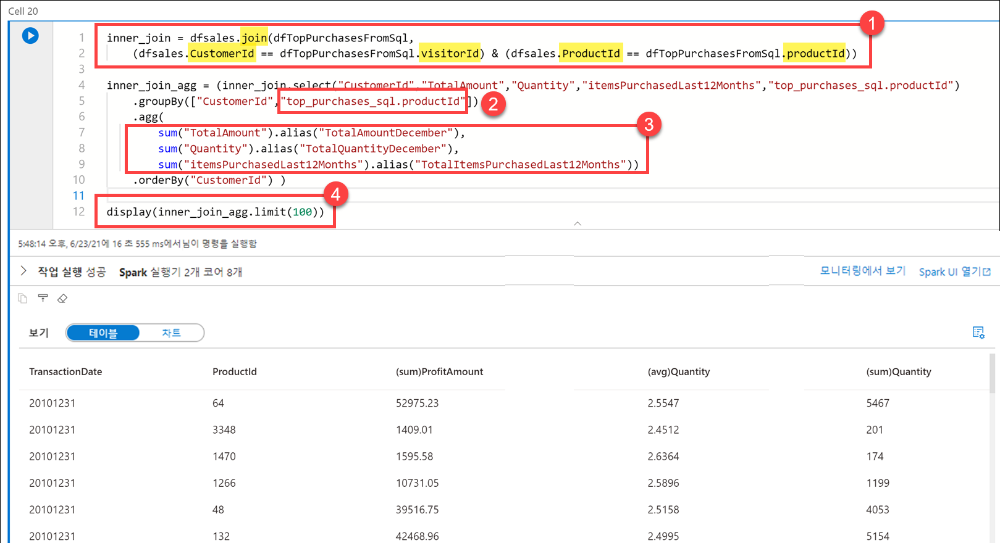

9. Notebook의 오른쪽 상단에서 **세션 중지** 단추를 사용하여 Notebook 세션을 중지합니다.
10. 나중에 다시 검토하려면 Notebook을 게시합니다. 그런 다음에 닫습니다.

## 중요: SQL 풀 일시 중지

다음 단계를 완료하여 더 이상 필요없는 리소스를 정리할 수 있습니다.

1. Synapse Studio에서 **관리** 허브를 선택합니다.
2. 왼쪽 메뉴에서 **SQL 풀**을 선택합니다. **SQLPool01** 전용 SQL 풀을 커서로 가리키고 다음을 선택합니다. **||**.

    

3. 메시지가 표시되면 **일시 중지**를 선택합니다.
