---
lab:
    title: '데이터 웨어하우스에 데이터 수집 및 로드'
    module: '모듈 5'
---

# 랩 5 - 데이터 웨어하우스에 데이터 수집 및 로드

이 랩에서는 T-SQL 스크립트와 Synapse Analytics 통합 파이프라인을 통해 데이터 웨어하우스에 데이터를 수집하는 방법을 알아봅니다. 그리고 T-SQL의 COPY 명령과 PolyBase를 사용하여 Synapse 전용 SQL 풀에 데이터를 로드하는 방법을 알아봅니다. 또한 Azure Synapse 파이프라인의 복사 작업과 워크로드 관리 기능을 사용해 페타바이트 단위 데이터 수집을 수행하는 방법도 알아봅니다.

이 랩을 마치면 다음과 같은 역량을 갖추게 됩니다.

- Azure Synapse 파이프라인을 사용하여 페타바이트 단위 데이터 수집 수행
- T-SQL의 COPY 명령과 PolyBase를 사용하여 데이터 가져오기
- Azure Synapse Analytics에서 데이터 로드 모범 사례 사용

## 랩 설정 및 필수 구성 요소

이 랩을 시작하기 전에 **랩 4: *Apache Spark를 사용하여 데이터를 탐색 및 변환한 후 데이터 웨어하우스에 로드***를 완료해야 합니다.

이 랩은 이전 랩에서 만든 전용 SQL 풀을 사용합니다. 이전 랩의 끝에서 SQL 풀을 일시 중지했을 것이기 때문에 다음 지침을 따라 다시 시작해야 합니다.

1. Synapse Studio(<https://web.azuresynapse.net/>)를 엽니다.
2. **관리** 허브를 선택합니다.
3. 왼쪽 메뉴에서 **SQL 풀**을 선택합니다. **SQLPool01** 전용 SQL 풀이 일시 중지되어 있으면 해당 이름을 커서로 가리키고 **&#9655;** 을 선택합니다.

    

4. 메시지가 표시되면 **다시 시작**을 선택합니다. 풀이 다시 시작되려면 1~2분 정도 걸립니다.

> **중요:** 시작된 후, 전용 SQL 풀은 일시 중지될 때까지 Azure 구독의 크레딧을 소비합니다. 이 랩을 잠시 멈출 경우 또는 이 랩을 완료하지 않기로 결정할 경우, 랩 끝에 있는 지침을 따라 SQL 풀을 일시 중지해야 합니다.

## 연습 1 - T-SQL의 COPY 명령과 PolyBase를 사용하여 데이터 가져오기

Synapse SQL 풀을 사용하는 T-SQL 명령, Azure Synapse 파이프라인 등의 다양한 옵션을 통해 형식이 각기 다른 대량의 데이터를 Azure Synapse Analytics에 로드할 수 있습니다. 이 연습 시나리오에서 Wide World Importers는 대다수 원시 데이터를 여러 형식으로 데이터 레이크에 저장합니다. WWI의 데이터 엔지니어는 사용 가능한 여러 데이터 로드 옵션 중 T-SQL을 가장 선호합니다.

그러나 SQL 사용법을 잘 알고 있더라도 큰 파일 형식이나 다양한 파일 형식을 로드할 때는 몇 가지 사항을 고려해야 합니다. 파일이 ADLS Gen2에 저장되어 있으므로 WWI는 PolyBase 외부 테이블 또는 새 COPY 문을 사용할 수 있습니다. 이 두 옵션을 사용하면 확장성 있는 데이터 로드 작업을 빠르게 수행할 수 있습니다. 하지만 두 옵션 간에는 다음과 같은 몇 가지 차이점이 있습니다.

| PolyBase | COPY |
| --- | --- |
| CONTROL 권한 필요 | 필요한 권한 수준이 낮음 |
| 행 너비 제한 있음 | 행 너비 제한 없음 |
| 텍스트 내에 구분 기호 포함 불가 | 텍스트에서 구분 기호 지원됨 |
| 고정된 줄 구분 기호를 사용해야 함 | 사용자 지정 열 및 행 구분 기호 지원됨 |
| 코드에서 설정하기가 복잡함 | 작성해야 하는 코드를 줄일 수 있음 |

WWI는 특히 대형 데이터 집합 사용 시 PolyBase의 속도가 COPY보다 전반적으로 빠르다는 정보를 입수했습니다.

이 연습에서는 WWI가 이 두 로딩 전략의 설정 편의성, 유연성 및 속도를 비교하는 과정을 지원합니다.

### 작업 1: 준비(Staging) 테이블 만들기

**Sale** 테이블에는 읽기를 많이 수행하는 작업용으로 테이블을 최적화하기 위한 columnstore 인덱스가 포함되어 있습니다. 이 테이블은 보고 및 임시 쿼리에도 많이 사용됩니다. WWI는 **Sale** 테이블 로드 속도를 최대한 높이고 대량 데이터 삽입으로 인한 영향을 최소화하기 위해 로드용 준비 테이블을 만들기로 했습니다.

이 작업에서는 새 스키마 **wwi_staging**에 새 준비 테이블 **SaleHeap**을 만듭니다. 이 테이블은 [힙](https://docs.microsoft.com/sql/relational-databases/indexes/heaps-tables-without-clustered-indexes?view=sql-server-ver15)으로 정의하며, 라운드 로빈 분산을 사용합니다. WWI는 데이터 로드 파이프라인을 완성하면 **SaleHeap**에 데이터를 로드한 다음 힙 테이블에서 **Sale**에 데이터를 삽입할 예정입니다. 이 프로세스는 두 단계로 구성되어 있지만 프로덕션 테이블에 행을 삽입하는 두 번째 단계에서는 분산 간에 데이터가 이동되지 않습니다.

(When WWI finalizes their data loading pipeline, they will load the data into SaleHeap, then insert from the heap table into Sale. Although this is a two-step process, the second step of inserting the rows to the production table does not incur data movement across the distributions.)

그리고 **wwi_staging** 스키마 내에 새 **Sale** 클러스터형 columnstore 테이블도 만들어 데이터 로드 속도를 비교합니다.

1. Synapse Analytics Studio에서 **개발** 허브로 이동합니다.

    

2. **+** 메뉴에서 **SQL 스크립트**를 선택합니다.

    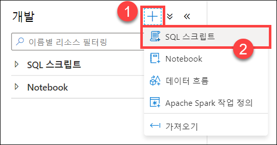

3. 도구 모음 메뉴에서 **SQLPool01** 데이터베이스에 연결합니다.

    

4. 쿼리 창에서 다음 코드를 입력하여 **wwi_staging** 스키마가 존재하는지 확인합니다.

    ```sql
    SELECT * FROM sys.schemas WHERE name = 'wwi_staging'
    ```

5. 도구 모음 메뉴에서 **실행**을 선택하여 스크립트를 실행합니다.

    

    이전 랩을 설정할 때 만들어진 **wwi_staging** 스키마에 대해 단일 행이 결과에 포함되어 있어야 합니다.

6. 쿼리 창에서 스크립트를 다음 코드로 바꿔 힙 테이블을 만듭니다.

    ```sql
    CREATE TABLE [wwi_staging].[SaleHeap]
    ( 
        [TransactionId] [uniqueidentifier]  NOT NULL,
        [CustomerId] [int]  NOT NULL,
        [ProductId] [smallint]  NOT NULL,
        [Quantity] [smallint]  NOT NULL,
        [Price] [decimal](9,2)  NOT NULL,
        [TotalAmount] [decimal](9,2)  NOT NULL,
        [TransactionDate] [int]  NOT NULL,
        [ProfitAmount] [decimal](9,2)  NOT NULL,
        [Hour] [tinyint]  NOT NULL,
        [Minute] [tinyint]  NOT NULL,
        [StoreId] [smallint]  NOT NULL
    )
    WITH
    (
        DISTRIBUTION = ROUND_ROBIN,
        HEAP
    )
    ```

7. SQL 스크립트를 실행하여 테이블을 만듭니다.

8. 쿼리 창에서 스크립트를 다음 코드로 바꿔 로드 비교용으로 **wwi_staging** 스키마에 **Sale** 테이블을 만듭니다.

    ```sql
    CREATE TABLE [wwi_staging].[Sale]
    (
        [TransactionId] [uniqueidentifier]  NOT NULL,
        [CustomerId] [int]  NOT NULL,
        [ProductId] [smallint]  NOT NULL,
        [Quantity] [smallint]  NOT NULL,
        [Price] [decimal](9,2)  NOT NULL,
        [TotalAmount] [decimal](9,2)  NOT NULL,
        [TransactionDate] [int]  NOT NULL,
        [ProfitAmount] [decimal](9,2)  NOT NULL,
        [Hour] [tinyint]  NOT NULL,
        [Minute] [tinyint]  NOT NULL,
        [StoreId] [smallint]  NOT NULL
    )
    WITH
    (
        DISTRIBUTION = HASH ( [CustomerId] ),
        CLUSTERED COLUMNSTORE INDEX,
        PARTITION
        (
            [TransactionDate] RANGE RIGHT FOR VALUES (20100101, 20100201, 20100301, 20100401, 20100501, 20100601, 20100701, 20100801, 20100901, 20101001, 20101101, 20101201, 20110101, 20110201, 20110301, 20110401, 20110501, 20110601, 20110701, 20110801, 20110901, 20111001, 20111101, 20111201, 20120101, 20120201, 20120301, 20120401, 20120501, 20120601, 20120701, 20120801, 20120901, 20121001, 20121101, 20121201, 20130101, 20130201, 20130301, 20130401, 20130501, 20130601, 20130701, 20130801, 20130901, 20131001, 20131101, 20131201, 20140101, 20140201, 20140301, 20140401, 20140501, 20140601, 20140701, 20140801, 20140901, 20141001, 20141101, 20141201, 20150101, 20150201, 20150301, 20150401, 20150501, 20150601, 20150701, 20150801, 20150901, 20151001, 20151101, 20151201, 20160101, 20160201, 20160301, 20160401, 20160501, 20160601, 20160701, 20160801, 20160901, 20161001, 20161101, 20161201, 20170101, 20170201, 20170301, 20170401, 20170501, 20170601, 20170701, 20170801, 20170901, 20171001, 20171101, 20171201, 20180101, 20180201, 20180301, 20180401, 20180501, 20180601, 20180701, 20180801, 20180901, 20181001, 20181101, 20181201, 20190101, 20190201, 20190301, 20190401, 20190501, 20190601, 20190701, 20190801, 20190901, 20191001, 20191101, 20191201)
        )
    )
    ```

9. 스크립트를 실행하여 테이블을 만듭니다.

### 작업 2: PolyBase 로드 작업 구성 및 실행

PolyBase를 사용하려면 다음 요소가 필요합니다.

- An external data source : Parquet 파일이 있는 ADLS Gen2의 **abfss** 경로를 가리키는 외부 데이터 원본
- An external file format : Parquet 파일용 외부 파일 형식
- An external table : 파일의 스키마와 위치, 데이터 원본, 파일 형식을 정의하는 외부 테이블
   
   [참고] ABFS : Azure Blob File System , 끝에 's'를 추가(abfss)하면 ABFS Hadoop 클라이언트 드라이버는 선택한 인증 방법에 관계없이 항상 TLS(전송 계층 보안)를 사용

1. 쿼리 창에서 스크립트를 다음 코드로 바꿔 외부 데이터 원본을 만듭니다. ***SUFFIX***를 이 랩에 있는 Azure 리소스의 고유 접미사로 바꿔야 합니다.

    ```sql
    -- Replace SUFFIX with the lab workspace id.
    CREATE EXTERNAL DATA SOURCE ABSS
    WITH
    ( TYPE = HADOOP,
        LOCATION = 'abfss://wwi-02@asadatalakeSUFFIX.dfs.core.windows.net'
    );
    ```

    Synapse Analytics 작업 영역 이름의 끝에서 접미사를 찾을 수 있습니다.

    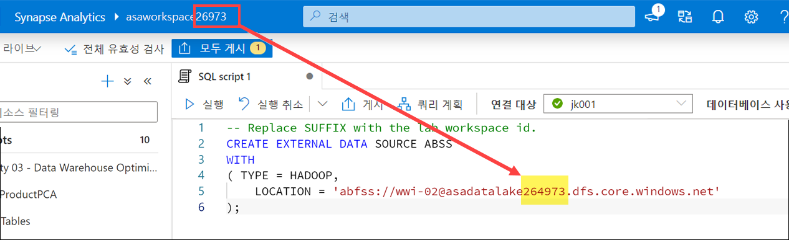

2. 스크립트를 실행하여 외부 데이터 원본을 만듭니다.

3. 쿼리 창에서 스크립트를 다음 코드로 바꿔 외부 파일 형식과 외부 데이터 테이블을 만듭니다. 이 코드에서는 **TransactionId**를 **uniqueidentifier**가 아닌 **nvarchar(36)** 필드로 정의했습니다. 외부 테이블은 현재 **uniqueidentifier** 열을 지원하지 않기 때문입니다.

    ```sql
    CREATE EXTERNAL FILE FORMAT [ParquetFormat]
    WITH (
        FORMAT_TYPE = PARQUET,
        DATA_COMPRESSION = 'org.apache.hadoop.io.compress.SnappyCodec'
    )
    GO

    CREATE SCHEMA [wwi_external];
    GO

    CREATE EXTERNAL TABLE [wwi_external].Sales
        (
            [TransactionId] [nvarchar](36)  NOT NULL,
            [CustomerId] [int]  NOT NULL,
            [ProductId] [smallint]  NOT NULL,
            [Quantity] [smallint]  NOT NULL,
            [Price] [decimal](9,2)  NOT NULL,
            [TotalAmount] [decimal](9,2)  NOT NULL,
            [TransactionDate] [int]  NOT NULL,
            [ProfitAmount] [decimal](9,2)  NOT NULL,
            [Hour] [tinyint]  NOT NULL,
            [Minute] [tinyint]  NOT NULL,
            [StoreId] [smallint]  NOT NULL
        )
    WITH
        (
            LOCATION = '/sale-small/Year=2019',  
            DATA_SOURCE = ABSS,
            FILE_FORMAT = [ParquetFormat]  
        )  
    GO
    ```

    > **참고:** */sale-small/Year=2019/* 폴더의 Parquet 파일에는 **행 4,124,857개**가 포함되어 있습니다.

4. 스크립트를 실행합니다.

5. 쿼리 창에서 스크립트를 다음 코드로 바꿔 **wwi_staging.SalesHeap** 테이블에 데이터를 로드합니다.

    ```sql
    INSERT INTO [wwi_staging].[SaleHeap]
    SELECT *
    FROM [wwi_external].[Sales]
    ```

6. 스크립트를 실행합니다. 완료하는 데 다소 시간이 걸릴 수 있습니다.

7. 쿼리 창에서 스크립트를 다음 코드로 바꿔 가져온 행의 수를 확인합니다.

    ```sql
    SELECT COUNT(1) FROM wwi_staging.SaleHeap(nolock)
    ```

8. 스크립트를 실행합니다. 결과로 4124857이 표시되어야 합니다.

### 작업 3: COPY 문 구성 및 실행

이번에는 COPY 문을 사용하여 같은 로드 작업을 수행하는 방법을 살펴보겠습니다.

1. 쿼리 창에서 스크립트를 다음 코드로 바꿔 힙 테이블을 자른 다음 COPY 문을 사용해 데이터를 로드합니다. 이전 작업과 마찬가지로 ***SUFFIX***는 고유 접미사로 바꿔야 합니다.

    ```sql
    TRUNCATE TABLE wwi_staging.SaleHeap;
    GO

    -- Replace SUFFIX with the unique suffix for your resources
    COPY INTO wwi_staging.SaleHeap
    FROM 'https://asadatalakeSUFFIX.dfs.core.windows.net/wwi-02/sale-small/Year=2019'
    WITH (
        FILE_TYPE = 'PARQUET',
        COMPRESSION = 'SNAPPY'
    )
    GO
    ```

2. 스크립트를 실행합니다. 비슷한 로드 작업을 수행하는 데 약간의 스크립트 작업만 필요합니다.

3. 쿼리 창에서 스크립트를 다음 코드로 바꿔 가져온 행의 수를 확인합니다.

    ```sql
    SELECT COUNT(1) FROM wwi_staging.SaleHeap(nolock)
    ```

4. 스크립트를 실행합니다. 다시 한 번, 4124857개의 행을 가져왔을 것입니다. 두 로드 작업에서 같은 양의 데이터가 거의 같은 시간에 복사되었습니다.

### 작업 4: COPY를 사용하여 비표준 행 구분 기호를 사용하는 텍스트 파일 로드

COPY를 사용하는 경우 PolyBase보다 효율적인 점 중 하나는, 사용자 지정 열 및 행 구분 기호가 지정된다는 것입니다.

WWI에서는 야간 프로세스를 통해 파트너 분석 시스템에서 지역별 영업 데이터를 수집한 다음 데이터 레이크에 파일을 저장합니다. 이러한 텍스트 파일은 비표준 열 및 행 구분 기호를 사용합니다. 열은 마침표로, 행은 쉼표로 구분됩니다.

```
20200421.114892.130282.159488.172105.196533,20200420.109934.108377.122039.101946.100712,20200419.253714.357583.452690.553447.653921
```

데이터에 포함되어 있는 필드는 **Date**, **NorthAmerica**, **SouthAmerica**, **Europe**, **Africa**, **Asia**입니다. WWI는 이 데이터를 처리하여 Synapse Analytics에 저장해야 합니다.

1. 쿼리 창에서 스크립트를 다음 코드로 바꿔 **DailySalesCounts** 테이블을 만든 다음 COPY 문을 사용해 데이터를 로드합니다. 이전 작업과 마찬가지로 ***SUFFIX***는 고유 접미사로 바꿔야 합니다.

    ```sql
    CREATE TABLE [wwi_staging].DailySalesCounts
        (
            [Date] [int]  NOT NULL,
            [NorthAmerica] [int]  NOT NULL,
            [SouthAmerica] [int]  NOT NULL,
            [Europe] [int]  NOT NULL,
            [Africa] [int]  NOT NULL,
            [Asia] [int]  NOT NULL
        )
    GO

    -- Replace SUFFIX with the unique suffix for your resources
    COPY INTO wwi_staging.DailySalesCounts
    FROM 'https://asadatalakeSUFFIX.dfs.core.windows.net/wwi-02/campaign-analytics/dailycounts.txt'
    WITH (
        FILE_TYPE = 'CSV',
        FIELDTERMINATOR='.',
        ROWTERMINATOR=','
    )
    GO
    ```

    코드가 파일을 올바르게 구문 분석할 수 있게 해주는 FIELDTERMINATOR` 및 ROWTERMINATOR 속성에 주목하세요.

2. 스크립트를 실행합니다.

3. 쿼리 창에서 스크립트를 다음 코드로 바꿔 가져온 데이터를 확인합니다.

    ```sql
    SELECT * FROM [wwi_staging].DailySalesCounts
    ORDER BY [Date] DESC
    ```

4. 스크립트를 실행하고 결과를 봅니다.

5. 차트에 결과를 표시하여 **범주 열**을 **Date**로 설정해 봅니다.

    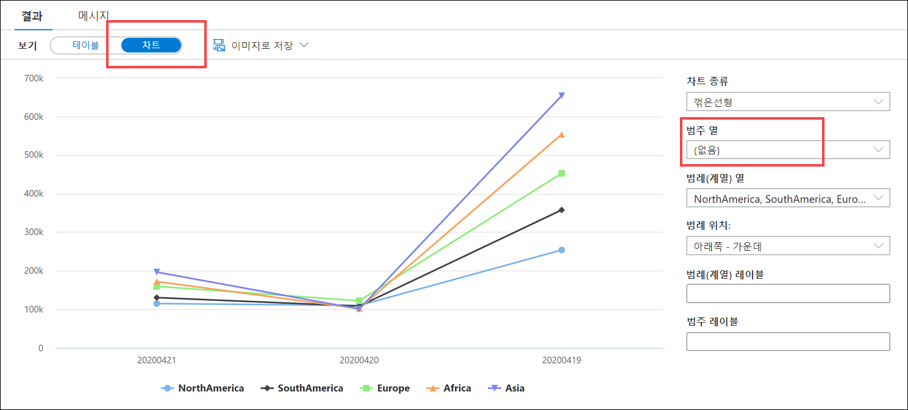

### 작업 5: PolyBase를 사용하여 비표준 행 구분 기호를 사용하는 텍스트 파일 로드

이번에는 PolyBase를 사용하여 같은 작업을 수행해 보겠습니다.

1. 쿼리 창에서 스크립트를 다음 코드로 바꿔 새 외부 파일 형식과 외부 테이블을 만들고 PolyBase를 사용해 데이터를 로드합니다.

    ```sql
    CREATE EXTERNAL FILE FORMAT csv_dailysales
    WITH (
        FORMAT_TYPE = DELIMITEDTEXT,
        FORMAT_OPTIONS (
            FIELD_TERMINATOR = '.',
            DATE_FORMAT = '',
            USE_TYPE_DEFAULT = False
        )
    );
    GO

    CREATE EXTERNAL TABLE [wwi_external].DailySalesCounts
        (
            [Date] [int]  NOT NULL,
            [NorthAmerica] [int]  NOT NULL,
            [SouthAmerica] [int]  NOT NULL,
            [Europe] [int]  NOT NULL,
            [Africa] [int]  NOT NULL,
            [Asia] [int]  NOT NULL
        )
    WITH
        (
            LOCATION = '/campaign-analytics/dailycounts.txt',  
            DATA_SOURCE = ABSS,
            FILE_FORMAT = csv_dailysales
        )  
    GO
    INSERT INTO [wwi_staging].[DailySalesCounts]
    SELECT *
    FROM [wwi_external].[DailySalesCounts]
    ```

2. 스크립트를 실행합니다. 다음과 같은 오류가 표시됩니다.

    *쿼리를 실행하지 못했습니다. 오류: HdfsBridge::recordReaderFillBuffer - 레코드 판독기 버퍼를 채우는 중에 예기치 않은 오류가 발생했습니다. HadoopExecutionException: 줄에 열이 너무 많습니다.*

    이 오류가 발생하는 이유는 [PolyBase 설명서](https://docs.microsoft.com/sql/t-sql/statements/create-external-file-format-transact-sql?view=sql-server-ver15#limitations-and-restrictions)에서 확인할 수 있습니다.

    > 구분 기호로 분리된 텍스트 파일의 행 구분 기호는 Hadoop의 LineRecordReader에서 지원되어야 합니다. 즉 **\r**, **\n** 또는 **\r\n**이어야 합니다. 이러한 구분 기호는 사용자가 구성할 수 없습니다.

    이러한 경우에는 PolyBase보다 유동적인 COPY를 사용하면 효율적입니다.

3. 다음 연습을 위해 스크립트를 열어둡니다.

## 연습 2 - Azure Synapse 파이프라인을 사용하여 페타바이트 단위 데이터 수집

대량의 영업 데이터를 데이터 웨어하우스에 수집해야 하는 Tailwind Traders는 데이터를 효율적으로 로드할 수 있는 반복 가능한 프로세스를 진행하고자 합니다. 그리고 데이터 로드 시 데이터 이동 작업이 우선적으로 수행되도록 우선 순위를 지정하려고 합니다.

모범 사례에 따라 로드 성능을 개선하기 위해 큰 Parquet 파일을 가져오는 개념 증명 데이터 파이프라인을 만들기로 했습니다.

데이터 웨어하우스로 데이터를 이동할 때는 일정 수준의 오케스트레이션을 수행하여 데이터 원본 하나 이상에서 데이터를 이동하는 작업을 조정해야 하는 경우가 많으며, 일정 수준의 변환을 수행해야 하는 경우도 있습니다. 변환 단계는 ETL(추출-변환-로드) 데이터 이동 전이나 후에 수행할 수 있습니다. 모든 최신 데이터 플랫폼은 추출, 구문 분석, 조인, 표준화, 보강, 정리, 통합, 필터링 등의 일반적인 데이터 랭글링 작업을 모두 원활하게 수행할 수 있는 환경을 제공해야 합니다. Azure Synapse Analytics에서는 두 가지 중요 기능 범주인 데이터 흐름과 데이터 오케스트레이션(파이프라인으로 구현됨)이 제공됩니다.

> 이 연습에서는 오케스트레이션 부분을 중점적으로 살펴봅니다. 그리고 이후의 랩에서 변환(데이터 흐름) 파이프라인을 자세히 살펴봅니다.

### 작업 1: 워크로드 관리 분류 구성

대량의 데이터를 로드할 때는 성능을 최대한 높일 수 있도록 로드 작업을 한 번에 하나씩만 실행하는 것이 가장 좋습니다. 이렇게 할 수 없을 때는 동시에 실행하는 로드 수를 최소화합니다. 대규모 로드 작업을 수행해야 하는 경우에는 로드 전에 전용 SQL 풀을 스케일 업하는 것이 좋습니다.

파이프라인 세션에는 메모리를 충분히 할당해야 합니다. 이렇게 하려면 이 테이블의 인덱스를 다시 작성하기 위한 권한이 있는 사용자의 리소스 클래스를 권장되는 최소 수로 늘립니다.

적절한 컴퓨팅 리소스가 포함된 로드를 실행하려면 부하를 실행하기 위해 지정된 로드 사용자를 만듭니다. 특정 리소스 클래스 또는 워크로드 그룹에 각 로드 사용자를 할당합니다. 로드를 실행하려면 로드 사용자 중 한 명으로 로그인한 후에 로드를 실행합니다. 사용자의 리소스 클래스를 사용하여 부하를 실행합니다.

1. 이전 연습에서 작업한 SQL 스크립트 쿼리 창에서 스크립트를 바꿔서 다음을 만듭니다.
    - 최소 50%, 최대 100%의 리소스를 예약함으로써 워크로드 격리를 사용하는 워크로드 그룹, **BigDataLoad**
    - **asa.sql.import01** 사용자를 **BigDataLoad** 워크로드 그룹에 할당하는 새로운 워크로드 분류자, **HeavyLoader**
    
    코드 끝부분에서는 **sys.workload_management_workload_classifiers** 중에서 적절한 분류자를 선택하여 방금 만든 분류자를 비롯한 모든 분류자를 확인합니다.

    ```sql
    -- Drop objects if they exist
    IF EXISTS (SELECT * FROM sys.workload_management_workload_classifiers WHERE [name] = 'HeavyLoader')
    BEGIN
        DROP WORKLOAD CLASSIFIER HeavyLoader
    END;
    
    IF EXISTS (SELECT * FROM sys.workload_management_workload_groups WHERE name = 'BigDataLoad')
    BEGIN
        DROP WORKLOAD GROUP BigDataLoad
    END;
    
    --Create workload group
    CREATE WORKLOAD GROUP BigDataLoad WITH
      (
          MIN_PERCENTAGE_RESOURCE = 50, -- integer value
          REQUEST_MIN_RESOURCE_GRANT_PERCENT = 25, --  (guaranteed min 4 concurrency)
          CAP_PERCENTAGE_RESOURCE = 100
      );
    
    -- Create workload classifier
    CREATE WORKLOAD Classifier HeavyLoader WITH
    (
        Workload_Group ='BigDataLoad',
        MemberName='asa.sql.import01',
        IMPORTANCE = HIGH
    );
    
    -- View classifiers
    SELECT * FROM sys.workload_management_workload_classifiers
    ```

2. 스크립트를 실행하고, 필요한 경우 결과를 **테이블** 뷰로 전환합니다. 쿼리 결과에 새 **HeavyLoader** 분류자가 표시됩니다.

    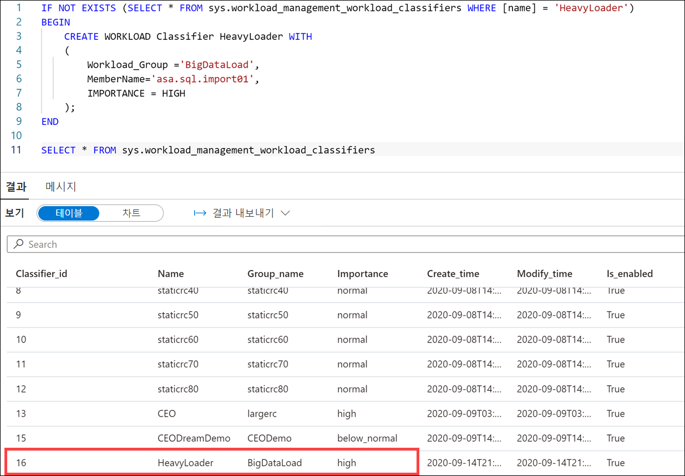

3. **관리** 허브로 이동합니다.

    

4. 왼쪽 메뉴에서 **연결된 서비스**를 선택한 후에 **sqlpool01_import01** 연결된 서비스를 선택합니다(목록에 없으면 오른쪽 상단의 **&#8635;** 단추를 사용하여 뷰를 새로 고침).

    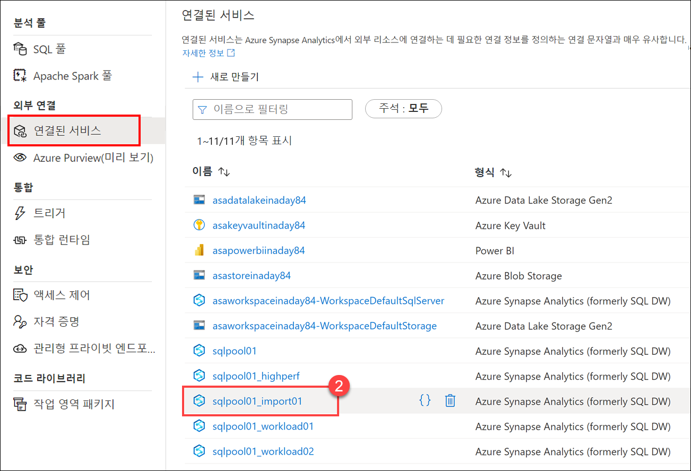

5. 전용 SQL 풀 연결의 사용자 이름은 **HeavyLoader** 분류자에 추가한 **asa.sql.import01** 사용자입니다. 새 파이프라인에서 이 연결된 서비스를 사용해 데이터 로드 작업용 리소스를 예약합니다.

    

6. **취소**를 선택하여 대화 상자를 닫습니다. 메시지가 표시되면 **변경 내용 취소**를 선택합니다.

### 작업 2: 복사 작업을 사용하여 파이프라인 만들기

1. **통합** 허브로 이동합니다.

    

2. **+** 메뉴에서 **파이프라인**을 선택하여 새 파이프라인을 만듭니다.

    

3. 새 파이프라인의 **속성** 창에서 파이프라인의 **이름**을 **`Copy December Sales`** 로 설정합니다.

    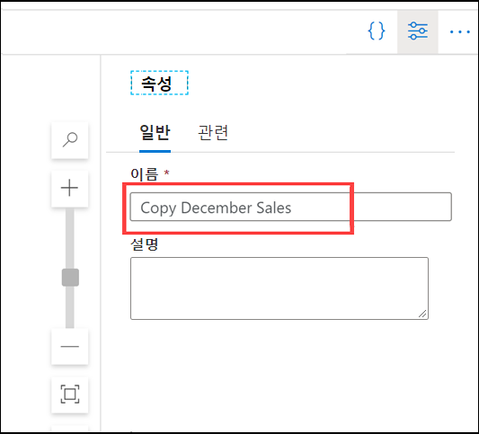

    > **팁**: 이름을 설정한 후에는 **속성** 창을 숨기세요.

4. 활동 목록 내에서 **이동 및 변환**을 확장하고 **데이터 복사** 활동을 파이프라인 캔버스로 끕니다.

    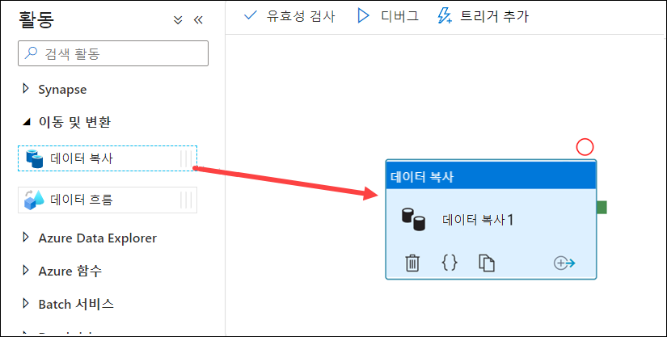

5. 캔버스에서 **데이터 복사** 활동을 선택합니다. 그런 다음에 캔버스 아래의 **일반** 탭에서 활동의 **이름**을 **`Copy Sales`** 로 설정합니다.

    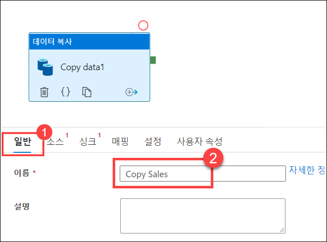

6. **원본** 탭을 선택한 다음 **+ 새로 만들기**를 클릭하여 새 원본 데이터 세트를 만듭니다.

    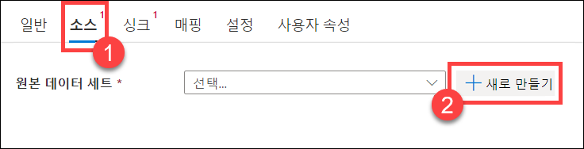

7. **Azure Data Lake Storage Gen2** 데이터 저장소를 선택하고 **계속**을 선택합니다.

    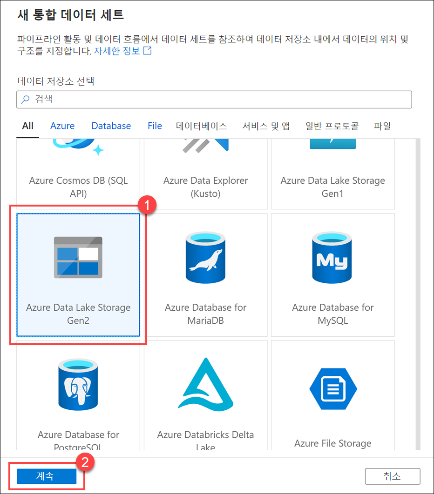

8. **Parquet** 형식을 선택하고 **계속**을 선택합니다.

    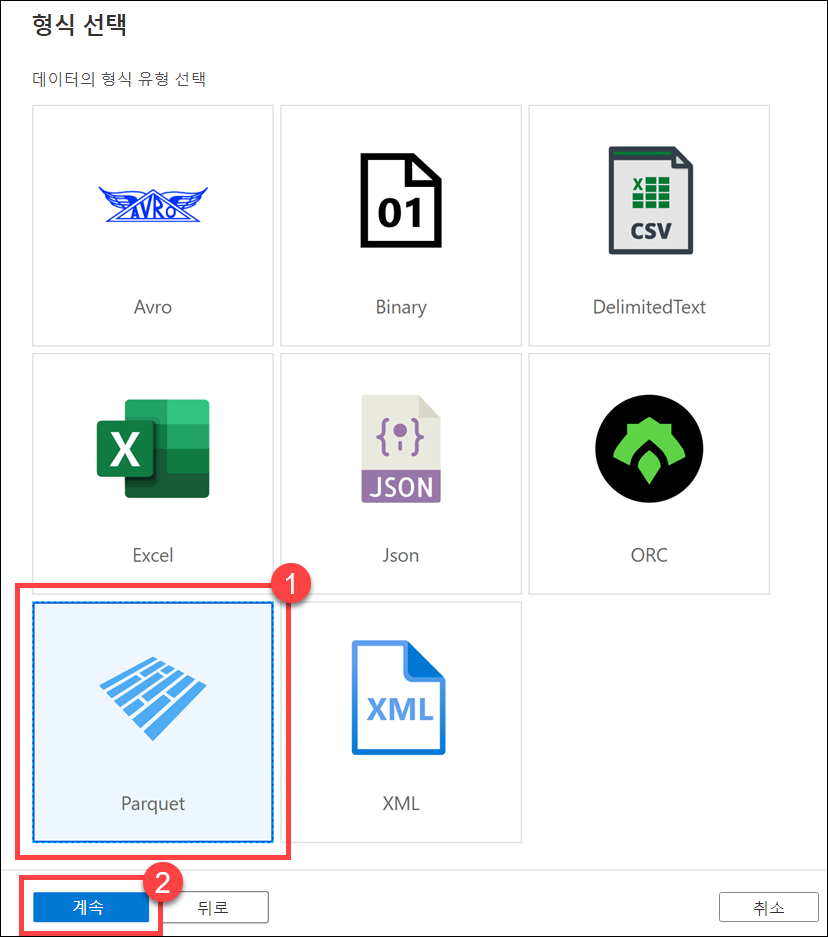

9. **속성 설정** 창에서 다음을 수행합니다.
    1. 이름을 **`asal400_december_sales`** 로 설정합니다.
    2. **asadatalake*xxxxxxx*** 연결된 서비스를 선택합니다.
    3. **wwi-02/campaign-analytics/sale-20161230-snappy.parquet** 파일로 이동합니다.
    4. 스키마 가져오기에서 **샘플 파일**을 선택합니다.
    5. **파일 선택** 필드에서 **C:\dp-203\data-engineering-ilt-deployment\Allfiles\samplefiles\sale-small-20100102-snappy.parquet**으로 이동합니다.
    6. **확인**을 선택합니다.

    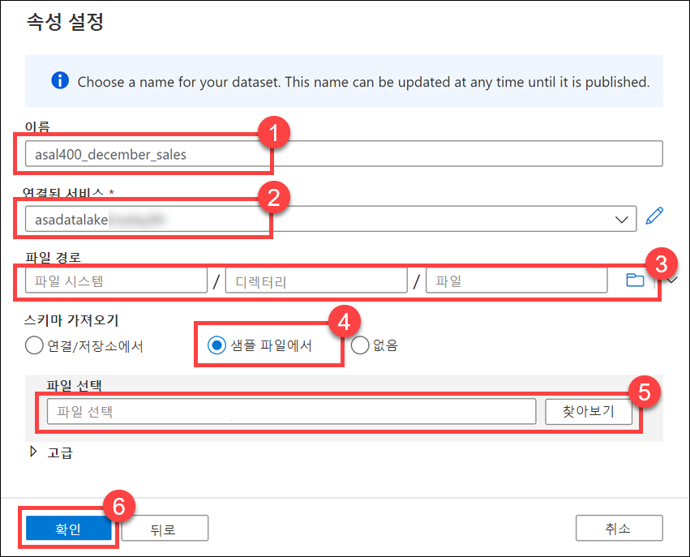

    스키마는 정확히 동일하지만 크기는 훨씬 작은 샘플 Parquet 파일을 다운로드했습니다. 복사하려는 파일이 너무 커서 복사 작업 원본 설정의 스키마를 자동으로 유추할 수가 없기 때문입니다.

10. **싱크** 탭을 선택한 다음 **+ 새로 만들기**를 클릭하여 새 싱크 데이터 세트를 만듭니다.

    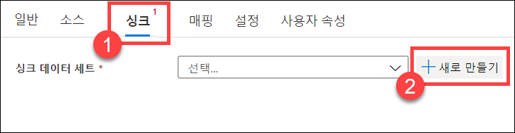

11. **Azure Synapse Analytics** 데이터 저장소를 선택하고 **계속**을 선택합니다.

    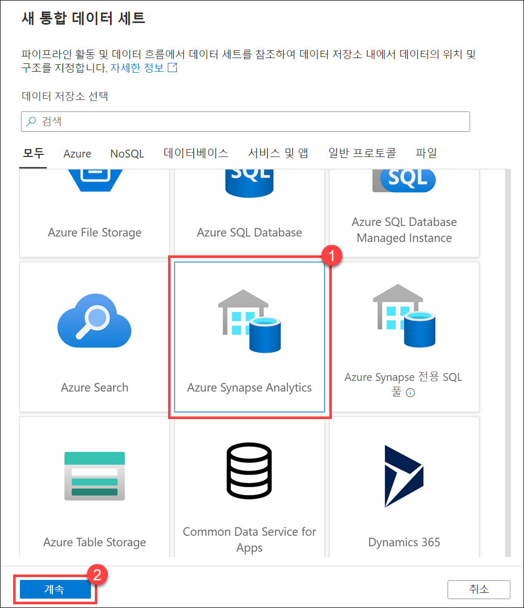

12. **속성 설정** 창에서 다음을 수행합니다.
    1. **이름**을 **`asal400_saleheap_asa`** 로 설정합니다.
    2. **sqlpool01_import01** 연결된 서비스를 선택합니다.
    3. **wwi_perf.Sale_Heap** 테이블을 선택합니다.
    4. **확인**을 선택합니다.

    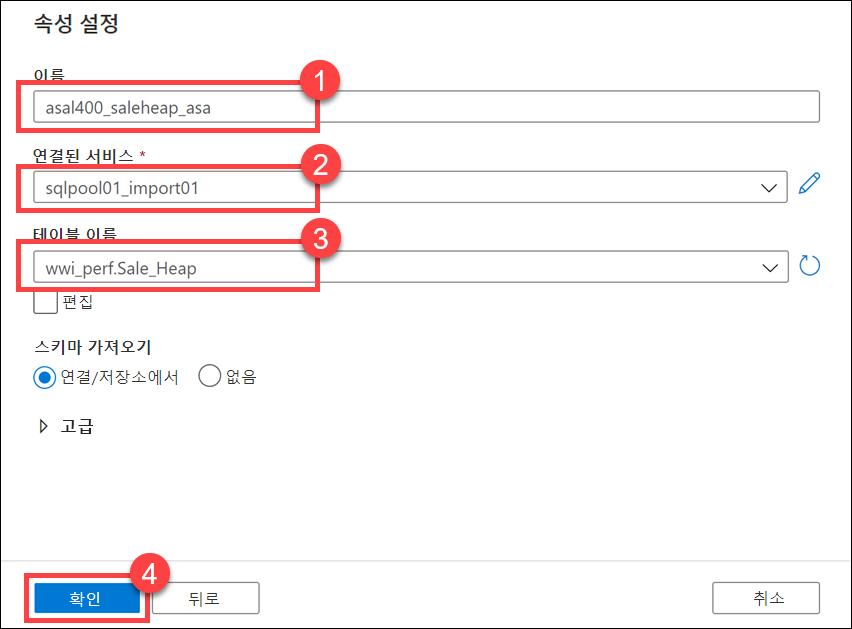

13. **싱크** 탭에서 **복사 명령** 복사 방법을 선택하고 복사 전 스크립트에 다음 코드를 입력하여 가져오기 전에 테이블을 지웁니다.

    ```
    TRUNCATE TABLE wwi_perf.Sale_Heap
    ```

    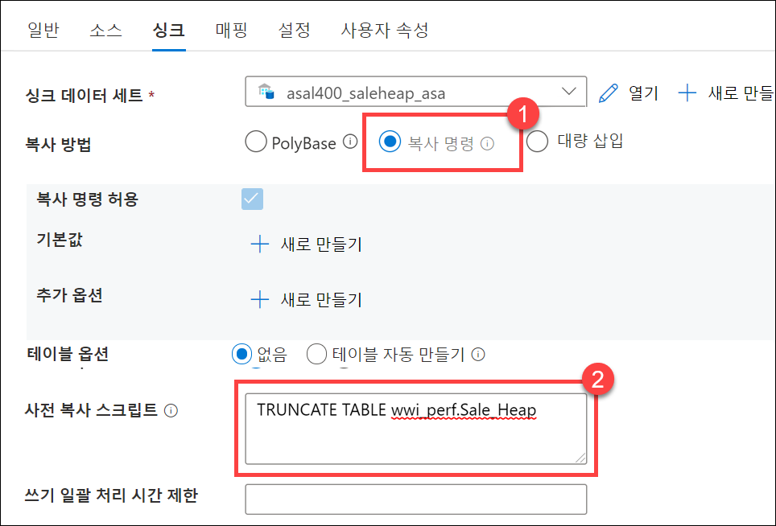

    데이터를 확장 가능한 방식으로 가장 빠르게 로드하는 방법은 PolyBase 또는 COPY 문을 사용하는 것입니다. COPY 문을 사용하는 경우 높은 처리량을 유지하면서 가장 유동적인 방식으로 SQL 풀에 데이터를 수집할 수 있습니다.

14. **매핑** 탭을 선택하고 **스키마 가져오기**를 선택하여 각 원본 및 대상 필드의 매핑을 만듭니다. 원본 열에서 **TransactionDate**를 선택하여 **TransactionDateId** 대상 열에 매핑합니다.

    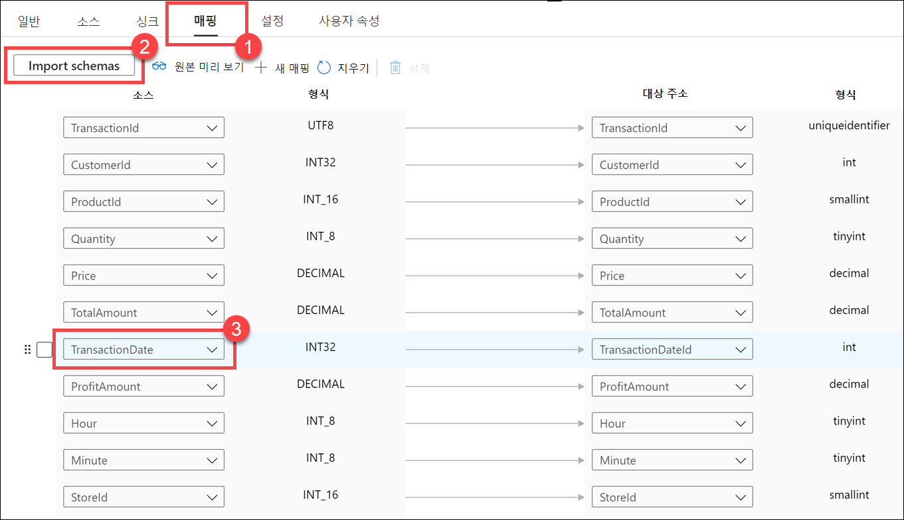

15. **설정** 탭을 선택하고 **데이터 통합 단위**를 **8**로 설정합니다. 이렇게 설정해야 하는 이유는 원본 Parquet 파일이 크기 때문입니다.

    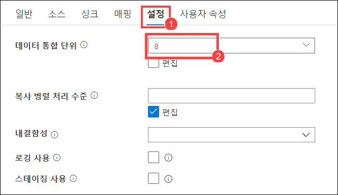

16. **모두 게시**, **게시**를 차례로 선택하여 새 리소스를 저장합니다.

    

17. **트리거 추가**와 **지금 트리거**를 차례로 선택합니다. 그런 다음에 **파이프라인 실행** 창에서 **확인**을 선택하여 파이프라인을 시작합니다.

    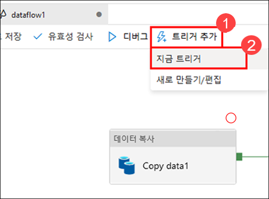

18. **모니터** 허브로 이동합니다.

    

19. **파이프라인 실행**을 선택합니다. 여기서 파이프라인 상태를 확인할 수 있습니다. 보기를 새로 고쳐야 할 수도 있습니다. 파이프라인 실행이 완료되면 **wwi_perf.Sale_Heap** 테이블을 쿼리하여 가져온 데이터를 확인할 수 있습니다.

    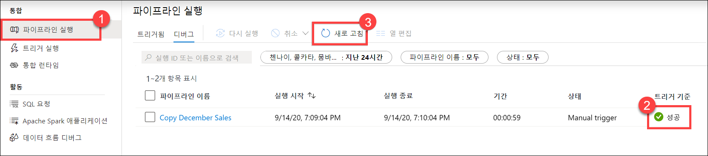

## 중요: SQL 풀 일시 중지

다음 단계를 완료하여 더 이상 필요없는 리소스를 정리할 수 있습니다.

1. Synapse Studio에서 **관리** 허브를 선택합니다.
2. 왼쪽 메뉴에서 **SQL 풀**을 선택합니다. **SQLPool01** 전용 SQL 풀을 커서로 가리키고 다음을 선택합니다. **||**.

    

3. 메시지가 표시되면 **일시 중지**를 선택합니다.
