---
lab:
    title: 'Azure Data Factory 또는 Azure Synapse 파이프라인을 사용하여 Notebooks의 데이터 통합'
    module: '모듈 7'
---

# 랩 7 - Azure Data Factory 또는 Azure Synapse 파이프라인을 사용하여 Notebooks의 데이터 통합

Azure Synapse 파이프라인에서 연결된 서비스를 만들고 데이터 이동 및 변환을 오케스트레이션하는 방법을 알아봅니다.

이 랩을 마치면 다음과 같은 역량을 갖추게 됩니다.

- Azure Synapse 파이프라인에서 데이터 이동 및 변환 오케스트레이션

## 랩 설정 및 필수 구성 요소

이 랩을 시작하기 전에 **랩 6: *Azure Data Factory 또는 Azure Synapse 파이프라인을 사용하여 데이터 변환***을 완료해야 합니다.

> **참고**: 랩 6을 완료하지 ***않았지만*** 이 과정의 랩 설정을 <u>완료한</u> 경우에는 이 단계를 완료하여 필요한 연결된 서비스 및 데이터 세트를 만들 수 있습니다.
>
> 1. Synapse Studio의 **관리** 허브에서 다음과 같은 설정으로 **Azure Cosmos DB(SQL API)** 에 대해 새 **연결된 서비스**를 추가합니다.
>       - **이름**: asacosmosdb01
>       - **Cosmos DB 계정 이름**: asacosmosdb*xxxxxxx*
>       - **데이터베이스 이름**: CustomerProfile
> 2. **데이터** 허브에서 다음과 같은 **통합 데이터 세트**를 만듭니다.
>       - asal400_customerprofile_cosmosdb:
>           - **원본**: Azure Cosmos DB(SQL API)
>           - **이름**: asal400_customerprofile_cosmosdb
>           - **연결된 서비스**: asacosmosdb01
>           - **컬렉션**: OnlineUserProfile01
>       - asal400_ecommerce_userprofiles_source
>           - **원본**: Azure Data Lake Storage Gen2
>           - **형식**: JSON
>           - **이름**: asal400_ecommerce_userprofiles_source
>           - **연결된 서비스**: asadatalake*xxxxxxx*
>           - **파일 경로**: wwi-02/online-user-profiles-02
>           - **스키마 가져오기**: 연결/저장소에서

## 연습 1 - 매핑 데이터 흐름 및 파이프라인 만들기

이 연습에서는 사용자 프로필 데이터를 데이터 레이크에 복사하는 매핑 데이터 흐름을 만든 후에 파이프라인을 만듭니다. 이 파이프라인은 데이터 흐름, 그리고 이 랩 뒷부분에서 만들 Spark Notebook 실행 과정을 오케스트레이션합니다.

### 작업 1: 매핑 데이터 흐름 만들기

1. Synapse Studio(<https://web.azuresynapse.net/>)를 엽니다.
2. **개발** 허브로 이동합니다.

    

3. **+** 메뉴에서 **데이터 흐름**을 선택하여 새 데이터 흐름을 만듭니다.

    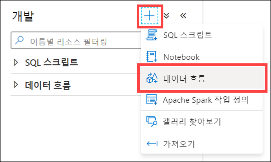

4. 새 데이터 흐름 **속성** 블레이드의 **일반**설정에서 **이름**을 `user_profiles_to_datalake`로 업데이트합니다. 이름이 정확하게 일치해야 합니다.

    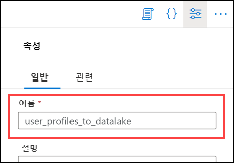

5. 데이터 흐름 속성 위의 오른쪽 상단에서 **{} 코드** 단추를 선택합니다.

    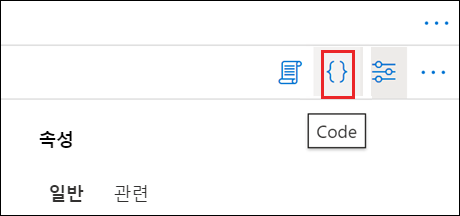

6. 기존 코드를 다음과 같이 바꿉니다. 이때 25행의 **asadatalake*SUFFIX*** 싱크 참조 이름에서 ***SUFFIX***를 이 랩에 있는 Azure 리소스의 고유 접미사로 변경합니다.

    ```
    {
        "name": "user_profiles_to_datalake",
        "properties": {
            "type": "MappingDataFlow",
            "typeProperties": {
                "sources": [
                    {
                        "dataset": {
                            "referenceName": "asal400_ecommerce_userprofiles_source",
                            "type": "DatasetReference"
                        },
                        "name": "EcommerceUserProfiles"
                    },
                    {
                        "dataset": {
                            "referenceName": "asal400_customerprofile_cosmosdb",
                            "type": "DatasetReference"
                        },
                        "name": "UserProfiles"
                    }
                ],
                "sinks": [
                    {
                        "linkedService": {
                            "referenceName": "asadatalakeSUFFIX",
                            "type": "LinkedServiceReference"
                        },
                        "name": "DataLake"
                    }
                ],
                "transformations": [
                    {
                        "name": "userId"
                    },
                    {
                        "name": "UserTopProducts"
                    },
                    {
                        "name": "DerivedProductColumns"
                    },
                    {
                        "name": "UserPreferredProducts"
                    },
                    {
                        "name": "JoinTopProductsWithPreferredProducts"
                    },
                    {
                        "name": "DerivedColumnsForMerge"
                    },
                    {
                        "name": "Filter1"
                    }
                ],
                "script": "source(output(\n\t\tvisitorId as string,\n\t\ttopProductPurchases as (productId as string, itemsPurchasedLast12Months as string)[]\n\t),\n\tallowSchemaDrift: true,\n\tvalidateSchema: false,\n\tignoreNoFilesFound: false,\n\tdocumentForm: 'arrayOfDocuments',\n\twildcardPaths:['online-user-profiles-02/*.json']) ~> EcommerceUserProfiles\nsource(output(\n\t\tcartId as string,\n\t\tpreferredProducts as integer[],\n\t\tproductReviews as (productId as integer, reviewDate as string, reviewText as string)[],\n\t\tuserId as integer\n\t),\n\tallowSchemaDrift: true,\n\tvalidateSchema: false,\n\tformat: 'document') ~> UserProfiles\nEcommerceUserProfiles derive(visitorId = toInteger(visitorId)) ~> userId\nuserId foldDown(unroll(topProductPurchases),\n\tmapColumn(\n\t\tvisitorId,\n\t\tproductId = topProductPurchases.productId,\n\t\titemsPurchasedLast12Months = topProductPurchases.itemsPurchasedLast12Months\n\t),\n\tskipDuplicateMapInputs: false,\n\tskipDuplicateMapOutputs: false) ~> UserTopProducts\nUserTopProducts derive(productId = toInteger(productId),\n\t\titemsPurchasedLast12Months = toInteger(itemsPurchasedLast12Months)) ~> DerivedProductColumns\nUserProfiles foldDown(unroll(preferredProducts),\n\tmapColumn(\n\t\tpreferredProductId = preferredProducts,\n\t\tuserId\n\t),\n\tskipDuplicateMapInputs: false,\n\tskipDuplicateMapOutputs: false) ~> UserPreferredProducts\nDerivedProductColumns, UserPreferredProducts join(visitorId == userId,\n\tjoinType:'outer',\n\tpartitionBy('hash', 30,\n\t\tproductId\n\t),\n\tbroadcast: 'left')~> JoinTopProductsWithPreferredProducts\nJoinTopProductsWithPreferredProducts derive(isTopProduct = toBoolean(iif(isNull(productId), 'false', 'true')),\n\t\tisPreferredProduct = toBoolean(iif(isNull(preferredProductId), 'false', 'true')),\n\t\tproductId = iif(isNull(productId), preferredProductId, productId),\n\t\tuserId = iif(isNull(userId), visitorId, userId)) ~> DerivedColumnsForMerge\nDerivedColumnsForMerge filter(!isNull(productId)) ~> Filter1\nFilter1 sink(allowSchemaDrift: true,\n\tvalidateSchema: false,\n\tformat: 'delta',\n\tcompressionType: 'snappy',\n\tcompressionLevel: 'Fastest',\n\tfileSystem: 'wwi-02',\n\tfolderPath: 'top-products',\n\ttruncate:true,\n\tmergeSchema: false,\n\tautoCompact: false,\n\toptimizedWrite: false,\n\tvacuum: 0,\n\tdeletable:false,\n\tinsertable:true,\n\tupdateable:false,\n\tupsertable:false,\n\tmapColumn(\n\t\tvisitorId,\n\t\tproductId,\n\t\titemsPurchasedLast12Months,\n\t\tpreferredProductId,\n\t\tuserId,\n\t\tisTopProduct,\n\t\tisPreferredProduct\n\t),\n\tskipDuplicateMapInputs: true,\n\tskipDuplicateMapOutputs: true) ~> DataLake"
            }
        }
    }
    ```

7. **확인**을 선택합니다.

8. 데이터 흐름은 다음과 같습니다.

    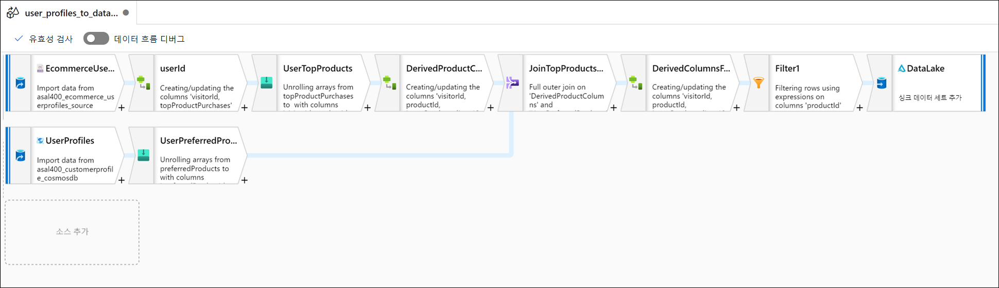

### 작업 2: 파이프라인 만들기

이 단계에서는 데이터 흐름을 실행할 새 통합 파이프라인을 만듭니다.

1. **통합** 허브의 **+** 메뉴에서 **파이프라인**을 선택합니다.

    

2. 새 데이터 흐름 **속성** 창의 **일반** 섹션에서 **이름**을 `User Profiles to Datalake`로 업데이트합니다. 그런 다음에 **속성** 단추를 선택하여 창을 숨깁니다.

    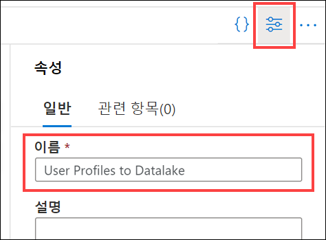

3. 활동 목록 내에서 **이동 및 변환**을 확장하고 **데이터 흐름** 활동을 파이프라인 캔버스로 끕니다.

    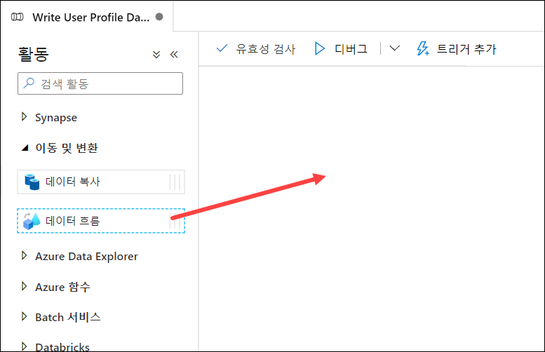

4. 파이프라인 캔버스 아래의 **일반** 탭에서 이름을 `user_profiles_to_datalake`로 설정합니다.

    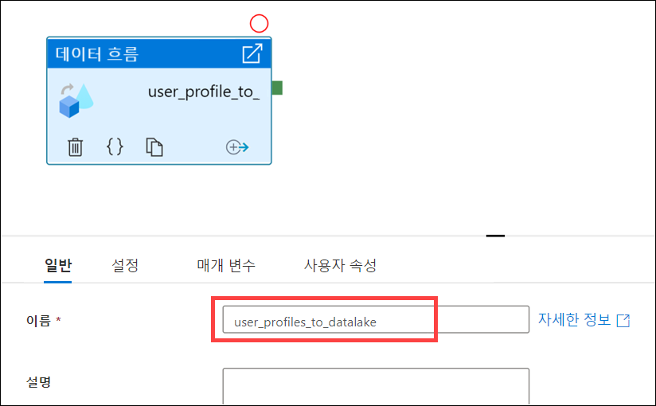

5. **설정** 탭에서 **user_profiles_to_datalake** 데이터 흐름을 선택하고, **AutoResolveIntegrationRuntime**이 선택되었는지 확인합니다. **기본(범용)** 컴퓨팅 유형을 선택하고 코어 개수를 **4(+4개 드라이버 코어)** 로 설정합니다.

    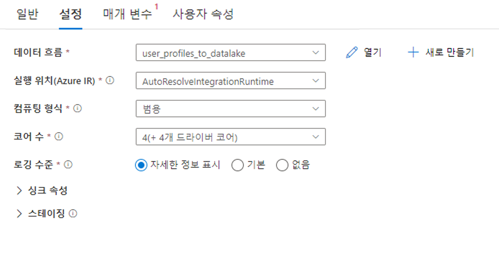

6. **모두 게시**, **게시**를 차례로 선택하여 파이프라인을 저장합니다.

    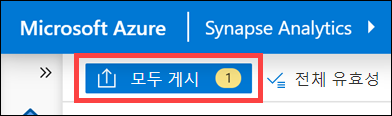

### 작업 3: 파이프라인 트리거

1. 파이프라인 위쪽에서 **트리거 추가**와 **지금 트리거**를 차례로 선택합니다.

    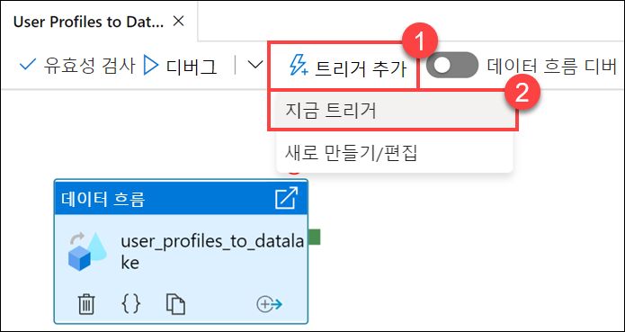

2. 이 파이프라인에는 매개 변수가 없으므로 **확인**을 선택하여 트리거를 실행합니다.

    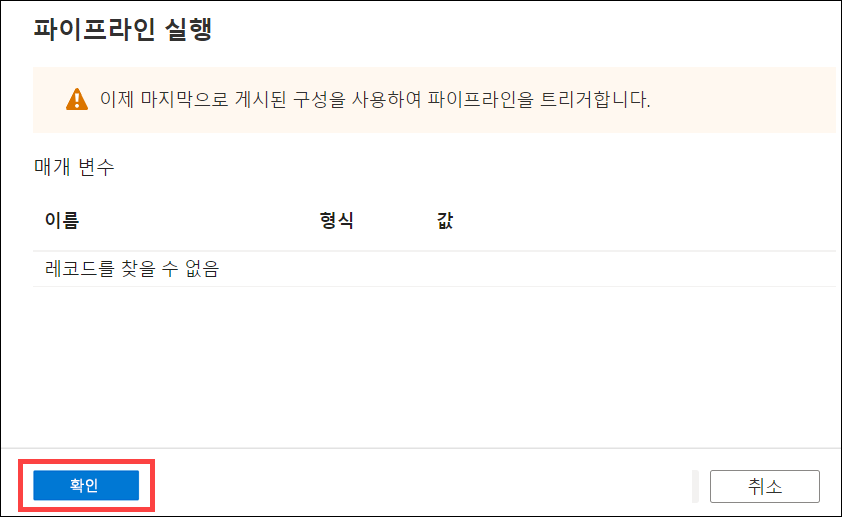

3. **모니터** 허브로 이동합니다.

    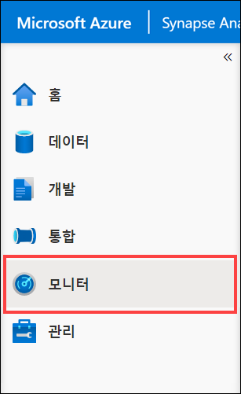

4. **파이프라인 실행**을 선택하고 파이프라인 실행이 성공적으로 완료될 때까지 기다립니다(시간이 좀 걸림). 보기를 새로 고쳐야 할 수도 있습니다.

    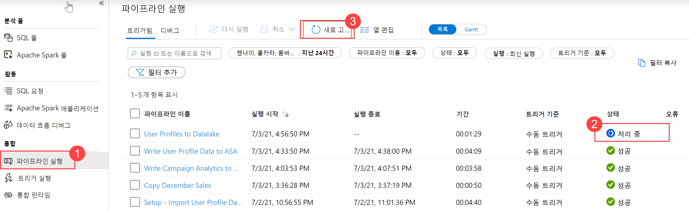

## 연습 2 - Synapse Spark Notebook을 만들어 상위 제품 찾기

Tailwind Traders는 Synapse Analytics의 매핑 데이터 흐름을 사용하여 사용자 프로필 데이터 처리, 조인, 가져오기를 수행합니다. 현재 Tailwind Traders는 각 사용자의 선호 제품과 구매 수가 많은 제품, 그리고 지난 12개월 동안 구매 수가 가장 많은 제품을 기준으로 하여 각 사용자의 상위 제품 5개를 확인하려고 합니다. 그런 다음 전체 제품 중 상위 5개 제품을 계산하려고 합니다.

이 연습에서는 이러한 계산을 수행할 Synapse Spark Notebook을 만듭니다.

### 작업 1: Notebook 만들기

1. **데이터** 허브를 선택합니다.

    

2. **연결됨** 탭에서 **Azure Data Lake Storage Gen2**와 기본 데이터 레이크 스토리지 계정을 확장하고 **wwi-02** 컨테이너를 선택합니다. 그런 다음에 이 컨테이너의 루트에 있는 **top-products** 폴더로 이동합니다. (폴더가 보이지 않으면 **새로 고침**을 선택합니다.) 마지막으로, 아무 Parquet 파일이나 마우스 오른쪽 단추로 클릭하고 **새 Notebook** 메뉴 항목을 선택한 다음 **데이터 프레임에 로드**를 선택합니다.

    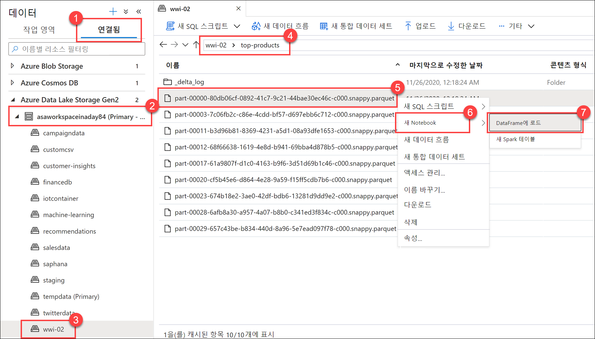

3. Notebook 오른쪽 위의 **속성** 단추를 선택하고 **이름**으로 `Calculate Top 5 Products`를 입력합니다. 그런 다음에 **속성** 단추를 다시 클릭하여 창을 숨깁니다.

4. Notebook을 **SparkPool01** Spark 풀에 연결합니다.

    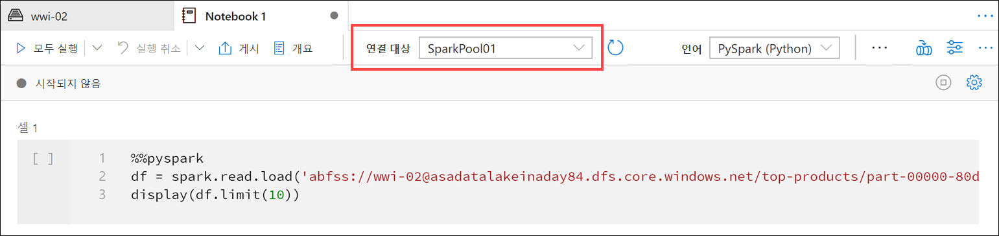

5. Python 코드에서 Parquet 파일 이름을 `*.parquet`으로 바꿔 **top-products** 폴더의 모든 Parquet 파일을 선택합니다. 예를 들어    abfss://wwi-02@asadatalakexxxxxxx.dfs.core.windows.net/top-products/*.parquet과 같은 경로를 사용할 수 있습니다.

    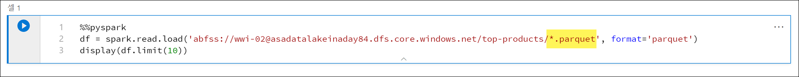

6. Notebook 도구 모음에서 **모두 실행**을 선택하여 Notebook을 실행합니다.

    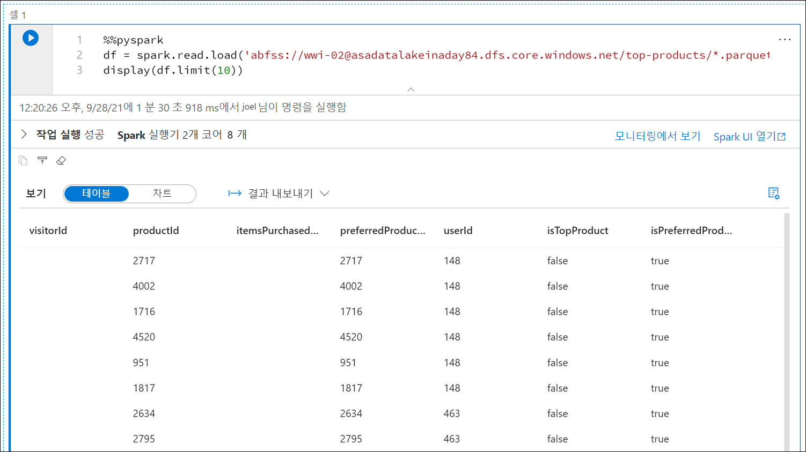

    > **참고:** Spark 풀에서 Notebook을 처음 실행하면 Synapse가 새 세션을 생성합니다. 이 작업은 약 2~3분이 걸릴 수 있습니다.

7. **+ 코드** 단추를 선택하여 아래에 새 코드 셀을 만듭니다.

8. 새 셀에서 다음 코드를 입력하고 실행하여 새 데이터 프레임 **topPurchases**에 데이터를 입력하고 새 임시 보기 **top_purchases**를 만든 다음 처음 100개 행을 표시합니다.

    ```python
    topPurchases = df.select(
        "UserId", "ProductId",
        "ItemsPurchasedLast12Months", "IsTopProduct",
        "IsPreferredProduct")

    # Populate a temporary view so we can query from SQL
    topPurchases.createOrReplaceTempView("top_purchases")

    topPurchases.show(100)
    ```

    다음과 같은 출력이 표시됩니다.

    ```
    +------+---------+--------------------------+------------+------------------+
    |UserId|ProductId|ItemsPurchasedLast12Months|IsTopProduct|IsPreferredProduct|
    +------+---------+--------------------------+------------+------------------+
    |   148|     2717|                      null|       false|              true|
    |   148|     4002|                      null|       false|              true|
    |   148|     1716|                      null|       false|              true|
    |   148|     4520|                      null|       false|              true|
    |   148|      951|                      null|       false|              true|
    |   148|     1817|                      null|       false|              true|
    |   463|     2634|                      null|       false|              true|
    |   463|     2795|                      null|       false|              true|
    |   471|     1946|                      null|       false|              true|
    |   471|     4431|                      null|       false|              true|
    |   471|      566|                      null|       false|              true|
    |   471|     2179|                      null|       false|              true|
    |   471|     3758|                      null|       false|              true|
    |   471|     2434|                      null|       false|              true|
    |   471|     1793|                      null|       false|              true|
    |   471|     1620|                      null|       false|              true|
    |   471|     1572|                      null|       false|              true|
    |   833|      957|                      null|       false|              true|
    |   833|     3140|                      null|       false|              true|
    |   833|     1087|                      null|       false|              true|
    ```

9. 새 셀에서 다음 코드를 실행하여 **IsTopProduct**와 **IsPreferredProduct**가 모두 true인 상위 선호 제품만 포함할 새 데이터 프레임을 만듭니다.

    ```python
    from pyspark.sql.functions import *

    topPreferredProducts = (topPurchases
        .filter( col("IsTopProduct") == True)
        .filter( col("IsPreferredProduct") == True)
        .orderBy( col("ItemsPurchasedLast12Months").desc() ))

    topPreferredProducts.show(100)
    ```

    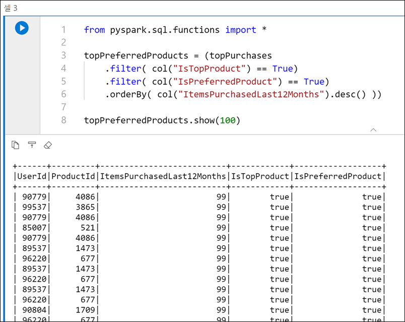

10. 새 코드 셀에서 다음을 실행하여 SQL을 사용해 새 임시 보기를 만듭니다.

    ```sql
    %%sql

    CREATE OR REPLACE TEMPORARY VIEW top_5_products
    AS
        select UserId, ProductId, ItemsPurchasedLast12Months
        from (select *,
                    row_number() over (partition by UserId order by ItemsPurchasedLast12Months desc) as seqnum
            from top_purchases
            ) a
        where seqnum <= 5 and IsTopProduct == true and IsPreferredProduct = true
        order by a.UserId
    ```

    위 쿼리에서는 출력이 반환되지 않습니다. 이 쿼리는 **top_purchases** 임시 보기를 원본으로 사용하며, **row_number() over** 메서드를 적용하여 **ItemsPurchasedLast12Months**가 가장 큰 각 사용자 레코드에 행 번호를 적용합니다. **where** 절이 결과를 필터링하므로 **IsTopProduct**와 **IsPreferredProduct**가 모두 true인 제품이 5개까지만 검색됩니다. 즉, Azure Cosmos DB에 저장되어 있는 사용자 프로필에 따라 각 사용자가 가장 선호하는 제품으로 확인된 _동시에_ 가장 많이 구매한 상위 5개 제품을 확인할 수 있습니다.

11. 새 코드 셀에서 다음을 실행하여 새 데이터 프레임을 만들어 표시합니다. 이 데이터 프레임에는 이전 셀에서 만든 **top_5_products** 임시 보기의 결과가 저장됩니다.

    ```python
    top5Products = sqlContext.table("top_5_products")

    top5Products.show(100)
    ```

    사용자별 상위 5개 선호 제품이 표시되는 다음과 같은 출력을 확인할 수 있습니다.

    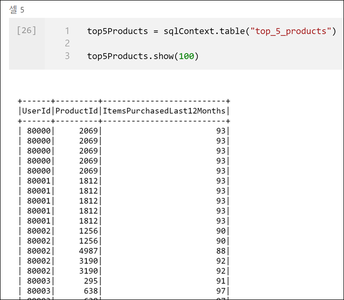

12. 새 코드 셀에서 다음을 실행하여 고객별 상위 선호 제품 수와 상위 5개 선호 제품을 비교합니다.

    ```python
    print('before filter: ', topPreferredProducts.count(), ', after filter: ', top5Products.count())
    ```

    다음과 같은 출력이 표시되어야 합니다.
    
    ```
    before filter:  997817 , after filter:  85015
    ```

13. 이번에는 새 코드 셀에서 다음을 실행하여 고객이 가장 선호하는 동시에 가장 많이 구매한 제품을 기준으로 하여 전체 제품 중 상위 5개 제품을 계산합니다.

    ```python
    top5ProductsOverall = (top5Products.select("ProductId","ItemsPurchasedLast12Months")
        .groupBy("ProductId")
        .agg( sum("ItemsPurchasedLast12Months").alias("Total") )
        .orderBy( col("Total").desc() )
        .limit(5))

    top5ProductsOverall.show()
    ```

    이 셀의 코드는 제품 ID 기준 상위 5개 선호 제품을 그룹화하고 지난 12개월 동안 고객이 구매한 총 항목 수의 합을 계산합니다. 그런 다음 해당 값을 내림차순으로 정렬하고 상위 5개 결과를 반환합니다. 다음과 유사하게 출력될 것입니다.

    ```
    +---------+-----+
    |ProductId|Total|
    +---------+-----+
    |      347| 4523|
    |     4833| 4314|
    |     3459| 4233|
    |     2486| 4135|
    |     2107| 4113|
    +---------+-----+
    ```

14. 파이프라인에서 이 Notebook을 실행해 보겠습니다. 여기서는 Parquet 파일 이름을 지정하는 데 사용할 **runId** 변수 값을 설정하는 매개 변수를 전달합니다. 새 코드 셀에서 다음을 실행합니다.

    ```python
    import uuid

    # Generate random GUID
    runId = uuid.uuid4()
    ```

    위의 코드에 나와 있는 것처럼, Spark에서 제공되는 **uuid** 라이브러리를 사용하여 임의 GUID를 생성했습니다. 파이프라인에서 전달한 매개 변수로 `runId` 변수를 재정의하려고 합니다. 이렇게 하려면 이 셀을 매개 변수 셀로 토글해야 합니다.

15. 셀 위의 미니 도구 모음에서 작업 줄임표 **(...)** 를 선택한 다음 **매개 변수 셀 토글**을 선택합니다.

    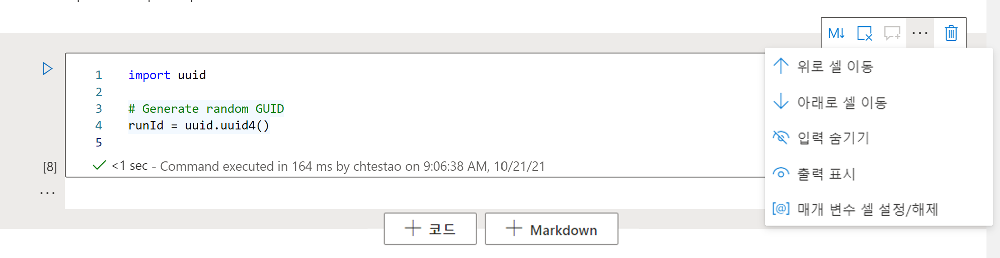

    이 옵션을 토글하면 셀 오른쪽 하단에 **매개 변수**라는 단어가 보입니다. 이는 매개 변수 셀이라는 것을 나타냅니다.

16. 새 코드 셀에 다음 코드를 추가하여 기본 데이터 레이크 계정의 */top5-products/* 경로에서 **runId** 매개 변수를 Parquet 파일 이름으로 사용합니다. 경로에서 ***SUFFIX***를 기본 데이터 레이크의 고유 접미사로 바꿉니다. 이 접미사는 페이지 맨 위의 **셀 1**에서 찾을 수 있습니다. 코드를 업데이트했으면 셀을 실행합니다.

    ```python
    %%pyspark

    top5ProductsOverall.write.parquet('abfss://wwi-02@asadatalakeSUFFIX.dfs.core.windows.net/top5-products/' + str(runId) + '.parquet')
    ```

    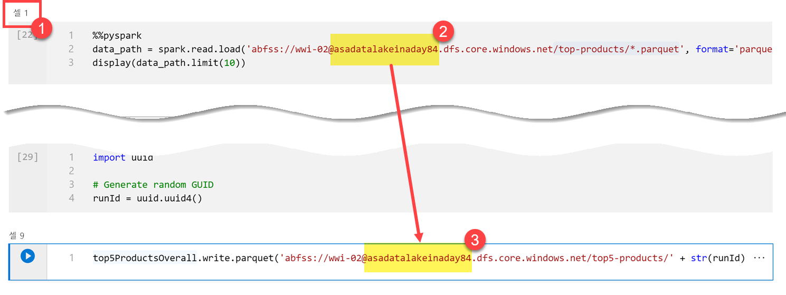

17. 데이터 레이크에 파일이 작성되었는지 확인합니다. **데이터** 허브에서 **연결됨** 탭을 선택합니다. 기본 데이터 레이크 스토리지 계정을 확장하고 **wwi-02** 컨테이너를 선택합니다. **top5-products** 폴더로 이동합니다(필요한 컨테이너의 루트에서 폴더를 새로 고침). 디렉터리에 GUID가 파일 이름으로 지정된 Parquet 파일의 폴더가 표시됩니다.

    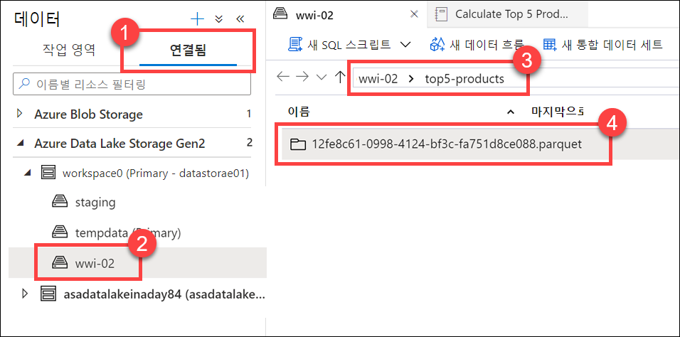

18. Notebook으로 돌아갑니다. Notebook의 오른쪽 상단에서 **세션 중지**를 선택하고, 관련 메시지가 나타날 때 지금 세션을 중지하기를 원한다는 것을 확인합니다. 여기서 세션을 중지하는 이유는, 다음 섹션에서 파이프라인 내에서 Notebook을 실행할 수 있도록 컴퓨팅 리소스를 확보하기 위해서입니다.

    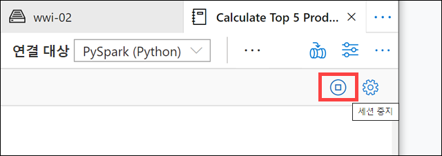

### 작업 2: 파이프라인에 Notebook 추가

Tailwind Traders는 오케스트레이션 프로세스의 일환으로 매핑 데이터 흐름 실행 후에 이 Notebook을 실행하려고 합니다. 이 작업에서는 해당 Notebook을 새 Notebook 활동으로 파이프라인에 추가합니다.

1. **Calculate Top 5 Products** Notebook으로 돌아갑니다.

2. Notebook 오른쪽 위의 **파이프라인에 추가** 단추를 선택하고 **기존 파이프라인**을 선택합니다.

    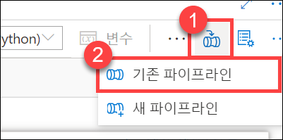

3. **User Profiles to Datalake** 파이프라인을 선택하고 **추가**를 선택합니다.

4. Synapse Studio에서 파이프라인에 Notebook 활동을 추가합니다. **Notebook 활동**이 **데이터 흐름 활동** 오른쪽에 오도록 활동을 다시 정렬합니다. **데이터 흐름 활동**을 선택한 다음 **성공** 활동 파이프라인 연결(**녹색 상자**)을 **Notebook 활동**으로 끕니다.

    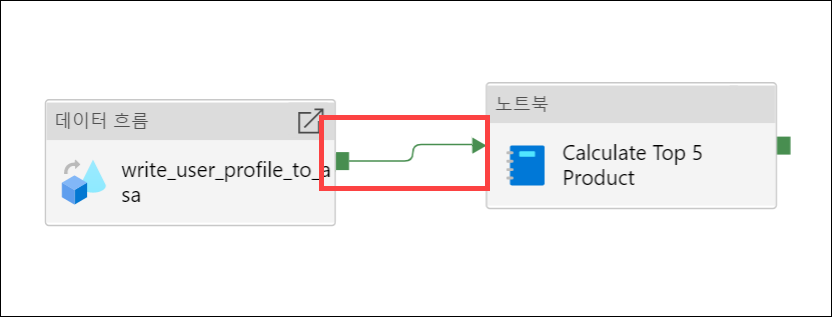

    성공 활동 화살표를 Notebook 활동으로 끌면 데이터 흐름 활동이 정상적으로 실행된 후 Notebook 활동을 실행하라는 명령이 파이프라인에 전송됩니다.

5. **Notebook 활동**을 선택하고 **설정** 탭을 선택한 후 **기본 매개 변수**를 확장하고 **+ 새로 만들기**를 선택합니다. **이름** 필드에 **`runId`** 를 입력합니다. **유형**을 **문자열**로 설정하고 **값**을 **동적 콘텐츠 추가**로 설정합니다.

    

6. **동적 콘텐츠 추가** 창에서 **시스템 변수**를 확장하고 **파이프라인 실행 ID**를 선택합니다. 그러면 동적 콘텐츠 상자에 *@pipeline().RunId*가 추가됩니다. 그런 다음 **확인**을 클릭하여 대화 상자를 닫습니다.

    파이프라인 실행 ID 값은 각 파이프라인 실행에 할당되는 고유 GUID입니다. 여기서는 이 값을 `runId` Notebook 매개 변수로 전달하여 Parquet 파일의 이름으로 사용하겠습니다. 그리고 나면 파이프라인 실행 기록을 확인하여 각 파이프라인 실행용으로 작성된 특정 Parquet 파일을 찾을 수 있습니다.

7. **모두 게시**, **게시**를 차례로 선택하여 변경 내용을 저장합니다.

    

### 작업 3: 업데이트된 파이프라인 실행

> **참고**: 업데이트된 게이트웨이를 실행하는 데 10분 이상 걸릴 수 있습니다.

1. 게시가 완료되면 **트리거 추가**, **지금 트리거**를 차례로 선택하여 업데이트된 파이프라인을 실행합니다.

    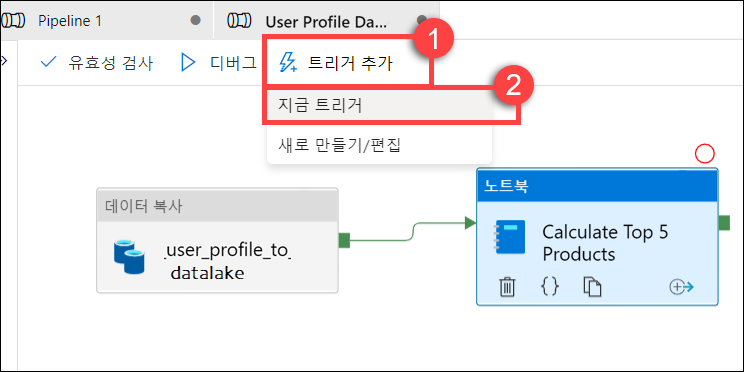

2. **확인**을 선택하여 트리거를 실행합니다.

    

3. **모니터** 허브로 이동합니다.

    

4. **파이프라인 실행**을 선택하고 파이프라인 실행이 정상적으로 완료될 때까지 기다립니다. 보기를 새로 고쳐야 할 수도 있습니다.

    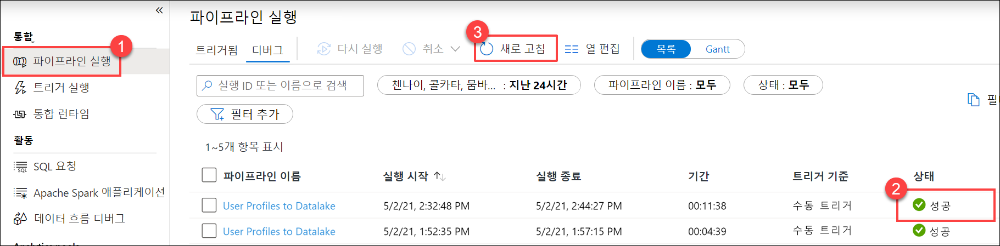

    > Notebook 활동을 추가한 파이프라인 실행이 완료되려면 10분 이상 걸릴 수 있습니다.

5. 파이프라인 이름(**User profiles to Datalake**)을 선택하여 파이프라인 활동 실행을 확인합니다.

6. 이번에는 **데이터 흐름** 활동과 새 **Notebook** 활동이 모두 표시됩니다. **파이프라인 실행 ID** 값을 적어 둡니다. 이 값을 Notebook에서 생성된 Parquet 파일 이름과 비교할 것입니다. **Calculate Top 5 Products** Notebook 이름을 선택하여 해당 세부 정보를 확인합니다.

    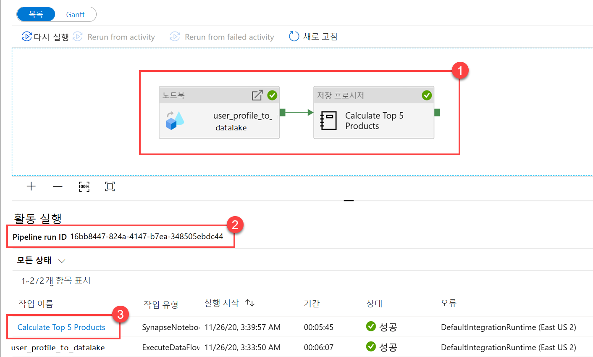

7. Notebook 실행 세부 정보가 표시됩니다. **재생** 단추를 선택하면 **작업** 진행 상황을 확인할 수 있습니다. 아래쪽에서는 다양한 필터 옵션을 사용하여 **진단** 및 **로그**를 확인할 수 있습니다. 특정 단계를 가리키면 지속 시간, 총 작업 수, 데이터 세부 정보 등의 단계 세부 정보를 확인할 수 있습니다. **단계**의 **세부 정보 보기** 링크를 선택하면 해당 세부 정보가 표시됩니다.

    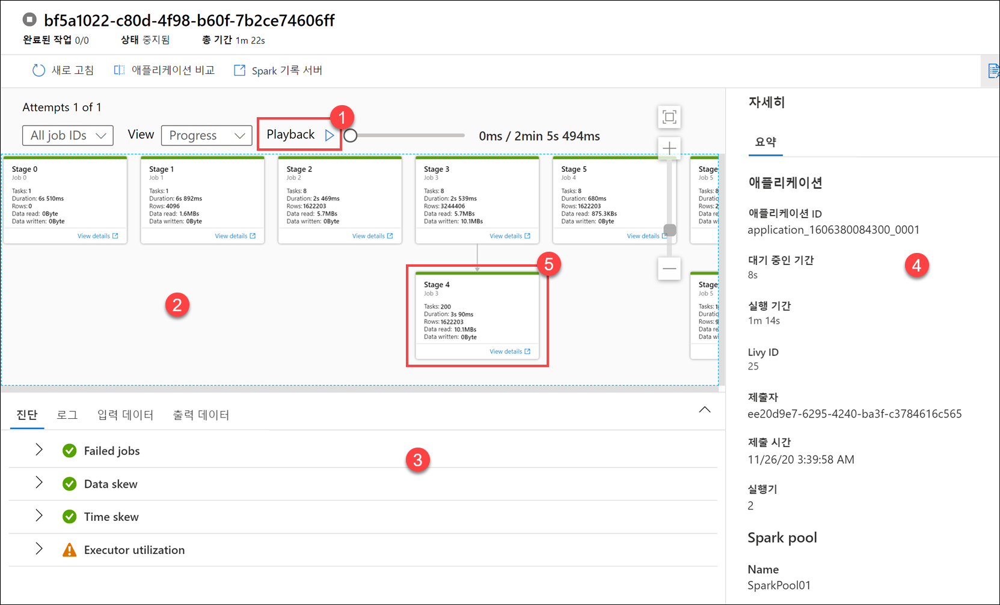

8. Spark 애플리케이션 UI가 새 탭에서 열립니다. 이 탭에서 단계 세부 정보를 확인할 수 있습니다. **DAG 시각화**를 확장하여 단계 세부 정보를 확인합니다.

    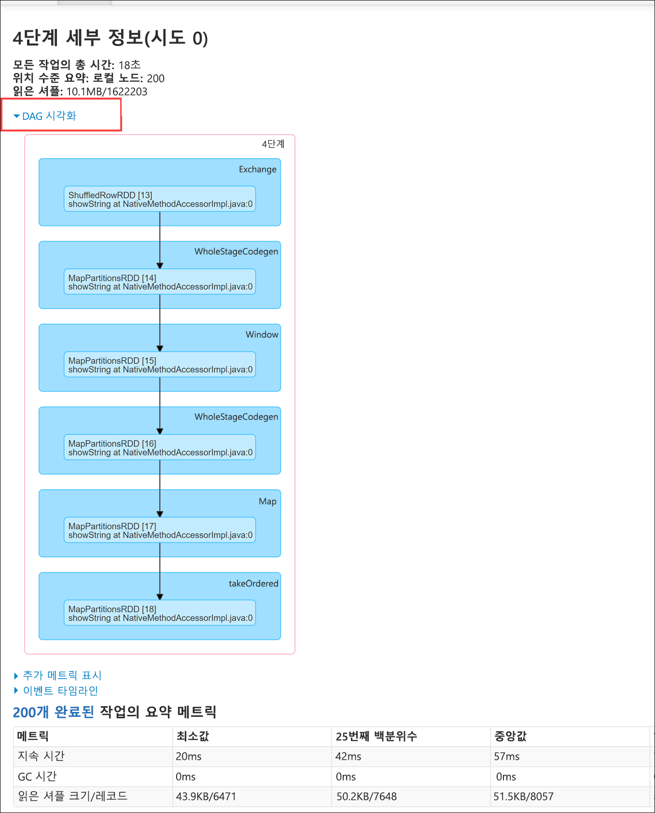

9. Spark 세부 정보 탭을 닫고, Synapse Studio에서 **데이터** 허브로 다시 이동합니다.

    

10. **연결됨** 탭을 선택하고 기본 데이터 레이크 스토리지 계정에서 **wwi-02** 컨테이너를 선택합니다. 그런 다음 **top5-products** 폴더로 이동하여 이름이 **파이프라인 실행 ID**와 일치하는 Parquet 파일용 폴더가 있는지 확인합니다.

    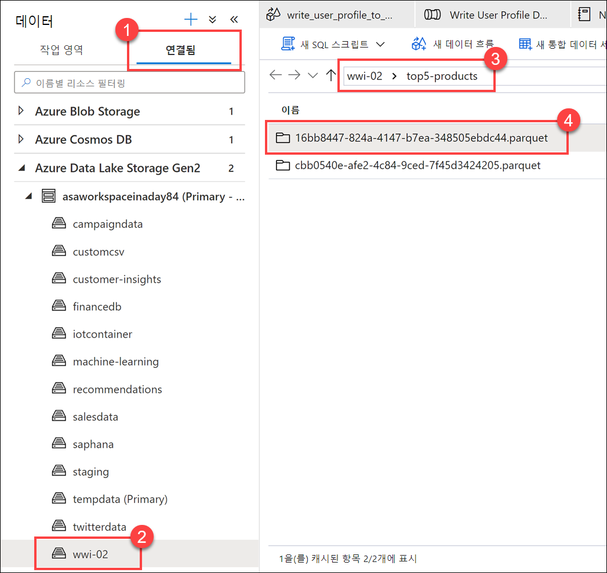

    보시다시피 앞에서 확인한 **파이프라인 실행 ID**와 이름이 일치하는 파일이 있습니다.

    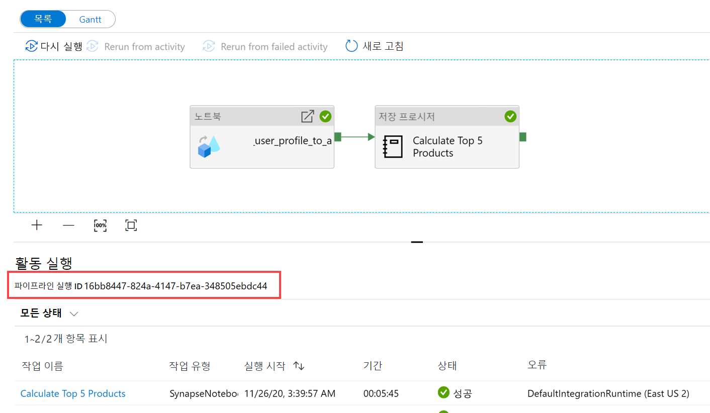

    이 두 값이 일치하는 이유는, Notebook 활동에서 **runId** 매개 변수에 파이프라인 실행 ID를 전달했기 때문입니다.
