---
lab:
    title: 'Azure Synapse Analytics를 통한 엔드투엔드 보안'
    module: '모듈 8'
---

# 랩 8 - Azure Synapse Analytics를 통한 엔드투엔드 보안

이 랩에서는 Synapse Analytics 작업 영역 및 지원 인프라를 보호하는 방법을 알아봅니다. 구체적으로는 SQL Active Directory 관리자를 확인하고, IP 방화벽 규칙을 관리하고, Azure Key Vault를 사용해 secret 을 관리하고, Key Vault 연결된 서비스 및 파이프라인 활동을 통해 이러한 secret 에 액세스합니다. 그런 후에는 전용 SQL 풀 사용 시 열 수준 보안, 행 수준 보안 및 동적 데이터 마스킹을 구현하는 방법을 파악합니다.

이 랩을 마치면 다음과 같은 역량을 갖추게 됩니다.

- Azure Synapse Analytics 지원 인프라 보호
- Azure Synapse Analytics 작업 영역 및 관리되는 서비스 보호
- Azure Synapse Analytics 작업 영역 데이터 보호

이 랩에서는 Azure Synapse Analytics에서 엔드투엔드 보안을 적용하는 과정과 관련된 여러 보안 관련 단계를 설명합니다. 이 랩의 주요 학습 내용은 다음과 같습니다.

1. Azure Key Vault를 활용하여 연결된 서비스용 액세스 키와 암호 등의 중요한 연결 정보를 저장할 수 있습니다. 파이프라인에서도 이러한 정보 저장이 가능합니다.

2. SQL 풀 내에 포함된 데이터를 조사하여 중요한 데이터/기밀 데이터 노출 가능성을 파악할 수 있습니다. 중요한 데이터에 해당되는 열을 확인한 후 열 수준 보안ㄴ을 추가하여 보호할 수 있습니다. 특정 사용자 그룹이 확인할 수 없도록 숨겨야 하는 데이터를 테이블 수준에서 결정한 다음 보안 조건자를 정의하여 해당 테이블에 행 수준 보안(필터)을 적용할 수 있습니다. 원하는 경우 동적 데이터 마스킹을 적용하여 쿼리에서 반환되는 중요한 데이터를 열 단위로 마스킹할 수 있습니다.

## 랩 설정 및 필수 구성 요소

이 랩을 시작하기 전에 **랩 4: *Apache Spark를 사용하여 데이터를 탐색 및 변환한 후 데이터 웨어하우스에 로드***의 설정 단계는 완료해야 합니다.

이 랩은 이전 랩에서 만든 전용 SQL 풀을 사용합니다. 이전 랩의 끝에서 SQL 풀을 일시 중지했을 것이기 때문에 다음 지침을 따라 다시 시작해야 합니다.

1. Azure Synapse Studio(<https://web.azuresynapse.net/>)를 엽니다.
2. **관리** 허브를 선택합니다.
3. 왼쪽 메뉴에서 **SQL 풀**을 선택합니다. **SQLPool01** 전용 SQL 풀이 일시 중지되어 있으면 해당 이름을 커서로 가리키고 **&#9655;** 을 선택합니다.

    

4. 메시지가 표시되면 **다시 시작**을 선택합니다. 풀이 다시 시작되려면 1~2분 정도 걸립니다.
5. 전용 SQL 풀이 다시 시작되는 동안 다음 연습을 계속 진행합니다.

> **중요:** 시작된 후, 전용 SQL 풀은 일시 중지될 때까지 Azure 구독의 크레딧을 소비합니다. 이 랩을 잠시 멈출 경우 또는 이 랩을 완료하지 않기로 결정할 경우, 랩 끝에 있는 지침을 따라 SQL 풀을 일시 중지해야 합니다.

## 연습 1 - Azure Synapse Analytics 지원 인프라 보호

ASA(Azure Synapse Analytics)는 작성 및 관리하는 대다수 리소스의 보안을 처리해 주는 유용한 솔루션입니다. 하지만 ASA를 실행하려면 몇 가지 보안 조치를 취하여 ASA가 사용하는 인프라 보안을 유지해야 합니다. 이 연습에서는 ASA 지원 인프라를 보호하는 단계를 진행합니다.

### 작업 1 - SQL Active Directory 관리자 살펴보기

 SQL Active Directory 관리자는 사용자(기본값) 또는 그룹(모범 사례: 여러 사용자에게 이러한 권한을 제공할 수 있음) 보안 주체일 수 있습니다. SQL Active Directory 관리자에게 할당되는 보안 주체에는 작업 영역에 포함된 SQL 풀 관리 권한이 있습니다.

1. Azure Portal(<https://portal.azure.com>)에서 랩 리소스 그룹으로 이동하여 리소스 목록에서 Synapse 작업 영역을 엽니다(Synapse Studio를 시작하지는 마세요).

2. 왼쪽 메뉴에서 **SQL Active Directory 관리자**를 선택하여 SQL Active Directory 관리자로 등재된 사용자가 사용자인지 아니면 그룹인지를 살펴봅니다.

    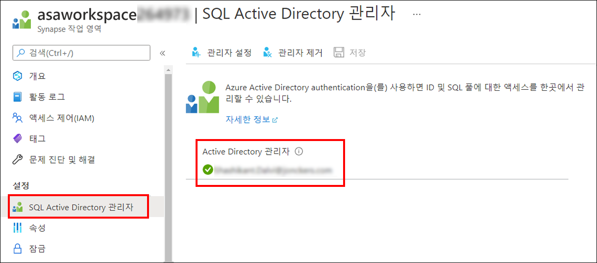

### 작업 2 - IP 방화벽 규칙 관리

모든 기술 시스템에서는 안정적인 인터넷 보안을 구축해야 합니다. 인터넷 위협 벡터를 완화하는 방법 중 하나는, IP 방화벽 규칙을 사용해 Azure Synapse Analytics 작업 영역에 액세스할 수 있는 공용 IP 주소 수를 줄이는 것입니다. 그러면 Azure Synapse Analytics 작업 영역에서 SQL 풀 및 SQL 서버리스 엔드포인트를 비롯하여 작업 영역에 포함된 모든 관리되는 공용 엔드포인트에 동일한 규칙을 위임합니다.

1. Azure Portal에서, Synapse 작업 영역의 블레이드에서 **네트워킹**을 선택합니다.

2. 랩 환경에는 IP 방화벽 규칙 **모두 허용**이 이미 작성되어 있습니다. 특정 IP 주소를 추가하려는 경우에는 작업 표시줄 메뉴에서 **+ 클라이언트 IP 추가**를 선택하면 됩니다(지금은 해당 옵션을 선택하지 않아도 됨).

    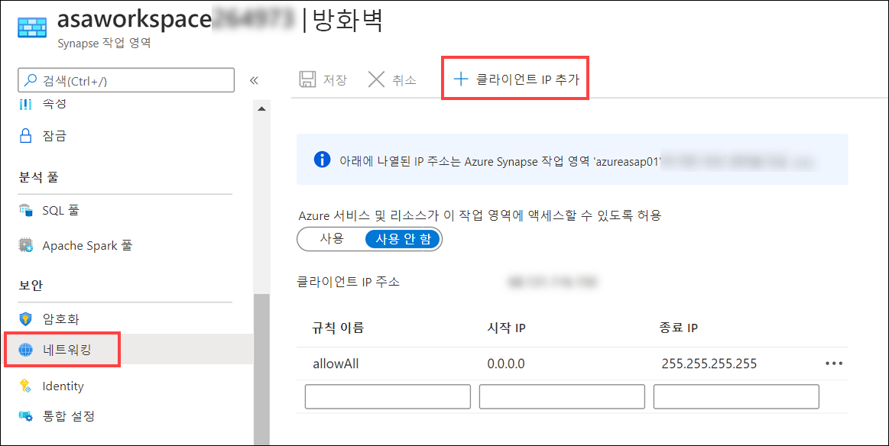

    > **참고**: 로컬 네트워크에서 Synapse에 연결할 때는 특정 포트를 열어야 합니다. Synapse Studio의 기능을 지원하려면 발신 TCP 포트 80, 443, 1143과 UDP 포트 53을 열어야 합니다.

## 연습 2 - Azure Synapse Analytics 작업 영역 및 관리되는 서비스 보호

### 작업 1 - Azure Key Vault를 사용하여 비밀 관리

외부 데이터 원본 및 서비스에 연결할 때는 암호, 액세스 키 등의 중요한 연결 정보를 적절하게 처리해야 합니다. 이러한 유형의 정보는 Azure Key Vault에 저장하는 것이 좋습니다. Azure Key Vault를 활용하면 secret 노출을 방지할 수 있을 뿐 아니라 단일 원본도 제공됩니다. 즉, secret 값을 업데이트해야 하는 경우(예: 스토리지 계정의 액세스 키를 교체하는 경우) 한 곳에서 해당 값을 변경할 수 있으며, 그러면 해당 키를 사용하는 모든 서비스가 새 값을 즉시 끌어옵니다. Azure Key Vault는 FIPS 140-2 규격 256비트 AES 암호화를 사용하여 정보를 투명하게 암호화 및 암호 해독합니다.

1. Azure Portal에서 이 랩용 리소스 그룹을 열고 리소스 목록에서 **키 자격 증명 모음** 리소스를 선택합니다.

    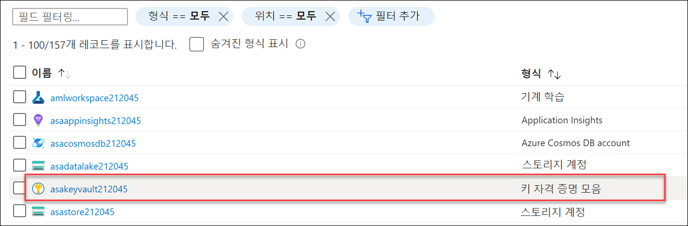

2. 왼쪽 메뉴의 설정에서 **액세스 정책**을 선택합니다.

3. Synapse 작업 영역에 해당하는 MSI(관리 서비스 ID)가 애플리케이션 아래에 이미 표시되어 있으며(이름이 **asaworkspace*xxxxxxx*** 형식인 ID), 비밀 관리 작업 4개가 선택되어 있습니다.

    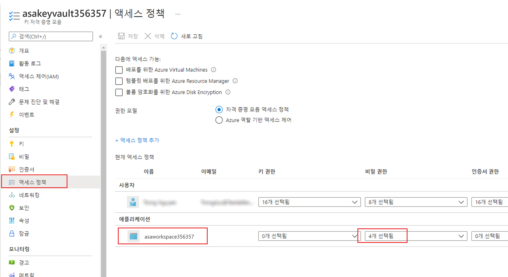

4. **비밀 관리 작업** 아래에서 **4개 선택됨** 드롭다운을 선택하여 **가져오기**(작업 영역에서 Key Vault의 비밀 값을 검색할 수 있는 권한) 및 **나열**(작업 영역에서 비밀을 열거할 수 있는 권한)이 설정되어 있는지 확인합니다.

### 작업 2 - 연결된 서비스를 만들 때 비밀용 Azure Key Vault 사용

Azure Synapse Analytics에서 연결된 서비스는 연결 문자열과 같은 기능을 제공합니다. 즉, Azure Synapse Analytics 연결된 서비스는 Azure Storage 계정, Amazon S3 등 100여 가지 유형의 외부 서비스에 연결하는 기능을 제공합니다. 외부 서비스에 연결할 때는 연결 정보와 관련된 비밀이 거의 항상 제공됩니다. 이러한 비밀을 저장하기에 가장 적합한 위치는 Azure Key Vault입니다. Azure Synapse Analytics에서는 Azure Key Vault의 값을 사용해 모든 연결된 서비스 연결을 구성하는 기능을 제공합니다.

연결된 서비스에서 Azure Key Vault를 활용하려면 먼저 Azure Synapse Analytics에서 키 자격 증명 모음을 연결된 서비스로 추가해야 합니다.

1. Azure Synapse Studio의 왼쪽 메뉴에서 **관리** 허브를 선택합니다.

    

2. **외부 연결**에서 **연결된 서비스**를 선택하여 Key Vault를 가리키는 연결된 서비스가 환경 내에서 만들어졌음을 확인합니다.

    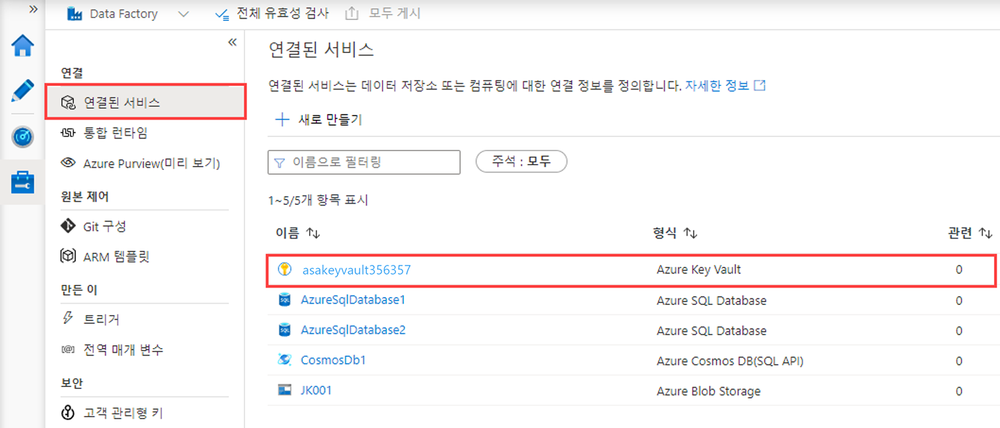

Azure Key Vault가 연결된 서비스로 설정되어 있으므로 새 연결된 서비스를 정의할 때 Azure Key Vault를 활용할 수 있습니다. 연결된 서비스를 새로 정의할 때마다 Azure Key Vault의 비밀을 검색할 수 있습니다. 연결된 서비스 작성 양식에서는 Azure Key Vault 연결된 서비스, 비밀 이름, 특정 비밀 버전(선택 사항)을 선택해야 합니다.

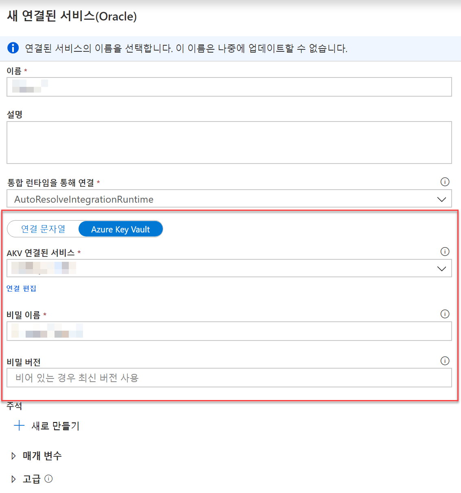

### 작업 3 - 작업 영역 파이프라인 실행 보호

비밀은 파이프라인에 포함하여 Azure Key Vault에 저장하는 것이 좋습니다. 이 작업에서는 웹 활동을 사용해 비밀 값을 검색하여 Azure Key Vault에 비밀이 저장되는 방식을 살펴봅니다. 그리고 이 작업의 후반부에서는 파이프라인에서 웹 활동을 사용하여 Key Vault에서 비밀을 검색하는 과정을 시연합니다.

1. Azure Portal로 돌아갑니다.

2. **asakeyvault*xxxxxxx*** Azure Key Vault 리소스의 블레이드에서 왼쪽 메뉴의 **비밀**을 선택합니다. 그런 다음에 위쪽 도구 모음에서 **+ 생성/가져오기**를 선택합니다.

   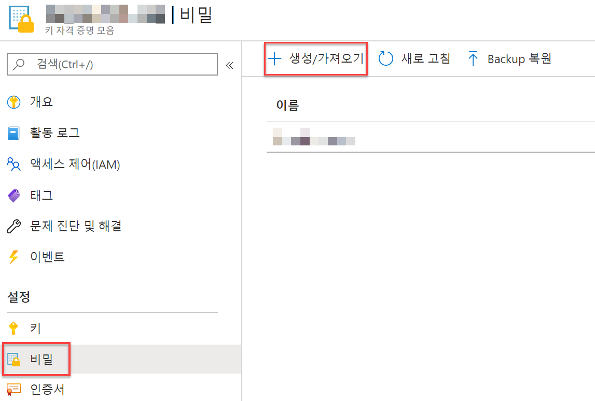

3. 비밀을 만들고 이름을 `PipelineSecret`으로 지정한 후 `IsNotASecret` 값을 할당하고 **만들기** 단추를 선택합니다.

   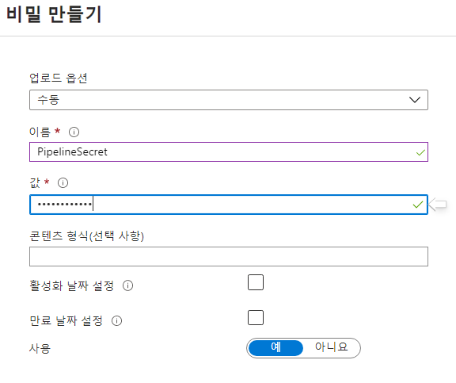

4. 방금 만든 비밀을 열어 현재 버전으로 이동한 후 비밀 식별자 필드의 값을 복사합니다. 이 값을 이후 단계에서 사용할 수 있도록 텍스트 편집기에 저장하거나 클립보드에 복사합니다.

    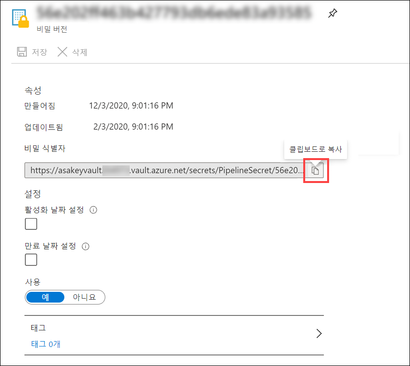

5. Synapse Studio로 다시 전환하여 왼쪽 메뉴에서 **통합** 허브를 선택합니다.

    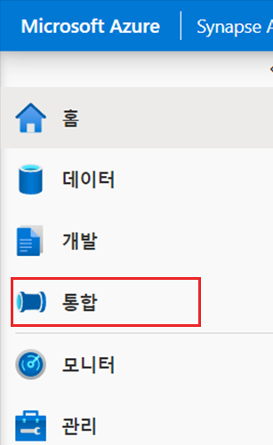

6. **통합** 창의 **+** 메뉴에서 **파이프라인**을 선택합니다.

    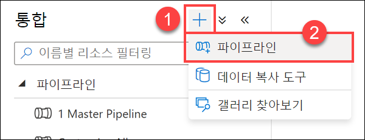

7. **파이프라인** 탭의 **활동** 창에서 **웹**을 검색한 후 **웹** 활동 인스턴스를 디자인 영역으로 끕니다.

    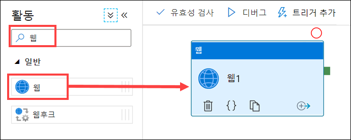

8. **웹1** 웹 활동을 선택하고 **설정** 탭을 선택합니다. 다음과 같이 양식을 작성합니다.

    1. **URL**: 위의 4단계에서 복사한 Key Vault 비밀 식별자 값을 붙여넣은 후 이 값의 끝에 `?api-version=7.1`을 **추가**합니다. 업데이트된 비밀 식별자 값의 예는 `https://asakeyvaultNNNNN.vault.azure.net/secrets/PipelineSecret/f808d4fa99d84861872010f6c8d25c68?api-version=7.1`과 같습니다.
  
    2. **방법**: **가져오기**를 선택합니다.

    3. **고급** 섹션을 확장하고 **인증**에서 **관리 ID**를 선택합니다. Synapse 작업 영역의 관리 서비스 ID용 액세스 정책은 이미 설정되어 있습니다. 따라서 파이프라인 활동이 HTTP 호출을 통해 키 자격 증명 모음에 액세스할 수 있습니다.
  
    4. **리소스**: **<https://vault.azure.net>** 을 입력합니다.

        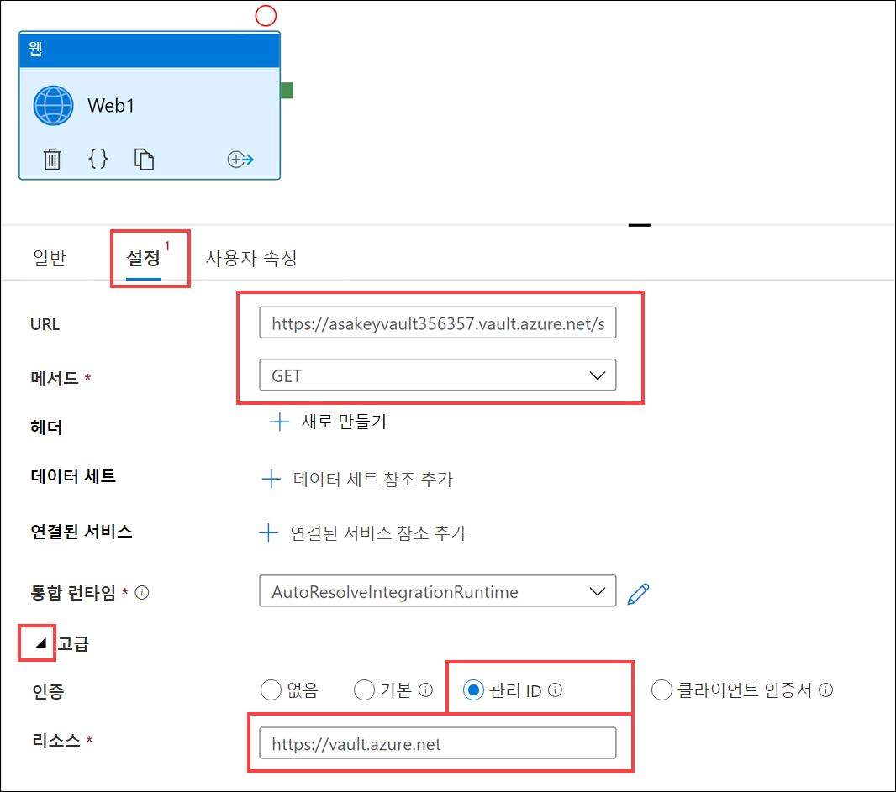

9. 활동 창에서 파이프라인 디자인 화면에 **변수 설정** 활동을 추가합니다.

    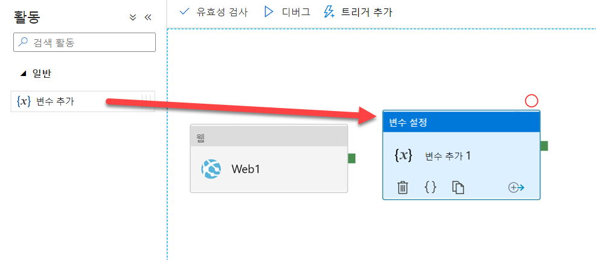

10. 파이프라인의 디자인 화면에서 **웹1** 활동을 선택한 후 **성공** 활동 파이프라인 연결(녹색 상자)을 **변수 설정1** 활동으로 끕니다.

11. 디자이너에서 파이프라인을 선택한 상태로(활동은 선택되어 있지 않아야 함) **변수** 탭을 선택하고 새 **문자열** 매개 변수 **`SecretValue`** 를 추가합니다.

      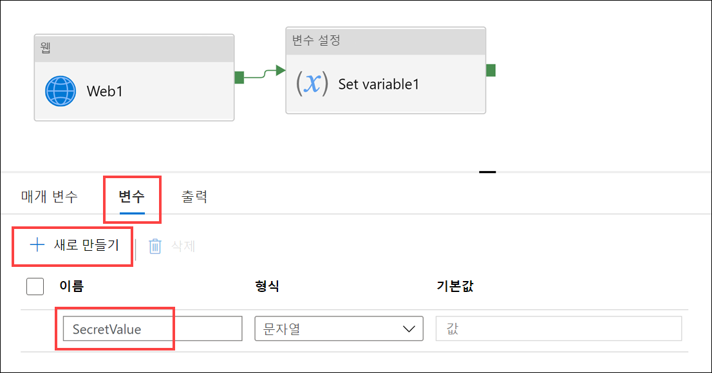

12. **변수 설정1** 활동을 선택하고 **변수**탭을 선택합니다. 다음과 같이 양식을 작성합니다.

    1. **이름**: **SecretValue**(방금 파이프라인에서 만든 변수)를 선택합니다.

    2. **값**: `@activity('Web1').output.value`를 입력합니다.

        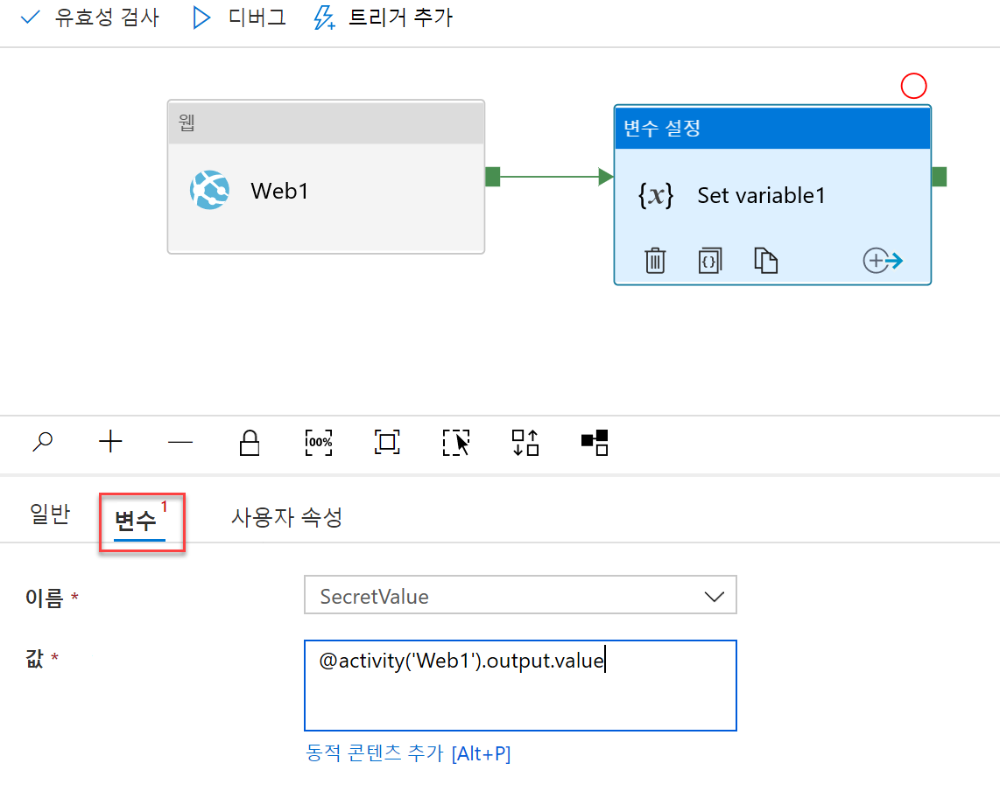

13. 도구 모음 메뉴에서 **디버그**를 선택하여 파이프라인을 디버그합니다. 파이프라인이 실행되면 파이프라인 **출력** 탭에서 두 활동의 입력과 출력을 살펴봅니다.

    

    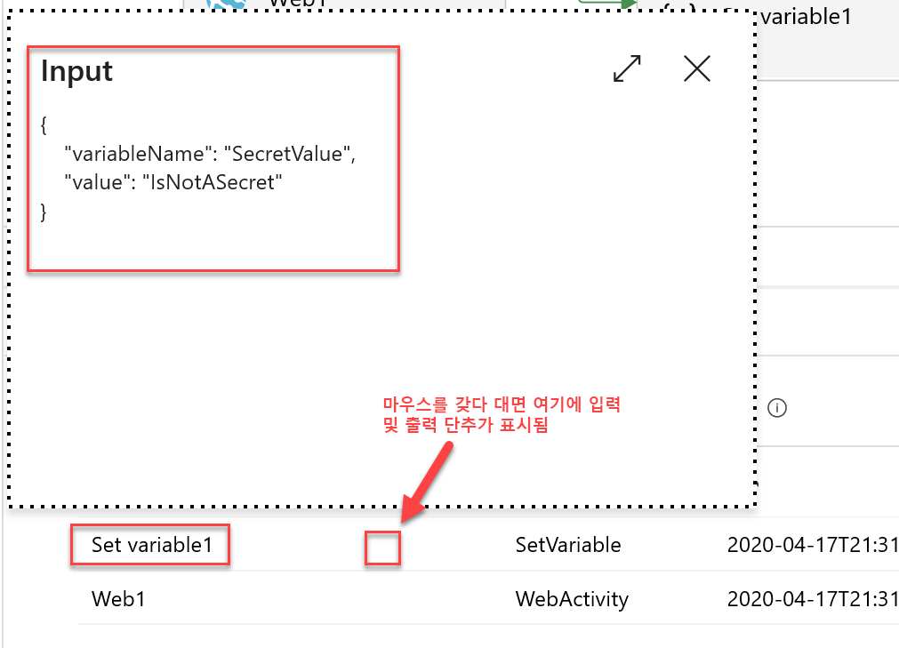

    > **참고**: **웹1** 활동의 **일반** 탭에는 **출력 보안 설정** 체크박스가 있습니다. 이 체크박스를 선택하면 비밀 값을 일반 텍스트로 로깅할 수 없게 됩니다. 예를 들어 파이프라인 실행에서는 키 자격 증명 모음에서 검색된 실제 값이 아닌 마스킹된 값가 표시됩니다. 이 값을 사용하는 모든 활동에서도 **입력 보안 설정** 체크박스가 선택됩니다.

### 작업 4 - Azure Synapse Analytics 전용 SQL 풀 보호

TDE(투명한 데이터 암호화)는 데이터베이스, 로그 파일, 백업 등의 미사용 데이터를 암호화 및 암호 해독할 수 있는 SQL Server의 기능입니다. Synapse Analytics 전용 SQL 풀에서 TDE를 사용할 때는 풀 자체에서 제공하는 기본 제공 대칭 DEK(데이터베이스 암호화 키)가 사용됩니다. TDE 사용 시에는 저장되는 모든 데이터가 디스크에서 암호화됩니다. 데이터 요청이 수신되면 TDE는 해당 데이터를 메모리로 읽어들일 때 페이지 수준에서 암호를 해독합니다. 그리고 데이터를 디스크에 다시 쓰기 전에 메모리 내 데이터를 암호화합니다. TDE라는 이름에서도 확인할 수 있듯이, 이 과정은 애플리케이션 코드에 영향을 주지 않고 '투명하게' 진행됩니다. Synapse Analytics를 통해 전용 SQL 풀을 만들 때는 투명한 데이터 암호화가 사용하도록 설정되지 않습니다. 이 작업에서는 먼저 해당 기능을 사용하도록 설정하는 방법을 살펴봅니다.

1. **Azure Portal**에서 리소스 그룹을 열고 **SqlPool01** 전용 SQL 풀 리소스를 찾아서 엽니다.

    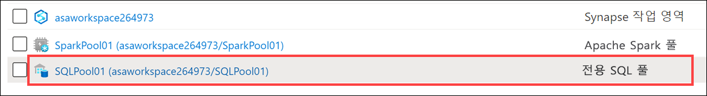

2. **SQL 풀** 리소스 블레이드의 왼쪽 메뉴에서 **투명한 데이터 암호화**를 선택합니다. 데이터 암호화를 활성화하지는 **마세요**.

   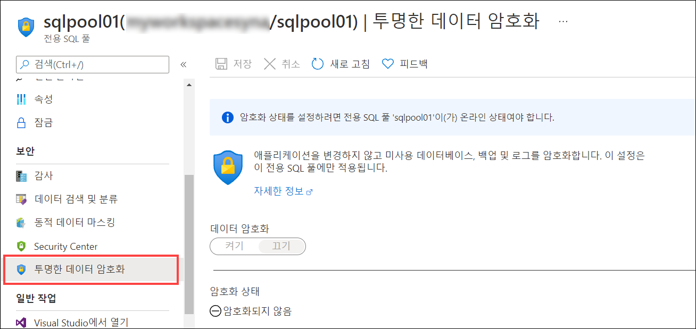

    이 옵션은 기본적으로 비활성화되어 있습니다. 이 전용 SQL 풀에서 데이터 암호화를 사용하도록 설정하면 TDE가 적용되는 몇 분 동안 풀이 오프라인 상태로 설정됩니다.

## 연습 3 - Azure Synapse Analytics 작업 영역 데이터 보호

### 작업 1 - 열 수준 보안

민감한 정보가 들어 있는 데이터 열을 식별하는 것이 중요합니다. 중요한 정보 유형으로는 사회 보장 번호, 이메일 주소, 신용 카드 번호, 총 자산액 등이 있습니다. Azure Synapse Analytics에서는 사용자나 역할이 특정 열에 대한 권한을 선택할 수 없도록 하는 권한을 정의할 수 있습니다.

1. **Azure Synapse Studio**의 **개발** 허브에서 **SQL 스크립트** 섹션을 확장하고 **열 수준 보안**을 선택합니다.
2. 도구 모음에서 **SQLPool01** 데이터베이스에 연결합니다.
3. 쿼리 창에서 **각 단계를 개별적으로 실행**합니다. 이렇게 하려면 쿼리 창의 단계 내 문을 강조 표시하고 도구 모음에서 **실행** 단추를 선택합니다(**F5** 키를 눌러도 됨).
4. 스크립트 탭을 닫습니다. 관련 메시지가 나타나면 **모든 변경 내용 취소**를 선택합니다.

### 작업 2 - 행 수준 보안

1. **개발** 허브의 **SQL 스크립트** 섹션에서 **행 수준 보안**을 선택합니다.
2. 도구 모음에서 **SQLPool01** 데이터베이스에 연결합니다.
3. 쿼리 창에서 **각 단계를 개별적으로 실행**합니다. 이렇게 하려면 쿼리 창의 단계에 대해 문을 강조 표시하고 도구 모음에서 **실행** 단추를 선택합니다(**F5** 키를 눌러도 됨).
4. 스크립트 탭을 닫습니다. 관련 메시지가 나타나면 **모든 변경 내용 취소**를 선택합니다.

### 작업 3 - 동적 데이터 마스킹

1. **개발** 허브의 **SQL 스크립트** 섹션에서 **동적 데이터 마스킹**을 선택합니다.
2. 도구 모음에서 **SQLPool01** 데이터베이스에 연결합니다.
3. 쿼리 창에서 **각 단계를 개별적으로 실행**합니다. 이렇게 하려면 쿼리 창의 단계에 대해 문을 강조 표시하고 도구 모음에서 **실행** 단추를 선택합니다(**F5** 키를 눌러도 됨).
4. 스크립트 탭을 닫습니다. 관련 메시지가 나타나면 **모든 변경 내용 취소**를 선택합니다.

## 중요: SQL 풀 일시 중지

다음 단계를 완료하여 더 이상 필요없는 리소스를 정리할 수 있습니다.

1. Synapse Studio에서 **관리** 허브를 선택합니다.
2. 왼쪽 메뉴에서 **SQL 풀**을 선택합니다. **SQLPool01** 전용 SQL 풀을 커서로 가리키고 다음을 선택합니다. **||**.

    

3. 메시지가 표시되면 **일시 중지**를 선택합니다.

## 참조

- [IP 방화벽](https://docs.microsoft.com/azure/synapse-analytics/security/synapse-workspace-ip-firewall)
- [Synapse 작업 영역 관리 ID](https://docs.microsoft.com/azure/synapse-analytics/security/synapse-workspace-managed-identity)
- [Synapse 관리형 VNet](https://docs.microsoft.com/azure/synapse-analytics/security/synapse-workspace-managed-vnet)
- [Synapse 관리형 프라이빗 엔드포인트](https://docs.microsoft.com/azure/synapse-analytics/security/synapse-workspace-managed-private-endpoints)
- [Synapse 작업 영역 보호](https://docs.microsoft.com/azure/synapse-analytics/security/how-to-set-up-access-control)
- [Private Link를 사용하여 Synapse 작업 영역에 연결](https://docs.microsoft.com/azure/synapse-analytics/security/how-to-connect-to-workspace-with-private-links)
- [데이터 원본용 관리형 프라이빗 엔드포인트 만들기](https://docs.microsoft.com/azure/synapse-analytics/security/how-to-create-managed-private-endpoints)
- [작업 영역 관리 ID에 권한 부여](https://docs.microsoft.com/azure/synapse-analytics/security/how-to-grant-workspace-managed-identity-permissions)

## 관련 자료

- [작업 영역, 데이터 및 파이프라인에 대한 액세스 관리](https://docs.microsoft.com/azure/synapse-analytics/sql/access-control)
- [Apache Spark를 사용하여 분석](https://docs.microsoft.com/azure/synapse-analytics/get-started-analyze-spark)
- [Power BI를 사용하여 데이터 시각화](https://docs.microsoft.com/azure/synapse-analytics/get-started-visualize-power-bi)
- [SQL 주문형에 대한 스토리지 계정 액세스 제어](https://docs.microsoft.com/azure/synapse-analytics/sql/develop-storage-files-storage-access-control)
