---
lab:
    title: 'Stream Analytics를 사용하여 실시간 스트림 처리'
    module: '모듈 10'
---

# 랩 10 - Stream Analytics를 사용하여 실시간 스트림 처리

이 랩에서는 Azure Stream Analytics를 사용하여 스트리밍 데이터를 처리하는 방법을 알아봅니다. 구체적으로는 Event Hubs에 차량 원격 분석 데이터를 수집한 다음 Azure Stream Analytics의 여러 창 기능을 사용하여 실시간으로 해당 데이터를 처리합니다. 그 후에 Azure Synapse Analytics로 데이터를 출력합니다. 그리고 마지막으로는 처리량을 높이기 위해 Stream Analytics 작업 크기를 조정하는 방법을 알아봅니다.

이 랩을 마치면 다음과 같은 역량을 갖추게 됩니다.

- Stream Analytics를 사용하여 Event Hubs에서 실시간 데이터 처리
- Stream Analytics 창 기능을 사용하여 집계를 작성한 다음 Synapse Analytics로 출력
- 분할을 통해 처리량을 높이도록 Azure Stream Analytics 작업 크기 조정
- 병렬 처리 최적화를 위해 스트림 입력 다시 분할

## 기술 개요

### Azure Stream Analytics

다양한 연결된 디바이스 및 센서에서 생성되는 데이터가 갈 수록 늘어남에 따라, 이 데이터를 실시간에 가깝게 실행 가능한 인사이트 및 예측 정보로 변환하는 것은 이제 운영상 불가피한 일입니다. 실시간 애플리케이션 아키텍처와 원활하게 통합되는 [Azure Stream Analytics](https://docs.microsoft.com/azure/stream-analytics/stream-analytics-introduction)는 데이터의 양에 관계없이 데이터에 대한 효율적인 실시간 분석을 지원합니다.

Azure Stream Analytics를 사용하면 대규모 병렬 CEP(복합 이벤트 처리) 파이프라인을 간편하게 개발할 수 있습니다. 즉, Azure Stream Analytics 내에 포함되어 있는 임시 논리 지원 기능을 통해 매우 단순한 선언적 [SQL 형식 언어](https://docs.microsoft.com/stream-analytics-query/stream-analytics-query-language-reference)를 사용하여 유용한 실시간 분석 솔루션을 작성할 수 있습니다. 그리고 광범위한 [즉시 사용 가능 커넥터](https://docs.microsoft.com/azure/stream-analytics/stream-analytics-define-outputs), 고급 디버깅 및 작업 모니터링 기능을 활용하면 솔루션 개발에 필요한 개발자 기술을 대폭 줄여 비용도 절약할 수 있습니다. 뿐만 아니라, Azure Stream Analytics에서는 [JavaScript 사용자 정의 함수](https://docs.microsoft.com/azure/stream-analytics/stream-analytics-javascript-user-defined-functions)를 사용하는 사용자 지정 코드가 지원되므로 SQL로 작성된 스트리밍 논리를 추가로 확장할 수 있습니다.

인프라, 서버, 가상 머신, 클러스터 등을 관리할 필요가 없는 Azure Stream Analytics는 몇 초만에 손쉽게 사용을 시작할 수 있습니다. 어떤 작업에서든 스트리밍 단위 1개~수백 개를 추가하여 [처리 기능을 즉시 스케일 아웃](https://docs.microsoft.com/azure/stream-analytics/stream-analytics-streaming-unit-consumption)할 수 있습니다. 작업당 사용하는 처리 단위에 해당하는 요금만 결제하면 됩니다.

[이벤트 배달이 보장](https://docs.microsoft.com/stream-analytics-query/event-delivery-guarantees-azure-stream-analytics)되며 가용성 99.9%의 엔터프라이즈급 SLA가 제공되는 Azure Stream Analytics는 중요 업무용 워크로드에 적합한 솔루션입니다. 또한 자동화된 검사점이 제공되므로 작업에서 내결함성을 유지할 수 있으며, 데이터 손실 없이 중단된 작업을 빠르게 다시 시작할 수 있습니다.

Azure Stream Analytics를 사용하면 Power BI를 통해 실시간 대시보드를 빠르게 작성하여 라이브 명령 및 제어 보기를 활용할 수 있습니다. [실시간 대시보드](https://docs.microsoft.com/azure/stream-analytics/stream-analytics-power-bi-dashboard)에서는 라이브 데이터를 유용한 인사이트를 제공하는 실행 가능한 시각적 개체로 변환할 수 있으며 가장 중요한 정보를 중점적으로 파악할 수 있습니다.

### Azure Event Hubs

초당 수백만 개의 이벤트를 수집할 수 있는 빅 데이터 파이프라인인 [Azure Event Hubs](https://docs.microsoft.com/azure/event-hubs/event-hubs-about)에서는 HTTPS, AMQP, websocket을 통한 AMQP, Kafka 등의 표준 프로토콜을 사용하여 원격 분석 및 이벤트 스트림 데이터 캡처, 보존, 재생을 원활하게 진행할 수 있습니다. 여러 원본에서 데이터를 동시에 수신할 수 있으며, 최대 20개 소비자 그룹에서 애플리케이션을 통해 원하는 속도로 전체 이벤트 허브를 독립적으로 읽을 수 있습니다.

## 시나리오 개요

차량 원격 정보를 수집 중인 Contoso Auto는 Event Hubs를 사용하여 원시 형식 데이터를 빠르게 수집 및 저장한 다음 실시간에 가깝게 처리하려고 합니다. 그리고 최종적으로는 처리된 데이터가 수신되면 새 데이터를 반영하여 자동 업데이트되는 대시보드를 만들려고 합니다. 이 대시보드에서는 엔진 과열, 비정상적 유압, 공격적 운전 등의 검색된 변칙을 나타내는 다양한 시각화를 확인하고자 합니다. 지도 등의 구성 요소를 사용하여 도시 내에서 발생하는 변칙을 표시하고, 이러한 정보를 명확하게 보여 주는 다양한 차트와 그래프도 사용할 예정입니다.

이 환경에서는 Azure Event Hubs를 사용해 차량 원격 분석 스트리밍 데이터를 수집합니다. 이렇게 수집된 데이터는 Event Hubs, Azure Stream Analytics 및 Azure Synapse Analytics에서 실시간에 가깝게 작성되는 분석 파이프라인을 실행하는 데 사용됩니다. Azure Stream Analytics가 Event Hubs에서 차량 센서 데이터를 추출하고 특정 기간의 데이터 집계를 수행합니다. 그런 다음 데이터 분석을 위해 Azure Synapse Analytics에 집계된 데이터를 전송합니다. 그리고 차량 원격 분석 데이터 생성기를 사용해 Event Hubs에 차량 원격 분석 데이터를 전송합니다.

## 랩 설정 및 필수 구성 요소

이 랩을 시작하기 전에 **랩 4: *Apache Spark를 사용하여 데이터를 탐색 및 변환한 후 데이터 웨어하우스에 로드***의 설정 단계는 완료해야 합니다.

이 랩은 이전 랩에서 만든 전용 SQL 풀을 사용합니다. 이전 랩의 끝에서 SQL 풀을 일시 중지했을 것이기 때문에 다음 지침을 따라 다시 시작해야 합니다.

1. Azure Synapse Studio(<https://web.azuresynapse.net/>)를 엽니다.
2. **관리** 허브를 선택합니다.
3. 왼쪽 메뉴에서 **SQL 풀**을 선택합니다. **SQLPool01** 전용 SQL 풀이 일시 중지되어 있으면 해당 이름을 커서로 가리키고 **&#9655;** 을 선택합니다.

    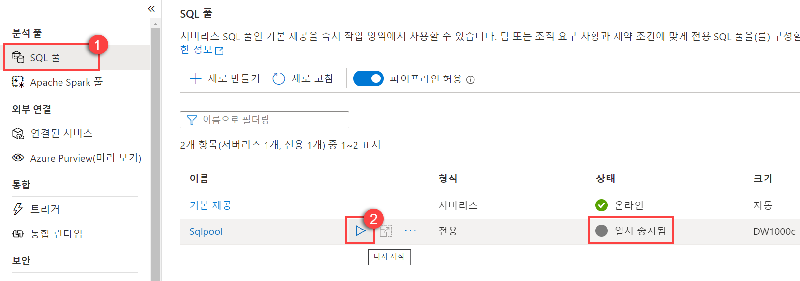

4. 메시지가 표시되면 **다시 시작**을 선택합니다. 풀이 다시 시작되려면 1~2분 정도 걸립니다.
5. 전용 SQL 풀이 다시 시작되는 동안 다음 연습을 계속 진행합니다.

> **중요:** 시작된 후, 전용 SQL 풀은 일시 중지될 때까지 Azure 구독의 크레딧을 소비합니다. 이 랩을 잠시 멈출 경우 또는 이 랩을 완료하지 않기로 결정할 경우, 랩 끝에 있는 지침을 따라 SQL 풀을 일시 중지해야 합니다.

## 연습 1 - 서비스 구성

Azure Event Hubs는 초당 이벤트 수백만 개를 수신하고 처리할 수 있는 빅 데이터 스트리밍 플랫폼 및 이벤트 수집 서비스입니다. 여기서는 Azure Event Hubs를 사용하여 차량 원격 분석 데이터를 임시로 저장합니다. 이렇게 저장된 데이터는 실시간 대시보드로 전송할 수 있도록 처리됩니다. 데이터가 Event Hubs로 전송되면 Azure Stream Analytics가 데이터를 쿼리하여 집계를 적용하고 변칙에 태그를 적용합니다. 그런 다음 Azure Synapse Analytics 및 Power BI에 해당 데이터를 전송합니다.

### 작업 1: Event Hubs 구성

이 작업에서는 제공된 Event Hubs 네임스페이스 내에서 새 이벤트 허브를 만들고 구성합니다. 해당 이벤트 허브는 나중에 작성할 Azure 함수를 통해 처리 및 보강된 차량 원격 분석을 캡처하는 데 사용됩니다.

1. [Azure Portal](https://portal.azure.com)로 이동합니다.

2. 왼쪽 메뉴에서 **리소스 그룹**을 선택합니다. 그런 다음 **data-engineering-synapse-*xxxxxxx*** 리소스 그룹을 선택합니다.

3. **eventhub*xxxxxxx*** Event Hubs 네임스페이스를 선택합니다.

    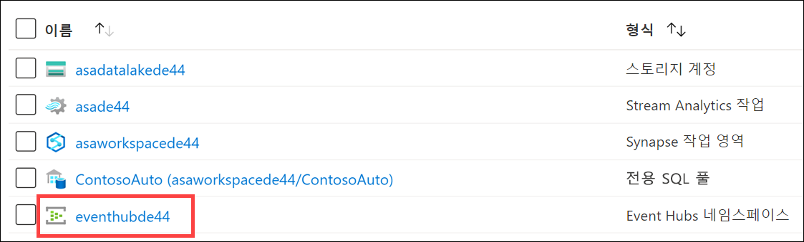

4. Event Hubs 네임스페이스 블레이드의 왼쪽 메뉴 내에서 **Event Hubs**를 선택합니다.

    

5. **telemetry** 이벤트 허브를 선택합니다.

    

6. 왼쪽 메뉴에서 **공유 액세스 제어**를 선택합니다.

    

7. 위쪽 도구 모음에서 **+ 추가**를 선택하여 새 공유 액세스 정책을 만듭니다.

    

8. **SAS 정책 추가** 블레이드에서 다음 항목을 구성합니다.

    - **이름:** `Read`
    - **관리:** 선택 취소됨
    - **보내기:** 선택 취소됨
    - **수신 대기:** 선택됨

        

        > 이벤트 읽기, 쓰기, 관리용으로 각기 별도의 정책을 만드는 것이 좋습니다. 이렇게 하면 최소 권한 원칙에 따라 서비스와 애플리케이션의 권한 없는 작업 수행을 방지할 수 있습니다.

9. 값을 모두 입력한 후 양식 아래쪽의 **만들기**를 선택합니다.

10. 위쪽 도구 모음에서 **+ 추가**를 선택하여 두 번째 새 공유 액세스 정책을 만듭니다.

    

11. **SAS 정책 추가** 블레이드에서 다음 항목을 구성합니다.

    - **이름:** `Write`
    - **관리:** 선택 취소됨
    - **보내기:** 선택됨
    - **수신 대기:** 선택 취소됨

        

12. 값을 모두 입력한 후 양식 아래쪽의 **만들기**를 선택합니다.

13. 목록에서 **쓰기** 정책을 선택합니다. 필드 오른쪽의 복사 단추를 선택하여 **연결 문자열 - 기본 키** 값을 복사합니다. 나중에 사용할 수 있도록 메모장 또는 유사한 텍스트 편집기에 이 값을 저장합니다.

    

### 작업 2: Synapse Analytics 구성

Azure Synapse는 SQL 데이터 웨어하우징, 빅 데이터 분석 및 데이터 통합 기능이 환경 하나에 통합되어 있는 엔드투엔드 분석 플랫폼입니다. 사용자는 이 플랫폼에서 모든 데이터에 빠르게 액세스하여 인사이트를 파악할 수 있으므로 성능과 확장성을 업계 최고 수준으로 대폭 개선할 수 있습니다.

이 작업에서는 Synapse 전용 SQL 풀에 테이블을 만듭니다. Event Hubs에서 수집한 차량 원격 분석을 처리하는 Stream Analytics 작업에서 제공되는 집계 차량 데이터를 이 테이블에 저장합니다.

1. Azure Synapse Studio에서 **데이터** 허브를 선택합니다.

    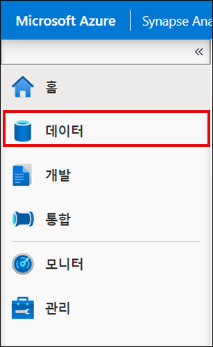

2. **작업 영역** 탭을 선택하고 **데이터베이스**를 확장한 다음 **SQLPool01**을 마우스 오른쪽 단추로 클릭합니다. 그런 다음에 **새 SQL 스크립트**, **빈 스크립트**를 차례로 선택합니다.

    

3. 스크립트가 **SQLPool01**에 연결되어 있는지 확인한 후 스크립트를 다음 코드로 바꾸고 **실행**을 선택하여 새 테이블을 만듭니다.

    ```sql
    CREATE TABLE dbo.VehicleAverages
    ( 
        [AverageEngineTemperature] [float] NOT  NULL,
        [AverageSpeed] [float] NOT  NULL,
        [Snapshot] [datetime] NOT  NULL
    )
    WITH
    (
        DISTRIBUTION = ROUND_ROBIN,
        CLUSTERED COLUMNSTORE INDEX
    )
    GO
    ```

    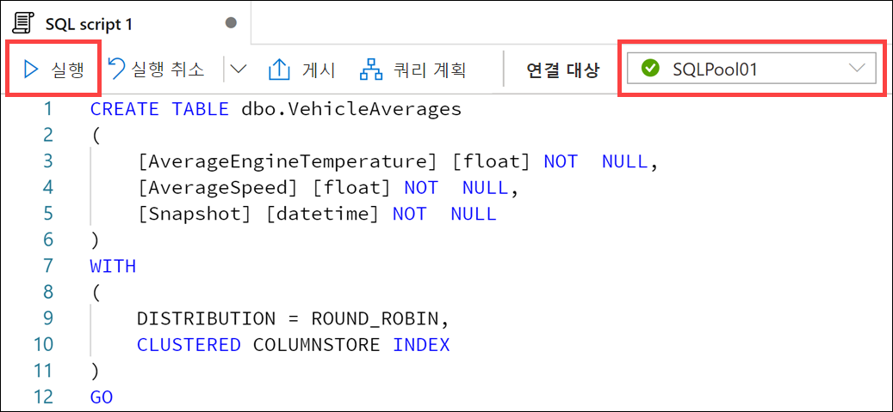

### 작업 3: Stream Analytics 구성

Azure Stream Analytics는 디바이스에서 대량의 데이터 스트리밍을 검사할 수 있는 이벤트 처리 엔진입니다. 들어오는 데이터는 장치, 센서, 웹 사이트, 소셜 미디어 피드, 애플리케이션 등에서 수집할 수 있습니다. 또한 데이터 스트림에서 정보 추출, 패턴 식별 및 관계도 지원합니다. 그런 다음 이러한 패턴을 사용하여 경고 만들기, 보고 도구에 정보를 피드하거나 나중에 사용할 수 있도록 저장하는 등의 다른 작업 다운스트림을 트리거할 수 있습니다.

이 작업에서는 원본으로 만든 이벤트 허브를 사용하도록 Stream Analytics를 구성하고 해당 데이터를 쿼리 및 분석합니다. 그런 다음 보고용으로 Power Bi에 해당 데이터를 전송하고, 집계된 데이터를 Azure Synapse Analytics에 전송합니다.

1. Azure Portal의 **data-engineering-synapse-*xxxxxxx*** 리소스 그룹에서 **as*xxxxxxx*** Stream Analytics 작업을 선택합니다.

    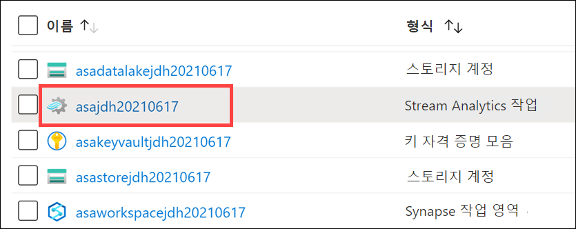

2. Stream Analytics 작업 내의 왼쪽 메뉴에서 **스토리지 계정 설정**을 선택한 후 **스토리지 계정 추가**를 선택합니다. 여기서는 출력 중 하나로 Synapse Analytics를 사용할 것이므로 먼저 작업 스토리지 계정을 구성해야 합니다.

    

3. **스토리지 계정 설정** 양식에서 다음 항목을 구성합니다.

   - **구독에서 스토리지 계정을 선택합니다.** 선택됨.
   - **구독:** 이 랩에 사용 중인 구독이 선택되어 있는지 확인합니다.
   - **스토리지 계정:** 스토리지 계정 **asadatalake*xxxxxxx***를 선택합니다.
   - **인증 모드:** "연결 문자열"을 선택합니다.

        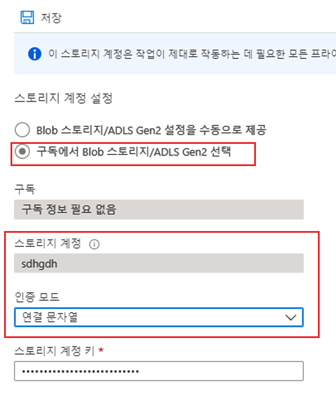

4. 메시지가 표시되면 **저장**, **예**를 차례로 선택하여 스토리지 계정 설정을 저장합니다.

5. Stream Analytics 작업 내의 왼쪽 메뉴 내에서 **입력**을 선택합니다.

    

6. 위쪽 도구 모음에서 **+ 스트림 입력 추가**를 선택한 다음 **이벤트 허브**를 선택하여 새 이벤트 허브 입력을 만듭니다.

    

7. **새 입력** 블레이드에서 다음 항목을 구성합니다.

    - **이름:** `eventhub`
    - **구독에서 이벤트 허브를 선택합니다.** 선택됨
    - **구독:** 이 랩에 사용 중인 구독이 선택되어 있는지 확인합니다.
    - **이벤트 허브 네임스페이스:** **eventhub*xxxxxxx*** Event Hub 네임스페이스를 선택합니다.
    - **이벤트 허브 이름:** **기존 항목 사용**을 선택하고 앞에서 만든 **원격 분석**을 선택합니다.
    - **이벤트 허브 소비자 그룹:** **기존 항목 사용**을 선택하고 **$Default**를 선택합니다.
    - **인증 모드:** **연결 문자열**을 선택합니다.
    - **이벤트 허브 정책 이름:** **기존 항목 사용**을 선택하고 **읽기**를 선택합니다.
    - 나머지 값은 모두 기본값을 그대로 유지합니다.

        

8. 값을 모두 입력한 후 양식 아래쪽의 **저장**을 선택합니다.

9. Stream Analytics 작업 블레이드 내의 왼쪽 메뉴 내에서 **출력**을 선택합니다.

    

10. 위쪽 도구 모음에서 **+ 추가**를 선택한 다음 **Azure Synapse Analytics**를 선택하여 새 Synapse Analytics 출력을 만듭니다.

    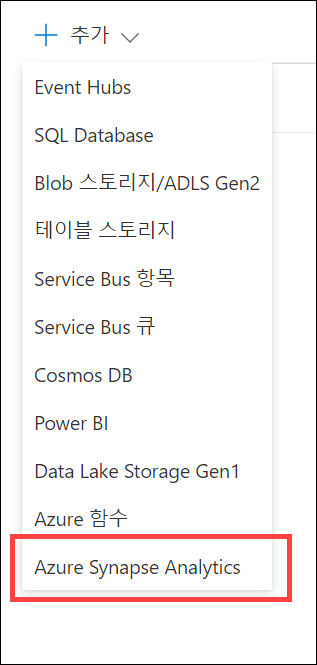

11. **새 출력** 블레이드에서 다음 항목을 구성합니다.

    - **출력 별칭:** `synapse`
    - **구독에서 Azure Synapse Analytics를 선택합니다.** 선택됨.
    - **구독:** 이 랩에 사용 중인 구독을 선택합니다.
    - **데이터베이스:** **SQLPool01**을 선택합니다. **서버 이름** 아래에 정확한 Synapse 작업 영역 이름이 표시되어 있는지 확인합니다.
    - **인증 모드:** **연결 문자열**을 선택합니다.
    - **사용자 이름:** `asa.sql.admin`
    - **암호:** 랩 환경 배포 시 입력한 SQL 관리자 암호 값 또는 호스트된 랩 환경의 일부로 제공된 암호를 입력합니다. SQL 관리자 사용자 이름이 확실치 않으면 Azure 리소스 그룹에서 Synapse 작업 영역으로 이동합니다. SQL 관리자 사용자 이름이 개요 창에 표시됩니다.
    - **서버 이름**: asaworkspace*xxxxxxx*
    - **테이블:** `dbo.VehicleAverages`

        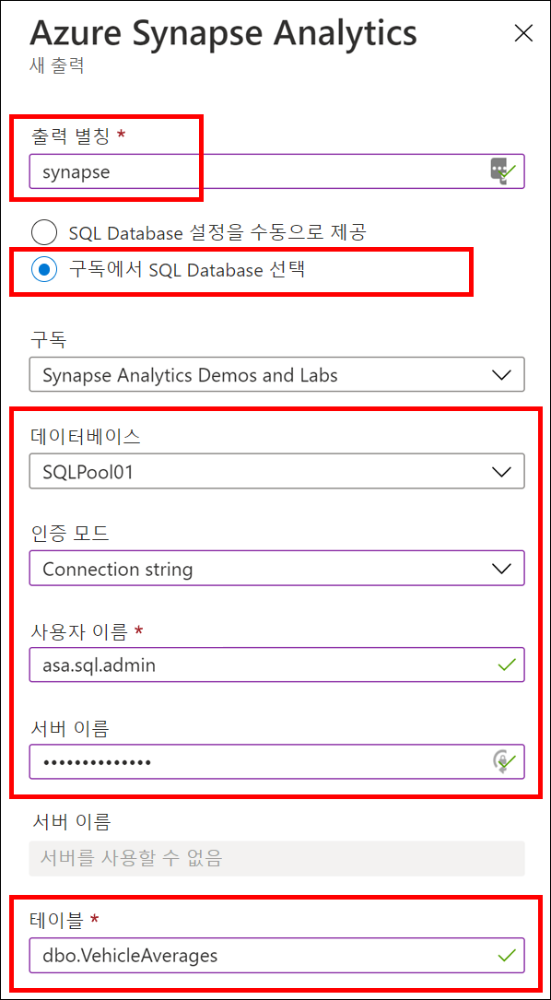

        > **참고:** SQL 관리자 사용자 이름이 확실치 않으면 Azure 리소스 그룹에서 Synapse 작업 영역으로 이동합니다. SQL 관리자 사용자 이름이 개요 창에 표시됩니다.

        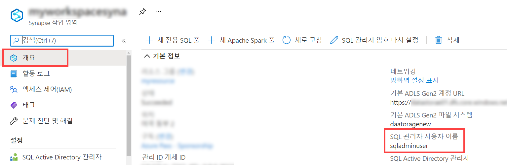

12. 값을 모두 입력한 후 양식 아래쪽의 **저장**을 선택합니다.

13. Stream Analytics 작업 블레이드 내의 왼쪽 메뉴 내에서 **쿼리**를 선택합니다.

    

14. 다음 쿼리를 입력합니다.

    ```sql
    WITH
    VehicleAverages AS (
        select
            AVG(engineTemperature) averageEngineTemperature,
            AVG(speed) averageSpeed,
            System.TimeStamp() as snapshot
        FROM
            eventhub TIMESTAMP BY [timestamp]
        GROUP BY
            TumblingWindow(Duration(minute, 2))
    )
    -- INSERT INTO SYNAPSE ANALYTICS
    SELECT
        *
    INTO
        synapse
    FROM
        VehicleAverages
    ```

    

    이 쿼리는 2초 동안의 엔진 온도와 속도 평균을 계산합니다. **TumblingWindow(Duration(minute, 2))** 를 사용하여 지난 2분 동안의 모든 차량 평균 엔진 온도 및 속도도 집계한 다음 **synapse** 출력에 해당 필드를 표시합니다.

15. 쿼리 업데이트를 완료한 후 위쪽 도구 모음에서 **쿼리 저장**을 선택합니다.

16. Stream Analytics 작업 블레이드 내의 왼쪽 메뉴 내에서 **개요**를 선택합니다. 개요 블레이드의 위쪽에서 **시작**을 선택합니다.

    

19. 작업 시작 블레이드가 표시되면 작업 출력 시작 시간으로 **지금**을 선택하고 **시작**을 선택합니다. 그러면 Stream Analytics 작업이 시작되어 이벤트를 처리하여 Azure Synapse Analytics로 전송하는 과정을 시작할 수 있는 상태가 됩니다.

    

## 연습 2 - 데이터 생성 및 집계

### 작업 1: 데이터 생성기 실행

데이터 생성기 콘솔 애플리케이션은 다양한 차량(VIN(차량 ID 번호)으로 표시됨)을 대상으로 시뮬레이션된 차량 센서 원격 분석을 작성하여 Event Hubs로 직접 전송합니다. 데이터 생성기가 이 과정을 정상적으로 진행할 수 있도록 하려면 먼저 이벤트 허브 연결 문자열을 사용하여 데이터 생성기를 구성해야 합니다.

이 작업에서는 데이터 생성기를 구성 및 실행합니다. 데이터 생성기는 Event Hubs에 시뮬레이션된 차량 원격 분석 데이터를 저장합니다. 그리고 보강된 데이터를 집계 및 분석하여 Synapse Analytics에 전송하라는 알림을 Stream Analytics 작업에 전송합니다.

1. 랩 VM에서 Windows 탐색기를 사용하여 **c:\dp-203\data-engineering-ilt-deployment\Allfiles** 폴더를 봅니다.
2. **TransactionGenerator.zip** 아카이브를 **TransactionGenerator**라는 하위 폴더에 압축 해제합니다.
3. 압축을 푼 **TransactionGenerator** 폴더에서 **appsettings.json** 파일을 엽니다. **EVENT_HUB_CONNECTION_STRING** 옆에 **telemetry** 이벤트 허브 연결 문자열 값을 붙여넣습니다. 다음과 같이 값을 따옴표("")로 묶어야 합니다. 파일을 **저장**합니다.

    

    > **참고:** 연결 문자열이 *EntityPath=telemetry*로 끝나는지 확인하세요(예: *Endpoint=sb://YOUR_EVENTHUB_NAMESPACE.servicebus.windows.net/;SharedAccessKeyName=Write;SharedAccessKey=REDACTED/S/U=;EntityPath=telemetry*). 그렇지 않으면 연결 문자열을 이벤트 허브의 **쓰기** 정책에서 복사하지 않은 것입니다.

    SECONDS_TO_LEAD는 차량 원격 분석 데이터를 전송하기 전에 대기할 시간입니다. 기본값은 0입니다.

    SECONDS_TO_RUN은 데이터 전송을 중지할 때까지 생성기 실행을 허용할 최대 시간입니다. 기본값은 1800입니다. 생성기가 실행 중인 상태에서 Ctrl+C를 누르거나 창을 닫아도 데이터 전송이 중지됩니다.

4. 압축을 푼 **TransactionGenerator** 폴더에서 **TransactionGenerator.exe**를 실행합니다.

5. **Windows가 PC를 보호했음** 대화 상자가 표시되면 **추가 정보**, **실행**을 차례로 선택합니다.

    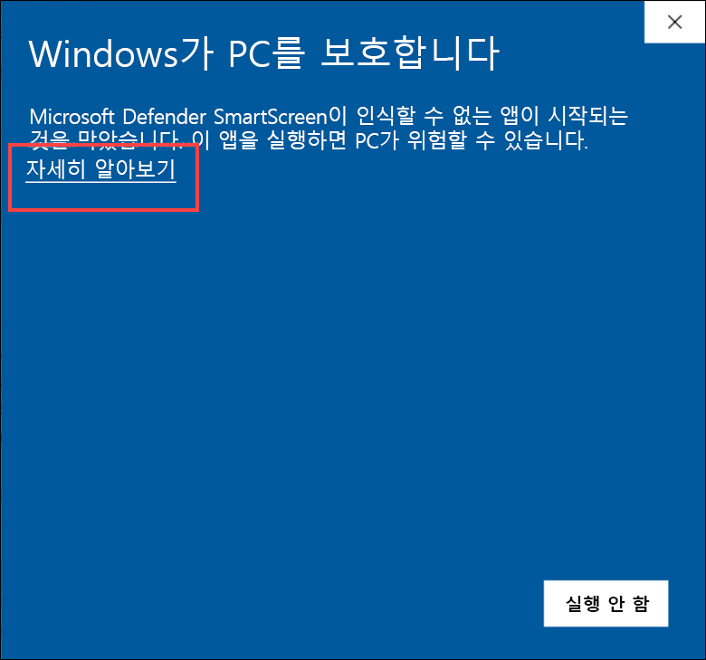

    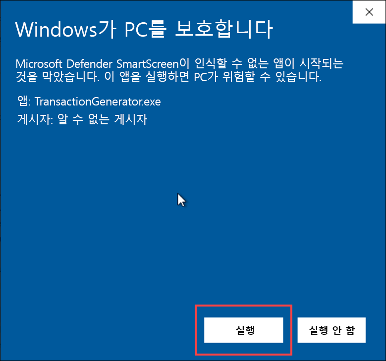

6.  새 콘솔 창이 열리고 몇 초 후에 데이터 전송이 시작됩니다. Event Hubs로 데이터가 전송되고 있음을 확인한 후 창을 _최소화_하여 백그라운드에서 계속 실행합니다. 최소한 3분은 실행되도록 기다린 후에 다음 단계로 이동합니다.

    

    500개 레코드의 전송이 요청될 때마다 출력 통계가 표시됩니다.

### 작업 2: Synapse Analytics에서 집계 데이터 확인

Stream Analytics에서 쿼리를 만들 때 2분 간격으로 엔진 온도 및 차량 속도 데이터를 집계하여 Synapse Analytics에 해당 데이터를 저장했습니다. 즉, Stream Analytics 쿼리에서는 서로 다른 간격으로 여러 출력에 데이터를 쓸 수 있습니다. Synapse Analytics 전용 SQL 풀에 데이터를 쓰면 ETL/ELT 프로세스를 진행하지 않고도 데이터 웨어하우스의 일부분으로 기록 집계 데이터와 최신 집계 데이터를 모두 보존할 수 있습니다.

이 작업에서는 Synapse Analytics 내에서 변칙 데이터를 확인합니다.

1. Synapse Studio의 왼쪽 메뉴에서 **데이터**를 선택하여 데이터 허브로 이동합니다.

    

2. **작업 영역** 탭을 선택하고, **SQLPool01** 데이터베이스를 확장하고, **테이블**을 확장한 다음 **dbo.VehicleAverages** 테이블을 마우스 오른쪽 단추로 클릭합니다(목록에 테이블이 보이지 않으면 테이블 목록을 새로 고침). **새 SQL 스크립트**, **상위 100개 행 선택**을 차례로 선택합니다.

    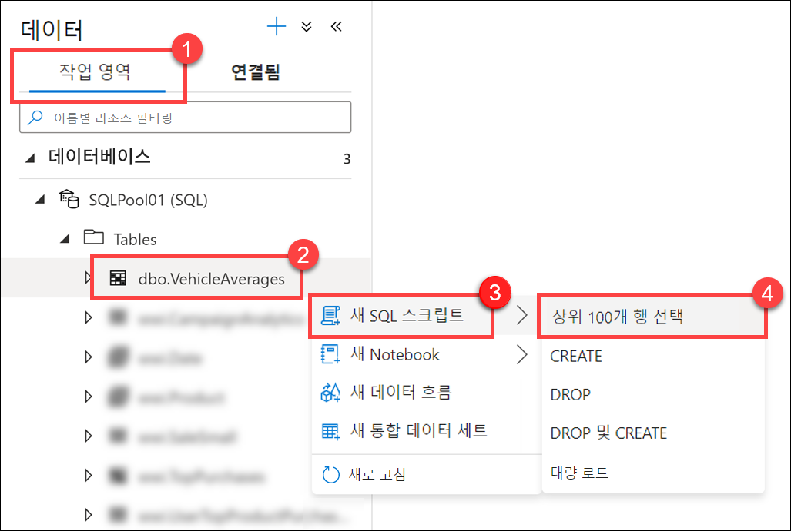

3. 쿼리를 실행하고 결과를 봅니다. **AverageEngineTemperature** 및 **AverageSpeed**에 저장된 집계 데이터를 관찰합니다. 이 두 레코드에서는 **Snapshot** 값이 2분 간격으로 변경됩니다.

   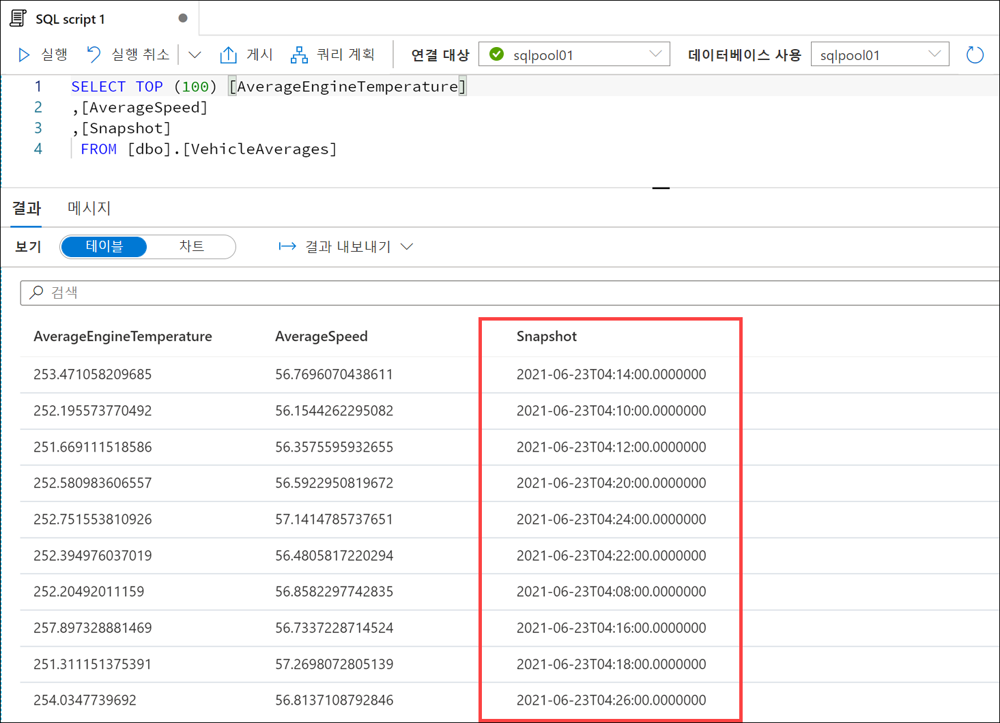

4. 결과 출력에서 **차트** 뷰를 선택하고 차트 종류를 **영역**으로 설정합니다. 이 시각화에는 시간별 평균 온도와 상관 관계가 지정된 평균 엔진 온도가 표시됩니다. 여러 차트 설정을 적용해 보시기 바랍니다. 데이터 생성기가 더 오래 실행되도록 더 많은 데이터 포인트가 생성됩니다. 다음 시각화는 10분 넘게 실행된 세션의 예이며, 사용자 화면에 나타나는 것과 다를 수 있습니다.

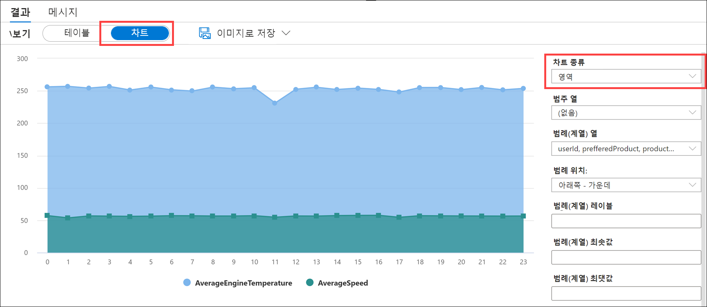

## 중요: 정리

다음 단계를 완료하여 데이터 생성기를 중지하고 더 이상 필요없는 리소스를 정리할 수 있습니다.

### 작업 1: 데이터 생성기 중지

1. 데이터 생성기가 실행 중인 콘솔/터미널 창으로 돌아갑니다. 생성기를 중지하려면 창을 닫습니다.

### 작업 2: Streaming Analytics 작업 중지

1. Azure Portal에서 Stream Analytics 작업으로 이동합니다.

2. 개요 창에서 **중지**를 선택한 다음 메시지가 표시되면 **예**를 선택합니다.

    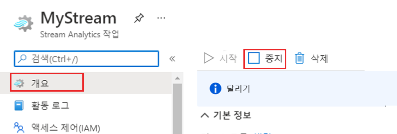

### 작업 3: 전용 SQL 풀 일시 중지

다음 단계를 완료하여 더 이상 필요없는 리소스를 정리할 수 있습니다.

1. Synapse Studio에서 **관리** 허브를 선택합니다.
2. 왼쪽 메뉴에서 **SQL 풀**을 선택합니다. **SQLPool01** 전용 SQL 풀을 커서로 가리키고 다음을 선택합니다. **||**.

    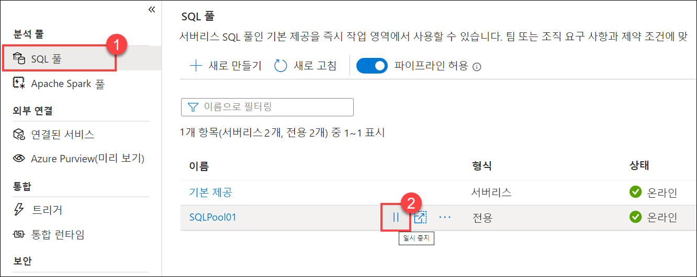

3. 메시지가 표시되면 **일시 중지**를 선택합니다.
