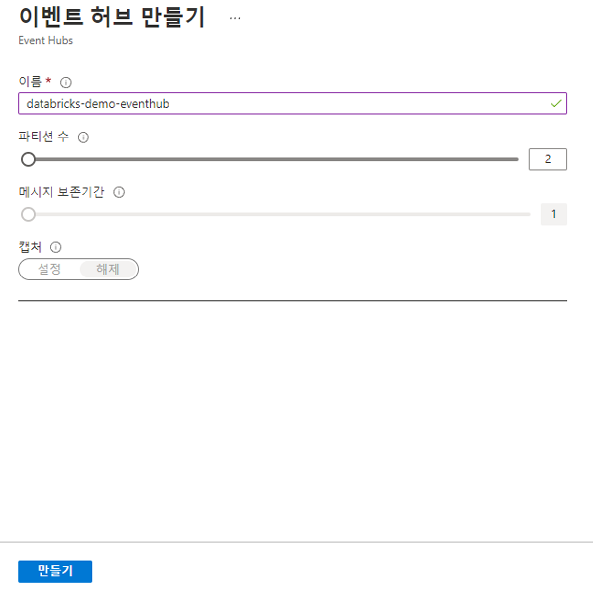
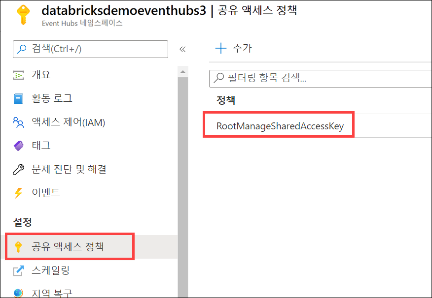
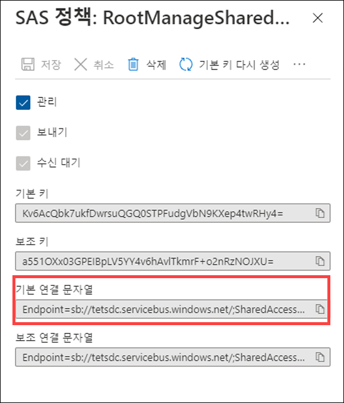

---
lab:
    title: 'Event Hubs 및 Azure Databricks를 사용하여 스트림 처리 솔루션 만들기'
    module: '모듈 11'
---

# 랩 11 - Event Hubs 및 Azure Databricks를 사용하여 스트림 처리 솔루션 만들기

이 랩에서는 Azure Databricks의 Spark 구조적 스트리밍 및 Event Hubs를 사용하여 스트리밍 데이터를 대규모로 수집 및 처리하는 방법을 알아봅니다. 그리고 구조적 스트리밍의 주요 기능 및 사용 방식을 알아봅니다. 또한 슬라이딩 윈도우를 사용해 데이터 청크를 집계하고, 워터마크를 적용해 부실 데이터를 제거합니다. 그리고 마지막으로 Event Hubs에 연결해 스트림 읽기와 쓰기를 수행합니다.

이 랩을 마치면 다음과 같은 역량을 갖추게 됩니다.

- 구조적 스트리밍의 주요 기능 및 사용 방식 확인
- 파일에서 데이터를 스트리밍한 다음 분산 파일 시스템에 기록
- 슬라이딩 윈도우를 사용하여 모든 데이터가 아닌 데이터 청크 집계
- 워터마크를 적용해 부실 데이터 제거
- Event Hubs에 연결해 스트림 읽기 및 쓰기 수행

## 개념

Apache Spark Structured Streaming은 빠르고 확장 가능하며 내결함성 스트림 처리 API입니다. 이를 사용하여 스트리밍 데이터에 대한 분석을 거의 실시간으로 수행할 수 있습니다.

Structured Streaming을 사용하면 SQL 쿼리를 통해 정적 데이터를 처리하는 것과 동일한 방식으로 스트리밍 데이터를 처리할 수 있습니다. API는 마지막 데이터를 지속적으로 증분하고 업데이트합니다.

### Event Hubs 및 Spark Structured Streaming

Azure Events Hubs는 수백만 개의 데이터를 단 몇 초 만에 처리하는 확장성 있는 실시간 데이터 수집 서비스입니다. 여러 원본에서 대량의 데이터를 받고 준비된 데이터를 Azure Data Lake 또는 Azure Blob Storage로 스트림할 수 있습니다.

Azure Event Hubs는 Spark Structured Streaming과 통합되어 메시지를 거의 실시간으로 처리할 수 있습니다. Structured Streaming 쿼리 및 Spark SQL을 사용하여 처리된 데이터를 있는 그대로 쿼리하고 분석할 수 있습니다.

### 스트리밍 개념

스트림 처리는 새 데이터를 Data Lake 스토리지에 지속적으로 통합하고 결과를 계산하는 작업입니다. 스트리밍 데이터는 기존 일괄 처리 관련 처리 기법을 사용할 때보다 빠르게 제공됩니다. 데이터 스트림은 지속적으로 데이터를 추가하는 테이블로 취급됩니다. 이러한 데이터의 예로 은행 카드 거래, IoT(사물 인터넷) 디바이스 데이터 및 비디오 게임 재생 이벤트가 있습니다.

스트리밍 시스템을 구성하는 요소는 다음과 같니다.

- 입력 원본(예: Kafka, Azure Event Hubs, IoT Hub, 분산형 시스템의 파일 또는 TCP-IP 소켓)
- 구조적 스트리밍, forEach 싱크, 메모리 싱크 등을 사용하여 스트림 처리

## 랩 설정 및 필수 구성 요소

이 랩을 시작하기 전에 랩 환경을 만드는 설정 단계를 성공적으로 완료했는지 확인하세요.

## 연습 1 - Structured Streaming Concepts 살펴보기

### 작업 1: Databricks 보관 파일 복제

1. 현재 Azure Databricks 작업 영역이 열려 있지 않은 경우 Azure Portal에서 배포된 Azure Databricks 작업 영역으로 이동하고 **작업 영역 시작**을 선택합니다.
1. 왼쪽 창에서 **컴퓨팅**을 선택합니다. 기존 클러스터가 있으면 실행 중인지 확인합니다(필요하면 시작해야 함). 기존 클러스터가 없으면 최신 런타임 및 **Scala 2.12** 이상을 사용하는 단일 노드 클러스터를 만듭니다.
1. 클러스터가 실행 중이면 왼쪽 창에서 **작업 영역** > **사용자**를 선택하고, 사용자 이름(집 모양 아이콘이 있는 항목)을 선택합니다.
1. 표시되는 창에서 이름 옆에 있는 화살표를 선택한 다음 **가져오기**를 선택합니다.

    

1. **Notebook 가져오기** 대화 상자에서 URL을 선택하고, 다음 URL에 붙여넣습니다.

 ```
   https://github.com/MicrosoftLearning/DP-203-Data-Engineer/raw/master/Allfiles/microsoft-learning-paths-databricks-notebooks/data-engineering/DBC/10-Structured-Streaming.dbc
 ```

1. **가져오기**를 선택합니다.
1. 표시되는 **10-Structured-Streaming** 폴더를 선택합니다.

### 작업 2: Notebook 완료

1. **1.Structured-Streaming-Concepts** otebook을 엽니다. 지침에 따라 내부에서 셀을 실행하기 전에 클러스터를 Notebook에 연결했는지 확인합니다.

   Notebook 내에서 다음을 수행합니다.

   - 파일에서 데이터를 스트리밍한 다음 분산 파일 시스템에 기록
   - 활성 스트림 나열
   - 활성 스트림 중지

## 연습 2 - Time Windows 작업

### 작업 1: Notebook 완료

1. Azure Databricks 작업 영역의 사용자 폴더에서 가져온 **10-Structured-Streaming** 폴더를 엽니다.

2. **2.Time-Windows** Notebook을 엽니다. 지침에 따라 내부에서 셀을 실행하기 전에 클러스터를 Notebook에 연결했는지 확인합니다.

   Notebook 내에서 다음을 수행합니다.

   - 슬라이딩 윈도우를 사용하여 모든 데이터가 아닌 데이터 청크 집계
   - 보관할 공간이 없는 오래된 이전 데이터를 버리려면 워터마크 처리를 적용합니다.
   - `display`를 사용하여 라이브 그래프 그리기

## 연습 3 - Azure EventHubs에서 Structured Streaming 사용

### 작업 1: 이벤트 허브 만들기

1. Azure Portal(<https://portal.azure.com>)에서, 이 과정의 Azure 리소스를 포함하고 있는 **data-engineering-synapse-*xxxxxxx*** 리소스 그룹에서 **eventhub*xxxxxxx*** Event Hub 네임스페이스를 엽니다.
2. 도구 모음에서 **+ 이벤트 허브** 단추를 선택하여 새 이벤트 허브를 추가합니다.
3. **이벤트 허브 만들기** 창에서 다음 세부 정보로 새 이벤트 허브를 만듭니다.

   - **이름**: `databricks-demo-eventhub`
   - **파티션 수**: `2`
   - **메시지 보존**: `1`
   - **캡처**: *끄기*

   **만들기**를 선택합니다.

   

### 작업 2: 공유 액세스 정책에 대한 연결 문자열의 기본 키 복사

1. Event Hubs 네임스페이스의 왼쪽 메뉴에서 **설정** 아래에 있는 **공유 액세스 정책**을 선택하고 **RootManageSharedAccessKey** 정책을 선택합니다.

   

2. 복사 단추를 선택하여 기본 키의 연결 문자열을 복사합니다.

   

3. 나중에 참조할 수 있도록 복사한 기본 키를 메모장 또는 다른 텍스트 편집기에 저장합니다.

### 작업 3: 노트북 실행

1. Azure Databricks 작업 영역이 들어 있는 브라우저 탭으로 돌아가고, 사용자 폴더에서 가져온 **10-Structured-Streaming** 폴더를 엽니다.

2. **3.Streaming-With-Event-Hubs-Demo** Notebook을 엽니다. 지침에 따라 내부에서 셀을 실행하기 전에 클러스터를 Notebook에 연결했는지 확인합니다.

   Notebook 내에서 다음을 수행합니다.

   - Event Hubs에 연결하고 이벤트 허브에 스트림 작성
   - 이벤트 허브에서 스트림 읽기
   - JSON 페이로드의 스키마를 정의하고 데이터를 구문 분석하여 테이블에 표시

## 클러스터 종료

1. 랩을 완료한 후에 왼쪽 창에서 **컴퓨팅**을 선택하고 클러스터를 선택합니다. 그런 다음에 **종료**를 선택하여 클러스터를 종료합니다.
